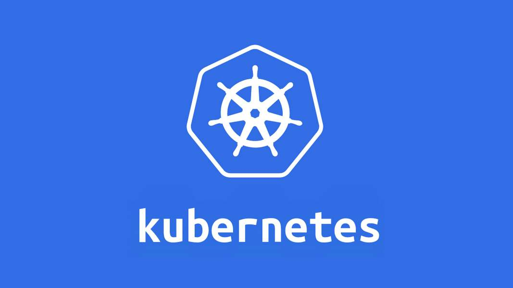
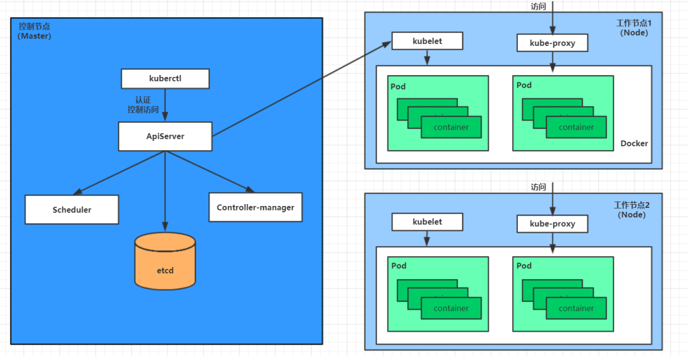

# 5分钟带你弄懂什么是K8s

## K8s 是什么？
K8S 是单词 **Kubernetes **的缩写，是用于自动部署、扩缩和管理容器化应用程序的开源系统，K8s 源自[Google 15 年生产环境的运维经验](http://queue.acm.org/detail.cfm?id=2898444)，同时凝聚了社区的最佳创意和实践。

## K8s 是用来解决什么问题的？
K8S在基于容器部署的方式上，提供了一个弹性分布式的框架，支持服务发现与负载均衡、存储、自动部署回滚、自动计算与调度、自动扩缩容等等一系列操作，目的是方便开发者不再需要关注服务运行细节，K8S能够自动进行容器与Pod调度、扩缩容、自动重建等等操作，保证服务尽可能健康的运行。

---

这样可能不够直观，问大家几个问题就知道 K8s 是用来干什么的了？

- 某个容器发生故障，这个时候我们是不是该启动另一个容器？
- 某台机器负载过高，那么我们之后的容器是不是不能部署在这台机器上？
- 某个服务请求量突增，我们是不是应该多部署几个运行该服务的容器？
- 如果某些容器之间需要相互配合怎么办？比如容器A需要容器B的资源，所以容器A一定要在容器B之后运行。
- 运行多个容器时，我怎么做到它们的运行结果是原子性的？即要么全部成功，或者全部失败。亦或者如果某一个容器失败，我能够不断重启这个容器以达到我的预期状态。

以上问题，都可以交给K8S来解决，它提供了一系列的功能来帮助我们**轻松管理和编排**容器，以达到我们的预期状态，简单来说，**K8S解放了开发者的双手，能够最大程度的让部署的服务健康运行，同时能够接入很多第三方工具（如服务监控、数据采集等等），满足开发者的定制化需求。**

## K8s 的工作原理

一个 kubernetes 集群主要是由**控制节点 master**、**工作节点 node**构成，每个节点上都会安装不同的组件。
**master：集群的控制平面，负责集群的决策 ( 管理 )**
Master 节点上会安装四个重要组件，分别如下：
> **ApiServer** : 资源操作的唯一入口，接收用户输入的命令，提供认证、授权、API注册和发现等机制
> **Scheduler** : 负责集群资源调度，按照预定的调度策略将 Pod 调度到相应的 node 节点上
> **ControllerManager** : 负责维护集群的状态，比如程序部署安排、故障检测、自动扩展、滚动更新等
> **Etcd** ：负责存储集群中各种资源对象的信息，相当于 K8S 的数据库

**Node：集群的数据平面，负责为容器提供运行环境 ( 干活 )**
Node 节点上会安装三个重要组件，分别如下：
> **Kubelet** : 负责维护容器的生命周期，即通过控制docker，来创建、更新、销毁容器
> **KubeProxy** : 负责提供集群内部的服务发现和负载均衡
> **Docker** : 负责节点上容器的各种操作

**Pod**
> Pod是最小调度单元
> Pod里面会包含一个或多个容器（Container）
> Pod内的容器共享存储及网络，可通过localhost通信

> 原文: <https://www.yuque.com/tulingzhouyu/db22bv/vt4awxuy53tz3kx7>