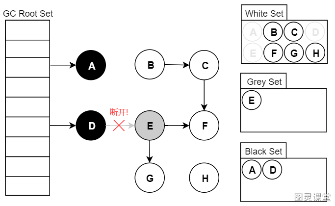

# 深入精讲

# 1.前言
三色标记算法，用于垃圾回收器升级，将STW变为并发标记。STW就是在标记垃圾的时候，必须暂停程序，而使用并发标记，就是程序一边运行，一边标记垃圾。

# 2. 三色标记算法

## 2.1.什么是三色：
首先我们需要知道三色标记法就是根据可达性分析，从GC Roots开始进行遍历访问，在遍历对象过程中，按“是否检查过”这个条件将对象标记成三种颜色：

- **黑色**： **代表对象已经检查过，且成员对象也被检查过了**。如果有其他对象引用指向了黑色对象，无须重新检查一遍。黑色对象不可能直接（不经过灰色对象）指向某个白色对象。 
- **灰色**：**代表对象已经检查过，但成员还没全部检查完成**。
- **白色**：**代表对象没有被检查**。 在可达性分析刚刚开始的阶段， 所有的对象都是白色的， 若在分析结束的阶段， 仍然是白色的对象， 即代表不可达。 

## 2.2.三色标记过程：

假设现在有白、灰、黑三个集合（表示当前对象的颜色），其遍历访问过程为：

1. 初始时，所有对象都在【白色集合】中；
2. 将 GC Roots直接引用到的对象挪到【灰色集合】中；
3. 从灰色集合中获取对象：

3.1. 将本对象引用到的其他对象全部挪到【灰色集合】中； 
3.2. 将本对象挪到【黑色集合】里面。

4. 重复步骤3，直至【灰色集合】为空时结束。
5. 结束后，仍在【白色集合】的对象即为GC Roots不可达，可以进行回收。

需要注意，传统标记方式发生Stop The World时，对象间的引用是不会发生变化的，可以轻松完成标记。
而并发标记在标记期间应用线程还在继续跑，对象间的引用可能发生变化，就会出现错标和漏标的情况就有可能发生。

# 3.存在的问题

## 3.1.浮动垃圾：标记过不是垃圾的，变成了垃圾
并发标记的过程中，若一个已经被标记成黑色或者灰色的对象，突然变成了垃圾，此时，此对象不是白色的不会被清除，重新标记也不能从GC Root中去找到，所以成为了浮动垃圾，这种情况对系统的影响不大，留给下一次GC进行处理即可。

## 3.2.对象漏标问题：需要的对象被回收
并发标记的过程中，一个业务线程将一个未被扫描过的白色对象断开引用成为垃圾（删除引用），同时黑色对象引用了该对象（增加引用）（这两部可以不分先后顺序）；
因为黑色对象的含义为其属性都已经被标记过了，重新标记也不会从黑色对象中去找，导致该对象被程序所需要，却又要被GC回收，此问题会导致系统出现问题。

# 4.总结
三色标记算法是根可达算法的一种实现方案，其目的是为了找出所有可达对象。三色标记算法会产生多标和漏标问题，其中漏标问题最严重。漏标问题会导致本该存活的对象被回收，从而导致严重的程序问题。

> 原文: <https://www.yuque.com/tulingzhouyu/db22bv/fexluxb43wnh7o9z>