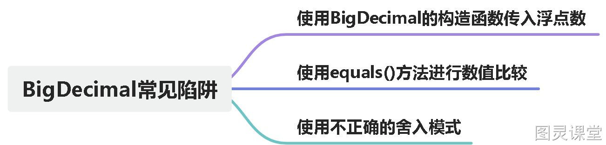

# BigDecimal的常见陷阱


# BigDecimal概述
**BigDecimal 是 Java 中的一个类，用于精确表示和操作任意精度的十进制数。它提供了高精度的数值计算，并且可以避免浮点数计算中常见的精度丢失问题。**
**它提供了大量的方法来支持基本的数学运算，如加法、减法、乘法、除法等。它还支持比较操作和取整操作，可以设置小数位数、舍入模式等。此外，BigDecimal 还提供了一些其他功能，如转换为科学计数法、格式化输出、判断是否是整数等。**
**适用场景：需要处理精确计算或防止浮点数计算精度丢失的场景。**

# BigDecimal常见陷阱

## 1.使用BigDecimal的构造函数传入浮点数
**其实这个问题我们在使用Float、Double等浮点类型进行计算时，也会经常遇到，比如说下面这个代码**
```java
@Test
public void bigDecimalDemo1() {
    float float1 = 1;
    float float2 = 0.9f;
    System.out.println(float1 - float2);
}
```
**输出结果是多少呢？0.1？不是，输出结果是0.100000024。因为 0.9 无法被精确表示为有限位数的二进制小数。在转换为二进制时可能会产生近似值。因此，在进行减法运算时，实际上是对近似值进行计算，而不是对准确的 0.9 进行计算。这导致了精度丢失，最终的计算结果也是一个近似值。因此，输出结果不是准确的 0.1，而是一个近似值。**
**小伙伴肯定能想到使用BigDecimal来避免这个问题，这时候第一个需要避免的陷阱就来了。看以下代码：**
```java
@Test
public void bigDecimalDemo2(){
    BigDecimal bigDecimal1 = new BigDecimal(0.01);
    BigDecimal bigDecimal2 = BigDecimal.valueOf(0.01);
    System.out.println("bigDecimal1 = " + bigDecimal1);
    System.out.println("bigDecimal2 = " + bigDecimal2);
}
```
**输出结果如下：**
:::tips
**bigDecimal1 = 0.01000000000000000020816681711721685132943093776702880859375**
**bigDecimal2 = 0.01**
:::
**观察输出结果我们可以知道，使用BigDecimal时同样会有精度的问题。所以我们在创建BigDecimal对象时，有初始值使用BigDecimal.valueOf()的方式，可以避免出现精度问题。**

### 为什么会出现差异？
**在使用new BigDecimal()实际上是将 0.01 转换为二进制近似值，并将其存储为 BigDecimal 对象。因此，结果中存在微小的误差，即输出结果为0.01000000000000000020816681711721685132943093776702880859375。**
**而BigDecimal.valueOf()不同，其内部是先将double转为String，因此不存在精度问题。**
```java
public static BigDecimal valueOf(double val) {
    // Reminder: a zero double returns '0.0', so we cannot fastpath
    // to use the constant ZERO.  This might be important enough to
    // justify a factory approach, a cache, or a few private
    // constants, later.
    return new BigDecimal(Double.toString(val));
}
```
**TIPS：**
:::tips

1. 使用整数或长整数作为参数构造： 
   - BigDecimal(int val)：使用一个 int 类型的整数值创建 BigDecimal。
   - BigDecimal(long val)：使用一个 long 类型的整数值创建 BigDecimal。

 

2. 使用字符串作为参数构造： 
   - BigDecimal(String val)：使用一个字符串表示的数值创建 BigDecimal。该字符串可以包含整数部分、小数部分和指数部分。

 

3. 使用双精度浮点数作为参数构造： 
   - BigDecimal(double val)：使用一个 double 类型的浮点数值创建 BigDecimal。注意，由于浮点数精度可能丢失，建议使用字符串或其他方法构造 BigDecimal，以避免精度损失问题。

 

4. 使用基于 BigInteger 的构造方法： 
   - BigDecimal(BigInteger val)：使用一个 BigInteger 对象来创建 BigDecimal。

 
:::

## 2.使用equals()方法进行数值比较
**日常项目我们是如何进行BigDecimal数值比较呢？使用equals方法还是compareTo方法？如果使用的是equals方法，那就需要注意啦。看一下示例：**
```java
@Test
public void bigDecimalDemo3(){
    BigDecimal bigDecimal1 = new BigDecimal("0.01");
    BigDecimal bigDecimal2 = new BigDecimal("0.010");
    System.out.println(bigDecimal1.equals(bigDecimal2));
    System.out.println(bigDecimal1.compareTo(bigDecimal2));
}
```
**输出结果如下：**
:::tips
**false**
**0**
:::
**观察结果可以知道使用equals比较结果是不相等的；compareTo的结果为0代表两个数相等；**

- **compareTo实现了Comparable接口，比较的是值的大小，返回的值为-1-小于，0-等于，1-大于。**

### 为什么equals返回的是false？
```java
public boolean equals(Object x) {
    if (!(x instanceof BigDecimal))
        return false;
    BigDecimal xDec = (BigDecimal) x;
    if (x == this)
        return true;
    if (scale != xDec.scale)
        return false;
    long s = this.intCompact;
    long xs = xDec.intCompact;
    if (s != INFLATED) {
        if (xs == INFLATED)
            xs = compactValFor(xDec.intVal);
        return xs == s;
    } else if (xs != INFLATED)
        return xs == compactValFor(this.intVal);

    return this.inflated().equals(xDec.inflated());
}
```
**我们观察equals的实现逻辑可以知道，BigDecimal重写了equals方法，重写后的关键代码：**
:::tips
if (scale != xDec.scale)
        return false;
:::
**也就是会比较两个数值的精度，精度不同返回false。**

## 3.使用不正确的舍入模式
**使用BigDecimal进行运算时，一定要正确的使用舍入模式，避免舍入误差引起的问题，并且有时候出现结果是无限小数，程序会抛出异常，比如说：**
```java
@Test
public void bigDecimalDemo4(){
    BigDecimal bigDecimal1 = new BigDecimal("1.00");
    BigDecimal bigDecimal2 = new BigDecimal("3.00");
    BigDecimal bigDecimal3 = bigDecimal1.divide(bigDecimal2);
    System.out.println(bigDecimal3);
}
```
**输出结果如下：**
:::tips
java.lang.ArithmeticException: Non-terminating decimal expansion; no exact representable decimal result.
:::
**简单的来说，如果在除法运算过程中，其结果是一个无限小数，而操作的结果预期是一个精确的数字，那么将会抛出ArithmeticException异常。**
**此时，我们只要正确指定结果精度即可：**
```java
@Test
public void bigDecimalDemo4(){
    BigDecimal bigDecimal1 = new BigDecimal("1.00");
    BigDecimal bigDecimal2 = new BigDecimal("3.00");
    BigDecimal bigDecimal3 = bigDecimal1.divide(bigDecimal2, 2, RoundingMode.HALF_UP);
    System.out.println(bigDecimal3);
}
```
**输出结果如下：**
:::tips
0.33
:::

### TIPS：
:::tips

- **RoundingMode.UP：向远离零的方向舍入**
- **RoundingMode.DOWN：向靠近零的方向舍入**
- **RoundingMode.CEILING：向正无穷方向舍入**
- **RoundingMode.FLOOR：向负无穷方向舍入**
- **RoundingMode.HALF_UP：四舍五入，如果舍弃部分大于等于 0.5**
- **RoundingMode.HALF_DOWN：四舍五入，如果舍弃部分大于 0.5**
- **RoundingMode.HALF_EVEN：银行家舍入法，遵循 IEEE 754 标准**
:::

# 总结：



- **尽量使用字符串而非浮点类型来构造 BigDecimal 对象，以避免浮点数转换精度问题。**
- **如果无法避免使用浮点类型，则可使用 BigDecimal.valueOf 方法来构造初始化值，以确保精确表示。**
- **比较两个 BigDecimal 值的大小时，使用 compareTo 方法。如果需要严格限制精度的比较，可以考虑使用 equals 方法。**
- **在进行 BigDecimal 运算前，明确指定精度和舍入模式。使用 setScale 方法设置精度，使用 setRoundingMode 方法设置舍入模式。**


> 原文: <https://www.yuque.com/tulingzhouyu/db22bv/qtfa4uwv3pbe3c52>