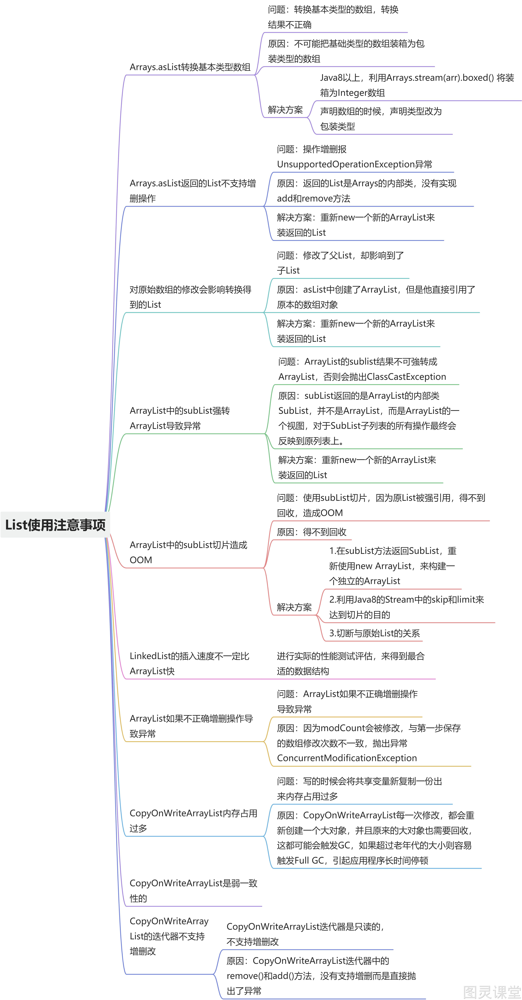
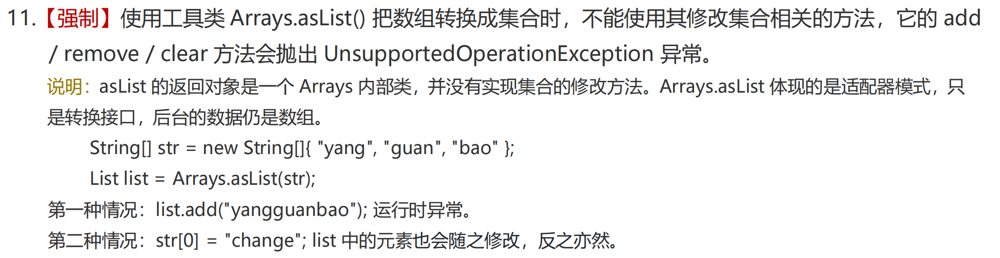
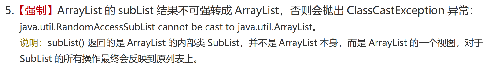
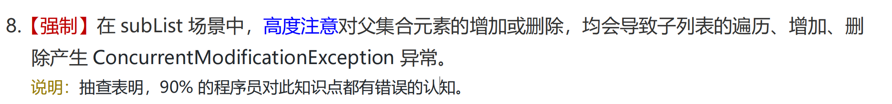
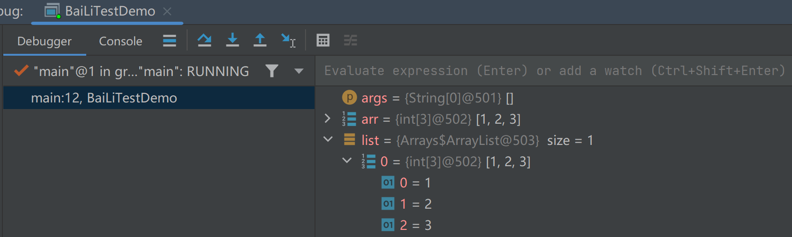
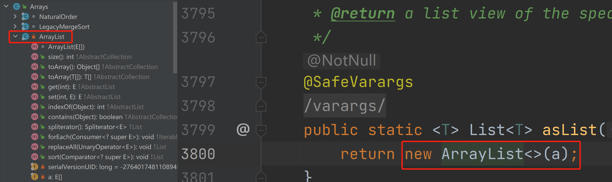
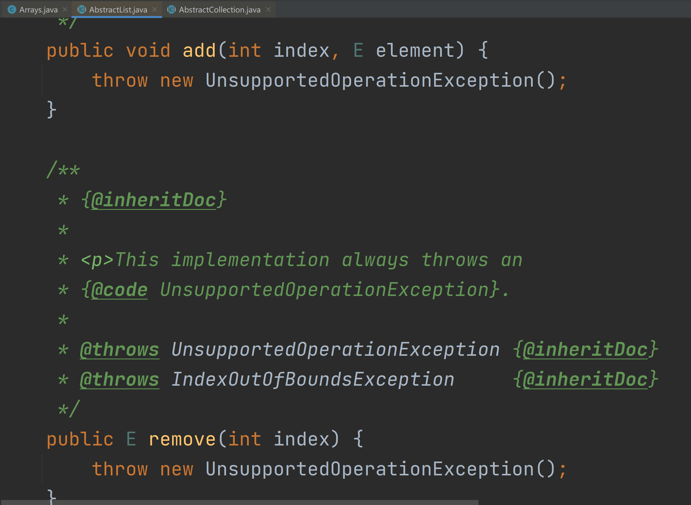
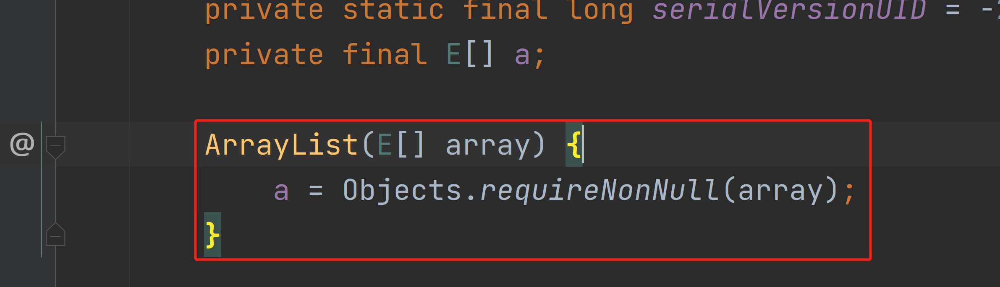
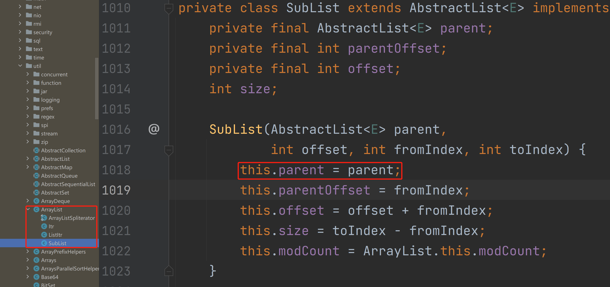

# List操作的一些常见问题



# 阿里巴巴开发手册强制规约：




# 1. Arrays.asList转换基本类型数组
在实际的业务开发中，我们通常会进行数组转List的操作，通常我们会使用Arrays.asList来进行转换，但是在转换基本类型的数组的时候，却出现转换的结果和我们想象的不一致。
```java
import java.util.Arrays;
import java.util.List;

/**
 * Arrays.asList数组常见问题
 * @author 百里
 */
public class BaiLiTestDemo {
    public static void main(String[] args) {
        int[] arr = {1, 2, 3};
        List list = Arrays.asList(arr);
        System.out.println("list.size：" + list.size());
        for (int i = 0; i < list.size(); i++) {
            System.out.println("循环打印：" + list.get(i));
        }
    }
}
```
观察下asList的实现，可以看到是入参是使用的是泛型，所以会将{1, 2, 3}三个整数放入一个泛型列表中返回。
```java
public static List asList(T... a) {
    return new ArrayList<>(a); 
}
```

那我们该如何解决呢？只需要在声明数组的时候，声明类型改为包装类型。
```java
import java.util.Arrays;
import java.util.List;

/**
 * Arrays.asList数组常见问题
 * @author 百里
 */
public class BaiLiTestDemo {
    public static void main(String[] args) {
        Integer[] arr = {1, 2, 3};
        List list = Arrays.asList(arr);
        System.out.println("list.size：" + list.size());//size = 3
        for (int i = 0; i < list.size(); i++) {
            System.out.println("循环打印：" + list.get(i));
        }
    }
}
```
这就是第一个坑了，然而Arrays.asList不止这一个需要注意的问题，我们继续往下看：

# 2. Arrays.asList返回的List不支持增删操作
我们接着上面的demo，增加list加减的逻辑，运行demo会提示UnsupportedOperationException：
```java
import java.util.Arrays;
import java.util.List;

/**
 * Arrays.asList数组常见问题
 * @author 百里
 */
public class BaiLiTestDemo {
    public static void main(String[] args) {
        Integer[] arr = {1, 2, 3};
        List list = Arrays.asList(arr);
        System.out.println("list.size：" + list.size());
        list.add(4);
    }
}
```
为什么会这样？我们看下asList的实现，它返回的ArrayList是Arrays的内部类，而不是我们通常使用的java.util.ArrayList：

可以看到内部类中的ArrayList没有add()与remove()，那我们怎么可以使用增减方法呢，继续往下看：

可以看到ArrayList继承了AbstractList类，我们观察AbstractList类的add()与remove()：

现在是不是就理解Arrays.asList返回的List不支持增删操作了。

# 3. 对原始数组的修改会影响到我们获得的那个List
基于第一个demo我们继续改造，修改原arr[0]=10，这个时候打印Arrays.asList返回的list值也发生了改变：
```java
import java.util.Arrays;
import java.util.List;

/**
 * Arrays.asList数组常见问题
 * @author 百里
 */
public class BaiLiTestDemo {
    public static void main(String[] args) {
        Integer[] arr = {1, 2, 3};
        List list = Arrays.asList(arr);
        System.out.println("list.size：" + list.size());
        arr[0] = 10;//修改原数组
        for (int i = 0; i < list.size(); i++) {
            System.out.println("循环打印：" + list.get(i));
        }
    }
}
```
为什么呢？观察ArrayList的实现，可以知道asList创建了 ArrayList，但它直接引用原本的数据组对象。所以只要原本的数组对象一发生变化，List也跟着变化。

解决方案：new一个新的ArrayList装Arrays.asList返回数据。
```java
import java.util.ArrayList;
import java.util.Arrays;
import java.util.List;

/**
 * Arrays.asList数组常见问题
 * @author 百里
 */
public class BaiLiTestDemo {
    public static void main(String[] args) {
        Integer[] arr = {1, 2, 3};
        List list = new ArrayList<>(Arrays.asList(arr));
        arr[0] = 10;
        for (int i = 0; i < list.size(); i++) {
            System.out.println("循环打印：" + list.get(i));
        }
    }
}
```

# 4. ArrayList.subList强转ArrayList导致异常
当使用ArrayList.subList的返回list强转ArrayList时，会出现java.lang.ClassCastException，看以下代码：
```java
import java.util.ArrayList;
import java.util.List;

/**
 * ArrayList.subList常见问题
 * @author 百里
 */
public class BaiLiArrayListDemo {
    public static void main(String[] args) {
        List<String> names = new ArrayList<String>() {{
            add("one");
            add("two");
            add("three");
        }};
        ArrayList strings = (ArrayList) names.subList(0, 1);
        System.out.println(strings);
    }
}
```
```java
Exception in thread "main" java.lang.ClassCastException: java.util.ArrayList$SubList cannot be cast to java.util.ArrayList
	at BaiLiArrayListDemo.main(BaiLiArrayListDemo.java:15)
```
同样的，我们看下sublist的实现：

可以看到SubList()实际上没有创建一个新的List，而是直接引用了原来的List，指定了元素的范围。并且返回的是一个内部类实现的SubList对象，该对象只是原始ArrayList的一个引用，而不是一个全新的ArrayList，因此无法直接将其强制转换为ArrayList类型。
由于是引用的原List，因此也会存在asList的问题，也就是针对subList进行增减数据，会影响原List的值。
```java
import java.util.ArrayList;
import java.util.List;

/**
 * ArrayList.subList常见问题
 * @author 百里
 */
public class BaiLiArrayListDemo {
    public static void main(String[] args) {
        List<String> names = new ArrayList<String>() {{
            add("one");
            add("two");
            add("three");
        }};
        List  strings = names.subList(0, 1);
        strings.add(0,"four");
        System.out.println(strings);//[four, one]
        System.out.println(names);//[four, one, two, three]
    }
}
```
需要注意修改原List-names的值会出导致strings的遍历、增加、删除产生ConcurrentModificationException异常。
```java
import java.util.ArrayList;
import java.util.List;

/**
 * ArrayList.subList常见问题
 * @author 百里
 */
public class BaiLiArrayListDemo {
    public static void main(String[] args) {
        List<String> names = new ArrayList<String>() {{
            add("one");
            add("two");
            add("three");
        }};
        List strings = names.subList(0, 1);
        names.add("four");
        System.out.println(strings);
        System.out.println(names);
    }
}
```
```java
Exception in thread "main" java.util.ConcurrentModificationException
	at java.util.ArrayList$SubList.checkForComodification(ArrayList.java:1231)
	at java.util.ArrayList$SubList.listIterator(ArrayList.java:1091)
	at java.util.AbstractList.listIterator(AbstractList.java:299)
	at java.util.ArrayList$SubList.iterator(ArrayList.java:1087)
	at java.util.AbstractCollection.toString(AbstractCollection.java:454)
	at java.lang.String.valueOf(String.java:2994)
	at java.io.PrintStream.println(PrintStream.java:821)
	at BaiLiArrayListDemo.main(BaiLiArrayListDemo.java:17)
```
上面问题的解决方案跟asList同样，直接new一个新的ArrayList装Arrays.subList返回数据就可以了。
```java
import java.util.ArrayList;
import java.util.List;

/**
 * ArrayList.subList常见问题
 * @author 百里
 */
public class BaiLiArrayListDemo {
    public static void main(String[] args) {
        List<String> names = new ArrayList<String>() {{
            add("one");
            add("two");
            add("three");
        }};
        List strings = new ArrayList<>(names.subList(0, 1));
        strings.add("four");
        System.out.println(strings);//[one, four]
        System.out.println(names);//[one, two, three]
    }
}
```

# 5. ArrayList中的subList切片造成OOM
subList所产生的List，其实是对原来List对象的引用，这个产生的List只是原来List对象的视图，也就是说虽然值切片获取了一小段数据，但是原来的List对象却得不到回收，如果这个原来的对象很大，就会出现OOM的情况。我们将VM参数调小：-Xms20m -Xmx40m
```java
import java.util.ArrayList;
import java.util.List;
import java.util.stream.Collectors;
import java.util.stream.IntStream;

/**
 * ArrayList.subList常见问题
 * @author 百里
 */
public class BaiLiArrayListDemo {
    public static void main(String[] args) {
        List data = new ArrayList<>();
        IntStream.range(0, 1000).forEach(i ->{
            List<Integer> collect = 
                    IntStream.range(0, 100000).boxed().
                            collect(Collectors.toList());
            data.add(collect.subList(0, 1));
        });
    }
}
```
出现OOM的原因：原数组无法被回收，会一直在内存中。
解决方案：new一个新的ArrayList接收subList返回。

# 6.Copy-On-Write 是什么？
Copy-On-Write它是一种在计算机科学中常见的优化技术，主要应用于需要频繁读取但很少修改的数据结构上。
简单的说就是在计算机中就是当你想要对一块内存进行修改时，我们不在原有内存块中进行写操作，而是将内存拷贝一份，在新的内存中进行写操作，写完之后呢，就将指向原来内存指针指向新的内存，原来的内存就可以被回收掉了！
既然是一种优化策略，我们看一段代码：
```java
import java.util.ArrayList;
import java.util.Arrays;
import java.util.Iterator;
import java.util.List;

/**
* @author 百里
*/
public class BaiLiIteratorTest {
    private static List<String> list = new ArrayList<>();

    public static void main(String[] args) {
        list.add("1");
        list.add("2");
        list.add("3");
        Iterator<String> iter = list.iterator();
        while (iter.hasNext()) {
            System.err.println(iter.next());
        }
        System.err.println(Arrays.toString(list.toArray()));
    }
}
```
上面的Demo在单线程下执行时没什么毛病，但是在多线程的环境中，就可能出异常，为什么呢？
因为多线程迭代时如果有其他线程对这个集合list进行增减元素，会抛出java.util.ConcurrentModificationException的异常。
我们以增加元素为例子，运行下面这Demo：
```java
import java.util.ArrayList;
import java.util.Iterator;
import java.util.List;
import java.util.concurrent.ExecutorService;
import java.util.concurrent.Executors;

/**
 * 并发迭代器问题示例代码
 * @author 百里
 */
public class BaiLiConcurrentIteratorTest {
    // 创建一个ArrayList对象
    private static List<String> list = new ArrayList<>();

    public static void main(String[] args) throws InterruptedException {
        // 给ArrayList添加三个元素："1"、"2"和"3"
        list.add("1");
        list.add("2");
        list.add("3");

        // 开启线程池，提交10个线程用于在list尾部添加5个元素"121"
        ExecutorService service = Executors.newFixedThreadPool(10);
        for (int i = 0; i < 10; i++) {
            service.execute(() -> {
                for (int j = 0; j < 5; j++) {
                    list.add("121");
                }
            });
        }

        // 使用Iterator迭代器遍历list并输出元素值
        Iterator<String> iter = list.iterator();
        for (int i = 0; i < 10; i++) {
            service.execute(() -> {
                while (iter.hasNext()) {
                    System.err.println(iter.next());
                    try {
                        Thread.sleep(10);
                    } catch (InterruptedException e) {
                        e.printStackTrace();
                    }
                }
            });
        }
        service.shutdown();
    }
}
```
**这里暴露的问题是什么呢？**

- 多线程场景下迭代器遍历集合的读取操作和其他线程对集合进行写入操作会导致出现并发修改异常

解决方案：

- CopyOnWriteArrayList避免了多线程操作List线程不安全的问题

# 7.CopyOnWriteArrayList介绍
从JDK1.5开始Java并发包里提供了两个使用CopyOnWrite机制实现的并发容器，它们是CopyOnWriteArrayList和CopyOnWriteArraySet。CopyOnWrite容器非常有用，可以在非常多的并发场景中使用到。
**CopyOnWriteArrayList原理：**
在写操作(add、remove等)时，不直接对原数据进行修改，而是先将原数据复制一份，然后在新复制的数据上执行写操作，最后将原数据引用指向新数据。这样做的好处是读操作(get、iterator等)可以不加锁，因为读取的数据始终是不变的。
接下来我们就看下源码怎么实现的。

# 8.CopyOnWriteArrayList简单源码解读
add()方法源码：
```java
/**
* Appends the specified element to the end of this list.
*
* @param e element to be appended to this list
* @return {@code true} (as specified by {@link Collection#add})
*/
public boolean add(E e) {
    final ReentrantLock lock = this.lock;//重入锁
	lock.lock();//加锁啦
    try {
        Object[] elements = getArray();
        int len = elements.length;
        Object[] newElements = Arrays.copyOf(elements, len + 1);//拷贝新数组
        newElements[len] = e;
        setArray(newElements);//将引用指向新数组  1
        return true;
    } finally {
        lock.unlock();//解锁啦
    }
}
```
可以看到，CopyOnWriteArrayList中的写操作都需要先获取锁，然后再将当前的元素数组复制一份，并在新复制的元素数组上执行写操作，最后将数组引用指向新数组。
```java
@SuppressWarnings("unchecked")
public E next() {
    if (! hasNext()) //是否存在下一个元素
        throw new NoSuchElementException(); //没有下一个元素，则会抛出NoSuchElementException异常
    //snapshot是一个类成员变量，它是在创建迭代器时通过复制集合内容而获得的一个数组。
    //cursor是另一个类成员变量，初始值为0，并在每次调用next()时自增1，表示当前返回元素的位置。
    return (E) snapshot[cursor++];
}
```
而读操作不需要加锁，直接返回当前的元素数组即可。
这种写时复制的机制保证了读操作的线程安全性，但是会牺牲一些写操作的性能，因为每次修改都需要复制一份数组。因此，适合读远多于写的场合。
所以我们将多线程Demo中的ArrayList改为CopyOnWriteArrayList，执行就不会报错啦！
```java
import java.util.Iterator;
import java.util.concurrent.CopyOnWriteArrayList;
import java.util.concurrent.ExecutorService;
import java.util.concurrent.Executors;

/**
* 并发迭代器问题示例代码
* @author 百里
*/
public class BaiLiConcurrentIteratorTest {
    // 创建一个ArrayList对象
    private static CopyOnWriteArrayList<String> list = new CopyOnWriteArrayList<>();

    public static void main(String[] args) throws InterruptedException {
        // 给ArrayList添加三个元素："1"、"2"和"3"
        list.add("1");
        list.add("2");
        list.add("3");

        // 开启线程池，提交10个线程用于在list尾部添加5个元素"121"
        ExecutorService service = Executors.newFixedThreadPool(10);
        for (int i = 0; i < 10; i++) {
            service.execute(() -> {
                for (int j = 0; j < 5; j++) {
                    list.add("121");
                }
            });
        }

        // 使用Iterator迭代器遍历list并输出元素值
        Iterator<String> iter = list.iterator();
        for (int i = 0; i < 10; i++) {
            service.execute(() -> {
                while (iter.hasNext()) {
                    System.err.println(iter.next());
                    try {
                        Thread.sleep(10);
                    } catch (InterruptedException e) {
                        e.printStackTrace();
                    }
                }
            });
        }
        service.shutdown();
    }
}
```

# 9.CopyOnWriteArrayList优缺点
优点：

1. **线程安全。**CopyOnWriteArrayList是线程安全的，由于写操作对原数据进行复制，因此写操作不会影响读操作，读操作可以不加锁，降低了并发冲突的概率。
2. **不会抛出ConcurrentModificationException异常。**由于读操作遍历的是不变的数组副本，因此不会抛出ConcurrentModificationException异常。

缺点：

1. **写操作性能较低。**由于每一次写操作都需要将元素复制一份，因此写操作的性能较低。
2. **内存占用增加。**由于每次写操作都需要创建一个新的数组副本，因此内存占用会增加，特别是当集合中有大量数据时，内存占用较高。
3. **数据一致性问题。**由于读操作遍历的是不变的数组副本，因此在对数组执行写操作期间，读操作可能读取到旧的数组数据，这就涉及到数据一致性问题。

# 10.CopyOnWriteArrayList使用场景

- 读多写少。为什么？因为写的时候会复制新集合
- 集合不大。为什么？因为写的时候会复制新集合
- 实时性要求不高。为什么，因为有可能会读取到旧的集合数据


> 原文: <https://www.yuque.com/tulingzhouyu/db22bv/igce3xrlk80wgm0h>