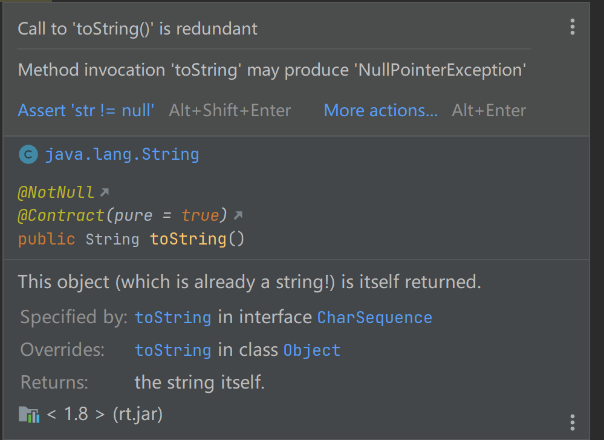

# 如何优雅的避免空指针异常

空指针异常是导致java程序运行中断最常见的原因，相信每个程序猿都碰见过，也就是NullPointException，我们通常简称为NPE，本文告诉大家如何优雅避免NPE。

# 1.数据准备
```java
package npe;

/**
 * @author 百里
 */
public class User {
    private String name;
    private int age;
    private Address address;

    public String getName() {
        return name;
    }

    public void setName(String name) {
        this.name = name;
    }

    public int getAge() {
        return age;
    }

    public void setAge(int age) {
        this.age = age;
    }

    public Address getAddress() {
        return address;
    }

    public void setAddress(Address address) {
        this.address = address;
    }

    public User(){

    }

    public User(String name, int age, Address address) {
        this.name = name;
        this.age = age;
        this.address = address;
    }

    @Override
    public String toString() {
        return "User{" +
                "name='" + name + '\'' +
                ", age=" + age +
                ", address=" + address +
                '}';
    }
}
```
```java
package npe;

/**
 * @author 百里
 */
public class Address {
    private String street;
    private String city;
    private String country;

    public Address(){

    }
    
    public Address(String street, String city, String country) {
        this.street = street;
        this.city = city;
        this.country = country;
    }

    // getters and setters
    public String getStreet() {
        return street;
    }

    public void setStreet(String street) {
        this.street = street;
    }

    public String getCity() {
        return city;
    }

    public void setCity(String city) {
        this.city = city;
    }

    public String getCountry() {
        return country;
    }

    public void setCountry(String country) {
        this.country = country;
    }

    @Override
    public String toString() {
        return "Address{" +
                "street='" + street + '\'' +
                ", city='" + city + '\'' +
                ", country='" + country + '\'' +
                '}';
    }
}
```
UML类关系图：


# 2.实战：获取用户所在的城市

## 2.1.直接获取；容易出现空指针异常。
```java
/**
 * 获取人员所在的城市
 * @author 百里
 */
public class BaiLiNpeDemo {
    public static void main(String[] args) {
        Address myAddress = new Address();
        User myUser = new User("John Doe", 35, myAddress);
        String city = myUser.getAddress().getCity().trim();
        System.out.println(city);
    }
}
```

## 2.2.使用if-else判断；避免了出现空指针的问题，但是代码结构层次嵌套多，不美观
```java
/**
 * 使用if进行判断
 * @author 百里
 */
public class BaiLiSimpleNpeDemo {
    public static void main(String[] args) {
        Address myAddress = new Address();
        User myUser = new User("John Doe", 35, myAddress);
        if (myUser != null) {
            Address address = myUser.getAddress();
            if (address != null) {
                String city = address.getCity();
                if (city != null  && !"".equals(city)) {
                    System.out.println("使用if判断字符串：" + "一键三连");
                }
            }
        }
    }
}
```

## 2.3.使用工具类美化一下if判断代码
```java
/**
 * 使用工具类
 * @author 百里
 */
public class BaiLiUtilsNpeDemo {
    public static void main(String[] args) {
        Address myAddress = new Address("123 Main St", " Austin ", "CA");
        User myUser = new User("John Doe", 35, myAddress);
        //针对对象与字符串
        if (!ObjectUtils.isEmpty(myUser)) {
            Address address = myUser.getAddress();
            if (!ObjectUtils.isEmpty(address)) {
                String city = address.getCity();
                if (!StringUtils.isEmpty(city)) {
                    System.out.println("使用StringUtils工具类判断字符串：" + "一键三连");
                }
            }
        }
    	//针对数组使用工具类
        ArrayList<User> users = new ArrayList<>();
        users.add(myUser);
        if (!CollectionUtils.isEmpty(users)) {
            System.out.println("使用CollectionUtils工具类判断数组对象：" + "一键三连");
        }
    }
}
```

## 2.4.使用Optional解决了层次多的问题也避免了空指针的问题，当我们配合使用orElse时，会先执行orElse方法，然后执行逻辑代码，不管是否出现了空指针。
```java
/**
 * 使用Optional
 * @author 百里
 */
public class BaiLiOptionalNpeDemo {
    public static void main(String[] args) {
        Address myAddress = new Address();
        User myUser = new User("John Doe", 35, myAddress);
        System.out.println("使用Optional判断 + orElse:" +
                Optional.ofNullable(myUser)
                .map(User::getAddress)
                .map(Address::getCity)
                .map(String::trim)
                .orElse(getDefaultCity())
        );
    }
    //初始化城市
    public static String getDefaultCity() {
        System.out.println("初始化默认城市");
        return null;
    }
}
```

## 2.5.使用断言处理接口入参，检查假设和前置条件是否满足，以及检查空值情况，提前捕获空指针异常并进行处理
```java
import org.springframework.util.Assert;

/**
 * 接口参数校验
 * @author 百里
 */
public class BaiLiAssertNpeDemo {
    public static void main(String[] args) {
        Address myAddress = new Address("123 Main St", " Austin ", "CA");
        User user = new User("John Doe", 35, myAddress);
        getUserCity(user);
        getUserCity(null);
    }

    public static void getUserCity(User user){
        Assert.notNull(user,"user is null");
        Address address = user.getAddress();
        Assert.notNull(address,"address is null");
        String city = address.getCity();
        System.out.println(city);
    }
}
```

## 2.6.使用@Nullable注解，标识变量或方法参数和返回值是否可以为 null，以便在编译期或开发工具中提示可能的 NullPointerException 风险
```java
/**
 * 使用注解 @Nullable
 * @author 百里
 */
public class BaiLiNonNullDemo {
    public static void printString(@Nullable String str) {
        System.out.println(str.toString());
    }

    @Nullable
    public static String getString() {
        return null;
    }

    public static void main(String[] args) {
        String str = null;
        printString(str);
        getString().toString();

        User user = new User();
        user.getAddress().getCity();
    }
}
```


## 2.7.额外补充
JDK17优化了空指针异常信息(Helpful NullPointerExceptions)
通过精确描述哪个变量为空来提高JVM生成的空指针异常信息的可用性。
即，以前的空指针异常信息不会告诉你具体是哪个对象为null，当运行的语句是对一个嵌套结构的对象做连续的方法调用(如"a.getb().getc().xxx()")时，就需要进一步分析或调试才能判断出谁是null。而该特性加入以后则直接在异常信息中说明值为null的对象是哪个。
```java
/**
 * @author 百里
 */
public class BaiLiNpeDemo {
    public static void main(String[] args) {
        Address myAddress = new Address("123 Main St", null, "CA");
        User myUser = new User("John Doe", 35, myAddress);
        System.out.println(myUser.getAddress().getCity().trim());
    }
}
```
执行结果：
```java
Exception in thread "main" java.lang.NullPointerException: Cannot invoke "String.trim()" because the return value of "npe.Address.getCity()" is null
	at npe.BaiLiNpeDemo.main(BaiLiNpeDemo.java:16)
```


> 原文: <https://www.yuque.com/tulingzhouyu/db22bv/evnnlfn9f5ltnays>