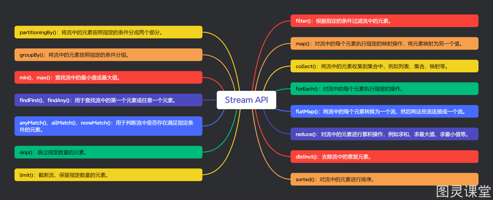
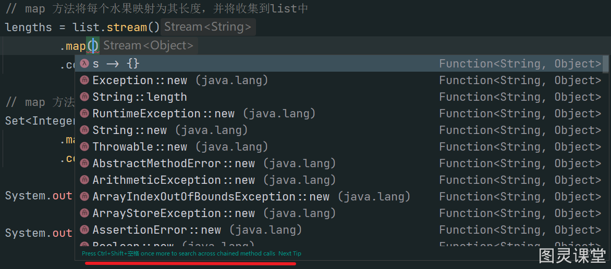

# 提升编码效率的15种 Stream API


本文给大家收集了工作常用的 15 种 Java Stream API，可用于进行各种数据处理和操作。具体如下：

### collect()：将流中的元素收集到集合中，例如列表、集合、映射等。

### filter()：根据指定的条件过滤流中的元素。
```java
List<String> names = Arrays.asList("Alice", "Bob", "Charlie", "David");

// 筛选出以字母"A"开头的字符串，并将符合条件的字符串收集到一个新的列表中
List<String> filteredNames = names.stream()
                            .filter(name -> name.startsWith("A"))
                            .collect(Collectors.toList());

System.out.println(filteredNames); // Output: [Alice]
```

### map()：对流中的每个元素执行指定的映射操作，将元素映射为另一个值。
```java
List<String> names = Arrays.asList("Alice", "Bob", "Charlie", "David");

// 将给定字符串列表中每个字符串的长度提取出来，并将这些长度存储到一个新的整数列表中
List<Integer> nameLengths = names.stream()
                            .map(String::length)
                            .collect(Collectors.toList());

System.out.println(nameLengths); // Output: [5, 3, 7, 5]
```

### forEach()：对流中的每个元素执行指定的操作。
```java
List<String> names = Arrays.asList("Alice", "Bob", "Charlie", "David");

// 将每个字符串转换为大写形式并收集到新的列表中
List<String> upperCaseNames = new ArrayList<>();

names.forEach(name -> upperCaseNames.add(name.toUpperCase()));

// 输出新的列表
System.out.println(upperCaseNames); // 输出：[ALICE, BOB, CHARLIE, DAVID]
```

### flatMap()：将流中的每个元素转换为一个流，然后将这些流连接成一个流。
```java
List<List<Integer>> numbers = Arrays.asList(
    Arrays.asList(1, 2, 3),
    Arrays.asList(4, 5, 6),
    Arrays.asList(7, 8, 9)
);

// 使用 flatMap 方法将多个整数列表合并为一个扁平的列表
List<Integer> flattenedList = numbers.stream()
                                     .flatMap(List::stream)
                                     .collect(Collectors.toList());

System.out.println(flattenedList); // Output: [1, 2, 3, 4, 5, 6, 7, 8, 9]
```

### reduce()：对流中的元素进行累积操作，例如求和、求最大值、求最小值等。
```java
List<Integer> numbers = Arrays.asList(1, 2, 3, 4, 5);

// 使用流的 reduce 方法计算列表中所有元素的和
int sum = numbers.stream()
                 .reduce(0, Integer::sum);

System.out.println(sum); // Output: 15
```

### distinct()：去除流中的重复元素。
```java
List<Integer> numbers = Arrays.asList(1, 2, 3, 2, 4, 3, 5);

List<Integer> distinctNumbers = numbers.stream()
                                      .distinct()
                                      .collect(Collectors.toList());

System.out.println(distinctNumbers); // Output: [1, 2, 3, 4, 5]
```

### sorted()：对流中的元素进行排序。
```java
List<Integer> numbers = Arrays.asList(3, 1, 4, 1, 5, 9, 2, 6, 5);

List<Integer> sortedNumbers = numbers.stream()
                                    .sorted()
                                    .collect(Collectors.toList());

System.out.println(sortedNumbers); // Output: [1, 1, 2, 3, 4, 5, 5, 6, 9]
```

### limit()：截断流，保留指定数量的元素。
```java
List<Integer> numbers = Arrays.asList(1, 2, 3, 4, 5, 6, 7, 8, 9, 10);

// 筛选出大于5的元素，然后限制只获取前3个符合条件的元素
List<Integer> limitedNumbers = numbers.stream()
                                      .filter(num -> num > 5)
                                      .limit(3)
                                      .collect(Collectors.toList());

System.out.println(limitedNumbers); // Output: [1, 2, 3]
```

### skip()：跳过指定数量的元素。
```java
List<Integer> numbers = Arrays.asList(1, 2, 3, 4, 5);

// 跳过前两个元素
List<Integer> skippedNumbers = numbers.stream()
                                     .skip(2)
                                     .collect(Collectors.toList());

System.out.println(skippedNumbers); // Output: [3, 4, 5]
```

### anyMatch()、allMatch()、noneMatch()：用于判断流中是否存在满足指定条件的元素。
```java
List<Integer> numbers = Arrays.asList(1, 2, 3, 4, 5);

// 使用 anyMatch 方法判断列表中是否有任意一个元素大于3
boolean anyMatch = numbers.stream().anyMatch(n -> n > 3);

// 使用 allMatch 方法判断列表中所有元素是否都大于0
boolean allMatch = numbers.stream().allMatch(n -> n > 0);

// 使用 noneMatch 方法判断列表中是否没有元素小于0
boolean noneMatch = numbers.stream().noneMatch(n -> n < 0);

System.out.println("Any match: " + anyMatch); // Output: true
System.out.println("All match: " + allMatch); // Output: true
System.out.println("None match: " + noneMatch); // Output: true
```

### findFirst()、findAny()：用于查找流中的第一个元素或任意一个元素。
```java
List<Integer> numbers = Arrays.asList(1, 2, 3, 4, 5);

// 使用 findFirst 方法查找第一个元素
Optional<Integer> first = numbers.stream().findFirst();

// 使用 findAny 方法查找任意一个元素
Optional<Integer> any = numbers.stream().findAny();

System.out.println("First: " + first.orElse(null)); // Output: 1
System.out.println("Any: " + any.orElse(null)); // Output: 1 or any other element
```

### min()、max()：查找流中的最小值或最大值。
```java
List<Integer> numbers = Arrays.asList(3, 1, 4, 1, 5);

// 使用 min 方法找到最小值
Optional<Integer> min = numbers.stream().min(Integer::compareTo);

// 使用 max 方法找到最大值
Optional<Integer> max = numbers.stream().max(Integer::compareTo);

System.out.println("Min: " + min.orElse(null)); // Output: 1
System.out.println("Max: " + max.orElse(null)); // Output: 5
```

### groupBy()：将流中的元素按照指定的条件分组。
```java
List<String> names = Arrays.asList("Alice", "Bob", "Charlie", "David");

// 使用流进行分组，按照名字的首字母进行分组
Map<Character, List<String>> groupedNames 
        = names.stream()
               .collect(Collectors.groupingBy(name -> name.charAt(0)));

System.out.println(groupedNames); // Output: {A=[Alice], B=[Bob], C=[Charlie], D=[David]}
```

### partitioningBy()：将流中的元素按照指定的条件分成两个部分。
```java
List<String> names = Arrays.asList("Alice", "Bob", "Charlie", "David");

// 使用流进行分区，根据名字长度是否大于3进行分区
Map<Boolean, List<String>> partitionedNames 
        = names.stream()
               .collect(Collectors.partitioningBy(name -> name.length() > 3));

System.out.println(partitionedNames); // Output: {false=[Bob], true=[Alice, Charlie, David]}
```

### IDEA 小技巧
使用 idea 编码时，如果不知道输入什么，请使用 ctrl + shift + 空格


### 完整测试代码
```java
package com.baili.springboot3;

import com.baili.springboot3.entity.Transaction;
import org.junit.jupiter.api.Test;
import org.springframework.boot.test.context.SpringBootTest;

import java.util.*;
import java.util.stream.Collectors;

@SpringBootTest
public class StreamApiTest {

    @Test
    void forEachDemo() {
        List<String> list = new ArrayList<>(Arrays.asList("apple", "banana", "orange"));

        // 使用传统的 for 循环遍历列表并输出每个元素
        for (String string : list) {
            System.out.println(string);
        }

        // 移除符合条件的元素
        list.removeIf(s -> s.equals("apple"));

        // 使用流的 forEach 方法遍历列表并输出每个元素
        list.forEach(System.out::println);

        list.forEach(s -> {
            // TODO
        });
    }

    @Test
    void mapDemo() {
        List<String> list = Arrays.asList("apple", "banana", "orange");
        List<Integer> lengths = new ArrayList<>();

        // 使用传统的 for 循环遍历列表，并将每个水果的长度添加到list中
        for (String string : list) {
            lengths.add(string.length());
        }

        // map 方法将每个水果映射为其长度，并将收集到list中
        lengths = list.stream()
                .map(String::length)
                .collect(Collectors.toList());

        // map 方法将每个水果映射为其长度，并将收集到set中
        Set<Integer> collect = list.stream()
                .map(String::length)
                .collect(Collectors.toSet());

        System.out.println(lengths);

        System.out.println(collect);
    }

    @Test
    void flatMapDemo() {
        List<List<Integer>> numbers = Arrays.asList(
                Arrays.asList(1, 2, 3),
                Arrays.asList(4, 5, 6),
                Arrays.asList(7, 8, 9)
        );

        // flatMap 将所有元素转换为单独的流，然后连接成一个流
        List<Integer> flattenedList = numbers.stream()
                .flatMap(List::stream)
                .collect(Collectors.toList());

        System.out.println(flattenedList); // [1, 2, 3, 4, 5, 6, 7, 8, 9]
    }

    @Test
    void reduceDemo() {
        List<Transaction> transactions = new ArrayList<>();
        transactions.add(new Transaction(100.0));
        transactions.add(new Transaction(200.0));
        transactions.add(new Transaction(300.0));

        // reduce 计算金额总和
        double totalAmount = transactions.stream()
                .mapToDouble(Transaction::getAmount)
                .reduce(0.0, Double::sum);

        System.out.println("总金额为: " + totalAmount);
    }

    @Test
    void synthesizeDemo() {
        List<String> strings = Arrays.asList("apple", "banana", "orange", "apple", "banana", "grape");

        // 使用流进行操作
        List<String> result = strings.stream()
                .filter(string -> string.length() > 5)  // 过滤出长度大于5的水果
                .distinct()  // 去除重复的水果
                .sorted()  // 按字母顺序排序
                .skip(1)  //跳过一个元素
                .limit(2)  // 取前两个水果
                .collect(Collectors.toList());  // 收集结果为列表

        System.out.println(result); // 输出：[orange]
    }

    @Test
    void matchDemo() {
        List<Integer> numbers = Arrays.asList(1, 2, 3, 4, 5);

        // 使用 anyMatch 方法判断列表中是否有任意一个元素大于3
        boolean anyMatch = numbers.stream().anyMatch(n -> n > 3);

        // 使用 allMatch 方法判断列表中所有元素是否都大于0
        boolean allMatch = numbers.stream().allMatch(n -> n > 0);

        // 使用 noneMatch 方法判断列表中是否没有元素小于0
        boolean noneMatch = numbers.stream().noneMatch(n -> n < 0);

        System.out.println("Any match: " + anyMatch); // true
        System.out.println("All match: " + allMatch); // true
        System.out.println("None match: " + noneMatch); // true
    }

    @Test
    void findDemo() {
        List<Integer> numbers = Arrays.asList(1, 2, 3, 4, 5);

        // 使用 findFirst 方法查找第一个元素
        Optional<Integer> first = numbers.stream().findFirst();

        // 使用 findAny 方法查找任意一个元素
        Optional<Integer> any = numbers.stream().findAny();

        // 使用 min 方法找到最小值
        Optional<Integer> min = numbers.stream().min(Integer::compareTo);

        // 使用 max 方法找到最大值
        Optional<Integer> max = numbers.stream().max(Integer::compareTo);

        System.out.println("First: " + first.orElse(null)); // 1
        System.out.println("Any: " + any.orElse(null)); // 1 or any other element
        System.out.println("Min: " + min.orElse(null)); // 1
        System.out.println("Max: " + max.orElse(null)); // 5
    }

    @Test
    void groupByDemo() {
        List<String> names = Arrays.asList("Alice", "Bob", "Charlie", "David", "Adam", "Bella", "Christopher", "Daniel");

        // 使用流进行分组，按照名字的首字母进行分组
        Map<Character, List<String>> groupedNames = names.stream()
                .collect(Collectors.groupingBy(name -> name.charAt(0)));

        System.out.println(groupedNames); // {A=[Alice, Adam], B=[Bob, Bella], C=[Charlie, Christopher], D=[David, Daniel]}
    }

    @Test
    void partitioningByDemo() {
        List<String> names = Arrays.asList("Alice", "Bob", "Charlie", "David");

        // 使用流进行分区，根据名字长度是否大于3进行分区
        Map<Boolean, List<String>> partitionedNames = names.stream()
                .collect(Collectors.partitioningBy(name -> name.length() > 3));

        System.out.println(partitionedNames); // {false=[Bob], true=[Alice, Charlie, David]}
    }
}
```


> 原文: <https://www.yuque.com/tulingzhouyu/db22bv/vq1mgynvavgftsg4>