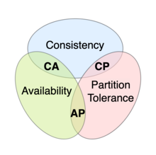
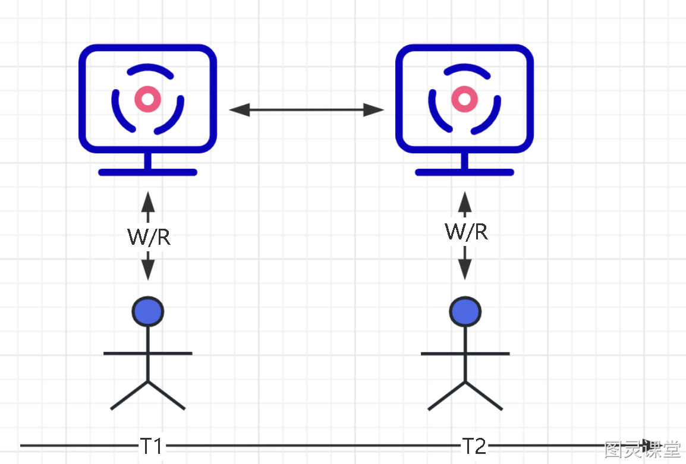
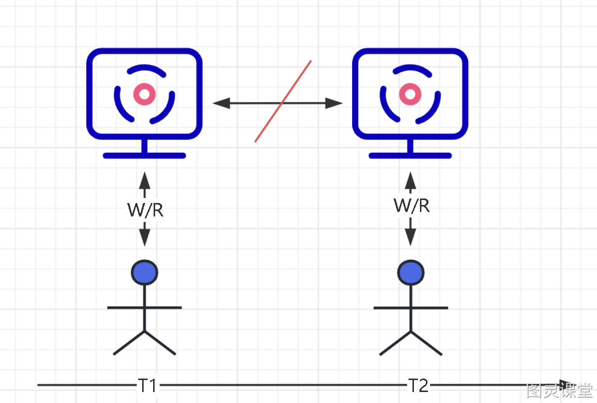

# 鱼和熊掌不可兼得之CAP定理

# 什么是 CAP 定理？
CAP 定理是一个分布式系统设计的基本原则。它指出，在一个分布式系统中，无法同时满足**一致性（Consistency）**、**可用性（Availability）**和**分区容错性（Partition tolerance）**三个特性。

**一致性 C：每次请求都会获取最新的数据或错误**。

- 在网络分区期间，系统会保持对于客户端的读操作要么返回最新的数据，要么返回错误。

**可用性 A：每个请求都会得到响应，但不能保证其中包含最新写入**。 

- 无论何时，任何客户端的请求都应该能够得到有效的响应数据，而不会出现响应错误。即使在网络分区期间，系统也会确保对客户端的请求进行响应。不管数据是否为最新。

**分区容错性 P：节点之间的网络出现问题之后，系统仍在继续运行**。

- 由于网络不可靠，当消息丢失或延迟到达时，系统仍会继续提供服务而不会挂掉。分区容忍性意味着系统会继续运行，并努力恢复网络分区后的一致性。

## CAP 为什么不能兼得？
这是因为在网络分区发生时，为了保证系统的**可用性和分区容忍性**，系统**必须允许分区内的节点继续提供服务**。而为了保证一致性，所有**节点之间需要相互协调和同步，以确保数据的一致性**。然而，在网络分区发生时，由于消息传递的延迟、丢失等问题，无法保证所有节点之间的即时一致性。
所以，当发生网络分区时，分布式系统必须在可用性和一致性之间做出折衷选择。具体来说，系统可以选择在网络分区期间放弃一致性，以保证可用性和分区容忍性，这是常见的解决方案。或者系统可以放弃可用性，在网络分区期间停止对外提供服务，等待分区恢复后再提供一致性的数据。

# AP、CP 如何理解？

**AP（可用性与分区容忍性）：系统能够在网络故障或部分节点失效的情况下继续可用。它侧重于保证系统的稳定性和用户的访问体验。**

- 想象你正在使用一个社交媒体应用，这个应用具有AP属性。即使网络断开或某些服务器出现问题，你仍然可以浏览和发布动态，与朋友互动，尽管可能会遇到一些延迟或数据同步的问题。重点是，你可以随时使用该应用程序，即使在网络不稳定的情况下也能够完成基本操作。

**CP(一致性与分区容忍性)：系统保证所有节点上的数据一致性，即使在网络分区时也能保持数据的一致性。它侧重于保持数据的准确性和一致性。**

- 举个例子，假设你正在使用一个在线购物应用，这个应用具有CP属性。当你下订单时，系统会确保将订单信息同步到所有节点，以确保数据的一致性。如果发生网络分区，系统可能会暂停交易，直到网络恢复正常，并确保所有节点上的订单数据是一致的。这样可以避免出现因网络问题而导致订单丢失或重复的情况。

# 额外补充
在分布式系统正常运行时，即不存在网络分区或故障的情况下，的确可以同时满足一致性和可用性，这是因为节点之间可以直接通信来保持数据的一致性，并且系统可以一直对外提供服务。这样的场景下，CAP理论并不适用，因为没有发生需要做出选择的情况。
只有当网络分区或故障发生时，才需要在C和A之间进行权衡选择。在网络分区发生时，为了保证可用性和分区容忍性，系统可能需要放弃一致性，例如采用最终一致性模型。反之，如果一致性是更为重要的需求，系统可以牺牲可用性，在网络分区期间停止对外服务，等待分区恢复后再提供一致性数据。

> 原文: <https://www.yuque.com/tulingzhouyu/db22bv/gzkpry0go4uv1ud1>