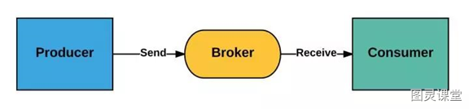
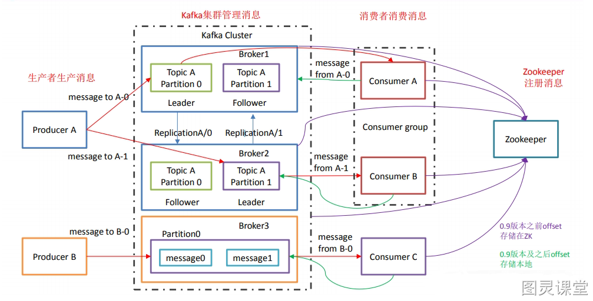
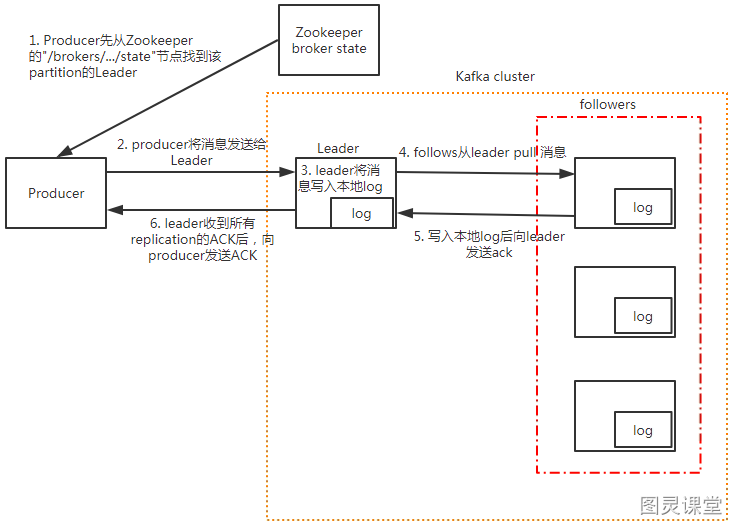
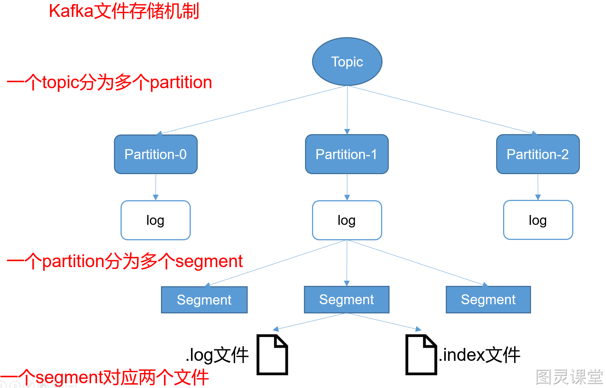
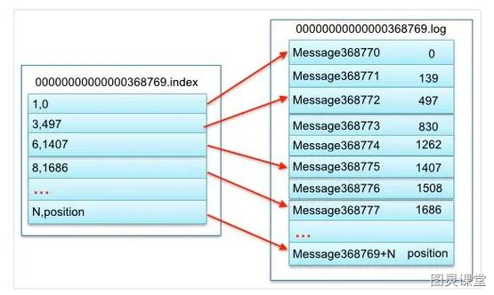
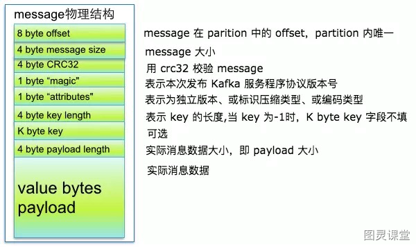
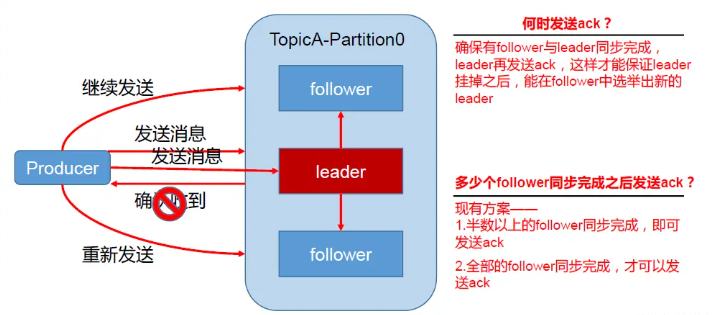
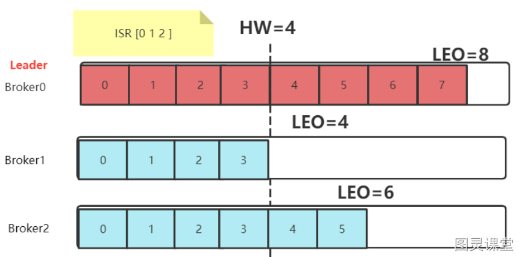
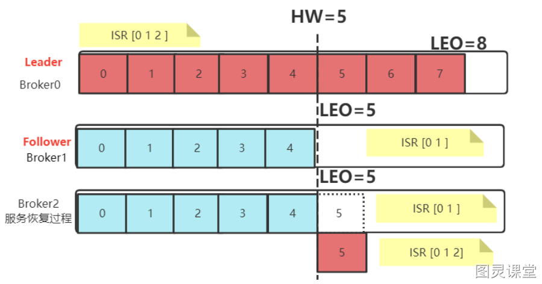
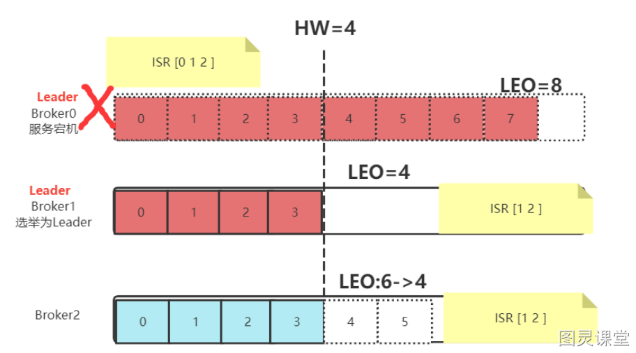

# Kafka常见问题

## Kafka入门

### 什么是消息队列与Kafka简介
消息队列（Message Queue，简称MQ），指保存消息的一个容器，本质是个队列。
消息（Message）是指在应用之间传送的数据，消息可以非常简单，比如只包含文本字符串，也可以更复杂，可能包含嵌入对象。
消息队列（Message Queue）是一种应用间的通信方式，消息发送后可以立即返回，有消息系统来确保信息的可靠专递，消息发布者只管把消息发布到MQ中而不管谁来取，消息使用者只管从MQ中取消息而不管谁发布的，这样发布者和使用者都不用知道对方的存在。

- Producer：消息生产者，负责产生和发送消息到 Broker；
- Broker：消息处理中心。负责消息存储、确认、重试等，一般其中会包含多个 queue；
- Consumer：消息消费者，负责从 Broker 中获取消息，并进行相应处理；

#### 为什么需要消息队列？
1、屏蔽异构平台的细节：发送方、接收方系统之间不需要了解双方，只需认识消息。
2、异步：消息堆积能力；发送方接收方不需同时在线，发送方接收方不需同时扩容（削峰）。
3、解耦：防止引入过多的API给系统的稳定性带来风险；调用方使用不当会给被调用方系统造成压力，被调用方处理不当会降低调用方系统的响应能力。
4、复用：一次发送多次消费。
5、可靠：一次保证消息的传递。如果发送消息时接收者不可用，消息队列会保留消息，直到成功地传递它。
6、提供路由：发送者无需与接收者建立连接，双方通过消息队列保证消息能够从发送者路由到接收者，甚至对于本来网络不易互通的两个服务，也可以提供消息路由。

#### 消息队列有什么优点和缺点？

1. 核心优点
   1. 解耦
   2. 异步
   3. 削峰
2. 缺点
   1. 系统可用性降低：系统引入的外部依赖越多，越容易挂掉。
   2. 系统复杂度提高了
   3. 一致性问题：消息传递给多个系统，部分执行成功，部分执行失败，容易导致数据不一致

#### Kafka简介
Kafka是一个分布式流处理系统，流处理系统使它可以像消息队列一样publish或者subscribe消息，分布式提供了容错性，并发处理消息的机制。

### Kafka的优势和特点

- **高吞吐量**：单机每秒处理几十上百万的消息量。即使存储了许多TB的消息，它也保持稳定的性能。
- **高性能**：单节点支持上千个客户端，并保证零停机和零数据丢失，异步化处理机制
- **持久化：**将消息持久化到磁盘。通过将数据持久化到硬盘以及replica(follower节点)防止数据丢失。
- **零拷贝**：减少了很多的拷贝技术，以及可以总体减少阻塞事件，提高吞吐量。
- **可靠性 ：**Kafka是分布式，分区，复制和容错的。
- Kafka的特点 ：
   - **顺序读，顺序写**
   - **利用Linux的页缓存**
   - **分布式系统，易于向外扩展。所有的Producer、Broker和Consumer都会有多个，均为分布式的。无需停机即可扩展机器。多个Producer、Consumer可能是不同的应用。**
   - **客户端状态维护:消息被处理的状态是在Consumer端维护，而不是由server端维护。当失败时能自动平衡。**
   - **支持online（在线）和offline（离线）的场景。**
   - **支持多种客户端语言。Kafka支持Java、.NET、PHP、Python等多种语言。**

### Kafka与传统消息队列的对比

各种对比之后，有如下建议：

- ActiveMQ，没经过大规模吞吐量场景的验证，社区也不是很活跃，所以不推荐；
- RabbitMQ，虽然erlang 语言阻止了大量的 Java 工程师去深入研究和掌控它，对公司而言，几乎处于不可控的状态，但是毕竟是开源的，比较稳定的支持，活跃度也高，推荐中小型公司使用；推荐
- RocketMQ，阿里出品，Java语言编写，经过了阿里多年双十一大促的考验，性能和稳定性得到了充分的严重。目前在业界被广泛应用在订单，交易，充值，流计算，消息推送，日志流式处理，binlog分发等场景；强烈推荐
- Kafka，如果是大数据领域的实时计算、日志采集等场景，用 Kafka 是业内标准的，绝对没问题，社区活跃度很高，绝对不会黄，何况几乎是全世界这个领域的事实性规范。

### Kafka的架构设计

kafka运行在集群上，集群包含一个或多个服务器。kafka把消息存在topic中，每一条消息包含键值（key），值（value）和时间戳（timestamp）。
kafka有以下一些基本概念：
**Producer **- 消息生产者，就是向kafka broker发消息的客户端。
**Consumer **- 消息消费者，是消息的使用方，负责消费Kafka服务器上的消息。
**Topic **- 主题，由用户定义并配置在Kafka服务器，用于建立Producer和Consumer之间的订阅关系。生产者发送消息到指定的Topic下，消息者从这个Topic下消费消息。
**Partition** - 消息分区，一个topic可以分为多个 partition，每个partition是一个有序的队列。partition中的每条消息都会被分配一个有序的id（offset）。
**Broker **- 一台kafka服务器就是一个broker。一个集群由多个broker组成。一个broker可以容纳多个topic。
**Consumer Group** - 消费者分组，用于归组同类消费者。每个consumer属于一个特定的consumer group，多个消费者可以共同消息一个Topic下的消息，每个消费者消费其中的部分消息，这些消费者就组成了一个分组，拥有同一个分组名称，通常也被称为消费者集群。
**Offset **- 消息在partition中的偏移量。每一条消息在partition都有唯一的偏移量，消息者可以指定偏移量来指定要消费的消息。

### 工作流程

- producer先从zookeeper的 "/brokers/.../state"节点找到该partition的leader
- producer将消息发送给该leader
- leader将消息写入本地log
- followers从leader pull消息
- 写入本地log后向leader发送ACK
- leader收到所有ISR中的replication的ACK后，增加HW（high watermark，最后commit 的offset）并向producer发送ACK

#### tips

- Kafka 中消息是以topic 进行分类的，生产者生产消息，消费者消费消息，都是面向topic的。
- topic 是逻辑上的概念，而partition 是物理上的概念，每个partition 对应一个log 文件，该log 文件中存储的就是producer 生产的数据。Producer 生产的数据会被不断追加到该log 文件末端，且每条数据都有自己的offset。消费者组中的每个消费者，都会实时记录自己消费到了哪个offset，以便出错恢复时，从上次的位置继续消费。

### Kafka的数据模型与消息存储机制

#### 消息存储结构
Kafka 有 Topic 和 Partition 两个概念，一个 Topic 可以有多个 Partition。在实际存储的时候，Topic + Partition 对应一个文件夹，这个文件夹对应的是这个 Partition 的数据。
在 Kafka 的数据文件目录下，一个 Partition 对应一个唯一的文件夹。如果有 4 个 Topic，每个 Topic 有 5 个 Partition，那么一共会有 4 * 5 = 20 个文件夹。而在 文件夹下，Kafka 消息是采用 Segment File 的存储方式进行存储的。 
Segment File 的大概意思是：将大文件拆分成小文件来存储，这样一个大文件就变成了一段一段（Segment 段）。这样的好处是 IO 加载速度快，不会有很长的 IO 加载时间。Kafka 的消息存储就采用了这种方式。

如上图所示，在一个文件夹下的数据会根据 Kafka 的配置拆分成多个小文件。拆分规则可以根据文件大小拆分，也可以根据消息条数拆分，这个是 Kafka 的一个配置，这里不细说。
在 Kafka 的数据文件夹下，分为两种类型的文件：索引文件（Index File）和数据文件（Data File）。索引文件存的是消息的索引信息，帮助快速定位到某条消息。数据文件存储的是具体的消息内容。

#### 索引文件
索引文件的命名统一为数字格式，其名称表示 Kafka 消息的偏移量。我们假设索引文件的数字为 N，那么就代表该索引文件存储的第一条 Kafka 消息的偏移量为 N + 1，而上个文件存储的最后一条 Kafka 消息的偏移量为 N（因为 Kafka 是顺序存储的）。例如下图的 368769.index 索引文件，其表示文件存储的第一条 Kafka 消息的偏移量为 368770。而 368769 表示的是 0000.index 这个索引文件的最后一条消息。所以 368769.index 索引文件，其存储的 Kafka 消息偏移量范围为 368769-737337。

索引文件存储的是简单地索引数据，其格式为：「N,Position」。其中 N 表示索引文件里的第几条消息，而 Position 则表示该条消息在数据文件（Log File）中的物理偏移地址。例如下图中的「3,497」表示：索引文件里的第 3 条消息（即 offset 368772 的消息，368772 = 368769+3），其在数据文件中的物理偏移地址为 497。

其他的以此类推，例如：「8,1686」表示 offset 为 368777 的 Kafka 消息，其在数据文件中的物理偏移地址为 1686。

#### 数据文件
数据文件的命名格式与索引文件的命名格式完全一样，这里就不再赘述了。
通过上面索引文件的分析，我们已经可以根据 offset 快速定位到某个数据文件了。那接着我们怎么读取到这条消息的内容呢？要读取到这条消息的内容，我们需要搞清楚数据文件的存储格式。
数据文件就是所有消息的一个列表，而每条消息都有一个固定的格式，如下图所示。

从上图可以看到 Kafka 消息的物理结构，其包含了 Kafka 消息的 offset 信息、Kafka 消息的大小信息、版本号等等。有了这些信息之后，我们就可以正确地读取到 Kafka 消息的实际内容。

### Kafka文件存储优势
**Kafka运行时很少有大量读磁盘的操作，主要是定期批量写磁盘操作，因此操作磁盘很高效**。这跟Kafka文件存储中读写message的设计是息息相关的。Kafka中读写message有如下特点:

#### 写message

- 消息从java堆转入page cache(即物理内存)。
- 由异步线程刷盘,消息从page cache刷入磁盘。

#### 读message

- 消息直接从page cache转入socket发送出去。
- 当从page cache没有找到相应数据时，此时会产生磁盘IO，从磁 盘Load消息到page cache,然后直接从socket发出去

#### Kafka高效文件存储设计特点

- Kafka把topic中一个parition大文件分成多个小文件段，通过多个小文件段，就容易定期清除或删除已经消费完文件，减少磁盘占用。
- 通过索引信息可以快速定位message和确定response的最大大小。
- 通过index元数据全部映射到memory，可以避免segment file的IO磁盘操作。
- 通过索引文件稀疏存储，可以大幅降低index文件元数据占用空间大小。

### Kafka 副本同步机制
为保证producer发送的数据，能可靠到指定topic，topic的每个的partition收到 producer发送的数据后，都需要向producer发送 ack（acknowledgement确认收到），如果 producer收到 ack，就会进行下一轮的发送。

#### ACKS 机制
在 Kafka 中，消息的 ACK（Acknowledgment，确认）机制与生产者的 **acks** 配置有关。**acks** 配置表示生产者在接收到消息后等待副本同步确认的方式，具体取值有：

- **acks=0：**
   - 意义：生产者在成功将消息发送给 Kafka 服务端后不等待任何确认。
   - 结果：生产者无法知道消息是否成功到达 Kafka 服务器，可能会导致消息的丢失。这种配置下，生产者不会收到任何 ACK。
- **acks=1：**
   - 意义：生产者在成功将消息发送给 Kafka 服务端后，等待该分区的首领节点（leader）确认。
   - 结果：生产者会收到分区首领节点的 ACK。这意味着只要分区首领节点成功接收到消息，生产者就会得到确认，而不需要等待其他副本。
- **acks=all 或 acks=-1：**
   - 意义：生产者在成功将消息发送给 Kafka 服务端后，等待所有分区副本确认。
   - 结果：生产者会等待分区的所有副本都成功接收到消息并确认。这是最安全的配置，因为只有当所有副本都确认接收到消息后，才认为消息被成功提交。

#### 生产者重试机制：
Kafka 生产者在发送消息后，如果设置了等待服务器的确认（通过 **acks** 参数配置），会等待一定时间来收到来自服务器的确认（ack）。这个等待时间由 **timeout.ms** 参数控制，默认是 **10000** 毫秒（10秒）。
如果在等待时间内没有收到服务器的确认，生产者可以选择重试发送或者处理发送失败的逻辑。这取决于生产者的配置。通常，生产者会根据配置的重试次数和重试间隔来进行重试，以确保消息最终被成功发送。
在 Kafka 的生产者配置中，你可以找到以下与重试相关的配置项：

- **retries**: 定义了生产者在发送消息时的最大重试次数。
- **retry.backoff.ms**: 定义了两次重试之间的等待时间间隔。

#### ISR 机制：
Kafka根据**副本同步**的情况，分成了3个**集合**：

- AR（Assigned Replicas）：包括ISR和OSR
- ISR（In-sync Replicas）：和leader副本保持同步的副本集合，可以被认为是可靠的数据
- OSR（Out-Sync Replicas）：和Leader副本同步失效的副本集合

当 kafka 副本同步机制是所有follower都同步成功才返回 ack 给生产者时，如果有一个follower，因为某种故障，迟迟不能与leader 进行同步，那leader 就要一直等下去，直到它完成同步，才能发送ack。这个问题怎么解决呢？
Leader维护了一个动态的in-sync replica set (ISR-同步副本列表)，意为和leader保持同步的follower集合。根据follower发来的FETCH请求中的fetch offset判断ISR中的follower完成数据同步是否成功。如果follower长时间未向leader同步数据，则该follower将被踢出ISR，该时间阈值由replica.lag.time.max.ms参数设定。Leader发生故障之后，就会从ISR中选举新的leader。

- ISR(In-Sync Replicas )：与leader保持同步的follower集合
- AR(Assigned Replicas)：分区的所有副本 
   - ISR是由leader维护，follower从leader同步数据有一些延迟（包括延迟时间replica.lag.time.max.ms和延迟条数replica.lag.max.messages两个维度, 当前最新的版本0.10.x中只支持replica.lag.time.max.ms这个维度），任意一个超过阈值都会把follower剔除出ISR， 存入OSR(Outof-Sync Replicas)列表，新加入的follower也会先存放在OSR中。
   - AR=ISR+OSR。	

### Kafka 副本数据一致性

#### 尽管采用 acks = all 但是也会出现 不一致的场景，例如：
:::tips
假设 leader 接受了 producer 传来的数据为 8 条，ISR 中三台 follower（broker0,broker1,broker2）开始同步数据，由于网络传输，另外两台 follower 同步数据的速率不同。当 broker1 同步了 4 条数据，broker2 已经同步了 6 条数据，此时，leader-broker0 突然挂掉，从 ISR 中选取了 broker1 作为主节点，此时 leader-broker1 同步了 4 条，broker2 同步 6，就会造成 leader 和 followe r之间数据不一致问题。
:::

- **HW** （High Watermark）俗称高水位，它标识了一个特定的消息偏移量（offset），消费者只能拉取到这个offset之前的消息，对于同一个副本对象而言，其 HW 值不会大于 LEO 值。小于等于 HW 值的所有消息都被认为是“已备份”的（replicated） 。**所有分区副本中消息偏移量最小值。**
- **LEO**（Log End Offset），即日志末端位移(log end offset)，记录了该副本底层日志(log)中下一条消息的位移值。**注意是下一条消息！也就是说**，如果 LEO =8，那么表示该副本保存了 8 条消息，位移值范围是[0, 7]。LEO 的大小相当于当前日志分区中最后一条消息的 offset 值加1，分区 ISR 集合中的每个副本都会维护自身的 LEO，而 **ISR 集合中最小的 LEO 即为分区的 HW**，**对消费者而言只能消费 HW 之前的消息**。

#### 针对不同的产生原因，解决方案不同：

- 当服务出现故障时：如果是 Follower 发生故障，这不会影响消息写入，只不过是少了一个备份而已。处理 相对简单一点。Kafka 会做如下处理：  
   - 将故障的 Follower 节点临时踢出 ISR 集合。而其他 Leader 和 Follower 继续正常接收消息。 
   - 出现故障的 Follower 节点恢复后，不会立即加入 ISR 集合。该 Follower 节点会读取本地记录的上一次的 HW，将自己的日志中高于 HW 的部分信息全部删除掉，然后从 HW 开始，向 Leader 进行消息同步。 
   - 等到该 Follower 的 LEO 大于等于整个 Partiton 的 HW 后，就重新加入到 ISR 集合中。这也就是说这个 Follower 的消息进度追上了 Leader。  
-  如果是 Leader 节点出现故障，Kafka 为了保证消息的一致性，处理就会相对复杂一点。 

   - Leader 发生故障，会从 ISR 中进行选举，将一个原本是 Follower 的 Partition提升为新的 Leader。这时， 消息有可能没有完成同步，所以新的 Leader 的LEO 会低于之前 Leader 的 LEO。 
   - Kafka 中的消息都只能以 Leader 中的备份为准。其他 Follower 会将各自的Log 文件中高于 HW 的部分全部 清理掉，然后从新的 Leader 中同步数据。 
   - 旧的 Leader 恢复后，将作为 Follower 节点，进行数据恢复。  

> 原文: <https://www.yuque.com/tulingzhouyu/db22bv/bubwm3kyevkt68m8>