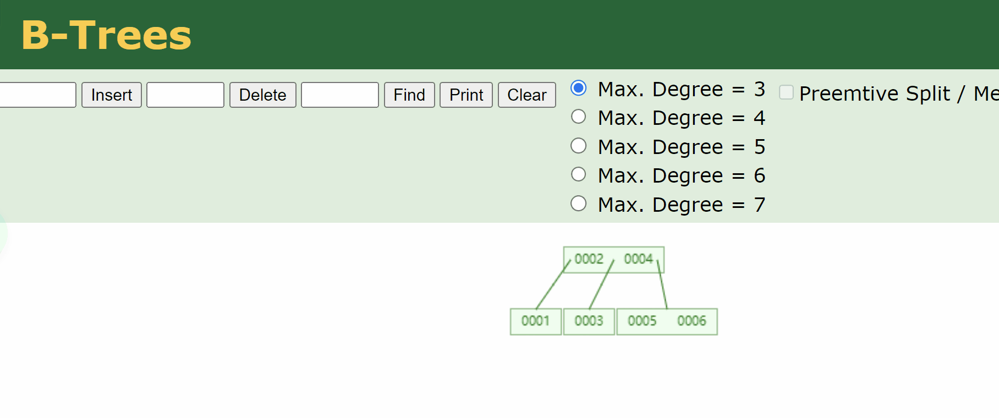
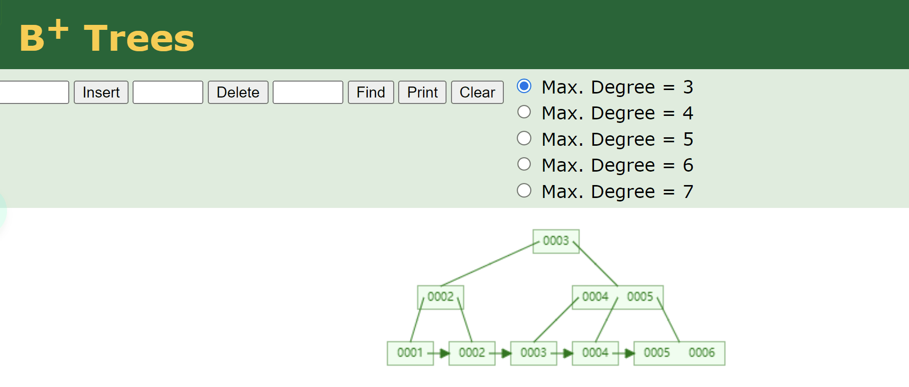

# 深入精讲

MySQL的索引机制中，有一点可谓是路人皆知，既默认使用B+树作为底层的数据结构。有人会说树结构是以二分法查找数据，所以会在很大程度上提升检索性能，这点确实没错，但树结构有那么多，但为什么要选择B+树呢？而不选择二叉树、红黑树或B树呢？下面一起聊一聊这个话题。

# 索引为何不选择二叉树？
二叉搜索树是遵守二分搜索法实现的一种数据结构，它具有下面特点：

- 任意节点的左节点不为空时，左节点值小于根节点值；
- 右节点不为空时，右节点值大于根节点值；

依次存入数据，如果数据是递增的，则原二叉树退化为链表结构。

从动画中可以明显看到，需要经过5次查询才能找到目标数据，由于树结构在磁盘中存储的位置也不连续，所以最终需要发生**5次磁盘IO**才能找到目标数据。
二叉树不适合作为索引结构的原因：

- ①如果索引的字段值是按顺序增长的，二叉树会转变为链表结构，因此检索的过程和全表扫描无异。
- ②每个节点中只存储一个数据，节点之间还是不连续的，每次磁盘IO只能读取一个数据。

# 索引为何不选择红黑树？
相比于二叉树，红黑树则进一步做了优化，它是一种自适应的平衡树，会根据插入的节点数量以及节点信息，自动调整树结构来维持平衡。

由于树变矮了，其效果也很明显，在红黑树中只需要经过**3次IO**就可以找到目标数据，似乎看起来还不错对嘛？但MySQL为啥不用这颗名声远扬的红黑树呢？
红黑树不适合作为索引结构的原因：

- ①虽然对比二叉树来说，树高有所降低，但数据量一大时，依旧会有很大的高度。
- ②每个节点中只存储一个数据，节点之间还是不连续的，每次磁盘IO只能读取一个数据。

# 索引为何不选择B-Tree？
B树和红黑树相比，其单节点可容纳多个数据，就能在很大程度上改善其性能，使B树的树高远远小于红黑树的高度。

对比红黑树可以发现，每个节点上可以存储更多的数据，且树高固定，数据插入之后横向扩展。观察动画只需要**2次IO**就可以找到目标数据，搜索效率大大提高了。并且每个节点的元素我们可以自己空值。
**那么为什么MySQL没有采用B树结构了？**
我们仔细观察可以知道B的叶子节点直接是没有指针的，但是日常查询中包含了大量的范围查找，所以当出现范围查找的时候，会出现多次的IO查找。
B树不适合作为索引结构的原因：

- ①虽然对比之前的红黑树更矮，检索数据更快，但对于大范围查询的需求，依旧需要通过多次磁盘IO来检索数据。

# 索引为何要选择B+Tree？
B+树是在B树的基础进一步优化，一方面节点分为了**叶节点和叶子节点**两类，另一方面叶子节点之间存在**单向链表指针**。

B+树相比于B树叶子节点之间多了个单项指针，当需要做范围查询时，只需要定位第一个节点，然后就可以直接根据各节点之间的指针，获取到对应范围之内的所有节点，也就是只需要发生一次IO，就能够确定所查范围之内的所有数据位置。
其实**MySQL底层真正的索引结构**还对叶子节点之间的指针进行了优化，B+树叶子节点的单向指针无法友好支持的倒叙查询，因此MySQL针对单向指针优化成了双向指针，也就是**双向链表结构**。即**可以快速按正序进行范围查询，而可以快速按倒序进行范围操作**，在某些业务场景下又能进一步提升整体性能！
**节点分为了叶节点和叶子节点。为什么？**
因为B+树的叶节点不存储数据，仅存储指向叶子节点的指针，这样在相同树高时，能存储更多的数据，需要注意的是叶节点数据与叶子结点数据是冗余的。
现在对于MySQL索引为何要选择B+树（变种）的原因大家应该懂了吧。

可视化工具推荐：
数据结构与算法一直以来都让人难以理解，国外有个厉害的程序猿搭建了一个数据结构的动画演示平台，我们在其中能以动画的形式观测数据结构的变化。地址如下：
[Data Structure Visualizations](https://link.segmentfault.com/?enc=Yp9MF8LCxzURaYWc1u7reA%3D%3D.cn5%2BQHHlAoMf4HZhUf1PbTCtJwqcS45WkXwspiTohFFFaAamgeWuW9M%2BVb7Px6RcPjbYWyZPRDiaM5EuGz5qwQ%3D%3D)
[Data Structure Visualizations（中文）](http://www.rmboot.com/)

> 原文: <https://www.yuque.com/tulingzhouyu/db22bv/yylct2c6wu76hurr>