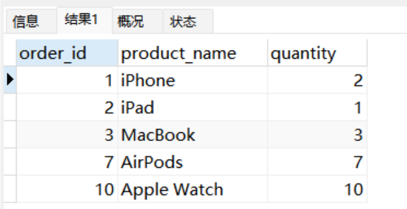

# 深入精讲


## 1.MySQL中的锁分类
- 按粒度分**表锁**、**行锁**和**页锁**三种，
- 按类型分**读锁和写锁(都属于悲观锁)**两种。
- 按性能分**乐观锁**、**悲观锁和意向锁**。

其中，MyISAM和MEMORY存储引擎采用的是**表级锁**，而InnoDB存储引擎支持**行级锁和表级锁**。

## 2.表锁、行锁、页锁

### 表锁：
每次操作锁住整张表。**开销小，加锁快；不会出现死锁；**锁定粒度大，发生锁冲突的概率最高，并发度最低；一般用在整表数据迁移的场景。
```sql
CREATE TABLE locker (
  id INT PRIMARY KEY,
  name VARCHAR(255),
  value INT
);

INSERT INTO locker (
	id, name, value
) VALUES
(1, '张三', 2),	(2, '张三', 3),(3, '张三', 4);
```
```sql
BEGIN;
SELECT * FROM locker WHERE value = 2 FOR UPDATE;
```
因value字段**没有索引**，所以这个 SQL 语句会对 locker 表进行加锁，也就是**表锁**。在事务提交之前，该表数据将无法被其他事务修改。

### 行锁：
对表中一行或多行记录进行加锁控制的方式。**开销大，加锁慢；会出现死锁；**锁定粒度最小，发生锁冲突的概率最低，并发度最高。在 MySQL 中，**行锁是基于索引加载的**，即行锁是要加在索引响应的行上。**索引失效时会升级为表锁。**
```sql
#给locker表中value列添加索引
ALTER TABLE locker ADD index idx_value (value);

BEGIN;
SELECT * FROM locker WHERE value = 2 FOR UPDATE;
```
value字段**添加索引后**，这条SQL只会针对value值为2的记录进行加锁，也就是**行锁**。在事务提交之前，这些行数据将无法被其他事务修改。

### 页锁：
只有BDB存储引擎支持页锁，页锁就是在页的粒度上进行锁定，锁定的数据资源比行锁要多，因为一个页中可以有多个行记录。当我们使用页锁的时候，会出现数据浪费的现象，但这样的浪费最多也就是一个页上的数据行。页锁的开销介于表锁和行锁之间，会出现死锁。锁定粒度介于表锁和行锁之间，并发度一般。

## 3.读锁、写锁、意向锁

### 读锁（共享锁，S锁（shared））：
多个读操作对同一个资源共享同一个锁，多个读操作可以同时进行而不会互相影响。因为读操作并不会改变数据内容，所以多个事务可以共享同一个锁，并行地读取同一个资源，这样可以提高并发效率。

### 写锁（排它锁，X锁（exclude））：
当两个事务同时对表中某行数据进行更新操作时，若一个事务先到达并给该行加上排它锁，那么另一个事务就不能在该行加任意类型的锁，直到第一个事务释放了该行的锁。因此，排它锁可以确保在同一时间只有一个事务可以对被加锁的资源进行修改操作，从而避免出现数据竞争和不一致问题。

### 意向锁（I锁（Intent Lock））：
数据库中的一种表级锁，在行级锁的基础上引入的一种概念。意向锁是用于解决多粒度锁定而设计的，可以避免行级锁和表级锁之间的冲突。
意向锁分为两种类型：**意向共享锁（Intention Shared Lock, IS）和意向排他锁（Intention Exclusive Lock, IX）**。

- **意向共享锁（IS）**：在一个事务需要对表中某些行加共享锁（S锁）时，事务首先需要获得表的意向共享锁（IS锁）
- **意向排他锁（IX）**：指的是在一个事务需要对表中某些行加排它锁（X锁）时，事务首先需要获得表的意向排它锁（IX锁）。

**意向锁简单来说就是添加行锁时，给表添加一个标识表明该表已经存在共享锁或者是排它锁，其他事务需要加锁直接读取该标识判断是否已经存在锁。**

## 4.间隙锁（Gap-Lock）
间隙锁就是两个值之间的空隙加锁，是Innodb在可重复读隔离级别下为了解决幻读问题而引入的一种锁机制。需注意**间隙锁只会在可重复读隔离级别（REPEATABLE-READ）下才会生效**。
```sql
drop TABLE orders;
CREATE TABLE orders (
    order_id INT NOT NULL PRIMARY KEY,
    product_name VARCHAR(50) NOT NULL,
    quantity INT NOT NULL
)  ENGINE=InnoDB DEFAULT CHARSET=utf8;

INSERT INTO orders (
	order_id,
	product_name,
	quantity
)
VALUES
	(1, 'iPhone', 2),
	(2, 'iPad', 1),
	(3, 'MacBook', 3),
	(7, 'AirPods', 7),
	(10, 'Apple Watch', 10);
```

此时orders表存在（3,7），（7,10），（10,正无穷）。
```sql
-- 事务A
set tx_isolation = 'REPEATABLE-READ';
BEGIN;
SELECT * FROM orders WHERE order_id = 8 FOR UPDATE;
#commit;
```
其他事务无法在这个（7,10）区间插入任何数据。
```sql
-- 事务A
set tx_isolation = 'REPEATABLE-READ';
BEGIN;
SELECT * FROM orders WHERE order_id = 15 FOR UPDATE;
#commit;
```
其他事务无法在这个（10,正无穷）区间插入任何数据。
**操作步骤如下**：
开启A事务修改id为8的数据，但是不提交事务，同时开启事务B进行插入id为8的数据。
```sql
#事务A
set tx_isolation = 'REPEATABLE-READ';
BEGIN;
SELECT * FROM orders WHERE order_id = 8 FOR UPDATE;
COMMIT;

#事务B
set tx_isolation = 'REPEATABLE-READ';
BEGIN;
INSERT INTO orders (
	order_id,
	product_name,
	quantity
)
VALUES
	(9, 'AirPods Pro', 2);
COMMIt;

#事务C
BEGIN;
SELECT * FROM orders WHERE order_id = 10 FOR UPDATE;
COMMIt;
```
此时事务B阻塞无法插入成功；再开启事务C进行数据修改，可以修改成功；将事务A进行提交，事务B随即插入成功。
**间隙锁可以锁定一个范围内的所有记录，包括不存在的记录，从而防止其他事务在该范围内插入或修改数据。**

## 5.临键锁（Next-key Locks）
临键锁（Next-key Locks）是MySQL InnoDB存储引擎实现的一种数据行级别的锁机制，它是**行级锁与间隙锁的组合**，即位于索引记录与索引区间之间的一种排它锁。
临键锁主要目的是为了解决幻读问题，能够封锁该条记录相邻两个键之间的空白区域，防止其他事务在这个区域内插入、修改、删除数据。临键锁只与非唯一索引列有关，在唯一索引列（包括主键列）上不存在临键锁

```sql
#事务A
set tx_isolation = 'REPEATABLE-READ';
BEGIN;
SELECT * FROM orders WHERE order_id >= 3 and  order_id < 7 FOR UPDATE;
COMMIt;
```
事务A SQL锁定了[3,7）区间，其他事务无法修改order_id为3的记录，并且无法添加为order_id为4的记录。
```sql
#事务B无法修改成功
set tx_isolation = 'REPEATABLE-READ';
BEGIN;
update orders set quantity = 333 where order_id = 3;
COMMIt;

#事务C无法插入成功
set tx_isolation = 'REPEATABLE-READ';
BEGIN;
INSERT INTO orders (
	order_id,
	product_name,
	quantity
)
VALUES
	(4, 'iPhone999', 999);
COMMIt;
```


> 原文: <https://www.yuque.com/tulingzhouyu/db22bv/lqzshr33iiwcr42n>