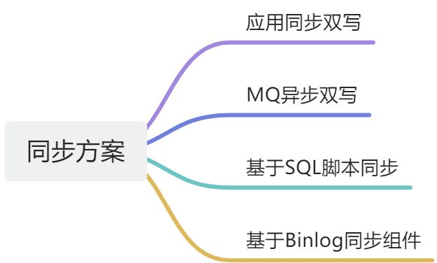
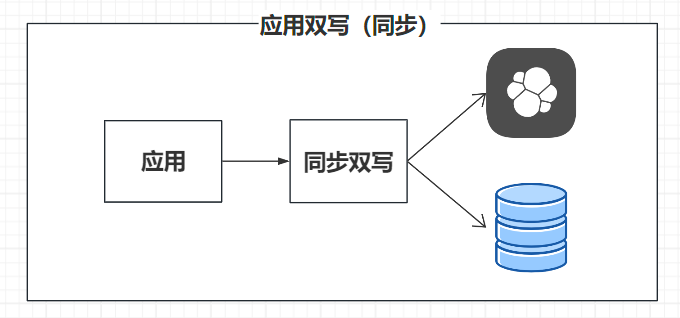
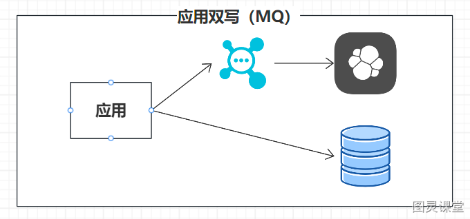
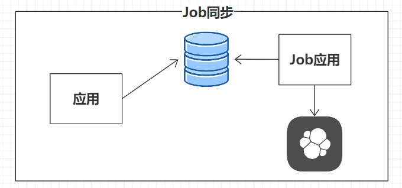
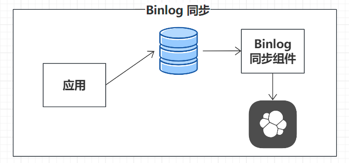

# MySQL 同步 ES 的 4种方案

在现代数据架构中，MySQL与Elasticsearch的集成是实现高效数据管理和复杂查询的关键。然而，保持两者间数据同步是一个挑战，涉及实时性、性能和一致性等多个方面。
本文将探讨**四种主要的同步方案**，旨在帮助技术团队根据业务需求和系统特性，选择最合适的同步方案。
通过简要分析各方案的优缺点及实施步骤，本文提供了一系列实用的参考信息，以指导数据同步架构的设计。我们的目标是让技术决策者能够快速把握每种策略的核心要点，做出明智的技术选择。

# 数据同步方案

## 同步双写
在数据写入MySQL的同时，通过编程逻辑将相同数据写入ES。

### 优点：

1. **实时性**：数据变更能够立即反映到Elasticsearch，保证了查询的实时性。
2. **简单性**：实现起来相对简单，不需要引入额外的组件或复杂逻辑。

### 缺点：

1. **性能影响**：每次写入MySQL的同时写入Elasticsearch，可能会对两个系统的性能都产生影响。
2. **数据一致性风险**：在高并发情况下，可能会遇到双写失败导致数据不一致的问题。
3. **系统耦合**：每个写入操作都需要双写逻辑，增加了业务逻辑的复杂性和维护难度。

### 实施步骤：

1. **代码修改**：在业务逻辑中，对于每次对MySQL的写入操作，复制相同的逻辑到Elasticsearch。
2. **事务管理**：使用数据库事务确保操作的原子性，避免数据不一致。
3. **性能优化**：考虑使用批量写入或异步处理来减少对性能的影响。

## 异步双写
利用消息队列（MQ）异步处理数据写入操作。

### 优点：

1. **性能提升**：通过异步处理，减少了对MySQL写入性能的影响。
2. **容错性**：利用消息队列的持久化和重试机制，提高了数据同步的可靠性。

### 缺点：

1. **数据延迟**：由于是异步处理，存在数据同步的延迟问题。
2. **系统复杂度**：需要引入消息队列和额外的消费者逻辑，增加了系统的复杂性。

### 实施步骤：

1. **消息队列集成**：选择并集成一个消息队列系统，如Kafka或RabbitMQ。
2. **业务逻辑修改**：将数据写入MySQL后，将变更信息发送到消息队列。
3. **消费者开发**：开发消费者服务，从消息队列中读取消息并异步写入Elasticsearch。
4. **异常处理**：为消息队列的消费者实现异常处理和重试逻辑。

## 基于 SQL 抽取
通过定时任务，根据数据库中的时间戳字段变化来抽取并同步数据至ES。

### 优点：

1. **无侵入性**：不需要修改现有业务逻辑，对原系统无感知。
2. **简单实现**：通过定时任务实现，逻辑简单，易于理解和维护。

### 缺点：

1. **时效性差**：数据同步存在延迟，无法满足实时性要求。
2. **性能压力**：定时任务可能会对数据库产生额外的查询压力。

### 实施步骤：

1. **时间戳字段添加**：在MySQL的数据表中添加时间戳字段，用于记录数据变更时间。
2. **定时任务配置**：设置定时任务，按照固定频率查询MySQL中自上次同步以来发生变化的数据。
3. **数据抽取**：定时任务将查询结果抽取出来，准备同步到Elasticsearch。
4. **数据同步**：将抽取的数据写入Elasticsearch，完成同步过程。

## 基于 Binlog 实时同步
利用MySQL的Binlog日志，通过消息队列或直接消费Binlog变化来同步数据至ES。

### 优点：

1. **无侵入性**：不需要修改现有的业务代码，对现有系统无感知。
2. **数据一致性**：可以利用Binlog精确捕捉到数据库的所有变更，确保数据同步的完整性。
3. **高性能**：Binlog可以高效地处理数据变更，对原数据库性能影响较小。
4. **容错性**：通常配合消息队列使用，即使在网络波动或服务故障的情况下，也能保证数据最终一致性。

### 缺点：

1. **系统复杂性**：需要搭建和维护Binlog监听和消息队列系统，增加了系统架构的复杂度。
2. **延时问题**：虽然是基于实时同步，但在极端情况下，如消息队列积压，仍然可能遇到数据同步延迟

### 实施步骤：

1. **Binlog启用**：确保MySQL实例开启了Binlog功能，并且Binlog格式（row或mixed）能够支持所需的数据同步需求。
2. **Binlog监听器配置**：部署并配置Binlog监听器（如Debezium），监听指定的MySQL实例和数据库。
3. **消息队列集成**：将Binlog监听器与消息队列（如Kafka）集成，确保Binlog变更能够被转换成消息并发送到队列中。
4. **消息消费者开发**：开发消息消费者服务，该服务从消息队列中读取Binlog变更消息，并将其转换为Elasticsearch能够理解的格式。
5. **数据同步**：消息消费者服务将转换后的数据写入Elasticsearch，完成数据同步。
6. **异常处理**：实现异常处理机制，确保在数据同步失败时能够进行重试或记录日志以便后续处理。

# 常用的数据迁移工具有哪些？

> 原文: <https://www.yuque.com/tulingzhouyu/db22bv/sg7uo2d8h6gz7v6k>