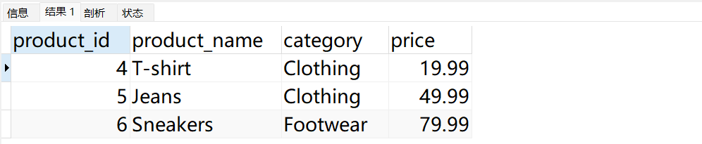
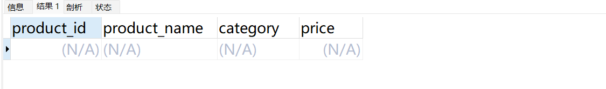
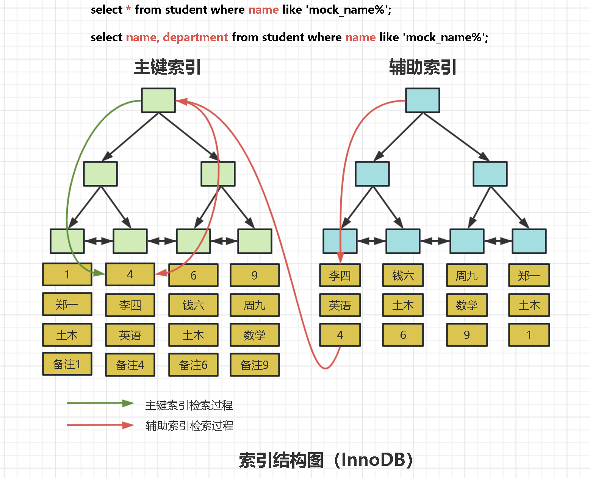

# Not In 不仅仅会导致索引失效，还会~~~~

通常提到 not in，大家脑海里第一个飘过的想法是什么？
是不是可能会导致索引失效。因为大部分小伙伴在通关八股文的时候是这么背的。
至于为什么 not in 会导致索引失效，可能有些小伙伴知其然不知其所以然，所以我再文章的结尾给大家准备好了完整的笔记，有兴趣的小伙伴可以评论区 666，然后私信获取。
回到今天的正题

## Not In 除了会导致索引失效，还会导致什么？
我们看下面的例子：
```sql
drop  table products;
CREATE TABLE products (
    product_id INT PRIMARY KEY,
    product_name VARCHAR(50),
    category VARCHAR(50),
    price DECIMAL(10, 2)
);


INSERT INTO products (product_id, product_name, category, price) VALUES
(1, 'Laptop', 'Electronics', 999.99),
(2, 'Smartphone', 'Electronics', 599.99),
(3, 'Headphones', 'Electronics', 99.99),
(4, 'T-shirt', 'Clothing', 19.99),
(5, 'Jeans', 'Clothing', 49.99),
(6, 'Sneakers', 'Footwear', 79.99),
(7, 'Tablet', null, 299.99);
```
```sql
-- 使用 NOT IN 查询 Electronics 类别以外的产品
SELECT * FROM products WHERE category NOT IN ('Electronics');
```

```sql
SELECT * FROM products WHERE category NOT IN ('Electronics', NULL);
```

到这里大家是不是就发现问题了，使用 Not In 会导致数据丢失，那么为什么会出现这种情况？
其实是当 SQL 中，使用 NOT IN 条件时，如果其中包含 NULL，可能会导致意外的结果，因为 NOT IN 不会返回任何匹配 NULL 值的行。因此，我们通常需要另外处理 NULL 值。比如：
```sql
SELECT * FROM products WHERE category NOT IN ('Electronics') OR category IS NULL;
```

### 但 NOT IN 不会返回任何匹配 NULL 值的行？
这个问题涉及到 SQL 中的三值逻辑，即真（TRUE）、假（FALSE）和未知（UNKNOWN）。
当你使用 NOT IN 条件时，如果其中包含 NULL 值，这会导致整个条件的结果不确定。这是因为 SQL 中的比较操作符（如 IN、NOT IN、=, !=等）对于 NULL 的处理方式是特殊的。具体来说：

1. 如果一个值与 NULL 进行比较，结果是未知（UNKNOWN）。
2. 如果一个条件的结果是未知（UNKNOWN），那么整个条件的结果也是未知（UNKNOWN）。

因此，当你使用 NOT IN 条件时，如果其中包含 NULL 值，它会导致整个条件结果为未知（UNKNOWN）。在 SQL 中，任何未知（UNKNOWN）的条件都被视为不符合条件，因此相关的行将被过滤掉，不会包含在结果中。
这就是为什么在处理包含 NULL 值的情况时，需要谨慎地使用条件，以确保你的查询逻辑正确。
在这种情况下，**使用 IS NULL 条件**或者**将 NULL 视为一个单独的选项**。

### 补充

- 真（TRUE）：代表条件或表达式为真。例如，如果一个条件符合或一个表达式为真，则结果为真。
- 假（FALSE）：代表条件或表达式为假。例如，如果一个条件不符合或一个表达式为假，则结果为假。
- 未知（UNKNOWN）：代表条件或表达式的真假未知。当无法确定条件或表达式的真实值时，结果为未知。这可能是因为某些数据缺失、表达式中存在空值（NULL）或其他不确定因素导致的。

## 为什么 Not In 会导致索引失效？
直接上一个索引结构图。 对索引底层结构不太了解的小伙伴点这个，[索引底层结构详解](https://www.yuque.com/tulingzhouyu/db22bv/yylct2c6wu76hurr?singleDoc# 《深入精讲》 密码：yk3o)：

以上图为例子，如果我们执行这条 SQL：
```sql
select * from student where name not in ('李四','周九');
```
大家认为他使用二级索引的情况下，扫描索引的过程是怎样的？
是不是要先找到 【李四，钱六】两条记录，然后在向两边发散，形成了好几个区间段，如下：

由于我们的 SQL 需要整行数据，所以不仅仅是区间段扫描，还需要进行回表，这种时候大多数的情况，MySQL 的优化器通常都会选择直接扫描全表，因为多次回表的成本会比直接全表扫描的成本更大。
而如果说我们的查询列都是索引列的话，即使我们使用 not in 也会走索引扫描，这里使用了[覆盖索引](https://www.yuque.com/tulingzhouyu/db22bv/ennukot046ikrou2?singleDoc# 《什么是覆盖索引？》 密码：yk3o)的方式来进行扫描。
现在大家就清楚为什么使用 not in 会导致索引失效了吧，脑海里有上边的图就好了。


> 原文: <https://www.yuque.com/tulingzhouyu/db22bv/oxc4t6v6i84a3da2>