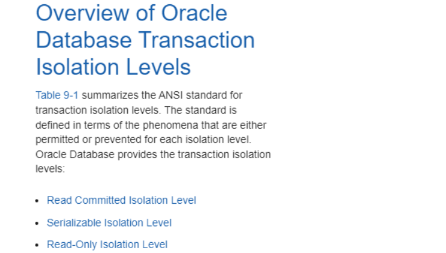

# 为什么MySQL要默认使用RR隔离级别？


## 隔离级别的划分

SQL-92 标准定义了 4 种隔离级别，从低到高依次为：
**读未提交(Read Uncommitted)、读已提交(Read Committed)、可重复读(Repeatable Reads)、序列化(Serializable)**。
> 在 RU 级别下，可能会出现脏读、幻读、不可重复读等问题。
在 RC 级别下，解决了脏读的问题，但仍存在幻读、不可重复读的问题。
在 RR 级别下，解决了脏读和不可重复读的问题，但仍存在幻读的问题。
在 Serializable 隔离级别下，解决了脏读、幻读、不可重复读全部问题。


## 常见数据库的隔离级别支持
Oracle 数据库只支持 SQL92 中的 Serializable 和 Read Committed，但实际上根据Oracle官方文档的介绍，Oracle支持三种隔离级别：Read Committed、Serializable 和 Read-Only，[官网地址](https://docs.oracle.com/cd/E11882_01/server.112/e40540/consist.htm#CNCPT621)。

MySQL 数据库支持SQL92 中的四种隔离级别。
需要注意的是，**Oracle的默认隔离级别是RC，而MySQL的默认隔离级别是RR**。

## 为什么 MySQL 选择的是 RR 级别？
MySQL 默认使用RR（可重复读）隔离级别的原因是基于历史和技术考虑。
MySQL 主从复制是通过 binlog 日志进行数据同步的，而在早期的版本中 binlog 记录的是SQL语句的原文。这个时候就会有一个问题，如果此时 [binlog 格式](https://www.yuque.com/tulingzhouyu/db22bv/yasy523q6yns52tc?singleDoc# 《Binlog有几种录入格式与区别》 密码：yk3o)设置为 statement 格式时，MySQL 可能会在从库执行 SQL 的逻辑与主库不一致。比如：
```sql
delete from user where a >= 13 and b<= '2024-04-21' limit 1;
```
**为什么 SQL 执行结果不一致：**

- 在主库执行这条 SQL 语句的时候，用的是索引 a；而在备库执行这条 SQL 语句的时候，却使用了索引 b。MySQL 执行优化器会进行采样预估，在不同的MySQL库里，采样计算出来的预估结果不一样，会影响优化器的判断，由于优化器会进行成本分析，可能最终选择的索引不一样。跟 [SQL 的执行过程](https://www.yuque.com/tulingzhouyu/db22bv/tuo2i8lwl418gnxd?singleDoc# 《一条SQL的执行过程是怎样的》 密码：yk3o)有关系。
- 而又因为这条 delete 语句带了 limit，所以查出的记录很大可能不会是同一条，排序不一样，因此很可能会出现主备数据不一致的情况。
- 另外，如果使用读已提交（Read Committed）或读未提交（Read Uncommitted）这两种隔离级别，是不会添加 Gap Lock 间隙锁的。而主从复制过程中出现的事务乱序的问题，更加容易导致备库在SQL回滚之后与主库内容不一致。

为了解决这个问题，MySQL选择了可重复读（Repeatable Read）隔离级别作为默认选项。
可重复读隔离级别，在更新数据时会增加记录锁和间隙锁，可以避免事务乱序导致的数据不一致问题。
还有一点需要注意，查资料的时候看到有说MySQL禁止在使用 statement 格式的 bin log 情况下，使用 READ COMMITTED 作为事务隔离级别会报错问题，亲测 MySQL8.0 不存在这个问题。可能是高版本修复了这个问题，SQL 如下：
```sql
SHOW VARIABLES LIKE 'binlog_format';

SELECT @@transaction_isolation;

SET binlog_format = 'STATEMENT';

SET SESSION TRANSACTION ISOLATION LEVEL read committed;
```

## 为什么 Oracle 选择的是 RC 级别？
Read-Only 隔离级别类似于序列化隔离级别，但只读事务甚至不允许在事务中进行数据修改。
很显然，在这三种隔离级别中，Serializable 和 Read-Only 显然都不适合作为默认隔离级别，Oracle 只剩下 Read Committed 这个选择。

## 为什么默认 RR，大厂要改成 RC？


> 原文: <https://www.yuque.com/tulingzhouyu/db22bv/qssfmgp67leg4tot>