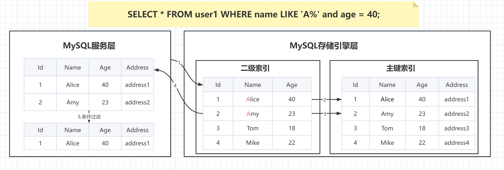
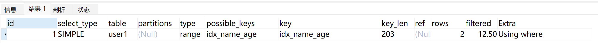
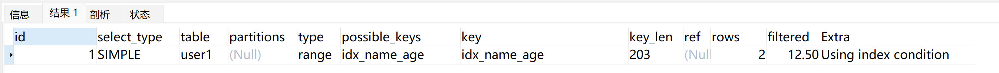

# 深入精讲


# 介绍索引下推
索引下推（INDEX CONDITION PUSHDOWN，简称 ICP）是在 MySQL 5.6 针对**扫描二级索引**的一项优化改进。总的来说是通过把索引过滤条件下推到**存储引擎**，来减少 MySQL 存储引擎访问基表的次数以及 MySQL 服务层访问存储引擎的次数。ICP 适用于 MYISAM 和 INNODB，本篇的内容只基于 INNODB。
在讲这个技术之前你得对mysql架构有一个简单的认识，见下图：


- MySQL 服务层：也就是 SERVER 层，用来解析 SQL 的语法、语义、生成查询计划、接管从 MySQL 存储引擎层上推的数据进行二次过滤等等。
- MySQL 存储引擎层：按照 MySQL 服务层下发的请求，通过索引或者全表扫描等方式把数据上传到 MySQL 服务层。
- MySQL 索引扫描：根据指定索引过滤条件，遍历索引找到索引键对应的主键值后回表过滤剩余过滤条件。
- MySQL 索引过滤：通过索引扫描并且基于索引进行二次条件过滤后再回表。

# 实战数据准备
```plsql
delete from user1;
drop table user1;

CREATE TABLE `user1` (
  `id` int(11) NOT NULL AUTO_INCREMENT,
  `name` varchar(50) NOT NULL,
  `age` tinyint(4) NOT NULL,
	`address` varchar(50) NOT NULL,
  PRIMARY KEY (`id`),
  KEY `idx_name_age` (`name`,`age`)
) ENGINE=InnoDB DEFAULT CHARSET=utf8mb4;

INSERT INTO `user1` (`name`, `age`, `address`) VALUES
('Alice', 40, 'address1'),
('Amy', 23, 'address2'),
('Tom', 18, 'address3'),
('Mike', 22, 'address4');

explain SELECT * FROM user1 WHERE name LIKE 'A%' and age = 23;

# 查看索引下推是否开启
select @@optimizer_switch
# 开启索引下推
set optimizer_switch="index_condition_pushdown=on";
# 关闭索引下推
set optimizer_switch="index_condition_pushdown=off";
```

# 索引下推实战
不使用索引下推实现，**认真观看数据流转步骤**

```plsql
Explain SELECT * FROM user1 WHERE name LIKE 'A%' and age = 40;
```

使用索引下推实现，**认真观看数据流转步骤**

```plsql
Explain SELECT * FROM user1 WHERE name LIKE 'A%' and age = 40;
```


# 索引下推的使用条件

- ICP目标是减少全行记录读取，从而减少IO 操作，只能用于非聚簇索引。聚簇索引本身包含的表数据，也就不存在下推一说。
- 只能用于`range`、 `ref`、 `eq_ref`、`ref_or_null`访问方法；
- where 条件中是用 `and` 而非 `or` 的时候。
- ICP适用于分区表。
- ICP不支持基于虚拟列上建立的索引，比如说函数索引
- ICP不支持引用子查询作为条件。
- ICP不支持存储函数作为条件，因为存储引擎无法调用存储函数。


> 原文: <https://www.yuque.com/tulingzhouyu/db22bv/hu6ho38qiugadvwr>