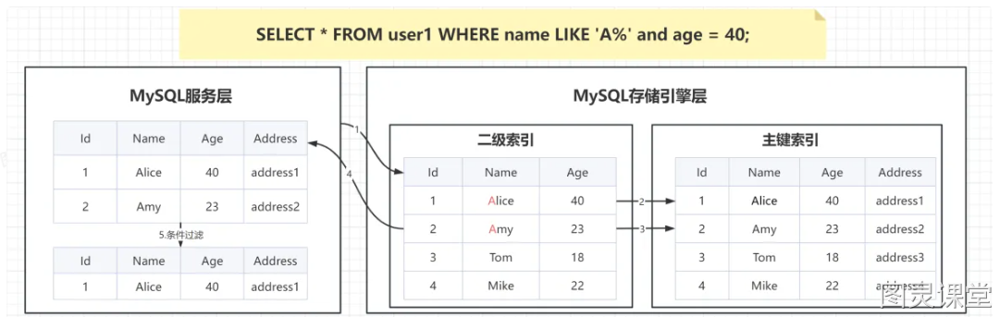
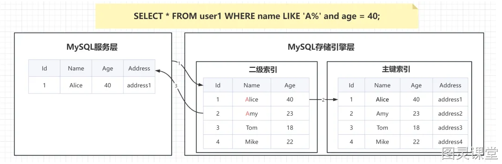

# 短视频

 又有同学问我索引下推是个什么索引，我.....   ....

索引下推它不是一种索引！ 它是一种**数据库查询优化技术**！它能够在查询过程中尽早地利用索引来过滤数据，减少不必要的数据读取，从而提高查询性能。

首先要知道当执行一条查询语句，  会通过**服务层解析SQL**、**优化索引**， 再通过**存储引擎层**根据索引**拿到数据**， ** 再把数据再交给服务层条件过滤**。

在MySQL 5.6之前,,,   是没有索引下推的，  当查询条件使用了联合索引并且最左条件是范围：    存储引擎只会返回最左条件的范围数据 ，  然后扔给服务层再去过去其他的条件，  这样增加了服务层计算压力一级存储引擎层和服务层之间的的数据传输量。

 

如果用到了索引下推
   
同样查询条件使用了联合索引并且最左条件是范围： 那这个时候   存储引擎在过滤完范围数据后会再过滤其他联合索引的数据， 所以条件过滤这一步从服务层下推到了存储引擎层，  所以叫索引下推。  这样就减少了两层之间数据的传递，也减轻了服务层的数据计算压力，从而提高了数据检索性能。
 
如果听懂的话可以给我三连支持，像这样的高频面试题我给大家整理好了一份80万字的资料， 需要可以再评论区扣666，希望帮助大家拿到更多offer。

 

 

举个例子  
我让媒婆给我找大长腿，18岁的女朋友，      媒婆一个电话联系婚介所告诉了条件，     婚介所只会把所有大长腿带给媒婆。  
媒婆再把同时是大长腿和18岁的女孩过滤一遍交给我。  
 有没有觉得太费劲了。

 其实媒婆就是服务层， 婚介就是存储引擎层，大长腿，18岁是联合索引， 媒婆如果让婚介所一次性把大长腿和18岁女孩都叫过来不是更省事吗？
所以应该把条件过滤这一步直接下推到存储引擎这一步去做，  放在服务层，会导致多次i/o操作而影响检索性能。 

> 原文: <https://www.yuque.com/tulingzhouyu/db22bv/wkdh9p48ybgya6g4>