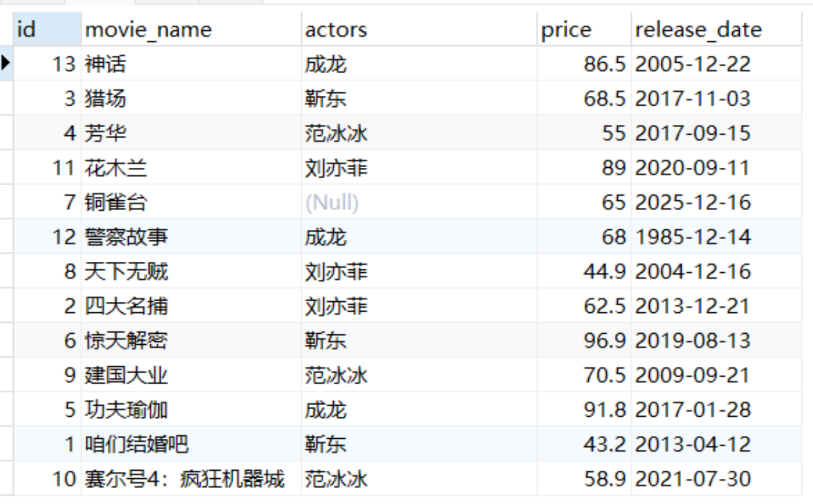
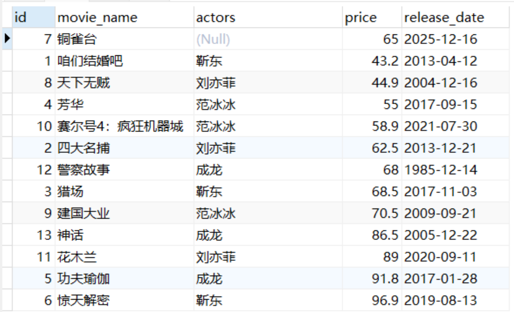
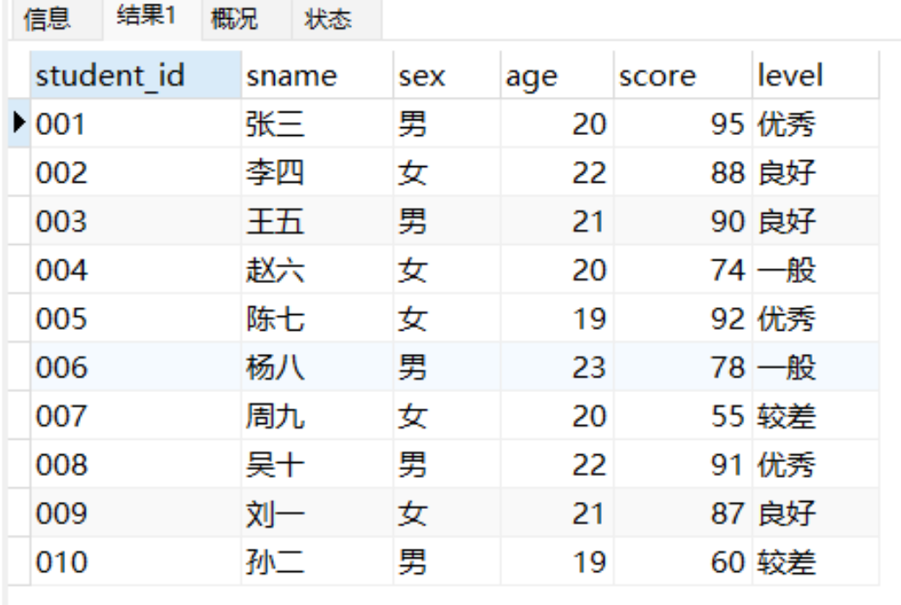
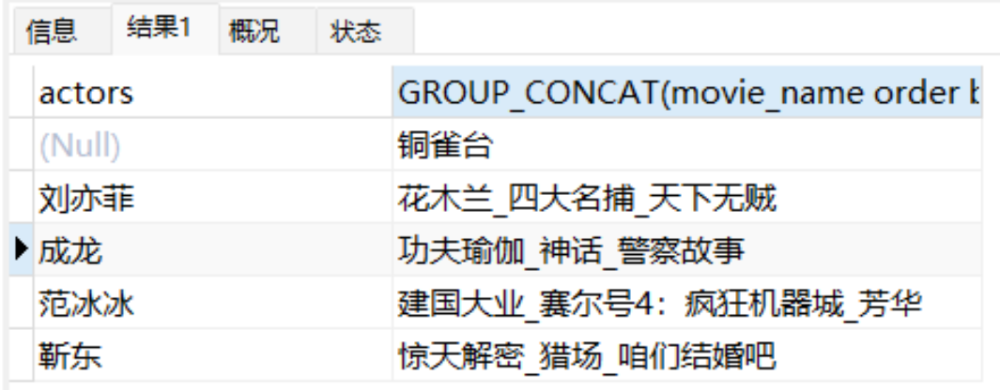
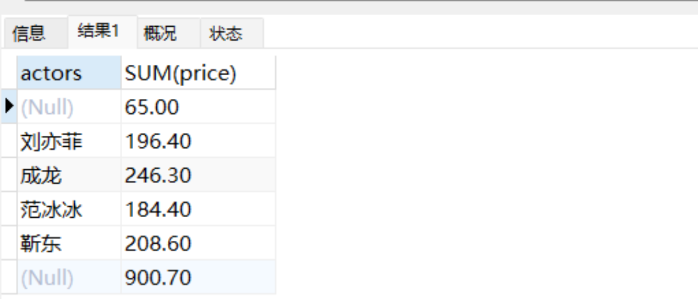
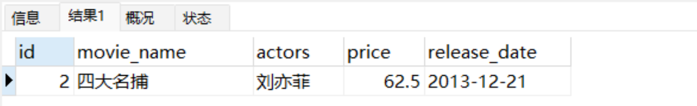

# 分享7种SQL的进阶用法


## 前言
还只会使用SQL进行简单的insert、update、detele吗？本文给大家带来7种SQL的进阶用法，让大家在平常工作中使用SQL简化复杂的代码逻辑。

## 1.自定义排序（ORDER BY FIELD）
在MySQL中ORDER BY排序除了可以用ASC和DESC之外，还可以使用自定义排序方式来实现。
```plsql
CREATE TABLE movies (  
  id INT PRIMARY KEY AUTO_INCREMENT,  
  movie_name VARCHAR(255),  
  actors VARCHAR(255),  
  price DECIMAL(10, 2) DEFAULT 50,  
  release_date DATE  
) ENGINE=InnoDB DEFAULT CHARSET=utf8mb4;

INSERT INTO movies (movie_name, actors, price, release_date) VALUES
('咱们结婚吧', '靳东', 43.2, '2013-04-12'),
('四大名捕', '刘亦菲', 62.5, '2013-12-21'),
('猎场', '靳东', 68.5, '2017-11-03'),
('芳华', '范冰冰', 55.0, '2017-09-15'),
('功夫瑜伽', '成龙', 91.8, '2017-01-28'),
('惊天解密', '靳东', 96.9, '2019-08-13'),
('铜雀台', null, 65, '2025-12-16'),
('天下无贼', '刘亦菲', 44.9, '2004-12-16'),
('建国大业', '范冰冰', 70.5, '2009-09-21'),
('赛尔号4：疯狂机器城', '范冰冰', 58.9, '2021-07-30'),
('花木兰', '刘亦菲', 89.0, '2020-09-11'),
('警察故事', '成龙', 68.0, '1985-12-14'),
('神话', '成龙', 86.5, '2005-12-22');
```
用法如下：
```plsql
select * from movies order by movie_name asc;

select * from movies ORDER BY FIELD(movie_name,'神话','猎场','芳华','花木兰',
'铜雀台','警察故事','天下无贼','四大名捕','惊天解密','建国大业',
'功夫瑜伽','咱们结婚吧','赛尔号4：疯狂机器城');
```


## 2.空值NULL排序（**ORDER BY IF(ISNULL**）)
在MySQL中使用ORDER BY关键字加上我们需要排序的字段名称就可以完成该字段的排序。如果字段中存在NULL值就会对我们的排序结果造成影响。
这时候我们可以使用 **ORDER BY IF(ISNULL(字段), 0, 1) **语法将NULL值转换成0或1，实现NULL值数据排序到数据集前面还是后面。
```plsql
select * from movies ORDER BY actors, price desc;

select * from movies ORDER BY if(ISNULL(actors),0,1), actors, price;
```


## 3.CASE表达式（CASE···WHEN）
在实际开发中我们经常会写很多if ··· else if ··· else，这时候我们可以使用CASE···WHEN表达式解决这个问题。
以学生成绩举例。比如说：学生90分以上评为优秀，分数80-90评为良好，分数60-80评为一般，分数低于60评为“较差”。那么我们可以使用下面这种查询方式：
```plsql
CREATE TABLE student (
  student_id varchar(10) NOT NULL COMMENT '学号',
  sname varchar(20) DEFAULT NULL COMMENT '姓名',
  sex char(2) DEFAULT NULL COMMENT '性别',
  age int(11) DEFAULT NULL COMMENT '年龄',
  score float DEFAULT NULL COMMENT '成绩',
  PRIMARY KEY (student_id)
) ENGINE=InnoDB DEFAULT CHARSET=utf8mb4 COMMENT='学生表';

INSERT INTO student (student_id, sname, sex, age , score)
VALUES ('001', '张三', '男', 20,  95),
       ('002', '李四', '女', 22,  88),
       ('003', '王五', '男', 21,  90),
       ('004', '赵六', '女', 20,  74),
       ('005', '陈七', '女', 19,  92),
       ('006', '杨八', '男', 23,  78),
       ('007', '周九', '女', 20,  55),
       ('008', '吴十', '男', 22,  91),
       ('009', '刘一', '女', 21,  87),
       ('010', '孙二', '男', 19,  60);
```
```plsql
select *,case when score > 90 then '优秀'
			when score > 80 then '良好'
			when score > 60 then '一般'
			else '较差' end level
from student;
```


## 4.分组连接函数（GROUP_CONCAT）
分组连接函数可以在分组后指定字段的字符串连接方式，并且还可以指定排序逻辑；连接字符串默认为英文逗号。
比如说根据演员进行分组，并将相应的电影名称按照票价进行降序排列，而且电影名称之间通过“_”拼接。用法如下：
```plsql
select actors,
GROUP_CONCAT(movie_name),
GROUP_CONCAT(price) from movies GROUP BY actors;

select actors,
GROUP_CONCAT(movie_name order by price desc SEPARATOR '_'),
GROUP_CONCAT(price order by price desc SEPARATOR '_') 
from movies GROUP BY actors;
```


## 5.分组统计数据后再进行统计汇总（with rollup）
在MySql中可以使用 with rollup在分组统计数据的基础上再进行数据统计汇总，即将分组后的数据进行汇总。
```plsql
SELECT actors, SUM(price) FROM movies GROUP BY actors;

SELECT actors, SUM(price) FROM movies GROUP BY actors WITH ROLLUP;
```


## 6.子查询提取（with as）
如果一整句查询中多个子查询都需要使用同一个子查询的结果，那么就可以用with as将共用的子查询提取出来并取一个别名。后面查询语句可以直接用，对于大量复杂的SQL语句起到了很好的优化作用。
需求：获取演员刘亦菲票价大于50且小于65的数据。
```plsql
with m1 as (select * from movies where price > 50),
 m2 as (select * from movies where price >= 65)
select * from m1 where m1.id not in (select m2.id from m2) and m1.actors = '刘亦菲';
```


## 7.优雅处理数据插入、更新时主键、唯一键重复
在MySql中插入、更新数据有时会遇到主键重复的场景，通常的做法就是先进行删除在插入达到可重复执行的效果，但是这种方法有时候会错误删除数据。
1.**插入数据时**我们可以使用**IGNORE**，它的作用是插入的值遇到主键或者唯一键重复时自动忽略重复的数据，不影响后面数据的插入，即**有则忽略，无则插入**。示例如下：
```plsql
select * from movies where id >= 13;

INSERT INTO movies (id, movie_name, actors, price, release_date) VALUES
(13, '神话', '成龙', 100, '2005-12-22');

INSERT IGNORE INTO movies (id, movie_name, actors, price, release_date) VALUES
(13, '神话', '成龙', 100, '2005-12-22');

INSERT IGNORE INTO movies (id, movie_name, actors, price, release_date) VALUES
(14, '神话2', '成龙', 114, '2005-12-22');
```
2.还可以使用**REPLACE**关键字，当插入的记录遇到主键或者唯一键重复时先删除表中重复的记录行再插入，即**有则删除+插入，无则插入**，示例如下：
```plsql
REPLACE INTO movies (id, movie_name, actors, price, release_date) VALUES
(14, '神话2', '成龙', 100, '2005-12-22');

REPLACE INTO movies (id, movie_name, actors, price, release_date) VALUES
(15, '神话3', '成龙', 115, '2005-12-22');
```

3.更新数据时使用**on duplicate key update**。它的作用就是当插入的记录遇到主键或者唯一键重复时，会执行后面定义的UPDATE操作。相当于先执行Insert 操作，再根据主键或者唯一键执行update操作，即**有就更新，没有就插入**。示例如下：
```plsql
INSERT INTO movies (id, movie_name, actors, price, release_date) VALUES
(15, '神话3', '成龙', 115, '2005-12-22') on duplicate key update price = price + 10;

INSERT INTO movies (id, movie_name, actors, price, release_date) VALUES
(16, '神话4', '成龙', 75, '2005-12-22') on duplicate key update price = price + 10;
```


> 原文: <https://www.yuque.com/tulingzhouyu/db22bv/aqf1z5gur31v8gbi>