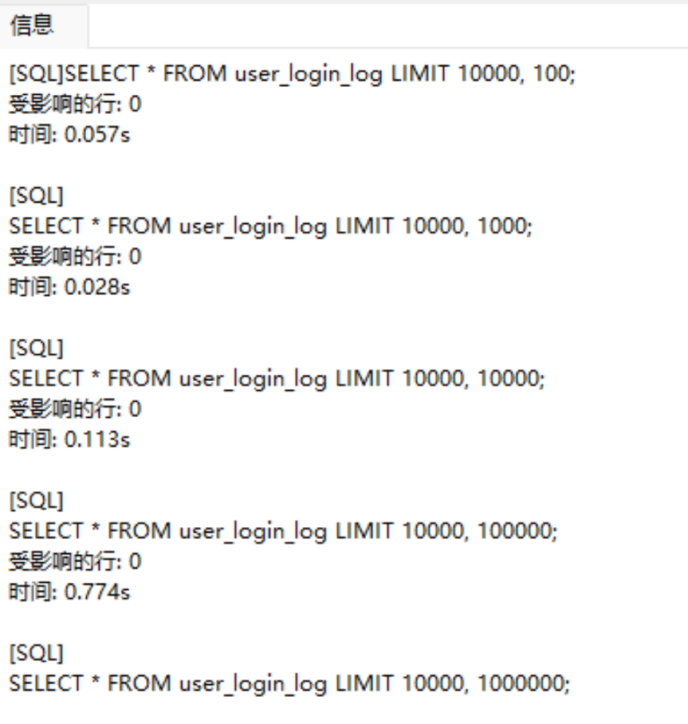
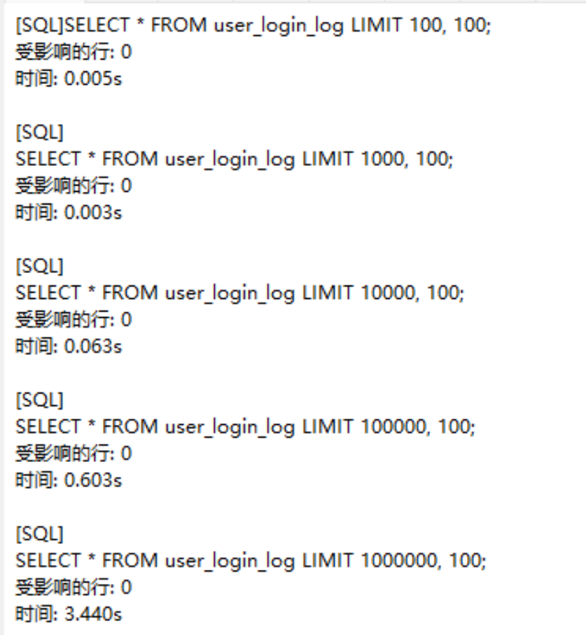
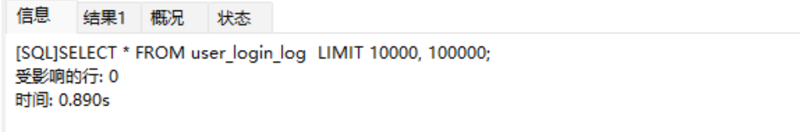
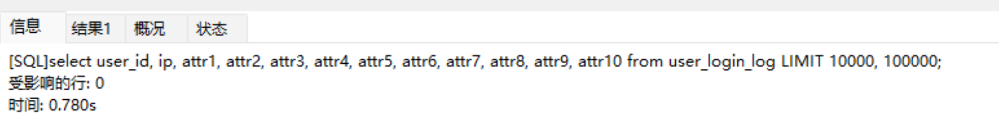
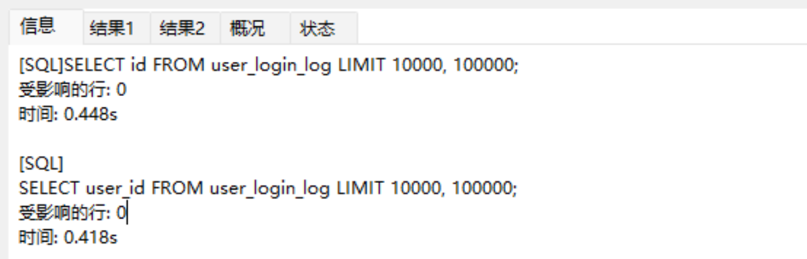
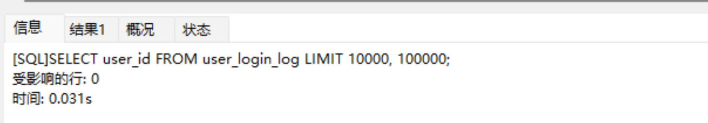
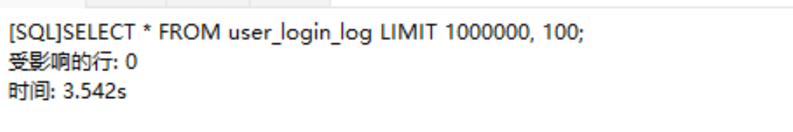
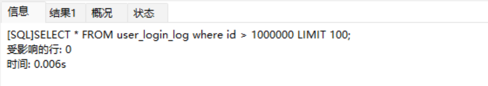

# 深入精讲


### 1.数据准备
```plsql
-- 1.创建表：
drop table user_login_log;

CREATE TABLE user_login_log (
  id INT PRIMARY KEY AUTO_INCREMENT,
  user_id VARCHAR(64) NOT NULL,
  ip VARCHAR(20) NOT NULL,
  attr1 VARCHAR(255),
  attr2 VARCHAR(255),
  attr3 VARCHAR(255),
  attr4 VARCHAR(255),
  attr5 VARCHAR(255),
  attr6 VARCHAR(255),
  attr7 VARCHAR(255),
  attr8 VARCHAR(255),
  attr9 VARCHAR(255),
  attr10 VARCHAR(255)
) ENGINE=InnoDB DEFAULT CHARSET=utf8mb4;

-- 2.mock数据：
-- 创建存储过程
DELIMITER $$
CREATE PROCEDURE insert_mock_data(IN n INT)
BEGIN
  DECLARE i INT DEFAULT 0;
	set autocommit = 0;
  WHILE i < n DO
    INSERT INTO user_login_log(user_id, ip, attr1, attr2, attr3, attr4, attr5, attr6, attr7, attr8, attr9, attr10)
    VALUES (
      CONCAT('user_', FLOOR(RAND() * 10000)),
      CONCAT(FLOOR(RAND() * 256), '.', FLOOR(RAND() * 256), '.', FLOOR(RAND() * 256), '.', FLOOR(RAND() * 256)),
      CONCAT('attr1_', 'ZPdUqUBYmoJJakYmoLNJTyMnfOBpXTBbDKOSUWYfCxFJFakYoyCqXNZJkhfeizXsSmZPdUqUBYmoJJakYmoLNJTyMnfOBpXTBbDKOSUWYfCxFJFakYoyCqXNZJkhfeizXsSm'),
      CONCAT('attr2_', 'ZPdUqUBYmoJJakYmoLNJTyMnfOBpXTBbDKOSUWYfCxFJFakYoyCqXNZJkhfeizXsSmZPdUqUBYmoJJakYmoLNJTyMnfOBpXTBbDKOSUWYfCxFJFakYoyCqXNZJkhfeizXsSm'),
      CONCAT('attr3_', 'ZPdUqUBYmoJJakYmoLNJTyMnfOBpXTBbDKOSUWYfCxFJFakYoyCqXNZJkhfeizXsSmZPdUqUBYmoJJakYmoLNJTyMnfOBpXTBbDKOSUWYfCxFJFakYoyCqXNZJkhfeizXsSm'),
      CONCAT('attr4_', 'ZPdUqUBYmoJJakYmoLNJTyMnfOBpXTBbDKOSUWYfCxFJFakYoyCqXNZJkhfeizXsSmZPdUqUBYmoJJakYmoLNJTyMnfOBpXTBbDKOSUWYfCxFJFakYoyCqXNZJkhfeizXsSm'),
      CONCAT('attr5_', 'ZPdUqUBYmoJJakYmoLNJTyMnfOBpXTBbDKOSUWYfCxFJFakYoyCqXNZJkhfeizXsSmZPdUqUBYmoJJakYmoLNJTyMnfOBpXTBbDKOSUWYfCxFJFakYoyCqXNZJkhfeizXsSm'),
      CONCAT('attr6_', 'ZPdUqUBYmoJJakYmoLNJTyMnfOBpXTBbDKOSUWYfCxFJFakYoyCqXNZJkhfeizXsSmZPdUqUBYmoJJakYmoLNJTyMnfOBpXTBbDKOSUWYfCxFJFakYoyCqXNZJkhfeizXsSm'),
      CONCAT('attr7_', 'ZPdUqUBYmoJJakYmoLNJTyMnfOBpXTBbDKOSUWYfCxFJFakYoyCqXNZJkhfeizXsSmZPdUqUBYmoJJakYmoLNJTyMnfOBpXTBbDKOSUWYfCxFJFakYoyCqXNZJkhfeizXsSm'),
      CONCAT('attr8_', 'ZPdUqUBYmoJJakYmoLNJTyMnfOBpXTBbDKOSUWYfCxFJFakYoyCqXNZJkhfeizXsSmZPdUqUBYmoJJakYmoLNJTyMnfOBpXTBbDKOSUWYfCxFJFakYoyCqXNZJkhfeizXsSm'),
      CONCAT('attr9_', 'ZPdUqUBYmoJJakYmoLNJTyMnfOBpXTBbDKOSUWYfCxFJFakYoyCqXNZJkhfeizXsSmZPdUqUBYmoJJakYmoLNJTyMnfOBpXTBbDKOSUWYfCxFJFakYoyCqXNZJkhfeizXsSm'),
      CONCAT('attr10_', 'ZPdUqUBYmoJJakYmoLNJTyMnfOBpXTBbDKOSUWYfCxFJFakYoyCqXNZJkhfeizXsSmZPdUqUBYmoJJakYmoLNJTyMnfOBpXTBbDKOSUWYfCxFJFakYoyCqXNZJkhfeizXsSm')
    );
		if i % 1000 = 0 then
			commit;
		end if;
    SET i = i + 1;
  END WHILE;
END$$
DELIMITER ;

-- 生成随机数
-- 为了提升mock数据的效率，这里把额外字段数据写死了。
-- 如果想修改成随机数，将第二个参数换成rand_string(66)，也就是改成 CONCAT('attr*_', rand_string(66)) 就可以啦。
CREATE FUNCTION rand_string(n INT)
RETURNS VARCHAR(255) DETERMINISTIC NO SQL
BEGIN
  DECLARE chars_str VARCHAR(100) DEFAULT 'abcdefghijklmnopqrstuvwxyzABCDEFJHIJKLMNOPQRSTUVWXYZ';
  DECLARE return_str VARCHAR(255) DEFAULT '';
  DECLARE i INT DEFAULT 0;
  WHILE i < n DO 
    SET return_str = CONCAT(return_str, SUBSTRING(chars_str,FLOOR(1+RAND()*52),1));
    SET i = i + 1;
  END WHILE;
  RETURN return_str;
END;

-- 调用存储过程插入1000万条数据
CALL insert_mock_data(10000000);
```

### 2.普通分页查询
MySQL通过Limit关键字实现分页查询，语法如下：
```plsql
SELECT column_name(s) FROM table_name Limit offset, row_count;
```
其中，offset 表示起始偏移量，row_count 表示要返回的行数。在执行 SELECT 查询时，MySQL首先会先扫描整个表或使用索引，找到所有符合 WHERE 条件的记录。这个过程需要将所有记录都读入内存，然后根据 LIMIT 子句的指定返回查询结果集中的一部分。
例如以下语句表示从第 10001 条数据开始返回 10 条数据。
```plsql
SELECT * FROM user_login_log LIMIT 10000, 10;
```

### 3.待优化的SQL

#### 1.相同偏移量，不同数据量
```plsql
SELECT * FROM user_login_log LIMIT 10000, 100;
SELECT * FROM user_login_log LIMIT 10000, 1000;
SELECT * FROM user_login_log LIMIT 10000, 10000;
SELECT * FROM user_login_log LIMIT 10000, 100000;
SELECT * FROM user_login_log LIMIT 10000, 1000000;
```

从上面结果可以得出结论：数据量越大，花费时间越长

#### 2.相同数据量，不同偏移量
```plsql
SELECT * FROM user_login_log LIMIT 100, 100;
SELECT * FROM user_login_log LIMIT 1000, 100;
SELECT * FROM user_login_log LIMIT 10000, 100;
SELECT * FROM user_login_log LIMIT 100000, 100;
SELECT * FROM user_login_log LIMIT 1000000, 100;
```

从上面结果可以得出结论：偏移量越大，花费时间越长

### 4.优化方案

#### 1.数据量越大优化方案
```plsql
-- 原sql
SELECT * FROM user_login_log LIMIT 10000, 100000;
```


##### 1.明确查询字段，避免使用select *，减少MySQL优化器负担。
```plsql
-- 避免使用select *
select user_id, ip, attr1, attr2, attr3, attr4, attr5, attr6, attr7, attr8, attr9, attr10 from user_login_log LIMIT 10000, 100000;
```


##### 2.按需查找字段，减少网络IO消耗。
```plsql
-- 按需查找字段
SELECT id FROM user_login_log LIMIT 10000, 100000;
SELECT user_id FROM user_login_log LIMIT 10000, 100000;
```


##### 3.查询字段索引覆盖，通过辅助索引提升查询效率（与MySQL的B+树存储结构有关系，不了解的小伙伴可以查看为什么要避免select * 小节）。
```plsql
-- 覆盖索引
ALTER TABLE user_login_log ADD index idx_user_id (user_id);
SELECT user_id FROM user_login_log LIMIT 10000, 100000;

alter TABLE user_login_log drop index idx_user_id;
```

针对数据量大的情况，我们可以做如下优化：

- 按需查询字段，减少网络IO消耗
- 避免使用select *，减少MySQL优化器负担
- 查询的字段尽量保证索引覆盖
- 借助nosql缓存数据缓解MySQL数据库的压力

#### 2.偏移量越大优化方案
```plsql
SELECT * FROM user_login_log LIMIT 1000000, 100;
```

**偏移量大的场景我们也可以使用数据量大的优化方案，除此之外还可以将偏移量改为使用Id限定的方式提升查询效率。**
```plsql
-- 增加索引where条件，缩减数据范围
SELECT * FROM user_login_log where id > 1000000 LIMIT 100;
```

针对偏移量越大的情况，我们可以做如下优化：

- 添加where条件缩减扫描条数，然后limit关键再进行数据筛选（使用索引字段进行条件过滤）


> 原文: <https://www.yuque.com/tulingzhouyu/db22bv/ao9n8b3nf78m60t4>