# 深入精讲

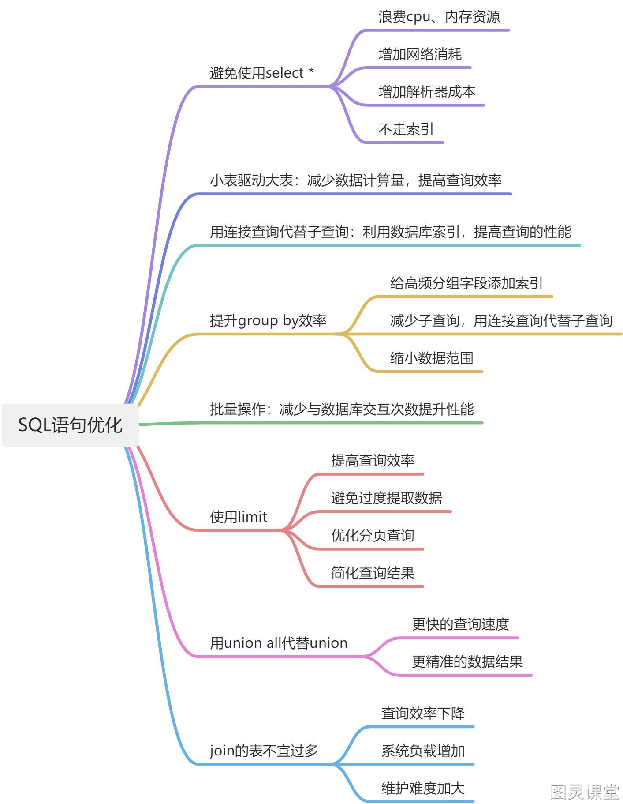

### 1. SQL语句优化

#### 1.1. 准备工作：

##### 1.1.1. 创建student表：
```sql
DROP TABLE IF EXISTS student;
CREATE TABLE student (
  id int(10) NOT NULL AUTO_INCREMENT COMMENT '序号',
  student_id INT NOT NULL COMMENT '学号',
  name varchar(20) COMMENT '姓名',
  department varchar(20) COMMENT '院系',
  remarks varchar(400) COMMENT '备注',
  PRIMARY KEY (id)
) ENGINE=InnoDB DEFAULT CHARSET=utf8mb4;
```

##### 1.1.2. 创建scores表：
```sql
DROP TABLE IF EXISTS scores;
CREATE TABLE scores (
   id INT NOT NULL PRIMARY KEY AUTO_INCREMENT COMMENT '序号',
   student_id INT NOT NULL COMMENT '学号',
   course_name VARCHAR(50) NOT NULL COMMENT '课程名称',
   score INT NOT NULL COMMENT '分数',
   remarks varchar(400) COMMENT '备注'
) ENGINE=InnoDB DEFAULT CHARSET=utf8mb4;
```

##### 1.1.3. 添加索引：
```sql
ALTER TABLE student ADD index idx_name_department (name, department);
```

##### 1.1.4. 插入数据：
```sql
INSERT INTO `student` (`name`,`student_id`,`department`,`remarks`) values ('刘零',1,'美术','备注0');
INSERT INTO `student` (`name`,`student_id`,`department`,`remarks`) values ('郑一',2,'土木','备注1');
INSERT INTO `student` (`name`,`student_id`,`department`,`remarks`) values ('吴二',3,'数学','备注2');
INSERT INTO `student` (`name`,`student_id`,`department`,`remarks`) values ('张三',4,'中文','备注3');
INSERT INTO `student` (`name`,`student_id`,`department`,`remarks`) values ('李四',5,'英语','备注4');
INSERT INTO `student` (`name`,`student_id`,`department`,`remarks`) values ('王五',6,'美术','备注5');
INSERT INTO `student` (`name`,`student_id`,`department`,`remarks`) values ('钱六',7,'土木','备注6');
INSERT INTO `student` (`name`,`student_id`,`department`,`remarks`) values ('孙七',8,'数学','备注7');
INSERT INTO `student` (`name`,`student_id`,`department`,`remarks`) values ('赵八',9,'英语','备注8');
INSERT INTO `student` (`name`,`student_id`,`department`,`remarks`) values ('周九',10,'数学','备注9');
```
```sql
BEGIN
	DECLARE v_name VARCHAR(20);
  DECLARE v_department VARCHAR(20);
	DECLARE i INT DEFAULT 0;
	DECLARE n INT DEFAULT 100000;
	DECLARE v_max_id INT DEFAULT 1;
	set autocommit = 0;
	select max(id) into v_max_id from student;
	REPEAT
		set i = i + 1;
		set v_max_id = v_max_id + 1;
		set v_name = CONCAT('mock_name',i);
		set v_department = CONCAT('mock_department',i);
		INSERT INTO `student` (`student_id`,`name`,`department`,`remarks`) values (v_max_id,v_name,v_department,'mock_remarks_mock_remarks_mock_remarks_mock_remarks_mock_remarks_mock_remarks_mock_remarks_mock_remarks_mock_remarks_mock_remarks_mock_remarks');

		INSERT INTO `scores` (`student_id`,`course_name`,`score`,`remarks`) values (v_max_id,CONCAT('mock_Chinese',i),RAND()*(100-50)+50,'mock_remarks_mock_remarks_mock_remarks_mock_remarks_mock_remarks_mock_remarks_mock_remarks_mock_remarks_mock_remarks_mock_remarks_mock_remarks');
		INSERT INTO `scores` (`student_id`,`course_name`,`score`,`remarks`) values (v_max_id,CONCAT('mock_Math',i),RAND()*(100-50)+50,'mock_remarks_mock_remarks_mock_remarks_mock_remarks_mock_remarks_mock_remarks_mock_remarks_mock_remarks_mock_remarks_mock_remarks_mock_remarks');
		INSERT INTO `scores` (`student_id`,`course_name`,`score`,`remarks`) values (v_max_id,CONCAT('mock_English',i),RAND()*(100-50)+50,'mock_remarks_mock_remarks_mock_remarks_mock_remarks_mock_remarks_mock_remarks_mock_remarks_mock_remarks_mock_remarks_mock_remarks_mock_remarks');

		UNTIL i = n
	END REPEAT;
	COMMIT;
	set autocommit = 1;
END
```

#### 1.2. SQL优化规则：

##### 1.2.1. 避免使用select *
阿里规范：

分析：
查看执行计划，select * 走全表扫描，没有用到任何索引，查询效率非常低；查询列都是索引列那么这些列被称为覆盖索引。这种情况下查询的相关字段都能走索引，索引查询的效率相对较高。
```sql
EXPLAIN select * from student where name like 'mock_name%';--不走索引
EXPLAIN select name, department from student where name like 'mock_name%';--走索引
```
通过show warnings语句查看查询列*号替换成表所有字段。
```sql
EXPLAIN select * from student where name like 'mock_name%';--替换成表对应的字段
SHOW WARNINGS;
```
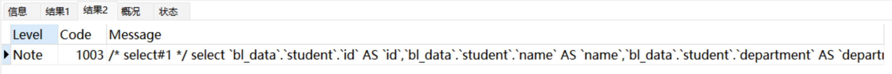
总结：

- 查询时需要先将星号解析成表的所有字段然后在查询，**增加查询解析器的成本**；
- select  * 查询一般**不走覆盖索引**会产生大量的回表查询；
- 在实际应用中我们通常只需要使用某几个字段，其他不需要使用的字段也查出来**浪费CPU、内存资源**；
- 文本数据、大字段数据数据传输**增加网络消耗**。

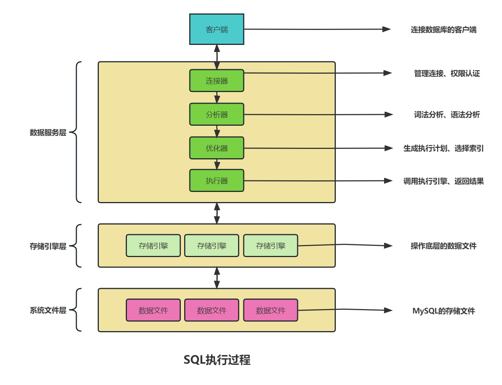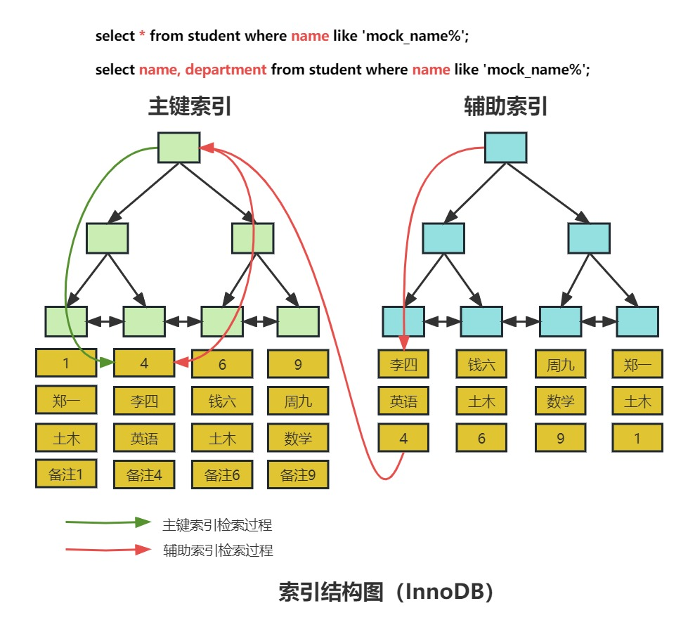
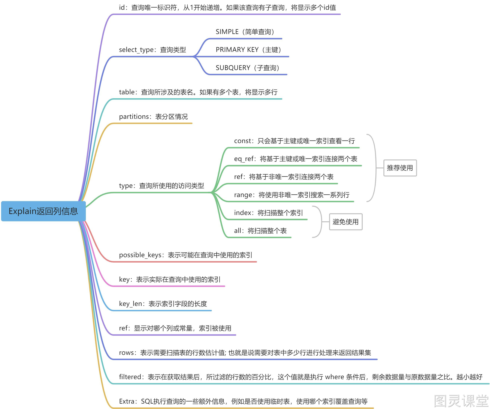

##### 1.2.2. 小表驱动大表
小表驱动大表就是指用数据量较小、索引比较完备的表，然后使用其索引和条件对大表进行数据筛选，从而减少数据计算量，提高查询效率。比如说student表有30条数据，scores表有80w条数据。
```sql
小表驱动大表
EXPLAIN
select * from student left join scores on student.id = scores.student_id;
```
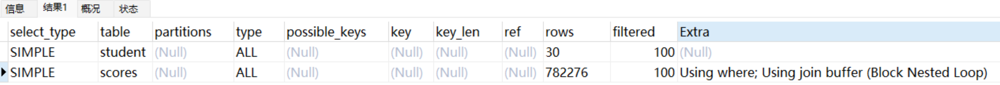
```sql
EXPLAIN
select * from scores left join student on student.id = scores.student_id;
```
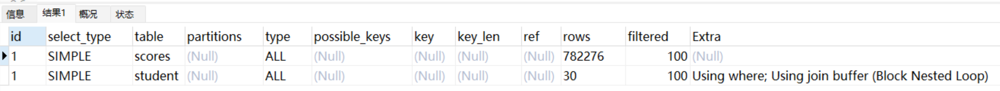
Join Buffer（连接缓冲区）是优化器用于处理连接查询操作时的临时缓冲区。简单来说当我们需要比较两个或多个表的数据进行Join操作时，Join Buffer可以帮助MySQL临时存储结果，以减少磁盘读取和CPU负担，提高查询效率。需要注意的是每个join都有一个单独的缓冲区。
Block nested-loop join（BNL算法）会将驱动表数据加载到join buffer里面，然后再批量与非驱动表进行匹配；如果驱动表数据量较大，join buffer无法一次性装载驱动表的结果集，将会分阶段与被驱动表进行批量数据匹配，会增加被驱动表的扫描次数，从而降低查询效率。所以开发中要遵守小表驱动大表的原则。
分阶段匹配过程如下：
1、先把student表前15条数据读到join buffer中。
2、然后用scores表去匹配join buffer中的前15条。
3、记录下匹配结果。
4、清空join buffer。
5、再把student表后15条读取join buffer中。
6、然后用scores表去匹配join buffer中的后15条。
7、记录下匹配结果。
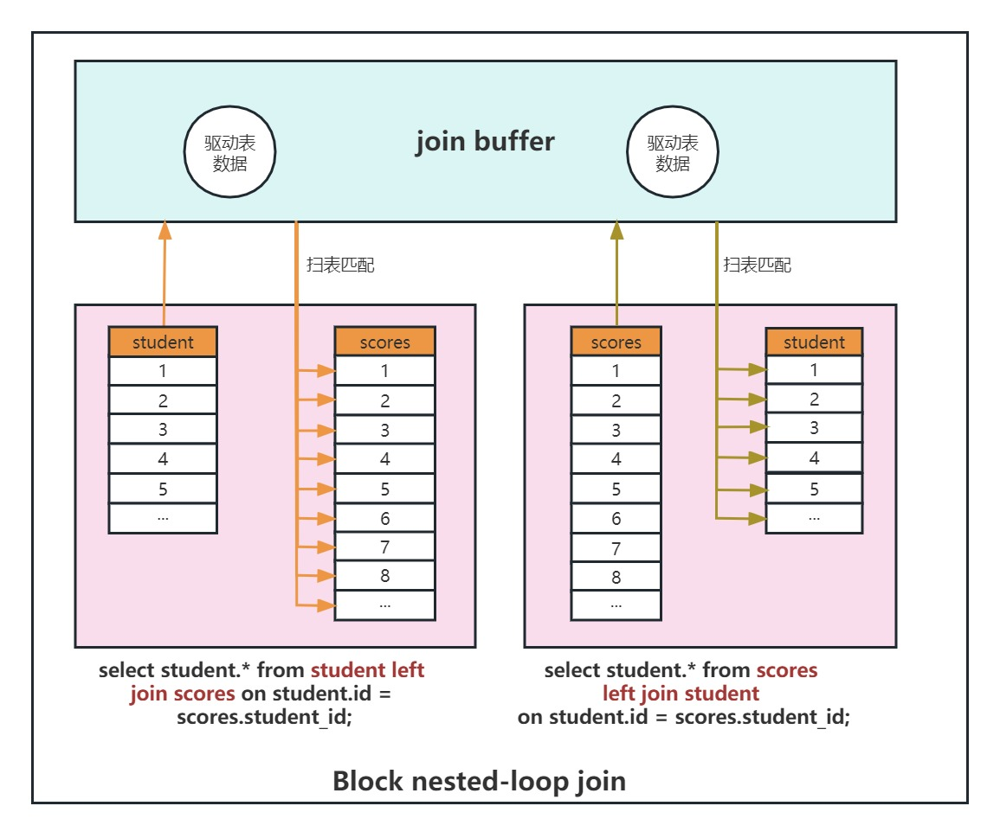

##### 1.2.3. 用连接查询代替子查询
mysql需要在两张表以上获取数据的方式有两种：第一种通过连表查询获取，第二种通过子查询获取。
模拟一个真实场景，同样student表有30条数据，scores表有80w条数据，我们想查看学号小于15的学员各科分数信息：
```sql
ALTER TABLE scores ADD index idx_student_id (student_id);

EXPLAIN
SELECT
	(SELECT student.NAME FROM student WHERE student.id = scores.student_id),
	scores.course_name,
	scores.score
FROM
	scores;
```
因为子查询需要执行两次数据库查询，一次是外部查询，一次是嵌套子查询。因此，使用连接查询可以减少数据库查询的次数，提高查询的效率。
连接查询可以更好地利用数据库索引，提高查询的性能。子查询通常会使用临时表或内存表，而连接查询可以直接利用表上的索引。这意味着连接查询可以更快地访问表中的数据，减少查询的资源消耗。
对于大型数据集，使用连接查询通常比使用子查询更高效。子查询通常需要扫描整个表，而连接查询可以利用索引加速读取操作。
```sql
EXPLAIN
SELECT
	student.NAME,
	scores.course_name,
	scores.score
FROM
	student inner JOIN scores ON student.id = scores.student_id;
```
使用连接查询可以更快地执行查询操作，减少数据库的负载，提高查询的性能和效率。

##### 1.2.4. 提升group by的效率

- 创建索引：如果你使用group by的列没有索引，那么查询可能会变得很慢。因此，可以创建一个或多个适当的索引来加速查询。
```sql
select remarks from scores group by remarks;
```

添加索引前：

添加索引后：
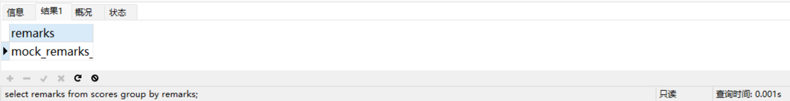

- 调整查询：查询的写法也会影响group by的效率。可以尝试不使用子查询或临时表，或者可以使用JOIN或EXISTS来代替IN子查询。
- 限制结果集的数量：如果你只需要查看一小部分结果，可以在查询中添加LIMIT子句，以便只返回一定数量的结果。

##### 1.2.5. 批量操作
批量插入或批量删除数据，比如说现在需要将1w+数据插入到数据库，大家是一条一条处理还是批量操作呢？建议是批量操作，逐个处理会频繁的与数据库交互，损耗性能。

##### 1.2.6. 使用limit

- 提高查询效率：一个查询返回成千上万的数据行，不仅占用了大量的系统资源，也会占用更多的网络带宽，影响查询效率。使用LIMIT可以限制返回的数据行数，减轻了系统负担，提高了查询效率。
- 避免过度提取数据：对于大型数据库系统，从数据库中提取大量的数据可能会导致系统崩溃。使用LIMIT可以限制提取的数据量，避免过度提取数据，保护系统不受影响。
- 优化分页查询：分页查询需要查询所有的数据才能进行分页处理，这会浪费大量的系统资源和时间。使用LIMIT优化分页查询可以只查询需要的数据行，缩短查询时间，减少资源的浪费。
- 简化查询结果：有时我们只需要一小部分数据来得出决策，而不是整个数据集。使用LIMIT可以使结果集更加精简和易于阅读和理解。

限制行数非常有用，因为它可以提高查询性能、减少处理需要的时间，并且只返回我们关心的列。

##### 1.2.7. 用union all代替union

- union all：获取所有数据但是数据不去重，包含重复数据；
- union：获取所有数据且数据去重，不包含重复数据；
```sql
select id,name,department from student
union all
select id,student_id,score from scores
```
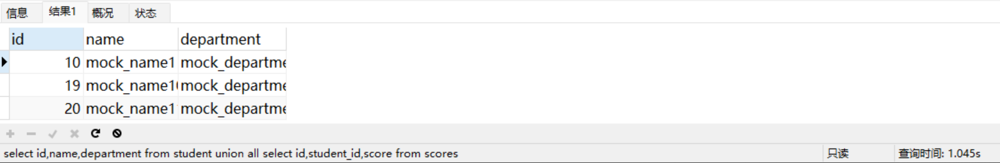
```sql
select id,name,department from student
union
select id,student_id,score from scores
```
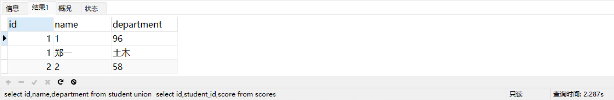
那么union all与union如果当然它业务数据容许出现重复的记录，我们更推荐使用union all，因为union去重数据需要遍历、排序和比较，它更耗时，更消耗cpu资源，但是数据结果最完整。

##### 1.2.8. join的表不宜过多

- 查询效率下降：多表JOIN查询数据对比时间边长
- 系统负载增加：JOIN操作需要进行大量的计算，因此会导致系统负载增加。
- 维护难度加大：在一个连接了多个表的查询中，如果需要修改其中一个表的结构或内容，就可能会需要同时修改其他表的结构或内容。

因此，在数据库设计时，应该尽量减少JOIN操作的使用频率，并且简化表之间的关系，以提高查询效率和系统的性能。
除上述优化之外，通常在建表还需要注意以下内容：

- 控制索引数量
- 选择合理的字段类型

### 2. 总结
SQL优化是提高数据库性能的重要方法，在实际开发中我们的SQL要尽量遵守以下几点原则，避免留下技术债：

1. 减少数据扫描
2. 返回更少数据
3. 减少交互次数
4. 减少服务器CPU及内存开销


> 原文: <https://www.yuque.com/tulingzhouyu/db22bv/mwmxxkuam4qdq0ge>