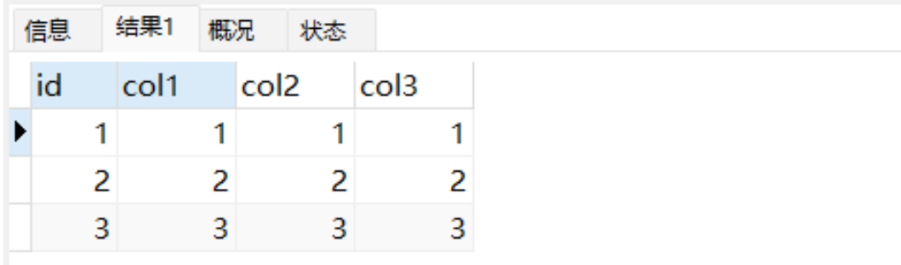
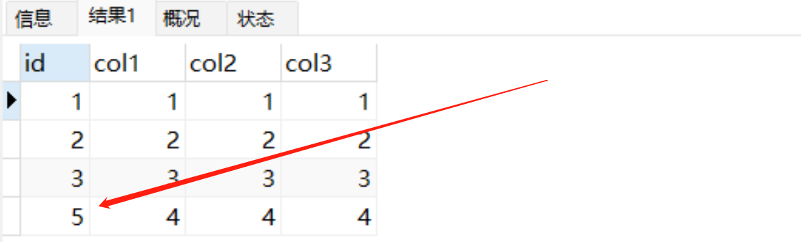
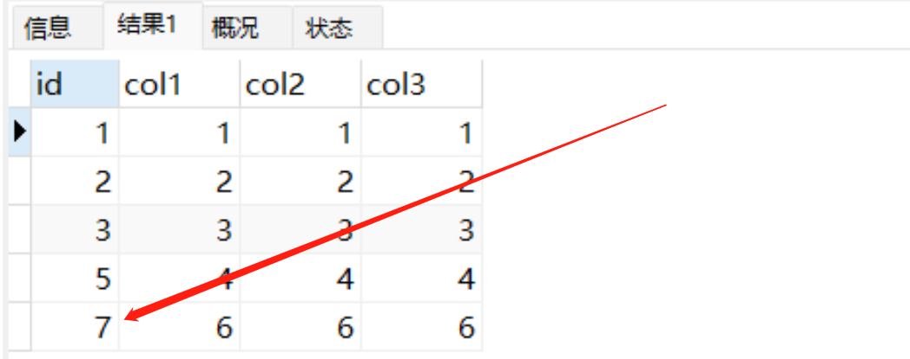
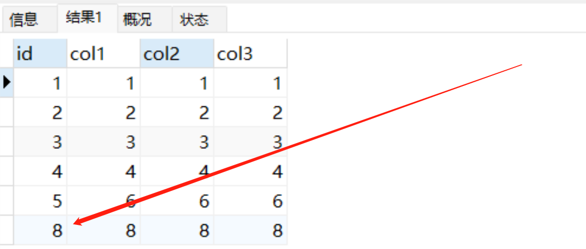

# 深入讲解

自增主键的特点是当表中每新增一条记录时，主键值会根据自增步长自动叠加，通常会将自增步长设置1，也就是说自增主键值是连续的。那么MySQL自增主键值一定会连续吗？今天这篇文章就来说说这个问题，看看什么情况下自增主键会出现不连续？

## 1.数据准备
```plsql
drop TABLE increnment_test;
-- 创建包含自增主键的表  
CREATE TABLE increnment_test (  
  id INT(11) NOT NULL AUTO_INCREMENT PRIMARY KEY,  
  col1 INT(11) NOT NULL,
  col2 INT(11) NOT NULL,
  col3 INT(11) NOT NULL,
  UNIQUE KEY (col1)
) ENGINE=InnoDB AUTO_INCREMENT=1 DEFAULT CHARSET=utf8mb4;
```

## 2.自增值存储机制
1.MyISAM 引擎的自增值保存在数据文件中。
2.Innodb 引擎

- 在 MySQL 5.7 及之前的版本，自增值保存在内存里。每次重启后，第一次打开表的时候，都会去找自增值的最大值 max(id)，然后将 max(id) + 1 作为这个表当前的自增值。
- 在 MySQL 8.0 版本，将自增值的变更记录在了 redo log 中，重启的时候依靠 redo log 恢复重启之前的值。
```plsql
1.往increnment_test表中插入2条数据
INSERT INTO increnment_test (col1, col2, col3) VALUES    
    (1, 1, 1),    
    (2, 2, 2);

2.此时id值为2，AUTO_INCREMENT值为3。我们删除id为2的记录
delete from increnment_test where id = 2;

3.立马重启实例，重新插入记录。此时id为2。
INSERT INTO increnment_test (col1, col2, col3) VALUES    
		(2, 2, 2);

4.不重启实例，删除id为2的记录后，重新插入数据，id应为3。
```

## 3.自增值修改机制
在MySQL中，可以使用AUTO_INCREMENT关键字来指定ID字段为自增ID字段。当向表中插入一条记录时，MySQL将自动为该记录的ID字段生成一个新的自增ID值，并将该值保存到该记录的ID字段中。具体规则如下：

- 如果ID字段未指定具体的值，则将当前AUTO_INCREMENT值并将其填入自增字段，并生成新的自增值
- 如果ID字段已指定具体的值，则直接使用指定的值作为 ID 字段的值，而不会生成新的 AUTO_INCREMENT 值。

根据要插入的值和当前自增值的大小关系，自增值的变更结果也会有所不同。

- 如果插入值小于当前自增值，那么直接使用插入值填入ID字段，自增值不变；
- 如果插入值大于当前自增值，那么除了直接使用插入值填入ID字段外，自增值需修改为插入值+1；

上述”插入值+1‘不是直接使用”插入值“+1，是auto_increment_offset（自增初始值）以 auto_increment_increment（自增步长）为步长，持续累加，直到找到大于插入值的值，作为新的自增值。

## 4.自增值修改流程
上述我们了解了自增值的存储机制与修改机制，自增值修改是在哪个环境呢？那需要了解自增值修改流程。
```plsql
INSERT INTO increnment_test (col1, col2, col3) 
 VALUES (3, 3, 3);
```
以上述SQL为例，我们假如数据库里已经有2条数据了，它的执行流程如下：

- 执行器调用 InnoDB 引擎接口将分析器优化后的SQL传入，并将值(3,3,3)一起传过去。
- InnoDB 发现用户没有指定自增 id列，会先获取表increnment_test当前的自增值3；
- 将ID列补充完整，并且将自增值填入(3,3,3,3)
- 然后将表的自增值改成4；
- 继续执行插入数据操作；

自增字段值的生成是由存储引擎自动完成的，而不是由优化器完成的。因此，在执行 SQL 语句时，即使未指定自增字段列，也不会对性能产生任何影响。

## 5.导致自增值不连续的原因

### 5.1 唯一键冲突
比如increnment_test中已经存在了col1为3的记录，我们继续插入col1为3的记录，此时会出现唯一键冲突插入报错，但是没有将自增值再改回去。重新插入col1为4的值，此时对应的id为5；
如下操作流程：

#### 5.1.1.检查数据
```plsql
select * from increnment_test;
```


#### 5.1.2.插入col1为3的数据
```plsql
INSERT INTO increnment_test (col1, col2, col3) VALUES    
		(3, 3, 3);
```

#### 5.1.3.插入col1为4的记录
```plsql
INSERT INTO increnment_test (col1, col2, col3) VALUES    
		(4, 4, 4);
select * from increnment_test;
```


### 5.2.事务回滚
开启一个事务插入col1为6的数据，然后进行回滚。回滚后重新插入col1为6的记录，此时col1为6对应的id值为7。
```plsql
BEGIN;    
INSERT INTO increnment_test (col1, col2, col3) VALUES      
    (6, 6, 6);   
ROLLBACK; 

BEGIN;    
INSERT INTO increnment_test (col1, col2, col3) VALUES      
    (6, 6, 6);   
COMMIT;
```


### 5.3.批量插入数据
对于批量插入数据的语句，MySQL有一个批量申请自增 id 的策略：

- SQL语句执行过程中，第1次申请自增 id，会分配 1 个；
- 1 个用完以后，第2次申请自增 id，会分配 2 个；
- 2 个用完以后，第3次申请自增 id，会分配 4 个；

依此类推，同一个语句去申请自增 id，每次申请到的自增id个数都是上一次的两倍。
```plsql
drop table increnment_test2;
create table increnment_test2 like increnment_test;

INSERT INTO increnment_test2 (col1, col2, col3) SELECT
  col1, col2, col3 FROM increnment_test;

INSERT INTO increnment_test2 (col1, col2, col3)
VALUES (8, 8, 8);  

SELECT * FROM increnment_test2;
```

因为increnment_test2表中批量插入了5条数据，按照自增ID的批量申请策略，5条数据分3次进行申请：
第1次：id-1
第2次：id-2、3
第3次：id-4、5、6、7
由于只有5条记录，所以只使用了4、5被浪费了。当我们在次插入数据时，AUTO_INCREMENT从8开始。


> 原文: <https://www.yuque.com/tulingzhouyu/db22bv/dpeysyofywl52ha3>