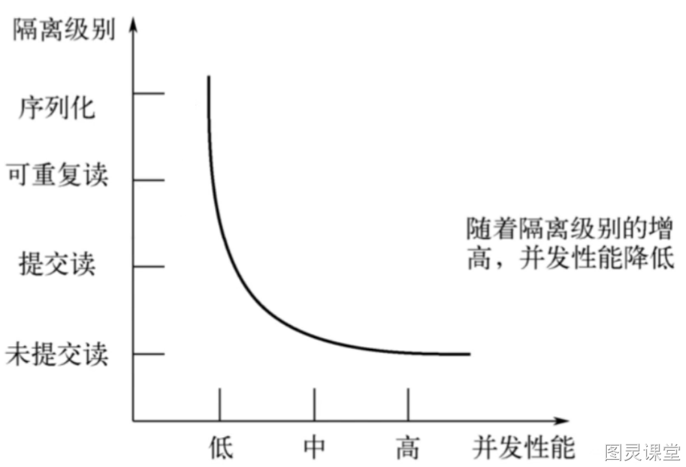
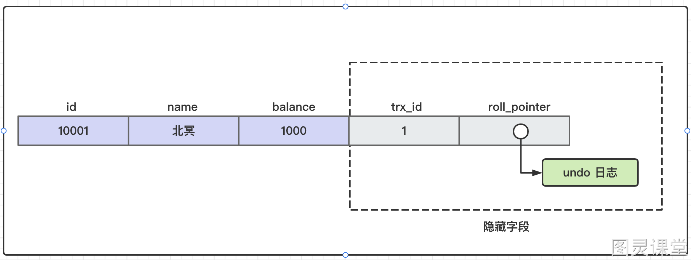
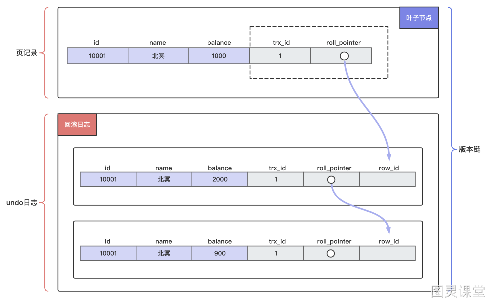
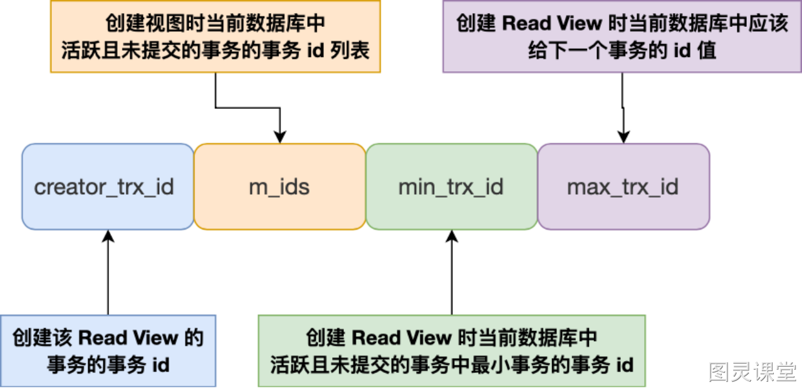
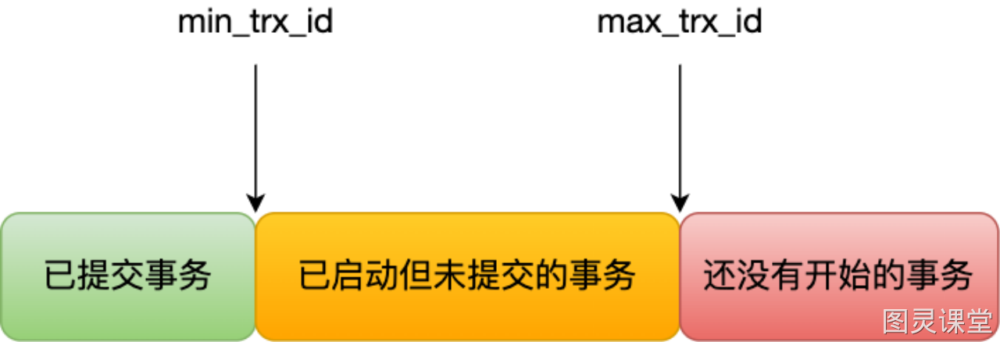
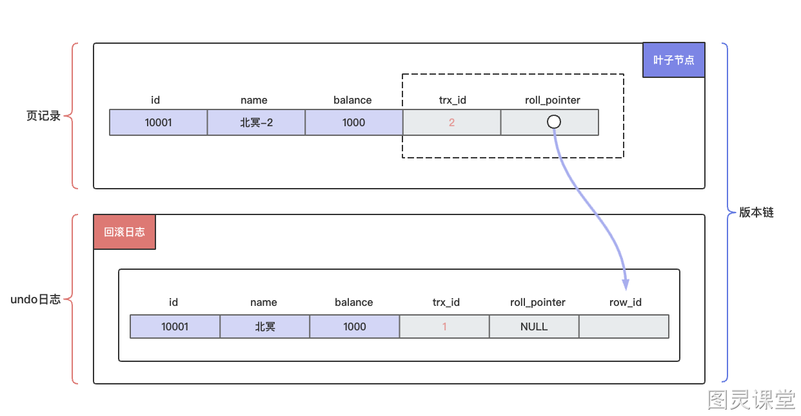
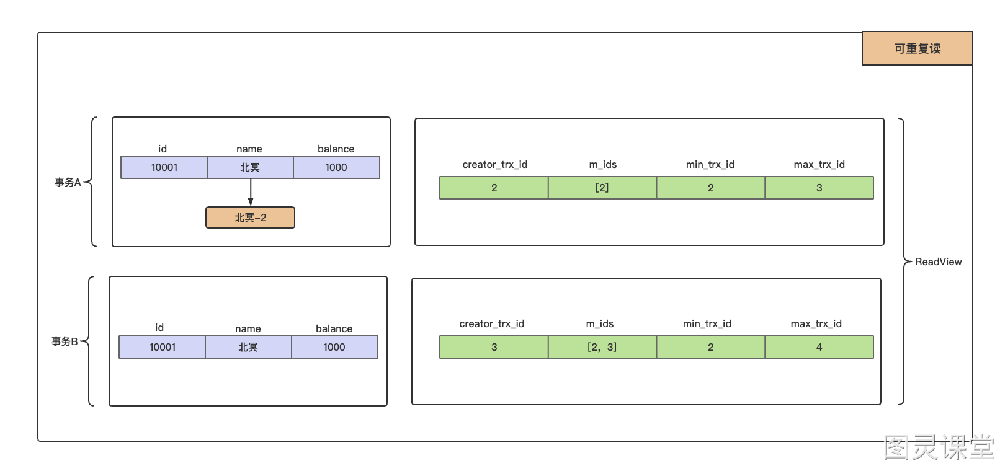
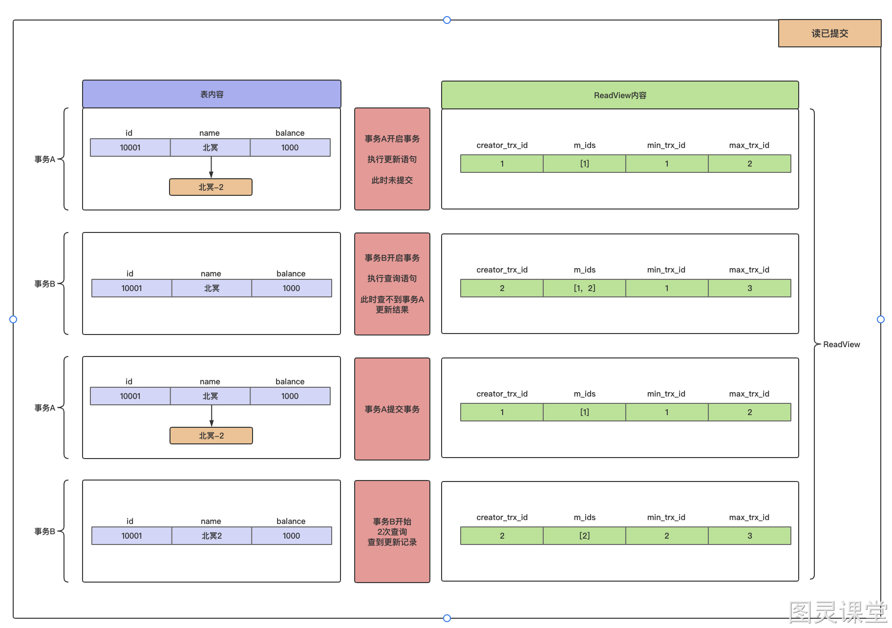

# 深度解析：掌握MVCC机制的核心原理

这一讲我们来深入分析一下MySQL是如何通过`MVCC`机制来实现隔离性。
上一讲和大家聊到，隔离性本质上是因为同时存在多个并发事务可能会导致脏读、幻读等情况。

要解决并发问题只有一种方案就是加锁。当然，锁不可避免的会导致性能下降，但是，锁也有乐观和悲观之分，上一讲我们聊到的，隔离级别中的串行化就是一种悲观的思想，可以直接避免并发事务中所有的问题，但是性能也是下降的非常严重。而`MySQL`是如何在性能和一致性中权衡的呢？我们接着往下看。
MVCC全称（多版本并发控制），本质就是通过一种乐观锁的思想，维护数据的多个版本，以减少数据读写操锁的冲突，做到即使有读写冲突时也能做到**不加锁**，**非阻塞并发读**而这个读指的就是**快照读** , 而非**当前读**，这样就可以提高了 MySQL 的事务并发性能。

前面和大家说`MVCC`机制是维护了多个数据版本，那具体是怎么实现和工作的呢？我们接着来仔细看看，首先MySQL `InnoDB`存储引擎需要支持一条数据可以保留多个历史版本。
> 怎么保留呢？还记得事务日志undo log吗？

对于使用 InnoDB 存储引擎的数据库表，它的聚簇索引记录中都包含下面两个隐藏列：

- trx_id，当一个事务对某条聚簇索引记录进行改动时，就会把**该事务的事务 id 记录在** trx_id **隐藏列里**；
- roll_pointer，每次对某条聚簇索引记录进行改动时，都会**把旧版本的记录写入到 undo 日志中，然后这个隐藏列是个指针，指向每一个旧版本记录**，于是就可以通过它找到修改前的记录。

InnoDB 里面每个事务有一个唯一的事务 ID，叫作 transaction id。它是在事务开始的时候向 InnoDB 的事务系统申请的，是按申请顺序严格递增的。

如上图所示，针对`id=10001`的这条数据，都会将旧值放到一条`undo`日志中，就算是该记录的一个旧版本，随着更新次数的增多，所有的版本都会被 `roll_pointer` 属性连接成一个链表，我们把这个链表称之为**版本链**，根据版本链就可以找到这条数据历史的版本。

利用`undo log`日志我们已经保留下了数据的各个版本，那么现在关键的问题是要读取哪个版本的数据呢？
这时就需要用到ReadView了，ReadView就是事务在使用MVCC机制进行快照读操作时产生的一致性视图, 比如针对可重复读隔离级别，是在事务启动的时候，创建一个ReadView, 那ReadView种都有哪些关键信息呢？


- trx_ids: 指的是在创建 ReadView 时，当前数据库中「活跃事务」的事务 id 列表，注意是一个列表， **“活跃事务”指的就是，启动了但还没提交的事务**。
- min_trx_id: 指的是在创建 ReadView 时，**当前数据库中「活跃事务」中事务 id 最小的事务**，也就是 m_ids 的最小值。
- max_trx_id：这个并不是 m_ids 的最大值，而是**创建** ReadView **时当前数据库中应该给下一个事务的 id 值，也就是全局事务中最大的事务 id 值 + 1**；
- creator_trx_id ：指的是创建该 ReadView 的事务的事务 id, 只有在对表中的记录做改动时（执行INSERT、DELETE、UPDATE这些语句时）才会为 事务分配事务id，否则在一个只读事务中的事务id值都默认为0。



对于当前事务的启动瞬间来说，读取的一个数据版本的trx_id，有以下几种可能：

- 如果被访问版本的trx_id属性值与ReadView中的 creator_trx_id 值相同，意味着当前事务在访问它自己修改过的记录，所以该版本可以被当前事务访问。
- 如果落在绿色部分，表示这个版本是已提交的事务或者是当前事务自己生成的，这个数据是可见的；
- 如果落在红色部分，表示这个版本是由将来启动的事务生成的，是肯定不可见的；
- 如果落在黄色部分，那就包括两种情况
   - 若 数据的trx_id在trx_ids数组中，表示这个版本是由还没提交的事务生成的，不可见, 去读取这条数据的历史版本，这条数据的历史版本中都包含了事务id信息，去查找第一个不在活跃事务数组的版本记录。
   - 若 数据的trx_id不在trx_ids数组中，表示这个版本是已经提交了的事务生成的，可见。

这种通过**版本链 + 一致性视图** 来控制并发事务访问同一个记录时的行为就叫 MVCC（多版本并发控制）。

如果你对MVCC机制的整个流程还是比较模糊，我们现在举例来说明下。比如student表中有一个事务`id`为`10001`的插入记录：
```sql
insert into student(id, name, balance) values(10001, '北冥', '2000')
```

我们现在在MySQL的读已提交和可重复读隔离级别下，MVCC机制的整个工作流程。
MySQL中的读未提交和序列化并不需要MVCC机制，读未提交，直接读取别人未提交的数据，而序列化全程用加锁的方式，也用不上MVCC, 大家体会下。
可重复读REPEATABLE READ 隔离级别的事务来说，只会在第一次执行查询语句时生成一个 ReadView ，之后的查询就不会重复生成了。

```sql
-- 事务A 
-- 事务ID - 2
begin
UPDATE student SET name="北冥-2" WHERE id=10001;

-- 事务B
-- 事务ID - 3
UPDATE student SET name="北冥-3" WHERE id=10001;

-- 事务C
begin
SELECT * FROM student WHERE id = 10001;
```



事务`A`和`B`均未提交，现在事务`C`执行`select`, 那么得到的结果是什么呢？

1. 在执行`select`语句时会先生成一个`ReadView`：
   1. `trx_ids`列表的内容就是`[2, 3]`
   2. `min_trx_id`为`1`
   3. `max_trx_id`为`4`
   4. `creator_trx_id`为`0`
2. 然后从版本链中挑选可见的记录，从图中看出，
   1. 最新版本的列`name`的内容是`'北冥-3'`
   2. `trx_id`值为`3`
   3. 在`trx_ids`列表内，所以不符合可见性要求
   4. 根据`roll_pointer`跳到下一个版本。
3. 下一个版本的列`name`的内容是`'北冥-2'`
   1. 该版本的`trx_id`值为`2`
   2. 也在`trx_ids`列表内
   3. 所以也不符合要求，继续跳到下一个版本。
4. 下一个版本的列`name`的内容是`'北冥'`
   1. 该版本的`trx_id`值为`1`
   2. 小于`ReadView`中的`min_trx_id`值`2`
   3. 说明已经提交了，那么最终返回`'北冥'`。

读已提交`READ COMMITTED`是每次读取数据前都生成一个`ReadView`。



这里重点介绍了`MVCC`机制，以及 `MVCC` 在 `READ COMMITTD`、 `REPEATABLE READ` 这两种隔离级别的事务在执行快照读操作时访问记录的版本链的过程。这样使不同事务的 `读-写` 、 `写-读` 操作并发执行，从而提升系统性能。

- `READ COMMITTD` 在每一次进行普通`SELECT`操作前都会生成一个`ReadView`
- `REPEATABLE READ` 只在第一次进行普通`SELECT`操作前生成一个`ReadView`，之后的查询操作都重复使用这个`ReadView`就好了。


> 原文: <https://www.yuque.com/tulingzhouyu/db22bv/punx163d59wigr5r>