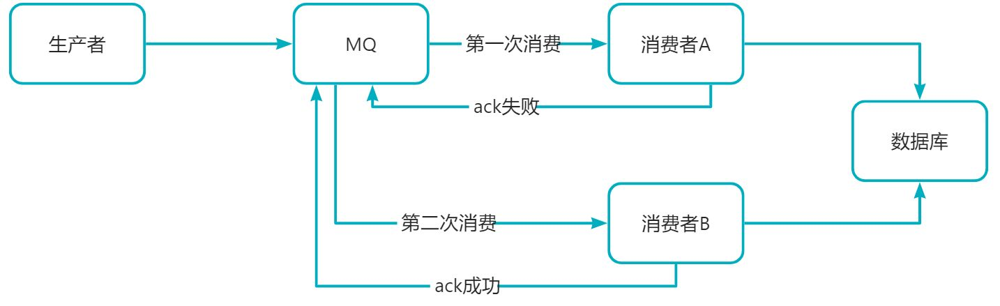
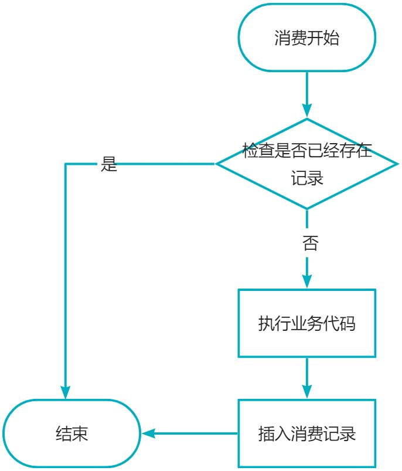
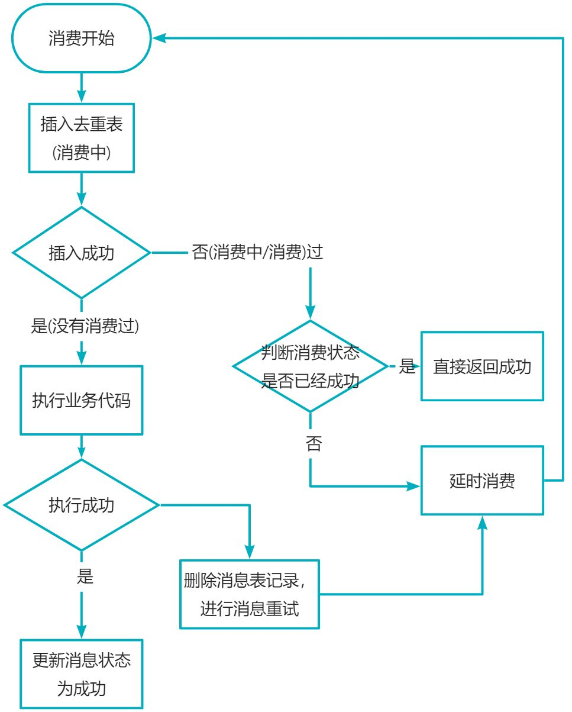
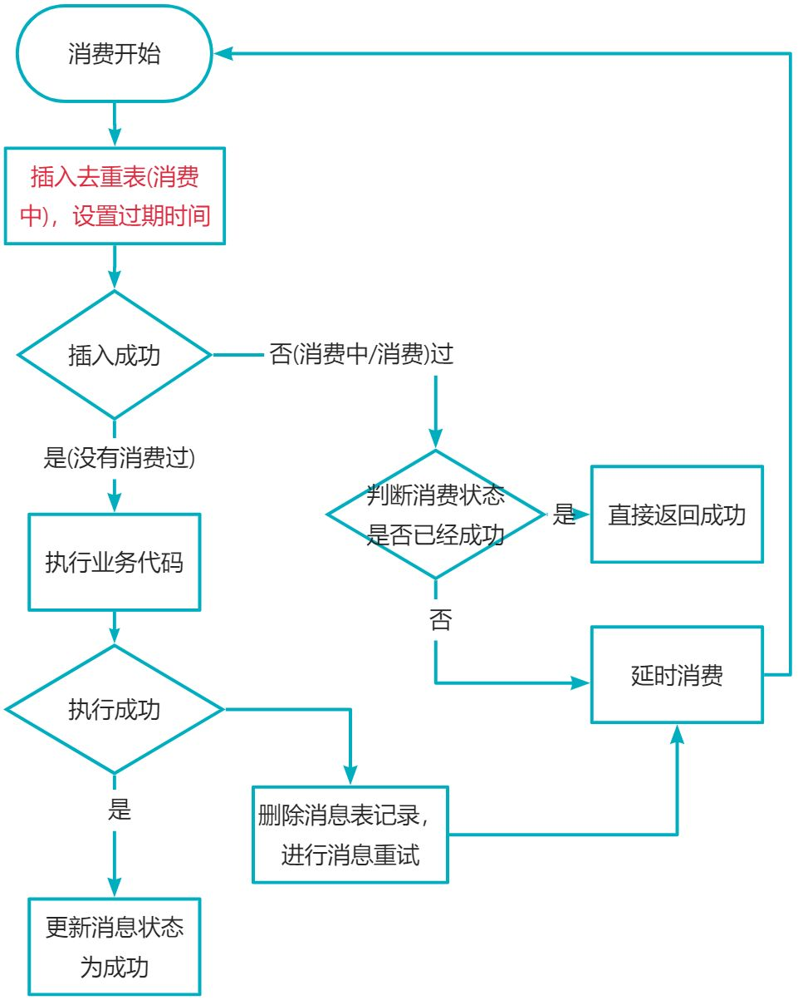

# RabbitMQ中如何保证消息不被重复消费

# 1.什么情况会导致消息被重复消费呢
1. 生产者：生产者可能会重复推送一条数据到 MQ 中，比如 Controller 接口被重复调用了 2 次，没有做接口幂等性导致的；
2. MQ：在消费者消费完准备响应 ack 消息消费成功时，MQ 突然挂了，导致 MQ 以为消费者还未消费该条数据，MQ 恢复后再次推送了该条消息，导致了重复消费。
3. 消费者：消费者已经消费完消息，正准备但是还未响应给ack消息到时，此时消费者挂了，服务重启后 MQ 以为消费者还没有消费该消息，再次推送了该条消息。

# 2.解决方案

## 2.1使用数据库唯一键约束
缺点：局限性很大，**仅仅只能用在我们数据新增场景**，并且性能也比较低

## 2.2使用乐观锁
假设是更新订单状态，**在发送的消息的时候带上修改字段的版本号**
缺点：如果说更新字段比较多，并且更新场景比较多，可能会导致数据库字段增加并且还有可能出现多条消息同时在队列中此时他们修改字段版本号一致，排在后续的消息无法被消费

## 2.3 简单的消息去重，插入消费记录，增加数据库判断

优点：很多场景下的确能起到不错的效果
缺点：

1. 这个消费者的代码执行需要1秒，重复消息在执行期间（假设100毫秒）内到达（例如生产者快速重发，Broker重启等），增加校验的地方是不是还是没数据（因为上一条消息还没消费完，没有记录）
2. 那么就会穿透掉检查的挡板，最后导致重复的消息消费逻辑进入到非幂等安全的业务代码中，从而引发重复消费的问题

## 2.4并发消息去重基于消息幂等表

- 缺点：如果说第一次消息投递异常没有消费成功，并且没有将消息状态给置为成功或者没有删除消息表记录，此时延时消费每次执行下列都是一直处于消费中，最后消费就会被视为消费失败而被投递到死信Topic中
- 方案：插入的消息表必须要带一个最长消费过期时间，例如10分钟

- 上述方案只需要一个存储的中心媒介，那我们可以选择更灵活的存储中心媒介，比如Redis。使用Redis有两个好处：
   - 性能上损耗更低
   - 上面我们讲到的超时时间可以直接利用Redis本身的ttl实现

## 3.总结

1. 利用数据库唯一键约束
2. 可以利用我们的乐观锁
3. 插入消费记录

不丢和不重是矛盾的（在分布式场景下），总的来说，开发者根据业务的实际需求来选择相应的方式即可。

> 原文: <https://www.yuque.com/tulingzhouyu/db22bv/dfhkmm5hsozuganw>