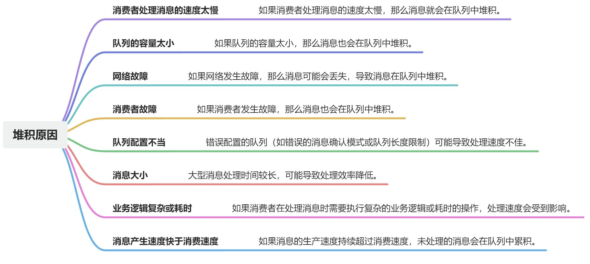

# RabbitMQ中如何解决消息堆积问题

### 消息堆积原因

### 解决方案

1. **消费者处理消息的速度太慢**
   - **增加消费者数量**：通过水平扩展，增加消费者的数量来提高处理能力。
   - **优化消费者性能**：提高消费者处理消息的效率，例如优化代码、增加资源。
   - **消息预取限制(prefetch count)**：调整消费者的预取数量以避免一次处理过多消息而导致处理缓慢。
2. **队列的容量太小**
   - **增加队列的容量**：调整队列设置以允许更多消息存储。
3. **网络故障**
   - **监控和告警**：通过监控网络状况并设置告警，确保在网络故障时快速发现并解决问题。
   - **持久化和高可用性**：确保消息和队列的持久化以避免消息丢失，并使用镜像队列提高可用性。
4. **消费者故障**
   - **使用死信队列**：将无法处理的消息转移到死信队列，防止堵塞主队列。
   - **容错机制**：实现消费者的自动重启和错误处理逻辑。
5. **队列配置不当**
   - **优化队列配置**：检查并优化消息确认模式、队列长度限制和其他相关配置。
6. **消息大小**
   - **消息分片**：将大型消息分割成小的消息片段，加快处理速度。
7. **业务逻辑复杂或耗时**
   - **优化业务逻辑**：简化消费者中的业务逻辑，减少处理每个消息所需的时间。
8. **消息产生速度快于消费速度**
   - **使用消息限流**：控制消息的生产速度，确保它不会超过消费者的处理能力。
   - **负载均衡**：确保消息在消费者之间公平分配，避免个别消费者过载。
9. **其他配置优化**
   - **消息优先级**：使用消息优先级确保高优先级消息优先处理。
   - **调整RabbitMQ配置**：优化RabbitMQ服务的配置，如文件描述符限制、内存使用限制等。

> 原文: <https://www.yuque.com/tulingzhouyu/db22bv/xltofpxa76mzzc5y>