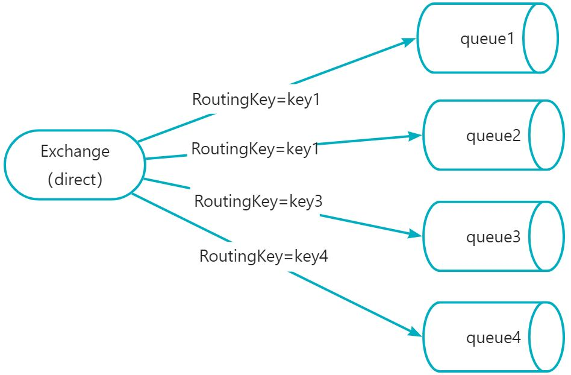
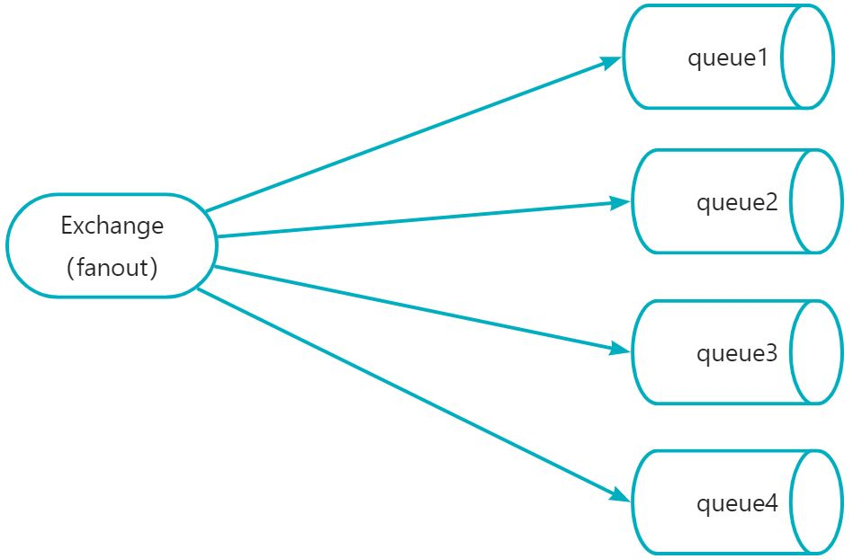
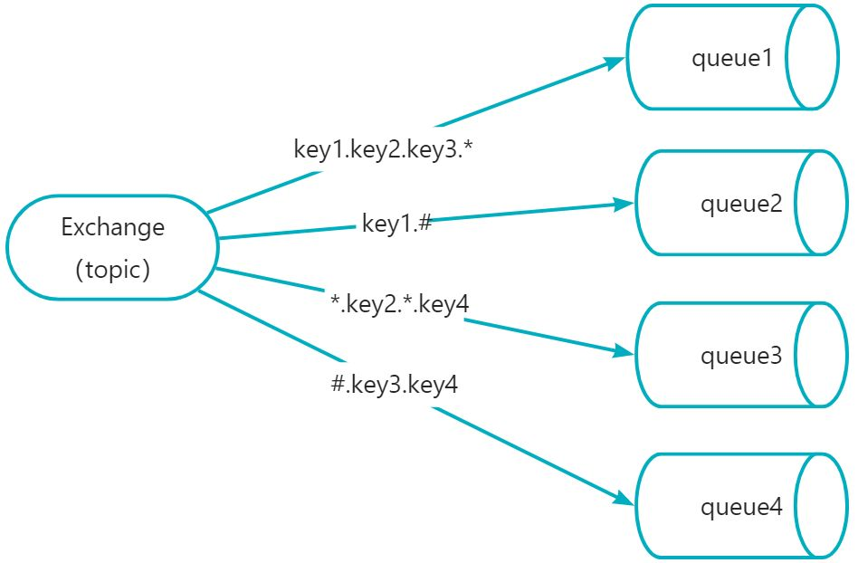
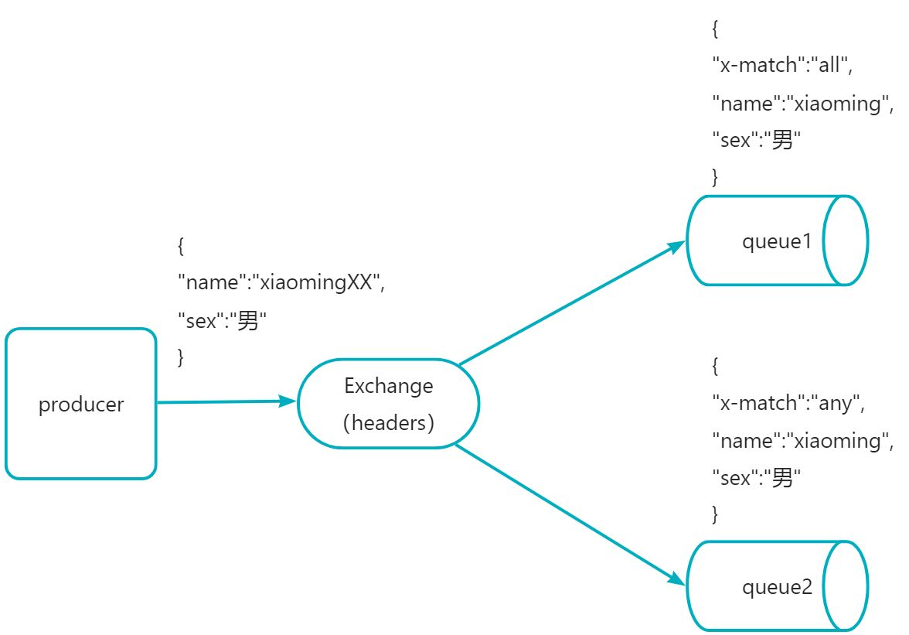

# RabbitMQ交换机类型

## 1.direct(**直连交换机**)
路由键与队列名完全匹配交换机，此种类型交换机，通过RoutingKey路由键将交换机和队列进行绑定， 消息被发送到exchange时，需要根据消息的RoutingKey，来进行匹配，只将消息发送到完全匹配到此RoutingKey的队列。
比如：如果一个队列绑定到交换机要求路由键为“key”，则只转发RoutingKey标记为“key”的消息，不会转发"key1"，也不会转发“key.1”等等。它是完全匹配、单播的模式

	同一个key可以绑定多个queue队列；当匹配到key1时，queue1和queue2都可以收到消息

## 2.fanout(**扇出交换机，广播**)
Fanout，扇出类型交换机，此种交换机，会将消息分发给所有绑定了此交换机的队列，此时RoutingKey参数无效。

fanout类型交换机下发送消息一条，无论RoutingKey是什么，queue1,queue2,queue3,queue4都可以收到消息

## 3.topic(**主题交换机**)
Topic，主题类型交换机，此种交换机与Direct类似，也是需要通过routingkey路由键进行匹配分发，区别在于Topic可以进行模糊匹配，Direct是完全匹配。

1. Topic中，将routingkey通过"."来分为多个部分
2. "*"：代表一个部分
3. "#"：代表0个或多个部分(如果绑定的路由键为 "#" 时，则接受所有消息，因为路由键所有都匹配)

然后发送一条信息，routingkey为"key1.key2.key3.key4"，那么根据"."将这个路由键分为了4个部分，此条路由键，将会匹配：

1. key1.key2.key3.*：成功匹配，因为 * 可以代表一个部分
2. key1.# ：成功匹配，因为#可以代表0或多个部分
3. *.key2.*.key4： 成功匹配，因为第一和第三部分分别为key1和key3，且为4个部分，刚好匹配
4. #.key3.key4：成功匹配，#可以代表多个部分，正好匹配中了我们的key1和key2

如果发送消息routingkey为"key1"，那么将只能匹配中key1.#，#可以代表0个部分

## 4.headers(**头部交换机**)
headers 匹配 AMQP 消息的 header 而不是路由键，此外 headers 交换器和 direct 交换器完全一致，但性能差很多，目前几乎用不到了
消费方指定的headers中必须包含一个"x-match"的键。
键"x-match"的值有2个

1. x-match = all ：表示所有的键值对都匹配才能接受到消息
2. x-match = any ：表示只要有键值对匹配就能接受到消息

发送消息时间，如果其他参数信息是{ "name":"xiaomingXX", "sex":"男" }，因为queue2的x-match是any，只需要有一个键值对匹配所以就能接收到消息，所以queue2可以接收到消息；queue1的x-match是all，需要所有的键值对都匹配才能接收到消息，所以此时queue1接收不到消息
	

> 原文: <https://www.yuque.com/tulingzhouyu/db22bv/ysgk127scv7vwvam>