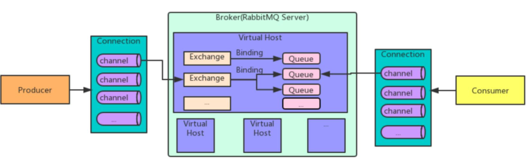

# RabbitMQ如何保证消息不丢失

## 1. 丢失原因分析
观察整个 RabbitMQ 消息发送过程：

从上述流程我们可以得知：消息从生产者到达消费者，经过两次网络传输，并且在 RabbitMQ 服务器中进行路由。
因此我们能知道整个流程中可能会出现三种消息丢失场景：

- 生产者发送消息到 RabbitMQ 服务器的过程中出现消息丢失。 可能是网络波动未收到消息，又或者是服务器宕机。
- RabbitMQ 服务器消息持久化出现消息丢失。 消息发送到 RabbitMQ 之后，未能及时存储完成持久化，RabbitMQ 服务器出现宕机重启，消息出现丢失。
- 消费者拉取消息过程以及拿到消息后出现消息丢失。 消费者从 RabbitMQ 服务器获取到消息过程出现网络波动等问题可能出现消息丢失；消费者拿到消息后但是消费者未能正常消费，导致丢失，可能是消费者出现处理异常又或者是消费者宕机。

针对上述三种消息丢失场景，RabbitMQ 提供了相应的解决方案，confirm 消息确认机制（生产者），消息持久化机制（RabbitMQ 服务），ACK 事务机制（消费者）

## 2.解决方案

### 2.1.confirm 消息确认机制（生产者）
Confirm 模式是 RabbitMQ 提供的一种消息可靠性保障机制。当生产者通过 Confirm 模式发送消息时，它会等待 RabbitMQ 的确认，确保消息已经被正确地投递到了指定的 Exchange 中。
消息正确投递到 queue 时，会返回 ack。
消息没有正确投递到 queue 时，会返回 nack。如果 exchange 没有绑定 queue，也会出现消息丢失。
**使用方法：**

- 生产者通过 **confirm.select** 方法将 Channel 设置为 Confirm 模式。
- 发送消息后，通过添加 **add_confirm_listener** 方法，监听消息的确认状态。

### 2.2.消息持久化机制（RabbitMQ 服务）
持久化机制是指将消息存储到磁盘，以保证在 RabbitMQ 服务器宕机或重启时，消息不会丢失。
**使用方法：**

- 生产者通过将消息的 **delivery_mode** 属性设置为 2，将消息标记为持久化。
- 队列也需要进行持久化设置，确保队列在 RabbitMQ 服务器重启后仍然存在。经典队列需要将durable属性设置为true。而仲裁队列和流式队列默认必须持久化保存。

**注意事项：**

- 持久化机制会影响性能，因此在需要确保消息不丢失的场景下使用。

### 2.3.ACK 事务机制（消费者）
ACK 事务机制用于确保消息被正确消费。当消息被消费者成功处理后，消费者发送确认（ACK）给 RabbitMQ，告知消息可以被移除。这个过程是自动处理的，也可以关闭进行手工发送 ACK。
**使用方法：**

- 在 RabbitMQ 中，ACK 机制默认是开启的。当消息被消费者接收后，会立即从队列中删除，除非消费者发生异常。
- 可以手动开启 ACK 机制，通过将 **auto_ack** 参数设置为 **False**，手动控制消息的 ACK。

**注意事项：**

- ACK 机制可以确保消息不会被重复处理，但如果消费者发生异常或者未发送 ACK，消息可能会被重复投递。

> 原文: <https://www.yuque.com/tulingzhouyu/db22bv/bn38iyvd1uxsycyu>