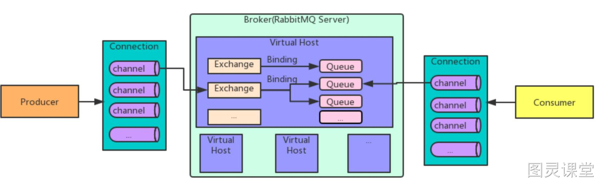

# RabbitMQ架构设计

RabbitMQ 是一个开源的消息中间件，采用 AMQP（高级消息队列协议）进行消息传递。它允许应用程序之间进行异步通信，提供了一种高效、可扩展、可靠的消息传递机制。
以下是 RabbitMQ 的基本架构设计：

1. **生产者（Producer）：** 生产者是消息的发送方，负责产生并发送消息到 RabbitMQ。生产者通常将消息发送到交换机（Exchange）。
2. **交换机（Exchange）：** 交换机是消息的分发中心，负责将接收到的消息路由到一个或多个队列。它定义了消息的传递规则，可以根据规则将消息发送到一个或多个队列。
   - **直连交换机（Direct Exchange）：** 将消息路由到与消息中的路由键（Routing Key）完全匹配的队列。
   - **主题交换机（Topic Exchange）：** 根据通配符匹配路由键，将消息路由到一个或多个队列。
   - **扇出交换机（Fanout Exchange）：** 将消息广播到所有与交换机绑定的队列，忽略路由键。
   - **头部交换机（Headers Exchange）：** 根据消息头中的属性进行匹配，将消息路由到与消息头匹配的队列。
3. **队列（Queue）：** 队列是消息的存储区，用于存储生产者发送的消息。消息最终会被消费者从队列中取出并处理。每个队列都有一个名称，并且可以绑定到一个或多个交换机。
4. **消费者（Consumer）：** 消费者是消息的接收方，负责从队列中获取消息并进行处理。消费者通过订阅队列来接收消息。
5. **绑定（Binding）：** 绑定是交换机和队列之间的关联关系。生产者将消息发送到交换机，而队列通过绑定与交换机关联，从而接收到消息。
6. **虚拟主机（Virtual Host）：** 虚拟主机是 RabbitMQ 的基本工作单元，每个虚拟主机拥有自己独立的用户、权限、交换机、队列等资源，完全隔离于其他虚拟主机。
7. **连接（Connection）：** 连接是指生产者、消费者与 RabbitMQ 之间的网络连接。每个连接可以包含多个信道（Channel），每个信道是一个独立的会话通道，可以进行独立的消息传递。
8. **消息：** 消息是生产者和消费者之间传递的数据单元。消息通常包含消息体和可选的属性，如路由键等。

RabbitMQ 的架构设计允许多个生产者、多个消费者之间通过消息队列进行松耦合的通信，提高了系统的可伸缩性和可维护性。通过灵活配置交换机和队列，可以实现多种消息传递模式，满足不同应用场景的需求

## 

> 原文: <https://www.yuque.com/tulingzhouyu/db22bv/qo3661bn51fhkxgt>