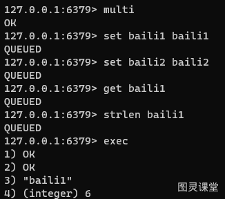
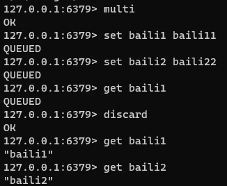
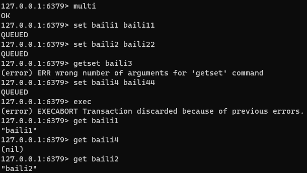
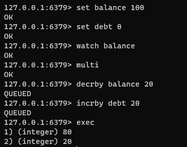
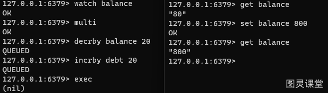

# Redis到底支不支持事务啊？

先说答案：**redis 是支持事务的，但是它与传统的关系型数据库中的事务是有所不同的**。

## 一、概述：
**概念：** 可以一次执行多个命令，本质是一组命令的集合。一个事务中的所有命令都会序列化，按顺序地串行化执行而不会被其它命令插入，不许加塞。
**常用命令：**

- **multi：**开启一个事务，multi 执行之后，客户端可以继续向服务器发送任意多条命令，这些命令不会立即被执行，而是被放到一个队列中。
- **exec：**执行队列中所有的命令
- **discard：**中断当前事务，然后清空事务队列并放弃执行事务
- **watch key1 key2 ...	**：监视一个(或多个) key ，如果在事务执行之前这个(或这些) key 被其他命令所改动，那么事务将被打断。

## 二、使用：

### 正常执行：

##### 

### 主动放弃事务：
使用 discard 主动中断 multi 操作，然后清空并放弃执行当前事务。

### 全部回滚：
开启 multi 之后，命令语法导致执行错误，会放弃当前所有队列中的命令。

### 部分支持事务：
开启 multi 之后，命令逻辑执行错误，会主动忽略报错语句，继续执行后续命令。

### WATCH：
Redis 的 watch 命令是一种乐观锁的实现方式。余额修改示例：

#### 正常情况：

#### 并发修改情况：
在 watch 监控后，有人修改了balance，会导致事务会被打断，必须更新最新值，才能成功执行事务，类似于乐观锁的版本号机制。

## 事务三阶段：
1、开启：以 multi 开始一个事务
2、入队：将多个命令入队到事务中，接到这些命令并不会立即执行，而是放到等待执行的事务队列里面
3、执行：由 exec 命令触发事务

## 小结：
Redis 事务区别于关系型数据库在于：

1. **原子性**：Redis 事务保证的是队列中的命令作为一个整体要么全部执行，要么全部不执行。但是，如果事务中的某个命令因为执行错误而失败，Redis 会继续执行事务中的其他命令，而不是回滚整个事务。
2. **无隔离级别**：Redis 事务中的命令在提交前不会被实际执行，因此不存在传统数据库中的事务隔离级别问题，如脏读、不可重复读或幻读。
3. **命令队列**：当客户端发送 multi 命令后，所有随后的命令都会被放入一个队列中，而不是立即执行。当 exec 命令被发送时，Redis 会尝试执行队列中的所有命令。
4. **乐观锁**：Redis 使用 watch 命令来实现乐观锁机制。客户端可以监控一个或多个键，如果在执行 exec 之前这些键的值被其他客户端改变，事务将不会执行。
5. **自动放弃**：如果事务因为监控键被修改而不能执行，exec 命令将放弃当前队列命令，返回 null。
6. **discard 命令**：如果客户端在发送 multi 之后决定放弃事务，可以使用 discard 命令来清空事务队列并退出事务状态。
7. **有限的回滚**：Redis 事务不支持命令级别的回滚。如果事务中的某个命令失败，Redis 会停止执行后续命令，而不是回滚到事务开始前的状态。

> 原文: <https://www.yuque.com/tulingzhouyu/db22bv/gkremwy573nv23r3>