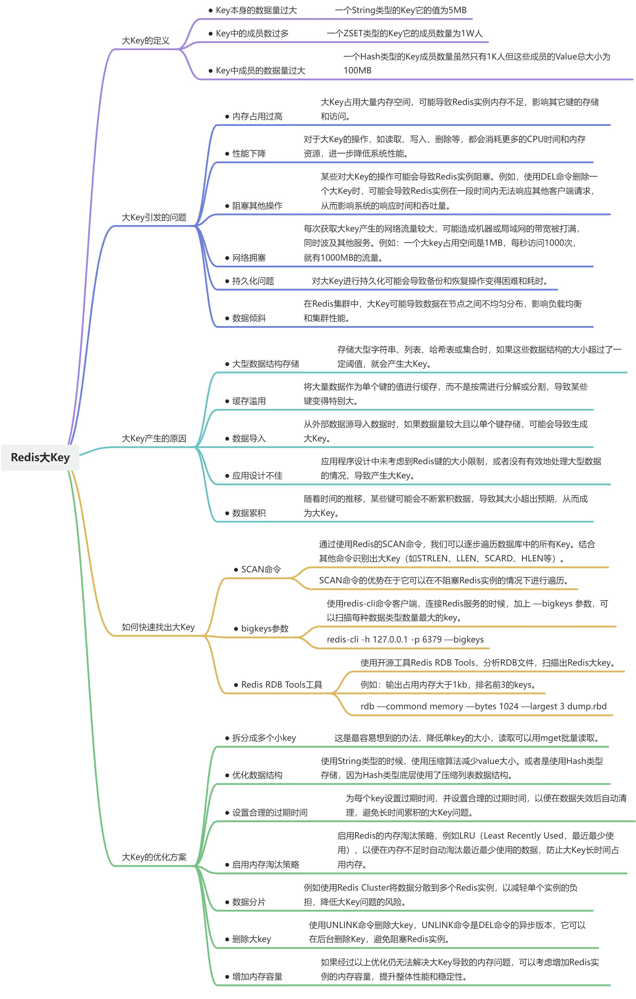

# Redis大Key是什么东西啊？分分钟拿下

经常在八股文里边看到 Redis 大 Key 问题，那么你知道以下几个问题的答案吗？又或者说是有关注过这几个问题吗？

- 大Key的定义
- 大Key引发的问题
- 大Key产生的原因
- 如何快速找出大Key
- 大Key的优化方案

如果不知道也没关系，本文就以最简单的方式给大家讲解以上几个问题。

## 大Key的定义
Redis 没有显示定义大 Key，这是一个通用的术语，用来描述那些在存储和性能方面可能引起问题的键，通常指的是占用大量内存空间的键，可能是大型数据结构，如大型字符串、列表、哈希表或集合。
当然我们可以根据经验总结以下几点：

- **Key本身的数据量过大**：一个String类型的Key它的值为5MB
- **Key中的成员数过多**：一个ZSET类型的Key它的成员数量为1W人
- **Key中成员的数据量过大**：一个Hash类型的Key成员数量虽然只有1K人但这些成员的Value总大小为100MB

## 大Key引发的问题
当Redis中存在大量的大 Key 时，会对性能和内存使用产生负面影响，如下：

- **内存占用过高**

`大Key占用大量内存空间，可能导致Redis实例内存不足，影响其它键的存储和访问。`

- **性能下降**

`对于大Key的操作，如读取、写入、删除等，都会消耗更多的CPU时间和内存资源，进一步降低系统性能。`

- **阻塞其他操作**

`某些对大Key的操作可能会导致Redis实例阻塞。例如，使用DEL命令删除一个大Key时，可能会导致Redis实例在一段时间内无法响应其他客户端请求，从而影响系统的响应时间和吞吐量。`

- **网络拥塞**

`每次获取大key产生的网络流量较大，可能造成机器或局域网的带宽被打满，同时波及其他服务。例如：一个大key占用空间是1MB，每秒访问1000次，就有1000MB的流量。`

- **持久化问题**

`对大Key进行持久化可能会导致备份和恢复操作变得困难和耗时。`

- **数据倾斜**

`在Redis集群中，大Key可能导致数据在节点之间不均匀分布，影响负载均衡和集群性能。`

## 大Key产生的原因
只有了解大 Key 产生的原因，才能从根源解决问题，常见的大key 原因有以下几种：

- **大型数据结构存储**

`存储大型字符串、列表、哈希表或集合时，如果这些数据结构的大小超过了一定阈值，就会产生大Key。`

- **缓存滥用**

`将大量数据作为单个键的值进行缓存，而不是按需进行分解或分割，导致某些键变得特别大。`

- **数据导入**

`从外部数据源导入数据时，如果数据量较大且以单个键存储，可能会导致生成大Key。`

- **应用设计不佳**

`应用程序设计中未考虑到Redis键的大小限制，或者没有有效地处理大型数据的情况，导致产生大Key。`

- **数据累积**

`随着时间的推移，某些键可能会不断累积数据，导致其大小超出预期，从而成为大Key。`

## 如何快速找出大Key
要快速找出Redis中的大键，可以通过以下三种方式：

- **SCAN命令**

通过使用Redis的SCAN命令，我们可以逐步遍历数据库中的所有Key。结合其他命令识别出大Key（如STRLEN、LLEN、SCARD、HLEN等）。
`SCAN命令的优势在于它可以在不阻塞Redis实例的情况下进行遍历。`

- **bigkeys参数**

使用redis-cli命令客户端，连接Redis服务的时候，加上 —bigkeys 参数，可以扫描每种数据类型数量最大的key。
`redis-cli -h 127.0.0.1 -p 6379 —bigkeys`

- **Redis RDB Tools工具**

使用开源工具Redis RDB Tools，分析RDB文件，扫描出Redis大key。
例如：输出占用内存大于1kb，排名前3的keys。
`rdb —commond memory —bytes 1024 —largest 3 dump.rbd`

## 大Key的优化方案
既然我们知道了大 key 带来的影响与产生原因

1. **拆分成多个小key：**这是最容易想到的办法，降低单key的大小，读取可以用mget批量读取。
2. **优化数据结构：**使用String类型的时候，使用压缩算法减少value大小。或者是使用Hash类型存储，因为Hash类型底层使用了压缩列表数据结构。
3. **设置合理的过期时间：**为每个key设置过期时间，并设置合理的过期时间，以便在数据失效后自动清理，避免长时间累积的大Key问题。
4. **启用内存淘汰策略：**启用Redis的内存淘汰策略，例如LRU（Least Recently Used，最近最少使用），以便在内存不足时自动淘汰最近最少使用的数据，防止大Key长时间占用内存。
5. **数据分片：**例如使用Redis Cluster将数据分散到多个Redis实例，以减轻单个实例的负担，降低大Key问题的风险。
6. **删除大key：**使用UNLINK命令删除大key，UNLINK命令是DEL命令的异步版本，它可以在后台删除Key，避免阻塞Redis实例。
7. **增加内存容量：**如果经过以上优化仍无法解决大Key导致的内存问题，可以考虑增加Redis实例的内存容量，提升整体性能和稳定性。

# 总结

> 原文: <https://www.yuque.com/tulingzhouyu/db22bv/fg51mlsueyfivzrh>