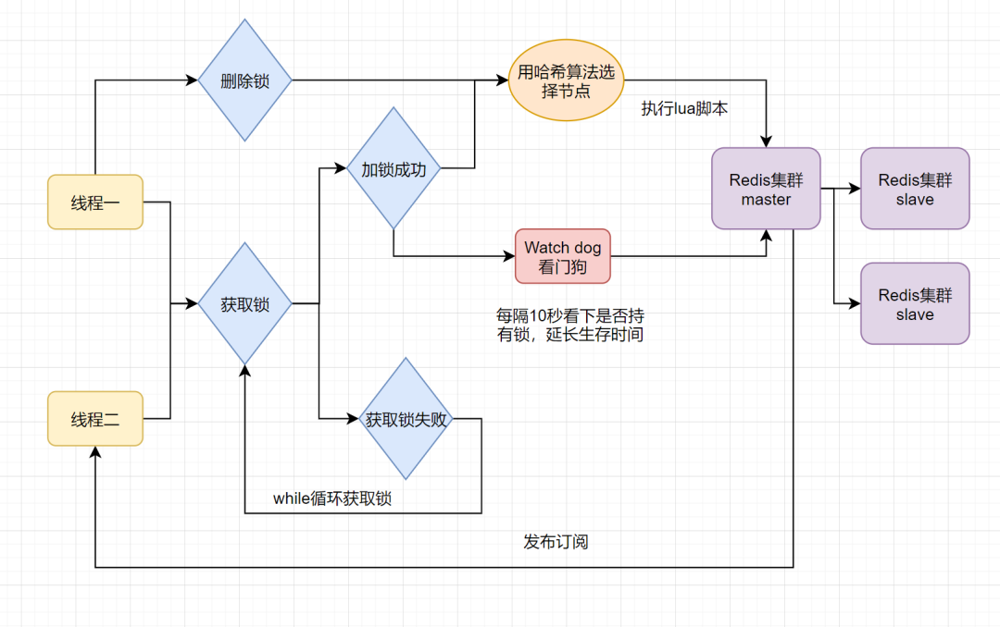
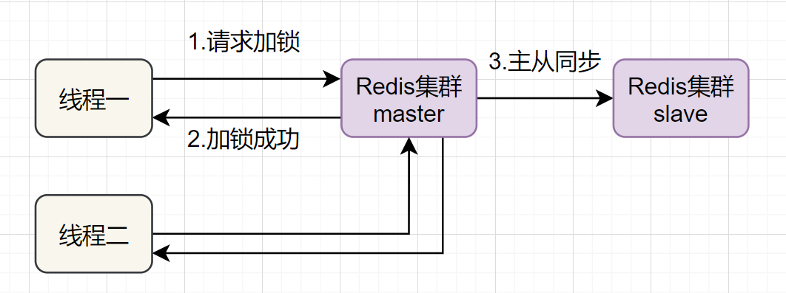
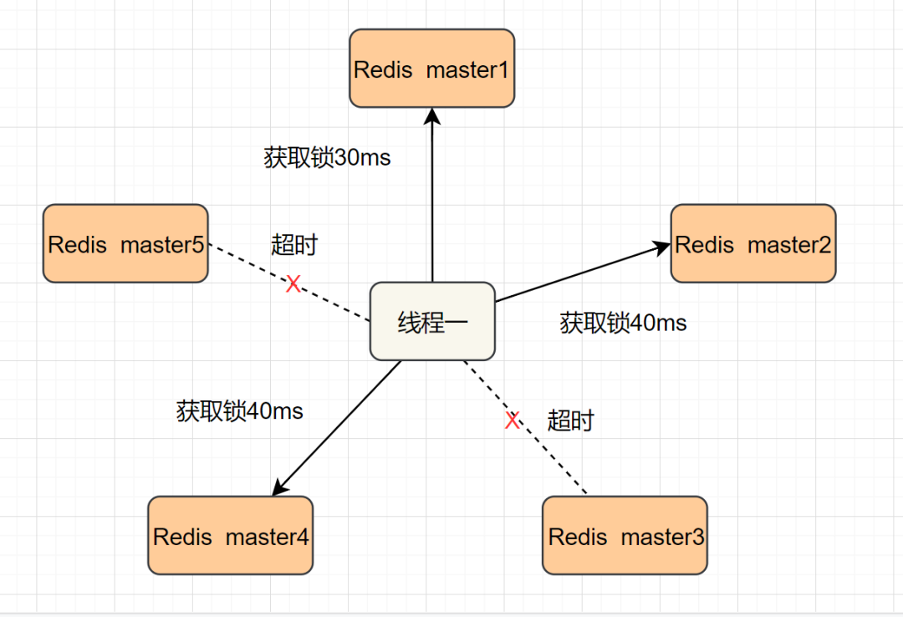

# Redis实现分布式锁的6种方案，及正确使用姿势！

已经 2024 年了，如果还不会使用 Redis 实现分布式锁，那么请好好看看本篇文章。本文分享六种Redis分布式锁的正确使用方式，由易到难。

- 什么是分布式锁
- 方案一：SETNX + EXPIRE
- 方案二：SETNX + value值（系统时间+过期时间）
- 方案三：使用Lua脚本(包含SETNX + EXPIRE两条指令)
- 方案四：SET的扩展命令（SET EX PX NX）
- 方案五：开源框架~Redisson
- 方案六：多机实现的分布式锁Redlock

### 什么是分布式锁
分布式锁是一种机制，用于确保在分布式系统中，多个节点在同一时刻只能有一个节点对共享资源进行操作。它是解决分布式环境下并发控制和数据一致性问题的关键技术之一。
分布式锁的特征：

- 「互斥性」: 任意时刻，只有一个客户端能持有锁。
- 「锁超时释放」：持有锁超时，可以释放，防止不必要的资源浪费，也可以防止死锁。
- 「可重入性」:一个线程如果获取了锁之后,可以再次对其请求加锁。
- 「高性能和高可用」：加锁和解锁需要开销尽可能低，同时也要保证高可用，避免分布式锁失效。
- 「安全性」：锁只能被持有的客户端删除，不能被其他客户端删除

### Redis分布式锁方案一：SETNX + EXPIRE
提到Redis的分布式锁，很多小伙伴马上就会想到setnx+ expire命令。即先用setnx来抢锁，如果抢到之后，再用expire给锁设置一个过期时间，防止锁忘记了释放。
`SETNX 是SET IF NOT EXISTS的简写。日常命令格式是SETNX key value，如果 key不存在，则SETNX成功返回1，如果这个key已经存在了，则返回0。`
假设某电商网站的某商品做秒杀活动，key可以设置为key_resource_id,value设置任意值，伪代码如下：
```java
if（jedis.setnx(key_resource_id,lock_value) == 1）{ //加锁
    expire（key_resource_id，100）; //设置过期时间
    try {
        do something  //业务请求
    }catch() {
        
    }finally {
       jedis.del(key_resource_id); //释放锁
    }
}
```
缺陷：加锁与设置过期时间是非原子操作，如果加锁后未来得及设置过期时间系统异常等，会导致其他线程永远获取不到锁。

### Redis分布式锁方案二：SETNX + value值(系统时间+过期时间)
为了解决方案一，**「发生异常锁得不到释放的场景」**，有小伙伴认为，可以把过期时间放到setnx的value值里面。如果加锁失败，再拿出value值校验一下即可。加锁代码如下：
```java
long expires = System.currentTimeMillis() + expireTime; //系统时间+设置的过期时间
String expiresStr = String.valueOf(expires);

// 如果当前锁不存在，返回加锁成功
if (jedis.setnx(key_resource_id, expiresStr) == 1) {
        return true;
} 
// 如果锁已经存在，获取锁的过期时间
String currentValueStr = jedis.get(key_resource_id);

// 如果获取到的过期时间，小于系统当前时间，表示已经过期
if (currentValueStr != null && Long.parseLong(currentValueStr) < System.currentTimeMillis()) {

     // 锁已过期，获取上一个锁的过期时间，并设置现在锁的过期时间
    String oldValueStr = jedis.getSet(key_resource_id, expiresStr);
    
    if (oldValueStr != null && oldValueStr.equals(currentValueStr)) {
         // 考虑多线程并发的情况，只有一个线程的设置值和当前值相同，它才可以加锁
         return true;
    }
}
        
//其他情况，均返回加锁失败
return false;
}
```
这个方案的优点是，避免了 expire 单独设置过期时间的操作，把**「过期时间放到setnx的value值」**里面来。解决了方案一发生异常，锁得不到释放的问题。但是这个方案还有别的缺点：

- 过期时间是客户端自己生成的（System.currentTimeMillis() 是当前系统的时间），必须要求分布式环境下，每个客户端的时间必须同步。
- 如果锁过期的时候，并发多个客户端同时请求过来，都执行jedis.getSet()，最终只能有一个客户端加锁成功，但是该客户端锁的过期时间，可能被别的客户端覆盖。
- 该锁没有保存持有者的唯一标识，可能被别的客户端释放/解锁。

### Redis分布式锁方案三：使用Lua脚本(包含SETNX + EXPIRE两条指令)
实际上，我们还可以使用Lua脚本来保证原子性（包含setnx和expire两条指令），lua脚本如下：
```java
if redis.call('setnx',KEYS[1],ARGV[1]) == 1 then
   redis.call('expire',KEYS[1],ARGV[2])
else
   return 0
end;
```
加锁代码如下：
```java
 String lua_scripts = "if redis.call('setnx',KEYS[1],ARGV[1]) == 1 then" +
            " redis.call('expire',KEYS[1],ARGV[2]) return 1 else return 0 end";   
Object result = jedis.eval(lua_scripts, Collections.singletonList(key_resource_id), Collections.singletonList(values));
//判断是否成功
return result.equals(1L);
```
这个方案，跟方案二对比，大家觉得哪个更好呢？

### Redis分布式锁方案四：SET的扩展命令（SET EX PX NX）
除了使用，使用Lua脚本，保证SETNX + EXPIRE两条指令的原子性，我们还可以巧用Redis的SET指令扩展参数！（SET key value[EX seconds][PX milliseconds][NX|XX]），它也是原子性的！
`SET key value[EX seconds][PX milliseconds][NX|XX]`
`NX :表示key不存在的时候，才能set成功，也即保证只有第一个客户端请求才能获得锁，而其他客户端请求只能等其释放锁，才能获取。`
`EX seconds :设定key的过期时间，时间单位是秒。`
`PX milliseconds: 设定key的过期时间，单位为毫秒。`
`XX: 仅当key存在时设置值。`
伪代码demo如下：
```java
if（jedis.set(key_resource_id, lock_value, "NX", "EX", 100s) == 1）{ //加锁
    try {
        do something  //业务处理
    }catch() {
        
    }finally {
       jedis.del(key_resource_id); //释放锁
    }
}
```
但是呢，这个方案还是可能会存在一些问题：

- 问题一：**「锁过期释放了，业务还没执行完」**。假设线程a获取锁成功，一直在执行临界区的代码。但是100s过去后，它还没执行完。但是，这时候锁已经过期了，此时线程b又请求过来。显然线程b就可以获得锁成功，也开始执行临界区的代码。那么问题就来了，临界区的业务代码都不是严格串行执行的啦。
- 问题二：**「锁被别的线程误删」**。假设线程a执行完后，去释放锁。但是它不知道当前的锁可能是线程b持有的（线程a去释放锁时，有可能过期时间已经到了，此时线程b进来占有了锁）。那线程a就把线程b的锁释放掉了，但是线程b临界区业务代码可能都还没执行完呢。

既然锁可能被别的线程误删，那我们给value值设置一个标记当前线程唯一的随机数，在删除的时候，校验一下，不就OK了嘛。伪代码如下：
```java
if（jedis.set(key_resource_id, uni_request_id, "NX", "EX", 100s) == 1）{ //加锁
    try {
        do something  //业务处理
    }catch() {
        
    }finally {
        //判断是不是当前线程加的锁,是才释放
        if (uni_request_id.equals(jedis.get(key_resource_id))) {
            jedis.del(lockKey); //释放锁
        }
    }
}
```
在这里，**「判断是不是当前线程加的锁」**和**「释放锁」**不是一个原子操作。如果调用jedis.del()释放锁的时候，可能这把锁已经不属于当前客户端，会解除他人加的锁。
为了更严谨，一般也是用lua脚本代替。lua脚本如下：
```java
if redis.call('get',KEYS[1]) == ARGV[1] then 
   return redis.call('del',KEYS[1]) 
else
   return 0
end;
```
至于问题一可以将过期时间设置的相对长一点，当然也可以另开一个线程续期，不过这种就不用我们去实现了，利用 Redisson 进行处理，也就是方案五。

### Redis分布式锁方案五：Redisson框架
方案四还是可能存在**「锁过期释放，业务没执行完」**的问题。有些小伙伴认为，稍微把锁过期时间设置长一些就可以啦。其实我们设想一下，是否可以给获得锁的线程，开启一个定时守护线程，每隔一段时间检查锁是否还存在，存在则对锁的过期时间延长，防止锁过期提前释放。
当前开源框架Redisson解决了这个问题。我们一起来看下Redisson底层原理图吧：

只要线程一加锁成功，就会启动一个watch dog看门狗，它是一个后台线程，会每隔10秒检查一下，如果线程1还持有锁，那么就会不断的延长锁key的生存时间。因此，Redisson就是使用Redisson解决了**「锁过期释放，业务没执行完」**问题。

**前面五种方案都是基于单机版的讨论，那么集群部署该怎么处理？大家思考思考，把答案打到弹幕。**

### Redis分布式锁方案六：多机实现的分布式锁Redlock+Redisson

如果线程一在Redis的master节点上拿到了锁，但是加锁的key还没同步到slave节点。恰好这时，master节点发生故障，一个slave节点就会升级为master节点。线程二就可以获取同个key的锁啦，但线程一也已经拿到锁了，锁的安全性就没了。
为了解决这个问题，Redis作者 antirez提出一种高级的分布式锁算法：Redlock。Redlock核心思想是这样的：
搞多个Redis master部署，以保证它们不会同时宕掉。并且这些master节点是完全相互独立的，相互之间不存在数据同步。同时，需要确保在这多个master实例上，是与在Redis单实例，使用相同方法来获取和释放锁。
我们假设当前有5个Redis master节点，在5台服务器上面运行这些Redis实例。

RedLock的实现步骤:如下

- 1.获取当前时间，以毫秒为单位。
- 2.按顺序向5个master节点请求加锁。客户端设置网络连接和响应超时时间，并且超时时间要小于锁的失效时间。（假设锁自动失效时间为10秒，则超时时间一般在5-50毫秒之间,我们就假设超时时间是50ms吧）。如果超时，跳过该master节点，尽快去尝试下一个master节点。
- 3.客户端使用当前时间减去开始获取锁时间（即步骤1记录的时间），得到获取锁使用的时间。当且仅当超过一半（N/2+1，这里是5/2+1=3个节点）的Redis master节点都获得锁，并且使用的时间小于锁失效时间时，锁才算获取成功。（如上图，10s> 30ms+40ms+50ms+4m0s+50ms）
- 如果取到了锁，key的真正有效时间就变啦，需要减去获取锁所使用的时间。
- 如果获取锁失败（没有在至少N/2+1个master实例取到锁，有或者获取锁时间已经超过了有效时间），客户端要在所有的master节点上解锁（即便有些master节点根本就没有加锁成功，也需要解锁，以防止有些漏网之鱼）。

简化下步骤就是：

- 按顺序向5个master节点请求加锁
- 根据设置的超时时间来判断，是不是要跳过该master节点。
- 如果大于等于3个节点加锁成功，并且使用的时间小于锁的有效期，即可认定加锁成功啦。
- 如果获取锁失败，解锁！

Redisson实现了redLock版本的锁，有兴趣的小伙伴，可以去了解一下哈~


> 原文: <https://www.yuque.com/tulingzhouyu/db22bv/ooplio62tlb69huu>