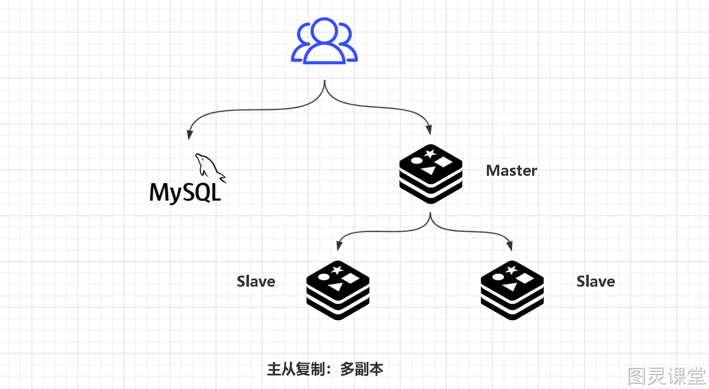
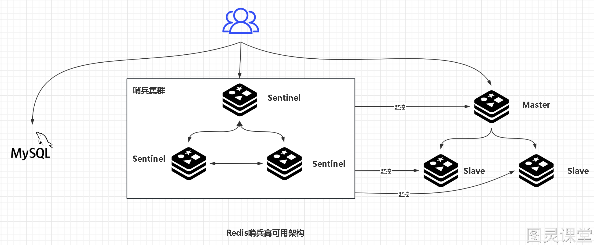

# 深入精讲

## 为什么需要哨兵机制？
Redis的主从复制主要用于实现数据的冗余备份和读分担，并不是为了提供高可用性。因此在系统高可用方面，单纯的主从架构无法很好的保证整个系统高可用。比如说：

- 需要人工介入：需要人工介入进行主节点切换。当主节点发生故障时，主从复制无法自动进行主节点的切换。需要管理员手动干预，修改配置将一个从节点提升为新的主节点。这增加了人工操作的复杂性和潜在的延迟。
- 主节点写能力有限：主节点的写能力受限于单个节点。在主从复制中，所有写操作都必须发送给主节点处理，然后再同步到从节点。这导致主节点成为写入瓶颈，其写能力受限于单个节点的硬件和性能。如果负载过大，主节点的响应时间可能会增加，影响整体性能。
- 单机节点存储能力有限：存储能力受限于主节点的容量。在主从复制中，所有数据都存储在主节点上，从节点仅用于提供读服务。这限制了整个系统的存储能力，因为主节点的存储容量有限。如果数据量增长过快或存储需求增加，主节点的存储容量可能会成为瓶颈。

因此通常是使用Redis哨兵机制或Redis集群模式来提高整个系统的可用性、扩展性和负载均衡能力。

## 哨兵机制(sentinel)的原理
Redis哨兵机制是通过在独立的哨兵节点上运行特定的哨兵进程来实现的。这些哨兵进程监控主从节点的状态，并在发现故障时自动完成故障发现和转移，并通知应用方，实现高可用性。
以下是哨兵机制的工作原理：

### 哨兵选举：
在启动时，每个哨兵节点会执行选举过程，其中一个哨兵节点被选为领导者（leader），负责协调其他哨兵节点。

#### 选举过程：

- 每个在线的哨兵节点都可以成为领导者，每个哨兵节点会向其它哨兵发is-master-down-by-addr命令，征求判断并要求将自己设置为领导者；
- 当其它哨兵收到此命令时，可以同意或者拒绝它成为领导者；
- 如果哨兵发现自己在选举的票数大于等于num(sentinels)/2+1时，将成为领导者，如果没有超过，继续选举。

### 监控主从节点：
哨兵节点通过发送命令周期性地检查主从节点的健康状态，包括主节点是否在线、从节点是否同步等。如果哨兵节点发现主节点不可用，它会触发一次故障转移。

### 故障转移：
一旦主节点被判定为不可用，哨兵节点会执行故障转移操作。它会从当前的从节点中选出一个新的主节点，并将其他从节点切换到新的主节点。这样，系统可以继续提供服务而无需人工介入。

#### 故障转移过程：

   - 由Sentinel节点定期监控发现主节点是否出现了故障： sentinel会向master发送心跳PING来确认master是否存活，如果master在“一定时间范围”内不回应PONG 或者是回复了一个错误消息，那么这个sentinel会主观地(单方面地)认为这个master已经不可用了。
   - 确认主节点：
      - 过滤掉不健康的（下线或断线），没有回复过哨兵ping响应的从节点
      - 选择从节点优先级最高的
      - 选择复制偏移量最大，此指复制最完整的从节点

当主节点出现故障， 由领导者负责处理主节点的故障转移。

### 客户端重定向：
哨兵节点会通知客户端新的主节点的位置，使其能够与新的主节点建立连接并发送请求。这确保了客户端可以无缝切换到新的主节点，继续进行操作。
此外，哨兵节点还负责监控从节点的状态。如果从节点出现故障，哨兵节点可以将其下线，并在从节点恢复正常后重新将其加入集群。

## 客观下线
当主观下线的节点是主节点时，此时该哨兵3节点会通过指令sentinel is-masterdown-by-addr寻求其它哨兵节点对主节点的判断，当超过quorum（选举）个数，此时哨兵节点则认为该主节点确实有问题，这样就客观下线了，大部分哨兵节点都同意下线操作，也就说是客观下线。

## 总结
redis哨兵的作用:

- 监控主数据库和从数据库是否正常运行。
- 主数据库出现故障时，可以自动将从数据库转换为主数据库，实现自动切换。

> 原文: <https://www.yuque.com/tulingzhouyu/db22bv/xms7g39b3ukvutw1>