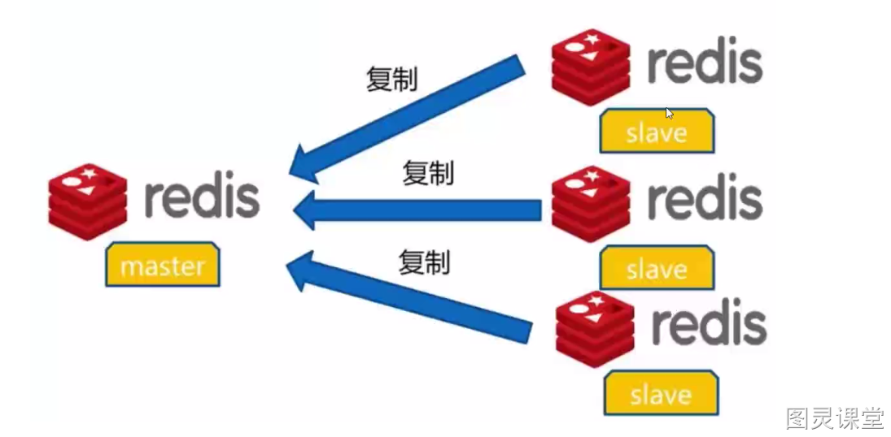
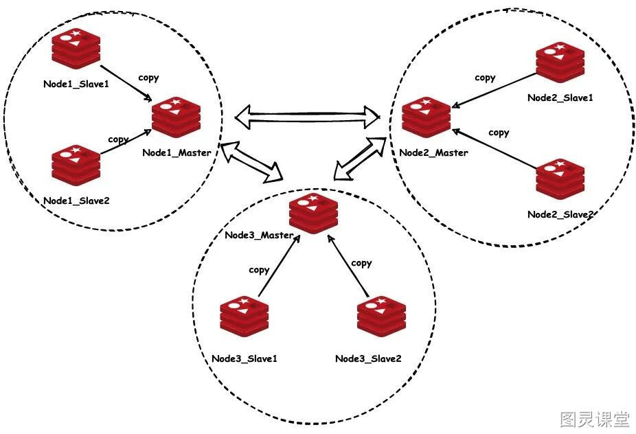

# 短视频

大部分人在开发中都是用redis单机，但是面试却经常被问怎么实现Redis高可用，哈喽大家好我是徐庶，今天来给大家讲下redis高可用；

为了实现redis高可用，通常的做法是，将数据复制多个副本然后部署在不同的服务器上，这样.其中一台挂掉了也可以继续提供服务，那其实呢。Redis 它实现高可用有三种高可用的部署模式：主从模式，哨兵模式，集群模式， 那我分别给大家稍微介绍一下啊。

#### 第一种。主从模式（也可以叫做“主从复制”）

**它的特性表现为：1个主节点，多个从节点，主节点负责读和写，从节点只能读。**

**它的优点是**
第一，提高了并发量：主节点能自动将数据同步到从节点，可以进行读写分离，分担主节点的的读压力，尤其是在写少读多的场景下，通过多个从节点分担读负载，可以大大提高 Redis 服务器的并发量
第二点：故障的恢复： 当主节点出现问题时，从节点仍然可以提供读服务，人工干预的情况下也可以实现快速的故障恢复。

但是有个问题：
当主挂掉后，系统就无法提供写操作了，在没有人工干预的情况下不能自动选主。为了提高可用性，就需要在主从模式的基础上增加哨兵。

#### 也就是我们的第二种：哨兵模式

**它的特性表现为：在主从模式的基础上增加了哨兵(我们通常用sentinel实现哨兵)，哨兵的作用是用来监控各节点情况，当主节点出现了故障，能自动将一个从节点转换为主节点。**

那哨兵模式呢它就解决了主节点自动切换的问题，实现了高可用性，但是单个节点的写并发能力和存储能力是有上限的，无法扩展，为了解决这个问题就又出现了集群模式。

#### 3. 那集群模式呢
主要是针对海量数据+高并发+高可用的场景。它会有多个 主节点 ，每个 主节点都可以挂载多个从节点。
这样整个 redis 就可以横向扩容了。如果你要支撑更大数据量的缓存，那就横向扩容更多的主节点，每个 主节点就能存放更多的数据了

Redis 集群要求至少需要3个主节点才能组成一个集群，同时每个主节点至少需要有一个从节点，当主节点发生了宕机，就会将对应的从节点节点提拔为主节点，来重新对外提供服务。 

那关于底层更多的底层原理我已经整理进了一份80万字的java面试资料中， 需要的可以再评论区扣666，如果要突击面试拿到这份资料可以节省你很多时间希望帮助你拿到更多offer。

> 原文: <https://www.yuque.com/tulingzhouyu/db22bv/sl71q0ch112agpec>