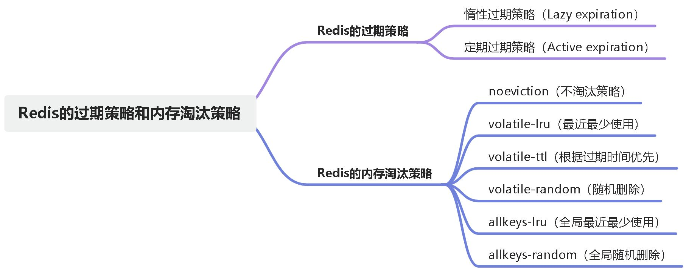

# 深入精讲

## Redis的内存淘汰策略
内存淘汰策略允许Redis在内存资源紧张时，根据一定的策略主动删除一些键值对，以释放内存空间并保持系统的稳定性。

### noeviction（不淘汰策略）
当内存不足以容纳新写入数据时，Redis 将新写入的命令返回错误。这个策略确保数据的完整性，但会导致写入操作失败。

### volatile-lru（最近最少使用）
从设置了过期时间的键中选择最少使用的键进行删除。该策略优先删除最久未被访问的键，保留最常用的键。

### volatile-ttl（根据过期时间优先）
从设置了过期时间的键中选择剩余时间最短的键进行删除。该策略优先删除剩余时间较短的键，以尽量保留剩余时间更长的键。

### volatile-random（随机删除）
从设置了过期时间的键中随机选择一个键进行删除。

### allkeys-lru（全局最近最少使用）
从所有键中选择最少使用的键进行删除。无论键是否设置了过期时间，都将参与淘汰。

### allkeys-random（全局随机删除）
从所有键中随机选择一个键进行删除。

> 原文: <https://www.yuque.com/tulingzhouyu/db22bv/gfr42t4xxofzelxe>