# 深入精讲

# 1.全面解析Redis-RDB与AOF持久化机制
Redis之所以能够提供高速读写操作是因为数据存储在内存中，但这也带来了一个风险，即在服务器宕机或断电的情况下，内存中的数据会丢失。为了解决这个问题，Redis提供了持久化机制来确保数据的持久性和可靠性。

### Redis持久化机制：

#### RDB(Redis Data Base) ：内存快照

#### AOF(Append Only File)： 增量日志

#### 混合持久化：RDB + AOF

## RDB持久化
在指定的时间间隔内将内存中的数据集快照写入磁盘，RDB是内存快照（内存数据的二进制序列化形式）的方式持久化，每次都是从Redis中生成一个快照进行数据的全量备份。

#### RDB持久化流程：

### 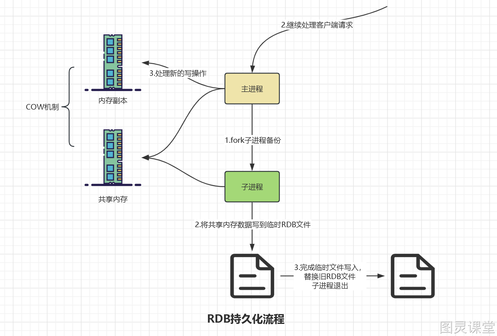
RDB持久化方案进行备份时，Redis会单独fork一个子进程来进行持久化，会将数据写入一个临时文件中，持久化完成后替换旧的RDB文件。
在整个持久化过程中，主进程（为客户端提供服务的进程）不参与IO操作，这样能确保Redis服务的高性能，RDB持久化机制适合对数据完整性要求不高但追求高效恢复的使用场景。

### RDB触发规则

#### 手动触发

##### save：
阻塞当前 Redis进程，直到RDB持久化过程完成，如果内存实例比较大会造成长时间阻塞，尽量不要使用这方式

##### bgsave：
Redis主进程fork创建子进程，由子进程完成持久化，阻塞时间很短（微秒级）

#### 自动触发

##### 配置触发：

- 在Redis安装目录下的redis.conf配置文件中搜索 /snapshot即可快速定位，配置文件默认注释了下面三行数据，通过配置规则来触发RDB的持久化，需要开启或者根据自己的需求按照规则来配置。

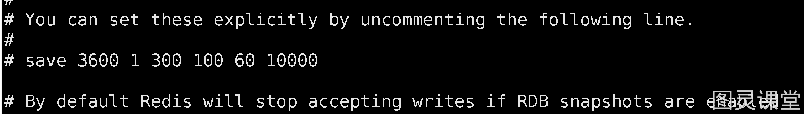
save 3600 1 -- 3600 秒内有1个key被修改，触发RDB
save 300 100 -- 300 秒内有100个key被修改，触发RDB
save 60 10000 -- 60 秒内有10000个key被修改，触发RDB

##### shutdown触发：

- shutdown触发Redis的RDB持久化机制非常简单，我们在客户端执行shutdown即可。

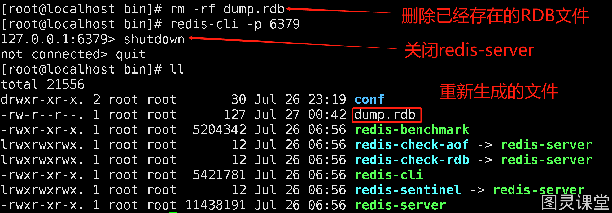

##### flushall触发:

- flushall清空Redis所有数据库的数据（16个库数据都会被删除）（等同于删库跑路）

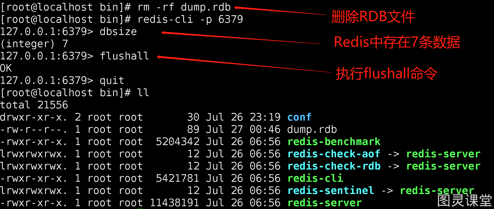

### 优点：

- 性能高：RDB持久化是通过生成一个快照文件来保存数据，因此在恢复数据时速度非常快。
- 文件紧凑：RDB文件是二进制格式的数据库文件，相对于AOF文件来说，文件体积较小。

### 缺点：

- 可能丢失数据：由于RDB是定期生成的快照文件，如果Redis意外宕机，最近一次的修改可能会丢失。

### TIPS
Redis持久化默认开启为RDB持久化

## AOF持久化
AOF持久化需要手动修改conf配置开启。

### AOF持久化流程：
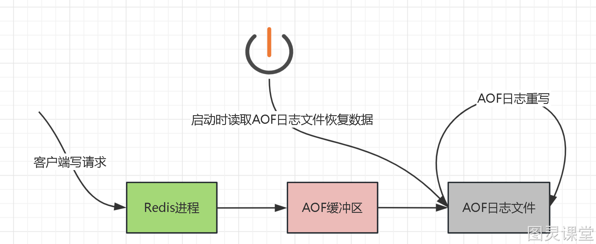
AOF持久化方案进行备份时，客户端所有请求的写命令都会被追加到AOF缓冲区中，缓冲区中的数据会根据Redis配置文件中配置的同步策略来同步到磁盘上的AOF文件中，同时当AOF的文件达到重写策略配置的阈值时，Redis会对AOF日志文件进行重写，给AOF日志文件瘦身。Redis服务重启的时候，通过加载AOF日志文件来恢复数据。

### AOF配置：
AOF默认不开启，默认为appendonly no，开启则需要修改为appendonly yes

关闭AOF+RDB混合模式，设为no：

### AOF同步策略：

#### appendfsync always：

   - 每次Redis写操作，都写入AOF日志，非常耗性能的。

#### appendfsync everysec

   - 每秒刷新一次缓冲区中的数据到AOF文件，这个Redis配置文件中默认的策略，兼容了性能和数据完整性的折中方案，这种配置，理论上丢失的数据在一秒钟左右

#### appendfsync no

   - Redis进程不会主动的去刷新缓冲区中的数据到AOF文件中，而是直接交给操作系统去判断，这种操作也是不推荐的，丢失数据的可能性非常大。

### AOF修复功能：
redis 7版本，AOF文件存储在appendonlydir文件下，base是基准文件，incr是追加数据。
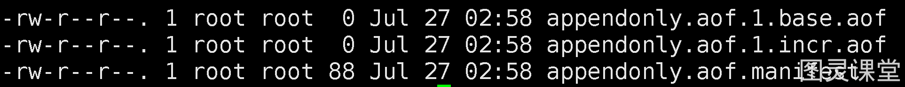
先存入三条数据，然后破坏incr结尾的文件内容，末尾加上baili
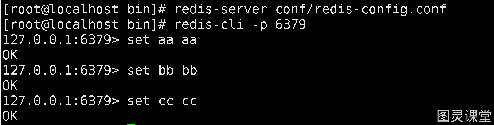

重新启动报错：
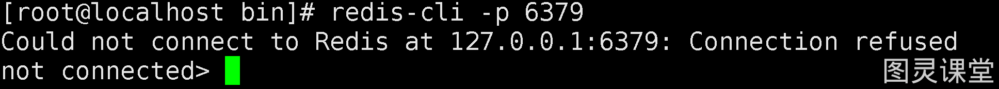
使用redis-check-aof --fix appendonlydir/appendonly.aof.1.incr.aof 对AOF日志文件进行修复
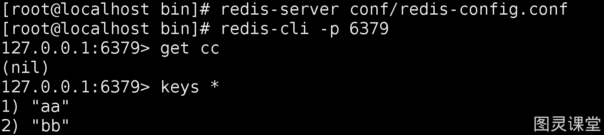
观察数据可以知道，丢失了cc-key值。这种丢失是被允许的。

### AOF重写
重写其实是针对AOF存储的重复性冗余指令进行整理，比如有些key反复修改，又或者key反复修改后最终被删除，这些过程中的指令都是冗余且不需要存储的。

#### 自动重写：
当AOF日志文件达到阈值时会触发自动重写。

##### 重写阈值配置：

- auto-aof-rewrite-percentage 100：当AOF文件体积达到上次重写之后的体积的100%时，会触发AOF重写。
- auto-aof-rewrite-min-size 64mb：当AOF文件体积超过这个阈值时，会触发AOF重写。

当AOF文件的体积达到或超过上次重写之后的比例，并且超过了最小体积阈值时，Redis会自动触发AOF重写操作，生成一个新的AOF文件。

#### 手动重写：bgrewriteaof
正常启动后存在三个文件：

通过set命令存储三条数据，最后在修改aa数据，然后手动重写：
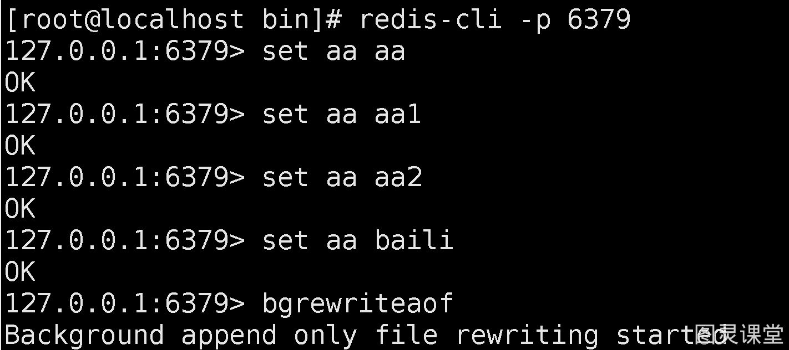
观察结果可以得知key值aa历史轨迹已经被删除
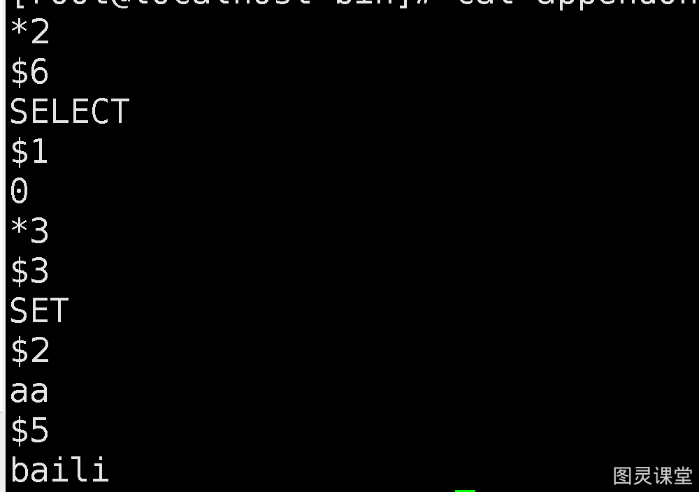

### 优点：

- 数据更加可靠：AOF持久化记录了每个写命令的操作，因此在出现故障时，可以通过重新执行AOF文件来保证数据的完整性。
- 可以保留写命令历史：AOF文件是一个追加日志文件，可以用于回放过去的写操作。

### 缺点：

- 文件较大：由于记录了每个写命令，AOF文件体积通常比RDB文件要大。
- 恢复速度较慢：当AOF文件较大时，Redis重启时需要重新执行整个AOF文件，恢复速度相对较慢。

## 混合持久化
Redis4.0版本开始支持混合持久化，因为RDB虽然加载快但是存在数据丢失，AOF数据安全但是加载缓慢。
混合持久化通过aof-use-rdb-preamble yes开启，Redis 4.0以上版本默认开启

开启混合持久化之后：appendonlydir文件下存在一个rdb文件与一个aof文件
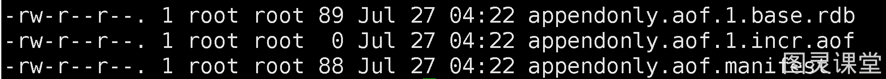
存入数据，然后执行bgrewriteaof重写文件。
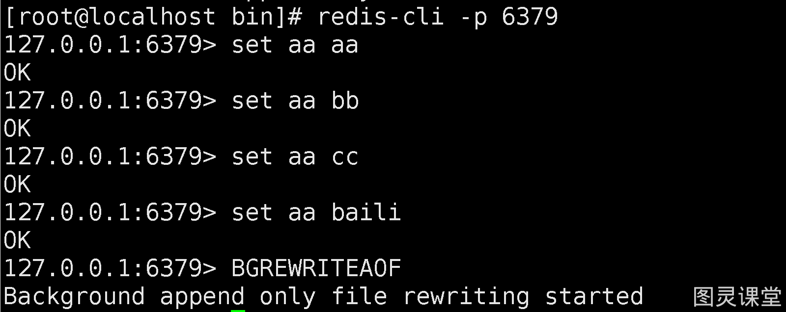
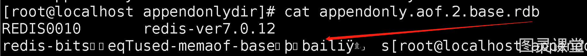

## 总结

- 推荐两者均开启
- 如果对数据不敏感，可以选单独用RDB
- 不建议单独用AOF，因为可能会出现Bug
- 如果只是做纯内存缓存，可以都不用

> 原文: <https://www.yuque.com/tulingzhouyu/db22bv/ulx5ka2xpt4l4p5f>