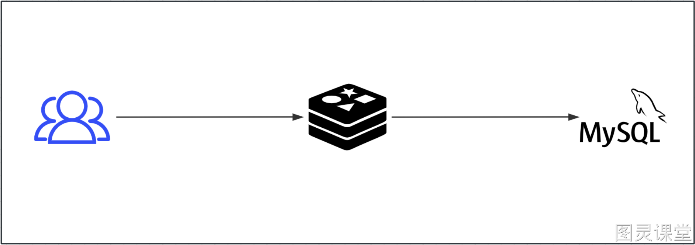
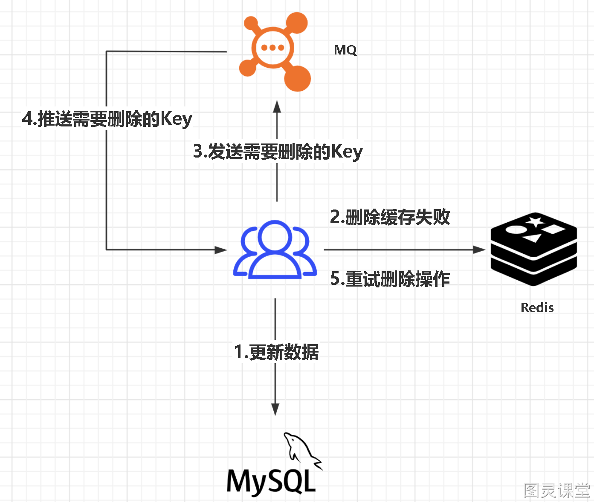
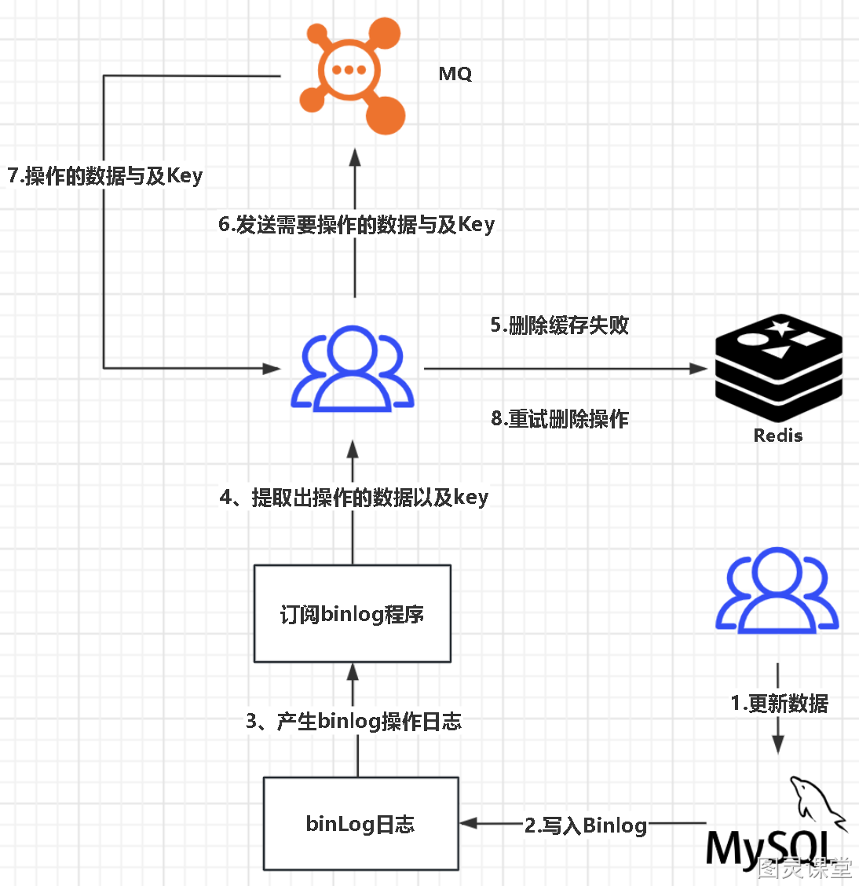

# 深入精讲

# **5.数据库和缓存一致性问题**

## 问题来源
使用redis做一个缓冲操作，让请求先访问到redis，而不是直接访问MySQL等数据库：

读取缓存步骤一般没有什么问题，但是一旦涉及到数据更新：数据库和缓存更新，就容易出现缓存(Redis)和数据库（MySQL）间的数据一致性问题。
不管是先写MySQL数据库，再删除Redis缓存；还是先删除缓存，再写库，都有可能出现数据不一致的情况。

## 举一个例子：

- 先更新Mysql，再更新Redis。

   如果更新Redis失败，可能仍然不一致

- 先删除Redis缓存数据，再更新Mysql。

   再次查询的时候在将数据添加到缓存中，这种方案能解决1方案的问题，但是在高并发下性能较低，而且仍然会出现数据不一致的问题，比如线程1删除了Redis缓存数据，正在更新Mysql，此时另外一个查询再查询，那么就会把Mysql中老数据又查到Redis中
因为写和读是并发的，没法保证顺序,就会出现缓存和数据库的数据不一致的问题

## 解决方案：

### 延时双删
   先删除Redis缓存数据，再更新Mysql，延迟几百毫秒再删除Redis缓存数据，这样就算在更新Mysql时，有其他线程读了Mysql，把老数据读到了Redis中，那么也会被删除掉，从而把数据保持一致。

### 队列 + 重试机制

      - 更新数据库数据；
      - 缓存因为种种问题删除失败
      - 将需要删除的key发送至消息队列
      - 自己消费消息，获得需要删除的key
      - 继续重试删除操作，直到成功

####  缺陷
对业务线代码造成大量的侵入。

### 异步更新缓存(基于订阅binlog的同步机制)

MySQL中产生了新的写入、更新、删除等操作，就可以把binlog相关的消息推送至Redis，Redis再根据binlog中的记录，对Redis进行更新。
其实这种机制，很类似MySQL的主从备份机制，因为MySQL的主备也是通过binlog来实现的数据一致性。

## 实际应用：
使用阿里的一款开源框架canal，通过该框架可以对MySQL的binlog进行订阅，而canal正是模仿了mysql的slave数据库的备份请求，使得Redis的数据更新达到了相同的效果。
MQ消息中间可以采用RocketMQ来实现推送。

> 原文: <https://www.yuque.com/tulingzhouyu/db22bv/zi405gs37g9ni7sp>