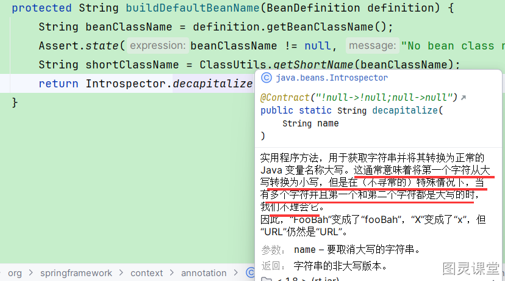
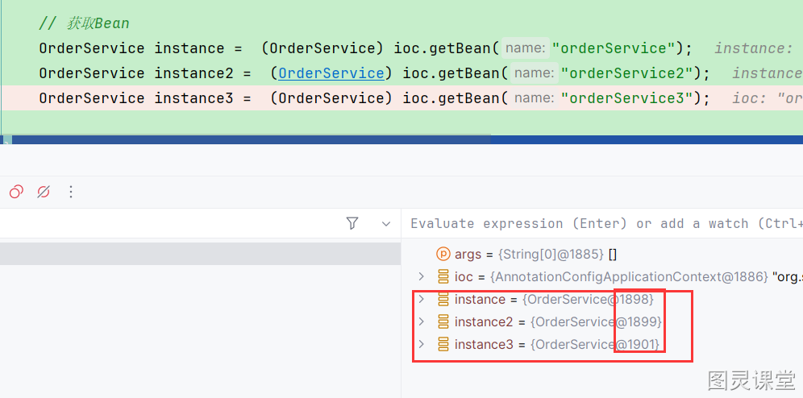

# 不知道的Spring知识点

## 当使用@Component Bean的Name默认是什么？
很多同学觉得Bean的名字不就是类名首字母小写吗？其实并不是全都这样。
在解析@Component注册为BeanDefinition时会调用`AnnotationBeanNameGenerator.buildDefaultBeanName`

## 

## 单例设计模式与Bean单例
Singleton模式主要作用是保证在Java应用程序中，一个Class有且仅有一个实例。它的好处非常显然的，可以避免不必要的重复操作，以及防止踩踏事件。在很多操作中，比如建立目录 数据库连接都需要这样的单线程操作。一些资源管理器常常设计成单例模式。
诸如数据库的连接，外部资源中如一台电脑可对应多个端口，但系统会集中管理这些端口，内部资源如采用一个对象管理存放系统配置的一个或多个属性文件。
**但是**，单例设计模式与Bean单例具有一定的区别，主要在于它们运行环境，java单例设计模式的环境是JVM，而Bean单例的环境在于Bean容器。一个Spring程序可以有很多个Bean，但一个Java程序通常有且仅有一个自己的JVM。所以，虽然Spring的Bean单例在一个容器中有且仅有一个，但如果程序具有多个Bean容器，而且都有某个Bean，那么这个Bean在这个程序中并非只有一个。但在实际应用中，如果将对象的生命周期完全交给Spring管理(不在其他地方通过new、反射等方式创建)，其实也能达到单例模式的效果。

ByType-->byName

> 原文: <https://www.yuque.com/tulingzhouyu/db22bv/atozzb603zi77g4q>