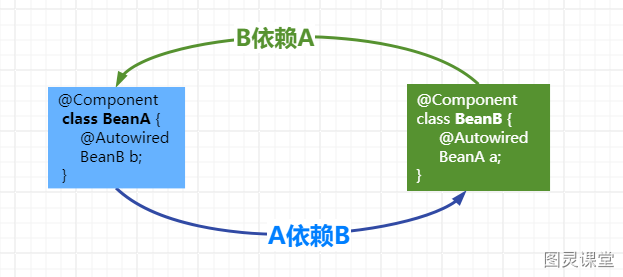
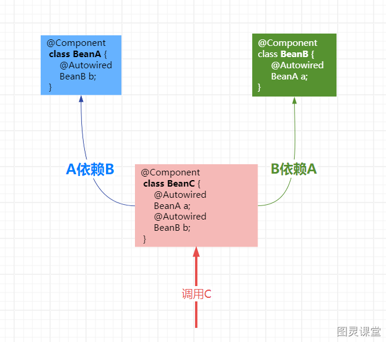

# 短视频

SpringBoot出现循环依赖报错怎么办？  我建议你不要直接开启，  SpringBoot2.6.0以上版本既然已经禁止了循环依赖肯定有他的理由？

我来大家讲讲

Spring的循环依赖是一个老生常谈的问题，说白了就是2个Bean相互依赖注入，形成了依赖的闭环造成死循环依赖。

Spring虽然通过三级缓存帮我们解决了，但是循环依赖其实 增加了对象依赖的混乱性，会让对象的依赖关系变得错综复杂，是一种不好的代码设计。
并且Spring为了做好人 ，解决循环依赖，导致很多开发者提出一些跟循环依赖相关的其他的issue，让spring作者很无奈。

所以Spring作者表示会在后续版本禁止循环依赖，并且已经SpringBoot**2.6.0**的版本默认禁止了循环依赖，所以 ..如果程序中出现循环依赖启动时就会报错。
那如何解决呢？我给大家提供**三种**解决方案：
**哈喽大家好我是徐庶，另外想要文字版的小伙伴可以再评论区扣666，我已经把视频资料整理进了一份80万字的高频面试题资料中。**

1. **使用@Lazy注解**，可以再循环依赖注入的属性加上**@Lazy 注解**，这样可以使属性延迟注入从而呢就中断了循环的依赖。
2. **打破循环依赖**，把相互依赖的代码放在一个新的bean中， 这样就可以打破循环依赖的闭环

3. 在方法中通过动态调用Spring容器的getBean方法达到延迟获取bean。而不在类中依赖注入循环依赖的Bean，从而中断了循环的依赖。
```java
// A需要B时：
public void getB(){
    applicationContext.getBean(B)
}
// B需要A时：
public void getA(){
    applicationContext.getBean(A)
}
```

4. **开启循环依赖**， 这种方式其实我其实**不建议**， 因为Springboot既然已经禁止了，为什么要执迷不悟重蹈覆辙呢？

当然如果你的项目是从Spring移植到Spring，之前就已经写了大量的循环依赖，那确实破罐子破摔比你重构要更节省成本， 你可以通过在SpringBoot配置文件中设置开启循环依赖：
```
spring:
  main:
    allow-circular-references: true
```


所以， 我在这里建议大家以后项目中就直接杜绝bean的循环依赖的代码设计。  如果视频有帮助可以三连支持，你的支持是我持续更新的动力。


> 原文: <https://www.yuque.com/tulingzhouyu/db22bv/wdt0zc7d1eqbtd5s>