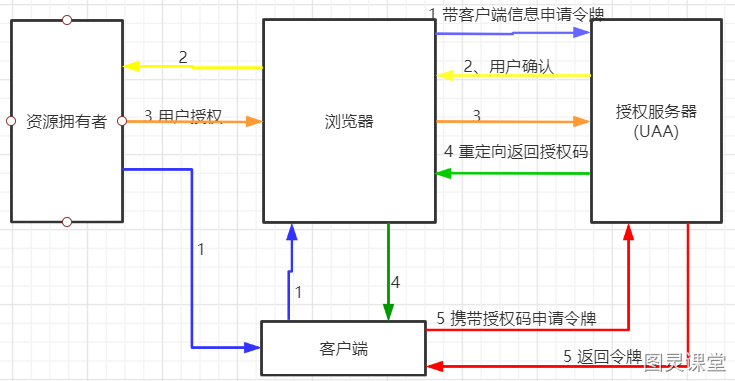
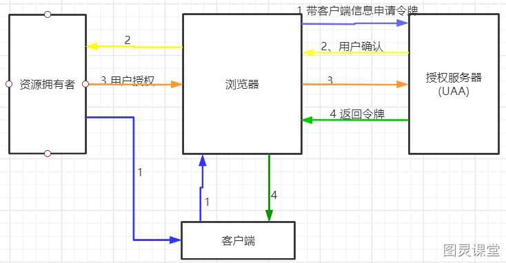
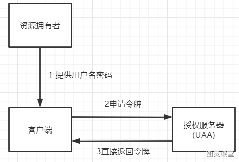
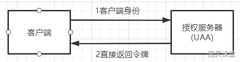

# OAuth2授权模式

## 前言
传统的客户端-服务器身份验证模型中存在的问题。在这种模型中，客户端通过使用资源所有者的凭据对服务器进行身份验证，从而请求访问受限资源（受保护的资源）。为了使第三方应用程序能够访问受限资源，资源所有者需与第三方共享其凭据。然而，这种做法存在一些问题和限制：

- 第三方应用程序通常需要**明文存储**资源所有者的凭据（通常是密码），以备将来使用。
- 服务器需要支持密码身份验证，而且密码身份验证存在**安全弱点**。
- 第三方应用程序可能获得对资源所有者受保护资源的过于广泛的**访问权限**，而资源所有者无法限制对资源的访问时长或访问的资源子集。
- 资源所有者无法单独撤销对个别第三方的访问权限，而不影响所有第三方的访问权限，只能通过更改第三方的密码来执行此操作。
- 如果任何第三方应用程序遭到破坏，将导致最终用户密码以及由该密码保护的所有数据的**泄露**。

## 什么是OAuth 2.0
OAuth 2.0（开放授权2.0）是一种用于授权的开放标准，允许用户让第三方应用访问他们在某一网站上存储的私有资源，而无需将用户名和密码提供给第三方应用。OAuth 2.0是OAuth协议的升级版本，提供了更简化和灵活的授权流程。
在OAuth 2.0中，授权过程包括以下主要角色：

1. **资源所有者（Resource Owner）：** 即用户，是拥有受保护资源的实体。用户通过授权第三方应用访问他们的资源。
2. **客户端（Client）：** 即第三方应用，需要访问资源所有者的受保护资源。
3. **授权服务器（Authorization Server）：** 负责验证资源所有者并颁发访问令牌给客户端。授权服务器和资源服务器可以是同一个服务或不同的服务。
4. **资源服务器（Resource Server）：** 存储受保护资源的服务器，通过访问令牌验证并提供受保护资源。

在OAuth 2.0中，定义了多种授权方式（授权码模式、隐式授权模式、密码模式、客户端凭证模式等），客户端通过与授权服务器交互，获取访问令牌，然后使用访问令牌访问受保护资源。

## Oauth2 四种授权模式

### 授权码模式
授权码模式（Authorization Code Grant）是 OAuth 2.0 中的一种常见的授权模式，适用于客户端需要访问用户资源，但又不能直接使用用户的凭证的场景。以下是授权码模式的流程：

1. **客户端请求授权：**
   - 用户访问客户端，客户端将用户导向授权服务器，并包含以下参数：
      - **response_type=code**：表示使用授权码模式。
      - **client_id**：标识客户端。
      - **redirect_uri**：授权成功后重定向的URI。
      - **scope**：请求的权限范围。
2. **用户同意授权：**
   - 用户在授权服务器登录并同意授权请求。
3. **授权服务器发放授权码：**
   - 授权服务器验证用户身份和授权请求后，向客户端发放授权码。
4. **客户端获取访问令牌：**
   - 客户端通过后端将授权码和客户端凭证发送到授权服务器。
   - 包含以下参数：
      - **grant_type=authorization_code**：表示使用授权码模式。
      - **code**：授权码。
      - **redirect_uri**：必须与步骤1中的重定向URI一致。
      - **client_id**：客户端标识。
      - **client_secret**：客户端秘钥（可选）。
5. **授权服务器发放访问令牌：**
   - 授权服务器验证授权码和客户端凭证，如果有效则发放访问令牌。
6. **客户端使用访问令牌：**
   - 客户端可以使用访问令牌访问用户的受保护资源。

授权码模式相对于其他模式更安全，因为客户端不直接接触用户凭证，且在授权码的交换过程中可以使用安全的后端通信。

### 隐式授权模式(简化模式)
隐式授权模式（Implicit Grant）是 OAuth 2.0 中的一种授权模式，通常用于移动应用或纯前端应用。以下是隐式授权模式的流程：

1. **发起认证请求（Authorization Request）：**
   - 客户端（浏览器或移动应用）向授权服务器发送认证请求。
   - 请求包括：
      - **response_type** 参数，设为 "token"，表示使用隐式授权模式。
      - **client_id** 参数，标识客户端。
      - **redirect_uri** 参数，用于接收授权服务器的响应。
2. **用户身份验证和授权：**
   - 用户在授权服务器上进行身份验证。
   - 用户同意授权请求，授权服务器生成访问令牌。
3. **生成令牌（Access Token）：**
   - 授权服务器生成访问令牌。
   - 生成的访问令牌直接包含在重定向 URI 中，作为 URI 片段的一部分。
4. **重定向到客户端：**
   - 授权服务器将包含访问令牌的重定向 URI 返回给客户端。
   - 重定向 URI 中的访问令牌可通过前端 JavaScript 访问。
5. **客户端使用令牌：**
   - 客户端从重定向 URI 中提取访问令牌。
   - 客户端可以使用令牌访问资源服务器上的受保护资源。

请注意，相比于其他授权模式，隐式授权模式不涉及客户端的后端服务器，而是直接在浏览器中处理。这使得它适用于前端应用，但也带来了一些安全性的考虑。因此，建议在可能的情况下，优先考虑授权码模式。

### 密码模式
密码模式（Password Grant）是 OAuth 2.0 中的一种授权模式，它允许客户端使用用户的用户名和密码直接向授权服务器请求访问令牌。密码模式通常用于由受信任的客户端直接与资源所有者的服务进行通信，而不通过用户代理的情况。
以下是密码模式的流程：

1. **客户端向授权服务器发送请求：**
   - 客户端通过安全通道直接向授权服务器发送包含以下参数的请求：
      - **grant_type**：固定为 "password"，表示使用密码模式。
      - **client_id**：标识客户端。
      - **client_secret**：客户端的秘密（如果有的话）。
      - **username**：用户的用户名。
      - **password**：用户的密码。
      - **scope**：请求的范围（可选）。
2. **授权服务器验证用户身份：**
   - 授权服务器验证客户端的身份和用户的身份。
   - 如果验证成功，授权服务器生成访问令牌和可能的刷新令牌。
3. **授权服务器响应：**
   - 授权服务器以 JSON 格式返回访问令牌和刷新令牌。

密码模式的使用场景通常受到一些限制，因为它需要客户端直接存储用户的密码。因此，它主要适用于受信任的客户端，如后端服务器。在使用密码模式时，需要特别注意确保安全性，并确保通过安全通道（如 HTTPS）进行通信。

### 客户端凭证模式
客户端凭证模式（Client Credentials Grant）是 OAuth 2.0 中的一种授权模式，适用于无需用户参与的情况，通常用于客户端自身访问其拥有权限的资源。
以下是客户端凭证模式的流程：

1. **客户端向授权服务器发送请求：**
   - 客户端通过安全通道直接向授权服务器发送包含以下参数的请求：
      - **grant_type**：固定为 "client_credentials"，表示使用客户端凭证模式。
      - **client_id**：标识客户端。
      - **client_secret**：客户端的秘密。
2. **授权服务器验证客户端身份：**
   - 授权服务器验证客户端的身份，确保客户端合法且有权限使用此模式。
3. **授权服务器响应：**
   - 授权服务器以 JSON 格式返回访问令牌。
   - 响应中包含访问令牌以及令牌的有效期等信息。

客户端凭证模式适用于那些不涉及用户的、由客户端自己访问自己资源的情况，例如后端服务之间的通信。在使用客户端凭证模式时，同样需要注意保障传输安全性，并限制客户端凭证的使用范围。

> 原文: <https://www.yuque.com/tulingzhouyu/db22bv/kggvtidr2ubdsmd9>