# 🚀微服务面试三十五问合集


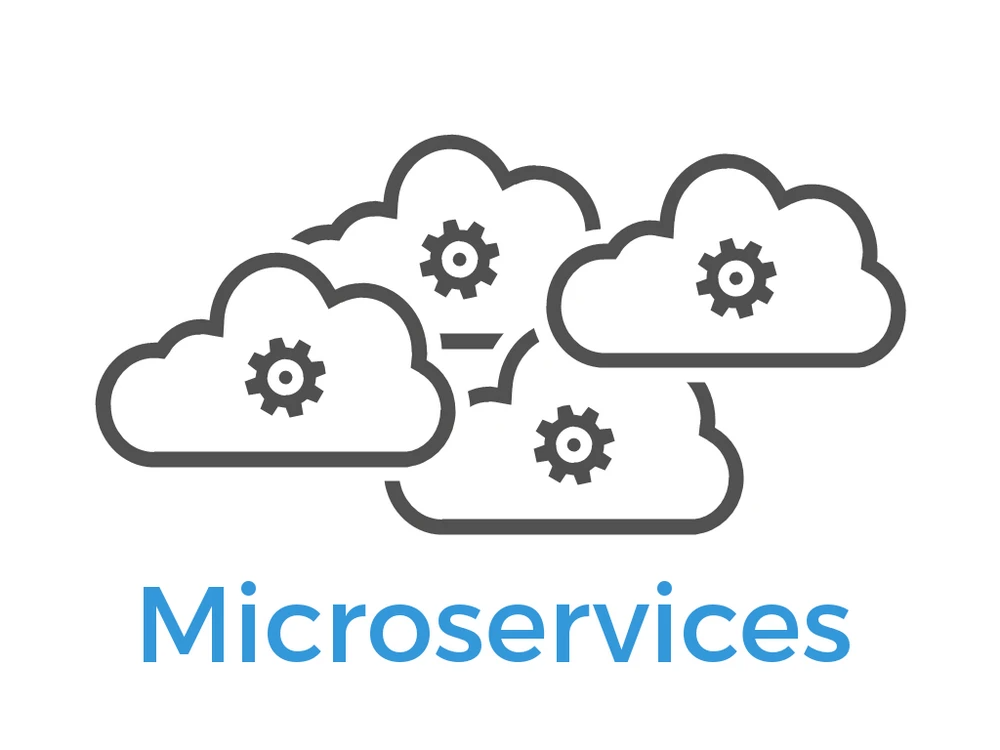

# 概念

## 1.微服务有什么好处？
 微服务优点很多，但是我们通常说一个东西好肯定会跟另一个东西比较， 通常说微服务好会和单体项目进行比较。以下是微服务相对于单体项目的一些显著好处：
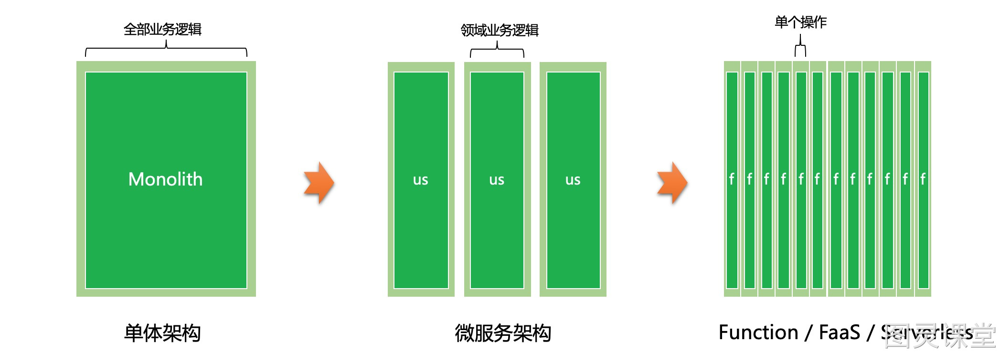
首先，让我们讨论单体项目的一些主要缺点：
**单体项目的缺点：**

1. **可扩展性受限：** 单体应用通常在可扩展性方面受到限制，因为整个应用程序必须一起扩展。这意味着即使只有一个组件需要更多资源，也必须扩展整个应用程序，这可能会导致资源浪费。
2. **难以维护和更新：** 随着时间的推移，单体应用程序往往变得越来越庞大和复杂，难以理解、维护和更新。每次修改都可能引发意想不到的影响。
3. **高风险：** 单体应用程序中的一个小错误或故障可能会导致整个应用程序崩溃，因此存在较高的风险。此外，长时间不更新的单体应用可能会受到安全威胁。
4. **技术栈限制：** 单体应用程序通常使用相同的技术栈，这可能会限制您在项目中使用最新的技术和工具的能力。
5. **团队协作复杂：** 单体应用程序的所有组件都在一个代码库中，这可能导致开发团队之间的冲突和协作问题，尤其在大型团队中更为突出。

现在，让我们看看微服务项目的一些优点：
**微服务项目的优点：**

1. **可扩展性：** 微服务架构允许您根据需要独立地扩展单个服务，而不必扩展整个应用程序，这提供了更高的可扩展性。
2. **灵活性和快速开发：** 微服务允许开发团队独立设计、开发和部署服务，这提高了灵活性，允许团队更快地推出新功能和更新。
3. **故障隔离和容错性：** 单个微服务的故障通常不会影响其他服务，提高了应用程序的容错性，同时更容易识别和解决故障。
4. **技术多样性：** 微服务允许您选择适合每个服务的最佳技术栈，这有助于充分利用各种技术和工具的优势。
5. **独立部署和维护：** 微服务可以独立部署和维护，这减少了风险，使团队能够更快速地进行修复和更新。
6. **团队协作：** 不同团队可以独立工作在不同服务上，这提高了团队的自治和协作能力，减少了冲突。

总的来说，微服务项目通过提供更高的可扩展性、灵活性和容错性，以及更容易管理的部署和维护过程，有助于克服单体应用程序的一些限制和缺点。但请注意，微服务架构也会引入一些新的复杂性，需要更多的管理和监控。选择适合您项目需求的架构取决于多种因素。

## 2.微服务带来了哪些挑战？

1. **成本挑战：**
   - **基础设施成本增加：** 微服务应用通常需要更多的基础设施资源，例如服务器、容器管理、负载均衡器等，这可能导致运营成本增加。
   - **开发和维护成本：** 管理多个微服务的开发、测试、部署和维护需要更多的工程师资源，这可能导致开发和维护成本上升。
2. **复杂性挑战：**
   - **分布式系统复杂性：** 微服务应用是分布式系统，涉及多个独立运行的服务，这增加了系统的复杂性，包括网络通信、故障处理和事务管理等方面。
   - **服务发现和治理：** 管理多个微服务的发现、注册、版本控制和路由需要额外的复杂性，例如使用服务网格或API网关。
3. **部署挑战：**
   - **自动化部署需求：** 为了有效地部署多个微服务，需要建立自动化的部署流程，这可能需要额外的工作和资源。
   - **版本控制和回滚：** 管理不同版本的微服务以及版本之间的兼容性可能会变得复杂，特别是在需要回滚时。
4. **一致性挑战：**
   - **数据一致性：** 不同微服务可能拥有各自的数据存储，确保数据一致性和同步可能需要复杂的解决方案，如分布式事务或事件驱动的一致性。
   - **事务管理：** 管理跨多个微服务的事务变得复杂，确保事务的一致性和隔离性需要额外的努力和技术。
5. **监控和故障排除挑战：**
   - **性能监控：** 在微服务环境中，跟踪性能问题和故障排除可能更加困难，因为问题可能涉及多个服务，需要强大的监控和诊断工具。
   - **故障排除：** 需要有效的方法来跟踪和诊断跨多个服务的故障，以便快速恢复。

 
微服务不是万金油，是用来处理海量用户、业务复杂和需求频繁变更场景下的一种架构风格。引用一句话“好的架构是演化出来的，而不是设计出来的”。任何一种架构的引入，都会带来利弊两个方面的影响，如何平衡才最重要。

## 3.现在有哪些流行的微服务解决方案？
目前最主流的微服务开源解决方案有三种：

1. Dubbo：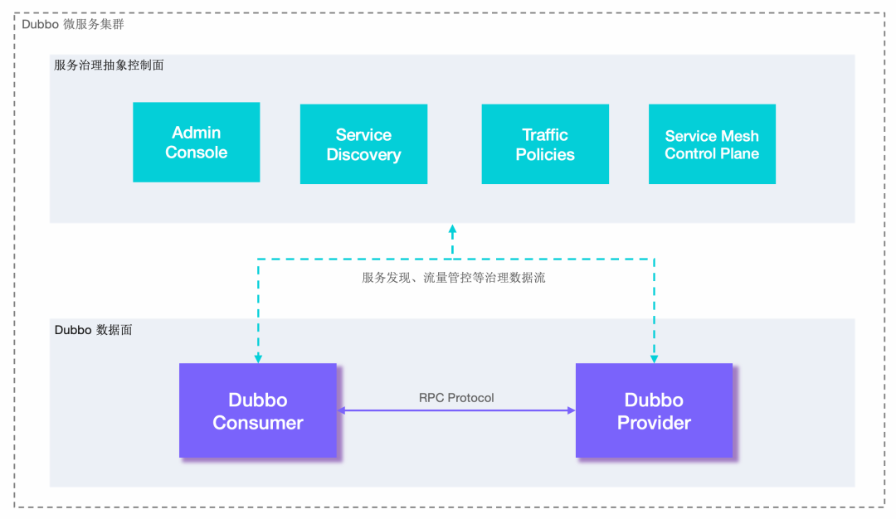Dubbo工作原理图-来源官网
   - Dubbo 是一个高性能、轻量级的 Java 微服务框架，最初由阿里巴巴（Alibaba）开发并于2011年开源。它提供了服务注册与发现、负载均衡、容错、分布式调用等功能，后来一度停止维护，在近两年，又重新开始迭代，并推出了Dubbo3。
   - Dubbo 使用基于 RPC（Remote Procedure Call）的通信模型，具有较高的性能和可扩展性。它支持多种传输协议（如TCP、HTTP、Redis）和序列化方式（如JSON、Hessian、Protobuf），可根据需求进行配置。
   - Dubbo更多地被认为是一个高性能的RPC（远程过程调用）框架，一些服务治理功能依赖于第三方组件实现，比如使用ZooKeeper、Apollo等等。
2. Spring Cloud Netflix：
   - Spring Cloud Netflix 是 Spring Cloud 的一个子项目，结合了 Netflix 开源的多个组件，但是Netflix自2018年停止维护和更新Netflix OSS项目，包括Eureka、Hystrix等组件，所以Spring Cloud Netflix也逐渐进入了维护模式。
   - 该项目包含了许多流行的 Netflix 组件，如Eureka（服务注册与发现）、Ribbon（客户端负载均衡）、Hystrix（断路器）、Zuul（API 网关）等。它们都是高度可扩展的、经过大规模实践验证的微服务组件。
3. Spring Cloud Alibaba：

### 这三种方案有什么区别吗？

4. 三种方案的区别：
| 特点 | Dubbo | Spring Cloud Netflix | Spring Cloud Alibaba |
| --- | --- | --- | --- |
| 开发语言 | Java | Java | Java |
| 服务治理 | 提供完整的服务治理功能 | 提供部分服务治理功能 | 提供完整的服务治理功能 |
| 服务注册与发现 | ZooKeeper/Nacos | Eureka/Consul | Nacos |
| 负载均衡 | 自带负载均衡策略 | Ribbon | Ribbon\\Dubbo负载均衡策略 |
| 服务调用 | RPC方式 | RestTemplate/Feign | Feign/RestTemplate/Dubbo |
| 熔断器 | Sentinel | Hystrix | Sentinel/Resilience4j |
| 配置中心 | Apollo | Spring Cloud Config | Nacos Config |
| API网关 | Higress/APISIX | Zuul/Gateway | Spring Cloud Gateway |
| 分布式事务 | Seata | 不支持分布式事务 | Seata |
| 限流和降级 | Sentinel | Hystrix | Sentinel |
| 分布式追踪和监控 | Skywalking | Spring Cloud Sleuth + Zipkin | SkyWalking或Sentinel Dashboard |
| 微服务网格 | Dubbo Mesh | 不支持微服务网格 | Service Mesh（Nacos+Dubbo Mesh） |
| 社区活跃度 | 相对较高 | 目前较低 | 相对较高 |
| 孵化和成熟度 | 孵化较早，成熟度较高 | 成熟度较高 | 孵化较新，但迅速发展 |

   - Spring Cloud Alibaba 是 Spring Cloud 的另一个子项目，与阿里巴巴的分布式应用开发框架相关。它提供了一整套与 Alibaba 生态系统集成的解决方案。
   - 该项目包括 Nacos（服务注册与发现、配置管理）、Sentinel（流量控制、熔断降级）、RocketMQ（消息队列）等组件，以及与 Alibaba Cloud（阿里云）的集成。它为构建基于 Spring Cloud 的微服务架构提供了丰富的选项。
   - 据说SpringCloud Alibaba项目的发起人已经跑路去了腾讯，并发起了SpringCloud Tecent项目，社区发展存在隐忧。

在面试中，微服务一般主要讨论的是Spring Cloud Netflix，其次是Spring Cloud Alibaba，Dubbo更多的是作为一个RPC框架来问。

## 4.说下微服务有哪些组件？
微服务给系统开发带来了一些问题和挑战，如服务调用的复杂性、分布式事务的处理、服务的动态管理等。为了更好地解决这些问题和挑战，各种微服务治理的组件应运而生，充当微服务架构的基石和支撑。
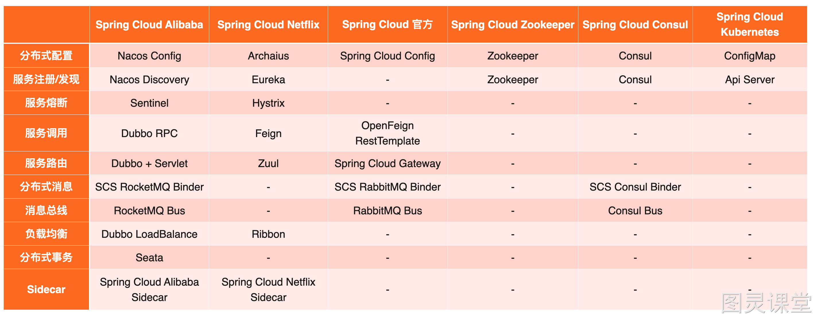
微服务组件示意图
微服务的各个组件和常见实现：

1. 注册中心：用于服务的注册与发现，管理微服务的地址信息。常见的实现包括：
   - Spring Cloud Netflix：Eureka、Consul
   - Spring Cloud Alibaba：Nacos
2. 配置中心：用于集中管理微服务的配置信息，可以动态修改配置而不需要重启服务。常见的实现包括：
   - Spring Cloud Netflix：Spring Cloud Config
   - Spring Cloud Alibaba：Nacos Config
3. 远程调用：用于在不同的微服务之间进行通信和协作。常见的实现保包括：
   - RESTful API：如RestTemplate、Feign
   - RPC（远程过程调用）：如Dubbo、gRPC
4. API网关：作为微服务架构的入口，统一暴露服务，并提供路由、负载均衡、安全认证等功能。常见的实现包括：
   - Spring Cloud Netflix：Zuul、Gateway
   - Spring Cloud Alibaba：Gateway、Apisix等
5. 分布式事务：保证跨多个微服务的一致性和原子性操作。常见的实现包括：
   - Spring Cloud Alibaba：Seata
6. 熔断器：用于防止微服务之间的故障扩散，提高系统的容错能力。常见的实现包括：
   - Spring Cloud Netflix：Hystrix
   - Spring Cloud Alibaba：Sentinel、Resilience4j
7. 限流和降级：用于防止微服务过载，对请求进行限制和降级处理。常见的实现包括：
   - Spring Cloud Netflix：Hystrix
   - Spring Cloud Alibaba：Sentinel
8. 分布式追踪和监控：用于跟踪和监控微服务的请求流程和性能指标。常见的实现包括：
   - Spring Cloud Netflix：Spring Cloud Sleuth + Zipkin
   - Spring Cloud Alibaba：SkyWalking、Sentinel Dashboard

# 注册中心

## 5.注册中心是用来干什么的？
注册中心是用来管理和维护分布式系统中各个服务的地址和元数据的组件。它主要用于实现服务发现和服务注册功能。
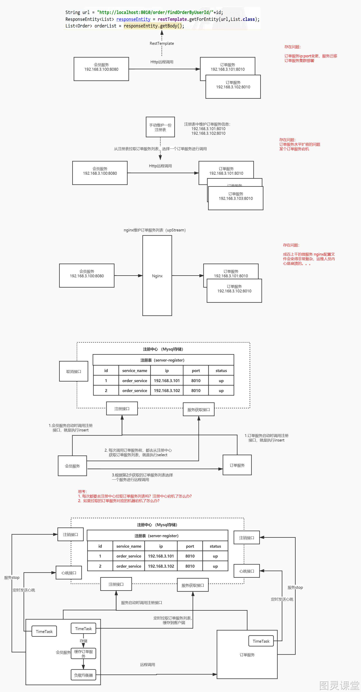
注册中心示意图
总结一下注册中心的作用：

1. **服务注册**：各个服务在启动时向注册中心注册自己的网络地址、服务实例信息和其他相关元数据。这样，其他服务就可以通过注册中心获取到当前可用的服务列表。
2. **服务发现**：客户端通过向注册中心查询特定服务的注册信息，获得可用的服务实例列表。这样客户端就可以根据需要选择合适的服务进行调用，实现了服务间的解耦。
3. **负载均衡**：注册中心可以对同一服务的多个实例进行负载均衡，将请求分发到不同的实例上，提高整体的系统性能和可用性。
4. **故障恢复**：注册中心能够监测和检测服务的状态，当服务实例发生故障或下线时，可以及时更新注册信息，从而保证服务能够正常工作。
5. **服务治理**：通过注册中心可以进行服务的配置管理、动态扩缩容、服务路由、灰度发布等操作，实现对服务的动态管理和控制。

## 6.SpringCloud可以选择哪些注册中心？
SpringCloud可以与多种注册中心进行集成，常见的注册中心包括：

1. Eureka：Eureka 是 Netflix 开源的服务发现框架，具有高可用、弹性、可扩展等特点，并与 Spring Cloud 集成良好，**已闭源**。ap
2. Consul：Consul 是一种分布式服务发现和配置管理系统，由 HashiCorp 开发。它提供了服务注册、服务发现、健康检查、键值存储等功能，并支持多数据中心部署。c/ap
3. ZooKeeper：ZooKeeper 是 Apache 基金会开源的分布式协调服务，可以用作服务注册中心。它具有高可用、一致性、可靠性等特点。 cp
4. Nacos：Nacos 是阿里巴巴开源的一个动态服务发现、配置管理和服务管理平台。它提供了服务注册和发现、配置管理、动态 DNS 服务等功能。 ap
5. etcd：etcd 是 CoreOS 开源的一种分布式键值存储系统，可以被用作服务注册中心。它具有高可用、强一致性、分布式复制等特性。 cp

## 7.说下Eureka、ZooKeeper、Nacos的区别？
| 特性 | Eureka | ZooKeeper | Nacos |
| --- | --- | --- | --- |
| 开发公司 | Netflix | Apache 基金会 | 阿里巴巴 |
| CAP | AP（可用性和分区容忍性） | CP（一致性和分区容忍性） | 既支持AP，也支持CP |
| 功能 | 服务注册与发现 | 分布式协调、配置管理、分布式锁 | 服务注册与发现、配置管理、服务管理 |
| 定位 | 适用于构建基于 HTTP 的微服务架构 | 通用的分布式协调服务框架 | 适用于微服务和云原生应用 |
| 访问协议 | HTTP | TCP | HTTP/DNS |
| 自我保护 | 支持 | - | 支持 |
| 数据存储 | 内嵌数据库、多个实例形成集群 | ACID 特性的分布式文件系统 ZAB 协议 | 内嵌数据库、MySQL 等 |
| 健康检查 | Client Beat | Keep Alive | TCP/HTTP/MYSQL/Client Beat |
| 特点 | 简单易用、自我保护机制 | 高性能、强一致性 | 动态配置管理、流量管理、灰度发布等 |

可以看到Eureka和ZooKeeper的最大区别是一个支持AP，一个支持CP，Nacos既支持既支持AP，也支持CP。

## 8.Eureka实现原理了解吗？
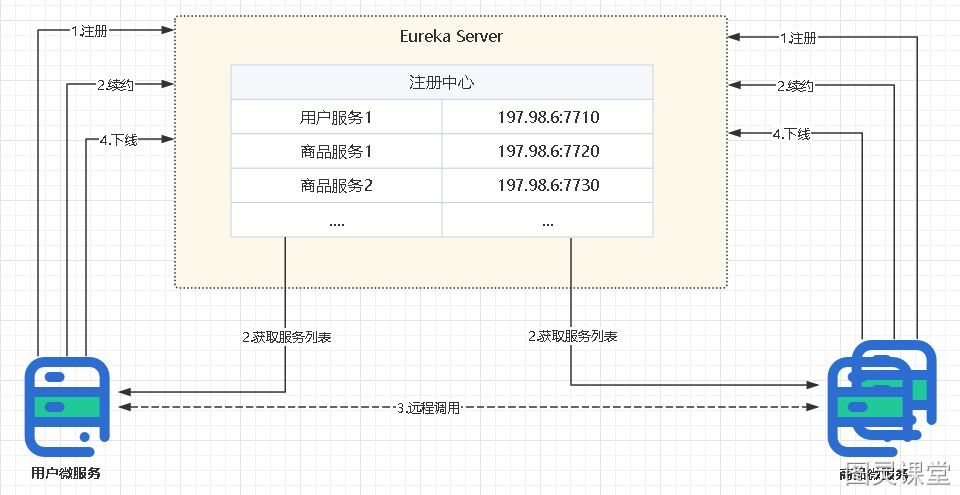
Eureka原理示意图
Eureka的实现原理，大概可以从这几个方面来看：

1. 服务注册与发现: 当一个服务实例启动时，它会向Eureka Server发送注册请求，将自己的信息注册到注册中心。Eureka Server会将这些信息保存在内存中，并提供REST接口供其他服务查询。服务消费者可以通过查询服务实例列表来获取可用的服务提供者实例，从而实现服务的发现。
2. 服务健康检查: Eureka通过心跳机制来检测服务实例的健康状态。服务实例会定期向Eureka Server发送心跳，也就是续约，以表明自己的存活状态。如果Eureka Server在一定时间内没有收到某个服务实例的心跳，则会将其标记为不可用，并从服务列表中移除，下线实例。
3. 服务负载均衡: Eureka客户端在调用其他服务时，会从本地缓存中获取服务的注册信息。如果缓存中没有对应的信息，则会向Eureka Server发送查询请求。Eureka Server会返回一个可用的服务实例列表给客户端，客户端可以使用负载均衡算法选择其中一个进行调用。

其它的注册中心，如Nacos、Consul等等，在服务注册和发现上，实现原理都是大同小异。

## 9.Eureka Server怎么保证高可用？
Eureka Server保证高可用，主要通过这三个方面来实现：
 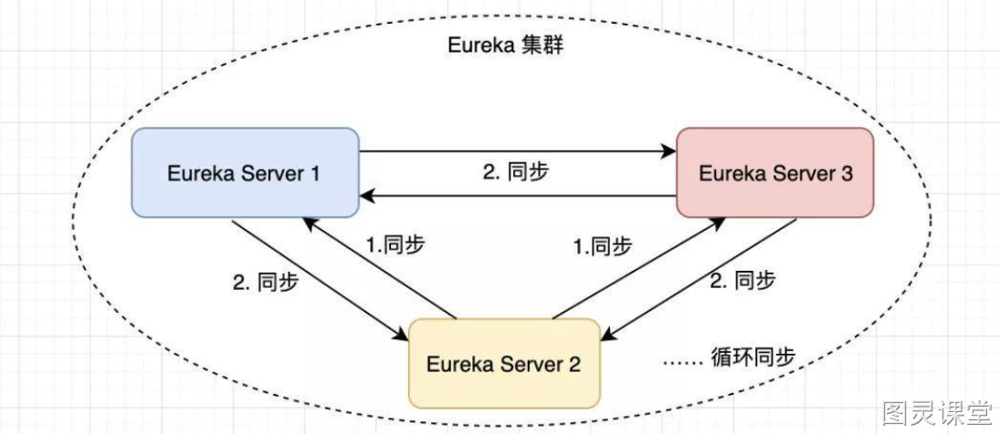

1. 多实例部署: 通过将多个Eureka Server实例部署在不同的节点上，可以实现高可用性。当其中一个实例发生故障时，其他实例仍然可以提供服务，并保持注册信息的一致性。
2. 服务注册信息的复制: 当一个服务实例向Eureka Server注册时，每个Eureka Server实例都会复制其他实例的注册信息，以保持数据的一致性。当某个Eureka Server实例发生故障时，其他实例可以接管其工作，保证整个系统的正常运行。
3. 自我保护机制: Eureka还具有自我保护机制。当Eureka Server节点在一定时间内没有接收到心跳时，它会进入自我保护模式。在自我保护模式下，Eureka Server不再剔除注册表中的服务实例，以保护现有的注册信息。这样可以防止由于网络抖动或其他原因导致的误剔除，进一步提高系统的稳定性。

# 配置中心

## 10.为什么微服务需要配置中心？
微服务架构中的每个服务通常都需要一些配置信息，例如数据库连接地址、服务端口、日志级别等。这些配置可能因为不同环境、不同部署实例或者动态运行时需要进行调整和管理。
微服务的实例一般非常多，如果每个实例都需要一个个地去做这些配置，那么运维成本将会非常大，这时候就需要一个集中化的配置中心，去管理这些配置。

## 11.SpringCloud可以选择哪些配置中心？
和注册中心一样，SpringCloud也支持对多种配置中心的集成。常见的配置中心选型包括：

1. Spring Cloud Config：官方推荐的配置中心，支持将配置文件存储在Git、SVN等版本控制系统中，并提供RESTful API进行访问和管理。
2. ZooKeeper：一个开源的分布式协调服务，可以用作配置中心。它具有高可用性、一致性和通知机制等特性。
3. Consul：另一个开源的分布式服务发现和配置管理工具，也可用作配置中心。支持多种配置文件格式，提供健康检查、故障转移和动态变更等功能。
4. Etcd：一个分布式键值存储系统，可用作配置中心。它使用基于Raft算法的一致性机制，提供分布式数据一致性保证。
5. Apollo：携程开源的配置中心，支持多种语言和框架。提供细粒度的配置权限管理、配置变更通知和灰度发布等高级特性，还有可视化的配置管理界面。
6. Nacos：阿里巴巴开源的服务发现、配置管理和服务管理平台，也可以作为配置中心使用。支持服务注册与发现、动态配置管理、服务健康监测和动态DNS服务等功能。

## 12.Nacos配置中心的原理了解吗？
配置中心，说白了就是一句话：配置信息的CRUD。
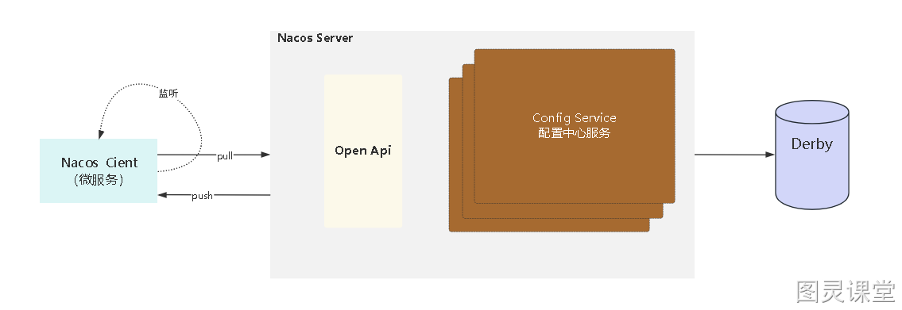
配置中心
具体的实现大概可以分成这么几个部分：

1. 配置信息存储：Nacos默认使用内嵌数据库Derby来存储配置信息，还可以采用MySQL等关系型数据库。
2. 注册配置信息：服务启动时，Nacos Client会向Nacos Server注册自己的配置信息，这个注册过程就是把配置信息写入存储，并生成版本号。
3. 获取配置信息：服务运行期间，Nacos Client通过API从Nacos Server获取配置信息。Server根据键查找对应的配置信息，并返回给Client。
4. 监听配置变化：Nacos Client可以通过注册监听器的方式，实现对配置信息的监听。当配置信息发生变化时，Nacos Server会通知已注册的监听器，并触发相应的回调方法。

## 13.Nacos配置中心长轮询机制？
一般来说客户端和服务端的交互分为两种：推（Push）和拉（Pull），Nacos在Pull的基础上，采用了长轮询来进行配置的动态刷新。
在长轮询模式下，客户端定时向服务端发起请求，检查配置信息是否发生变更。如果没有变更，服务端会"hold"住这个请求，即暂时不返回结果，直到配置发生变化或达到一定的超时时间。
具体的实现过程如下：
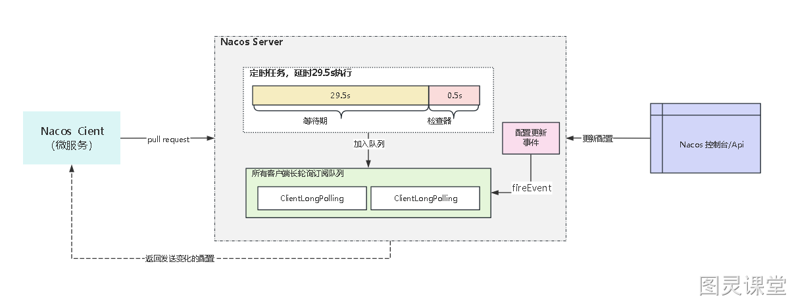

Nacos长轮询

- 如果客户端发起 **Pull** 请求，服务端收到请求之后，先检查配置是否发生了变更： 
- **变更**：返回变更配置；
- **无变更**：设置一个定时任务，延期 29.5s 执行，把当前的客户端长轮询连接加入 allSubs 队列；
- 在这 29.5s 内的配置变化： 
- **配置无变化**：等待 29.5s 后触发自动检查机制，返回配置；
- **配置变化**：在 29.5s 内任意一个时刻配置变化，会触发一个事件机制，监听到该事件的任务会遍历 allSubs 队列，找到发生变更的配置项对应的 ClientLongPolling 任务，将变更的数据通过该任务中的连接进行返回。相当于完成了一次 **PUSH** 操作；
- 长轮询机制结合了 **Pull** 机制和 **Push** 机制的优点；

通过长轮询的方式，Nacos客户端能够实时感知配置的变化，并及时获取最新的配置信息。同时，这种方式也降低了服务端的压力，避免了大量的长连接占用内存资源。

# 远程调用

## 14.能说下HTTP和RPC的区别吗？
严格来讲，HTTP和不是一个层面的东西：
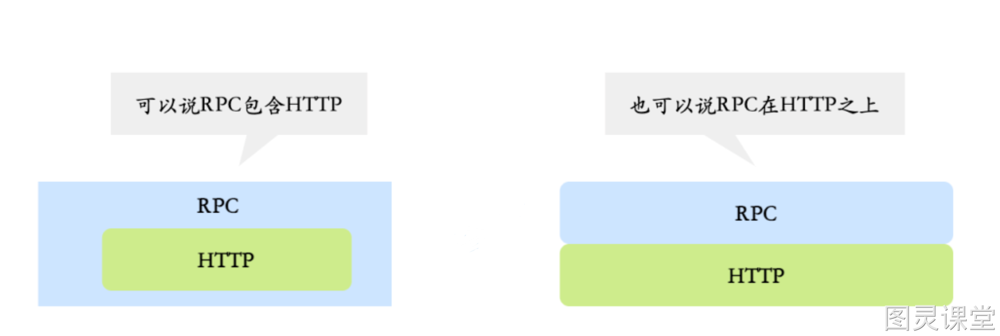
HTTP和RPC

- HTTP（Hypertext Transfer Protocol）是一种应用层协议，主要强调的是网络通信；
- RPC（Remote Procedure Call，远程过程调用）是一种用于分布式系统之间通信的协议，强调的是服务之间的远程调用。

一些RPC框架比如gRPC，底层传输协议其实也是用的HTTP2，包括Dubbo3，也兼容了gRPC，使用了HTTP2作为传输层的一层协议。
如果硬要说区别的话，如下：

| HTTP | RPC | 

 |
| --- | --- | --- |
| 定义 | HTTP（超文本传输协议）是一种用于传输超文本的协议。 | RPC（远程过程调用）是一种用于实现分布式系统中不同节点之间通信的协议。 |
| 通信方式 | 基于请求-响应模型，客户端发送请求，服务器返回响应。 | 基于方法调用模型，客户端调用远程方法并等待结果。 |
| 传输协议 | 基于TCP协议，可使用其他传输层协议如TLS/SSL进行安全加密。 | 可以使用多种传输协议，如TCP、UDP等。 |
| 数据格式 | 基于文本，常用的数据格式有JSON、XML等。 | 可以使用各种数据格式，如二进制、JSON、Protocol Buffers等。 |
| 接口定义 | 使用RESTful风格的接口进行定义，常用的方法有GET、POST、PUT、DELETE等。 | 使用IDL（接口定义语言）进行接口定义，如Protocol Buffers、Thrift等。 |
| 跨语言性 | 支持跨语言通信，可以使用HTTP作为通信协议实现不同语言之间的通信。 | 支持跨语言通信，可以使用IDL生成不同语言的客户端和服务端代码。 |
| 灵活性 | 更加灵活，适用于不同类型的应用场景，如Web开发、API调用等。 | 更加高效，适用于需要高性能和低延迟的分布式系统。 |

在微服务体系里，基于HTTP风格的远程调用通常使用框架如Feign来实现，基于RPC的远程调用通常使用框架如Dubbo来实现。

## 15.那Feign和Dubbo的区别呢？
这两个才是适合拿来比较的东西：

| 

 | Feign | Dubbo |
| --- | --- | --- |
| 定义 | Feign是一个声明式的Web服务客户端，用于简化HTTP API的调用。 | Dubbo是一个分布式服务框架，用于构建面向服务的微服务架构。 |
| 通信方式 | 基于HTTP协议，使用RESTful风格的接口进行定义和调用。 | 基于RPC协议，支持多种序列化协议如gRPC、Hessian等。 |
| 服务发现 | 通常结合服务注册中心（如Eureka、Consul）进行服务发现和负载均衡。 | 通过ZooKeeper、Nacos等进行服务注册和发现，并提供负载均衡功能。 |
| 服务治理 | 不直接提供服务治理功能，需要结合其他组件或框架进行服务治理。 | 提供服务注册与发现、负载均衡、容错机制、服务降级等服务治理功能。 |
| 跨语言性 | 支持跨语言通信，可以使用HTTP作为通信协议实现不同语言之间的通信。 | 支持跨语言通信，通过Dubbo的IDL生成不同语言的客户端和服务端代码。 |
| 生态系统 | 集成了Spring Cloud生态系统，与Spring Boot无缝集成。 | 拥有完整的生态系统，包括注册中心、配置中心、监控中心等组件。 |
| 适用场景 | 适用于构建RESTful风格的微服务架构，特别适合基于HTTP的微服务调用。 | 适用于构建面向服务的微服务架构，提供更全面的服务治理和容错机制。 |

需要注意的是，Feign和Dubbo并不是互斥的关系。实际上，Dubbo可以使用HTTP协议作为通信方式，而Feign也可以集成RPC协议进行远程调用。选择使用哪种远程调用方式取决于具体的业务需求和技术栈的选择。

## 服务端负载均衡器和客户端负载均衡器的区别
服务端负载均衡器和客户端负载均衡器的区别如下图所示：
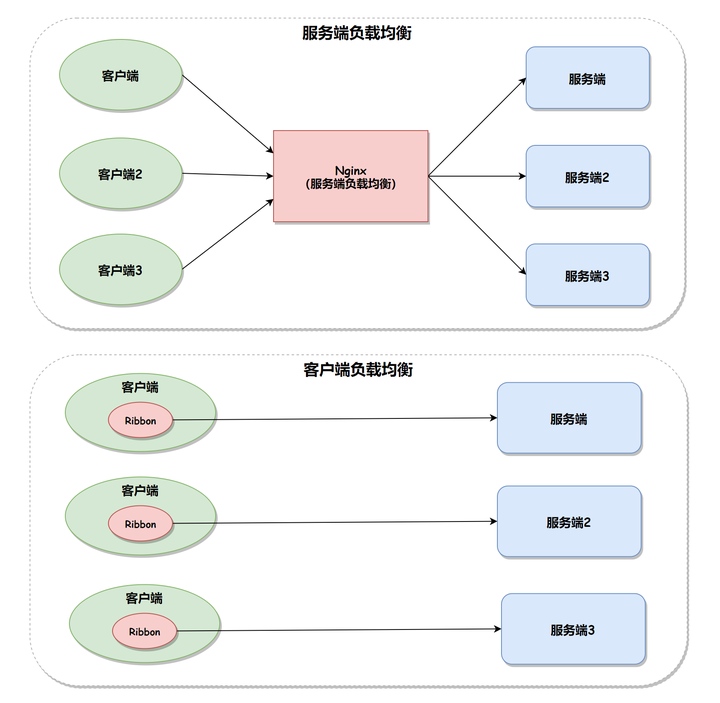
客户端负载均衡器的实现原理是通过注册中心，如 Nacos，将可用的服务列表拉取到本地（客户端），再通过客户端负载均衡器（设置的负载均衡策略）获取到某个服务器的具体 ip 和端口，然后再通过 Http 框架请求服务并得到结果，其执行流程如下图所示：

## 16.说一下Feign?
Feign是一个声明式的Web服务客户端，它简化了使用基于HTTP的远程服务的开发。
Feign是在RestTemplate 和 Ribbon的基础上进一步封装，使用RestTemplate实现Http调用，使用Ribbon实现负载均衡。
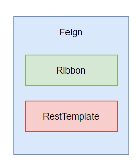
 
Feign封装
Feign的主要特点和功能包括：

1. 声明式API：Feign允许开发者使用简单的注解来定义和描述对远程服务的访问。通过使用注解，开发者可以轻松地指定URL、HTTP方法、请求参数、请求头等信息，使得远程调用变得非常直观和易于理解。
```
@FeignClient(name = "example", url = "https://api.example.com")
public interface ExampleService {
    @GetMapping("/endpoint")
    String getEndpointData();
}
```

1. 集成负载均衡：Feign集成了Ribbon负载均衡器，可以自动实现客户端的负载均衡。它可以根据服务名和可用实例进行动态路由，并分发请求到不同的服务实例上，提高系统的可用性和可伸缩性。
2. 容错机制：Feign支持集成Hystrix容错框架，可以在调用远程服务时提供容错和断路器功能。当远程服务不可用或响应时间过长时，Feign可以快速失败并返回预设的响应结果，避免对整个系统造成级联故障。

## 17.为什么Feign第一次调用耗时很长？
主要原因是由于Ribbon的懒加载机制，当第一次调用发生时，Feign会触发Ribbon的加载过程，包括从服务注册中心获取服务列表、建立连接池等操作，这个加载过程会增加首次调用的耗时。
```
ribbon:
  eager-load:
    enabled: true
      clients: service-1
```
那怎么解决这个问题呢？
可以在应用启动时预热Feign客户端，自动触发一次无关紧要的调用，来提前加载Ribbon和其他相关组件。这样，就相当于提前进行了第一次调用。

## 18.Feign怎么实现认证传递？
比较常见的一个做法是，使用拦截器传递认证信息。可以通过实现RequestInterceptor接口来定义拦截器，在拦截器里，把认证信息添加到请求头中，然后将其注册到Feign的配置中。
```
@Configuration
public class FeignClientConfig {

    @Bean
    public RequestInterceptor requestInterceptor() {
        return new RequestInterceptor() {
            @Override
            public void apply(RequestTemplate template) {
                // 添加认证信息到请求头中
                template.header("Authorization", "Bearer " + getToken());
            }
        };
    }

    private String getToken() {
        // 获取认证信息的逻辑，可以从SecurityContext或其他地方获取
        // 返回认证信息的字符串形式
        return "your_token";
    }
}
```

## 19.Fegin怎么做负载均衡？Ribbon?
在Feign中，负载均衡是通过集成Ribbon来实现的。
Ribbon是Netflix开源的一个客户端负载均衡器，可以与Feign无缝集成，为Feign提供负载均衡的能力。
  Ribbon在发起请求前，会从“服务中心”获取服务列表（清单），然后按照一定的负载均衡策略去发起请求，从而实现客户端的负载均衡。Ribbon本身也维护着“服务提供者”清单的有效性。如果它发现“服务提供者”不可用，则会重新从“服务中心”获取有效的“服务提供者”清单来及时更新。
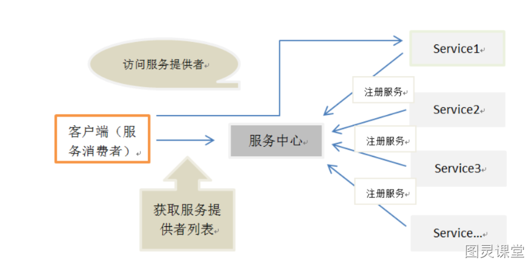
客户端负载均衡

## 20.说说有哪些负载均衡算法？
常见的负载均衡算法包含以下几种：

常见负载均衡算法

1. **轮询算法（Round Robin）**：轮询算法是最简单的负载均衡算法之一。它按照顺序将请求依次分配给每个后端服务器，循环往复。当请求到达时，负载均衡器按照事先定义的顺序选择下一个服务器。轮询算法适用于后端服务器具有相同的处理能力和性能的场景。
2. **加权轮询算法（Weighted Round Robin）**：加权轮询算法在轮询算法的基础上增加了权重的概念。每个后端服务器都被赋予一个权重值，权重值越高，被选中的概率就越大。这样可以根据服务器的处理能力和性能调整请求的分配比例，使得性能较高的服务器能够处理更多的请求。
3. **随机算法（Random）**：随机算法将请求随机分配给后端服务器。每个后端服务器有相等的被选中概率，没有考虑服务器的实际负载情况。这种算法简单快速，适用于后端服务器性能相近且无需考虑请求处理能力的场景。
4. **加权随机算法（Weighted Random）**：加权随机算法在随机算法的基础上引入了权重的概念。每个后端服务器被赋予一个权重值，权重值越高，被选中的概率就越大。这样可以根据服务器的处理能力和性能调整请求的分配比例。
5. **最少连接算法（Least Connection）**：最少连接算法会根据后端服务器当前的连接数来决定请求的分配。负载均衡器会选择当前连接数最少的服务器进行请求分配，以保证后端服务器的负载均衡。这种算法适用于后端服务器的处理能力不同或者请求的处理时间不同的场景。
6. **哈希算法（Hash）**：哈希算法会根据请求的某个特定属性（如客户端IP地址、请求URL等）计算哈希值，然后根据哈希值选择相应的后端服务器。

常见的负载均衡器，比如Ribbion、Gateway等等，基本都支持这些负载均衡算法。
关于Dubbo，后面会单独出一期。

# 服务容灾

## 21.什么是服务雪崩？
在微服务中，假如一个或者多个服务出现故障，如果这时候，依赖的服务还在不断发起请求，或者重试，那么这些请求的压力会不断在下游堆积，导致下游服务的负载急剧增加。不断累计之下，可能会导致故障的进一步加剧，可能会导致级联式的失败，甚至导致整个系统崩溃，这就叫服务雪崩。
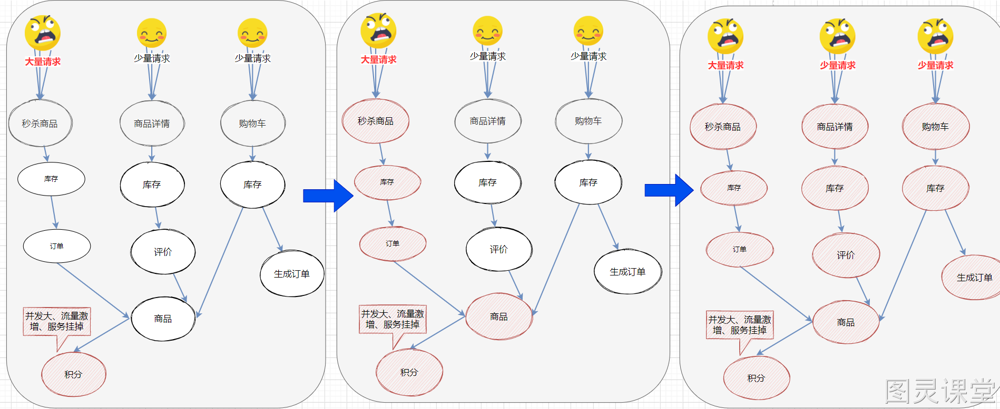
服务雪崩
一般，为了防止服务雪崩，可以采用这些措施：

1. 服务高可用部署：确保各个服务都具备高可用性，通过冗余部署、故障转移等方式来减少单点故障的影响。
2. 限流和熔断：对服务之间的请求进行限流和熔断，以防止过多的请求涌入导致后端服务不可用。
3. 缓存和降级：合理使用缓存来减轻后端服务的负载压力，并在必要时进行服务降级，保证核心功能的可用性。

## 22.什么是服务熔断？什么是服务降级？

### 什么是服务熔断？
服务熔断是微服务架构中的容错机制，用于保护系统免受服务故障或异常的影响。当某个服务出现故障或异常时，服务熔断可以快速隔离该服务，确保系统稳定可用。
它通过监控服务的调用情况，当错误率或响应时间超过阈值时，触发熔断机制，后续请求将返回默认值或错误信息，避免资源浪费和系统崩溃。
服务熔断还支持自动恢复，重新尝试对故障服务的请求，确保服务恢复正常后继续使用。

### 什么是服务降级？
服务降级是也是一种微服务架构中的容错机制，用于在系统资源紧张或服务故障时保证核心功能的可用性。
当系统出现异常情况时，服务降级会主动屏蔽一些非核心或可选的功能，而只提供最基本的功能，以确保系统的稳定运行。通过减少对资源的依赖，服务降级可以保证系统的可用性和性能。
它可以根据业务需求和系统状况来制定策略，例如替换耗时操作、返回默认响应、返回静态错误页面等。

### 有哪些熔断降级方案实现？
目前常见的服务熔断降级实现方案有这么几种：

| 框架 | 实现方案 | 特点 |
| --- | --- | --- |
| Spring Cloud | Netflix Hystrix | - 提供线程隔离、服务降级、请求缓存、请求合并等功能
- 可与Spring Cloud其他组件无缝集成
- 官方已宣布停止维护，推荐使用Resilience4j代替 |
| Spring Cloud | Resilience4j | - 轻量级服务熔断库
- 提供类似于Hystrix的功能
- 具有更好的性能和更简洁的API
- 可与Spring Cloud其他组件无缝集成 |
| Spring Cloud Alibaba | Sentinel | - 阿里巴巴开源的流量控制和熔断降级组件
- 提供实时监控、流量控制、熔断降级等功能
- 与Spring Cloud Alibaba生态系统紧密集成 |
| Dubbo | Dubbo自带熔断降级机制 | - Dubbo框架本身提供的熔断降级机制
- 可通过配置实现服务熔断和降级
- 与Dubbo的RPC框架紧密集成 |


## 23.Hystrix怎么实现服务容错？
尽管已经不再更新，但是Hystrix是非常经典的服务容错开源库，它提供了多种机制来保护系统：
Hystrix服务容错六大机制

1. 服务熔断（Circuit Breaker）：Hystrix通过设置阈值来监控服务的错误率或响应时间。当错误率或响应时间超过预设的阈值时，熔断器将会打开，后续的请求将不再发送到实际的服务提供方，而是返回预设的默认值或错误信息。这样可以快速隔离故障服务，防止故障扩散，提高系统的稳定性和可用性。
2. 服务降级（Fallback）：当服务熔断打开时，Hystrix可以提供一个备用的降级方法或返回默认值，以保证系统继续正常运行。开发者可以定义降级逻辑，例如返回缓存数据、执行简化的逻辑或调用其他可靠的服务，以提供有限但可用的功能。
```
import com.netflix.hystrix.contrib.javanica.annotation.HystrixCommand;

/**
* 服务降级示例
**/
@Service
public class MyService {

    @HystrixCommand(fallbackMethod = "fallbackMethod")
    public String myServiceMethod() {
        // 实际的服务调用逻辑
        // ...
    }

    public String fallbackMethod() {
        // 降级方法的逻辑，当服务调用失败时会执行此方法
        // 可以返回默认值或执行其他备用逻辑
        // ...
    }
}
```

3. 请求缓存（Request Caching）：Hystrix可以缓存对同一请求的响应结果，当下次请求相同的数据时，直接从缓存中获取，避免重复的网络请求，提高系统的性能和响应速度。
4. 请求合并（Request Collapsing）：Hystrix可 以将多个并发的请求合并为一个批量请求，减少网络开销和资源占用。这对于一些高并发的场景可以有效地减少请求次数，提高系统的性能。
5. 实时监控和度量（Real-time Monitoring and Metrics）：Hystrix提供了实时监控和度量功能，可以对服务的执行情况进行监控和统计，包括错误率、响应时间、并发量等指标。通过监控数据，可以及时发现和解决服务故障或性能问题。
6. 线程池隔离（Thread Pool Isolation）：Hystrix将每个依赖服务的请求都放在独立的线程池中执行，避免因某个服务的故障导致整个系统的线程资源耗尽。通过线程池隔离，可以提高系统的稳定性和可用性。

## 24.Sentinel怎么实现限流的？
Sentinel通过动态管理限流规则，根据定义的规则对请求进行限流控制。具体实现步骤如下：

1. 定义资源：在Sentinel中，资源可以是URL、方法等，用于标识需要进行限流的请求。
```
// 原本的业务方法.
@SentinelResource(blockHandler = "blockHandlerForGetUser")
public User getUserById(String id) {
    throw new RuntimeException("getUserById command failed");
}

// blockHandler 函数，原方法调用被限流/降级/系统保护的时候调用
public User blockHandlerForGetUser(String id, BlockException ex) {
    return new User("admin");
}
```

1. 配置限流规则：在Sentinel的配置文件中定义资源的限流规则。规则可以包括资源名称、限流阈值、限流模式（令牌桶或漏桶）等。
```
private static void initFlowQpsRule() {
    List<FlowRule> rules = new ArrayList<>();   
    FlowRule rule1 = new FlowRule();  // 创建一个流控规则
    rule1.setResource(resource);   // 设置要限流的资源名称
    rule1.setCount(20);  // 设置最大 QPS 为 20
    rule1.setGrade(RuleConstant.FLOW_GRADE_QPS);  // 设置限流的维度为 QPS
    rule1.setLimitApp("default");  // 设置限制的应用名称为 "default"
    rules.add(rule1);  // 将规则添加到规则列表中
    FlowRuleManager.loadRules(rules);  // 加载规则列表，使限流规则生效
}
```

1. 监控流量：Sentinel会监控每个资源的流量情况，包括请求的QPS（每秒请求数）、线程数、响应时间等。

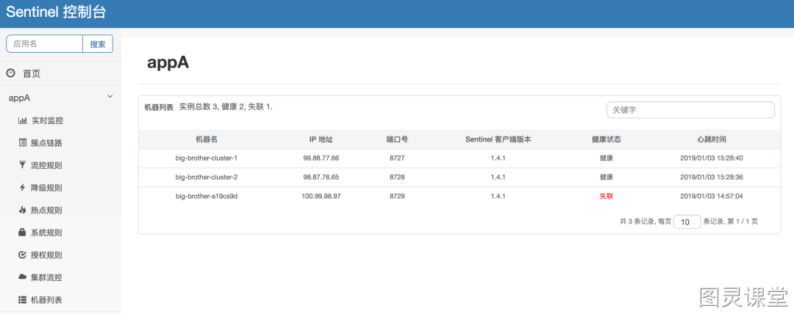
Sentinel控制台

1. 限流控制：当请求到达时，Sentinel会根据资源的限流规则判断是否需要进行限流控制。如果请求超过了限流阈值，则可以进行限制、拒绝或进行其他降级处理。

### Sentinel采用的什么限流算法？
Sentinel使用滑动窗口限流算法来实现限流。
滑动窗口限流算法是一种基于时间窗口的限流算法。它将一段时间划分为多个时间窗口，并在每个时间窗口内统计请求的数量。通过动态地调整时间窗口的大小和滑动步长，可以更精确地控制请求的通过速率。

### Sentinel怎么实现集群限流？
Sentinel利用了Token Server和Token Client的机制来实现集群限流。
开启集群限流后，Client向Token Server发送请求，Token Server根据配置的规则决定是否限流。
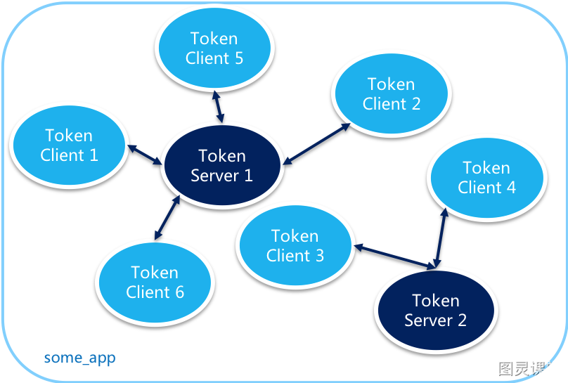
Token Server和Client

# 服务网关

## 25.什么是API网关？
API网关（API Gateway）是一种中间层服务器，用于集中管理、保护和路由对后端服务的访问。它充当了客户端与后端服务之间的入口点，提供了一组统一的接口来管理和控制API的访问。
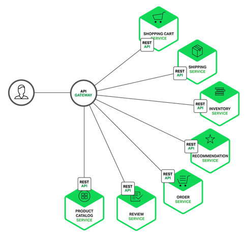
网关示意图
API网关的主要功能包括：

1. 路由转发：API网关根据请求的URL路径或其他标识，将请求路由到相应的后端服务。通过配置路由规则，可以灵活地将请求分发给不同的后端服务。
2. 负载均衡：API网关可以在后端服务之间实现负载均衡，将请求平均分发到多个实例上，提高系统的吞吐量和可扩展性。
3. 安全认证与授权：API网关可以集中处理身份验证和授权，确保只有经过身份验证的客户端才能访问后端服务。它可以与身份提供者（如OAuth、OpenID Connect）集成，进行用户认证和授权操作。
4. 缓存：API网关可以缓存后端服务的响应，减少对后端服务的请求次数，提高系统性能和响应速度。
5. 监控与日志：API网关可以收集和记录请求的指标和日志，提供实时监控和分析，帮助开发人员和运维人员进行故障排查和性能优化。
6. 数据转换与协议转换：API网关可以在客户端和后端服务之间进行数据格式转换和协议转换，如将请求从HTTP转换为WebSocket，或将请求的参数进行格式转换，以满足后端服务的需求。
7. API版本管理：API网关可以管理不同版本的API，允许同时存在多个API版本，并通过路由规则将请求正确地路由到相应的API版本上。

……
通过使用API网关，可以简化前端与后端服务的交互，提供统一的接口和安全性保障，同时也方便了服务治理和监控。它是构建微服务架构和实现API管理的重要组件之一。

## 26.SpringCloud可以选择哪些API网关？
使用SpringCloud开发，可以采用以下的API网关选型：

1. Netflix Zuul（已停止更新）：Netflix Zuul是Spring Cloud早期版本中提供的默认API网关。它基于Servlet技术栈，可以进行路由、过滤、负载均衡等功能。然而，自2020年12月起，Netflix宣布停止对Zuul 1的维护，转而支持新的API网关项目。
2. Spring Cloud Gateway：Spring Cloud Gateway是Spring Cloud官方推荐的API网关，取代了Netflix Zuul。它基于非阻塞的WebFlux框架，充分利用了响应式编程的优势，并提供了路由、过滤、断路器、限流等特性。Spring Cloud Gateway还支持与Spring Cloud的其他组件集成，如服务发现、负载均衡等。
3. Kong：Kong是一个独立的、云原生的API网关和服务管理平台，可以与Spring Cloud集成。Kong基于Nginx，提供了强大的路由、认证、授权、监控和扩展能力。它支持多种插件和扩展，可满足不同的API管理需求。
4. APISIX：APISIX基于Nginx和Lua开发，它具有强大的路由、流量控制、插件扩展等功能。APISIX支持灵活的配置方式，可以根据需求进行动态路由、负载均衡和限流等操作。

……

## 27.Spring Cloud Gateway核心概念？
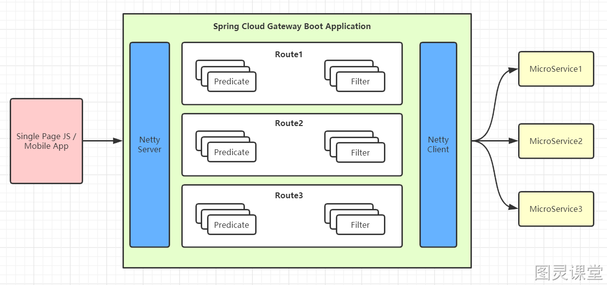
Gateway原理
在Spring Cloud Gateway里，有三个关键组件：

- **Route（路由）**：路由是Spring Cloud Gateway的基本构建块，它定义了请求的匹配规则和转发目标。通过配置路由，可以将请求映射到后端的服务实例或URL上。路由规则可以根据请求的路径、方法、请求头等条件进行匹配，并指定转发的目标URI。
- **Predicate（断言）**：断言用于匹配请求的条件，如果请求满足断言的条件，则会应用所配置的过滤器。Spring Cloud Gateway提供了多种内置的断言，如Path（路径匹配）、Method（请求方法匹配）、Header（请求头匹配）等，同时也支持自定义断言。
- **Filter（过滤器）**：过滤器用于对请求进行处理和转换，可以修改请求、响应以及执行其他自定义逻辑。Spring Cloud Gateway提供了多个内置的过滤器，如请求转发、请求重试、请求限流等。同时也支持自定义过滤器，可以根据需求编写自己的过滤器逻辑。

我们再来看下Spring Cloud Gateway的具体工作流程：
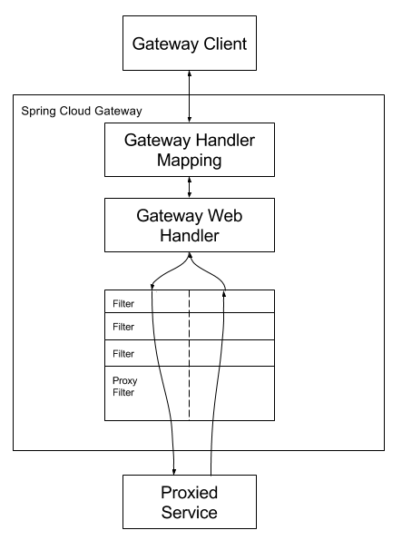
SpringCloud工作流程图-来源官方文档
又有两个比较重要的概念：

- **Gateway Handler（网关处理器）**：网关处理器是Spring Cloud Gateway的核心组件，负责将请求转发到匹配的路由上。它根据路由配置和断言条件进行路由匹配，选择合适的路由进行请求转发。网关处理器还会依次应用配置的过滤器链，对请求进行处理和转换。
- **Gateway Filter Chain（网关过滤器链）**：网关过滤器链由一系列过滤器组成，按照配置的顺序依次执行。每个过滤器可以在请求前、请求后或请求发生错误时进行处理。过滤器链的执行过程可以修改请求、响应以及执行其他自定义逻辑。

# 链路追踪

## 28.为什么要用微服务链路追踪？
在微服务中，有的上下游可能有十几个服务，如果某一环出了问题，排查起来非常困难，所以，就需要进行链路追踪，来帮助排查问题。

SkyWalking界面
通过链路追踪，可以可视化地追踪请求从一个微服务到另一个微服务的调用情况。除了排查问题，链路追踪黑还可以帮助优化性能，可视化依赖关系、服务监控和告警。

## 29.SpringCloud可以选择哪些微服务链路追踪方案？
Spring Cloud提供了多种选择的微服务链路追踪方案。以下是一些常用的方案：

1. Zipkin：Zipkin 是一个开源的分布式实时追踪系统，由 Twitter 开发并贡献给开源社区。Spring Cloud Sleuth 提供了与 Zipkin 的集成，可以通过在微服务中添加相应的依赖和配置，将追踪信息发送到 Zipkin 服务器，并通过 Zipkin UI 进行可视化展示和查询。


Zipkin界面

1. Jaeger：Jaeger 是 Uber 开源的分布式追踪系统，也被纳入了 CNCF（云原生计算基金会）的维护。通过使用 Spring Cloud Sleuth 和 Jaeger 客户端库，可以将追踪信息发送到 Jaeger 并进行可视化展示和查询。
2. SkyWalking：Apache SkyWalking 是一款开源的应用性能监控与分析系统，提供了对 Java、.NET 和 Node.js 等语言的支持。它可以与 Spring Cloud Sleuth 集成，将追踪数据发送到 SkyWalking 服务器进行可视化展示和分析。

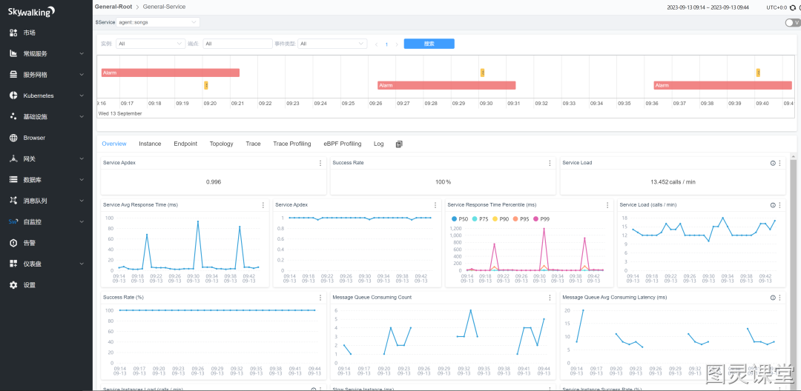
SkyWalking示例界面

1. Pinpoint：Pinpoint 是 Naver 开源的分布式应用性能监控系统，支持 Java 和 .NET。它提供了与 Spring Cloud Sleuth 的集成，可以将追踪数据发送到 Pinpoint 服务器，并通过其 UI 进行分析和监控。

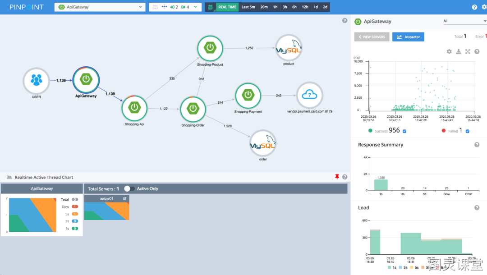
Pinpoint示意图
这些方案都可以与 Spring Cloud Sleuth 进行集成，Spring Cloud Sleuth 是 Spring Cloud 中的一个组件，提供了在微服务调用时生成追踪信息的能力。

# 分布式事务
分布式事务可以查看前面的分布式基础篇。

## 30.Seata支持哪些模式的分布式事务？
Seata以下几种模式的分布式事务：

1. AT（Atomikos）模式：AT模式是Seata默认支持的模式，也是最常用的模式之一。在AT模式下，Seata通过在业务代码中嵌入事务上下文，实现对分布式事务的管理。Seata会拦截并解析业务代码中的SQL语句，通过对数据库连接进行拦截和代理，实现事务的管理和协调。


AT模式示意图

1. TCC（Try-Confirm-Cancel）模式：TCC模式是一种基于补偿机制的分布式事务模式。在TCC模式中，业务逻辑需要实现Try、Confirm和Cancel三个阶段的操作。Seata通过调用业务代码中的Try、Confirm和Cancel方法，并在每个阶段记录相关的操作日志，来实现分布式事务的一致性。

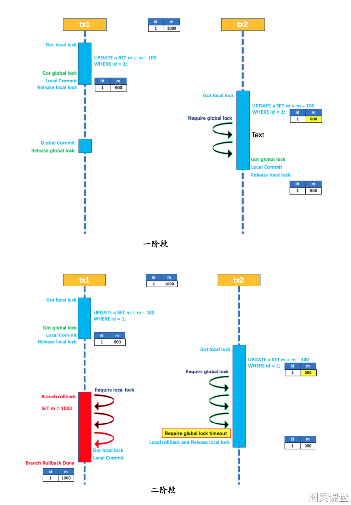
Seata TCC模式

1. SAGA模式：SAGA模式是一种基于事件驱动的分布式事务模式。在SAGA模式中，每个服务都可以发布和订阅事件，通过事件的传递和处理来实现分布式事务的一致性。Seata提供了与SAGA模式兼容的Saga框架，用于管理和协调分布式事务的各个阶段。

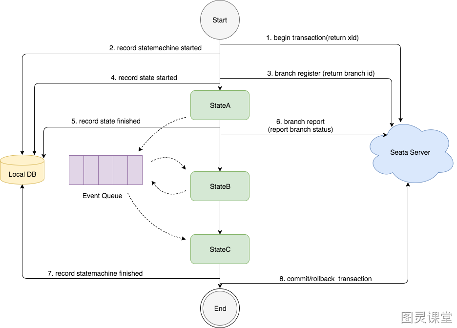
SAGA模式状态机引擎

1. XA模式：XA模式是一种基于两阶段提交（Two-Phase Commit）协议的分布式事务模式。在XA模式中，Seata通过与数据库的XA事务协议进行交互，实现对分布式事务的管理和协调。XA模式需要数据库本身支持XA事务，并且需要在应用程序中配置相应的XA数据源。


XA模式示意图

## 31.了解Seata的实现原理吗？
Seata的实现原理主要包括三个核心组件：事务协调器（Transaction Coordinator）、事务管理器（Transaction Manager）和资源管理器（Resource Manager）。

- **事务协调器（Transaction Coordinator）**：事务协调器负责协调和管理分布式事务的整个过程。它接收事务的开始和结束请求，并根据事务的状态进行协调和处理。事务协调器还负责记录和管理事务的全局事务 ID（Global Transaction ID）和分支事务 ID（Branch Transaction ID）。
- **事务管理器（Transaction Manager）**：事务管理器负责全局事务的管理和控制。它协调各个分支事务的提交或回滚，并保证分布式事务的一致性和隔离性。事务管理器还负责与事务协调器进行通信，并将事务的状态变更进行持久化。
- **资源管理器（Resource Manager）**：资源管理器负责管理和控制各个参与者（Participant）的事务操作。它与事务管理器进行通信，并根据事务管理器的指令执行相应的事务操作，包括提交和回滚。

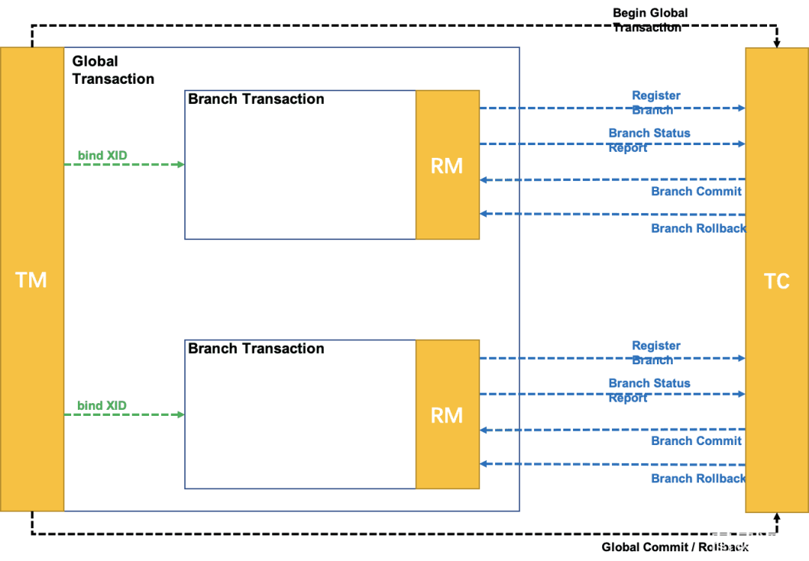
Seata领域模型
Seata的实现原理基于**两阶段提交（Two-Phase Commit）协议**，具体的机制如下：

1. 一阶段：在事务提交的过程中，首先进行预提交阶段。事务协调器向各个资源管理器发送预提交请求，资源管理器执行相应的事务操作并返回执行结果。在此阶段，业务数据和回滚日志记录在同一个本地事务中提交，并释放本地锁和连接资源。
2. 二阶段：在预提交阶段成功后，进入真正的提交阶段。此阶段主要包括提交异步化和回滚反向补偿两个步骤：
   - 提交异步化：事务协调器发出真正的提交请求，各个资源管理器执行最终的提交操作。这个阶段的操作是非常快速的，以确保事务的提交效率。
   - 回滚反向补偿：如果在预提交阶段中有任何一个资源管理器返回失败结果，事务协调器发出回滚请求，各个资源管理器执行回滚操作，利用一阶段的回滚日志进行反向补偿。

### Seata的事务执行流程是什么样的？
Seata事务的执行流程可以简要概括为以下几个步骤：

1. 事务发起方（Transaction Starter）发起全局事务：事务发起方是指发起分布式事务的应用程序或服务。它向Seata的事务协调器发送全局事务的开始请求，生成全局事务ID（Global Transaction ID）。
2. 事务协调器创建全局事务记录：事务协调器接收到全局事务的开始请求后，会为该事务创建相应的全局事务记录，并生成分支事务ID（Branch Transaction ID）。
3. 分支事务注册：事务发起方将全局事务ID和分支事务ID发送给各个参与者（Participant），即资源管理器。参与者将分支事务ID注册到本地事务管理器，并将事务的执行结果反馈给事务协调器。
4. 执行业务逻辑：在分布式事务的上下文中，各个参与者执行各自的本地事务，即执行业务逻辑和数据库操作。
5. 预提交阶段：事务发起方向事务协调器发送预提交请求，事务协调器将预提交请求发送给各个参与者。
6. 执行本地事务确认：参与者接收到预提交请求后，执行本地事务的确认操作，并将本地事务的执行结果反馈给事务协调器。
7. 全局事务提交或回滚：事务协调器根据参与者反馈的结果进行判断，如果所有参与者的本地事务都执行成功，事务协调器发送真正的提交请求给参与者，参与者执行最终的提交操作；如果有任何一个参与者的本地事务执行失败，事务协调器发送回滚请求给参与者，参与者执行回滚操作。
8. 完成全局事务：事务协调器接收到参与者的提交或回滚结果后，根据结果更新全局事务的状态，并通知事务发起方全局事务的最终结果。

### 全局事务ID和分支事务ID是怎么传递的？
全局事务ID和分支事务ID在分布式事务中通过上下文传递的方式进行传递。常见的传递方式包括参数传递、线程上下文传递和消息中间件传递。具体的传递方式可以根据业务场景和技术选型进行选择和调整。

### Seata的事务回滚是怎么实现的？

事务日志记录
Seata的事务回滚是通过回滚日志实现的。每个参与者在执行本地事务期间生成回滚日志，记录了对数据的修改操作。
当需要回滚事务时，事务协调器向参与者发送回滚请求，参与者根据回滚日志中的信息执行撤销操作，将数据恢复到事务开始前的状态。
回滚日志的管理和存储是Seata的核心机制，可以选择将日志存储在不同的介质中。通过回滚日志的持久化和恢复，Seata确保了事务的一致性和恢复性。

# 服务监控

## 32.你们的服务怎么做监控和告警？
我们使用Prometheus和Grafana来实现整个微服务集群的监控和告警：

1. Prometheus：Prometheus 是一个开源的监控系统，具有灵活的数据模型和强大的查询语言，能够收集和存储时间序列数据。它可以通过HTTP协议定期拉取微服务的指标数据，并提供可扩展的存储和查询功能。
2. Grafana：Grafana 是一个开源的可视化仪表板工具，可以与 Prometheus 结合使用，创建实时和历史数据的仪表板。Grafana 提供了丰富的图表和可视化选项，可以帮助用户更好地理解和分析微服务的性能和状态。

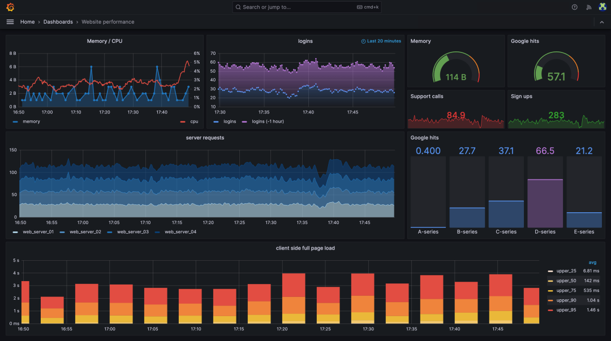
Dashboard

## 33.你们的服务怎么做日志收集？
日志收集有很多种方案，我们用的是ELK：

- **Elasticsearch**：Elasticsearch是一个分布式搜索和分析引擎，用于存储和索引大量的日志数据。它提供了快速的搜索和聚合功能，可以高效地处理大规模的日志数据。
- **Logstash**：Logstash是一个用于收集、过滤和转发日志数据的工具。它可以从各种来源（如文件、网络、消息队列等）收集日志数据，并对数据进行处理和转换，然后将其发送到Elasticsearch进行存储和索引。
- **Kibana**：Kibana是一个用于日志数据可视化和分析的工具。它提供了丰富的图表、仪表盘和搜索功能，可以帮助用户实时监控和分析日志数据，发现潜在的问题和趋势。

简单说，这三者里**Elasticsearch**提供数据存储和检索能力，**Logstash**负责将日志收集到ES，**Kibana**负责日志数据的可视化分析。
使用ELK进行微服务日志收集的一般流程如下：
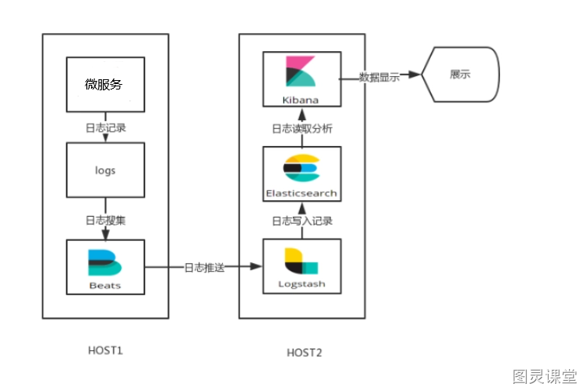
ELK流程

1. 在每个微服务中配置日志输出：将微服务的日志输出到标准输出（stdout）或日志文件。
2. 使用Logstash收集日志：配置Logstash收集器，通过配置输入插件（如文件输入、网络输入等）监听微服务的日志输出，并进行过滤和处理。
3. 将日志数据发送到Elasticsearch：配置Logstash的输出插件，将经过处理的日志数据发送到Elasticsearch进行存储和索引。
4. 使用Kibana进行可视化和分析：通过Kibana连接到Elasticsearch，创建仪表盘、图表和搜索查询，实时监控和分析微服务的日志数据。

除了应用最广泛的ELK，还有一些其它的方案比如Fluentd、Graylog、Loki、Filebeat，一些云厂商也提供了付费方案，比如阿里云的sls。


> 原文: <https://www.yuque.com/tulingzhouyu/db22bv/bc44no2mis8redbn>