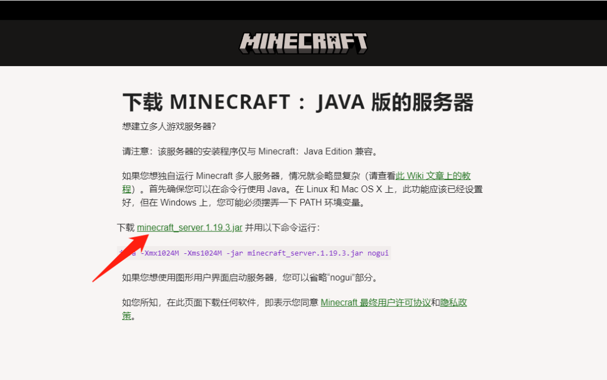
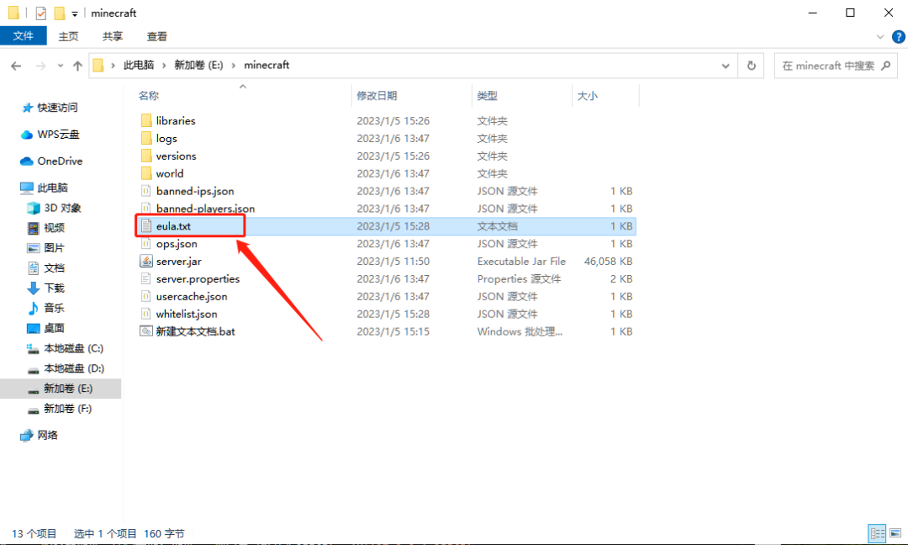
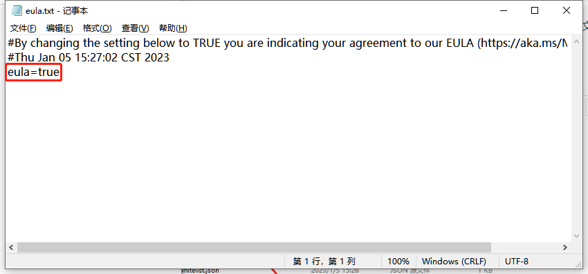
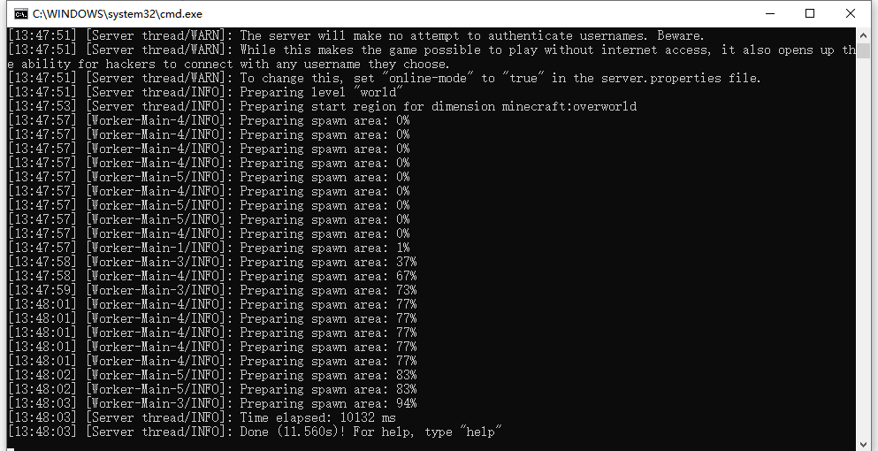
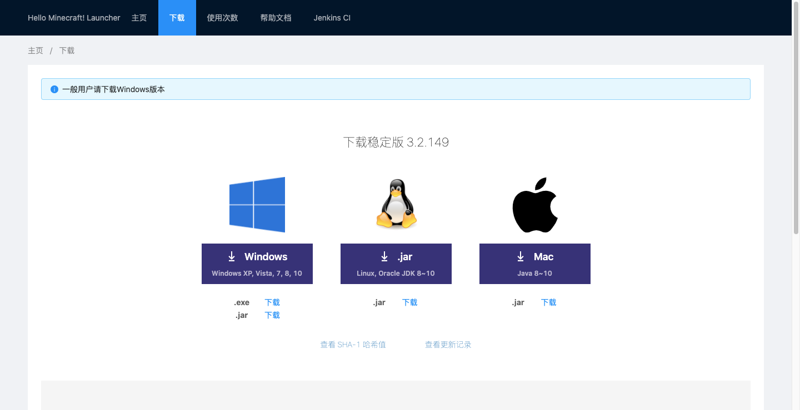

# 在自己的电脑上搭建我的世界Java版服务器

很多朋友，喜欢玩Minecraft，也希望搭建一个服务器，用于和小伙伴联机；
并且，拥有服务器后，即使所有玩家都下线，“世界”依旧在运行，玩家可以随时参与其中，说不定一上线，你的好友已经悄悄给你早了一个世界。
本次教程将在Windows本地搭建Java版的MC服务器，并用cpolar内网穿透突破局域网限制，实现在公网环境下跟小伙伴远程联机，超简单配置，无需公网IP，也不用设置路由器。
如果你的服务器已经搭建成功，并可以正常在局域网内联机，可以直接跳到第三步，在本地配置cpolar内网穿透，创建隧道映射25565端口，实现异地远程联机。

## 配置服务端
下载MC服务端，最新版的服务器端可以官网下载


### Minecraft服务器下载地址：

1. [Minecraft 官方版本：https://www.minecraft.net/zh-hans/download/server](https://www.minecraft.net/zh-hans/download/server)
2. [Minecraft Forge版本：http://files.minecraftforge.net/](http://files.minecraftforge.net/)
3. [Minecraft Spigot版本：https://www.spigotmc.org/](https://www.spigotmc.org/)
4. [Minecraft Farbic：http://fabricmc.net/](http://fabricmc.net/)
5. [城通网盘镜像站：https://url57.ctfile.com/d/26158157-38513858-513480；访问密码：6146](https://url57.ctfile.com/d/26158157-38513858-513480)
6. [博客镜像站：https://tool.mintimate.cn/data/Minecraft_Mirror](https://tool.mintimate.cn/data/Minecraft_Mirror)


## 运行服务端
```java
java -Xmx1500M -Xms512M -jar server.jar nogui
```
第一次启动以后，你会看到文件夹有多出来一些文件，找到eula.txt这个文件并打开，将eula=false改为eula=true，然后保存。


打开`server.properties`文件，做如下改动：`online-mode=false`（关闭正版验证），其他改动可以按照自己的喜好。至此服务器已经配置完毕，服务器的设置详情都在`server.properties`。再次执行服务端启动命令即可 。


## 客户端下载
我个人推荐用官方启动器或者HMCL启动器；其他第三方启动器，不好说，如果服务器建好，端口也放行，但是连接不上，建议用HMCL或者官方启动器。


### 下载地址

- 官方启动器：[https://minecraft.net/](https://minecraft.net/)
- HMCL启动器下载：[https://hmcl.huangyuhui.net/download](https://hmcl.huangyuhui.net/download)
- 官方和HMCL的公网有可能进不去，为提供镜像下载：[https://url57.ctfile.com/d/26158157-39233167-4af7b9](https://url57.ctfile.com/d/26158157-39233167-4af7b9)（访问密码：6146）

## 常见问题

### 登入失败:无效会话(请尝试重启游戏及启动器)
原因很简单：你并没有用Minecraft的正版账号登录。解决方法很简单：正版账号登录游戏或服务器关闭正版账号验证：将**online-mode:true**的true改为false，然后保存退出。

### 如何替换服务器上地图存档
如何替换服务器上的地图存档为自己本地的地图存档呢？其实很简单，将本地Minecraft的.minecraft内的saves内的地图文件，重命名为world，并上传到Minecraft目录内，替换掉原本的world文件并重启Minecraft服务器即可。你也可以直接上传到Minecraft根目录，然后修改server.properties内level-name字段后的world为你上次的存档文件夹。

### server.properties如何配置
server.properties文件如何配置呢？
大家感兴趣可以看看Minecraft的Wiki：[https://minecraft.fandom.com/zh/wiki/Server.properties?variant=zh](https://minecraft.fandom.com/zh/wiki/Server.properties?variant=zh)
修改后，记得重启MC服务器!!!


> 原文: <https://www.yuque.com/tulingzhouyu/db22bv/zctu2dzi2mdimegg>