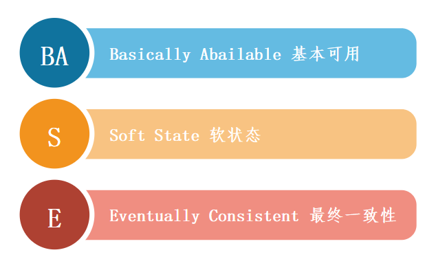
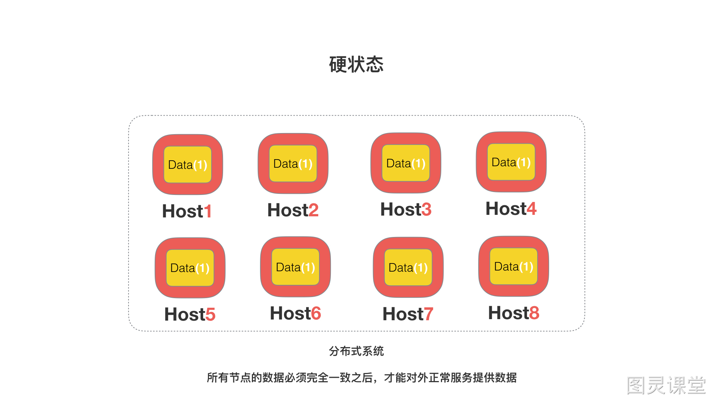
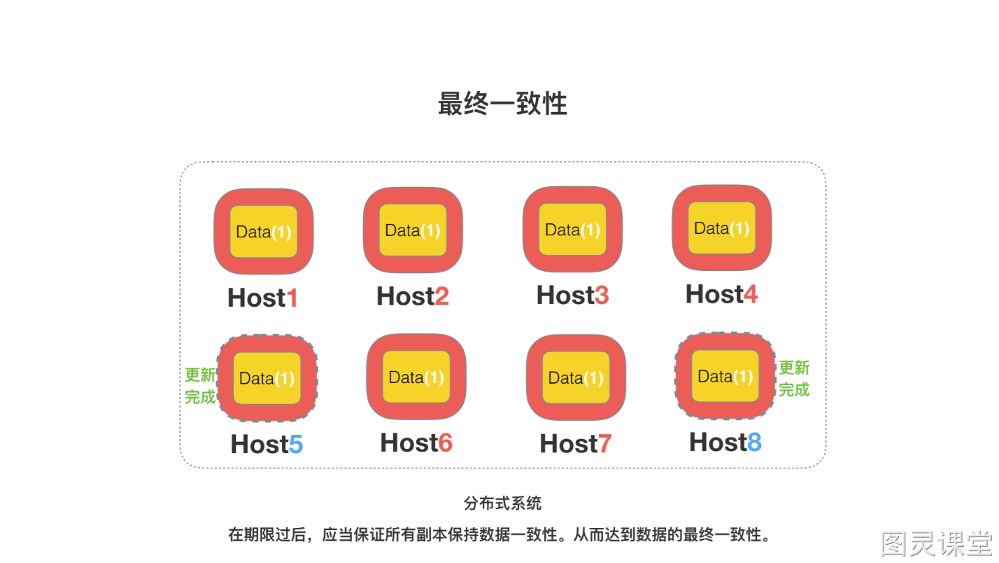

# BASE理论了解吗？

薪资：8k-15k
岗位：初中级开发工程师
BASE（Basically Available、Soft state、Eventual consistency）是基于CAP理论逐步演化而来的，核心思想是即便不能达到强一致性（Strong consistency），也可以根据应用特点采用适当的方式来达到最终一致性（Eventual consistency）的效果。

## (1) BASE的主要含义：

BASE是Basically Available(基本可用）、**Soft state(软状态）和Eventually consistent(最终一致性）**三个短语的简写。

BASE是对CAP中一致性和可用性权衡的结果，其来源于对大规模互联网系统分布式实践的总结，是基于CAP定理逐步演化而来的，其核心思想是即使无法做到强一致性，但每个应用都可以根据自身的业务特点，采用适当的方法来使系统达到最终一致性。

两个对冲理念：ACID和BASE
ACID是传统数据库常用的设计理念，追求强一致性模型。
BASE支持的是大型分布式系统，提出通过牺牲强一致性获得高可用性。

## (2) Basically Available(基本可用)
基本可用本质是一种妥协，也就是出现节点故障或者系统过载时，通过牺牲非核心功能的可用性，保障核心功能的稳定运行。
实现基本可用的几个策略：

1、流量削峰（不同地区售票时间错峰出售）
以订票系统设计为例，在春运期间，开始售票前后会出现及其海量的请求峰值。
可以在不同的时间，出售不同区域的票，将访问请求错开，削弱请求峰值。

2、延迟响应，异步处理（买票排队，基于队列先收到用户买票请求，排队异步处理，延迟响应）
还以订票系统为例。用户提交购票请求后，往往会在队列中排队等待处理，可能几分钟或十几分钟后，系统才开始处理，然后响应处理结果。

3、体验降级（看到非实时数据，采用缓存数据提供服务）
以互联网系统为例，若出现网络热点事件，产生了海量的突发流量，系统过载，大量图片因为网络超时无法显示，那么可以用小图片代替原始图片，降低图片的清晰度和大小，提升系统处理能力。

4、过载保护熔断/限流，直接拒绝掉一部分请求，或者当请求队列满了，移除一部分请求，保证整体系统可用）
把接收到的请求放在指定的队列中排队处理，如果请求等待时间超时，这时直接拒绝超时请求；如果队列满了之后，就清除队列中一定数量的排队请求，保护系统不过载，实现系统基本可用。

5、 故障隔离（出现故障，做到故障隔离，避免影响其他服务）
 
 

## (3) Soft state（软状态）
> 原子性（硬状态） -> 要求多个节点的数据副本都是一致的,这是一种"硬状态"

软状态（弱状态） -> 允许系统中的数据存在中间状态,并认为该状态不影响系统的整体可用性,即允许系统在多个不同节点的数据副本存在数据延迟。

## (4) Eventually consistent（最终一致性）
上面说软状态，然后不可能一直是软状态，必须有个时间期限。在期限过后，应当保证所有副本保持数据一致性。从而达到数据的最终一致性。这个时间期限取决于网络延时，系统负载，数据复制方案设计等等因素。
稍微官方一点的说法就是：
系统能够保证在没有其他新的更新操作的情况下，数据最终一定能够达到一致的状态，因此所有客户端对系统的数据访问最终都能够获取到最新的值。

## (5) BASE总结
总的来说，BASE 理论面向的是大型高可用可扩展的分布式系统，和传统事务的 ACID 是相反的，它完全不同于 ACID 的强一致性模型，而是通过牺牲强一致性来获得可用性，并允许数据在一段时间是不一致的。
 

> 原文: <https://www.yuque.com/tulingzhouyu/db22bv/yhhccyw3zfi4nzme>