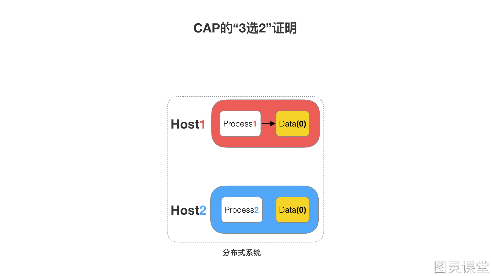
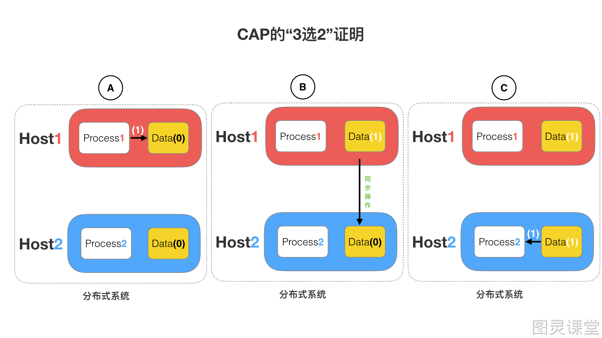
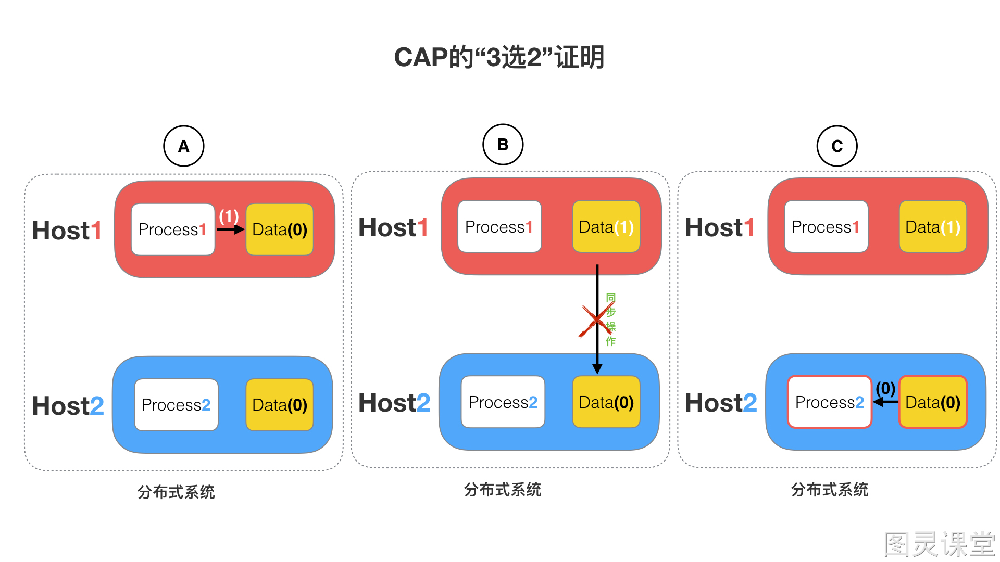
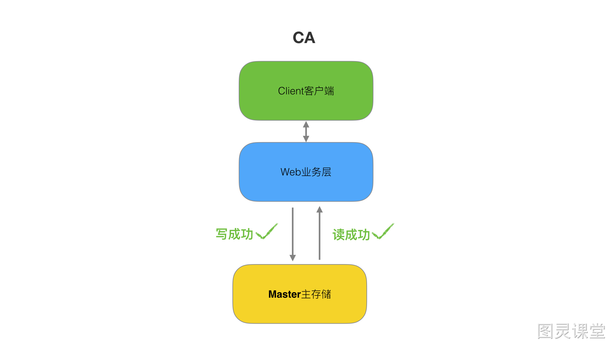

# 为什么CAP不可兼得呢

## (1) 场景
如下图，是我们证明CAP的基本场景，分布式网络中有两个节点Host1和Host2，他们之间网络可以连通，Host1中运行Process1程序和对应的数据库Data，Host2中运行Process2程序和对应数据库Data。

## (2) CAP特性

- 如果满足一致性(C)：那么Data(0) = Data(0).
- 如果满足可用性(A): 用户不管请求Host1或Host2，都会立刻响应结果。
- 如果满足分区容错性(P): Host1或Host2有一方脱离系统(故障)， 都不会影响Host1和Host2彼此之间正常运作。

## (3) 分布式系统正常运行流程
如下图，是分布式系统正常运转的流程。
> A、用户向Host1主机请求数据更新，程序Process1更新数据库Data(0)为Data(1)
> B、分布式系统将数据进行同步操作，将Host1中的Data(1)同步的Host2中``Data(0),使Host2中的数据也变为Data(1)`
> C、当用户请求主机Host2时，则Process2则响应最新的Data(1)数据

根据CAP的特性：
> 1.Host1和Host2的数据库Data之间的数据是否一样为一致性©
> 2.用户对Host1和Host2的请求响应为可用性(A)
> 3.Host1和Host2之间的各自网络环境为分区容错性§

当前是一个正常运作的流程，目前CAP三个特性可以同时满足，也是一个理想状态,但是实际应用场景中，发生错误在所难免，那么如果发生错误CAP是否能同时满足，或者该如何取舍？

## (4) 分布式系统异常运行流程
假设Host1和Host2之间的网络断开了，我们要支持这种网络异常，相当于要满足分区容错性(P)，能不能同时满足一致性(C)和可用响应性(A)呢？

假设在N1和N2之间网络断开的时候，
> A、用户向Host1发送数据更新请求，那Host1中的数据Data(0)将被更新为Data(1)
> B、弱此时Host1和Host2网络是断开的，所以分布式系统同步操作将失败，Host2中的数据依旧是Data(0)
> C、有用户向Host2发送数据读取请求，由于数据还没有进行同步，Process2没办法立即给用户返回最新的数据V1，那么将面临两个选择。
> 第一，牺牲数据一致性(c)，响应旧的数据Data(0)给用户；
> 第二，牺牲可用性(A)，阻塞等待，直到网络连接恢复，数据同步完成之后，再给用户响应最新的数据Data(1)。
> 这个过程，证明了要满足分区容错性(p)的分布式系统，只能在一致性(C)和可用性(A)两者中，选择其中一个。

## (5) "3选2"的必然性
> 通过CAP理论，我们知道无法同时满足一致性、可用性和分区容错性这三个特性，那要舍弃哪个呢？

### CA 放弃 P
一个分布式系统中，不可能存在不满足P，放弃分区容错性(p)，即不进行分区，不考虑由于网络不通或结点挂掉的问题，则可以实现一致性和可用性。那么系统将不是一个标准的分布式系统。我们最常用的关系型数据就满足了CA，如下：

主数据库和从数据库中间不再进行数据同步，数据库可以响应每次的查询请求，通过事务(原子性操作)隔离级别实现每个查询请求都可以返回最新的数据。

> 注意：
> 对于一个分布式系统来说。P是一个基本要求，CAP三者中，只能在CA两者之间做权衡，并且要想尽办法提升P。

### CP 放弃 A
如果一个分布式系统不要求强的可用性，即容许系统停机或者长时间无响应的话，就可以在CAP三者中保障CP而舍弃A。

放弃可用性，追求一致性和分区容错性，如Redis、HBase等，还有分布式系统中常用的Zookeeper也是在CAP三者之中选择优先保证CP的。

场景：

跨行转账，一次转账请求要等待双方银行系统都完成整个事务才算完成。

### AP 放弃 C
放弃一致性，追求分区容忍性和可用性。这是很多分布式系统设计时的选择。实现AP，前提是只要用户可以接受所查询的到数据在一定时间内不是最新的即可。

通常实现AP都会保证最终一致性，后面讲的BASE理论就是根据AP来扩展的。

场景1：
淘宝订单退款。今日退款成功，明日账户到账，只要用户可以接受在一定时间内到账即可。

场景2：
12306的买票。都是在可用性和一致性之间舍弃了一致性而选择可用性。
你在12306买票的时候肯定遇到过这种场景，当你购买的时候提示你是有票的（但是可能实际已经没票了），你也正常的去输入验证码，下单了。但是过了一会系统提示你下单失败，余票不足。这其实就是先在可用性方面保证系统可以正常的服务，然后在数据的一致性方面做了些牺牲，会影响一些用户体验，但是也不至于造成用户流程的严重阻塞。
但是，我们说很多网站牺牲了一致性，选择了可用性，这其实也不准确的。就比如上面的买票的例子，其实舍弃的只是强一致性。退而求其次保证了最终一致性。也就是说，虽然下单的瞬间，关于车票的库存可能存在数据不一致的情况，但是过了一段时间，还是要保证最终一致性的。

## (6) 总结:
**CA 放弃 P**：如果不要求P（不允许分区），则C（强一致性）和A（可用性）是可以保证的。这样分区将永远不会存在，因此CA的系统更多的是允许分区后各子系统依然保持CA。

**CP 放弃 A**：如果不要求A（可用），相当于每个请求都需要在Server之间强一致，而P（分区）会导致同步时间无限延长，如此CP也是可以保证的。很多传统的数据库分布式事务都属于这种模式。

**AP 放弃 C**：要高可用并允许分区，则需放弃一致性。一旦分区发生，节点之间可能会失去联系，为了高可用，每个节点只能用本地数据提供服务，而这样会导致全局数据的不一致性。现在众多的NoSQL都属于此类。
 

## 思考：
按照CAP理论如何设计一个电商系统？
首先个电商网站核心模块有用户，订单，商品，支付，促销管理等

1、对于用户模块，包括登录，个人设置，个人订单，购物车，收藏夹等，这些模块保证AP，数据短时间不一致不影响使用。
2、订单模块的下单付款扣减库存操作是整个系统的核心，CA都需要保证，极端情况下面牺牲A保证C
3、商品模块的商品上下架和库存管理保证CP
4、搜索功能因为本身就不是实时性非常高的模块，所以保证AP就可以了。
5、促销是短时间的数据不一致，结果就是优惠信息看不到，但是已有的优惠要保证可用，而且优惠可以提前预计算，所以可以保证AP。
6、支付这一块是独立的系统，或者使用第三方的支付宝，微信。其实CAP是由第三方来保证的，支付系统是一个对CAP要求极高的系统，C是必须要保证的，AP中A相对更重要，不能因为分区，导致所有人都不能支付
 

> 原文: <https://www.yuque.com/tulingzhouyu/db22bv/hoqweg9el3zbuhpv>