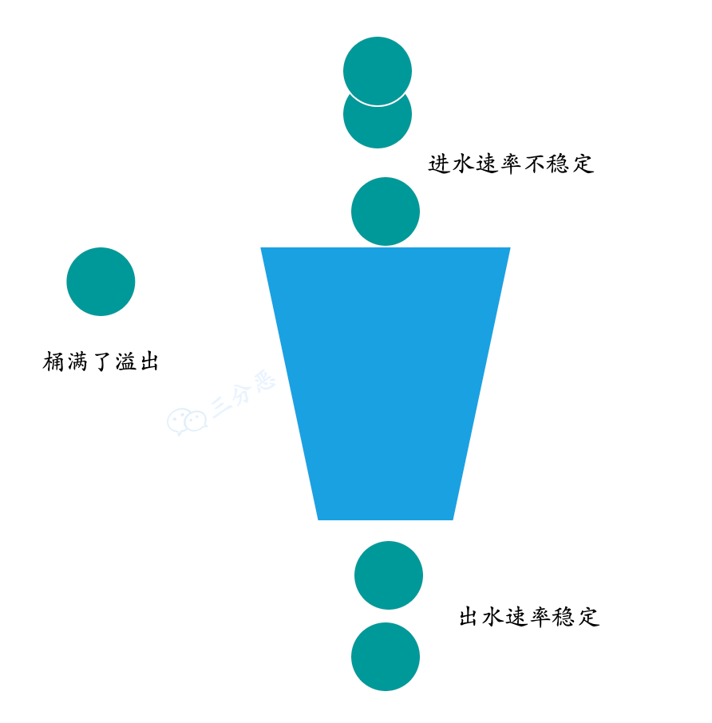
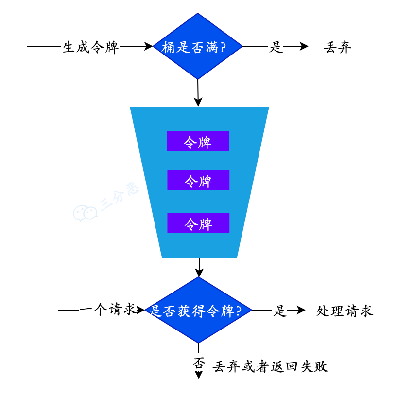

# 你了解哪些限流算法？

- **计数器**

计数器比较简单粗暴，比如我们要限制1s能够通过的请求数，实现的思路就是从第一个请求进来开始计时，在接下来的1s内，每个请求进来请求数就+1，超过最大请求数的请求会被拒绝，等到1s结束后计数清零，重新开始计数。
这种方式有个很大的弊端：比如前10ms已经通过了最大的请求数，那么后面的990ms的请求只能拒绝，这种现象叫做“突刺现象”。

- **漏桶算法**

就是桶底出水的速度恒定，进水的速度可能快慢不一，但是当进水量大于出水量的时候，水会被装在桶里，不会直接被丢弃；但是桶也是有容量限制的，当桶装满水后溢出的部分还是会被丢弃的。
**算法实现**：可以准备一个队列来保存暂时处理不了的请求，然后通过一个线程池定期从队列中获取请求来执行。

漏桶算法

- **令牌桶算法**

令牌桶就是生产访问令牌的一个地方，生产的速度恒定，用户访问的时候当桶中有令牌时就可以访问，否则将触发限流。
**实现方案**：Guava RateLimiter限流
Guava RateLimiter是一个谷歌提供的限流，其基于令牌桶算法，比较适用于单实例的系统。

令牌桶算法

---

这一期的分布式面试题就整理到这里了，主要是偏理论的一些问题，分布式其实是个很大的类型，比如分布式调用、分布式治理……
所以，这篇文章只是个开始，后面还会有分布式调用（RPC）、微服务相关的主题文章，敬请期待。

> 原文: <https://www.yuque.com/tulingzhouyu/db22bv/tdo7qe9qvsaxxuux>