# 有哪些分布式锁的实现方案呢？

资：12-25K
岗位：中高级开发工程师


### 一、[分布式锁](https://so.csdn.net/so/search?q=%E5%88%86%E5%B8%83%E5%BC%8F%E9%94%81&spm=1001.2101.3001.7020)场景
一般需要使用分布式锁的场景如下：

- 效率：使用分布式锁可以避免不同节点重复相同的工作，比如避免重复执行定时任务等；
- 正确性：使用分布式锁同样可以避免破坏数据正确性，如果两个节点在同一条数据上面操作，可能会出现并发问题。

### 二、分布式锁特点
一个完善的分布式锁需要满足以下特点：

- 互斥性：互斥是所得基本特性，分布式锁需要按需求保证线程或节点级别的互斥。；
- 可重入性：同一个节点或同一个线程获取锁，可以再次重入获取这个锁；
- 锁超时：支持锁超时释放，防止某个节点不可用后，持有的锁无法释放；
- 高效性：加锁和解锁的效率高，可以支持高并发；
- 高可用：需要有高可用机制预防锁服务不可用的情况，如增加降级；
- 阻塞性：支持阻塞获取锁和非阻塞获取锁两种方式；
- 公平性：支持公平锁和非公平锁两种类型的锁，公平锁可以保证安装请求锁的顺序获取锁，而非公平锁不可以。

### 三、分布式锁的实现
分布式锁常见的实现有三种实现，下文我们会一一介绍这三种锁的实现方式：


- 基于数据库的分布式锁；
- 基于Redis的分布式锁；
- 基于Zookeeper的分布式锁。

### 1、基于数据库的分布式锁
用数据库实现分布式锁比较简单，就是创建一张锁表，数据库对字段作唯一性约束。
加锁的时候，在锁表中增加一条记录即可；释放锁的时候删除记录就行。
如果有并发请求同时提交到数据库，数据库会保证只有一个请求能够得到锁。
这种属于数据库 IO 操作，效率不高，而且频繁操作会增大数据库的开销，因此这种方式在高并发、高性能的场景中用的不多。

#### 方案概览
我们上面列举出了分布式锁需要满足的特点，使用数据库实现分布式锁也需要满足这些特点，下面我们来一一介绍实现方法：

- 互斥性：通过数据库update的原子性达到两次获取锁之间的互斥性；
- 可重入性：在数据库中保留一个字段存储当前锁的持有者；
- 锁超时：在数据库中存储锁的获取时间点和超时时长；
- 高效性：数据库本身可以支持比较高的并发；
- 高可用：可以增加主从数据库逻辑，提升数据库的可用性；
- 阻塞性：可以通过看门狗轮询的方式实现线程的阻塞；
- 公平性：可以添加锁队列，不过不建议，实现起来比较复杂。

#### 表结构设计
数据库的表名为lock，各个字段的定义如下所示：

| **字段名名称** | **字段类型** | **说明** |
| --- | --- | --- |
| lock_key | varchar | 锁的唯一标识符号 |
| lock_time | timestample | 加锁的时间 |
| lock_duration | integer | 锁的超时时长，单位可以业务自定义，通常为秒 |
| lock_owner | varchar | 锁的持有者，可以是节点或线程的唯一标识，不同可重入粒度的锁有不同的含义 |
| locked | boolean | 当前锁是否被占有 |


#### 获取锁的SQL语句
获取锁的SQL语句分不同的情况，如果锁不存在，那么首先需要创建锁，并且创建锁的线程可以获取锁：
```
insert into lock(lock_key,lock_time,lock_duration,lock_owner,locked) values ('xxx',now(),1000,'ownerxxx',true)
```
如果锁已经存在，那么就尝试更新锁的信息，如果更新成功则表示获取锁成功，更新失败则表示获取锁失败。
```sql
update lock set 
    locked = true, 
    lock_owner = 'ownerxxxx', 
    lock_time = now(), 
    lock_duration = 1000
where
    lock_key='xxx' and(
      lock_owner = 'ownerxxxx' or
      locked = false or
      date_add(lock_time, interval lock_duration second) > now())
```

#### 释放锁的SQL语句
当用户使用完锁需要释放的时候，可以直接更新locked标识位为false。
```plsql
update lock set 
    locked = false, 
where
    lock_key='xxx' and
    lock_owner = 'ownerxxxx' and
    locked = true
```

#### 看门狗
通过上面的步骤，我们可以实现获取锁和释放锁，那么看门狗又是做什么的呢？
大家想象一下，如果用户获取锁到释放锁之间的时间大于锁的超时时间，是不是会有问题？是不是可能会出现多个节点同时获取锁的情况？这个时候就需要看门狗了，看门狗可以通过定时任务不断刷新锁的获取事件，从而在用户获取锁到释放锁期间保持一直持有锁。

### 2、基于Redis的分布式锁
Redis的Java客户端Redisson实现了分布式锁，我们可以通过类似ReentrantLock的加锁-释放锁的逻辑来实现分布式锁。
```java
RLock disLock = redissonClient.getLock("DISLOCK");
disLock.lock();
try {
    // 业务逻辑
} finally {
    // 无论如何, 最后都要解锁
    disLock.unlock();
}
```

#### Redisson分布式锁的底层原理
如下图为Redisson客户端加锁和释放锁的逻辑：
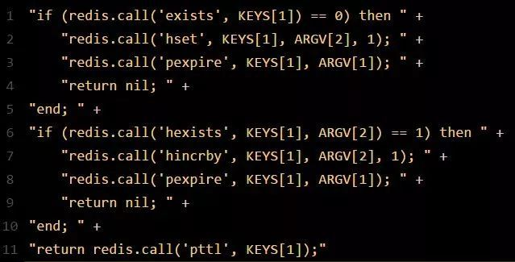

#### 

#### 加锁机制
从上图中可以看出来，Redisson客户端需要获取锁的时候，要发送一段Lua脚本到Redis集群执行，为什么要用Lua脚本呢？因为一段复杂的业务逻辑，可以通过封装在Lua脚本中发送给Redis，保证这段复杂业务逻辑执行的原子性。
**Lua源码分析**：如下为Redisson加锁的lua源码，接下来我们会对源码进行分析。
**源码入参**：Lua脚本有三个输入参数：KEYS[1]、ARGV[1]和ARGV[2]，含义如下：

- KEYS[1]代表的是加锁的Key，例如RLock lock = redisson.getLock("myLock")中的“myLock”；
- ARGV[1]代表的就是锁Key的默认生存时间，默认30秒；
- ARGV[2]代表的是加锁的客户端的ID，类似于下面这样的：8743c9c0-0795-4907-87fd-6c719a6b4586:1。

Lua脚本及加锁步骤如下代码块所示，可以看出其大致原理为：

- 锁不存在的时候，创建锁并设置过期时间；
- 锁存在的时候，如果是重入场景则刷新锁的过期事件；
- 否则返回加锁失败和锁的过期时间。
```java
-- 判断锁是不是存在
if (redis.call('exists', KEYS[1]) == 0) then 
    -- 添加锁，并且设置客户端和初始锁重入次数
    redis.call('hincrby', KEYS[1], ARGV[2], 1); 
    -- 设置锁的超时事件 
    redis.call('pexpire', KEYS[1], ARGV[1]);  
    -- 返回加锁成功
    return nil;  
end;  
-- 判断当前锁的持有者是不是请求锁的请求者
if (redis.call('hexists', KEYS[1], ARGV[2]) == 1) then  
    -- 当前锁被请求者持有，重入锁，增加锁重入次数
    redis.call('hincrby', KEYS[1], ARGV[2], 1);  
    -- 刷新锁的过期时间
    redis.call('pexpire', KEYS[1], ARGV[1]);  
    -- 返回加锁成功
    return nil;  
end;  
-- 返回当前锁的过期时间
return redis.call('pttl', KEYS[1]);
```

#### 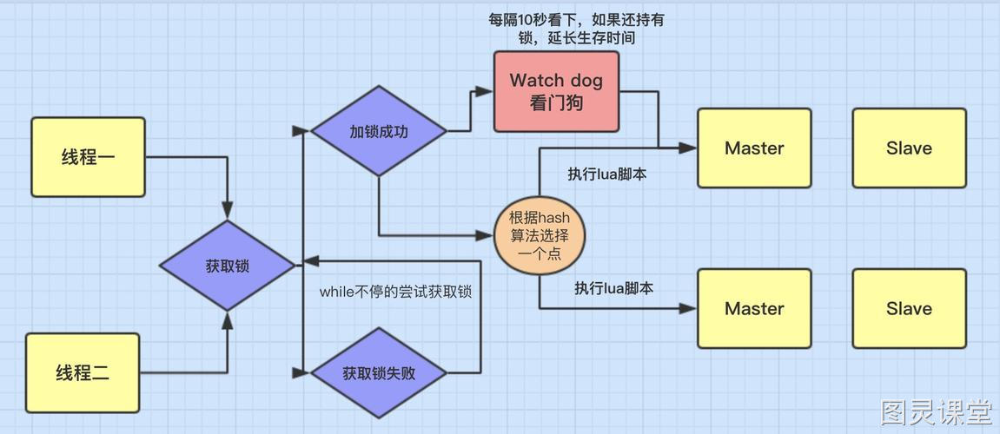

#### 看门狗逻辑
客户端1加锁的锁Key默认生存时间才30秒，如果超过了30秒，客户端1还想一直持有这把锁，怎么办呢？只要客户端1加锁成功，就会启动一个watchdog看门狗，这个后台线程，会每隔10秒检查一下，如果客户端1还持有锁Key，就会不断的延长锁Key的生存时间。

#### 释放锁机制
如果执行lock.unlock()，就可以释放分布式锁，此时的业务逻辑也是非常简单的。就是每次都对myLock数据结构中的那个加锁次数减1。
如果发现加锁次数是0了，说明这个客户端已经不再持有锁了，此时就会用：“del myLock”命令，从Redis里删除这个Key。
而另外的客户端2就可以尝试完成加锁了。这就是所谓的分布式锁的开源Redisson框架的实现机制。
一般我们在生产系统中，可以用Redisson框架提供的这个类库来基于Redis进行分布式锁的加锁与释放锁。

#### Redisson分布式锁的缺陷
Redis分布式锁会有个缺陷，就是在Redis哨兵模式下:

1. 客户端1对某个master节点写入了redisson锁，此时会异步复制给对应的slave节点。但是这个过程中一旦发生master节点宕机，主备切换，slave节点从变为了master节点。
2. 客户端2来尝试加锁的时候，在新的master节点上也能加锁，此时就会导致多个客户端对同一个分布式锁完成了加锁。
3. 系统在业务语义上一定会出现问题，导致各种脏数据的产生。

这个缺陷导致在哨兵模式或者主从模式下，如果master实例宕机的时候，可能导致多个客户端同时完成加锁。

### 四、基于Zookeeper的分布式锁
Zookeeper实现的分布式锁适用于引入Zookeeper的服务，如下所示，有两个服务注册到Zookeeper，并且都需要获取Zookeeper上的分布式锁，流程式什么样的呢？
首先，在 Zookeeper 当中创建一个持久节点 ParentLock。当第一个客户端想要获得锁时，需要在ParentLock这个节点下面创建一个临时顺序节点 Lock1。
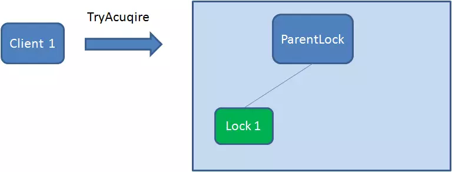之后，Client1 查找 ParentLock 下面所有的临时顺序节点并排序，判断自己所创建的节点 Lock1 是不是顺序最靠前的一个。如果是第一个节点，则成功获得锁。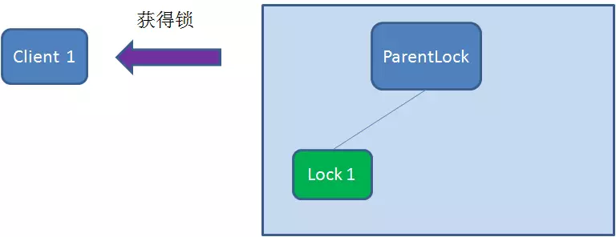这时候，如果再有一个客户端 Client2 前来获取锁，则在 ParentLock 下再创建一个临时顺序节点Lock2。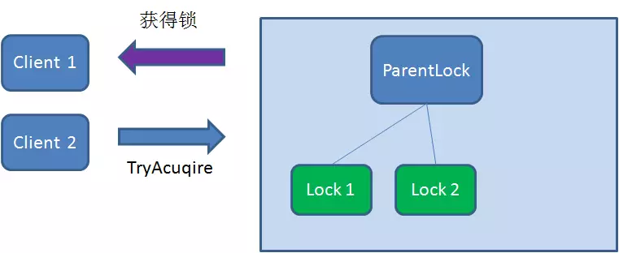Client2 查找 ParentLock 下面所有的临时顺序节点并排序，判断自己所创建的节点 Lock2 是不是顺序最靠前的一个，结果发现节点 Lock2 并不是最小的。
于是，Client2 向排序仅比它靠前的节点 Lock1 注册 Watcher，用于监听 Lock1 节点是否存在。这意味着 Client2 抢锁失败，进入了等待状态。
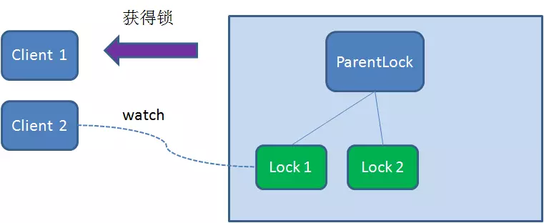这时候，如果又有一个客户端 Client3 前来获取锁，则在ParentLock下载再创建一个临时顺序节点Lock3。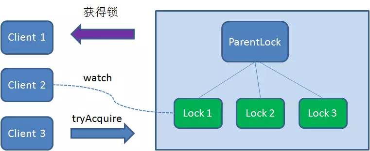Client3 查找 ParentLock 下面所有的临时顺序节点并排序，判断自己所创建的节点 Lock3 是不是顺序最靠前的一个，结果同样发现节点 Lock3 并不是最小的。
于是，Client3 向排序仅比它靠前的节点 Lock2 注册 Watcher，用于监听 Lock2 节点是否存在。这意味着 Client3 同样抢锁失败，进入了等待状态。
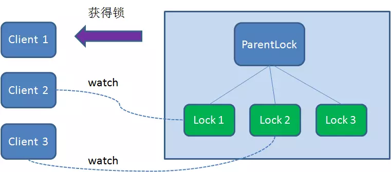这样一来，Client1 得到了锁，Client2 监听了 Lock1，Client3 监听了 Lock2。这恰恰形成了一个等待队列，很像是 Java 当中 ReentrantLock 所依赖的 AQS（AbstractQueuedSynchronizer）。

### 释放锁
释放锁分为两种情况：
1、任务完成，客户端显示释放
当任务完成时，Client1 会显示调用删除节点 Lock1 的指令。
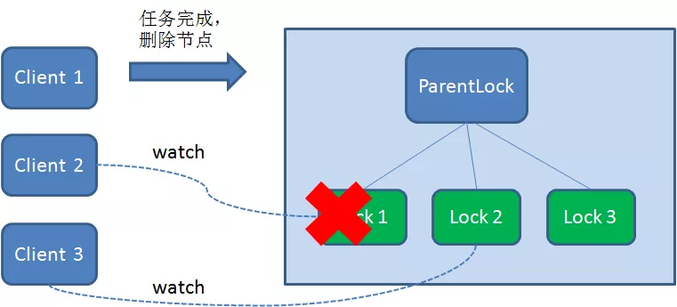2.任务执行过程中，客户端崩溃
获得锁的 Client1 在任务执行过程中，如果 Duang 的一声崩溃，则会断开与 Zookeeper 服务端的链接。根据临时节点的特性，相关联的节点 Lock1 会随之自动删除。
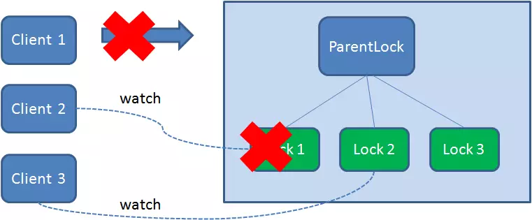
由于 Client2 一直监听着 Lock1 的存在状态，当 Lock1 节点被删除，Client2 会立刻收到通知。这时候 Client2 会再次查询 ParentLock 下面的所有节点，确认自己创建的节点 Lock2 是不是目前最小的节点。如果是最小，则 Client2 顺理成章获得了锁。
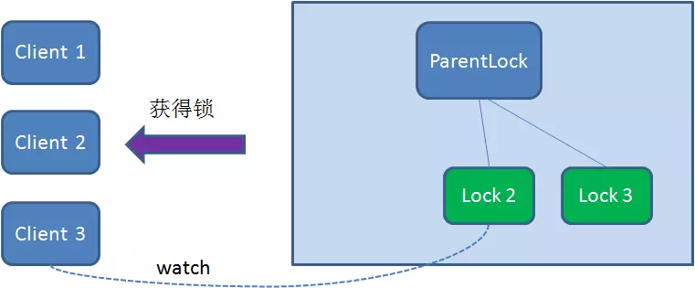同理，如果 Client2 也因为任务完成或者节点崩溃而删除了节点 Lock2，那么 Client3 就会接到通知。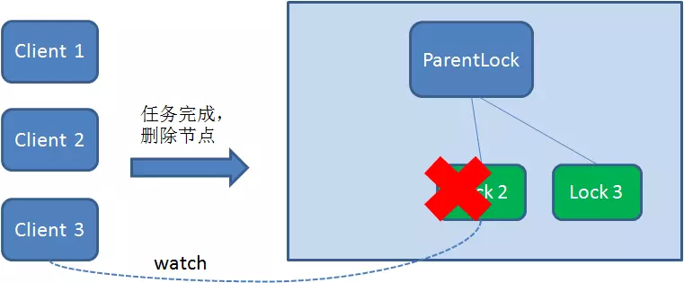最终，Client3 成功得到了锁。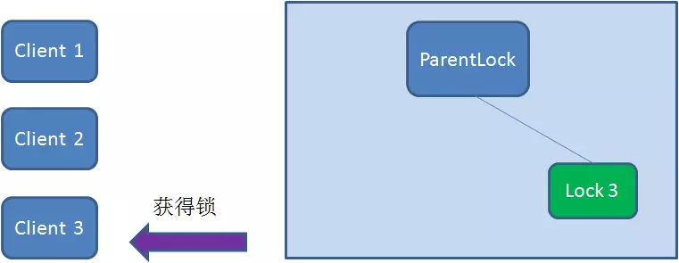

 

### 五、三种锁的优缺点
**基于数据库的分布式锁**：

- 数据库并发性能较差；
- 阻塞式锁实现比较复杂；
- 公平锁实现比较复杂。

**基于Redis的分布式锁**：

- 主从切换的情况下可能出现多客户端获取锁的情况；
- Lua脚本在单机上具有原子性，主从同步时不具有原子性。

**基于Zookeeper的分布式锁**：

- 需要引入Zookeeper集群，比较重量级；
- 分布式锁的可重入粒度只能是节点级别；


 

 


> 原文: <https://www.yuque.com/tulingzhouyu/db22bv/hlbwcoo3qblhpcq3>