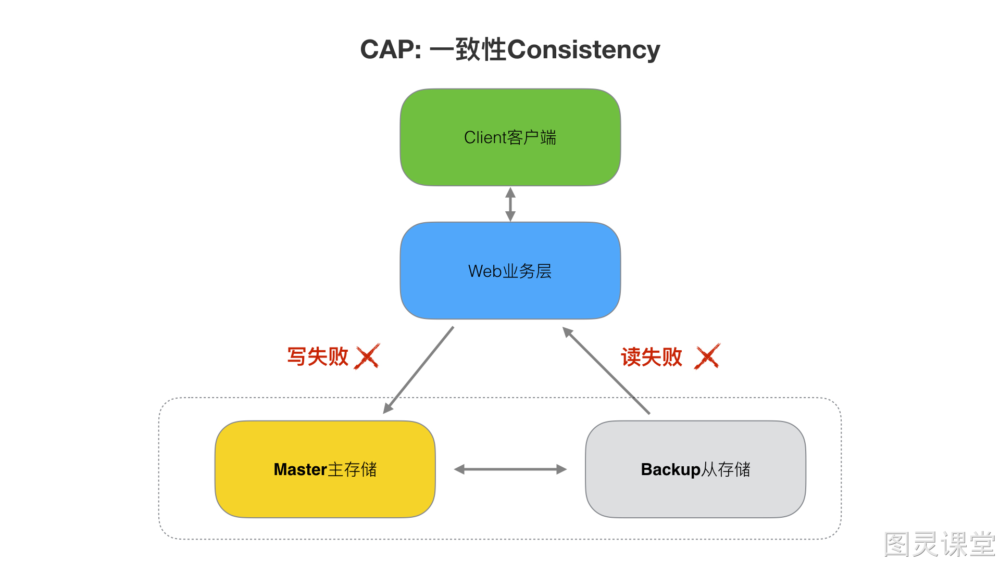
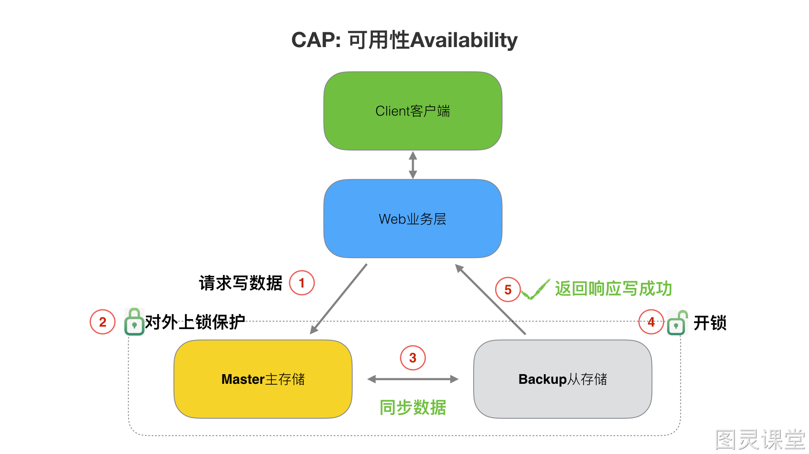
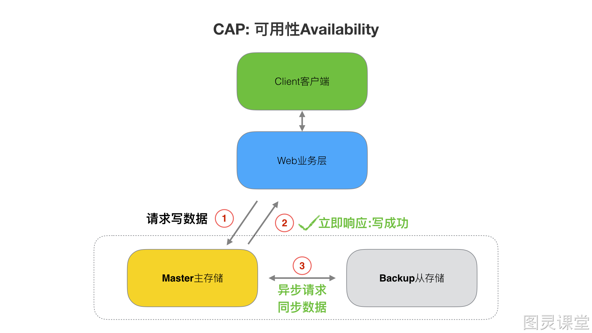
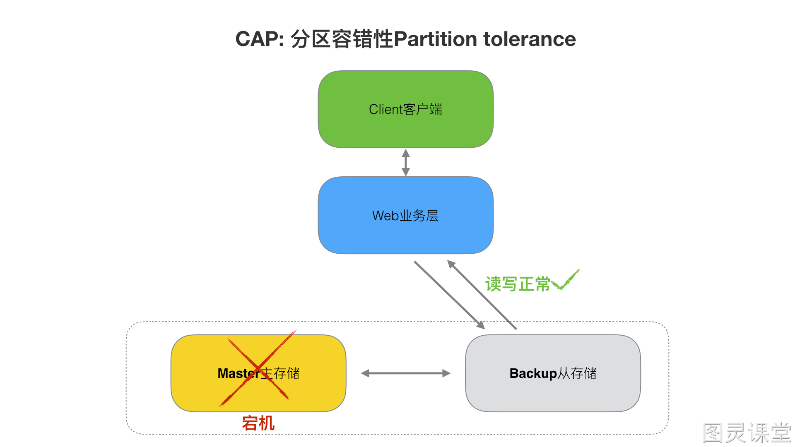
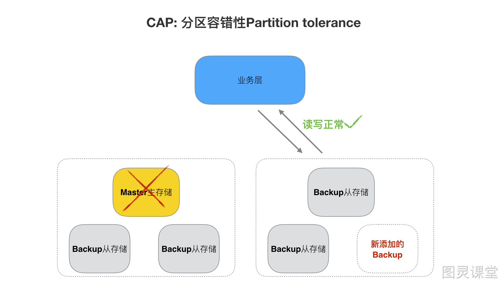

# 说说CAP原则

薪资：8·k-15k
岗位：初中级开发工程师
在设计一个分布式项目的时候会遇到三个特性：一致性（consistency）、可用性（Availability）、分区容错（partition-tolerance）都需要的情景.

> CAP定律说的是在一个分布式计算机系统中，一致性，可用性和分区容错性这三种保证无法同时得到满足，最多满足两个。

> 如下图，CAP的三种特性只能同时满足两个。而且在不同的两两组合，也有一些成熟的分布式产品。

接下来，我们来介绍一下CAP的三种特性，我们采用一个应用场景来分析CAP中的每个特点的含义。
该场景整体分为5个流程：
:::danger
流程一、客户端发送请求(如:添加订单、修改订单、删除订单)
流程二、Web业务层处理业务，并修改存储成数据信息
流程三、存储层内部Master与Backup的数据同步
流程四、Web业务层从存储层取出数据
流程五、Web业务层返回数据给客户端
:::

## (1) 一致性Consistency
> 一致性指“`all nodes see the same data at the same time`”，即更新操作成功并返回客户端完成后，**所有节点在同一时间的数据完全一致**。

> 一旦数据更新完成并成功返回客户端后，那么分布式系统中所有节点在同一时间的数据完全一致。

> 一致性是指写操作后的读操作可以读取到最新的数据状态，当数据分布在多个节点上，从任意结点读取到的数据都是最新的状态。

一致性实现目标：
> Web业务层向主Master写数据库成功，从Backup读数据也成功。

> Web业务层向主Master读数据库失败，从Backup读数据也失败。

必要实现流程：
> 写入主数据库后，在向从数据库同步期间要将从数据库锁定，待同步完成后再释放锁，以免在新数据写入成功后，向从数据库查询到旧的数据。

分布式一致性特点：
> 1.由于存在数据同步的过程，写操作的响应会有一定的延迟。
> 2.为了保证数据一致性会对资源暂时锁定，待数据同步完成释放锁定资源。
> 3.如果请求数据同步失败的结点则会返回错误信息，一定不会返回旧数据。

## (2) 可用性(Availability)
> 可用性指“Reads and writes always succeed”，即**服务一直可用，而且是正常响应时间。**

> 对于可用性的衡量标准如下：

| **可用性分类** | **可用水平（%）** | **一年中可容忍停机时间** |
| --- | --- | --- |
| 容错可用性 | 99.9999 | <1 min |
| 极高可用性 | 99.999 | <5 min |
| 具有故障自动恢复能力的可用性 | 99.99 | <53 min |
| 高可用性 | 99.9 | <8.8h |
| 商品可用性 | 99 | <43.8 min |

可用性实现目标：
> 1.当Master正在被更新，Backup数据库接收到数据查询的请求则**立即能够响应数据查询结果**。
> 2.backup数据库不允许出现响应超时或响应错误。

必要实现流程：
> 1.写入Master主数据库后要将数据同步到从数据库。
> 2.由于要保证Backup从数据库的可用性，不可将Backup从数据库中的资源进行锁定。
> 3.即时数据还没有同步过来，从数据库也要返回要查询的数据，哪怕是旧数据/或者默认数据，但不能返回错误或响应超时。

分布式可用性特点：
所有请求都有响应，且不会出现响应超时或响应错误。

## (3) 分区容错性(Partition tolerance)
> 分区容错性指`“the system continues to operate despite arbitrary message loss or failure of part of the system”`，即分布式系统在遇到某节点或网络分区故障的时候，仍然能够对外提供服务。

> 分布式系统中，尽管部分节点出现任何消息丢失或者故障，系统应继续运行。

> 通常分布式系统的各各结点部署在不同的子网，这就是网络分区，不可避免的会出现由于网络问题而导致结点之间通信失败，此时仍可对外提供服务。

分区容错性实现目标：
其一个结点挂掉不影响另一个结点对外提供服务。

必要实现流程：
> 1.尽量使用异步取代同步操作，例如使用异步方式将数据从主数据库同步到从数据，这样结点之间能有效的实现松耦合。
> 2.添加Backup从数据库结点，其中一个Backup从结点挂掉其它Backup从结点提供服务。

 
分区容错性特点：
> 分区容忍性分是布式系统具备的基本能力。

> 原文: <https://www.yuque.com/tulingzhouyu/db22bv/eav93qvg0qcgmgv3>