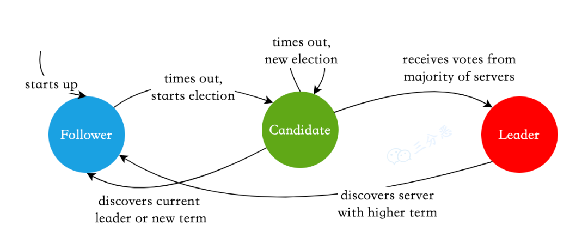

# 说说Raft算法？

### **Raft算法是什么？**
Raft 也是一个 **一致性算法**，和 Paxos 目标相同。但它还有另一个名字 - **易于理解的一致性算法**。Paxos 和 Raft 都是为了实现 **一致性** 产生的。这个过程如同选举一样，**参选者** 需要说服 **大多数选民** (Server) 投票给他，一旦选定后就跟随其操作。Paxos 和 Raft 的区别在于选举的 **具体过程** 不同。

### **Raft算法的工作流程？**

#### Raft算法的角色
Raft 协议将 Server 进程分为三种角色：

- **Leader（领导者）**
- **Follower（跟随者）**
- **Candidate（候选人）**

就像一个民主社会，领导者由跟随者投票选出。刚开始没有 **领导者**，所有集群中的 **参与者** 都是 **跟随者**。
那么首先开启一轮大选。在大选期间 **所有跟随者** 都能参与竞选，这时所有跟随者的角色就变成了 **候选人**，民主投票选出领袖后就开始了这届领袖的任期，然后选举结束，所有除 **领导者** 的 **候选人** 又变回 **跟随者** 服从领导者领导。
这里提到一个概念 **「任期」**，用术语 Term 表达。
三类角色的变迁图如下：

Raft三种角色变迁图

#### Leader选举过程
Raft 使用心跳（heartbeat）触发Leader选举。当Server启动时，初始化为Follower。Leader向所有Followers周期性发送heartbeat。如果Follower在选举超时时间内没有收到Leader的heartbeat，就会等待一段随机的时间后发起一次Leader选举。
Follower将其当前term加一然后转换为Candidate。它首先给自己投票并且给集群中的其他服务器发送 RequestVote RPC 。结果有以下三种情况：

- **赢得了多数（超过1/2）的选票，成功选举为Leader；**
- **收到了Leader的消息，表示有其它服务器已经抢先当选了Leader；**
- **没有Server赢得多数的选票，Leader选举失败，等待选举时间超时（Election Timeout）后发起下一次选举。**

Leader选举
选出 Leader 后，Leader 通过 **定期** 向所有 Follower 发送 **心跳信息** 维持其统治。若 Follower 一段时间未收到 Leader 的 **心跳**，则认为 Leader 可能已经挂了，然后再次发起 **选举** 过程。

> 原文: <https://www.yuque.com/tulingzhouyu/db22bv/ywiia55xxy96lkcg>