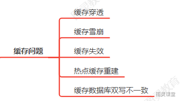
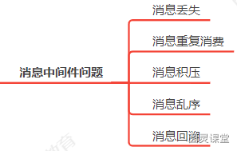
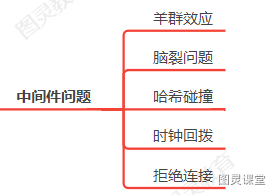
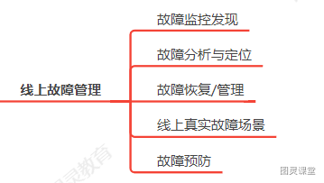

# 电商系统开发中会都遇到了哪些问题？

现在简历中你的项目**不写个高并发项目你都不好意思说自己是java程序员**！！但是现实是**哪有这么多高并发项目**。 那大部分同学会包装一个高并发项目，**没错！这么干就对了**，要不然你简历真的已读不回，**环境所致嘛**。

 大家好，我是徐庶，那如果你简历写了高并发类项目， 一定要提防面试官问你这些问题：
  我给大家总结了一个**高并发电商项目的5大类问题**，如果还有其他的欢迎在评论区补充，关于具体的解决方案我已经整理进了80万字面试资料中，  那这5大问题分别是：

1. **怎么处理高并发** ？ 可以主要围绕 缓存（必要时多级缓存）、限流、熔断等解决方案回答。
2. **库存问题： **
   1. **比如库存超卖**：可以通过限流 或者 分布式锁  也可以利用 Redis Lua（先判断库存 -> 减库存 + 加订单）保证原子性。
   2. **~~还有库存少卖~~**~~：通常会结合及时对账系统 再通过人工介入处理。 （这句删掉）~~
3. **弱网支付问题**：  在网络信号较差的情况下进行支付操作时可能出现的一系列问题:比如   **订单状态和支付结果不一致**、**用户响应和实际支付结果不一致**， 最终导致**重复付款**或者**未付款却下单成功**等问题。

       那可以通过：  依赖**支付平台提供回调方法来进行更新支付状态以保证一致性**
当然也**不能傻傻地只等三方的回调通知**因为有可能**网络故障没有收到回调**，而要**主动去查询**，通过定时任务进行轮询，直到拿到支付的最终状态，

4. **黄牛刷单**：可以通过 **添加图形验证码**、**IP 黑名单**等方式实现。
5. **订单问题**：

 比如**重复下单**： 可以通过实现幂等方式解决， 比如我可以通过 业务实现幂等性判断，判断订单支付状态、接口唯一token等。
还有**订单超时自动取消**： 主流的解决方案有**mq的延时消息**、**redis过期监听**、**定时任务批处理**等.。

 除了以上问题之后，你在开发高并发系统中还遇到了哪些经典的问题？  比如**缓存问题**：
**消息中间件问题****分布式问题**：**系统问题**：**线上故障排查方式**等。   如果你的项目是高并发，这些问题都有可能会问到，不会可以联系我主页的联系方式进行学习。

> 原文: <https://www.yuque.com/tulingzhouyu/db22bv/kuhe0bz9p8xovzt4>