# 👍 2024金三银四100道面试题笔记资料

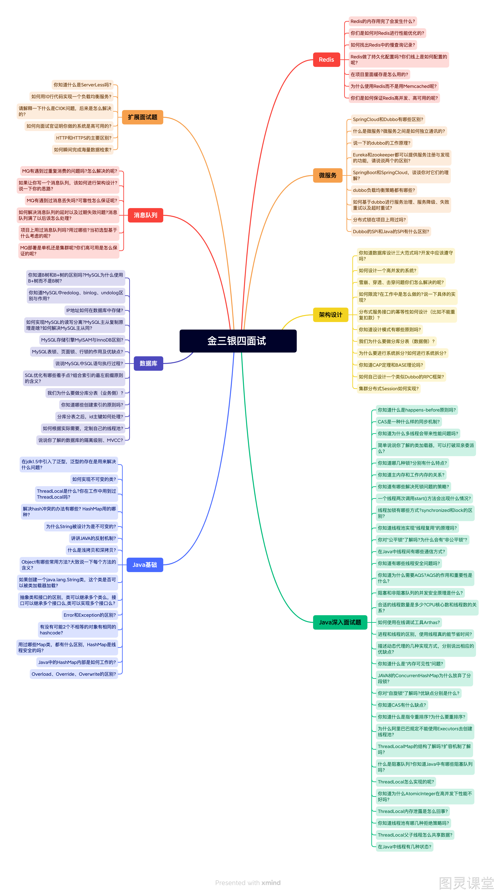

## 什么是浅拷贝和深拷贝？
**浅拷贝**（shallow copy）：只**复制**指向某个对象的指针，而不**复制**对象本身，新旧对象共享一块内存； 
**深拷贝**（deep copy）：**复制**并创建一个一摸一样的对象，不共享内存，修改新对象，旧对象保持不变；

### 浅拷贝
拷贝对象和原始对象的引用类型引用同一个对象。
```java
public class ShallowCloneExample implements Cloneable {

  private int[] arr;

  public ShallowCloneExample() {
    arr = new int[10];
    for (int i = 0; i < arr.length; i++) {
      arr[i] = i;
    }
  }

  public void set(int index, int value) {
    arr[index] = value;
  }

  public int get(int index) {
    return arr[index];
  }

  @Override
  protected ShallowCloneExample clone() throws CloneNotSupportedException {
    return (ShallowCloneExample) super.clone();
  }

}

ShallowCloneExample e1 = new ShallowCloneExample();
ShallowCloneExample e2 = null;
try {
  e2 = e1.clone();
} catch (CloneNotSupportedException e) {
  e.printStackTrace();
}

e1.set(2, 222);
System.out.println(e2.get(2)); // 222
```

### 深拷贝
拷贝对象和原始对象的引用类型引用不同对象。
```java
public class DeepCloneExample implements Cloneable {

  private int[] arr;

  public DeepCloneExample() {
    arr = new int[10];
    for (int i = 0; i < arr.length; i++) {
      arr[i] = i;
    }
  }

  public void set(int index, int value) {
    arr[index] = value;
  }

  public int get(int index) {
    return arr[index];
  }

  @Override
  protected DeepCloneExample clone() throws CloneNotSupportedException {
    DeepCloneExample result = (DeepCloneExample) super.clone();
    result.arr = new int[arr.length];
    for (int i = 0; i < arr.length; i++) {
      result.arr[i] = arr[i];
    }

    return result;
  }

}

DeepCloneExample e1 = new DeepCloneExample();
DeepCloneExample e2 = null;
try {
  e2 = e1.clone();
} catch (CloneNotSupportedException e) {
  e.printStackTrace();
}

e1.set(2, 222);
System.out.println(e2.get(2)); // 2
```
**使用 clone() 方法来拷贝一个对象即复杂又有风险，它会抛出异常，并且还需要类型转换。Effective Java 书上讲到，最好不要去使用 clone()，可以使用拷贝构造函数或者拷贝工厂来拷贝一个对象。**
```java
public class CloneConstructorExample {

  private int[] arr;

  public CloneConstructorExample() {
    arr = new int[10];
    for (int i = 0; i < arr.length; i++) {
      arr[i] = i;
    }
  }

  public CloneConstructorExample(CloneConstructorExample original) {
    arr = new int[original.arr.length];
    for (int i = 0; i < original.arr.length; i++) {
      arr[i] = original.arr[i];
    }
  }

  public void set(int index, int value) {
    arr[index] = value;
  }

  public int get(int index) {
    return arr[index];
  }

}

CloneConstructorExample e1 = new CloneConstructorExample();
CloneConstructorExample e2 = new CloneConstructorExample(e1);
e1.set(2, 222);
System.out.println(e2.get(2)); // 2
```

## Overload、Override、Overwrite的介绍?
overload意为重载，override意为覆盖，overwrite意为重写。从中文意思上看，并无差别，但是如下所示，给出英文定义：

> 💡Overloading occurs when two or more methods in one class have the same method name but different parameters.
当一个类中的两个或多个方法具有相同的方法名但参数不同时，就会发生重载。
Overriding or overwrite means having two methods with the same method name and parameters (i.e., method signature). One of the methods is in the parent class and the other is in the child class.
重写意味着有两个方法具有相同的方法名和参数（即方法签名）。其中一个方法在父类中，另一个在子类中。


- Overload为同一个类中，存在多个方法名相同的函数，但是他们拥有不同的参数（参数个数，类型，顺序）。
- Override 和 Overwrite 为子类和父类之间，子类和父类拥有同样的方法名和参数列表，只是将方法体重写。这是面向对象编程的多态性。

### Overload规则

1. 包含多个同名函数，但是参数各不相同。  
2. 参数类型、参数个数、参数顺序（不同类型间）至少有一个不同。
3. 可以改变返回值类型（不能作为重载判断依据）  
4. 可以改变访问修饰符（不能作为重载判断依据）  
5. 可以改变异常类型和数量（不能作为重载判断依据）

### Overrite规则

1. 存在于子类和父类之间
2. 子类必须和父类的方法名和参数列表必须完全相同。
3. 可以改变返回值类型，但子类返回值类型必须是父类返回值类型的派生类。
4. 可以改变访问修饰符，但是子类权限只能更开放。
5. 声明为 final 的方法不能被重写。
6. 声明为 static 的方法不能被重写，但是可以被重新声明。
7. 构造器不能被重写。
8. 子类和父类在同一个包中时，子类可以重写父类所有方法（除 private 和 final）。
9. 子类和父类在不同包中时，子类只能重写父类的 public 和 protected 的非 final 方法。
10. 重写可以抛出任何非强制性异常，但是不能抛出新的强制性异常，或者比父类方法更广泛的异常。

## 在jdk1.5中引入了泛型，泛型的存在是用来解决什么问题
Java泛型这个特性是从JDK 1.5才开始加入的，因此为了兼容之前的版本，Java泛型的实现采取了“**伪泛型**”的策略，即Java在语法上支持泛型，但是在编译阶段会进行所谓的“**类型擦除**”（Type Erasure），将所有的泛型表示（尖括号中的内容）都替换为具体的类型（其对应的原生态类型），就像完全没有泛型一样。
泛型的本质是为了参数化类型（在不创建新的类型的情况下，通过泛型指定的不同类型来控制形参具体限制的类型）。也就是说在泛型使用过程中，操作的数据类型被指定为一个参数，这种参数类型可以用在类、接口和方法中，分别被称为泛型类、泛型接口、泛型方法。

- **适用于多种数据类型执行相同的代码**（代码复用）
- 泛型中的类型在使用时指定，不需要强制类型转换（**类型安全**，编译器会**检查类型**）

#### 泛型上下限
为了解决泛型中隐含的转换问题，Java泛型加入了类型参数的上下边界机制。<? extends A>表示该类型参数可以是A(上边界)或者A的子类类型。编译时擦除到类型A，即用A类型代替类型参数。这种方法可以解决开始遇到的问题，编译器知道类型参数的范围，如果传入的实例类型B是在这个范围内的话允许转换，这时只要一次类型转换就可以了，运行时会把对象当做A的实例看待。

#### 如何理解Java中的泛型是伪泛型？泛型中类型擦除
Java泛型这个特性是从JDK 1.5才开始加入的，因此为了兼容之前的版本，Java泛型的实现采取了“伪泛型”的策略，即Java在语法上支持泛型，但是在编译阶段会进行所谓的“类型擦除”（Type Erasure），将所有的泛型表示（尖括号中的内容）都替换为具体的类型（其对应的原生态类型），就像完全没有泛型一样。理解类型擦除对于用好泛型是很有帮助的，尤其是一些看起来“疑难杂症”的问题，弄明白了类型擦除也就迎刃而解了。
**泛型的类型擦除原则**是：

- 消除类型参数声明，即删除`<>`及其包围的部分。
- 根据类型参数的上下界推断并替换所有的类型参数为原生态类型：如果类型参数是无限制通配符或没有上下界限定则替换为Object，如果存在上下界限定则根据子类替换原则取类型参数的最左边限定类型（即父类）。
- 为了保证类型安全，必要时插入强制类型转换代码。
- 自动产生“桥接方法”以保证擦除类型后的代码仍然具有泛型的“多态性”。

**那么如何进行擦除的呢**？

- 擦除类定义中的类型参数 - 无限制类型擦除

当类定义中的类型参数没有任何限制时，在类型擦除中直接被替换为Object，即形如`<T>`和`<?>`的类型参数都被替换为Object。


- 擦除类定义中的类型参数 - 有限制类型擦除

当类定义中的类型参数存在限制（上下界）时，在类型擦除中替换为类型参数的上界或者下界，比如形如`<T extends Number>`和`<? extends Number>`的类型参数被替换为`Number`，`<? super Number>`被替换为Object。
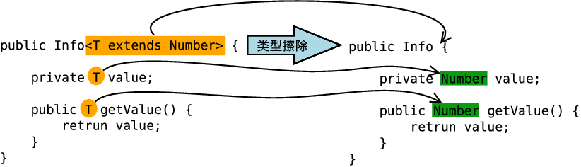

- 擦除方法定义中的类型参数

擦除方法定义中的类型参数原则和擦除类定义中的类型参数是一样的，这里仅以擦除方法定义中的有限制类型参数为例。
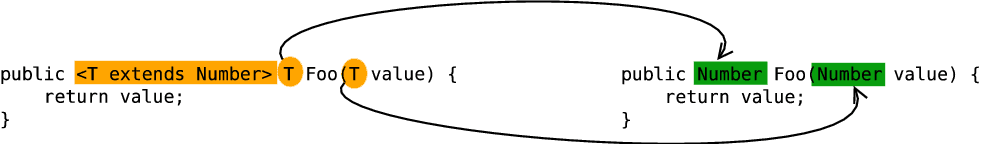

## 有没有可能2个不相等的对象有相同的hashcode?

- 如果两个对象equals，Java运行时环境会认为他们的hashcode一定相等
- 如果两个对象不equals，他们的hashcode有可能相等
- 如果两个对象hashcode相等，他们不一定equals
- 如果两个对象hashcode不相等，他们一定不equals

## 用过哪些Map类，都有什么区别，HashMap是线程安全的吗,并发下使用的Map是什么，他们内部原理分别是什么，比如存储方式，hashcode，扩容，默认容量等。
有HashMap、HashTable、LinkedHashMap、TreeMap
在Map中插入，删除，定位元素：HashMap
要按照自定义顺序或自然顺序遍历：TreeMap
要求输入顺序和输出顺序相同：LinkedHashMap
从内部数据结构分析：

- HashMap 数组+链表/红黑树
- HashTable 数组+链表
- LinkedHashMap 双向链表
- TreeMap 红黑树

从线程安全分析：

- HashMap 非线程安全
- HashTable 线程安全的
- LinkedHashMap 非线程安全
- TreeMap 非线程安全的

## Java中的HashMap内部是如何工作的
在JDK8中,HashMap底层是采用“数组+链表+红黑树”来实现的。
HashMap是基于哈希算法来确定元素的位置（槽）的,当我们向集合中存入数据时,它会计算传入的Key的哈希值,并利用哈希值取余来确定槽的位置。
如果元素发生碰撞,也就是这个槽已经存在其他的元素了,则HashMap会通过链表将这些元素组织起来。如果碰撞进一步加剧,某个链表的长度达到了8,则HashMap会创建红黑树来代替这个链表,从而提高对这个槽中数据的查找的速度。
 HashMap中,数组的默认初始容量为16,这个容量会以2的指数进行扩容。
具体来说,当数组中的元素达到一定比例的时候HashMap就会扩容,这个比例叫做负载因子,默认为0.75。 
Put()方法的执行过程中,主要包含四个步骤：
 1. 判断数组,若发现数组为空,则进行首次扩容。 
2. 判断头节点,若发现头节点为空,则新建链表节点,存入数组。 
3. 判断头节点,若发现头节点非空,则将元素插入槽内。

- 1. 若元素的key与头节点一致,则直接覆盖头节点。
- 2. 若元素为树型节点,则将元素追加到树中。 
- 3. 若元素为链表节点,则将元素追加到链表中。（追加后,需要判断链表长度以决定是否转为红黑树。若链表长度达到8、数组容量未达到64,则扩容。若链表长度达到8、数组容量达到64,则转为红黑树。）
- 4. 插入元素后,判断元素的个数,若发现超过阈值则再次扩容。 

扩容机制 向HashMap中添加数据时,有三个条件会触发它的扩容行为： 
1. 如果数组为空,则进行首次扩容。 
2. 将元素接入链表后,如果链表长度达到8,并且数组长度小于64,则扩容。 
3. 添加后,如果数组中元素超过阈值,即比例超出限制（默认为0.75）,则扩容。 并且,每次扩容时都是将容量翻倍,即创建一个2倍大的新数组,然后再将旧数组中的数组迁移到新数组里。由于HashMap中数组的容量为2^N

## JAVA8的ConcurrentHashMap为什么放弃了分段锁，有什么问题吗，如果你来设计，你如何设计？
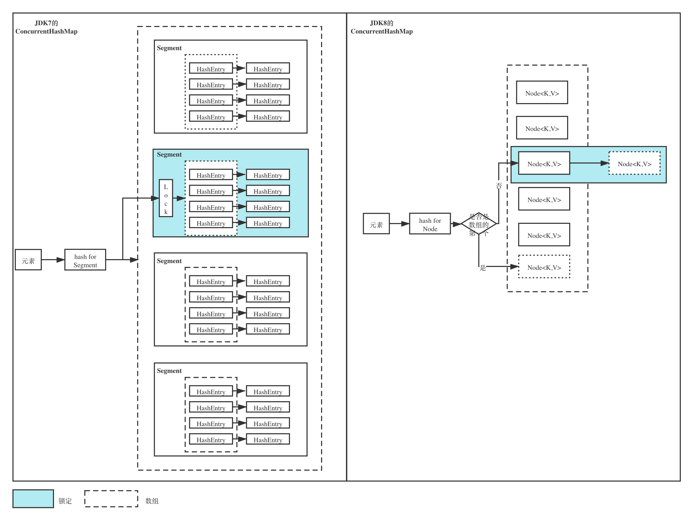

### JDK1.7中设计的分段锁

Segment继承了重入锁ReentrantLock，有了锁的功能，每个锁控制的是一段，当每个Segment越来越大时，锁的粒度就变得有些大了，具体分段数量由concurrencyLevel字段来控制。

- 分段锁的优势在于保证在操作不同段 map 的时候可以并发执行，操作同段 map 的时候，进行锁的竞争和等待。这相对于直接对整个map同步synchronized是有优势的。
- 缺点在于分成很多段时会比较浪费内存空间(不连续，碎片化); 操作map时竞争同一个分段锁的概率非常小时，分段锁反而会造成更新等操作的长时间等待; 当某个段很大时，分段锁的性能会下降。

因为在 JDK7 中 `Segment` 继承了重入锁ReentrantLock,但是大家有没有想过，如果说每个 `Segment` 在增长的时候,那你有没有考虑过这时候锁的粒度也会在不断的增长。
一个Segment里包含一个HashEntry数组，每个锁控制的是一段，那么如果分成很多个段的时候，这时候加锁的分段还是不连续的，是不是就会造成内存空间的浪费。所以问题一出现了，分段锁在某些特定的情况下是会对内存造成影响的，什么情况呢？我们倒着推回去就知道：
1.每个锁控制的是一段，当分段很多，并且加锁的分段不连续的时候，内存空间的浪费比较严重。
大家都知道，并发是什么样子的，就相当于百米赛跑，你是第一，我是第二这种形式，同样的，线程也是这样的，在并发操作中，因为分段锁的存在，线程操作的时候，争抢同一个分段锁的几率会小很多，既然小了，那么应该是优点了，但是大家有没有想过如果这一分块的分段很大的时候，那么操作的时间是不是就会变的更长了。
所以第二个问题出现了：
如果某个分段特别的大，那么就会影响效率，耽误时间。所以，这也是为什么在 JDK8 不在继续使用分段锁的原因。

### JDK8 的 ConcurrentHashMap 使用的是什么？
从上面的分析中，我们得出了 JDK7 中的 ConcurrentHashMap 使用的是 Segment 和 HashEntry，而在 JDK8 中 ConcurrentHashMap 就变了，阿粉现在这里给大家把这个抛出来，我们再分析， JDK8 中的 ConcurrentHashMap 使用的是 synchronized 和 CAS 和 HashEntry 和红黑树。


ConcurrentHashMap 和 HashMap 一样，使用了红黑树，而在 ConcurrentHashMap 中则是取消了Segment分段锁的数据结构，取而代之的是Node数组+链表+红黑树的结构。
为什么要这么做呢？
因为这样就实现了对每一行数据进行加锁，减少并发冲突。
实际上我们也可以这么理解，就是在 JDK7 中，使用的是分段锁，在 JDK8 中使用的是 “读写锁” 毕竟采用了 CAS 和 Synchronized 来保证线程的安全。

## Error和Exception的区别，CheckedException，RuntimeException的区别
先搞清楚它们三者的关系。Error与Exception都继承自Throwable，而RuntimeException则继承自Exception。在Java中只有Throwable类型的实例才可以被抛出（throw）或捕获（catch）。
Error和Exception体现了Java平台设计者对不同异常情况的分类。Exception是程序正常运行中可以预料的意外情况，可能并且应该被捕获，进行相应处理。Error则是指在正常情况下，不大可能出现的情况，绝大部分的Error都会导致程序（比如JVM）处于非正常的、不可恢复状态。既然是非正常情况，所以不便于也不需要捕获，常见的比如OutOfMemoryError，其为Error的子类。
再谈谈Checked Exception 与 Runtime Exception的区别：

1. Checked Exception 的基类是 `Exception`; Runtime Exception 的基类是 `RuntimeException` (不过 `RuntimeException` 的父类也是 `Exception`).
2. Checked Exception 要求必须捕获. 一个方法内如果抛出了 Checked Exception, 必须要么 `catch`, 要么给方法声明 `throws` 以交给上一层去处理, 如果漏写了 `catch` 会直接通不过编译. Runtime Exception 就没这个要求, 不强制 `catch` 或 `throws`, 这样对于明显不会异常的代码段就不必处理了.

## 在自己的代码中，如果创建一个java.lang.String类，这个类是否可以被类加载器加载？为什么。

### 类加载机制


- 启动类加载器：由C++实现，负责加载JAVA_HOME\lib目录中的，或通过-Xbootclasspath参数指定路径中的，且被虚拟机认可（按文件名识别，如rt.jar）的类。
- 扩展类加载器：负责加载JAVA_HOME\lib\ext目录中的，或通过java.ext.dirs系统变量指定路径中的类库。
- 应用程序类加载器：负责加载用户路径（classpath）上的类库。
- 自定义类加载器：通过继承java.lang.ClassLoader实现自定义的类加载器。

### 双亲委派机制
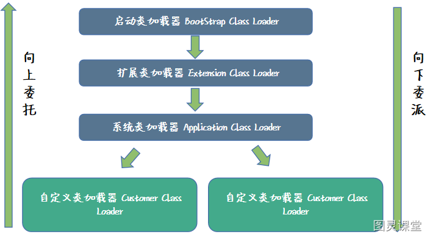
如果一个类加载器收到了类加载的请求，它首先不会自己尝试去加载这个类，而是把这个请求委派给父类加载器，每一个层次的类加载器都是加此，因此所有的加载请求最终到达顶层的启动类加载器，只有当父类加载器反馈自己无法完成加载请求时（指它的搜索范围没有找到所需的类），子类加载器才会尝试自己去加载。
各个类加载器之间是组合关系，并非继承关系。
当一个类加载器收到类加载的请求，它将这个加载请求委派给父类加载器进行加载，每一层加载器都是如此，最终，所有的请求都会传送到启动类加载器中。只有当父类加载器自己无法完成加载请求时，子类加载器才会尝试自己加载。
双亲委派模型可以确保安全性，可以保证所有的Java类库都是由启动类加载器加载。如用户编写的java.lang.Object，加载请求传递到启动类加载器，启动类加载的是系统中的Object对象，而用户编写的java.lang.Object不会被加载。如用户编写的java.lang.virus类，加载请求传递到启动类加载器，启动类加载器发现virus类并不是核心Java类，无法进行加载，将会由具体的子类加载器进行加载，而经过不同加载器进行加载的类是无法访问彼此的。由不同加载器加载的类处于不同的运行时包。所有的访问权限都是基于同一个运行时包而言的。 

## 简单说说你了解的类加载器，可以打破双亲委派么，怎么打破。
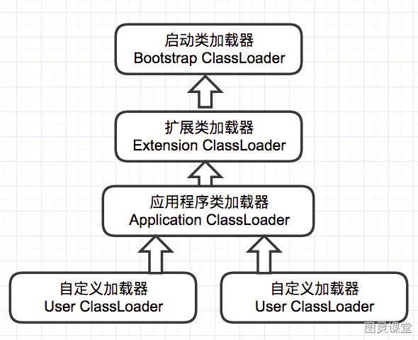

- 启动类加载器：由C++实现，负责加载JAVA_HOME\lib目录中的，或通过-Xbootclasspath参数指定路径中的，且被虚拟机认可（按文件名识别，如rt.jar）的类。
- 扩展类加载器：负责加载JAVA_HOME\lib\ext目录中的，或通过java.ext.dirs系统变量指定路径中的类库。
- 应用程序类加载器：负责加载用户路径（classpath）上的类库。
- 自定义类加载器：通过继承java.lang.ClassLoader实现自定义的类加载器。

**什么是双亲委派机制？**
为了防止内存中存在多份同样的字节码，使用了双亲委派机制（它不会自己去尝试加载类，而是把请求委托给父加载器去完成，依次向上），双亲委派模型可以确保安全性，可以保证所有的Java类库都是由启动类加载器加载。
**什么是打破了双亲委派机制？**
因为加载class核心的方法在LoaderClass类的loadClass方法上（双亲委派机制的核心实现），那只要我自定义个ClassLoader，重写loadClass方法（不依照往上开始寻找类加载器），那就算是打破双亲委派机制了。
**Tomcat是怎么打破双亲委派机制的呢？**
虽说现在都流行使用 springboot 开发 web 应用，Tomcat 内嵌在 springboot 中。而在此之前，我们会使用最原生的方式，servlet + Tomcat 的方式开发和部署 web 程序。
一个 Tomcat 可能会部署多个这样的 web 应用，不同的 web 应用可能会依赖同一个第三方库的不同版本，为了保证每个 web 应用的类库都是独立的，需要实现类隔离。而Tomcat 的自定义类加载器 **WebAppClassLoader** 解决了这个问题。
每一个 web 应用都会对应一个 **WebAppClassLoader** 实例，不同的类加载器实例加载的类是不同的，Web应用之间通各自的类加载器相互隔离。
当然 Tomcat自定义类加载器不只解决上面的问题，**WebAppClassLoader 打破了双亲委派机制，即它首先自己尝试去加载某个类，如果找不到再代理给父类加载器，其目的是优先加载Web应用定义的类**。
Tomcat 的类加载器是怎么打破双亲委派的机制的。我们先看代码：

#### findClass 方法
```java
@Override
public Class<?> findClass(String name) throws ClassNotFoundException {
    // Ask our superclass to locate this class, if possible
    // (throws ClassNotFoundException if it is not found)
    Class<?> clazz = null;

    // 先在自己的 Web 应用目录下查找 class
    clazz = findClassInternal(name);

    // 找不到 在交由父类来处理
    if ((clazz == null) && hasExternalRepositories) {  
        clazz = super.findClass(name);
    }
    if (clazz == null) {
         throw new ClassNotFoundException(name);
    }
    return clazz;
}
```
对于 Tomcat 的类加载的 findClass 方法:

- 首先在 web 目录下查找。（重要）
- 找不到再交由父类的 findClass 来处理。
- 都找不到，那就抛出 ClassNotFoundException。

#### loadClass方法
```java
public Class<?> loadClass(String name, boolean resolve) throws ClassNotFoundException {
    synchronized (getClassLoadingLock(name)) {
        Class<?> clazz = null;
        //1. 先在本地cache查找该类是否已经加载过
        clazz = findLoadedClass0(name);
        if (clazz != null) {
            if (resolve)
                resolveClass(clazz);
            return clazz;
        }
        //2. 从系统类加载器的cache中查找是否加载过
        clazz = findLoadedClass(name);
        if (clazz != null) {
            if (resolve)
                resolveClass(clazz);
            return clazz;
        }
       // 3. 尝试用ExtClassLoader类加载器类加载
        ClassLoader javaseLoader = getJavaseClassLoader();
        try {
            clazz = javaseLoader.loadClass(name);
            if (clazz != null) {
                if (resolve)
                    resolveClass(clazz);
                return clazz;
            }
        } catch (ClassNotFoundException e) {
            // Ignore
        }
        // 4. 尝试在本地目录搜索class并加载
        try {
            clazz = findClass(name);
            if (clazz != null) {
                if (resolve)
                    resolveClass(clazz);
                return clazz;
            }
        } catch (ClassNotFoundException e) {
            // Ignore
        }
        // 5. 尝试用系统类加载器(也就是AppClassLoader)来加载
            try {
                clazz = Class.forName(name, false, parent);
                if (clazz != null) {
                    if (resolve)
                        resolveClass(clazz);
                    return clazz;
                }
            } catch (ClassNotFoundException e) {
                // Ignore
            }
       }
    //6. 上述过程都加载失败，抛出异常
    throw new ClassNotFoundException(name);
}
```
加载的步骤：

1. 先在本地cache查找该类是否已经加载过，看看 Tomcat 有没有加载过这个类。
2. 如果Tomcat 没有加载过这个类，则从系统类加载器的cache中查找是否加载过。
3. 如果没有加载过这个类，尝试用ExtClassLoader类加载器类加载，重点来了，这里并没有首先使用 AppClassLoader 来加载类。这个Tomcat 的 WebAPPClassLoader 违背了双亲委派机制，直接使用了 ExtClassLoader来加载类。这里注意 ExtClassLoader 双亲委派依然有效，ExtClassLoader 就会使用 Bootstrap ClassLoader 来对类进行加载，保证了 Jre 里面的核心类不会被重复加载。 比如在 Web 中加载一个 Object 类。WebAppClassLoader → ExtClassLoader → Bootstrap ClassLoader，这个加载链，就保证了 Object 不会被重复加载。
4. 如果 BoostrapClassLoader，没有加载成功，就会调用自己的 findClass 方法由自己来对类进行加载，findClass 加载类的地址是自己本 web 应用下的 class。
5. **加载依然失败，才使用 AppClassLoader 继续加载。**
6. 都没有加载成功的话，抛出异常。

总结一下以上步骤，WebAppClassLoader 加载类的时候，故意打破了JVM 双亲委派机制，绕开了 AppClassLoader，直接先使用 ExtClassLoader 来加载类。

- 保证了基础类不会被同时加载。
- 由保证了在同一个 Tomcat 下不同 web 之间的 class 是相互隔离的。

## 你们线上应用的JVM参数有哪些？
Java HotSpot VM中 **-XX:** 的可配置参数列表进行描述；这些参数可以被松散的聚合成三类：
**行为参数**（Behavioral Options）：用于改变jvm的一些基础行为； 
**性能调优**（Performance Tuning）：用于jvm的性能调优； 
**调试参数**（Debugging Options）：一般用于打开跟踪、打印、输出等jvm参数，用于显示jvm更加详细的信息；

### 行为参数
| 参数及其默认值 | 描述 |
| --- | --- |
| -XX:-DisableExplicitGC | 禁止调用System.gc()；但jvm的gc仍然有效 |
| -XX:+MaxFDLimit | 最大化文件描述符的数量限制 |
| -XX:+ScavengeBeforeFullGC | 新生代GC优先于Full GC执行 |
| -XX:+UseGCOverheadLimit | 在抛出OOM之前限制jvm耗费在GC上的时间比例 |
| -XX:-UseConcMarkSweepGC | 对老生代采用并发标记交换算法进行GC；指多个线程并发执行GC，一般适用于多处理器系统中，可以提高GC的效率，但算法复杂，系统消耗较大； |
| -XX:-UseParallelGC | 启用并行GC；指GC运行时，对应用程序运行没有影响，GC和app两者的线程在并发执行，这样可以最大限度不影响app的运行； |
| -XX:-UseParallelOldGC | 对Full GC启用并行，当-XX:-UseParallelGC启用时该项自动启用 |
| -XX:-UseSerialGC | 启用串行GC；jvm的默认GC方式，一般适用于小型应用和单处理器，算法比较简单，GC效率也较高，但可能会给应用带来停顿； |
| -XX:+UseThreadPriorities | 启用本地线程优先级 |


### **性能调优**
| 参数及其默认值 | 描述 |
| --- | --- |
| -XX:LargePageSizeInBytes=4m | 设置用于Java堆的大页面尺寸 |
| -XX:MaxHeapFreeRatio=70 | GC后java堆中空闲量占的最大比例 |
| -XX:MaxNewSize=size | 新生成对象能占用内存的最大值 |
| -XX:MaxPermSize=64m | 老生代对象能占用内存的最大值 |
| -XX:MinHeapFreeRatio=40 | GC后java堆中空闲量占的最小比例 |
| -XX:NewRatio=2 | 新生代内存容量与老生代内存容量的比例 |
| -XX:NewSize=2.125m | 新生代对象生成时占用内存的默认值 |
| -XX:ReservedCodeCacheSize=32m | 保留代码占用的内存容量 |
| -XX:ThreadStackSize=512 | 设置线程栈大小，若为0则使用系统默认值 |
| -XX:+UseLargePages | 使用大页面内存 |
| -XX:PretenureSizeThreshold=10000 | 大于指定大小的对象，直接进入老年代 |
| -XX:MaxTenuringThreshold=15 | 晋升老年代的年龄阀值 |
| -XX:+HandlePromotionFailure=true | 关闭空间分配担保 |


### 调试参数
| 参数及其默认值 | 描述 |
| --- | --- |
| -XX:-CITime | 打印消耗在JIT编译的时间 |
| -XX:ErrorFile=./hs_err_pid<pid>.log | 保存错误日志或者数据到文件中 |
| -XX:-ExtendedDTraceProbes | 开启solaris特有的dtrace探针 |
| -XX:HeapDumpPath=./java_pid<pid>.hprof | 指定导出堆信息时的路径或文件名 |
| -XX:-HeapDumpOnOutOfMemoryError | 当首次遭遇OOM时导出此时堆中相关信息 |
| -XX:OnError="<cmd args>;<cmd args>" | 出现致命ERROR之后运行自定义命令 |
| -XX:OnOutOfMemoryError="<cmd args>;<cmd args>" | 当首次遭遇OOM时执行自定义命令 |
| -XX:-PrintClassHistogram | 遇到Ctrl-Break后打印类实例的柱状信息，与jmap -histo功能相同 |
| -XX:-PrintConcurrentLocks | 遇到Ctrl-Break后打印并发锁的相关信息，与jstack -l功能相同 |
| -XX:-PrintCommandLineFlags | 打印在命令行中出现过的标记 |
| -XX:-PrintCompilation | 当一个方法被编译时打印相关信息 |
| -XX:-PrintGC | 每次GC时打印相关信息 |
| -XX:-PrintGC Details | 每次GC时打印详细信息 |
| -XX:-PrintGCTimeStamps | 打印每次GC的时间戳 |
| -XX:-TraceClassLoading | 跟踪类的加载信息 |
| -XX:-TraceClassLoadingPreorder | 跟踪被引用到的所有类的加载信息 |
| -XX:-TraceClassResolution | 跟踪常量池 |
| -XX:-TraceClassUnloading | 跟踪类的卸载信息 |
| -XX:-TraceLoaderConstraints | 跟踪类加载器约束的相关信息 |


### CAS是一种什么样的同步机制？
在高并发的业务场景下，线程安全问题是必须考虑的，在JDK5之前，可以通过synchronized或Lock来保证同步，从而达到线程安全的目的。但synchronized或Lock方案属于互斥锁的方案，比较重量级，加锁、释放锁都会引起性能损耗问题。
而在某些场景下，我们是可以通过JUC提供的CAS机制实现无锁的解决方案，或者说是它基于类似于乐观锁的方案，来达到非阻塞同步的方式保证线程安全。
CAS是Compare And Swap的缩写，直译就是比较并交换。CAS是现代CPU广泛支持的一种对内存中的共享数据进行操作的一种特殊指令，这个指令会对内存中的共享数据做原子的读写操作。其作用是让CPU比较内存中某个值是否和预期的值相同，如果相同则将这个值更新为新值，不相同则不做更新。
本质上来讲CAS是一种无锁的解决方案，也是一种基于乐观锁的操作，可以保证在多线程并发中保障共享资源的原子性操作，相对于synchronized或Lock来说，是一种轻量级的实现方案。
Java中大量使用了CAS机制来实现多线程下数据更新的原子化操作，比如AtomicInteger、CurrentHashMap当中都有CAS的应用。但Java中并没有直接实现CAS，CAS相关的实现是借助C/C++调用CPU指令来实现的，效率很高，但Java代码需通过JNI才能调用。比如，Unsafe类提供的CAS方法（如compareAndSwapXXX）底层实现即为CPU指令cmpxchg。
CAS的基本流程：
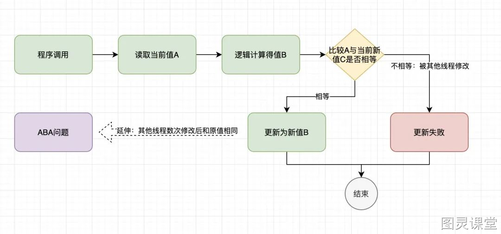
在上图中涉及到三个值的比较和操作：修改之前获取的（待修改）值A，业务逻辑计算的新值B，以及待修改值对应的内存位置的C。
整个处理流程中，假设内存中存在一个变量i，它在内存中对应的值是A（第一次读取），此时经过业务处理之后，要把它更新成B，那么在更新之前会再读取一下i现在的值C，如果在业务处理的过程中i的值并没有发生变化，也就是A和C相同，才会把i更新（交换）为新值B。如果A和C不相同，那说明在业务计算时，i的值发生了变化，则不更新（交换）成B。最后，CPU会将旧的数值返回。而上述的一系列操作由CPU指令来保证是原子的。
在《Java并发编程实践》中对CAS进行了更加通俗的描述：我认为原有的值应该是什么，如果是，则将原有的值更新为新值，否则不做修改，并告诉我原来的值是多少。
在上述路程中，我们可以很清晰的看到乐观锁的思路，而且这期间并没有使用到锁。因此，相对于synchronized等悲观锁的实现，效率要高非常多。
CAS的缺点：

- 循环时间长，开销大； 
- 只能保证一个共享变量的原子操作；  
- ABA问题；

**循环时间长开销大**
在分析Unsafe源代码的时候我们已经提到，在Unsafe的实现中使用了自旋锁的机制。在该环节如果CAS操作失败，就需要循环进行CAS操作(do while循环同时将期望值更新为最新的)，如果长时间都不成功的话，那么会造成CPU极大的开销。如果JVM能支持处理器提供的pause指令那么效率会有一定的提升。
**只能保证一个共享变量的原子操作**
在最初的实例中，可以看出是针对一个共享变量使用了CAS机制，可以保证原子性操作。但如果存在多个共享变量，或一整个代码块的逻辑需要保证线程安全，CAS就无法保证原子性操作了，此时就需要考虑采用加锁方式（悲观锁）保证原子性，或者有一个取巧的办法，把多个共享变量合并成一个共享变量进行CAS操作。
**ABA问题**
虽然使用CAS可以实现非阻塞式的原子性操作，但是会产生ABA问题，ABA问题出现的基本流程：

- 进程P1在共享变量中读到值为A； 
- P1被抢占了，进程P2执行；  
- P2把共享变量里的值从A改成了B，再改回到A，此时被P1抢占；  
- P1回来看到共享变量里的值没有被改变，于是继续执行；  

虽然P1以为变量值没有改变，继续执行了，但是这个会引发一些潜在的问题。ABA问题最容易发生在lock free的算法中的，CAS首当其冲，因为CAS判断的是指针的地址。如果这个地址被重用了呢，问题就很大了（地址被重用是很经常发生的，一个内存分配后释放了，再分配，很有可能还是原来的地址）。
维基百科上给了一个形象的例子：你拿着一个装满钱的手提箱在飞机场，此时过来了一个火辣性感的美女，然后她很暖昧地挑逗着你，并趁你不注意，把用一个一模一样的手提箱和你那装满钱的箱子调了个包，然后就离开了，你看到你的手提箱还在那，于是就提着手提箱去赶飞机去了。
ABA问题的解决思路就是使用版本号：在变量前面追加上版本号，每次变量更新的时候把版本号加1，那么A->B->A就会变成1A->2B->3A。
另外，从Java 1.5开始，JDK的Atomic包里提供了一个类AtomicStampedReference来解决ABA问题。这个类的compareAndSet方法的作用是首先检查当前引用是否等于预期引用，并且检查当前标志是否等于预期标志，如果全部相等，则以原子方式将该引用和该标志的值设置为给定的更新值。

## 内存溢出一般发生在哪个区？永久代会不会导致内存溢出？

### 堆溢出
这种场景最为常见，报错信息：
```java
java.lang.OutOfMemoryError: Java heap space
```
**原因**
1、代码中可能存在大对象分配
2、可能存在内存泄露，导致在多次GC之后，还是无法找到一块足够大的内存容纳当前对象。
**解决方法**
1、检查是否存在大对象的分配，最有可能的是大数组分配
2、通过jmap命令，把堆内存dump下来，使用mat工具分析一下，检查是否存在内存泄露的问题
3、如果没有找到明显的内存泄露，使用 -Xmx 加大堆内存
4、还有一点容易被忽略，检查是否有大量的自定义的 Finalizable 对象，也有可能是框架内部提供的，考虑其存在的必要性

### 永久代/元空间溢出
```java
java.lang.OutOfMemoryError: PermGen spacejava.lang.OutOfMemoryError: Metaspace
```
**原因**
永久代是 HotSot 虚拟机对方法区的具体实现，存放了被虚拟机加载的类信息、常量、静态变量、JIT编译后的代码等。JDK8后，元空间替换了永久代，元空间使用的是本地内存，还有其它细节变化：字符串常量由永久代转移到堆中和永久代相关的JVM参数已移除可能原因有如下几种：
1、在Java7之前，频繁的错误使用String.intern()方法
2、运行期间生成了大量的代理类，导致方法区被撑爆，无法卸载
3、应用长时间运行，没有重启没有重启 JVM 进程一般发生在调试时，如下面 tomcat 官网的一个 FAQ：
> Why does the memory usage increase when I redeploy a web application? That is because your web application has a memory leak. A common issue are “PermGen” memory leaks. They happen because the Classloader (and the Class objects it loaded) cannot be recycled unless some requirements are met (). They are stored in the permanent heap generation by the JVM, and when you redeploy a new class loader is created, which loads another copy of all these classes. This can cause OufOfMemoryErrors eventually. ( *) The requirement is that all classes loaded by this classloader should be able to be gc’ed at the same time.

**解决方法**
因为该OOM原因比较简单，解决方法有如下几种：
1、检查是否永久代空间或者元空间设置的过小
2、检查代码中是否存在大量的反射操作
3、dump之后通过mat检查是否存在大量由于反射生成的代理类
4、放大招，重启JVM

### 方法栈溢出
```java
java.lang.OutOfMemoryError : unable to create new native Thread
```
**原因**
出现这种异常，基本上都是创建的了大量的线程导致的，以前碰到过一次，通过jstack出来一共8000多个线程。
**解决方法**
1、通过 -Xss 降低的每个线程栈大小的容量
 2、线程总数也受到系统空闲内存和操作系统的限制，检查是否该系统下有此限制：/proc/sys/kernel/pid_max/proc/sys/kernel/thread-maxmaxuserprocess（ulimit -u）/proc/sys/vm/maxmapcount

## 线程加锁有哪些方式？synchronized和lock的区别？

1. synchronized关键字
2. Java.util.concurrent包中的lock接口和ReentrantLock实现类
| 类别 | synchronized | Lock |
| --- | --- | --- |
| 存在层次 | Java的关键字，在jvm层面上 | 是一个接口 |
| 锁的释放 | 1、以获取锁的线程执行完同步代码，释放锁   2、线程执行发生异常，jvm会让线程释放锁 | 在finally中必须释放锁，不然容易造成线程死锁 |
| 锁的获取 | 假设A线程获得锁，B线程等待。如果A线程阻塞，B线程会一直等待 | 分情况而定，Lock有多个锁获取的方式，大致就是可以尝试获得锁，线程可以不用一直等待(可以通过tryLock判断有没有锁) |
| 锁状态 | 无法判断 | 可以判断 |
| 锁类型 | 可重入 不可中断 非公平 | 可重入 可判断 可公平（两者皆可） |
| 性能 | 少量同步 | 大量同步 |

Synchronized和Lock的区别：Synchronized编码更简单，锁机制由JVM维护，在竞争不激烈的情况下性能更好。Lock功能更强大更灵活，竞争激烈时性能较好。

- 性能不一样：资源竞争激励的情况下，lock性能会比synchronized好，竞争不激励的情况下，synchronized比lock性能好，synchronized会根据锁的竞争情况，从偏向锁-->轻量级锁-->重量级锁升级，而且编程更简单。
- 锁机制不一样：synchronized是在JVM层面实现的，系统会监控锁的释放与否。lock是JDK代码实现的，需要手动释放，在finally块中释放。可以采用非阻塞的方式获取锁。
- synchronized的编程更简洁，lock的功能更多更灵活，缺点是一定要在finally里面 unlock()资源才行。
- 法不一样：synchronized可以用在代码块上，方法上。lock只能写在代码里，不能直接修改方法。

Lock支持的功能:

- 公平锁：Synchronized是非公平锁，Lock支持公平锁，默认非公平锁
- 可中断锁：ReentrantLock提供了lockInterruptibly（）的功能，可以中断争夺锁的操作，抢锁的时候会check是否被中断，中断直接抛出异常，退出抢锁。而Synchronized只有抢锁的过程，不可干预，直到抢到锁以后，才可以编码控制锁的释放。
- 快速反馈锁：ReentrantLock提供了trylock（） 和 trylock（tryTimes）的功能，不等待或者限定时间等待获取锁，更灵活。可以避免死锁的发生。
- 读写锁：ReentrantReadWriteLock类实现了读写锁的功能，类似于Mysql，锁自身维护一个计数器，读锁可以并发的获取，写锁只能独占。而synchronized全是独占锁
- Condition：ReentrantLock提供了比Sync更精准的线程调度工具，Condition，一个lock可以有多个Condition，比如在生产消费的业务下，一个锁通过控制生产Condition和消费Condition精准控制。

## NIO的原理，包括哪几个组件？
NIO（Non-blocking I/O，在Java领域，也称为New I/O），是一种同步非阻塞的I/O模型，也是I/O多路复用的基础，已经被越来越多地应用到大型应用服务器，成为解决高并发与大量连接、I/O处理问题的有效方式。

- NIO 有三大核心部分：Channel（通道）、Buffer（缓冲区）、Selector（选择器） 。
- NIO 是面向缓冲区/块编程的。数据读取到一个它稍后处理的缓冲区，需要时可在缓冲区中前后移动，这就增加了处理过程中的灵活性，使用它可以提供非阻塞式的高伸缩性网络。
- Java NIO 的非阻塞模式，使一个线程从某通道发送请求或者读取数据，但是它仅能得到目前可用的数据，如果目前没有数据可用时，就什么都不会获取，而不是保持线程阻塞，所以直至数据变的可以读取之前，该线程可以继续做其他的事情。非阻塞写也是如此，一个线程请求写入一些数据到某通道，但不需要等待它完全写入，这个线程同时可以去做别的事情。
- 通俗理解：NIO 是可以做到用一个线程来处理多个操作的。假设有 10000 个请求过来,根据实际情况，可以分配 50 或者 100 个线程来处理。不像之前的阻塞 IO 那样，非得分配 10000 个。
- HTTP 2.0 使用了多路复用的技术，做到同一个连接并发处理多个请求，而且并发请求的数量比 HTTP 1.1 大了好几个数量级。

## 什么是零拷贝？
零拷贝（Zero-Copy）是一种 `I/O` 操作优化技术，可以快速高效地将数据从文件系统移动到网络接口，而不需要将其从内核空间复制到用户空间。其在 `FTP` 或者 `HTTP` 等协议中可以显著地提升性能。但是需要注意的是，并不是所有的操作系统都支持这一特性，目前只有在使用 `NIO` 和 `Epoll` 传输时才可使用该特性。
需要注意，它不能用于实现了数据加密或者压缩的文件系统上，只有传输文件的原始内容。这类原始内容也包括加密了的文件内容。

### 传统I/O操作存在的性能问题
如果服务端要提供文件传输的功能，我们能想到的最简单的方式是：将磁盘上的文件读取出来，然后通过网络协议发送给客户端。
传统 I/O 的工作方式是，数据读取和写入是从用户空间到内核空间来回复制，而内核空间的数据是通过操作系统层面的 I/O 接口从磁盘读取或写入。代码通常如下，一般会需要两个系统调用：
```java
read(file, tmp_buf, len);
write(socket, tmp_buf, len);
```
代码很简单，虽然就两行代码，但是这里面发生了不少的事情。
首先，期间共**发生了 4 次用户态与内核态的上下文切换**，因为发生了两次系统调用，一次是 `read()` ，一次是 `write()`，每次系统调用都得先从用户态切换到内核态，等内核完成任务后，再从内核态切换回用户态。
上下文切换到成本并不小，一次切换需要耗时几十纳秒到几微秒，虽然时间看上去很短，但是在高并发的场景下，这类时间容易被累积和放大，从而影响系统的性能。
其次，还**发生了 4 次数据拷贝**，其中两次是 DMA 的拷贝，另外两次则是通过 CPU 拷贝的，下面说一下这个过程：

- `第一次拷贝`，把磁盘上的数据拷贝到操作系统内核的缓冲区里，这个拷贝的过程是通过 DMA 搬运的。
- `第二次拷贝`，把内核缓冲区的数据拷贝到用户的缓冲区里，于是我们应用程序就可以使用这部分数据了，这个拷贝到过程是由 CPU 完成的。
- `第三次拷贝`，把刚才拷贝到用户的缓冲区里的数据，再拷贝到内核的 socket 的缓冲区里，这个过程依然还是由 CPU 搬运的。
- `第四次拷贝`，把内核的 socket 缓冲区里的数据，拷贝到网卡的缓冲区里，这个过程又是由 DMA 搬运的。

这种简单又传统的文件传输方式，存在冗余的上文切换和数据拷贝，在高并发系统里是非常糟糕的，多了很多不必要的开销，会严重影响系统性能。
所以，**要想提高文件传输的性能，就需要减少「用户态与内核态的上下文切换」和「内存拷贝」的次数**。
零拷贝主要是用来解决操作系统在处理 I/O 操作时，频繁复制数据的问题。关于零拷贝主要技术有 `mmap+write`、`sendfile`和`splice`等几种方式。

## 如何实现不可变的类？
一个类的对象在通过构造方法创建后如果状态不会再被改变，那么它就是一个不可变（immutable）类。
它的所有成员变量的赋值仅在构造方法中完成，不会提供任何 setter 方法供外部类去修改。
自从有了多线程，生产力就被无限地放大了，所有的程序员都爱它，因为强大的硬件能力被充分地利用了。但与此同时，所有的程序员都对它心生忌惮，因为一不小心，多线程就会把对象的状态变得混乱不堪。
为了保护状态的原子性、可见性、有序性，我们程序员可以说是竭尽所能。其中，synchronized（同步）关键字是最简单最入门的一种解决方案。
假如说类是不可变的，那么对象的状态就也是不可变的。这样的话，每次修改对象的状态，就会产生一个新的对象供不同的线程使用，我们程序员就不必再担心并发问题了。
要实现一个不可变类，必须要满足以下 4 个条件：
1）确保类是 final 的，不允许被其他类继承。
2）确保所有的成员变量（字段）是 final 的，这样的话，它们就只能在构造方法中初始化值，并且不会在随后被修改。
3）不要提供任何 setter 方法。
4）如果要修改类的状态，必须返回一个新的对象。

## 抽象类和接口的区别，类可以继承多个类么，接口可以继承多个接口么,类可以实现多个接口么？

### Interface
在 Java 中，被关键字 interface 修饰的“类”是接口。  接口： 是一系列方法的声明，是一些方法特征的集合，一个接口只有方法的特征没有方法的实现，因此这些方法可以在不同的地方被不同的类实现，而这些实现可以具有不同的行为（功能）。

1. 禁止直接为其实例化对象  接口连构造方法都没有，所以，根本不可能为其实例化对象。
2. 打破单继承局限（实现伪多重继承） 伪代码：  class A implements 接口C，接口D…
3. 接口中只能定义静态常量和抽象方法，无论普通类还是抽象类都没有如此严格的要求，因此接口既不能继承普通类也不能继承抽象类。
4. 接口只能继承接口，且可以多继承

### Abstract Class

1. 抽象方法一定包含再抽象类中
2. 抽象类不能被 实例化
3. 抽象类主要**就是用来被继承的**
4. 如果一个类继承了这个抽象类，这个类必须重写抽象类中的抽象方法
5. 当抽象类A继承抽象类B，抽象类A可以不重写B中的方法，但是一旦抽象类A要是在被C继承继承，那么就一定要在C中重写这个抽象方法
6. 抽象类或者抽象方法一定不能被final修饰的

## 继承和聚合的区别在哪？
继承指的是一个类（称为子类、子接口）继承另外的一个类（称为父类、父接口）的功能，并可以增加它自己的新功能的能力，继承是类与类或者接口与接口之间最常见的关系；在Java中此类关系通过关键字extends明确标识，在设计时一般没有争议性。
聚合是关联关系的一种特例，他体现的是整体与部分、拥有的关系，即has-a的关系，此时整体与部分之间是可分离的，他们可以具有各自的生命周期，部分可以属于多个整体对象，也可以为多个整体对象共享；比如计算机与CPU、公司与员工的关系等；表现在代码层面，和关联关系是一致的，只能从语义级别来区分。

## 描述动态代理的几种实现方式，分别说出相应的优缺点
首先我们要区分两个含义上的静态代理和动态代理。从设计模式上来讲：静态代理和动态代理都属于代理模式。
静态代理模式下，代码本身的适用性受到局限，我们可以说是一种"硬编码"的方式：代理类通过构造函数引用`特定的被代理的类`，并在执行被代理类的方法时执行一些代理逻辑，达到扩展的目的，因此静态代理的扩展成本较高，不够具有通用性，而且一定程度的通用必须依赖接口。
为了解决静态代理的通用性问题，产生了动态代理模式，动态代理的实现底层我们不会自己去写，通常是使用已有的动态代理技术，在Java生态中，目前普遍使用的是JDK自带的代理和CGLib提供的类库。
对比：
（1）JDK动态代理实现了被代理对象的接口，CGLib动态代理继承了被代理对象。
（2）JDK动态代理和CGLib动态代理都在运行期生成字节码，JDK动态代理直接写Class字节码，CGLib动态代理使用ASM框架写Class字节码。CGLib动态代理实现更复杂，生成代理类比JDK动态代理效率低。
（3）JDK动态代理调用代理方法是通过反射机制调用的，CGLib动态代理是通过FastClass机制（索引分配直接调用）直接调用方法的，因此CGLib动态代理的执行效率更高。
开发中，我们不必太过纠结性能问题，可以根据自己的实际需求灵活选择。

## 如何判断一个对象是否可以回收？

### 引用计数法
主要思想是：给对象添加一个引用计数器，这个对象被引用一次，计数器就加1；不再引用了，计数器就减1。如果一个对象的引用计数器为0，说明没有人使用这个对象，那么这个对象就可以被回收了。这种方法实现起来比较简单，效率也比较高，大多数情况下都是有效的。但是，这种方法有一个漏洞。比如A.property = B，B.property = A，A和B两个对象互相引用，并且没有其他对象引用A和B。按照引用计数法的思想，A和B对象的引用计数器都不为0，都不能被释放，但实际情况是A和B已经没人使用他们了，这就造成了内存泄漏。所以，引用计数法虽然实现简单，**但并不是一个完美的解决方案，实际中的Java也没有采用它。**

### 可达性分析算法
首先确定确定一系列肯定不能被回收的对象，即GC Roots。然后，从这些GC Roots出发，向下搜索，去寻找它直接和间接引用的对象。最后，如果一个对象没有被GC Roots直接或间接地引用，那么这个对象就可以被回收了。这种方法可以有效解决循环引用的问题，实际中Java也是采用这种判断方法。那么问题来了，哪些对象可以作为GC Roots呢？
第一类，系统类对象（System Class）。比如，java.lang.String的Class对象，这个也很好理解，如果这些核心的系统类对象被回收了，程序就没办法运行了。
第二类，native方法引用的对象。
第三类，活动线程中正在引用的对象。可以看出，代码中变量o指向的Object对象可以被当作GC Roots。
第四类，正在加锁的对象。
在可达性分析算法中，判断一个对象是不是可以被回收，主要看从GC Roots出发是否可以找到一个引用指向该对象。java中的引用一共有四种，按照引用的强弱依次为强引用（Strong Reference）、软引用（Soft Reference）、弱引用（Weak Reference）、虚引用（Phantom Reference）。这样就可以对不同引用指向的对象采取不同的回收策略。比如一个强引用指向一个对象，那么这个对象肯定不会被回收，哪怕发生OOM。而对于弱引用指向的对象，只要发生垃圾回收，该对象就会被回收。下面详细介绍下不同引用的用法。
**强引用** 所谓强引用，就是平时使用最多的，类似于Object obj = new Object()的引用。垃圾回收器永远不会回收被强引用指向的对象。
**软引用** 在Java中使用SoftReference类来实现软引用。在下面的代码中，softReference作为软用指向一个Object对象，而otherObject变量可以通过软引用的get方法间接引用到Object对象。
**弱引用**，相比于软引用，它的引用程度更弱。只要发生垃圾回收，弱引用指向的对象都会被回收。话不多说，直接上代码。跟软引用的demo差不多，唯一不同的是每个byte的数组的大小变成了2K，这样堆肯定放的下，也不会发生垃圾回收。
**虚引用** 与软引用和虚引用不同，虚引用必须配合引用队列使用，而且不能通过虚引用获取到虚引用指向的对象。在Java中虚引用使用PhantomReference类来表示，从PhantomReference的源码可以看出调用虚引用的get方法始终返回的是null，而且PhantomReference只提供了包含引用队列的有参构造器，这也就是说虚引用必须结合引用队列使用。

### 总结

- JVM采用可达性分析算法来判断堆中有哪些对象可以被回收。
- 主要有四类对象可作为GC Roots：系统类对象、Native方法引用的对象、活动线程引用的对象以及正在加锁的对象。
- Java中常用的引用主要有四种，强引用、软引用、弱引用和虚引用，对不同引用指向的对象，JVM有不同的回收策略。
- 对于强引用指向的对象，垃圾回收器不会将其回收，即使是发生OOM。
- 对于软引用指向的对象，当内存不够时，垃圾回收器会将其回收。这个特点可以用来实现缓存，当内存不足时JVM会自动清理掉这些缓存。
- 对于弱引用指向的对象，当发生垃圾回收时，垃圾回收器会将其回收。
- 对于虚引用，必须配合引用队列使用，而且不能通过虚引用获取到虚引用指向的对象，为一个对象关联虚引用的唯一目的就是在该对象被垃圾回收时收到一个系统通知。

## 什么情况下会触发Full GC？

1.  **调用** **System.gc()** 
只是建议虚拟机执行 Full GC，但是虚拟机不一定真正去执行。不建议使用这种方式，而是让虚拟机管理内存。 
2.  **未指定老年代和新生代大小**
堆伸缩时会产生Full GC,所以一定要配置-Xmx、-Xms 
3.  **老年代空间不足** 
老年代空间不足的常见场景比如大对象、大数组直接进入老年代、长期存活的对象进入老年代等。为了避免以上原因引起的 Full GC，应当尽量不要创建过大的对象以及数组。
除此之外，可以通过 -Xmn 虚拟机参数调大新生代的大小，让对象尽量在新生代被回收掉，不进入老年代。
还可以通过 -XX:MaxTenuringThreshold 调大对象进入老年代的年龄，让对象在新生代多存活一段时间。
在执行Full GC后空间仍然不足，则抛出错误：`java.lang.OutOfMemoryError: Java heap space` 
4.  **JDK 1.7** **及以前的（永久代）空间满**
在 JDK 1.7 及以前，HotSpot 虚拟机中的方法区是用永久代实现的，永久代中存放的为一些 Class 的信息、常量、静态变量等数据。
当系统中要加载的类、反射的类和调用的方法较多时，永久代可能会被占满，在未配置为采用 CMS GC 的情况下也会执行 Full GC。
如果经过 Full GC 仍然回收不了，那么虚拟机会抛出`java.lang.OutOfMemoryError PermGen space`为避免以上原因引起的 Full GC，可采用的方法为增大Perm Gen或转为使用 CMS GC。 
5.  **空间分配担保失败**
空间担保，下面两种情况是空间担保失败：
1、每次晋升的对象的平均大小 > 老年代剩余空间
2、Minor GC后存活的对象超过了老年代剩余空间
注意GC日志中是否有promotion failed和concurrent mode failure两种状况，当出现这两种状况的时候就有可能会触发Full GC。
promotion failed 是在进行 Minor GC时候，survivor space空间放不下只能晋升老年代，而此时老年代也空间不足时发生的。
concurrent mode failure 是在进行CMS GC过程，此时有对象要放入老年代而空间不足造成的，这种情况下会退化使用Serial Old收集器变成单线程的，此时是相当的慢的。 

## 什么是STW？
Stop-the-World，简称STW，指的是GC事件发生过程中，会产生应用程序的停顿。停顿产生时整个应用程序线程都会被暂停，没有任何响应。有点像卡死的感觉，这个停顿成为STW。
可达性分析算法中枚举根节点（GC Roots）会导致所有Java执行线程停顿。
（1）分析工作必须在一个能确保一致性的快照中进行。
（2）一致性指整个分析期间整个执行系统看起来像被冻结在某个时间点上。
（3）如果出现分析过程中对象引用关系还在不断变化，则分析结果的准确性无法保证。
被STW中断的应用程序线程会在完成GC之后恢复，频繁中断会让用户感觉像是网速不快造成电影卡带一样，所以我们需要减少STW的发生。
STW事件和采用哪款GC无关，所有的GC都有这个事件。哪怕是G1也不能完全避免Stop-the-world情况发生，只能说垃圾回收器越来越优秀，回收效率越来越高，尽可能地缩短了暂停时间。
STW是JVM在后台自动发起和自动完成的。在用户不可见的情况下，把用户正常的工作线程全部停掉。开发中不要用System.gc();会导致Stop-the-world的发生。

## JDK自带的定位问题的工具？
JDK 自带了很多命令行甚至是图形界面工具，帮助我们查看 JVM 的一些信息。接下来，我会与你介绍些常用的监控工具。你也可以先通过下面这张图了解下各种工具的基本作用：
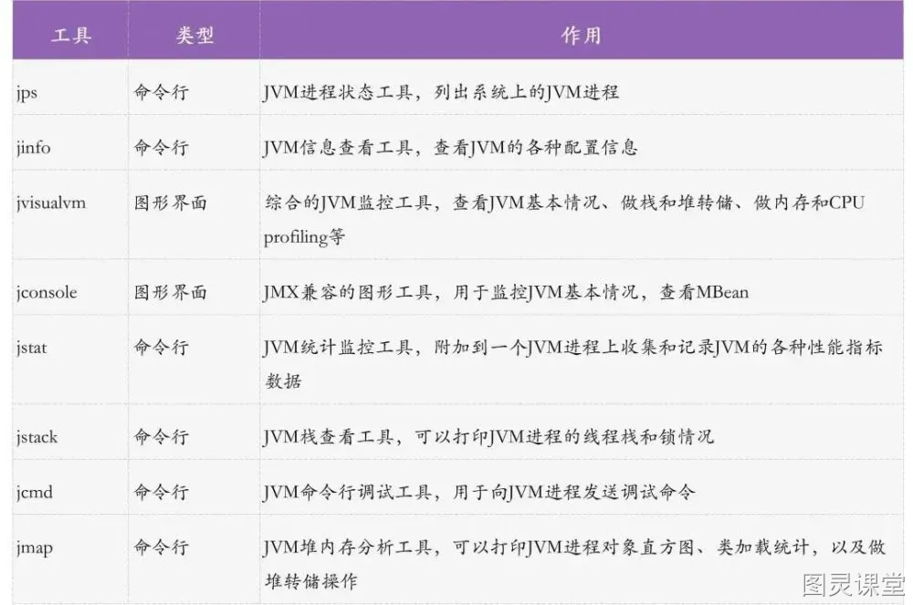

## 如何使用在线调试工具Arthas？
**什么是Arthas？**
Arthas 是一款线上监控诊断产品，通过全局视角实时查看应用 load、内存、gc、线程的状态信息，并能在不修改应用代码的情况下，对业务问题进行诊断，包括查看方法调用的出入参、异常，监测方法执行耗时，类加载信息等，大大提升线上问题排查效率。
通常，本地开发环境无法访问生产环境。如果在生产环境中遇到问题，则无法使用 IDE 远程调试。更糟糕的是，在生产环境中调试是不可接受的，因为它会暂停所有线程，导致服务暂停。
开发人员可以尝试在测试环境或者预发环境中复现生产环境中的问题。但是，某些问题无法在不同的环境中轻松复现，甚至在重新启动后就消失了。
如果您正在考虑在代码中添加一些日志以帮助解决问题，您将必须经历以下阶段：测试、预发，然后生产。这种方法效率低下，更糟糕的是，该问题可能无法解决，因为一旦 JVM 重新启动，它可能无法复现，如上文所述。
Arthas 旨在解决这些问题。开发人员可以在线解决生产问题。无需 JVM 重启，无需代码更改。 Arthas 作为观察者永远不会暂停正在运行的线程。
**Arthas能做些什么？**

1. 这个类从哪个 jar 包加载的？为什么会报各种类相关的 Exception？
2. 我改的代码为什么没有执行到？难道是我没 commit？分支搞错了？
3. 遇到问题无法在线上 debug，难道只能通过加日志再重新发布吗？
4. 线上遇到某个用户的数据处理有问题，但线上同样无法 debug，线下无法重现！
5. 是否有一个全局视角来查看系统的运行状况？
6. 有什么办法可以监控到 JVM 的实时运行状态？
7. 怎么快速定位应用的热点，生成火焰图？
8. 怎样直接从 JVM 内查找某个类的实例？

## 讲讲JAVA的反射机制
**什么是反射？**
反射就是在运行时才知道要操作的类是什么，并且可以在运行时获取类的完整构造，并调用对应的方法。
**反射的主要功能**

- 在运行时判断任意一个对象所属的类
- 在运行时构造任意一个类的对象
- 在运行时判断任意一个类所具有的成员变量和方法
- 在运行时调用任意一个对象的方法，通过反射甚至可以调用到private修饰的方法
- 生成动态代理

**反射的应用**

- Spring 框架的 IOC 基于反射创建对象和设置依赖属性。
- Spring MVC 的请求调用对应方法，也是通过反射。
- JDBC 的 Class.forName(String className) 方法，也是使用反射。

**反射的优点**

1. **增加程序的灵活性，避免将程序写死到代码里。**
2. 可以在程序运行的过程中，操作这些对象。
3. 测试时可以利用反射 API 访问类的私有成员，以保证测试代码覆盖率。

**反射的缺点**

1. 性能问题 
   1. 使用反射基本上是一种解释操作，用于字段和方法接入时要远慢于直接代码。因此Java反射机制主要应用在对灵活性和扩展性要求很高的系统框架上,普通程序不建议使用。
   2. 反射包括了一些动态类型，所以JVM无法对这些代码进行优化。因此，反射操作的效率要比那些非反射操作低得多。我们应该避免在经常被 执行的代码或对性能要求很高的程序中使用反射。
2. **使用反射会模糊程序内部逻辑** 
   1. 程序人员希望在源代码中看到程序的逻辑，反射等绕过了源代码的技术，因而会带来维护问题。反射代码比相应的直接代码更复杂。
3. 内部暴露 
   1. 由于反射允许代码执行一些在正常情况下不被允许的操作（比如访问私有的属性和方法），所以使用反射可能会导致意料之外的副作用－－代码有功能上的错误，降低可移植性。反射代码破坏了抽象性，因此当平台发生改变的时候，代码的行为就有可能也随着变化。

软件工程没有银弹。很多程序架构，尤其是三方框架，无法保证自己的封装是完美的。如果没有反射，对于外部类的私有成员，我们将一筹莫展，所以我们有了反射这一后门，为程序设计提供了更大的灵活性。工具本身并没有错，关键在于如何正确地使用。
**介绍**
机制是指在程序的运行状态中，可以构造任意一个类的对象，可以了解任意一个对象所属的类，可以了解任意一个类的成员变量和方法，可以调用任意一个对象的属性和方法。这种动态获取程序信息以及动态调用对象的功能称为Java语言的反射机制。反射被视为动态语言的关键，反射让Java成为一个准动态语言 。缺点增加不安全性。

- 反射让开发人员可以通过外部类的全路径名创建对象，并使用这些类，实现一些扩展的功能。
- 反射让开发人员可以枚举出类的全部成员，包括构造函数、属性、方法。以帮助开发者写出正确的代码。
- 测试时可以利用反射 API 访问类的私有成员，以保证测试代码覆盖率。

**反射API类**

- Field 类：提供有关类的属性信息，以及对它的动态访问权限。它是一个封装反射类的属性的类。
- Constructor 类：提供有关类的构造方法的信息，以及对它的动态访问权限。它是一个封装反射类的构造方法的类。
- Method 类：提供关于类的方法的信息，包括抽象方法。它是用来封装反射类方法的一个类。
- Class 类：表示正在运行的 Java 应用程序中的类的实例。
- Object 类：Object 是所有 Java 类的父类。所有对象都默认实现了 Object 类的方法。

## 讲讲Spring bean加载流程
Spring的bean生命周期其实最核心的分为4个步骤，只要理清三个关键的步骤，其他的只是在这三个细节中添加不同的细节实现,也就是spring的bean生明周期：
**实例化和初始化的区别**：实例化是在jvm的堆中创建了这个对象实例，此时它只是一个空的对象，所有的属性为null。而初始化的过程就是讲对象依赖的一些属性进行赋值之后，调用某些方法来开启一些默认加载。比如spring中配置的数据库属性Bean，在初始化的时候就会将这些属性填充，比如driver、jdbcurl等,然后初始化连接

#### **实例化** Instantiation
AbstractAutowireCapableBeanFactory.doCreateBean中会调用createBeanInstance()方法,该阶段主要是从beanDefinitionMap循环读取bean,获取它的属性，然后利用反射(core包下有ReflectionUtil会先强行将构造方法setAccessible(true)读取对象的构造方法(spring会自动判断是否是有参数还是无参数，以及构造方法中的参数是否可用),然后再去创建实例（newInstance）

#### **初始化**
初始化主要包括两个步骤,一个是属性填充，另一个就是具体的初始化过程
**属性赋值** PopulateBean()会对bean的依赖属性进行填充，@AutoWired注解注入的属性就发生这个阶段，假如我们的bean有很多依赖的对象，那么spring会依次调用这些依赖的对象进行实例化，注意这里可能会有循环依赖的问题。
初始化 Initialization
初始化的过程包括将初始化好的bean放入到spring的缓存中、填充我们预设的属性进一步做后置处理等

#### **使用和销毁** Destruction
在Spring将所有的bean都初始化好之后，我们的业务系统就可以调用了。而销毁主要的操作是销毁bean，主要是伴随着spring容器的关闭，此时会将spring的bean移除容器之中。此后spring的生命周期到这一步彻底结束，不再接受spring的管理和约束。

## Spring框架中的单例bean是线程安全的吗?
在Spring容器中，除了很多Spring内置的Bean以外，其他的Bean都是我们自己通过Spring配置来声明的，然后，由Spring容器统一加载。我们在Spring声明配置中通常会配置以下内容，如：class（全类名）、id（也就是Bean的唯一标识）、 scope（作用域）以及lazy-init（是否延时加载）等。之后，Spring容器根据配置内容使用对应的策略来创建Bean的实例。因此，Spring容器中的Bean其实都是根据我们自己写的类来创建的实例。因此，Spring中的Bean是否线程安全，跟Spring容器无关，只是交由Spring容器托管而已。
那么，在Spring容器中，什么样的Bean会存在线程安全问题呢？回答，这个问题之前我们得先回顾一下Spring Bean的作用域。在Spring定义的作用域中，其中有 prototype（ 多例Bean ）和 singleton （ 单例Bean）。那么，定义为 prototype 的Bean，是在每次 getBean 的时候都会创建一个新的对象。定义为 singleton 的Bean，在Spring容器中只会存在一个全局共享的实例。基于对以上Spring Bean作用域的理解，下面，我们来分析一下在Spring容器中，什么样的Bean会存在线程安全问题。
我们已经知道，多例Bean每次都会新创建新实例，也就是说线程之间不存在Bean共享的问题。因此，多例Bean是不存在线程安全问题的。
而单例Bean是所有线程共享一个实例，因此，就可能会存在线程安全问题。但是单例Bean又分为无状态Bean和有状态Bean。在多线程操作中只会对Bean的成员变量进行查询操作，不会修改成员变量的值，这样的Bean称之为无状态Bean。所以，可想而知，无状态的单例Bean是不存在线程安全问题的。但是，在多线程操作中如果需要对Bean中的成员变量进行数据更新操作，这样的Bean称之为有状态Bean，所以，有状态的单例Bean就可能存在线程安全问题。
所以，最终我们得出结论，在Spring中，只有有状态的单例Bean才会存在线程安全问题。我们在使用Spring的过程中，经常会使用到有状态的单例Bean，如果真正遇到了线程安全问题，我们又该如何处理呢？
1、将Bean的作用域由 “singleton” 单例 改为 “prototype” 多例。
2、在Bean对象中避免定义可变的成员变量，当然，这样做不太现实，就当我没说。
3、在类中定义 ThreadLocal 的成员变量，并将需要的可变成员变量保存在 ThreadLocal 中，ThreadLocal 本身就具备线程隔离的特性，这就相当于为每个线程提供了一个独立的变量副本，每个线程只需要操作自己的线程副本变量，从而解决线程安全问题。
都已经看到这里了， 相信大家应该已经知道了 Spring中的Bean是否线程安全以及如何处理Bean的线程安全问题。

## Spring AOP的实现原理
AOP技术利用一种称为“横切”的技术，解剖封装的对象内部，并将那些影响了多个类的公共行为封装到一个可重用模块，这样就能减少系统的重复代码，降低模块间的耦合度，并有利于未来的可操作性和可维护性。AOP把软件系统分为两个部分：核心关注点和横切关注点。业务处理的主要流程是核心关注点，与之关系不大的部分是横切关注点。横切关注点的一个特点是，他们经常发生在核心关注点的多处，而各处都基本相似。比如权限认证、日志、事务处理。
Spring中AOP实现原理大致分为4个阶段：

### **创建代理对象阶段**
在Spring中，创建Bean实例都是从getBean()方法开始的 _（出现getBean()动画）_，在实例创建之后，Spring容器将根据AOP的配置去匹配目标类的类名，看目标类的类名是否满足切面规则。如果满足满足切面规则，就会调用ProxyFactory创建代理Bean并缓存到IoC容器中。_（出现调用ProxyFactory创建代理Bean动画）_根据目标对象的自动选择不同的代理策略。_（出现选择代理策略动画）_如果目标类实现了接口，Spring会默认选择JDK Proxy，如果目标类没有实现接口，Spring会默认选择Cglib Proxy，当然，我们也可以通过配置强制使用Cglib Proxy。

### 拦截目标对象阶段
当用户调用目标对象的某个方法时， _（出现AopProxy对象拦截）_将会被一个叫做AopProxy的对象拦截,Spring将所有的调用策略封装到了这个对象中，它默认实现了InvocationHandler接口，也就是调用代理对象的外层拦截器。_（出现调用InvocationHandler的invoke()方法动画）_在这个接口的invoke()方法中，_（出现触发MethodInvocation的proceed()方法动画）_会触发MethodInvocation的proceed()方法。在这个方法中会按顺序执行符合所有AOP拦截规则的拦截器链。

### **调用代理对象阶段**
Spring AOP拦截器链中的每个元素被命名为MethodInterceptor，（出现反射调用Advice对象动画）其实就是切面配置中的Advice通知。这个回调通知可以简单地理解为是新生成的代理Bean中的方法。（出现执行织入代码动画）也就是我们常说的被织入的代码片段，这些被织入的代码片段会在这个阶段执行。

### **调用目标对象阶段**
MethodInterceptor接口也有一个invoke()方法，_（出现执行MethodInterceptor的invoke()方法动画）在MethodInterceptor的invoke()方法中会触发对目标对象方法的调用，也就是反射调用目标对象的方法。_（出现调用目标对象动画）
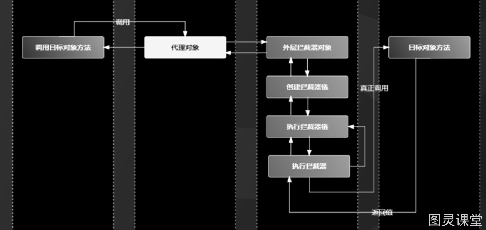

## 讲讲Spring事务的传播属性

### 七个事务传播属性
**PROPAGATION_REQUIRED** -- 支持当前事务，如果当前没有事务，就新建一个事务。这是最常见的选择。  
**PROPAGATION_SUPPORTS** -- 支持当前事务，如果当前没有事务，就以非事务方式执行。  
**PROPAGATION_MANDATORY** -- 支持当前事务，如果当前没有事务，就抛出异常。  
**PROPAGATION_REQUIRES_NEW** -- 新建事务，如果当前存在事务，把当前事务挂起。  
**PROPAGATION_NOT_SUPPORTED** -- 以非事务方式执行操作，如果当前存在事务，就把当前事务挂起。  
**PROPAGATION_NEVER** -- 以非事务方式执行，如果当前存在事务，则抛出异常。  
**PROPAGATION_NESTED**--如果当前存在事务，则在嵌套事务内执行。如果当前没有事务，则进行与PROPAGATION_REQUIRED类似的操作。

### 五种隔离级别
**SOLATION_DEFAULT**--这是一个PlatfromTransactionManager默认的隔离级别，使用数据库默认的事务隔离级别.另外四个与JDBC的隔离级别相对应；
**ISOLATION_READ_UNCOMMITTED**--这是事务最低的隔离级别，它充许别外一个事务可以看到这个事务未提交的数据。这种隔离级别会产生脏读，不可重复读和幻像读。
**ISOLATION_READ_COMMITTED**--保证一个事务修改的数据提交后才能被另外一个事务读取。另外一个事务不能读取该事务未提交的数据。这种事务隔离级别可以避免脏读出现，但是可能会出现不可重复读和幻像读。
**ISOLATION_REPEATABLE_READ**--这种事务隔离级别可以防止脏读，不可重复读。但是可能出现幻像读。它除了保证一个事务不能读取另一个事务未提交的数据外，还保证了避免下面的情况产生(不可重复读)。
**ISOLATION_SERIALIZABLE**--这是花费最高代价但是最可靠的事务隔离级别。事务被处理为顺序执行。除了防止脏读，不可重复读外，还避免了幻像读。

- 幻读：事务1读取记录时事务2增加了记录并提交，事务1再次读取时可以看到事务2新增的记录；
- 不可重复读取：事务1读取记录时，事务2更新了记录并提交，事务1再次读取时可以看到事务2修改后的记录；  
- 脏读：事务1更新了记录，但没有提交，事务2读取了更新后的行，然后事务T1回滚，现在T2读取无效。

## Spring如何管理事务的
Spring的事物管理分为两种，编程式事物与声明式事物。

#### 编程式事物
通过 `TransactionTemplate`或者`TransactionManager`手动管理事务，实际应用中很少使用，但是对于你理解 Spring 事务管理原理有帮助。

#### 声明式事务管理
推荐使用（代码侵入性最小），实际是通过 AOP 实现（基于`@Transactional` 的全注解方式使用最多）。

### Spring 事务管理接口介绍
Spring 框架中，事务管理相关最重要的 3 个接口如下：
`PlatformTransactionManager`： （平台）事务管理器，Spring 事务策略的核心。
`TransactionDefinition`： 事务定义信息(事务隔离级别、传播行为、超时、只读、回滚规则)。
`TransactionStatus`： 事务运行状态。
我们可以把 `**PlatformTransactionManager**` 接口可以被看作是事务上层的管理者
而 `**TransactionDefinition**` 和 `**TransactionStatus**` 这两个接口可以看作是事务的描述。
`**PlatformTransactionManager**` 会根据 `**TransactionDefinition**` 的定义比如事务超时时间、隔离级别、传播行为等来进行事务管理 ，而 `**TransactionStatus**` 接口则提供了一些方法来获取事务相应的状态比如是否新事务、是否可以回滚等等。

#### PlatformTransactionManager:事务管理接口
Spring 并不直接管理事务，而是提供了多种事务管理器 。Spring 事务管理器的接口是：`PlatformTransactionManager` 。
通过这个接口，Spring 为各个平台如 JDBC(DataSourceTransactionManager)、Hibernate(HibernateTransactionManager)、JPA(JpaTransactionManager)等都提供了对应的事务管理器，但是具体的实现就是各个平台自己的事情了。
`PlatformTransactionManager`接口中定义了三个方法：
```java
package org.springframework.transaction;

import org.springframework.lang.Nullable;

public interface PlatformTransactionManager {
    //获得事务
    TransactionStatus getTransaction(@Nullable TransactionDefinition var1) throws TransactionException;
    //提交事务
    void commit(TransactionStatus var1) throws TransactionException;
    //回滚事务
    void rollback(TransactionStatus var1) throws TransactionException;
}
```
主要是因为要将事务管理行为抽象出来，然后不同的平台去实现它，这样我们可以保证提供给外部的行为不变，方便我们扩展。

#### TransactionDefinition:事务属性
事务管理器接口 PlatformTransactionManager 通过 getTransaction(TransactionDefinition definition) 方法来得到一个事务，这个方法里面的参数是 TransactionDefinition 类 ，这个类就定义了一些基本的事务属性。
什么是事务属性呢？ 事务属性可以理解成事务的一些基本配置，描述了事务策略如何应用到方法上。
事务属性包含了 5 个方面：
隔离级别
传播行为
回滚规则
是否只读
事务超时
TransactionDefinition 接口中定义了 5 个方法以及一些表示事务属性的常量比如隔离级别、传播行为等等。
```java
package org.springframework.transaction;

import org.springframework.lang.Nullable;

public interface TransactionDefinition {
    int PROPAGATION_REQUIRED = 0;
    int PROPAGATION_SUPPORTS = 1;
    int PROPAGATION_MANDATORY = 2;
    int PROPAGATION_REQUIRES_NEW = 3;
    int PROPAGATION_NOT_SUPPORTED = 4;
    int PROPAGATION_NEVER = 5;
    int PROPAGATION_NESTED = 6;
    int ISOLATION_DEFAULT = -1;
    int ISOLATION_READ_UNCOMMITTED = 1;
    int ISOLATION_READ_COMMITTED = 2;
    int ISOLATION_REPEATABLE_READ = 4;
    int ISOLATION_SERIALIZABLE = 8;
    int TIMEOUT_DEFAULT = -1;
    // 返回事务的传播行为，默认值为 REQUIRED。
    int getPropagationBehavior();
    //返回事务的隔离级别，默认值是 DEFAULT
    int getIsolationLevel();
    // 返回事务的超时时间，默认值为-1。如果超过该时间限制但事务还没有完成，则自动回滚事务。
    int getTimeout();
    // 返回是否为只读事务，默认值为 false
    boolean isReadOnly();

    @Nullable
    String getName();
}
```

#### TransactionStatus:事务状态
`TransactionStatus`接口用来记录事务的状态 该接口定义了一组方法,用来获取或判断事务的相应状态信息。
`PlatformTransactionManager.getTransaction(…)`方法返回一个 `TransactionStatus` 对象。
**TransactionStatus 接口接口内容如下：**
```java
public interface TransactionStatus{
    boolean isNewTransaction(); // 是否是新的事务
    boolean hasSavepoint(); // 是否有恢复点
    void setRollbackOnly();  // 设置为只回滚
    boolean isRollbackOnly(); // 是否为只回滚
    boolean isCompleted; // 是否已完成
}
```

## 解释一下什么叫AOP（面向切面编程）？
AOP是Aspect-Oriented Programming的缩写，是一种面向切面的编程方法。
在AOP中，一个切面是一组可以独立于其他代码执行的功能，如日志记录、安全性检查、事务处理等。这些功能通常被称为"通知"，并且在AOP中被称为"切入点"。
AOP通过将这些切面"织入"到应用程序的正常流程中，使得可以将这些功能模块化，并在不修改主要业务逻辑的情况下将其应用到应用程序中。
这种方法可以让开发人员更专注于业务逻辑，而不必担心其他功能的实现细节。同时，AOP还可以帮助减少代码冗余，提高代码的可维护性和可扩展性。

## 什么是IoC和DI？DI是如何实现的？
IoC是Inversion of Control的缩写，是一种编程范式，它指的是控制流反转的概念。IoC的核心思想是对象之间的依赖关系是在运行时动态决定的，而不是在编译时静态确定的。
DI是Dependency Injection的缩写，是一种实现IoC的方法之一。DI通过将对象之间的依赖关系从使用者中解耦，使得对象可以独立于其依赖关系而存在。
DI通常用于将对象之间的依赖关系在运行时注入到对象中。这样就可以在运行时动态地更改对象之间的依赖关系，而不必在编译时就确定。
DI有多种实现方式，其中常见的有构造函数注入、Setter注入和接口注入。
构造函数注入是通过在构造函数中传入依赖对象的实例来实现DI的一种方式。
Setter注入是通过调用对象的Setter方法来注入依赖对象的实例来实现DI的一种方式。
接口注入是通过定义一个注入接口，然后在对象中实现这个接口来实现DI的一种方式。
通过使用DI，可以将对象之间的依赖关系从使用者中解耦，使得对象可以独立于其依赖关系而存在。这有助于提高代码的可维护性和可扩展性。此外，通过使用DI，可以在运行时动态地更改对象之间的依赖关系，使得系统更加灵活。
通常，DI是通过使用IoC容器来实现的。IoC容器是一个用于管理对象之间依赖关系的组件，它可以根据配置信息动态地创建对象并注入所需的依赖关系。
在Java中，Spring框架提供了一个功能强大的IoC容器，可以帮助开发人员快速地构建基于DI的应用程序。

## SQL优化有哪些着手点？组合索引的最左前缀原则的含义？
首先讲第一个问题：
SQL优化，既然是优化，那么首先得要定位问题才能对症下药，开启慢查询日志监控，找出系统中比较慢的SQL。这就减少了筛查范围，然后逐条进行执行计划分析。没建索引的建索引，建了索引的看看索引是不是失效了，然后排查为什么索引失效？这些问题排查完了之后，可能因为表数据量过大，那就要考虑是不是要拆表，进行分表。
常用优化建议：

1. 优化查询的选择、连接和排序操作。
2. 优化查询中使用的索引，包括创建新索引、删除无用索引、调整索引的顺序等。
3. 优化查询中使用的表连接方式，包括内连接、外连接、自连接等。
4. 优化查询中使用的子查询，包括对子查询进行优化、使用连接代替子查询等。
5. 优化查询中使用的聚合函数，包括使用索引进行优化、使用分组连接代替聚合函数等。

第二个问题：
组合索引的最左前缀原则指的是，在创建组合索引时，应该将最常用于筛选数据的列放在索引的最左侧，这样可以使索引更有效地帮助查询优化。
例如，如果有一张表中包含三个字段：A、B和C，并且频繁使用A和B这两个字段进行筛选数据，则应该将A和B作为组合索引的最左前缀，而不是C。
这样，在使用组合索引进行查询时，数据库系统就可以使用索引进行快速筛选，而不必扫描整张表。这有助于提高查询的效率。
最左前缀原则对于组合索引的创建非常重要，因为它可以帮助数据库系统更有效地使用索引。如果不遵循最左前缀原则，则组合索引可能会变得无用，甚至阻碍查询的优化。

## 数据库的隔离级别、MVCC

#### 事务的四大特性（ACID）

1. **原子性(atomicity)：** 事务的最小工作单元，要么全成功，要么全失败。
2. **一致性(consistency)：** 事务开始和结束后，数据库的完整性不会被破坏。
3. **隔离性(isolation)：** **不同事务之间互不影响，四种隔离级别为RU（读未提交）、RC（读已提交）、RR（可重复读）、SERIALIZABLE （串行化）。**
4. **持久性(durability)：** 事务提交后，对数据的修改是永久性的，即使系统故障也不会丢失。

#### 数据概念（脏读，不可重复读，幻读）

-  **脏读** 脏数据所指的就是未提交的数据。也就是说，一个事务正在对一条记录做修改，在这个事务完成并提交之前，这条数据是处于待定状态的（可能提交也可能回滚），这时，第二个事务来读取这条没有提交的数据，并做进一步的处理，就会产生未提交的数据依赖关系，这种现象被称为脏读。
- **不可重复读** 一个事务先后读取同一条记录，而事务在两次读取之间该数据被其它事务所修改，则两次读取的数据不同，我们称之为不可重复读。
- **幻读** 幻读是指当事务不是独立执行时发生的一种现象，例如第一个事务对一个表中的数据进行了修改，比如这种修改涉及到表中的“全部数据行”。同时，第二个事务也修改这个表中的数据，这种修改是向表中插入“一行新数据”。那么，以后就会发生操作第一个事务的用户发现表中还存在没有修改的数据行，就好像发生了幻觉一样。
| 脏读 | 脏读 | 不可重复读 | 幻读 |
| --- | --- | --- | --- |
| Read uncommitted | √ | √ | √ |
| Read committed | × | √ | √ |
| Repeatable read | × | × | √ |
| Serializable | × | × | × |


### 事务的隔离级别

#### 读未提交（Read UnCommitted/RU）
又称为**脏读**，一个事务可以读取到另一个事务未提交的数据。这种隔离级别是最不安全的一种，因为未提交的事务是存在回滚的情况。
举个例子：我的工资是3000，这个月发工资，财务不小心按错了数字，还没有来得及提交事务，就在这个时候，我发现的工资变为了3500元，我以为涨工资了高兴的飞起 ，财务发现不对，回滚了事务，将工资改回了3000元再提交。
实际我这个月的工资还是3000，但是我看到的是3500。我看到的是财务还没提交事务时的数据。这就是脏读。

#### 读已提交（Read Committed/RC）
又称为**不可重复读**，一个事务因为读取到另一个事务已提交的修改数据，导致在当前事务的不同时间读取同一条数据获取的结果不一致。
举个例子：某已婚男子欲购买一套新房准备迎接新生命的到来，购房款 330万 ，付款的时候查询自己账号余额 360万（第一次查询），就在这个时候，该已婚男子的爱人，购买了理财产品，价值50万，并提交事务；该已婚男使用POS机付房款的时候发现钱不够了（第二次查询需要等待爱人支出事务提交完成）
如果有事务对数据进行更新（UPDATE）操作时，读取数据事务要等待这个更新操作事务提交后才能读取数据，有效的避免脏读，但是一个事务进行了两次相同的查询而返回了不同的数据，这就是不可重复读。

#### 可重复读（Repeatable Read/RR）
又称为**幻读**，一个事物读可以读取到其他事务提交的数据，但是在RR隔离级别下，当前读取此条数据只可读取一次，在当前事务中，不论读取多少次，数据仍然是第一次读取的值，不会因为在第一次读取之后，其他事务再修改提交此数据而产生改变。因此也成为幻读，因为读出来的数据并不一定就是最新的数据。
举个例子：某已婚男欲购买一套新房准备迎接新生命的到来，购房款 330万 ，付款的时候查询自己账号余额 360万（第一次查询），在这个时候，该已婚男子的爱人无法从该已婚男账户转出余额，接下来就可以正常付款了。
重复读可以解决不可重复读问题。写到这里，应该明白的一点就是，不可重复读对应的是修改，即UPDATE操作。但是可能还会有幻读问题。因为幻读问题对应的是插入INSERT操作，而不是UPDATE操作。

#### 串行化（Serializable）
所有的数据库的读或者写操作都为串行执行，当前隔离级别下只支持单个请求同时执行，所有的操作都需要队列执行。所以种隔离级别下所有的数据是最稳定的，但是性能也是最差的。数据库的锁实现就是这种隔离级别的更小粒度版本。
Serializable 是最高的事务隔离级别，在该级别下，事务串行化顺序执行，可以避免脏读、不可重复读与幻读。但是这种事务隔离级别效率低下，比较耗数据库性能，一般不使用。

### 事务和MVCC原理

#### 不同事务同时操作同一条数据产生的问题

#### LBCC 解决数据丢失
**LBCC，基于锁的并发控制，Lock Based Concurrency Control。**
使用锁的机制，在当前事务需要对数据修改时，将当前事务加上锁，同一个时间只允许一条事务修改当前数据，其他事务必须等待锁释放之后才可以操作。

#### MVCC 解决数据丢失
**MVCC，多版本的并发控制，Multi-Version Concurrency Control。**
使用版本来控制并发情况下的数据问题，在B事务开始修改账户且事务未提交时，当A事务需要读取账户余额时，此时会读取到B事务修改操作之前的账户余额的副本数据，但是如果A事务需要修改账户余额数据就必须要等待B事务提交事务。
**MVCC使得数据库读不会对数据加锁，普通的SELECT请求不会加锁，提高了数据库的并发处理能力**。 借助MVCC，数据库可以实现READ COMMITTED，REPEATABLE READ等隔离级别，用户可以查看当前数据的前一个或者前几个历史版本，保证了ACID中的I特性（隔离性)。

## 乐观锁、悲观锁、互斥锁、读写锁的原理实现与区别
乐观锁和悲观锁是两种不同的锁机制，用于在多线程环境下解决资源竞争问题。互斥锁和读写锁是两种常见的锁类型，它们都可以用来实现乐观锁或悲观锁。
**乐观锁**是一种无锁机制，它假设在多线程环境下对共享资源的操作不会发生冲突，因此在执行操作时不会加锁。当操作完成后，会检查是否发生了冲突，如果发生了冲突，则重试操作直到成功为止。乐观锁通常用于冲突概率较低的场景，因为它的重试机制会带来额外的开销。
**悲观锁**是一种有锁机制，它假设在多线程环境下对共享资源的操作很可能发生冲突，因此在执行操作之前会加锁，操作完成后释放锁。悲观锁通常用于冲突概率较高的场景，因为它能够有效地避免冲突。
**互斥锁**（也称为独占锁）是一种锁类型，它只允许一个线程对共享资源进行操作。当一个线程获取了互斥锁之后，其他线程就无法对这个资源进行操作，直到当前线程释放了锁。互斥锁可以用来实现悲观锁，在多线程环境下保证同一时刻只有一个线程对共享资源进行操作。
**读写锁**是一种锁类型，它既允许多个线程同时对共享资源进行读操作，也允许单个线程对共享资源进行写操作。当多个线程同时读取共享资源时，可以同时获取读锁；当有一个线程要写入共享资源时，需要获取写锁，这时其他线程就不能对共享资源进行读或写操作，直到当前线程释放写锁。读写锁可以用来实现乐观锁，在多线程环境下提高读操作的并发性
互斥锁和读写锁的区别在于，互斥锁只允许一个线程对共享资源进行操作，而读写锁则允许多个线程同时对共享资源进行读操作，但只允许单个线程对共享资源进行写操作。这意味着，互斥锁会对共享资源的读写操作都进行加锁，而读写锁则可以将读操作和写操作分开进行加锁，从而提高了读操作的并发性。
在实现上，互斥锁通常是通过二元信号量或原子操作来实现的。二元信号量是一种同步机制，它可以用来控制资源的访问，允许一个线程获取资源，同时阻塞其他线程的访问。原子操作是指在计算机内存中的操作，其不可被中断，能够保证操作的原子性。
读写锁通常是通过读者-写者锁来实现的。读者-写者锁是一种同步机制，它可以用来控制对共享资源的读写访问。当有多个线程同时读取共享资源时，可以同时获取读锁；当有一个线程要写入共享资源时，需要获取写锁，这时其他线程就不能对共享资源进行读或写操作，直到当前线程释放写锁。
总的来说，乐观锁是一种无锁机制，它通过重试来避免冲突，适用于冲突概率较低的场景。悲观锁是一种有锁机制，它通过加锁来避免冲突，适用于冲突概率较高的场景。互斥锁是一种常见的锁类型，它只允许一个线程对共享资源进行操作，适用于悲观锁的场景。读写锁是另一种常见的锁类型，它既允许多个线程同时对共享资源进行读操作，也允许单个线程对共享资源进行写操作，适用于乐观锁的场景。

## B+树做索引时，B+树通常高度为多少层？要参考哪些条件？
在 MySQL 中使用 B+ 树做索引时，B+ 树的高度通常取决于树中节点的数量以及每个节点的度数。在 MySQL 中，B+ 树的度数通常为 128，但是这个值也可以在创建索引时通过设置选项来更改。
对于 B+ 树来说，一般来说，树的高度越低越好。低高度意味着树中节点的数量越少，也就意味着树的查询和更新操作所需的时间越少。但是，度数越高意味着每个节点所包含的子节点越多，这可以减少对磁盘的访问次数，从而提高查询和更新的效率。因此，在设计 B+ 树时，需要在度数和树的高度之间进行权衡，以便在时间和空间效率之间取得平衡。
B+ 树的高度通常为 log(n) 层，其中 n 是树中节点的数量。这意味着，如果树中有 1,000,000 个节点，则 B+ 树的高度通常为 20 层左右。但是，这只是一个概括性的估计，实际情况可能会有所不同。
总的来说，B+ 树的高度受到许多因素的影响，包括树中节点的数量、每个节点的度数、数据的特点以及 MySQL 的配置和设置。例如，MySQL 中的页大小（page size）设置会影响 B+ 树中节点的大小，从而影响 B+ 树的高度。此外，MySQL 中的缓存大小也会影响 B+ 树的高度，因为缓存大小越大，B+ 树中节点的数量就越少，从而使树的高度降低。
另外，在 MySQL 中使用 B+ 树建立索引时，还要考虑索引的唯一性和是否为主键。如果索引是唯一的，则 B+ 树的高度可能会稍微低一些，因为在唯一索引中，每个节点都必须包含不同的值。如果索引是主键，则 B+ 树的高度可能会略微高一些，因为主键索引中的所有节点都必须包含唯一的值。

## 了解过数据库设计三大范式吗？在项目中遵循过吗？
数据库设计的三大范式是一种设计规则，旨在帮助设计出高质量的数据库模型。这些规则旨在确保数据库表中的数据是冗余尽可能少，数据冗余会导致数据的不一致性。
第一范式（1NF）要求每个字段都是原子性的，也就是说，每个字段都只能包含单个值。
第二范式（2NF）要求每个表中的非主键字段都完全依赖于表的主键。
第三范式（3NF）要求每个非主键字段都与主键字段或其它非主键字段没有传递依赖关系。
在我参与的项目中，我们确实遵循过这三大范式。我们在设计数据库模型时会考虑这些规则，以确保数据库表是冗余尽可能少的，并且数据的一致性得到保证。
范式再给我们带来的上面的好处时，同时也伴随着一些不好的地方：按照范式的规范设计出来的表，等级越高的范式设计出来的表越多。如第一范式可能设计 出来的表可能只有一张表而已，再按照第二范式去设计这张表时就可能出来两张或更多张表，如果再按第三范式或更高的范式去设计这张表会出现更多比第二范式多 的表。表的数量越多，当我们去查询一些数据，必然要去多表中去查询数据，这样查询的时间要比在一张表中查询中所用的时间要高很多。
也就是说我们所用的范式越高，对数据操作的性能越低。所以我们在利用范式设计表的时候，要根据具体的需求再去权衡是否使用更高范式去设计表。在一般的项目中，我们用的最多也就是第三范式，第三范式也就可以满足我们的项目需求，性能好而且方便管理数据；
当我们的业务所涉及的表非常多，经常会有多表发生关系，并且我们对表的操作要时间上要尽量的快，这时可以考虑我们使用“**反范式**”。
**所谓反范式**，故名思义，跟范式所要求的正好相反，在反范式的设计模式，我们可以允许适当的数据的冗余，用这个冗余去取操作数据时间的缩短。**也就是利用空间来换取时间**,把数据冗余在多个表中，当查询时可以减少或者是避免表之间的关联；
**场景分析:**
如我们现在要对一个 学校的课程表进行操作，现在有两张表，一张是学生信息student（a_id,a_name,a_adress,b_id）表，一张是课程表 subject(b_id,b_subject)，现在我们需要一个这样的信息，把选择每个课程的的课程名称和学生姓名输出来：
SQL语句为：
```java
select  B.b_id,B.b_subject,A_a_name from student A ,subject B;
```
当上面的数据量不多时，我们这样去查询没有问题；当我们的两张表的数据都是在百万级的时候，我们去查上面的信息， 问题出现了，这个查询动不动就是几百毫秒，甚至更慢，这样的查询效率根本不能满足我们对于网页速度的要求（一般不能超过100毫秒），怎么办？当然要反范式，在课程表里面添加冗余字段——学生姓名，这样我们就可以通过下面的查询达到同样的目的：
SQL语句为：
```java
select  b_id,b_subject,a_name from subject B;
```
将两个查询放在一起查看执行计划，就会发现，第一个查询开销占了92%，而第二个才8%，也就是说，第二个查询比起第一个查询，效率上优化了10倍以上，成果显著啊。
当我们开始着手一个项目后，范式的应用是这样的变化的：
第三范式数据库的设计—–>当数据量越来越大，达到百万级时，经常要对一些多表数据进行大范围高频率进行操作——->范式数据库的设计———->网站的数据量再持续增长———->范式和反范式的数据库设计
当我们的数据量非常大，目前除了对数据库的设计改动外，还可以通过对数据层进行缓存处理。如现在使用效果显著的Memcached ,一个分布式的缓存系统，我们将数据库信息以实体类的方式和图片文件等保存在Memcached里面，只要是可序列化的数据，经过装箱和拆箱，都可以保存 到Memcached中并随时可以快速的访问到这些对象，Memcached可以解决大量数据的缓存并保持多台Web Server得到的缓存数据是一致的。

## 数据库的脏读，幻读，不可重复读出现的原因原理，解决办法
概念
脏读：脏读又称无效数据的读出，是指在数据库访问中，事务T1将某一值修改，然后事务T2读取该值，此后T1因为某种原因撤销对该值的修改，这就导致了T2所读取到的数据是无效的。
幻读：
幻读是指当事务不是独立执行时发生的一种现象，例如第一个事务对一个表中的数据进行了修改，比如这种修改涉及到表中的“全部数据行”。同时，第二个事务也修改这个表中的数据，这种修改是向表中插入“一行新数据”。那么，以后就会发生操作第一个事务的用户发现表中还存在没有修改的数据行，就好象发生了幻觉一样。
不可重复读：
事务A首先读取了一条数据，然后执行逻辑的时候，事务B将这条数据改变了，然后事务A再次读取的时候，发现数据不匹配了，就是所谓的不可重复读了。
丢失的修改：
两个事务同时修改同一行数据并提交，其中一个事务覆盖了另一事务的修改。
解决方法
以上出现的都是数据库事务隔离级别的问题，SQL标准定义了事务隔离级别分为四种（级别递减）：
Serializable （串行化）：最严格的级别，事务串行执行，资源消耗最大；简言之，它是在每个读的数据行上加上共享锁，但可能导致大量的超市现象和锁竞争。
REPEATABLE READ（可重复读） ：保证了一个事务不会修改已经由另一个事务读取但未提交（回滚）的数据。避免了“脏读取”和“不可重复读取”的情况，但不能避免“幻读”，但是带来了更多的性能损失。
READ COMMITTED （提交读）：大多数主流数据库的默认事务等级，保证了一个事务不会读到另一个并行事务已修改但未提交的数据，避免了“脏读取”，但不能避免“幻读”和“不可重复读取”。该级别适用于大多数系统。
Read Uncommitted（未提交读） ：事务中的修改，即使没有提交，其他事务也可以看得到，会导致“脏读”、“幻读”和“不可重复读取”。

| **隔离级别** | **脏读** | **幻读** | **不可重复读** |
| --- | --- | --- | --- |
| Read Uncommitted（未提交读） | 可能 | 可能 | 可能 |
| Read Commited （已提交读） | 不可能 | 可能 | 可能 |
| Repeatable Read（可重复读） | 不可能 | 可能 | 不可能 |
| Serializable （串行化） | 不可能 | 不可能 | 不可能 |


## 有做过数据库分表吗？当时是大概在多少数据量分的表呢？分表的方案是什么呢？有遇到过数据倾斜吗？

### 当时是大概在多少数据量分的表呢？
今天，探讨一个有趣的话题：MySQL 单表数据达到多少时才需要考虑分库分表？有人说 2000 万行，也有人说 500 万行。那么，你觉得这个数值多少才合适呢？
曾经在中国互联网技术圈广为流传着这么一个说法：MySQL 单表数据量大于 2000 万行，性能会明显下降。事实上，这个传闻据说最早起源于百度。具体情况大概是这样的，当年的 DBA 测试 MySQL性能时发现，当单表的量在 2000 万行量级的时候，SQL 操作的性能急剧下降，因此，结论由此而来。然后又据说百度的工程师流动到业界的其它公司，也带去了这个信息，所以，就在业界流传开这么一个说法。
再后来，阿里巴巴《Java 开发手册》提出单表行数超过 500 万行或者单表容量超过 2GB，才推荐进行分库分表。对此，有阿里的黄金铁律支撑，所以，很多人设计大数据存储时，多会以此为标准，进行分表操作。
那么，你觉得这个数值多少才合适呢？为什么不是 300 万行，或者是 800 万行，而是 500 万行？也许你会说这个可能就是阿里的最佳实战的数值吧？那么，问题又来了，这个数值是如何评估出来的呢？稍等片刻，请你小小思考一会儿。
事实上，这个数值和实际记录的条数无关，而与 MySQL 的配置以及机器的硬件有关。因为，MySQL 为了提高性能，会将表的索引装载到内存中。InnoDB buffer size 足够的情况下，其能完成全加载进内存，查询不会有问题。但是，当单表数据库到达某个量级的上限时，导致内存无法存储其索引，使得之后的 SQL 查询会产生磁盘 IO，从而导致性能下降。当然，这个还有具体的表结构的设计有关，最终导致的问题都是内存限制。这里，增加硬件配置，可能会带来立竿见影的性能提升哈。
那么，我对于分库分表的观点是，需要结合实际需求，不宜过度设计，在项目一开始不采用分库与分表设计，而是随着业务的增长，在无法继续优化的情况下，再考虑分库与分表提高系统的性能。对此，阿里巴巴《Java 开发手册》补充到：如果预计三年后的数据量根本达不到这个级别，请不要在创建表时就分库分表。那么，回到一开始的问题，你觉得这个数值多少才合适呢？
我的建议是，根据自身的机器的情况综合评估，如果心里没有标准，那么暂时以 500 万行作为一个统一的标准，相对而言算是一个比较折中的数值。

### 数据偏斜问题
一个良好的分库分表方案，它的数据应该是需要比较均匀的分散在各个库表中的。如果我们进行一个拍脑袋式的分库分表设计，很容易会遇到以下类似问题：
> a、某个数据库实例中，部分表的数据很多，而其他表中的数据却寥寥无几，业务上的表现经常是延迟忽高忽低，飘忽不定。b、数据库集群中，部分集群的磁盘使用增长特别块，而部分集群的磁盘增长却很缓慢。每个库的增长步调不一致，这种情况会给后续的扩容带来步调不一致，无法统一操作的问题。

这边我们定义分库分表最大数据偏斜率为 ：（数据量最大样本 - 数据量最小样本）/ 数据量最小样本。一般来说，如果我们的最大数据偏斜率在5%以内是可以接受的。


### 分表的方案是什么呢？

#### Range分库分表
顾名思义，该方案根据数据范围划分数据的存放位置。
举个最简单例子，我们可以把订单表按照年份为单位，每年的数据存放在单独的库（或者表）中。如下图所示：
通过数据的范围进行分库分表，该方案是最朴实的一种分库方案，它也可以和其他分库分表方案灵活结合使用。时下非常流行的[分布式数据库](https://cloud.tencent.com/product/tddbms?from=10680)：TiDB数据库，针对TiKV中数据的打散，也是基于Range的方式进行，将不同范围内的[StartKey,EndKey)分配到不同的Region上。
下面我们看看该方案的缺点：

- a、最明显的就是数据热点问题，例如上面案例中的订单表，很明显当前年度所在的库表属于热点数据，需要承载大部分的IO和计算资源。
- b、新库和新表的追加问题。一般我们线上运行的应用程序是没有数据库的建库建表权限的，故我们需要提前将新的库表提前建立，防止线上故障。
> 这点非常容易被遗忘，尤其是稳定跑了几年没有迭代任务，或者人员又交替频繁的模块。

- c、业务上的交叉范围内数据的处理。举个例子，订单模块无法避免一些中间状态的数据补偿逻辑，即需要通过定时任务到订单表中扫描那些长时间处于待支付确认等状态的订单。

这里就需要注意了，因为是通过年份进行分库分表，那么元旦的那一天，你的定时任务很有可能会漏掉上一年的最后一天的数据扫描。

####  Hash分库分表
虽然分库分表的方案众多，但是Hash分库分表是最大众最普遍的方案，也是本文花最大篇幅描述的部分。
针对Hash分库分表的细节部分，相关的资料并不多。大部分都是阐述一下概念举几个示例，而细节部分并没有特别多的深入，如果未结合自身业务贸然参考引用，后期非常容易出现各种问题。
在正式介绍这种分库分表方式之前，我们先看几个常见的错误案例。
**常见错误案例一：非互质关系导致的数据偏斜问题**
```java
public static ShardCfg shard(String userId) {
    int hash = userId.hashCode();
    // 对库数量取余结果为库序号
    int dbIdx = Math.abs(hash % DB_CNT);
    // 对表数量取余结果为表序号
    int tblIdx = Math.abs(hash % TBL_CNT);
 
    return new ShardCfg(dbIdx, tblIdx);
}
```
上述方案是初次使用者特别容易进入的误区，用Hash值分别对分库数和分表数取余，得到库序号和表序号。其实稍微思索一下，我们就会发现，以10库100表为例，如果一个Hash值对100取余为0，那么它对10取余也必然为0。
这就意味着只有0库里面的0表才可能有数据，而其他库中的0表永远为空！
类似的我们还能推导到，0库里面的共100张表，只有10张表中(个位数为0的表序号)才可能有数据。这就带来了非常严重的数据偏斜问题，因为某些表中永远不可能有数据，最大数据偏斜率达到了无穷大。
那么很明显，该方案是一个未达到预期效果的错误方案。数据的散落情况大致示意图如下：
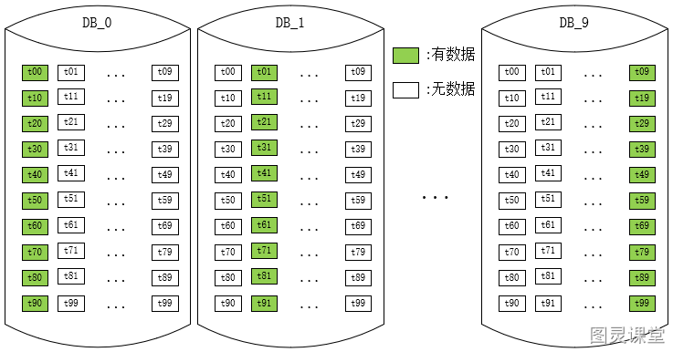
事实上，只要库数量和表数量非互质关系，都会出现某些表中无数据的问题。
证明如下：
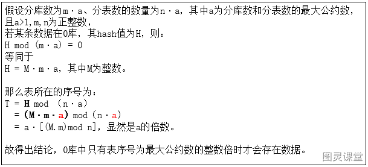
**那么是不是只要库数量和表数量互质就可用用这种分库分表方案呢？比如我用11库100表的方案，是不是就合理了呢？**
答案是否定的，我们除了要考虑数据偏斜的问题，还需要考虑可持续性扩容的问题，一般这种Hash分库分表的方案后期的扩容方式都是通过翻倍扩容法，那11库翻倍后，和100又不再互质。
当然，如果分库数和分表数不仅互质，而且分表数为奇数(例如10库101表)，则理论上可以使用该方案，但是我想大部分人可能都会觉得使用奇数的分表数比较奇怪吧。
**常见错误案例二：扩容难以持续**
如果避开了上述案例一的陷阱，那么我们又很容易一头扎进另一个陷阱，大概思路如下；
我们把10库100表看成总共1000个逻辑表，将求得的Hash值对1000取余，得到一个介于[0，999)中的数，然后再将这个数二次均分到每个库和每个表中，大概逻辑代码如下：
```java
public static ShardCfg shard(String userId) {
        // ① 算Hash
        int hash = userId.hashCode();
        // ② 总分片数
        int sumSlot = DB_CNT * TBL_CNT;
        // ③ 分片序号
        int slot = Math.abs(hash % sumSlot);
        // ④ 计算库序号和表序号的错误案例
        int dbIdx = slot % DB_CNT ;
        int tblIdx = slot / DB_CNT ;
 
        return new ShardCfg(dbIdx, tblIdx);
    }
```
该方案确实很巧妙的解决了数据偏斜的问题，只要Hash值足够均匀，那么理论上分配序号也会足够平均，于是每个库和表中的数据量也能保持较均衡的状态。
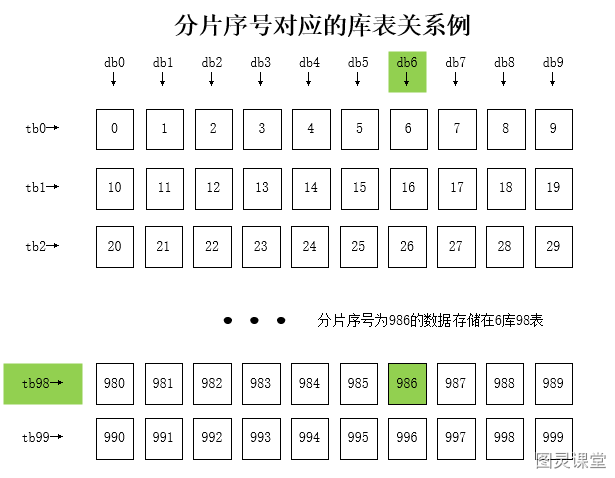
但是该方案有个比较大的问题，那就是在计算表序号的时候，依赖了总库的数量，那么后续翻倍扩容法进行扩容时，会出现扩容前后数据不在同一个表中，从而无法实施。
如上图中，例如扩容前Hash为1986的数据应该存放在6库98表，但是翻倍扩容成20库100表后，它分配到了6库99表，表序号发生了偏移。这样的话，我们在后续在扩容的时候，不仅要基于库迁移数据，还要基于表迁移数据，非常麻烦且易错。
看完了上面的几种典型的错误案例，那么我们有哪些比较正确的方案呢？下面将结合一些实际场景案例介绍几种Hash分库分表的方案。
**常用姿势一：标准的二次分片法**
上述错误案例二中，整体思路完全正确，只是最后计算库序号和表序号的时候，使用了库数量作为影响表序号的因子，导致扩容时表序号偏移而无法进行。
事实上，我们只需要换种写法，就能得出一个比较大众化的分库分表方案。
```java
public static ShardCfg shard2(String userId) {
        // ① 算Hash
        int hash = userId.hashCode();
        // ② 总分片数
        int sumSlot = DB_CNT * TBL_CNT;
        // ③ 分片序号
        int slot = Math.abs(hash % sumSlot);
        // ④ 重新修改二次求值方案
        int dbIdx = slot / TBL_CNT ;
        int tblIdx = slot % TBL_CNT ;
 
        return new ShardCfg(dbIdx, tblIdx);
    }
```
大家可以注意到，和错误案例二中的区别就是通过分配序号重新计算库序号和表序号的逻辑发生了变化。它的分配情况如下：
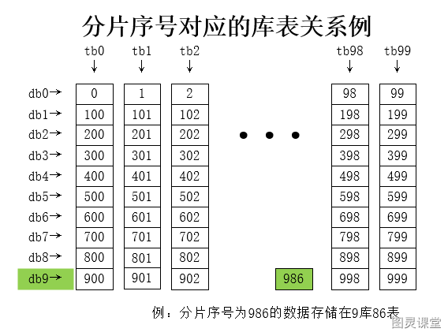
那为何使用这种方案就能够有很好的扩展持久性呢？我们进行一个简短的证明：
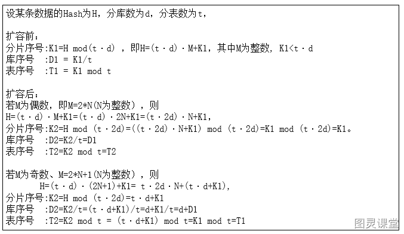
通过上面结论我们知道，通过翻倍扩容后，我们的表序号一定维持不变，库序号可能还是在原来库，也可能平移到了新库中(原库序号加上原分库数)，完全符合我们需要的扩容持久性方案。
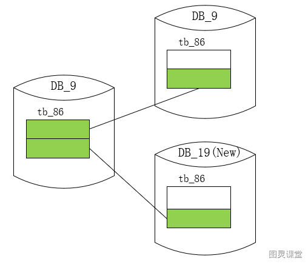
**【方案缺点】**
1、翻倍扩容法前期操作性高，但是后续如果分库数已经是大几十的时候，每次扩容都非常耗费资源。
2、连续的分片键Hash值大概率会散落在相同的库中，某些业务可能容易存在库热点（例如新生成的用户Hash相邻且递增，且新增用户又是高概率的活跃用户，那么一段时间内生成的新用户都会集中在相邻的几个库中）。
**常用姿势二：关系表冗余**
我们可以将分片键对应库的关系通过关系表记录下来，我们把这张关系表称为"路由关系表"。
```java
public static ShardCfg shard(String userId) {
        int tblIdx = Math.abs(userId.hashCode() % TBL_CNT);
        // 从缓存获取
        Integer dbIdx = loadFromCache(userId);
        if (null == dbIdx) {
            // 从路由表获取
            dbIdx = loadFromRouteTable(userId);
            if (null != dbIdx) {
                // 保存到缓存
                saveRouteCache(userId, dbIdx);
            }
        }
        if (null == dbIdx) {
            // 此处可以自由实现计算库的逻辑
            dbIdx = selectRandomDbIdx();
            saveToRouteTable(userId, dbIdx);
            saveRouteCache(userId, dbIdx);
        }
 
        return new ShardCfg(dbIdx, tblIdx);
    }
```
该方案还是通过常规的Hash算法计算表序号，而计算库序号时，则从路由表读取数据。因为在每次数据查询时，都需要读取路由表，故我们需要将分片键和库序号的对应关系记录同时维护在缓存中以提升性能。
上述实例中**selectRandomDbIdx**方法作用为生成该分片键对应的存储库序号，这边可以非常灵活的动态配置。例如可以为每个库指定一个权重，权重大的被选中的概率更高，权重配置成0则可以将关闭某些库的分配。当发现数据存在偏斜时，也可以调整权重使得各个库的使用量调整趋向接近。
该方案还有个优点，就是理论上后续进行扩容的时候，仅需要挂载上新的数据库节点，将权重配置成较大值即可，无需进行任何的数据迁移即可完成。
如下图所示：最开始我们为4个数据库分配了相同的权重，理论上落在每个库的数据概率均等。但是由于用户也有高频低频之分，可能某些库的数据增长会比较快。当挂载新的数据库节点后，我们灵活的调整了每个库的新权重。
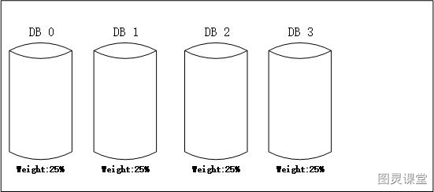
该方案似乎解决了很多问题，那么它有没有什么不适合的场景呢？当然有，该方案在很多场景下其实并不太适合，以下举例说明。
a、每次读取数据需要访问路由表，虽然使用了缓存，但是还是有一定的性能损耗。
b、路由关系表的存储方面，有些场景并不合适。例如上述案例中用户id的规模大概是在10亿以内，我们用单库百表存储该关系表即可。但如果例如要用文件MD5摘要值作为分片键，因为样本集过大，无法为每个md5值都去指定关系（当然我们也可以使用md5前N位来存储关系）。
**c、饥饿占位问题，如下详叙**：
我们知道，该方案的特点是后续无需扩容，可以随时修改权重调整每个库的存储增长速度。但是这个愿景是比较缥缈，并且很难实施的，我们选取一个简单的业务场景考虑以下几个问题。
**【业务场景】**：以用户存放文件到云端的云盘业务为例，需要对用户的文件信息进行分库分表设计，有以下假定场景：

- ①假定有2亿理论用户，假设当前有3000W有效用户。
- ②平均每个用户文件量级在2000个以内
- ③用户id为随机16位字符串
- ④初期为10库，每个库100张表。

我们使用路由表记录每个用户所在的库序号信息。那么该方案会有以下问题：
**第一**：我们总共有2亿个用户，只有3000W个产生过事务的用户。若程序不加处理，用户发起任何请求则创建路由表数据，会导致为大量实际没有事务数据的用户提前创建路由表。
笔者最初存储云盘用户数据的时候便遇到了这个问题，客户端app会在首页查询用户空间使用情况，这样导致几乎一开始就为每个使用者分配好了路由。随着时间的推移，这部分没有数据的"静默"的用户，随时可能开始他的云盘使用之旅而“复苏”，从而导致它所在的库迅速增长并超过单个库的空间容量极限，从而被迫拆分扩容。
解决这个问题的方案，其实就是只针对事务操作(例如购买空间，上传数据，创建文件夹等等)才进行路由的分配，这样对代码层面便有了一些倾入。
**第二**、按照前面描述的业务场景，一个用户最终平均有2000条数据，假定每行大小为1K，为了保证B+数的层级在3层，我们限制每张表的数据量在2000W，分表数为100的话，可以得到理论上每个库的用户数不能超过100W个用户。
也就是如果是3000W个产生过事务的用户，我们需要为其分配30个库，这样会在业务前期，用户平均数据量相对较少的时候，存在非常大的数据库资源的浪费。
解决第二个问题，我们一般可以将很多数据库放在一个实例上，后续随着增长情况进行拆分。也可以后续针对将满的库，使用常规手段进行拆分和迁移。
**常用姿势三：基因法**
还是由错误案例一启发，我们发现案例一不合理的主要原因，就是因为库序号和表序号的计算逻辑中，有公约数这个因子在影响库表的独立性。
那么我们是否可以换一种思路呢？我们使用相对独立的Hash值来计算库序号和表序号。
```java
public static ShardCfg shard(String userId) {
    int dbIdx = Math.abs(userId.substring(0, 4).hashCode() % DB_CNT );
    int tblIdx = Math.abs(userId.hashCode() % TBL_CNT);
    return new ShardCfg(dbIdx, tblIdx);
}
```
如上所示，我们计算库序号的时候做了部分改动，我们使用分片键的前四位作为Hash值来计算库序号。
这也是一种常用的方案，我们称为基因法，即使用原分片键中的某些基因（例如前四位）作为库的计算因子，而使用另外一些基因作为表的计算因子。该方案也是网上不少的实践方案或者是其变种，看起来非常巧妙的解决了问题，然而在实际生成过程中还是需要慎重。
笔者曾在云盘的空间模块的分库分表实践中采用了该方案，使用16库100表拆分数据，上线初期数据正常。然而当数据量级增长起来后，发现每个库的用户数量严重不均等，故猜测该方案存在一定的数据偏斜。
为了验证观点，进行如下测试，随机2亿个用户id（16位的随机字符串），针对不同的M库N表方案，重复若干次后求平均值得到结论如下：
```java
8库100表
min=248305(dbIdx=2, tblIdx=64), max=251419(dbIdx=7, tblIdx=8), rate= 1.25%            √
16库100表
min=95560(dbIdx=8, tblIdx=42), max=154476(dbIdx=0, tblIdx=87), rate= 61.65%           ×
20库100表
min=98351(dbIdx=14, tblIdx=78), max=101228(dbIdx=6, tblIdx=71), rate= 2.93%
```
我们发现该方案中，分库数为16，分表数为100，数量最小行数仅为10W不到，但是最多的已经达到了15W+，最大数据偏斜率高达61%。按这个趋势发展下去，后期很可能出现一台数据库容量已经使用满，而另一台还剩下30%+的容量。
该方案并不是一定不行，而是我们在采用的时候，要综合分片键的样本规则，选取的分片键前缀位数，库数量，表数量，四个变量对最终的偏斜率都有影响。
例如上述例子中，如果不是16库100表，而是8库100表，或者20库100表，数据偏斜率都能降低到了5%以下的可接受范围。所以该方案的隐藏的"坑"较多，我们不仅要估算上线初期的偏斜率，还需要测算若干次翻倍扩容后的数据偏斜率。
例如你用着初期比较完美的8库100表的方案，后期扩容成16库100表的时候，麻烦就接踵而至。
**常用姿势四：剔除公因数法**
还是基于错误案例一启发，在很多场景下我们还是希望相邻的Hash能分到不同的库中。就像N库单表的时候，我们计算库序号一般直接用Hash值对库数量取余
那么我们是不是可以有办法去除掉公因数的影响呢？下面为一个可以考虑的实现案例：
```java
public static ShardCfg shard(String userId) {
        int dbIdx = Math.abs(userId.hashCode() % DB_CNT);
        // 计算表序号时先剔除掉公约数的影响
        int tblIdx = Math.abs((userId.hashCode() / TBL_CNT) % TBL_CNT);
        return new ShardCfg(dbIdx, tblIdx);
}
```
经过测算，该方案的最大数据偏斜度也比较小，针对不少业务从N库1表升级到N库M表下，需要维护库序号不变的场景下可以考虑。
**常用姿势五：一致性Hash法**
一致性Hash算法也是一种比较流行的集群数据分区算法，比如RedisCluster即是通过一致性Hash算法，使用16384个虚拟槽节点进行每个分片数据的管理。关于一致性Hash的具体原理这边不再重复描述，读者可以自行翻阅资料。
这边详细介绍如何使用一致性Hash进行分库分表的设计。
我们通常会将每个实际节点的配置持久化在一个配置项或者是数据库中，应用启动时或者是进行切换操作的时候会去加载配置。配置一般包括一个[StartKey,Endkey)的左闭右开区间和一个数据库节点信息，例如：
示例代码：
```java
private TreeMap<Long, Integer> nodeTreeMap = new TreeMap<>();
 
@Override
public void afterPropertiesSet() {
    // 启动时加载分区配置
    List<HashCfg> cfgList = fetchCfgFromDb();
    for (HashCfg cfg : cfgList) {
        nodeTreeMap.put(cfg.endKey, cfg.nodeIdx);
    }
}
 
public ShardCfg shard(String userId) {
    int hash = userId.hashCode();
    int dbIdx = nodeTreeMap.tailMap((long) hash, false).firstEntry().getValue();
    int tblIdx = Math.abs(hash % 100);
    return new ShardCfg(dbIdx, tblIdx);
}
```
我们可以看到，这种形式和上文描述的Range分表非常相似，Range分库分表方式针对分片键本身划分范围，而一致性Hash是针对分片键的Hash值进行范围配置。
正规的一致性Hash算法会引入虚拟节点，每个虚拟节点会指向一个真实的物理节点。这样设计方案主要是能够在加入新节点后的时候，可以有方案保证每个节点迁移的数据量级和迁移后每个节点的压力保持几乎均等。
但是用在分库分表上，一般大部分都只用实际节点，引入虚拟节点的案例不多，主要有以下原因：
> a、应用程序需要花费额外的耗时和内存来加载虚拟节点的配置信息。如果虚拟节点较多，内存的占用也会有些不太乐观。b、由于mysql有非常完善的主从复制方案，与其通过从各个虚拟节点中筛选需要迁移的范围数据进行迁移，不如通过从库升级方式处理后再删除冗余数据简单可控。c、虚拟节点主要解决的痛点是节点数据搬迁过程中各个节点的负载不均衡问题，通过虚拟节点打散到各个节点中均摊压力进行处理。

而作为OLTP数据库，我们很少需要突然将某个数据库下线，新增节点后一般也不会从0开始从其他节点搬迁数据，而是前置准备好大部分数据的方式，故一般来说没有必要引入虚拟节点来增加复杂度。

## IP地址如何在数据库中存储?
在MySQL中，当存储IPv4地址时，应该使用32位的无符号整数（UNSIGNED INT）来存储IP地址，而不是使用字符串，用UNSIGNED INT类型存储IP 地址是一个4字节长的整数。
如果是字符串存储IP 地址，在正常格式下，最小长度为 7 个字符 (0.0.0.0)，最大长度为 15 个 (255.255.255.255)，因此，我们通常会使用varchar(15)来存储。同时为了让数据库准确跟踪列中有多少数据，数据库会添加额外的1字节来存储字符串的长度。这使得以字符串表示的 IP 的实际数据存储成本需要16字节。
这意味着如果将每个 IP 地址存储为字符串的话，每行需要多耗费大约 10 个字节的额外资源。
如果你说磁盘够使不是事儿，那我得告诉你，这个不仅会使数据文件消耗更多的磁盘，如果该字段加了索引，也会同比例扩大索引文件的大小，缓存数据需要使用更多内存来缓存数据或索引，从而可能将其他更有价值的内容推出缓存区。执行SQL对该字段进行CRUD时，也会消耗更多的CPU资源。
MySQL中有内置的函数，来对IP和数值进行相互转换。

- INET_ATON()

将IP转换成整数。
算法：第一位乘256三次方+第二位乘256二次方+第三位乘256一次方 + 第四位乘256零次方

- INET_NTOA()

将数字反向转换成IP
```java
SELECT INET_ATON('127.0.0.1');

+------------------------+
| INET_ATON('127.0.0.1') |
+------------------------+
|             2130706433 | 
+------------------------+
1 row in set (0.00 sec)


SELECT INET_NTOA('2130706433');

+-------------------------+
| INET_NTOA('2130706433') |
+-------------------------+
| 127.0.0.1               | 
+-------------------------+
1 row in set (0.02 sec)
```
如果是 IPv6地址的话，可以使用函数 INET6_ATON() 和 INET6_NTOA() 来转化：
```java
mysql> SELECT HEX(INET6_ATON('1030::C9B4:FF12:48AA:1A2B')); 

+----------------------------------------------+
| HEX(INET6_ATON('1030::C9B4:FF12:48AA:1A2B')) |
+----------------------------------------------+
| 1030000000000000C9B4FF1248AA1A2B             |
+----------------------------------------------+
1 row in set

mysql> SELECT INET6_NTOA(UNHEX('1030000000000000C9B4FF1248AA1A2B')); 
+-------------------------------------------------------+
| INET6_NTOA(UNHEX('1030000000000000C9B4FF1248AA1A2B')) |
+-------------------------------------------------------+
| 1030::c9b4:ff12:48aa:1a2b                             |
+-------------------------------------------------------+
1 row in set
```
然后将数据库定义为 varbinary类型，分配 128bits空间（因为 ipv6采用的是128bits，16个字节）；或者定义为 char 类型，分配 32bits 空间。

## 分库分表之后，id 主键如何处理？
其实这是分库分表之后你必然要面对的一个问题，就是 id 咋生成？因为要是分成多个表之后，每个表都是从 1 开始累加，那肯定不对啊，需要一个全局唯一的 id 来支持。所以这都是你实际生产环境中必须考虑的问题。

#### **数据库自增长ID**
这个就是说你的系统里每次得到一个 id，都是往一个库的一个表里插入一条没什么业务含义的数据，然后获取一个数据库自增的一个 id。拿到这个 id 之后再往对应的分库分表里去写入。
优点：非常简单，有序递增，方便分页和排序。
缺点：分库分表后，同一数据表的自增ID容易重复，无法直接使用（可以设置步长，但局限性很明显）；性能吞吐量整个较低，如果设计一个单独的数据库来实现 分布式应用的数据唯一性，即使使用预生成方案，也会因为事务锁的问题，高并发场景容易出现单点瓶颈。
适用场景：单数据库实例的表ID（包含主从同步场景），部分按天计数的流水号等；分库分表场景、全系统唯一性ID场景不适用。

#### **Redis生成ID**
通过Redis的INCR/INCRBY自增原子操作命令，能保证生成的ID肯定是唯一有序的，本质上实现方式与数据库一致。
优点：整体吞吐量比数据库要高。
缺点：Redis实例或集群宕机后，找回最新的ID值比较麻烦。
适用场景：比较适合计数场景，如用户访问量，订单流水号（日期+流水号）等。

#### UUID、GUID生成ID
优点：性能非常高，本地生成，没有网络消耗；
缺点：UUID 太长了、占用空间大，作为主键性能太差了；
由于UUID 不具有有序性，会导致 B+ 树索引在写的时候有过多的随机写操作
适合的场景：如果你是要随机生成个什么文件名、编号之类的，你可以用 UUID，但是作为主键不建议用 UUID 的。

#### snowflake（雪花）算法
snowflake算法来源于Twitter，使用scala语言实现，snowflake算法的特性是有序、唯一，并且要求高性能，低延迟（每台机器每秒至少生成10k条数据，并且响应时间在2ms以内），要在分布式环境（多集群，跨机房）下使用，因此snowflake算法得到的ID是分段组成的：

- 与指定日期的时间差（毫秒级），41位，够用69年
- 集群ID + 机器ID， 10位，最多支持1024台机器
- 序列，12位，每台机器每毫秒内最多产生4096个序列号

雪花算法核心思想是：分布式ID固定是一个long型的数字，一个long型占8个字节，也就是64个bit。

- 1bit：符号位，固定是0，表示全部ID都是正整数
- 41bit：表示的是时间戳，单位是毫秒。41 bits 可以表示的数字多达 2^41 - 1 ，也就是可以标识 2^41 - 1 个毫秒值，换算成年就是表示69年的时间。
- 10bit：机器ID，有异地部署，多集群的也可以配置，需要线下规划好各地机房，各集群，各实例ID的编号
- 12bit：序列ID，用来记录同一个毫秒内产生的不同 id，12 bits 可以代表的最大正整数是 2^12 - 1 = 4096 ，也就是说可以用这个 12 bits 代表的数字来区分同一个毫秒内的 4096 个不同的 id。

**优点：**
毫秒数在高位，自增序列在低位，整个ID都是趋势递增的。
不依赖数据库等第三方系统，以服务的方式部署，稳定性更高，生成ID的性能也是非常高的。
可以根据自身业务特性分配bit位，非常灵活。
**缺点：**
强依赖机器时钟，如果机器上时钟回拨，会导致发号重复或者服务会处于不可用状态。

## 如何实现 MySQL 的读写分离？MySQL 主从复制原理是啥？如何解决 MySQL 主从同步的延时问题？

#### **如何实现 MySQL 的读写分离？**
其实很简单，就是基于主从复制架构，简单来说，就搞一个主库，挂多个从库，然后我们就单单只是写主库，然后主库会自动把数据给同步到从库上去。

#### MySQL 主从复制原理的是啥？
主库将变更写入 binlog 日志，然后从库连接到主库之后，从库有一个 IO 线程，将主库的 binlog 日志拷贝到自己本地，写入一个 relay 中继日志中。接着从库中有一个 SQL 线程会从中继日志读取 binlog，然后执行 binlog 日志中的内容，也就是在自己本地再次执行一遍 SQL，这样就可以保证自己跟主库的数据是一样的。
这里有一个非常重要的一点，就是从库同步主库数据的过程是串行化的，也就是说主库上并行的操作，在从库上会串行执行。所以这就是一个非常重要的点了，由于从库从主库拷贝日志以及串行执行 SQL 的特点，在高并发场景下，从库的数据一定会比主库慢一些，是**有延时**的。所以经常出现，刚写入主库的数据可能是读不到的，要过几十毫秒，甚至几百毫秒才能读取到。  
而且这里还有另外一个问题，就是如果主库突然宕机，然后恰好数据还没同步到从库，那么有些数据可能在从库上是没有的，有些数据可能就丢失了。
所以 MySQL 实际上在这一块有两个机制，一个是**半同步复制**，用来解决主库数据丢失问题；一个是**并行复制**，用来解决主从同步延时问题。
这个所谓**半同步复制**，也叫`semi-sync`复制，指的就是主库写入 binlog 日志之后，就会将**强制**此时立即将数据同步到从库，从库将日志写入自己本地的 relay log 之后，接着会返回一个 ack 给主库，主库接收到**至少一个从库**的 ack 之后才会认为写操作完成了。
所谓**并行复制**，指的是从库开启多个线程，并行读取 relay log 中不同库的日志，然后**并行重放不同库的日志**，这是库级别的并行。

#### MySQL 主从同步延时问题
以前线上确实处理过因为主从同步延时问题而导致的线上的 bug，属于小型的生产事故。
是这个么场景。有个同学是这样写代码逻辑的。先插入一条数据，再把它查出来，然后更新这条数据。在生产环境高峰期，写并发达到了 2000/s，这个时候，主从复制延时大概是在小几十毫秒。线上会发现，每天总有那么一些数据，我们期望更新一些重要的数据状态，但在高峰期时候却没更新。用户跟客服反馈，而客服就会反馈给我们。
查看 `Seconds_Behind_Master`，可以看到从库复制主库的数据落后了几 ms。
一般来说，如果主从延迟较为严重，有以下解决方案：

- 分库，将一个主库拆分为多个主库，每个主库的写并发就减少了几倍，此时主从延迟可以忽略不计。
- 打开 MySQL 支持的并行复制，多个库并行复制。如果说某个库的写入并发就是特别高，单库写并发达到了 2000/s，并行复制还是没意义。
- 重写代码，写代码的同学，要慎重，插入数据时立马查询可能查不到。
- 如果确实是存在必须先插入，立马要求就查询到，然后立马就要反过来执行一些操作，对这个查询**设置直连主库**。**不推荐**这种方法，你这么搞导致读写分离的意义就丧失了。

## 项目上用过消息队列吗？用过哪些？当初选型基于什么考虑的呢？

#### 面试官心理分析

-  **第一**，你知不知道你们系统里为什么要用消息队列这个东西？
不少候选人，说自己项目里用了 Redis、MQ，但是其实他并不知道自己为什么要用这个东西。其实说白了，就是为了用而用，或者是别人设计的架构，他从头到尾都没思考过。
没有对自己的架构问过为什么的人，一定是平时没有思考的人，面试官对这类候选人印象通常很不好。因为面试官担心你进了团队之后只会木头木脑的干呆活儿，不会自己思考。 
-  **第二**，你既然用了消息队列这个东西，你知不知道用了有什么好处&坏处？
你要是没考虑过这个，那你盲目弄个 MQ 进系统里，后面出了问题你是不是就自己溜了给公司留坑？你要是没考虑过引入一个技术可能存在的弊端和风险，面试官把这类候选人招进来了，基本可能就是挖坑型选手。就怕你干 1 年挖一堆坑，自己跳槽了，给公司留下无穷后患。 
-  **第三**，既然你用了 MQ，可能是某一种 MQ，那么你当时做没做过调研？
你别傻乎乎的自己拍脑袋看个人喜好就瞎用了一个 MQ，比如 Kafka，甚至都从没调研过业界流行的 MQ 到底有哪几种。每一个 MQ 的优点和缺点是什么。每一个 MQ **没有绝对的好坏**，但是就是看用在哪个场景可以**扬长避短，利用其优势，规避其劣势**。
如果是一个不考虑技术选型的候选人招进了团队，leader 交给他一个任务，去设计个什么系统，他在里面用一些技术，可能都没考虑过选型，最后选的技术可能并不一定合适，一样是留坑。 

#### 为什么使用消息队列
其实就是问问你消息队列都有哪些使用场景，然后你项目里具体是什么场景，说说你在这个场景里用消息队列是什么？
面试官问你这个问题，**期望的一个回答**是说，你们公司有个什么**业务场景**，这个业务场景有个什么技术挑战，如果不用 MQ 可能会很麻烦，但是你现在用了 MQ 之后带给了你很多的好处。
先说一下消息队列常见的使用场景吧，其实场景有很多，但是比较核心的有 3 个：**解耦**、**异步**、**削峰**。

### 消息队列有什么优缺点
优点上面已经说了，就是**在特殊场景下有其对应的好处**，**解耦**、**异步**、**削峰**。
缺点有以下几个：

#### 系统可用性降低
系统引入的外部依赖越多，越容易挂掉。本来你就是 A 系统调用 BCD 三个系统的接口就好了，ABCD 四个系统还好好的，没啥问题，你偏加个 MQ 进来，万一 MQ 挂了咋整？MQ 一挂，整套系统崩溃，你不就完了？如何保证消息队列的高可用？

#### 系统复杂度提高
硬生生加个 MQ 进来，你怎么保证消息没有重复消费？怎么处理消息丢失的情况？怎么保证消息传递的顺序性？头大头大，问题一大堆，痛苦不已。

#### 一致性问题
A 系统处理完了直接返回成功了，人都以为你这个请求就成功了；但是问题是，要是 BCD 三个系统那里，BD 两个系统写库成功了，结果 C 系统写库失败了，咋整？你这数据就不一致了。
所以消息队列实际是一种非常复杂的架构，你引入它有很多好处，但是也得针对它带来的坏处做各种额外的技术方案和架构来规避掉，做好之后，你会发现，妈呀，系统复杂度提升了一个数量级，也许是复杂了 10 倍。但是关键时刻，用，还是得用的。

### Kafka、ActiveMQ、RabbitMQ、RocketMQ 有什么优缺点？
| 特性 | ActiveMQ | RabbitMQ | RocketMQ | Kafka |
| --- | --- | --- | --- | --- |
| 单机吞吐量 | 万级，比 RocketMQ、Kafka 低一个数量级 | 同 ActiveMQ | 10 万级，支撑高吞吐 | 10 万级，高吞吐，一般配合大数据类的系统来进行实时数据计算、日志采集等场景 |
| topic 数量对吞吐量的影响 |  |  | topic 可以达到几百/几千的级别，吞吐量会有较小幅度的下降，这是 RocketMQ 的一大优势，在同等机器下，可以支撑大量的 topic | topic 从几十到几百个时候，吞吐量会大幅度下降，在同等机器下，Kafka 尽量保证 topic 数量不要过多，如果要支撑大规模的 topic，需要增加更多的机器资源 |
| 时效性 | ms 级 | 微秒级，这是 RabbitMQ 的一大特点，延迟最低 | ms 级 | 延迟在 ms 级以内 |
| 可用性 | 高，基于主从架构实现高可用 | 同 ActiveMQ | 非常高，分布式架构 | 非常高，分布式，一个数据多个副本，少数机器宕机，不会丢失数据，不会导致不可用 |
| 消息可靠性 | 有较低的概率丢失数据 | 基本不丢 | 经过参数优化配置，可以做到 0 丢失 | 同 RocketMQ |
| 功能支持 | MQ 领域的功能极其完备 | 基于 erlang 开发，并发能力很强，性能极好，延时很低 | MQ 功能较为完善，还是分布式的，扩展性好 | 功能较为简单，主要支持简单的 MQ 功能，在大数据领域的实时计算以及日志采集被大规模使用 |

综上，各种对比之后，有如下建议：
一般的业务系统要引入 MQ，最早大家都用 ActiveMQ，但是现在确实大家用的不多了，没经过大规模吞吐量场景的验证，社区也不是很活跃，所以大家还是算了吧，我个人不推荐用这个了。
后来大家开始用 RabbitMQ，但是确实 erlang 语言阻止了大量的 Java 工程师去深入研究和掌控它，对公司而言，几乎处于不可控的状态，但是确实人家是开源的，比较稳定的支持，活跃度也高。
不过现在确实越来越多的公司会去用 RocketMQ，确实很不错，毕竟是阿里出品，但社区可能有突然黄掉的风险（目前 RocketMQ 已捐给 [Apache](https://github.com/apache/rocketmq)，但 GitHub 上的活跃度其实不算高）对自己公司技术实力有绝对自信的，推荐用 RocketMQ，否则回去老老实实用 RabbitMQ 吧，人家有活跃的开源社区，绝对不会黄。
所以**中小型公司**，技术实力较为一般，技术挑战不是特别高，用 RabbitMQ 是不错的选择；**大型公司**，基础架构研发实力较强，用 RocketMQ 是很好的选择。
如果是**大数据领域**的实时计算、日志采集等场景，用 Kafka 是业内标准的，绝对没问题，社区活跃度很高，绝对不会黄，何况几乎是全世界这个领域的事实性规范。

## 部署是单机还是集群呢？你们高可用是怎么保证的呢？
如果有人问到你 MQ 的知识，**高可用是必问的**。上一讲提到，MQ 会导致**系统可用性降低**。所以只要你用了 MQ，接下来问的一些要点肯定就是围绕着 MQ 的那些缺点怎么来解决了。
要是你傻乎乎的就干用了一个 MQ，各种问题从来没考虑过，那你就杯具了，面试官对你的感觉就是，只会简单使用一些技术，没任何思考，马上对你的印象就不太好了。这样的同学招进来要是做个 20k 薪资以内的普通小弟还凑合，要是做薪资 20k+ 的高工，那就惨了，让你设计个系统，里面肯定一堆坑，出了事故公司受损失，团队一起背锅。
这个问题这么问是很好的，因为不能问你 Kafka 的高可用性怎么保证？ActiveMQ 的高可用性怎么保证？一个面试官要是这么问就显得很没水平，人家可能用的就是 RabbitMQ，没用过 Kafka，你上来问人家 Kafka 干什么？这不是摆明了刁难人么。
所以有水平的面试官，问的是 MQ 的高可用性怎么保证？这样就是你用过哪个 MQ，你就说说你对那个 MQ 的高可用性的理解。

#### RabbitMQ 的高可用性
RabbitMQ 是比较有代表性的，因为是**基于主从**（非分布式）做高可用性的，我们就以 RabbitMQ 为例子讲解第一种 MQ 的高可用性怎么实现。
RabbitMQ 有三种模式：单机模式、普通集群模式、镜像集群模式。

#### 单机模式
单机模式，就是 Demo 级别的，一般就是你本地启动了玩玩儿的，没人生产用单机模式。

#### 普通集群模式（无高可用性）
普通集群模式，意思就是在多台机器上启动多个 RabbitMQ 实例，每台机器启动一个。你**创建的 queue，只会放在一个 RabbitMQ 实例上**，但是每个实例都同步 queue 的元数据（元数据可以认为是 queue 的一些配置信息，通过元数据，可以找到 queue 所在实例）。你消费的时候，实际上如果连接到了另外一个实例，那么那个实例会从 queue 所在实例上拉取数据过来。
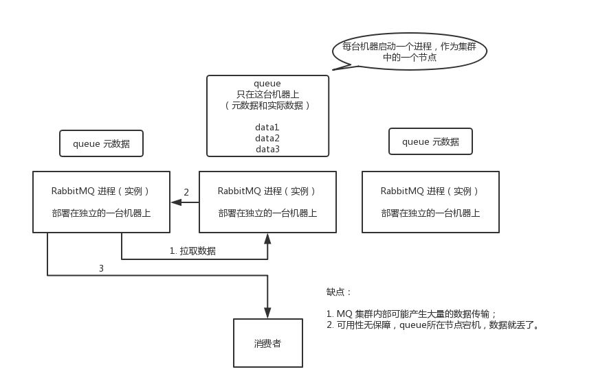
这种方式确实很麻烦，也不怎么好，**没做到所谓的分布式**，就是个普通集群。因为这导致你要么消费者每次随机连接一个实例然后拉取数据，要么固定连接那个 queue 所在实例消费数据，前者有**数据拉取的开销**，后者导致**单实例性能瓶颈**。
而且如果那个放 queue 的实例宕机了，会导致接下来其他实例就无法从那个实例拉取，如果你**开启了消息持久化**，让 RabbitMQ 落地存储消息的话，**消息不一定会丢**，得等这个实例恢复了，然后才可以继续从这个 queue 拉取数据。
所以这个事儿就比较尴尬了，这就**没有什么所谓的高可用性**，**这方案主要是提高吞吐量的**，就是说让集群中多个节点来服务某个 queue 的读写操作。

#### 镜像集群模式（高可用性）
这种模式，才是所谓的 RabbitMQ 的高可用模式。跟普通集群模式不一样的是，在镜像集群模式下，你创建的 queue，无论是元数据还是 queue 里的消息都会**存在于多个实例上**，就是说，每个 RabbitMQ 节点都有这个 queue 的一个**完整镜像**，包含 queue 的全部数据的意思。然后每次你写消息到 queue 的时候，都会自动把**消息同步**到多个实例的 queue 上。
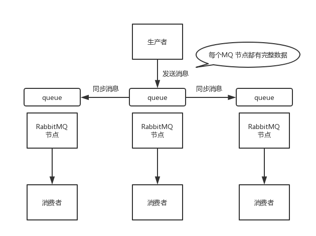
那么**如何开启这个镜像集群模式**呢？其实很简单，RabbitMQ 有很好的管理控制台，就是在后台新增一个策略，这个策略是**镜像集群模式的策略**，指定的时候是可以要求数据同步到所有节点的，也可以要求同步到指定数量的节点，再次创建 queue 的时候，应用这个策略，就会自动将数据同步到其他的节点上去了。
这样的话，好处在于，你任何一个机器宕机了，没事儿，其它机器（节点）还包含了这个 queue 的完整数据，别的 consumer 都可以到其它节点上去消费数据。坏处在于，第一，这个性能开销也太大了吧，消息需要同步到所有机器上，导致网络带宽压力和消耗很重！第二，这么玩儿，不是分布式的，就**没有扩展性可言**了，如果某个 queue 负载很重，你加机器，新增的机器也包含了这个 queue 的所有数据，并**没有办法线性扩展**你的 queue。你想，如果这个 queue 的数据量很大，大到这个机器上的容量无法容纳了，此时该怎么办呢？

## 有遇到过重复消费的问题吗？怎么解决的呢？
其实这是很常见的一个问题，这俩问题基本可以连起来问。既然是消费消息，那肯定要考虑会不会重复消费？能不能避免重复消费？或者重复消费了也别造成系统异常可以吗？这个是 MQ 领域的基本问题，其实本质上还是问你**使用消息队列如何保证幂等性**，这个是你架构里要考虑的一个问题。
回答这个问题，首先你别听到重复消息这个事儿，就一无所知吧，你**先大概说一说可能会有哪些重复消费的问题**。
首先，比如 RabbitMQ、RocketMQ、Kafka，都有可能会出现消息重复消费的问题，正常。因为这问题通常不是 MQ 自己保证的，是由我们开发来保证的。挑一个 Kafka 来举个例子，说说怎么重复消费吧。
Kafka 实际上有个 offset 的概念，就是每个消息写进去，都有一个 offset，代表消息的序号，然后 consumer 消费了数据之后，**每隔一段时间**（定时定期），会把自己消费过的消息的 offset 提交一下，表示“我已经消费过了，下次我要是重启啥的，你就让我继续从上次消费到的 offset 来继续消费吧”。
但是凡事总有意外，比如我们之前生产经常遇到的，就是你有时候重启系统，看你怎么重启了，如果碰到点着急的，直接 kill 进程了，再重启。这会导致 consumer 有些消息处理了，但是没来得及提交 offset，尴尬了。重启之后，少数消息会再次消费一次。
举个栗子。
有这么个场景。数据 1/2/3 依次进入 Kafka，Kafka 会给这三条数据每条分配一个 offset，代表这条数据的序号，我们就假设分配的 offset 依次是 152/153/154。消费者从 Kafka 去消费的时候，也是按照这个顺序去消费。假如当消费者消费了 `offset=153` 的这条数据，刚准备去提交 offset 到 Zookeeper，此时消费者进程被重启了。那么此时消费过的数据 1/2 的 offset 并没有提交，Kafka 也就不知道你已经消费了 `offset=153` 这条数据。那么重启之后，消费者会找 Kafka 说，嘿，哥儿们，你给我接着把上次我消费到的那个地方后面的数据继续给我传递过来。由于之前的 offset 没有提交成功，那么数据 1/2 会再次传过来，如果此时消费者没有去重的话，那么就会导致重复消费。
注意：新版的 Kafka 已经将 offset 的存储从 Zookeeper 转移至 Kafka brokers，并使用内部位移主题 `__consumer_offsets` 进行存储。
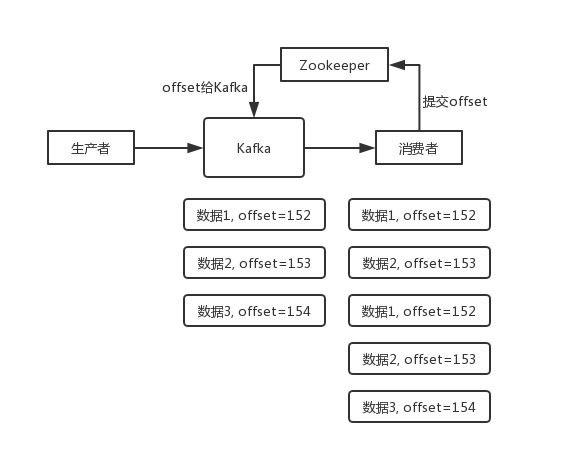
如果消费者干的事儿是拿一条数据就往数据库里写一条，会导致说，你可能就把数据 1/2 在数据库里插入了 2 次，那么数据就错啦。
其实重复消费不可怕，可怕的是你没考虑到重复消费之后，**怎么保证幂等性**。
举个例子吧。假设你有个系统，消费一条消息就往数据库里插入一条数据，要是你一个消息重复两次，你不就插入了两条，这数据不就错了？但是你要是消费到第二次的时候，自己判断一下是否已经消费过了，若是就直接扔了，这样不就保留了一条数据，从而保证了数据的正确性。
一条数据重复出现两次，数据库里就只有一条数据，这就保证了系统的幂等性。
幂等性，通俗点说，就一个数据，或者一个请求，给你重复来多次，你得确保对应的数据是不会改变的，**不能出错**。
所以第二个问题来了，怎么保证消息队列消费的幂等性？
其实还是得结合业务来思考，我这里给几个思路：

-  比如你拿个数据要写库，你先根据主键查一下，如果这数据都有了，你就别插入了，update 一下好吧。 
-  比如你是写 Redis，那没问题了，反正每次都是 set，天然幂等性。 
-  比如你不是上面两个场景，那做的稍微复杂一点，你需要让生产者发送每条数据的时候，里面加一个全局唯一的 id，类似订单 id 之类的东西，然后你这里消费到了之后，先根据这个 id 去比如 Redis 里查一下，之前消费过吗？如果没有消费过，你就处理，然后这个 id 写 Redis。如果消费过了，那你就别处理了，保证别重复处理相同的消息即可。 
-  比如基于数据库的唯一键来保证重复数据不会重复插入多条。因为有唯一键约束了，重复数据插入只会报错，不会导致数据库中出现脏数据。
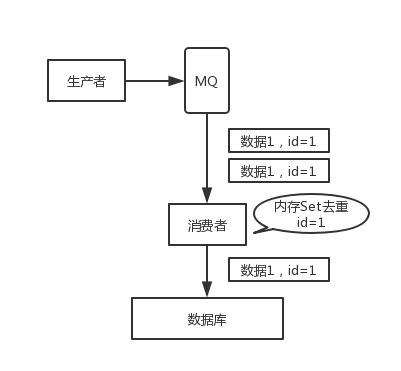 

当然，如何保证 MQ 的消费是幂等性的，在实际应用中需要结合具体的业务来看。

## 有遇到过消息丢失吗？可靠性怎么保证呢？
这个是肯定的，用 MQ 有个基本原则，就是**数据不能多一条，也不能少一条**，不能多，就是前面说的重复消费和幂等性问题。不能少，就是说这数据别搞丢了。那这个问题你必须得考虑一下。
如果说你这个是用 MQ 来传递非常核心的消息，比如说计费、扣费的一些消息，那必须确保这个 MQ 传递过程中**绝对不会把计费消息给弄丢**。
数据的丢失问题，可能出现在生产者、MQ、消费者中，咱们从 RabbitMQ 来分析一下吧。


#### 生产者弄丢了数据
生产者将数据发送到 RabbitMQ 的时候，可能数据就在半路给搞丢了，因为网络问题啥的，都有可能。
此时可以选择用 RabbitMQ 提供的事务功能，就是生产者**发送数据之前**开启 RabbitMQ 事务 `channel.txSelect()` ，然后发送消息，如果消息没有成功被 RabbitMQ 接收到，那么生产者会收到异常报错，此时就可以回滚事务 `channel.txRollback()` ，然后重试发送消息；如果收到了消息，那么可以提交事务 `channel.txCommit()` 。
```java
try {
    // 通过工厂创建连接
    connection = factory.newConnection();
    // 获取通道
    channel = connection.createChannel();
    // 开启事务
    channel.txSelect();

    // 这里发送消息
    channel.basicPublish(exchange, routingKey, MessageProperties.PERSISTENT_TEXT_PLAIN, msg.getBytes());

    // 模拟出现异常
    int result = 1 / 0;

    // 提交事务
    channel.txCommit();
} catch (IOException | TimeoutException e) {
    // 捕捉异常，回滚事务
    channel.txRollback();
}
```
但是问题是，RabbitMQ 事务机制（同步）一搞，基本上**吞吐量会下来，因为太耗性能**。
所以一般来说，如果你要确保说写 RabbitMQ 的消息别丢，可以开启 `confirm` 模式，在生产者那里设置开启 `confirm` 模式之后，你每次写的消息都会分配一个唯一的 id，然后如果写入了 RabbitMQ 中，RabbitMQ 会给你回传一个 `ack` 消息，告诉你说这个消息 ok 了。如果 RabbitMQ 没能处理这个消息，会回调你的一个 `nack` 接口，告诉你这个消息接收失败，你可以重试。而且你可以结合这个机制自己在内存里维护每个消息 id 的状态，如果超过一定时间还没接收到这个消息的回调，那么你可以重发。
事务机制和 `confirm` 机制最大的不同在于，**事务机制是同步的**，你提交一个事务之后会**阻塞**在那儿，但是 `confirm` 机制是**异步**的，你发送个消息之后就可以发送下一个消息，然后那个消息 RabbitMQ 接收了之后会异步回调你的一个接口通知你这个消息接收到了。
所以一般在生产者这块**避免数据丢失**，都是用 `confirm` 机制的。
> 已经在 transaction 事务模式的 channel 是不能再设置成 confirm 模式的，即这两种模式是不能共存的。

客户端实现生产者 `confirm` 有 3 种方式：
1.**普通 confirm 模式**：每发送一条消息后，调用 `waitForConfirms()` 方法，等待服务器端 confirm，如果服务端返回 false 或者在一段时间内都没返回，客户端可以进行消息重发。
```java
channel.basicPublish(ConfirmConfig.exchangeName, ConfirmConfig.routingKey, MessageProperties.PERSISTENT_TEXT_PLAIN, ConfirmConfig.msg_10B.getBytes());
if (!channel.waitForConfirms()) {
    // 消息发送失败
    // ...
}
```
2.**批量 confirm 模式**：每发送一批消息后，调用 `waitForConfirms()` 方法，等待服务端 confirm。
```java
channel.confirmSelect();
for (int i = 0; i < batchCount; ++i) {
    channel.basicPublish(ConfirmConfig.exchangeName, ConfirmConfig.routingKey, MessageProperties.PERSISTENT_TEXT_PLAIN, ConfirmConfig.msg_10B.getBytes());
}
if (!channel.waitForConfirms()) {
    // 消息发送失败
    // ...
}
```
3.**异步 confirm 模式**：提供一个回调方法，服务端 confirm 了一条或者多条消息后客户端会回调这个方法。
```java
SortedSet<Long> confirmSet = Collections.synchronizedSortedSet(new TreeSet<Long>());
channel.confirmSelect();
channel.addConfirmListener(new ConfirmListener() {
    public void handleAck(long deliveryTag, boolean multiple) throws IOException {
        if (multiple) {
            confirmSet.headSet(deliveryTag + 1).clear();
        } else {
            confirmSet.remove(deliveryTag);
        }
    }

    public void handleNack(long deliveryTag, boolean multiple) throws IOException {
        System.out.println("Nack, SeqNo: " + deliveryTag + ", multiple: " + multiple);
        if (multiple) {
            confirmSet.headSet(deliveryTag + 1).clear();
        } else {
            confirmSet.remove(deliveryTag);
        }
    }
});

while (true) {
    long nextSeqNo = channel.getNextPublishSeqNo();
    channel.basicPublish(ConfirmConfig.exchangeName, ConfirmConfig.routingKey, MessageProperties.PERSISTENT_TEXT_PLAIN, ConfirmConfig.msg_10B.getBytes());
    confirmSet.add(nextSeqNo);
}
```

#### RabbitMQ 弄丢了数据
就是 RabbitMQ 自己弄丢了数据，这个你必须**开启 RabbitMQ 的持久化**，就是消息写入之后会持久化到磁盘，哪怕是 RabbitMQ 自己挂了，**恢复之后会自动读取之前存储的数据**，一般数据不会丢。除非极其罕见的是，RabbitMQ 还没持久化，自己就挂了，**可能导致少量数据丢失**，但是这个概率较小。
设置持久化有**两个步骤**：

- 创建 queue 的时候将其设置为持久化。这样就可以保证 RabbitMQ 持久化 queue 的元数据，但是它是不会持久化 queue 里的数据的。
- 第二个是发送消息的时候将消息的 `deliveryMode` 设置为 2。就是将消息设置为持久化的，此时 RabbitMQ 就会将消息持久化到磁盘上去。

必须要同时设置这两个持久化才行，RabbitMQ 哪怕是挂了，再次重启，也会从磁盘上重启恢复 queue，恢复这个 queue 里的数据。
注意，哪怕是你给 RabbitMQ 开启了持久化机制，也有一种可能，就是这个消息写到了 RabbitMQ 中，但是还没来得及持久化到磁盘上，结果不巧，此时 RabbitMQ 挂了，就会导致内存里的一点点数据丢失。
所以，持久化可以跟生产者那边的 `confirm` 机制配合起来，只有消息被持久化到磁盘之后，才会通知生产者 `ack` 了，所以哪怕是在持久化到磁盘之前，RabbitMQ 挂了，数据丢了，生产者收不到 `ack` ，你也是可以自己重发的。

#### 消费端弄丢了数据
RabbitMQ 如果丢失了数据，主要是因为你消费的时候，**刚消费到，还没处理，结果进程挂了**，比如重启了，那么就尴尬了，RabbitMQ 认为你都消费了，这数据就丢了。
这个时候得用 RabbitMQ 提供的 `ack` 机制，简单来说，就是你必须关闭 RabbitMQ 的自动 `ack` ，可以通过一个 api 来调用就行，然后每次你自己代码里确保处理完的时候，再在程序里 `ack` 一把。这样的话，如果你还没处理完，不就没有 `ack` 了？那 RabbitMQ 就认为你还没处理完，这个时候 RabbitMQ 会把这个消费分配给别的 consumer 去处理，消息是不会丢的。
> 为了保证消息从队列中可靠地到达消费者，RabbitMQ 提供了消息确认机制。消费者在声明队列时，可以指定 noAck 参数，当 noAck=false，RabbitMQ 会等待消费者显式发回 ack 信号后，才从内存（和磁盘，如果是持久化消息）中移去消息。否则，一旦消息被消费者消费，RabbitMQ 会在队列中立即删除它。
> 
> 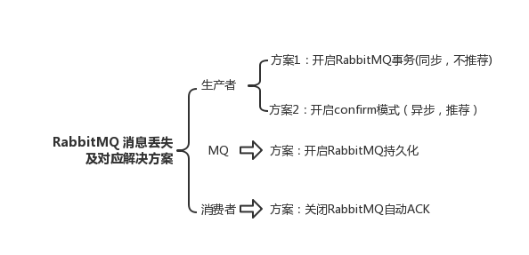


## 如何解决消息队列的延时以及过期失效问题？消息队列满了以后该怎么处理？有几百万消息持续积压几小时，说说怎么解决？
你看这问法，其实本质针对的场景，都是说，可能你的消费端出了问题，不消费了；或者消费的速度极其慢。接着就坑爹了，可能你的消息队列集群的磁盘都快写满了，都没人消费，这个时候怎么办？或者是这整个就积压了几个小时，你这个时候怎么办？或者是你积压的时间太长了，导致比如 RabbitMQ 设置了消息过期时间后就没了怎么办？
所以就这事儿，其实线上挺常见的，一般不出，一出就是大 case。一般常见于，举个例子，消费端每次消费之后要写 mysql，结果 mysql 挂了，消费端 hang 那儿了，不动了；或者是消费端出了个什么岔子，导致消费速度极其慢。
关于这个事儿，我们一个一个来梳理吧，先假设一个场景，我们现在消费端出故障了，然后大量消息在 mq 里积压，现在出事故了，慌了。

### 大量消息在 mq 里积压了几个小时了还没解决
几千万条数据在 MQ 里积压了七八个小时，从下午 4 点多，积压到了晚上 11 点多。这个是我们真实遇到过的一个场景，确实是线上故障了，这个时候要不然就是修复 consumer 的问题，让它恢复消费速度，然后傻傻的等待几个小时消费完毕。这个肯定不能在面试的时候说吧。
一个消费者一秒是 1000 条，一秒 3 个消费者是 3000 条，一分钟就是 18 万条。所以如果你积压了几百万到上千万的数据，即使消费者恢复了，也需要大概 1 小时的时间才能恢复过来。
一般这个时候，只能临时紧急扩容了，具体操作步骤和思路如下：

- 先修复 consumer 的问题，确保其恢复消费速度，然后将现有 consumer 都停掉。
- 新建一个 topic，partition 是原来的 10 倍，临时建立好原先 10 倍的 queue 数量。
- 然后写一个临时的分发数据的 consumer 程序，这个程序部署上去消费积压的数据，**消费之后不做耗时的处理**，直接均匀轮询写入临时建立好的 10 倍数量的 queue。
- 接着临时征用 10 倍的机器来部署 consumer，每一批 consumer 消费一个临时 queue 的数据。这种做法相当于是临时将 queue 资源和 consumer 资源扩大 10 倍，以正常的 10 倍速度来消费数据。
- 等快速消费完积压数据之后，**得恢复原先部署的架构**，**重新**用原先的 consumer 机器来消费消息。

### MQ中的消息过期失效了
假设你用的是 RabbitMQ，RabbtiMQ 是可以设置过期时间的，也就是 TTL。如果消息在 queue 中积压超过一定的时间就会被 RabbitMQ 给清理掉，这个数据就没了。那这就是第二个坑了。这就不是说数据会大量积压在 mq 里，而是**大量的数据会直接搞丢**。
这个情况下，就不是说要增加 consumer 消费积压的消息，因为实际上没啥积压，而是丢了大量的消息。我们可以采取一个方案，就是**批量重导**，这个我们之前线上也有类似的场景干过。就是大量积压的时候，我们当时就直接丢弃数据了，然后等过了高峰期以后，比如大家一起喝咖啡熬夜到晚上 12 点以后，用户都睡觉了。这个时候我们就开始写程序，将丢失的那批数据，写个临时程序，一点一点的查出来，然后重新灌入 mq 里面去，把白天丢的数据给他补回来。也只能是这样了。
假设 1 万个订单积压在 mq 里面，没有处理，其中 1000 个订单都丢了，你只能手动写程序把那 1000 个订单给查出来，手动发到 mq 里去再补一次。

### MQ 都快写满了
如果消息积压在 mq 里，你很长时间都没有处理掉，此时导致 mq 都快写满了，咋办？这个还有别的办法吗？没有，谁让你第一个方案执行的太慢了，你临时写程序，接入数据来消费，**消费一个丢弃一个，都不要了**，快速消费掉所有的消息。然后走第二个方案，到了晚上再补数据吧。
对于 RocketMQ，官方针对消息积压问题，提供了解决方案。

### 1. 提高消费并行度
绝大部分消息消费行为都属于 IO 密集型，即可能是操作数据库，或者调用 RPC，这类消费行为的消费速度在于后端数据库或者外系统的吞吐量，通过增加消费并行度，可以提高总的消费吞吐量，但是并行度增加到一定程度，反而会下降。所以，应用必须要设置合理的并行度。 如下有几种修改消费并行度的方法：
同一个 ConsumerGroup 下，通过增加 Consumer 实例数量来提高并行度（需要注意的是超过订阅队列数的 Consumer 实例无效）。可以通过加机器，或者在已有机器启动多个进程的方式。 提高单个 Consumer 的消费并行线程，通过修改参数 consumeThreadMin、consumeThreadMax 实现。

### 2. 批量方式消费
某些业务流程如果支持批量方式消费，则可以很大程度上提高消费吞吐量，例如订单扣款类应用，一次处理一个订单耗时 1 s，一次处理 10 个订单可能也只耗时 2 s，这样即可大幅度提高消费的吞吐量，通过设置 consumer 的 consumeMessageBatchMaxSize 返个参数，默认是 1，即一次只消费一条消息，例如设置为 N，那么每次消费的消息数小于等于 N。

### 3. 跳过非重要消息
发生消息堆积时，如果消费速度一直追不上发送速度，如果业务对数据要求不高的话，可以选择丢弃不重要的消息。例如，当某个队列的消息数堆积到 100000 条以上，则尝试丢弃部分或全部消息，这样就可以快速追上发送消息的速度。示例代码如下：
```java
public ConsumeConcurrentlyStatus consumeMessage(
            List<MessageExt> msgs,
            ConsumeConcurrentlyContext context) {
    long offset = msgs.get(0).getQueueOffset();
    String maxOffset =
            msgs.get(0).getProperty(Message.PROPERTY_MAX_OFFSET);
    long diff = Long.parseLong(maxOffset) - offset;
    if (diff > 100000) {
        // TODO 消息堆积情况的特殊处理
        return ConsumeConcurrentlyStatus.CONSUME_SUCCESS;
    }
    // TODO 正常消费过程
    return ConsumeConcurrentlyStatus.CONSUME_SUCCESS;
}
```

### 4. 优化每条消息消费过程
举例如下，某条消息的消费过程如下：

- 根据消息从 DB 查询【数据 1】
- 根据消息从 DB 查询【数据 2】
- 复杂的业务计算
- 向 DB 插入【数据 3】
- 向 DB 插入【数据 4】

这条消息的消费过程中有 4 次与 DB 的 交互，如果按照每次 5ms 计算，那么总共耗时 20ms，假设业务计算耗时 5ms，那么总过耗时 25ms，所以如果能把 4 次 DB 交互优化为 2 次，那么总耗时就可以优化到 15ms，即总体性能提高了 40%。所以应用如果对时延敏感的话，可以把 DB 部署在 SSD 硬盘，相比于 SCSI 磁盘，前者的 RT 会小很多。

## 如果让你写一个消息队列，该如何进行架构设计？说一下你的思路。
其实聊到这个问题，一般面试官要考察两块：

- 你有没有对某一个消息队列做过较为深入的原理的了解，或者从整体了解把握住一个消息队列的架构原理。
- 看看你的设计能力，给你一个常见的系统，就是消息队列系统，看看你能不能从全局把握一下整体架构设计，给出一些关键点出来。

说实话，问类似问题的时候，大部分人基本都会蒙，因为平时从来没有思考过类似的问题，**大多数人就是平时埋头用，从来不去思考背后的一些东西**。类似的问题，比如，如果让你来设计一个 Spring 框架你会怎么做？如果让你来设计一个 Dubbo 框架你会怎么做？如果让你来设计一个 MyBatis 框架你会怎么做？
其实回答这类问题，说白了，不求你看过那技术的源码，起码你要大概知道那个技术的基本原理、核心组成部分、基本架构构成，然后参照一些开源的技术把一个系统设计出来的思路说一下就好。
比如说这个消息队列系统，我们从以下几个角度来考虑一下：

- 首先这个 mq 得支持可伸缩性吧，就是需要的时候快速扩容，就可以增加吞吐量和容量，那怎么搞？设计个分布式的系统呗，参照一下 kafka 的设计理念，broker -> topic -> partition，每个 partition 放一个机器，就存一部分数据。如果现在资源不够了，简单啊，给 topic 增加 partition，然后做数据迁移，增加机器，不就可以存放更多数据，提供更高的吞吐量了？
- 其次你得考虑一下这个 mq 的数据要不要落地磁盘吧？那肯定要了，落磁盘才能保证别进程挂了数据就丢了。那落磁盘的时候怎么落啊？顺序写，这样就没有磁盘随机读写的寻址开销，磁盘顺序读写的性能是很高的，这就是 kafka 的思路。
- 其次你考虑一下你的 mq 的可用性啊？这个事儿，具体参考之前可用性那个环节讲解的 kafka 的高可用保障机制。多副本 -> leader & follower -> broker 挂了重新选举 leader 即可对外服务。
- 能不能支持数据 0 丢失啊？可以的，参考我们之前说的那个 kafka 数据零丢失方案。

mq 肯定是很复杂的，面试官问你这个问题，其实是个开放题，他就是看看你有没有从架构角度整体构思和设计的思维以及能力。确实这个问题可以刷掉一大批人，因为大部分人平时不思考这些东西。

## 在项目里面缓存是怎么用的？
项目中缓存是如何使用的？为什么要用缓存？缓存使用不当会造成什么后果？
这个问题，互联网公司必问，要是一个人连缓存都不太清楚，那确实比较尴尬。
只要问到缓存，上来第一个问题，肯定是先问问你项目哪里用了缓存？为啥要用？不用行不行？如果用了以后可能会有什么不良的后果？
这就是看看你对缓存这个东西背后有没有思考，如果你就是傻乎乎的瞎用，没法给面试官一个合理的解答，那面试官对你印象肯定不太好，觉得你平时思考太少，就知道干活儿。

### 项目中缓存是如何使用的？
这个，需要结合自己项目的业务来。
比如说：

- 热点数据，商品信息
- 排行榜信息
- 用户状态信息

### 为什么要用缓存？
用缓存，主要有两个用途：**高性能**、**高并发**。

#### 高性能
假设这么个场景，你有个操作，一个请求过来，吭哧吭哧你各种乱七八糟操作 mysql，半天查出来一个结果，耗时 600ms。但是这个结果可能接下来几个小时都不会变了，或者变了也可以不用立即反馈给用户。那么此时咋办？
缓存啊，折腾 600ms 查出来的结果，扔缓存里，一个 key 对应一个 value，下次再有人查，别走 mysql 折腾 600ms 了，直接从缓存里，通过一个 key 查出来一个 value，2ms 搞定。性能提升 300 倍。
就是说对于一些需要复杂操作耗时查出来的结果，且确定后面不怎么变化，但是有很多读请求，那么直接将查询出来的结果放在缓存中，后面直接读缓存就好。

#### 高并发
mysql 这么重的数据库，压根儿设计不是让你玩儿高并发的，虽然也可以玩儿，但是天然支持不好。mysql 单机支撑到 `2000QPS` 也开始容易报警了。
所以要是你有个系统，高峰期一秒钟过来的请求有 1 万，那一个 mysql 单机绝对会死掉。你这个时候就只能上缓存，把很多数据放缓存，别放 mysql。缓存功能简单，说白了就是 `key-value` 式操作，单机支撑的并发量轻松一秒几万十几万，支撑高并发 so easy。单机承载并发量是 mysql 单机的几十倍。
> 缓存是走内存的，内存天然就支撑高并发。


### 用了缓存之后会有什么不良后果？
常见的缓存问题有以下几个：

- 缓存与数据库双写不一致
- 缓存雪崩、缓存穿透、缓存击穿
- 缓存并发竞争

## 做过技术预研吗？为什么最终决定用Redis呢？

### Redis 和 Memcached 有啥区别？

#### Redis 支持复杂的数据结构
Redis 相比 Memcached 来说，拥有更多的数据结构，能支持更丰富的数据操作。如果需要缓存能够支持更复杂的结构和操作， Redis 会是不错的选择。

#### Redis 原生支持集群模式
在 Redis3.x 版本中，便能支持 cluster 模式，而 Memcached 没有原生的集群模式，需要依靠客户端来实现往集群中分片写入数据。

#### 性能对比
由于 Redis 只使用**单核**，而 Memcached 可以使用**多核**，所以平均每一个核上 Redis 在存储小数据时比 Memcached 性能更高。而在 100k 以上的数据中，Memcached 性能要高于 Redis。虽然 Redis 最近也在存储大数据的性能上进行优化，但是比起 Memcached，还是稍有逊色。

## 你们是如何保证Redis高并发、高可用的呢？
如何保证 redis 的高并发和高可用？redis 的主从复制原理能介绍一下么？redis 的哨兵原理能介绍一下么？
其实问这个问题，主要是考考你，redis 单机能承载多高并发？如果单机扛不住如何扩容扛更多的并发？redis 会不会挂？既然 redis 会挂那怎么保证 redis 是高可用的？
其实针对的都是项目中你肯定要考虑的一些问题，如果你没考虑过，那确实你对生产系统中的问题思考太少。
如果你用 redis 缓存技术的话，肯定要考虑如何用 redis 来加多台机器，保证 redis 是高并发的，还有就是如何让 redis 保证自己不是挂掉以后就直接死掉了，即 redis 高可用。
由于此节内容较多，因此，会分为两个小节进行讲解。

- redis 主从架构
- redis 基于哨兵实现高可用

redis 实现**高并发**主要依靠**主从架构**，一主多从，一般来说，很多项目其实就足够了，单主用来写入数据，单机几万 QPS，多从用来查询数据，多个从实例可以提供每秒 10w 的 QPS。
如果想要在实现高并发的同时，容纳大量的数据，那么就需要 redis 集群，使用 redis 集群之后，可以提供每秒几十万的读写并发。
redis 高可用，如果是做主从架构部署，那么加上哨兵就可以了，就可以实现，任何一个实例宕机，可以进行主备切换。

### Redis主从架构
单机的 Redis，能够承载的 QPS 大概就在上万到几万不等。对于缓存来说，一般都是用来支撑**读高并发**的。因此架构做成主从(master-slave)架构，一主多从，主负责写，并且将数据复制到其它的 slave 节点，从节点负责读。所有的**读请求全部走从节点**。这样也可以很轻松实现水平扩容，**支撑读高并发**。
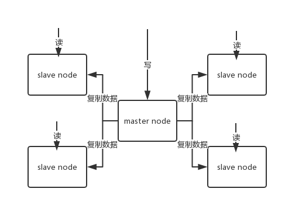
Redis replication -> 主从架构 -> 读写分离 -> 水平扩容支撑读高并发

## Redis replication 的核心机制

- Redis 采用**异步方式**复制数据到 slave 节点，不过 Redis2.8 开始，slave node 会周期性地确认自己每次复制的数据量；
- 一个 master node 是可以配置多个 slave node 的；
- slave node 也可以连接其他的 slave node；
- slave node 做复制的时候，不会 block master node 的正常工作；
- slave node 在做复制的时候，也不会 block 对自己的查询操作，它会用旧的数据集来提供服务；但是复制完成的时候，需要删除旧数据集，加载新数据集，这个时候就会暂停对外服务了；
- slave node 主要用来进行横向扩容，做读写分离，扩容的 slave node 可以提高读的吞吐量。

注意，如果采用了主从架构，那么建议必须**开启** master node 的[持久化](https://doocs.github.io/advanced-java/#/docs/high-concurrency/redis-persistence)，不建议用 slave node 作为 master node 的数据热备，因为那样的话，如果你关掉 master 的持久化，可能在 master 宕机重启的时候数据是空的，然后可能一经过复制， slave node 的数据也丢了。
另外，master 的各种备份方案，也需要做。万一本地的所有文件丢失了，从备份中挑选一份 rdb 去恢复 master，这样才能**确保启动的时候，是有数据的**，即使采用了后续讲解的[高可用机制](https://doocs.github.io/advanced-java/#/docs/high-concurrency/redis-sentinel)，slave node 可以自动接管 master node，但也可能 sentinel 还没检测到 master failure，master node 就自动重启了，还是可能导致上面所有的 slave node 数据被清空。

## Redis 主从复制的核心原理
当启动一个 slave node 的时候，它会发送一个 `PSYNC` 命令给 master node。
如果这是 slave node 初次连接到 master node，那么会触发一次 `full resynchronization` 全量复制。此时 master 会启动一个后台线程，开始生成一份 `RDB` 快照文件，同时还会将从客户端 client 新收到的所有写命令缓存在内存中。 `RDB` 文件生成完毕后， master 会将这个 `RDB` 发送给 slave，slave 会先**写入本地磁盘，然后再从本地磁盘加载到内存**中，接着 master 会将内存中缓存的写命令发送到 slave，slave 也会同步这些数据。slave node 如果跟 master node 有网络故障，断开了连接，会自动重连，连接之后 master node 仅会复制给 slave 部分缺少的数据。


### 主从复制的断点续传
从 Redis2.8 开始，就支持主从复制的断点续传，如果主从复制过程中，网络连接断掉了，那么可以接着上次复制的地方，继续复制下去，而不是从头开始复制一份。
master node 会在内存中维护一个 backlog，master 和 slave 都会保存一个 replica offset 还有一个 master run id，offset 就是保存在 backlog 中的。如果 master 和 slave 网络连接断掉了，slave 会让 master 从上次 replica offset 开始继续复制，如果没有找到对应的 offset，那么就会执行一次 `resynchronization` 。
> 如果根据 host+ip 定位 master node，是不靠谱的，如果 master node 重启或者数据出现了变化，那么 slave node 应该根据不同的 run id 区分。


### 无磁盘化复制
master 在内存中直接创建 `RDB` ，然后发送给 slave，不会在自己本地落地磁盘了。只需要在配置文件中开启 `repl-diskless-sync yes` 即可。
```java
repl-diskless-sync yes

# 等待 5s 后再开始复制，因为要等更多 slave 重新连接过来
repl-diskless-sync-delay 5
```

### 过期 key 处理
slave 不会过期 key，只会等待 master 过期 key。如果 master 过期了一个 key，或者通过 LRU 淘汰了一个 key，那么会模拟一条 del 命令发送给 slave。

### 复制的完整流程
slave node 启动时，会在自己本地保存 master node 的信息，包括 master node 的 `host` 和 `ip` ，但是复制流程没开始。
slave node 内部有个定时任务，每秒检查是否有新的 master node 要连接和复制，如果发现，就跟 master node 建立 socket 网络连接。然后 slave node 发送 `ping` 命令给 master node。如果 master 设置了 requirepass，那么 slave node 必须发送 masterauth 的口令过去进行认证。master node **第一次执行全量复制**，将所有数据发给 slave node。而在后续，master node 持续将写命令，异步复制给 slave node。
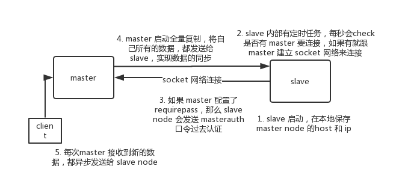

### 全量复制

-  master 执行 bgsave ，在本地生成一份 rdb 快照文件。 
-  master node 将 rdb 快照文件发送给 slave node，如果 rdb 复制时间超过 60 秒（repl-timeout），那么 slave node 就会认为复制失败，可以适当调大这个参数(对于千兆网卡的机器，一般每秒传输 100MB，6G 文件，很可能超过 60s) 
-  master node 在生成 rdb 时，会将所有新的写命令缓存在内存中，在 slave node 保存了 rdb 之后，再将新的写命令复制给 slave node。 
-  如果在复制期间，内存缓冲区持续消耗超过 64MB，或者一次性超过 256MB，那么停止复制，复制失败。
client-output-buffer-limit slave 256MB 64MB 60 
-  slave node 接收到 rdb 之后，清空自己的旧数据，然后重新加载 rdb 到自己的内存中。注意，在清空旧数据之前，slave node 依然会**基于旧的数据版本**对外提供服务。 
-  如果 slave node 开启了 AOF，那么会立即执行 BGREWRITEAOF，重写 AOF。 

### 增量复制

- 如果全量复制过程中，master-slave 网络连接断掉，那么 slave 重新连接 master 时，会触发增量复制。
- master 直接从自己的 backlog 中获取部分丢失的数据，发送给 slave node，默认 backlog 就是 1MB。
- master 就是根据 slave 发送的 psync 中的 offset 来从 backlog 中获取数据的。

### heartbeat
主从节点互相都会发送 heartbeat 信息。
master 默认每隔 10 秒发送一次 heartbeat，slave node 每隔 1 秒发送一个 heartbeat。

### 异步复制
master 每次接收到写命令之后，先在内部写入数据，然后异步发送给 slave node。

### Redis 如何才能做到高可用
如果系统在 365 天内，有 99.99% 的时间，都是可以对外提供服务的，那么就说系统是高可用的。
一个 slave 挂掉了，是不会影响可用性的，还有其它的 slave 在提供相同数据下的相同的对外的查询服务。
但是，如果 master node 死掉了，会怎么样？没法写数据了，写缓存的时候，全部失效了。slave node 还有什么用呢，没有 master 给它们复制数据了，系统相当于不可用了。
Redis 的高可用架构，叫做 `failover` **故障转移**，也可以叫做主备切换。
master node 在故障时，自动检测，并且将某个 slave node 自动切换为 master node 的过程，叫做主备切换。这个过程，实现了 Redis 的主从架构下的高可用。

## 做了持久化配置吗？你们线上是如何配置的呢？
Redis 如果仅仅只是将数据缓存在内存里面，如果 Redis 宕机了再重启，内存里的数据就全部都弄丢了啊。你必须得用 Redis 的持久化机制，将数据写入内存的同时，异步的慢慢的将数据写入磁盘文件里，进行持久化。
如果 Redis 宕机重启，自动从磁盘上加载之前持久化的一些数据就可以了，也许会丢失少许数据，但是至少不会将所有数据都弄丢。
这个其实一样，针对的都是 Redis 的生产环境可能遇到的一些问题，就是 Redis 要是挂了再重启，内存里的数据不就全丢了？能不能重启的时候把数据给恢复了？
持久化主要是做灾难恢复、数据恢复，也可以归类到高可用的一个环节中去，比如你 Redis 整个挂了，然后 Redis 就不可用了，你要做的事情就是让 Redis 变得可用，尽快变得可用。
重启 Redis，尽快让它对外提供服务，如果没做数据备份，这时候 Redis 启动了，也不可用啊，数据都没了。
很可能说，大量的请求过来，缓存全部无法命中，在 Redis 里根本找不到数据，这个时候就死定了，出现**缓存雪崩**问题。所有请求没有在 Redis 命中，就会去 mysql 数据库这种数据源头中去找，一下子 mysql 承接高并发，然后就挂了...
如果你把 Redis 持久化做好，备份和恢复方案做到企业级的程度，那么即使你的 Redis 故障了，也可以通过备份数据，快速恢复，一旦恢复立即对外提供服务。

### Redis 持久化的两种方式

- RDB：RDB 持久化机制，是对 Redis 中的数据执行**周期性**的持久化。
- AOF：AOF 机制对每条写入命令作为日志，以 `append-only` 的模式写入一个日志文件中，在 Redis 重启的时候，可以通过**回放** AOF 日志中的写入指令来重新构建整个数据集。

通过 RDB 或 AOF，都可以将 Redis 内存中的数据给持久化到磁盘上面来，然后可以将这些数据备份到别的地方去，比如说阿里云等云服务。
如果 Redis 挂了，服务器上的内存和磁盘上的数据都丢了，可以从云服务上拷贝回来之前的数据，放到指定的目录中，然后重新启动 Redis，Redis 就会自动根据持久化数据文件中的数据，去恢复内存中的数据，继续对外提供服务。
如果同时使用 RDB 和 AOF 两种持久化机制，那么在 Redis 重启的时候，会使用 **AOF** 来重新构建数据，因为 AOF 中的**数据更加完整**。

#### RDB 优缺点

- RDB 会生成多个数据文件，每个数据文件都代表了某一个时刻中 Redis 的数据，这种多个数据文件的方式，**非常适合做冷备**，可以将这种完整的数据文件发送到一些远程的安全存储上去，比如说 Amazon 的 S3 云服务上去，在国内可以是阿里云的 ODPS 分布式存储上，以预定好的备份策略来定期备份 Redis 中的数据。
- RDB 对 Redis 对外提供的读写服务，影响非常小，可以让 Redis **保持高性能**，因为 Redis 主进程只需要 fork 一个子进程，让子进程执行磁盘 IO 操作来进行 RDB 持久化即可。
- 相对于 AOF 持久化机制来说，直接基于 RDB 数据文件来重启和恢复 Redis 进程，更加快速。
- 如果想要在 Redis 故障时，尽可能少的丢失数据，那么 RDB 没有 AOF 好。一般来说，RDB 数据快照文件，都是每隔 5 分钟，或者更长时间生成一次，这个时候就得接受一旦 Redis 进程宕机，那么会丢失最近 5 分钟（甚至更长时间）的数据。
- RDB 每次在 fork 子进程来执行 RDB 快照数据文件生成的时候，如果数据文件特别大，可能会导致对客户端提供的服务暂停数毫秒，或者甚至数秒。

#### AOF 优缺点

- AOF 可以更好的保护数据不丢失，一般 AOF 会每隔 1 秒，通过一个后台线程执行一次 `fsync` 操作，最多丢失 1 秒钟的数据。
- AOF 日志文件以 `append-only` 模式写入，所以没有任何磁盘寻址的开销，写入性能非常高，而且文件不容易破损，即使文件尾部破损，也很容易修复。
- AOF 日志文件即使过大的时候，出现后台重写操作，也不会影响客户端的读写。因为在 `rewrite` log 的时候，会对其中的指令进行压缩，创建出一份需要恢复数据的最小日志出来。在创建新日志文件的时候，老的日志文件还是照常写入。当新的 merge 后的日志文件 ready 的时候，再交换新老日志文件即可。
- AOF 日志文件的命令通过可读较强的方式进行记录，这个特性非常**适合做灾难性的误删除的紧急恢复**。比如某人不小心用 `flushall` 命令清空了所有数据，只要这个时候后台 `rewrite` 还没有发生，那么就可以立即拷贝 AOF 文件，将最后一条 `flushall` 命令给删了，然后再将该 `AOF` 文件放回去，就可以通过恢复机制，自动恢复所有数据。
- 对于同一份数据来说，AOF 日志文件通常比 RDB 数据快照文件更大。
- AOF 开启后，支持的写 QPS 会比 RDB 支持的写 QPS 低，因为 AOF 一般会配置成每秒 `fsync` 一次日志文件，当然，每秒一次 `fsync` ，性能也还是很高的。（如果实时写入，那么 QPS 会大降，Redis 性能会大大降低）
- 以前 AOF 发生过 bug，就是通过 AOF 记录的日志，进行数据恢复的时候，没有恢复一模一样的数据出来。所以说，类似 AOF 这种较为复杂的基于命令日志 `merge` 回放的方式，比基于 RDB 每次持久化一份完整的数据快照文件的方式，更加脆弱一些，容易有 bug。不过 AOF 就是为了避免 rewrite 过程导致的 bug，因此每次 rewrite 并不是基于旧的指令日志进行 merge 的，而是**基于当时内存中的数据进行指令的重新构建**，这样健壮性会好很多。

### RDB 和 AOF 到底该如何选择

- 不要仅仅使用 RDB，因为那样会导致你丢失很多数据；
- 也不要仅仅使用 AOF，因为那样有两个问题：第一，你通过 AOF 做冷备，没有 RDB 做冷备来的恢复速度更快；第二，RDB 每次简单粗暴生成数据快照，更加健壮，可以避免 AOF 这种复杂的备份和恢复机制的 bug；
- Redis 支持同时开启开启两种持久化方式，我们可以综合使用 AOF 和 RDB 两种持久化机制，用 AOF 来保证数据不丢失，作为数据恢复的第一选择；用 RDB 来做不同程度的冷备，在 AOF 文件都丢失或损坏不可用的时候，还可以使用 RDB 来进行快速的数据恢复。

## 雪崩、穿透、击穿问题你们怎么解决的呢？
其实这是问到缓存必问的，因为缓存雪崩和穿透，是缓存最大的两个问题，要么不出现，一旦出现就是致命性的问题，所以面试官一定会问你。
对于系统 A，假设每天高峰期每秒 5000 个请求，本来缓存在高峰期可以扛住每秒 4000 个请求，但是缓存机器意外发生了全盘宕机。缓存挂了，此时 1 秒 5000 个请求全部落数据库，数据库必然扛不住，它会报一下警，然后就挂了。此时，如果没有采用什么特别的方案来处理这个故障，DBA 很着急，重启数据库，但是数据库立马又被新的流量给打死了。
这就是缓存雪崩。
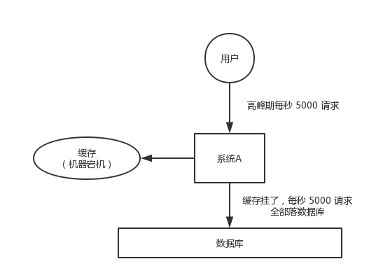
大约在 3 年前，国内比较知名的一个互联网公司，曾因为缓存事故，导致雪崩，后台系统全部崩溃，事故从当天下午持续到晚上凌晨 3~4 点，公司损失了几千万。
缓存雪崩的事前事中事后的解决方案如下：

-  事前：Redis 高可用，主从+哨兵，Redis cluster，避免全盘崩溃。 
-  事中：本地 ehcache 缓存 + hystrix 限流&降级，避免 MySQL 被打死。 
-  事后：Redis 持久化，一旦重启，自动从磁盘上加载数据，快速恢复缓存数据。
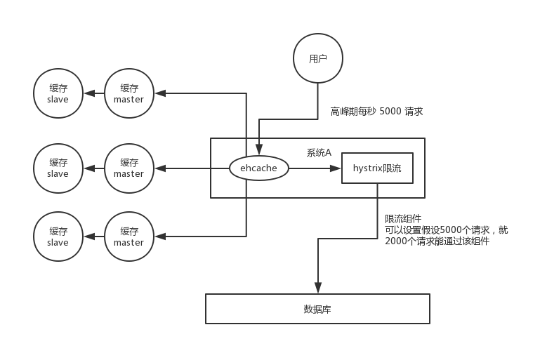 

用户发送一个请求，系统 A 收到请求后，先查本地 ehcache 缓存，如果没查到再查 Redis。如果 ehcache 和 Redis 都没有，再查数据库，将数据库中的结果，写入 ehcache 和 Redis 中。
限流组件，可以设置每秒的请求，有多少能通过组件，剩余的未通过的请求，怎么办？**走降级**！可以返回一些默认的值，或者友情提示，或者空值。
好处：

- 数据库绝对不会死，限流组件确保了每秒只有多少个请求能通过。
- 只要数据库不死，就是说，对用户来说，2/5 的请求都是可以被处理的。
- 只要有 2/5 的请求可以被处理，就意味着你的系统没死，对用户来说，可能就是点击几次刷不出来页面，但是多点几次，就可以刷出来了。

### 缓存穿透(Cache Penetration)
对于系统 A，假设一秒 5000 个请求，结果其中 4000 个请求是黑客发出的恶意攻击。
黑客发出的那 4000 个攻击，缓存中查不到，每次你去数据库里查，也查不到。
举个栗子。数据库 id 是从 1 开始的，结果黑客发过来的请求 id 全部都是负数。这样的话，缓存中不会有，请求每次都“**视缓存于无物**”，直接查询数据库。这种恶意攻击场景的缓存穿透就会直接把数据库给打死。
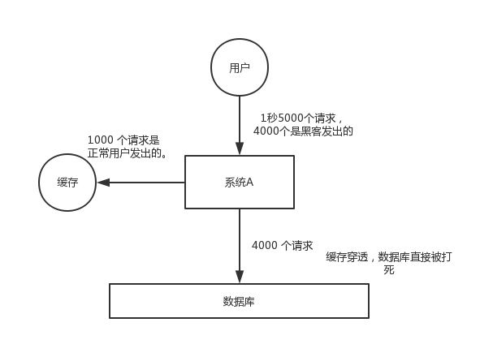
解决方式很简单，每次系统 A 从数据库中只要没查到，就写一个空值到缓存里去，比如 `set -999 UNKNOWN` 。然后设置一个过期时间，这样的话，下次有相同的 key 来访问的时候，在缓存失效之前，都可以直接从缓存中取数据。
当然，如果黑客如果每次使用不同的负数 id 来攻击，写空值的方法可能就不奏效了。更为经常的做法是在缓存之前增加布隆过滤器，将数据库中所有可能的数据哈希映射到布隆过滤器中。然后对每个请求进行如下判断：

- 请求数据的 key 不存在于布隆过滤器中，可以确定数据就一定不会存在于数据库中，系统可以立即返回不存在。
- 请求数据的 key 存在于布隆过滤器中，则继续再向缓存中查询。

使用布隆过滤器能够对访问的请求起到了一定的初筛作用，避免了因数据不存在引起的查询压力。
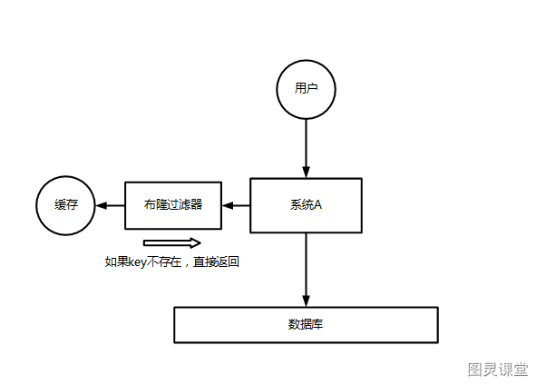

### 缓存击穿(Hotspot Invalid)
缓存击穿，就是说某个 key 非常热点，访问非常频繁，处于集中式高并发访问的情况，当这个 key 在失效的瞬间，大量的请求就击穿了缓存，直接请求数据库，就像是在一道屏障上凿开了一个洞。
不同场景下的解决方式可如下：

- 若缓存的数据是基本不会发生更新的，则可尝试将该热点数据设置为永不过期。
- 若缓存的数据更新不频繁，且缓存刷新的整个流程耗时较少的情况下，则可以采用基于 Redis、zookeeper 等分布式中间件的分布式互斥锁，或者本地互斥锁以保证仅少量的请求能请求数据库并重新构建缓存，其余线程则在锁释放后能访问到新缓存。
- 若缓存的数据更新频繁或者在缓存刷新的流程耗时较长的情况下，可以利用定时线程在缓存过期前主动地重新构建缓存或者延后缓存的过期时间，以保证所有的请求能一直访问到对应的缓存。

## Redis的内存用完了会发生什么？

- 不进行数据淘汰的策略，只有 noeviction 这一种。

会进行淘汰的 7 种策略，我们可以再进一步根据淘汰候选数据集的范围把它们分成两类：

- 在设置了过期时间的数据中进行淘汰，包括 volatile-random、volatile-ttl、volatile-lru、volatile-lfu四种。
- 在所有数据范围内进行淘汰，包括 allkeys-lru、allkeys-random、allkeys-lfu三种。
| 策略 | 规则 |
| --- | --- |
| volatile-ttl | 在筛选时，会针对设置了过期时间的键值对，根据过期时间的先后进行删除，越早过期的越先被删除。 |
| volatile-random | 在设置了过期时间的键值对中，进行随机删除。 |
| volatile-lru | 使用 LRU 算法筛选设置了过期时间的键值对 |
| volatile-lfu | 使用 LFU 算法选择设置了过期时间的键值对 |

| 策略 | 规则 |
| --- | --- |
| allkeys-random | 从所有键值对中随机选择并删除数据； |
| allkeys-lru | 使用 LRU 算法在所有数据中进行筛选 |
| allkeys-lfu | 使用 LFU 算法在所有数据中进行筛选 |


## 你知道CAP定理和BASE理论吗？

### CAP定理
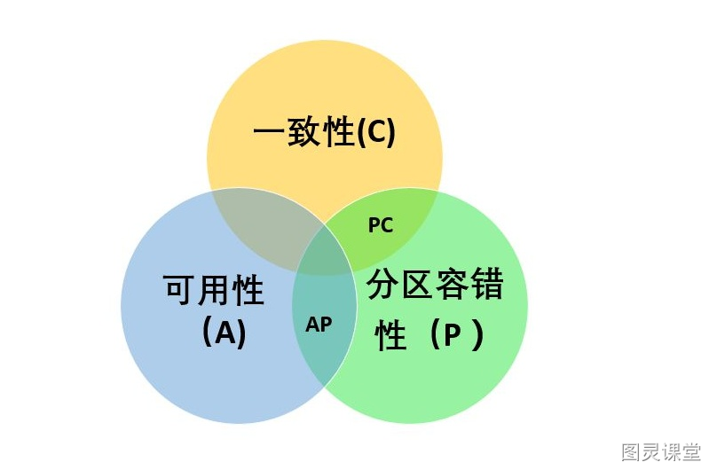

- **Consistency 一致性** 
   -  一致性指“`all nodes see the same data at the same time`”，即所有节点在同一时间的数据完全一致。
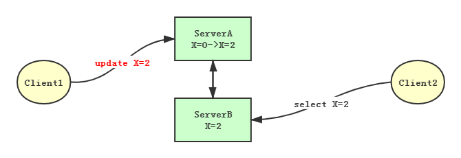 
   -  一致性是因为多个数据拷贝下并发读写才有的问题，因此理解时一定要注意结合考虑多个数据拷贝下并发读写的场景。对于一致性，可以分为从客户端和服务端两个不同的视角。 
   -  对于一致性，可以分为从客户端和服务端两个不同的视角。 
      - 客户端 
         - 从客户端来看，一致性主要指的是多并发访问时更新过的数据如何获取的问题。
      - 服务端 
         - 从服务端来看，则是更新如何分布到整个系统，以保证数据最终一致。
   -  对于一致性，可以分为强/弱/最终一致性三类 
      - 从客户端角度，多进程并发访问时，更新过的数据在不同进程如何获取的不同策略，决定了不同的一致性。
      - 强一致性 
         - 对于关系型数据库，要求更新过的数据能被后续的访问都能看到，这是强一致性。
      - 弱一致性 
         - 如果能容忍后续的部分或者全部访问不到，则是弱一致性。
      - 最终一致性 
         - 如果经过一段时间后要求能访问到更新后的数据，则是最终一致性。
- **Availability 可用性** 
   - 可用性指“`Reads and writes always succeed`”，即服务在正常响应时间内一直可用。
   - 对于一个可用性的分布式系统，每一个非故障的节点必须对每一个请求作出响应。所以，一般我们在衡量一个系统的可用性的时候，都是通过停机时间来计算的。  
| 可用性分类 | 可用水平（%） | 年可容忍停机时间 |
| --- | --- | --- |
| 容错可用性 | 99.9999 | <1 min |
| 极高可用性 | 99.999 | <5 min |
| 具有故障自动恢复能力的可用性 | 99.99 | <53 min |
| 高可用性 | 99.9 | <8.8h |
| 商品可用性 | 99 | <43.8 min |

   - 通常我们描述一个系统的可用性时，我们说淘宝的系统可用性可以达到5个9，意思就是说他的可用水平是99.999%，即全年停机时间不超过 `(1-0.99999)*365*24*60 = 5.256 min`，这是一个极高的要求。
   - 好的可用性主要是指系统能够很好的为用户服务，不出现用户操作失败或者访问超时等用户体验不好的情况。一个分布式系统，上下游设计很多系统如负载均衡、WEB服务器、应用代码、数据库服务器等，任何一个节点的不稳定都可以影响可用性。
- **Partition Tolerance分区容错性** 
   -  分区容错性指“`the system continues to operate despite arbitrary message loss or failure of part of the system`”，即分布式系统在遇到某节点或网络分区故障的时候，仍然能够对外提供满足一致性或可用性的服务。
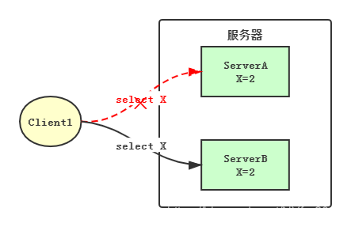 
   -  分区容错性和扩展性紧密相关。在分布式应用中，可能因为一些分布式的原因导致系统无法正常运转。好的分区容错性要求能够使应用虽然是一个分布式系统，而看上去却好像是在一个可以运转正常的整体。比如现在的分布式系统中有某一个或者几个机器宕掉了，其他剩下的机器还能够正常运转满足系统需求，或者是机器之间有网络异常，将分布式系统分隔未独立的几个部分，各个部分还能维持分布式系统的运作，这样就具有好的分区容错性。 
   -  简单点说，就是在网络中断，消息丢失的情况下，系统如果还能正常工作，就是有比较好的分区容错性。 


### 那么CAP理论中的一致性、可用性和分区容忍性不能同时满足呢？
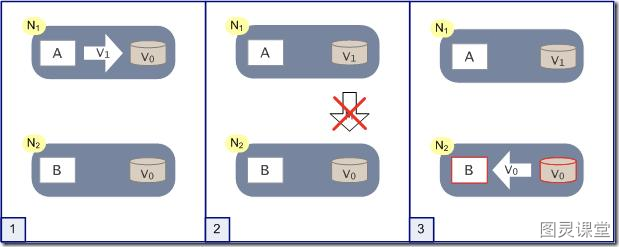
定理指出对于一个分布式系统来说**不可能同时满足以上三种特性。** 在理解CAP理论的最简单方式是想象两个节点分处分区两侧。 允许至少一个节点更新状态会导致数据不一致， 即丧失了C性质。如果为了保证数据一致性，将分区一侧的节点设置为不可用， 那么又丧失了A性质。 除非两个节点可以互相通信， 才能既保证C又保证A，这又导致丧失了P性质。 也就是说，如图所示的三者交叉的位置，是不可能实现的。
既然CAP三者同时满足的条件是不可能的， 所以在系统设计的时候就需要作出取舍，比如弱化某些特性来支持其他两者。
**弱化一致性** 对结果不敏感的应用， 可以允许在新版本上线后过一段时间才能更新成功，不保证强一致性，保持最终状态的一致性。 典型的如，静态网站。
**弱化可用性** 对结果一致性很敏感的应用，如银行取款机，当系统发生故障时停止服务。 如清结算，转账等。 目前的paxos、raft等算法都是为保证强一致而设计的。这些系统会在 内部异常时拒绝或者阻塞客户端请求。
**弱化分区容错性** 现实中， 网络分区出现概率较小， 但难以避免。实践中，网络通信通过双通道等机制增强可靠性，达到高稳定的网络通信。

### CP和AP架构的取舍
其实在实际工程中，可用性和一致性并不是完全对立的，我们往往关注的是如何在保持相对一致性的前提下，提高系统的可用性。
至于是使用CP或者AP架构，则取决于业务对一致性的要求。

#### CP架构：放弃可用性，追求一致性和分区容错性
举个栗子，ZooKeeper就是采用了CP一致性。
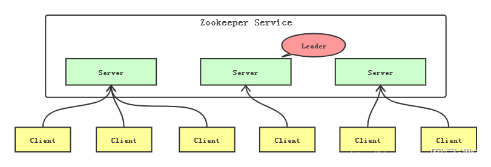
ZooKeeper是一个分布式的服务框架，主要用来解决分布式集群中应用系统的协调和移置性问题。在ZooKeeper中，对应每一个事务操作请求，ZooKeeper都会为其分配一个全局唯一的事务ID，每个事务ID对应一次更新操作，**从这些事务ID中可以间接识别出ZooKeeper处理这些事务操作请求的全局顺序**。

#### AP架构：放弃强一致性，追求分区容错性和可用性
举个栗子，Eureka就采用了AP可用性。
Eureka是Spring Cloud微服务技术栈中的服务发现组件。
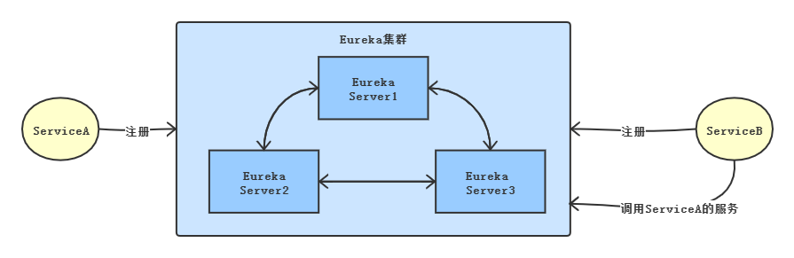
Eureka的各个节点都是平等的，几个节点挂掉不影响正常节点的工作。剩余节点依然可以提供注册和查询服务，只要有一台Eureka在，就能保证注册服务可用。只不过查看的信息可能不是最新版本，不保证一致性。

### **BASE**理论

-  **B**asically **A**vailable（基本可用）  
分布式系统在出现不可预知故障的时候，允许损失部分可用性 
-  **S**oft state（软状态）  
软状态也称为弱状态，和硬状态相对，是指允许系统中的数据存在中间状态，并认为该中间状态的存在不会影响系统的整体可用性，即允许系统在不同节点的数据副本之间进行数据听不的过程存在延时。 
-  **E**ventually consistent（最终一致性）  
最终一致性强调的是系统中所有的数据副本，在经过一段时间的同步后，最终能够达到一个一致的状态。因此，最终一致性的本质是需要系统保证最终数据能够达到一致，而不需要实时保证系统数据的强一致性 

那我们再来看看Base理论（Basically Available（基本可用）、Soft state（软状态）、Eventually consistent（最终一致性）的缩写）；它基于CAP定理逐步演化来的，它是CAP中一致性和可用性权衡的结果，其核心思想是即使系统无法达到强一致性，可以**根据应用自身的业务特点，采用适当的方式来使系统达到最终一致性**。
**基本可用**是指当分布式系统发生故障的时候，允许损失部分可用性。常见的有以下几种情况：

- 响应时间上的损失：正常情况下，一个在线搜索引擎需要再0.5秒之内返回给用户响应的查询结果，但由于出现故障，查询结果的响应时间增加到了1~2秒。
- 功能上的损失：通常的做法是**降级服务**，如对于展示一些有序元素的页面，但部分组件出现故障时，这个时候可不展示有序元素，降级为无序元素列表。

**软状态**是指允许系统中的数据存在中间状态，并认为该中间状态的存在不影响系统的整体可用性，即允许系统不同节点的数据副本之间进行数据同步的过程中存在延时。
**最终一致性**强调的是系统所有的数据副本，在经过一段时间的同步后，最终能够达到一个一致的状态。因此，最终一致性的本质是需要系统保证最终数据能够达到一致，而不需要试试保证系统数据的强一致性。

## 分布式事务你了解多少？
分布式事务的实现主要有以下 6 种方案：

- XA 方案
- TCC 方案
- SAGA 方案
- 本地消息表
- 可靠消息最终一致性方案
- 最大努力通知方

#### DTP/XA
DTP的XA规范(全称为Distributed Transaction Processing The XA Specification)的制定者是X/Open，即现在的Open Group。
所谓的 XA 方案，即：两阶段提交，有一个**事务管理器**的概念，负责协调多个数据库（资源管理器）的事务，事务管理器先问问各个数据库你准备好了吗？如果每个数据库都回复 ok，那么就正式提交事务，在各个数据库上执行操作；如果任何其中一个数据库回答不 ok，那么就回滚事务。
这种分布式事务方案，比较适合单块应用里，跨多个库的分布式事务，而且因为严重依赖于数据库层面来搞定复杂的事务，效率很低，绝对不适合高并发的场景。如果要玩儿，那么基于 `Spring + JTA` 就可以搞定，自己随便搜个 demo 看看就知道了。
这个方案，我们很少用，一般来说**某个系统内部如果出现跨多个库**的这么一个操作，是**不合规**的。我可以给大家介绍一下， 现在微服务，一个大的系统分成几十个甚至几百个服务。一般来说，我们的规定和规范，是要求**每个服务只能操作自己对应的一个数据库**。
如果你要操作别的服务对应的库，不允许直连别的服务的库，违反微服务架构的规范，你随便交叉胡乱访问，几百个服务的话，全体乱套，这样的一套服务是没法管理的，没法治理的，可能会出现数据被别人改错，自己的库被别人写挂等情况。
如果你要操作别人的服务的库，你必须是通过**调用别的服务的接口**来实现，绝对不允许交叉访问别人的数据库。
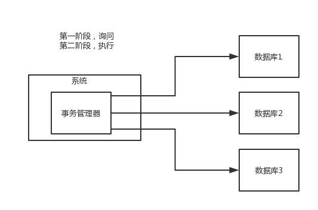

### TCC 方案
TCC 的全称是： `Try` 、 `Confirm` 、 `Cancel` 。

- Try 阶段：这个阶段说的是对各个服务的资源做检测以及对资源进行**锁定或者预留**。
- Confirm 阶段：这个阶段说的是在各个服务中**执行实际的操作**。
- Cancel 阶段：如果任何一个服务的业务方法执行出错，那么这里就需要**进行补偿**，就是执行已经执行成功的业务逻辑的回滚操作。（把那些执行成功的回滚）

这种方案说实话几乎很少人使用，我们用的也比较少，但是也有使用的场景。因为这个**事务回滚**实际上是**严重依赖于你自己写代码来回滚和补偿**了，会造成补偿代码巨大，非常之恶心。
比如说我们，一般来说跟**钱**相关的，跟钱打交道的，**支付**、**交易**相关的场景，我们会用 TCC，严格保证分布式事务要么全部成功，要么全部自动回滚，严格保证资金的正确性，保证在资金上不会出现问题。
而且最好是你的各个业务执行的时间都比较短。
但是说实话，一般尽量别这么搞，自己手写回滚逻辑，或者是补偿逻辑，实在太恶心了，那个业务代码是很难维护的。
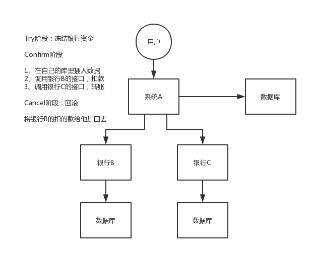

### Saga 
金融核心等业务可能会选择 TCC 方案，以追求强一致性和更高的并发量，而对于更多的金融核心以上的业务系统 往往会选择补偿事务，补偿事务处理在 30 多年前就提出了 Saga 理论，随着微服务的发展，近些年才逐步受到大家的关注。目前业界比较公认的是采用 Saga 作为长事务的解决方案。

#### 基本原理
业务流程中每个参与者都提交本地事务，若某一个参与者失败，则补偿前面已经成功的参与者。下图左侧是正常的事务流程，当执行到 T3 时发生了错误，则开始执行右边的事务补偿流程，反向执行 T3、T2、T1 的补偿服务 C3、C2、C1，将 T3、T2、T1 已经修改的数据补偿掉。
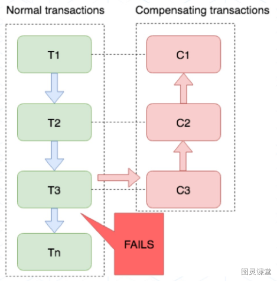

#### 使用场景
对于一致性要求高、短流程、并发高 的场景，如：金融核心系统，会优先考虑 TCC 方案。而在另外一些场景下，我们并不需要这么强的一致性，只需要保证最终一致性即可。
比如 很多金融核心以上的业务（渠道层、产品层、系统集成层），这些系统的特点是最终一致即可、流程多、流程长、还可能要调用其它公司的服务。这种情况如果选择 TCC 方案开发的话，一来成本高，二来无法要求其它公司的服务也遵循 TCC 模式。同时流程长，事务边界太长，加锁时间长，也会影响并发性能。
所以 Saga 模式的适用场景是：

- 业务流程长、业务流程多；
- 参与者包含其它公司或遗留系统服务，无法提供 TCC 模式要求的三个接口。

#### 优势

- 一阶段提交本地事务，无锁，高性能；
- 参与者可异步执行，高吞吐；
- 补偿服务易于实现，因为一个更新操作的反向操作是比较容易理解的。

#### 缺点

- 不保证事务的隔离性。

### 本地消息表
本地消息表其实是国外的 ebay 搞出来的这么一套思想。
这个大概意思是这样的：

-   系统在自己本地一个事务里操作同时，插入一条数据到消息表； 
-  接着 A 系统将这个消息发送到 MQ 中去； 
-  B 系统接收到消息之后，在一个事务里，往自己本地消息表里插入一条数据，同时执行其他的业务操作，如果这个消息已经被处理过了，那么此时这个事务会回滚，这样保证不会重复处理消息； 
-  B 系统执行成功之后，就会更新自己本地消息表的状态以及 A 系统消息表的状态； 
-  如果 B 系统处理失败了，那么就不会更新消息表状态，那么此时 A 系统会定时扫描自己的消息表，如果有未处理的消息，会再次发送到 MQ 中去，让 B 再次处理； 
-  这个方案保证了最终一致性，哪怕 B 事务失败了，但是 A 会不断重发消息，直到 B 那边成功为止。 
-  这个方案说实话最大的问题就在于严重依赖于数据库的消息表来管理事务啥的，如果是高并发场景咋办呢？咋扩展呢？所以一般确实很少用。
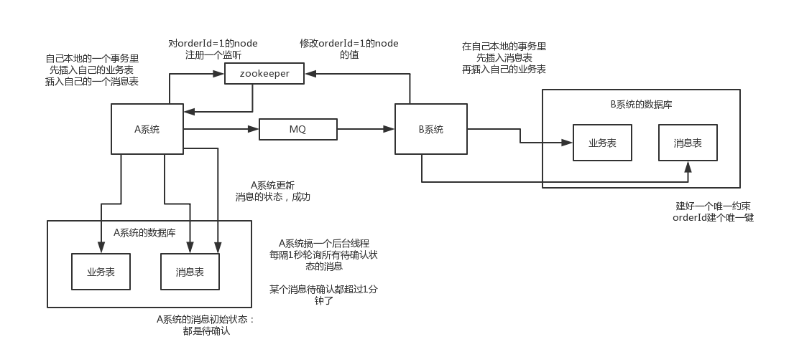

### 可靠消息最终一致性方案
这个的意思，就是干脆不要用本地的消息表了，直接基于 MQ 来实现事务。比如阿里的 RocketMQ 就支持消息事务。
大概的意思就是：

-   系统先发送一个 prepared 消息到 mq，如果这个 prepared 消息发送失败那么就直接取消操作别执行了； 
-  如果这个消息发送成功过了，那么接着执行本地事务，如果成功就告诉 mq 发送确认消息，如果失败就告诉 mq 回滚消息； 
-  如果发送了确认消息，那么此时 B 系统会接收到确认消息，然后执行本地的事务； 
-  mq 会自动定时轮询所有 prepared 消息回调你的接口，问你，这个消息是不是本地事务处理失败了，所有没发送确认的消息，是继续重试还是回滚？一般来说这里你就可以查下数据库看之前本地事务是否执行，如果回滚了，那么这里也回滚吧。这个就是避免可能本地事务执行成功了，而确认消息却发送失败了。 
-  这个方案里，要是系统 B 的事务失败了咋办？重试咯，自动不断重试直到成功，如果实在是不行，要么就是针对重要的资金类业务进行回滚，比如 B 系统本地回滚后，想办法通知系统 A 也回滚；或者是发送报警由人工来手工回滚和补偿。 
-  这个还是比较合适的，目前国内互联网公司大都是这么玩儿的，要不你就用 RocketMQ 支持的，要不你就自己基于类似 ActiveMQ？RabbitMQ？自己封装一套类似的逻辑出来，总之思路就是这样子的
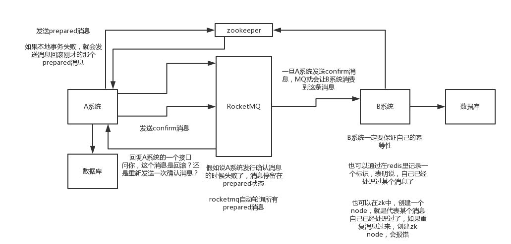 

### 最大努力通知方案
这个方案的大致意思就是：

- 系统 A 本地事务执行完之后，发送个消息到 MQ；
- 这里会有个专门消费 MQ 的最大努力通知服务，这个服务会消费 MQ 然后写入数据库中记录下来，或者是放入个内存队列也可以，接着调用系统 B 的接口；
- 要是系统 B 执行成功就 ok 了；要是系统 B 执行失败了，那么最大努力通知服务就定时尝试重新调用系统 B，反复 N 次，最后还是不行就放弃。

## 分布式锁在项目上用过吗？
分布式锁，即分布式系统中的锁。在单体应用中我们通过锁解决的是**控制共享资源访问**的问题，而分布式锁，就是解决了**分布式系统中控制共享资源访问**的问题。与单体应用不同的是，分布式系统中竞争共享资源的最小粒度从线程升级成了进程。
分布式锁应该具备哪些条件：

- 分布式系统环境下，一个方法在同一时间只能被一个机器的一个线程执行
- 高可用的获取锁与释放锁
- 高性能的获取锁与释放锁
- 具备可重入特性（可理解为重新进入，由多于一个任务并发使用，而不必担心数据错误）
- 具备锁失效机制，即自动解锁，防止死锁
- 具备非阻塞锁特性，即没有获取到锁将直接返回获取锁失败

在分布式场景中我们避免不了使用分布式锁对资源进行锁定，通常我们使用Redis或者Zookeeper来实现。
这里说下redis，Redis我们知道执行命令是单线程的，我们可以通过lua脚本的方式提交命令，以保证原子性操作。虽说是能够实现加锁的基本功能，但是中间还是会遇到很多其他的问题，比如说锁超时如何释放问题，我们可以设置过期时间，那么setnx命令和expire命令并不是原子操作了，那就要使用lua脚本组合提交执行，那如果业务执行时间大于我们设置的过期时间，那就需要锁续期机制，这一切我们可以直接使用RedissonLock来帮我们完成。里面已经是封装的比较完善了。
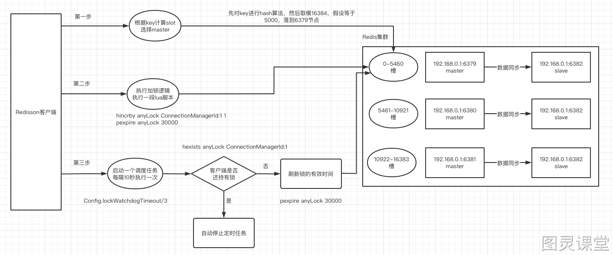
那么我们在采用Redis作为分布式锁的时候我们会遇到一个高可用的问题，如果选择主从架构就可能会存在锁出问题的场景。虽说Redis也是提供了RedLock但是，它的使用成本会比较高，而且在理论层面还存在争议性。
看业务需求吧，如果能够接受极端场景下互斥失败问题，并且对性能要求比较高的时候我们可以采用RedissonLock，做好兜底方案就行。如果不能接受就直接用ZooKeeper吧！

## 分布式raft算法了解过吗？
在分布式领域共识算法有两种比较出名Paxos和Raft，实际上Raft比Paxos简单，亦或者说Raft是Paxos的简化版。
首先需要明确的是一致性算法的目标是什么，主要面对的问题是在只使用单个服务器时由于发生错误导致数据丢失等事情发生。解决这个问题的思路也很简单，就是备份，将操作重复到多个机器上就不怕单个机器出错了。但随之而来的就是，数据不一致、乱序等问题，一致性算法想要做到的是即使有结点出错，对外仍是一个完整的可以正常工作的整体。
Raft 是一个非拜占庭的一致性算法，即所有通信是正确的而非伪造的。N 个结点的情况下（N为奇数）可以最多容忍 (N−1)/2(N−1)/2 个结点故障。
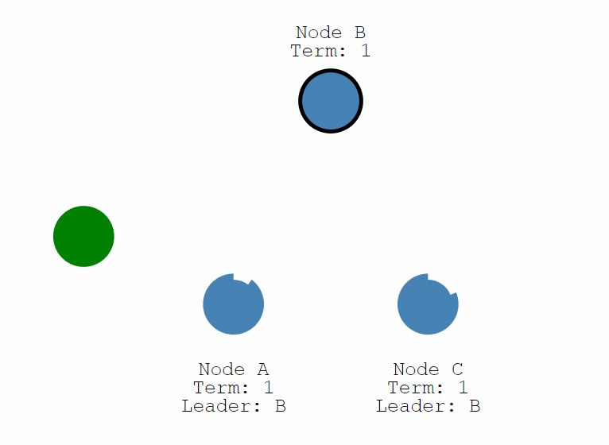
Raft 正常工作时的流程如上图，也就是正常情况下日志复制的流程。Raft 中使用 **日志** 来记录所有操作，所有结点都有自己的日志列表来记录所有请求。算法将机器分成三种角色：Leader、Follower 和 Candidate。正常情况下只存在一个 Leader，其他均为 Follower，所有客户端都与 Leader 进行交互。
所有操作采用类似两阶段提交的方式，Leader 在收到来自客户端的请求后并不会执行，只是将其写入自己的日志列表中，然后将该操作发送给所有的 Follower。Follower 在收到请求后也只是写入自己的日志列表中然后回复 Leader，当有超过半数的结点写入后 Leader 才会提交该操作并返回给客户端，同时通知所有其他结点提交该操作。
通过这一流程保证了只要提交过后的操作一定在多数结点上留有记录（在日志列表中），从而保证了该数据不会丢失。

### 领导选举
在了解了算法的基本工作流程之后，就让我们开始解决其中会遇到的问题，首先就是 Leader 如何而来。

### 初次选举
在算法刚开始时，所有结点都是 Follower，每个结点都会有一个定时器，每次收到来自 Leader 的信息就会更新该定时器。

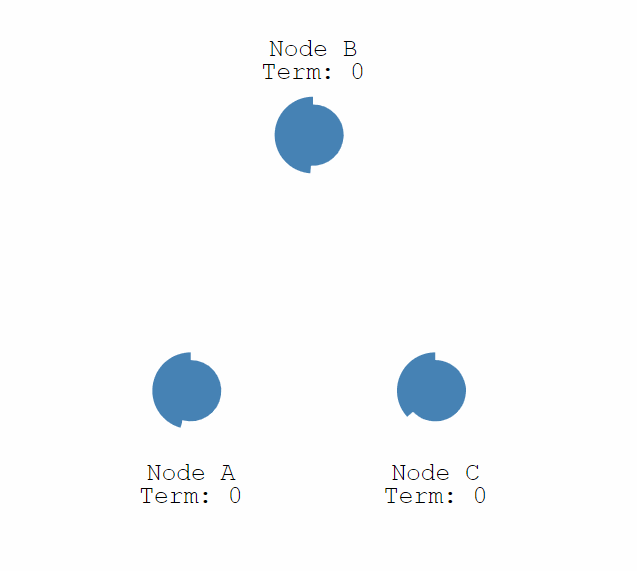
如果定时器超时，说明一段时间内没有收到 Leader 的消息，那么就可以认为 Leader 已死或者不存在，那么该结点就会转变成 Candidate，意思为准备竞争成为 Leader。
成为 Candidate 后结点会向所有其他结点发送请求投票的请求（RequestVote），其他结点在收到请求后会判断是否可以投给他并返回结果。Candidate 如果收到了半数以上的投票就可以成为 Leader，成为之后会立即并在任期内定期发送一个心跳信息通知其他所有结点新的 Leader 信息，并用来重置定时器，避免其他结点再次成为 Candidate。
如果 Candidate 在一定时间内没有获得足够的投票，那么就会进行一轮新的选举，直到其成为 Leader,或者其他结点成为了新的 Leader，自己变成 Follower。

### 再次选举
再次选举会在两种情况下发生。

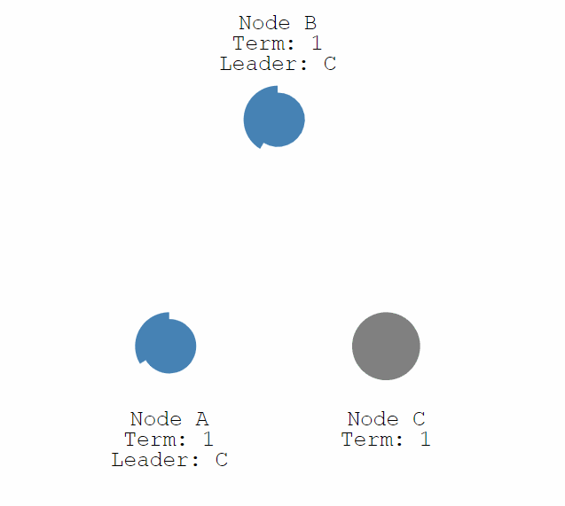
第一种情况是 Leader 下线，此时所有其他结点的计时器不会被重置，直到一个结点成为了 Candidate，和上述一样开始一轮新的选举选出一个新的 Leader。

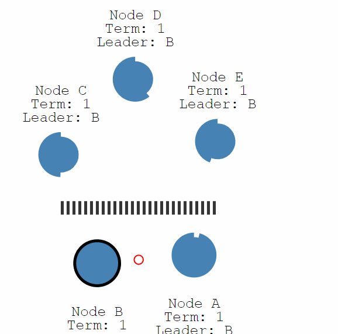
第二种情况是某一 Follower 结点与 Leader 间通信发生问题，导致发生了分区，这时没有 Leader 的那个分区就会进行一次选举。这种情况下，因为要求获得多数的投票才可以成为 Leader，因此只有拥有多数结点的分区可以正常工作。而对于少数结点的分区，即使仍存在 Leader，但由于写入日志的结点数量不可能超过半数因此不可能提交操作。这解释了为何 Raft 至多容忍 (N −1)/2个结点故障。
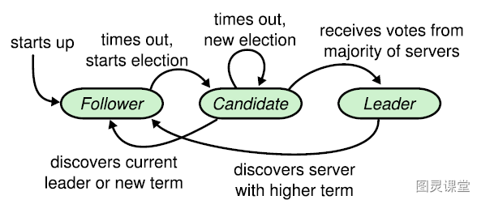
这解释了每个结点会如何在三个状态间发生变化。

### 任期 Term
Leader 的选举引出了一个新的概念——**任期**（Term）。
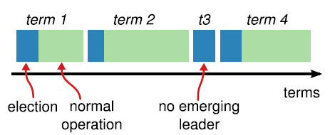
每一个任期以一次选举作为起点，所以当一个结点成为 Candidate 并向其他结点请求投票时，会将自己的 Term 加 1，表明新一轮的开始以及旧 Leader 的任期结束。所有结点在收到比自己更新的 Term 之后就会更新自己的 Term 并转成 Follower，而收到过时的消息则拒绝该请求。
在一次成功选举完成后，Leader 会负责管理所有结点直至任期结束。如果没有产生新的 Leader 就会开始一轮新的 Term。任期在 Raft 起到了类似时钟的功能，用于检测信息是否过期。

### 投票限制
在投票时候，所有服务器采用先来先得的原则，在一个任期内只可以投票给一个结点，得到超过半数的投票才可成为 Leader，从而保证了一个任期内只会有一个 Leader 产生（**Election Safety**）。
在 Raft 中日志只有从 Leader 到 Follower 这一流向，所以需要保证 Leader 的日志必须正确，即必须拥有所有已在多数节点上存在的日志，这一步骤由投票来限制。
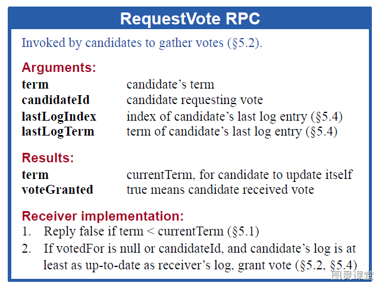
投票由一个称为 RequestVote 的 RPC 调用进行，请求中除了有 Candidate 自己的 term 和 id 之外，还要带有自己最后一个日志条目的 index 和 term。接收者收到后首先会判断请求的 term 是否更大，不是则说明是旧消息，拒绝该请求。如果任期更大则开始判断日志是否更加新。日志 Term 越大则越新，相同那么 index 较大的认为是更加新的日志。接收者只会投票给拥有相同或者更加新的日志的 Candidate。
由于只有日志在被多数结点复制之后才会被提交并返回，所以如果一个 Candidate 并不拥有最新的已被复制的日志，那么他不可能获得多数票，从而保证了 Leader 一定具有所有已被多数拥有的日志（**Leader Completeness**），在后续同步时会将其同步给所有结点。

### 定时器时间
定时器时间的设定实际上也会影响到算法性能甚至是正确性。试想一下这样一个场景，Leader 下线，有两个结点同时成为 Candidate，然后由于网络结构等原因，每个结点都获得了一半的投票，因此无人成为 Leader 进入了下一轮。然而在下一轮由于这两个结点同时结束，又同时成为了 Candidate，再次重复了之前的这一流程，那么算法就无法正常工作。
为了解决这一问题，Raft 采用了一个十分“艺术”的解决方法，随机定时器长短（例如 150-300ms）。通过这一方法避免了两个结点同时成为 Candidate，即使发生了也能快速恢复。这一长短必须长于 Leader 的心跳间隔，否则在正常情况下也会有 Candidate 出现导致算法无法正常工作。

### 日志复制
在之前的工作流程章节中已经描述了日志是如何被复制到其他结点上的，但实际中还会发生结点下线，从而产生不一致的情况的发生，也是这一章我们将要讨论的内容。

#### 前提
Raft 保证了如下几点：

- Leader 绝不会覆盖或删除自己的日志，只会追加 （**Leader Append-Only**）
- 如果两个日志的 index 和 term 相同，那么这两个日志相同 （**Log Matching**）
- 如果两个日志相同，那么他们之前的日志均相同

第一点主要是因为选举时的限制，根据 Leader Completeness，成为 Leader 的结点里的日志一定拥有所有已被多数节点拥有的日志条目，所以先前的日志条目很可能已经被提交，因此不可以删除之前的日志。
第二点主要是因为一个任期内只可能出现一个 Leader，而 Leader 只会为一个 index 创建一个日志条目，而且一旦写入就不会修改，因此保证了日志的唯一性。
第三点是因为在写入日志时会检查前一个日志是否一致。换言之就是，如果写入了一条日志，那么前一个日志条目也一定一致，从而递归的保证了前面的所有日志都一致。从而也保证了当一个日志被提交之后，所有结点在该 index 上提交的内容是一样的（**State Machine Safety**）。

### 日志同步
接下来我们就可以看到 Raft 实际中是如何做到日志同步的。这一过程由一个称为 AppendEntries 的 RPC 调用实现，Leader 会给每个 Follower 发送该 RPC 以追加日志，请求中除了当前任期 term、Leader 的 id 和已提交的日志 index，还有将要追加的日志列表（空则成为心跳包），前一个日志的 index 和 term。
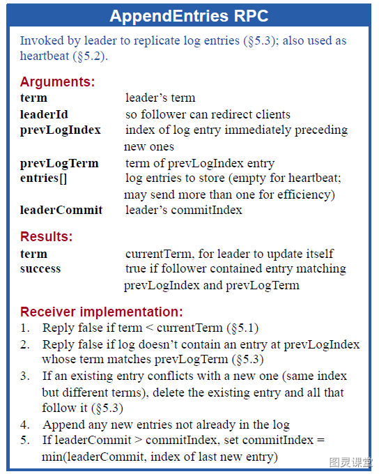
当接收到该请求后，会先检查 term，如果请求中的 term 比自己的小说明已过期，拒绝请求。之后会对比先前日志的 index 和 term，如果一致，那么由前提可知前面的日志均相同，那么就可以从此处更新日志，将请求中的所有日志写入自己的日志列表中，否则返回 false。如果发生 index 相同但 term 不同则清空后续所有的日志，以 Leader 为准。最后检查已提交的日志 index，对可提交的日志进行提交操作。
对于 Leader 来说会维护 nextIndex[] 和 matchIndex[] 两个数组，分别记录了每个 Follower 下一个将要发送的日志 index 和已经匹配上的日志 index。每次成为 Leader 都会初始化这两个数组，前者初始化为 Leader 最后一条日志的 index 加 1，后者初始化为 0。每次发送 RPC 时会发送 nextIndex[i] 及之后的日志，成功则更新两个数组，否则减少 nextIndex[i] 的值重试，重复这一过程直至成功。
> 这里减少 nextIndex 的值有不同的策略，可以每次减一，也可以减一个较大的值，或者是跨任期减少，用于快速找到和该结点相匹配的日志条目。实际中还有可能会定期存储日志，所以当前日志列表中并不会太大，可以完整打包发给对方，这一做法比较适合新加入集群的结点。


### 日志提交
只要日志在多数结点上存在，那么 Leader 就可以提交该操作。但是 Raft 额外限制了 Leader 只对自己任期内的日志条目适用该规则，先前任期的条目只能由当前任期的提交而间接被提交。
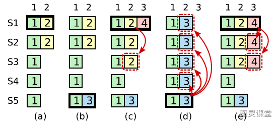
例如论文中图 8 这一 corner case。一开始如 (a) 所示，之后 S1 下线，(b) 中 S5 从 S3 和 S4 处获得了投票成为了 Leader 并收到了一条来自客户端的消息，之后 S5 下线。(c) 中 S1 恢复并成为了 Leader，并且将日志复制给了多数结点，之后进行了一个致命操作，将 index 为 2 的日志提交了，然后 S1 下线。(d) 中 S5 恢复，并从 S2、S3、S4 处获得了足够投票，然后将已提交的 index 为 2 的日志覆盖了。
为了解决这个问题，Raft 只允许提交自己任期内的日志，从而日志 2 只能像 (e) 中由于日志 3 同步而被间接提交，避免了 Follower 中由于缺少新任期的日志，使得 S5 能够继续成为 Leader。

## 为什么要进行系统拆分？如何进行系统拆分？

### 为什么要进行系统拆分？
1）**应用间耦合严重。** 系统内各个应用之间不通，同样一个功能在各个应用中都有实现，后果就是改一处功能，需要同时改系统中的所有应用。这种情况多存在于历史较长的系统，因各种原因，系统内的各个应用都形成了自己的业务小闭环；
2）**业务扩展性差。** 数据模型从设计之初就只支持某一类的业务，来了新类型的业务后又得重新写代码实现，结果就是项目延期，大大影响业务的接入速度；
3）**代码老旧，难以维护。** 各种随意的if else、写死逻辑散落在应用的各个角落，处处是坑，开发维护起来战战兢兢；
4）**系统扩展性差。** 系统支撑现有业务已是颤颤巍巍，不论是应用还是DB都已经无法承受业务快速发展带来的压力；
5）**新坑越挖越多，恶性循环。** 不改变的话，最终的结果就是把系统做死了。

### 如何进行系统拆分？

#### **多维度把握业务复杂度**
一个老生常谈的问题，系统与业务的关系？
我们最期望的理想情况是第一种关系（车辆与人），业务觉得不合适，可以马上换一辆新的。但现实的情况是更像心脏起搏器与人之间的关系，不是说换就能换。一个系统接的业务越多，耦合越紧密。如果在没有真正把握住业务复杂度之前贸然行动，最终的结局就是把心脏带飞。
如何把握住业务复杂度？需要多维度的思考、实践。
一个是技术层面，通过与pd以及开发的讨论，熟悉现有各个应用的领域模型，以及优缺点，这种讨论只能让人有个大概，更多的细节如代码、架构等需要通过做需求、改造、优化这些实践来掌握。
各个应用熟悉之后，需要从系统层面来构思，我们想打造平台型的产品，那么最重要也是最难的一点就是功能集中管控，打破各个应用的业务小闭环，统一收拢，这个决心更多的是开发、产品、业务方、各个团队之间达成的共识，可以参考《微服务（Microservice）那点事》一文，“按照业务或者客户需求组织资源”。
此外也要与业务方保持功能沟通、计划沟通，确保应用拆分出来后符合使用需求、扩展需求，获取他们的支持。

#### **定义边界，原则：高内聚，低耦合，单一职责！**
业务复杂度把握后，需要开始定义各个应用的服务边界。怎么才算是好的边界？像葫芦娃兄弟一样的应用就是好的！
举个例子，葫芦娃兄弟（应用）间的技能是相互独立的，遵循单一职责原则，比如水娃只能喷水，火娃只会喷火，隐形娃不会喷水喷火但能隐身。更为关键的是，葫芦娃兄弟最终可以合体为金刚葫芦娃，即这些应用虽然功能彼此独立，但又相互打通，最后合体在一起就成了我们的平台。
这里很多人会有疑惑，拆分粒度怎么控制？很难有一个明确的结论，只能说是结合业务场景、目标、进度的一个折中。但总体的原则是先从一个大的服务边界开始，不要太细，因为随着架构、业务的演进，应用自然而然会再次拆分，让正确的事情自然发生才最合理。

#### **确定拆分后的应用目标**
一旦系统的宏观应用拆分图出来后，就要落实到某一具体的应用拆分上了。
首先要确定的就是某一应用拆分后的目标。拆分优化是没有底的，可能越做越深，越做越没结果，继而又影响自己和团队的士气。比如说可以定这期的目标就是将db、应用分拆出去，数据模型的重新设计可以在第二期。

#### **确定当前要拆分应用的架构状态、代码情况、依赖状况，并推演可能的各种异常。**
**动手前的思考成本远远低于动手后遇到问题的解决成本。** 应用拆分最怕的是中途说“他*的，这块不能动，原来当时这样设计是有原因的，得想别的路子！”这时的压力可想而知，整个节奏不符合预期后，很可能会接二连三遇到同样的问题，这时不仅同事们士气下降，自己也会丧失信心，继而可能导致拆分失败。

#### **给自己留个锦囊，“有备无患”。**
锦囊就四个字“有备无患”，可以贴在桌面或者手机上。在以后具体实施过程中，多思考下“方案是否有多种可以选择？复杂问题能否拆解？实际操作时是否有预案？”，应用拆分在具体实践过程中比拼得就是细致二字，多一份方案，多一份预案，不仅能提升成功概率，更给自己信心。

## 什么是微服务？微服务之间是如何独立通讯的？

### 什么是微服务？
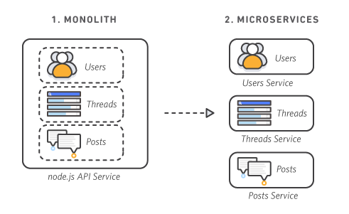

- 微服务架构是一个分布式系统，按照业务进行划分成为不同的服务单元，解决单体系统性能等不足。
- 微服务架构（通常简称为微服务）是指开发应用所用的一种架构形式或者称之为一种架构风格。通过微服务，可将大型应用分解成多个独立的组件，其中每个组件都有各自的责任领域，每一个组件都能够单独部署，组件之间是松耦合的。在处理一个用户请求时，基于微服务的应用可能会调用许多内部微服务来共同生成其响应。

### 微服务的优势

#### 敏捷性
微服务促进若干小型独立团队形成一个组织，这些团队负责自己的服务。各团队在小型且易于理解的环境中行事，并且可以更独立、更快速地工作。这缩短了开发周期时间。您可以从组织的总吞吐量中显著获益。

#### 灵活扩展
通过微服务，您可以独立扩展各项服务以满足其支持的应用程序功能的需求。这使团队能够适当调整基础设施需求，准确衡量功能成本，并在服务需求激增时保持可用性。

#### 轻松部署
微服务支持持续集成和持续交付，可以轻松尝试新想法，并可以在无法正常运行时回滚。由于故障成本较低，因此可以大胆试验，更轻松地更新代码，并缩短新功能的上市时间。

#### 技术自由
微服务架构不遵循“一刀切”的方法。团队可以自由选择最佳工具来解决他们的具体问题。因此，构建微服务的团队可以为每项作业选择最佳工具。

#### 可重复使用的代码
将软件划分为小型且明确定义的模块，让团队可以将功能用于多种目的。专为某项功能编写的服务可以用作另一项功能的构建块。这样应用程序就可以自行引导，因为开发人员可以创建新功能，而无需从头开始编写代码。

#### 弹性
服务独立性增加了应用程序应对故障的弹性。在整体式架构中，如果一个组件出现故障，可能导致整个应用程序无法运行。通过微服务，应用程序可以通过降低功能而不导致整个应用程序崩溃来处理总体服务故障。

### 微服务之间是如何独立通讯的？

### 同步

#### REST HTTP 协议
REST 请求在微服务中是最为常用的一种通讯方式，它依赖于 HTTP\HTTPS 协议。RESTFUL 的特点是：

1. 每一个 URI 代表 1 种资源
2. 客户端使用 GET、POST、PUT、DELETE 4 个表示操作方式的动词对服务端资源进行操作：GET 用来获取资源，POST 用来新建资源（也可以用于更新资源），PUT 用来更新资源，DELETE 用来删除资源
3. 通过操作资源的表现形式来操作资源
4. 资源的表现形式是 XML 或者 HTML
5. 客户端与服务端之间的交互在请求之间是无状态的,从客户端到服务端的每个请求都必须包含理解请求所必需的信息

#### RPC TCP 协议
RPC(Remote Procedure Call)远程过程调用，简单的理解是一个节点请求另一个节点提供的服务。它的工作流程是这样的：

1. 执行客户端调用语句，传送参数
2. 调用本地系统发送网络消息
3. 消息传送到远程主机
4. 服务器得到消息并取得参数
5. 根据调用请求以及参数执行远程过程（服务）
6. 执行过程完毕，将结果返回服务器句柄
7. 服务器句柄返回结果，调用远程主机的系统网络服务发送结果
8. 消息传回本地主机
9. 客户端句柄由本地主机的网络服务接收消息
10. 客户端接收到调用语句返回的结果数据

### 异步

#### 消息中间件
常见的消息中间件有 Kafka、ActiveMQ、RabbitMQ、RocketMQ ，常见的协议有 AMQP、MQTTP、STOMP、XMPP。这里不对消息队列进行拓展了，具体如何使用还是请移步官网。

## Spring Cloud 和 Dubbo 有哪些区别？
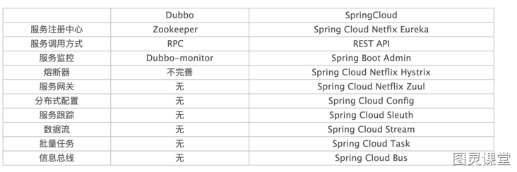

### 面向微服务的技术(SpringCloud)
Spring Cloud 抛弃了 Dubbo 的 RPC 通信，采用的是基于 HTTP 的 REST 方式。严格来说，这两种方式各有优劣。虽然从一定程度上来说，后者牺牲了服务调用的性能，但也避免了上面提到的原生 RPC 带来的问题。而且 REST 相比 RPC 更为灵活，服务提供方和调用方，不存在代码级别的强依赖，这在强调快速演化的微服务环境下显得更加合适。

### 最大的区别：

- Dubbo底层是使用Netty这样的NIO框架，是基于TCP协议传输的，配合以Hession序列化完成RPC通信;
- 而SpringCloud是基于Http协议+rest接口调用远程过程的通信，相对来说，Http请求会有更大的报文，占的带宽也会更多。但是REST相比RPC更为灵活，服务提供方和调用方的依赖只依靠一纸契约，不存在代码级别的强依赖，这在强调快速演化的微服务环境下，显得更为合适，至于注重通信速度还是方便灵活性，具体情况具体考虑。

### 定位区别
Dubbo 是 SOA 时代的产物，它的关注点主要在于服务的调用，流量分发、流量监控和熔断;而Spring Cloud 诞生于微服务架构时代，考虑的是微服务治理的方方面面，另外由于依托Spirng、Spirng Boot 的优势之上，两个框架在开始目标就不一致，Dubbo 定位服务治理、Spirng Cloud 是一个生态。因此可以大胆地判断，Dubbo 未来会在服务治理方面更为出色，而 SpringCloud 在微服务治理上面无人能敌。

### 模块区别
1、Dubbo主要分为服务注册中心，服务提供者，服务消费者，还有管控中心；
2、相比起Dubbo简单的四个模块，SpringCloud则是一个完整的分布式一站式框架，他有着一样的服务注册中心，服务提供者，服务消费者，管控台，断路器，分布式配置服务，消息总线，以及服务追踪等；

## Spring Boot 和 Spring Cloud，谈谈你对它们的理解？

### Spring Boot
Spring Boot这家伙简直就是对Java企业级应用开发进行了一场浩浩荡荡的革命。如果稍微有几年工作经验的老油条，应该都记得以前的Java Web开发模式：Tomcat + WAR包。WEB项目基于spring framework，项目目录一定要是标准的WEB-INF + classes + lib，而且大量的xml配置。如果说，以前搭建一个SSH架构的Web项目需要1个小时，那么现在应该10分钟就可以了。
比如我们要创建一个 web 项目，使用 Spring 的朋友都知道，在使用 Spring 的时候，需要在 pom 文件中添加多个依赖，而 Spring Boot 则会帮助开发着快速启动一个 web 容器，在 Spring Boot 中，我们只需要在 pom 文件中添加如下一个 starter-web 依赖即可。
Spring 虽然使Java EE轻量级框架，但由于其繁琐的配置，一度被人认为是“配置地狱”。各种XML、Annotation配置会让人眼花缭乱，而且配置多的话，如果出错了也很难找出原因。Spring Boot更多的是采用 Java Config 的方式，对 Spring 进行配置。
Spring Boot能够让你非常容易的创建一个单机版本、生产级别的基于spring framework的应用。然后，"just run"即可。Spring Boot默认集成了很多第三方包，以便你能以最小的代价开始一个项目。
在使用 Spring 时，项目部署时需要我们在服务器上部署 tomcat，然后把项目打成 war 包扔到 tomcat里，在使用 Spring Boot 后，我们不需要在服务器上去部署 tomcat，因为 Spring Boot 内嵌了 tomcat，我们只需要将项目打成 jar 包，使用 java -jar xxx.jar一键式启动项目。
我们可以引入 spring-boot-start-actuator 依赖，直接使用 REST 方式来获取进程的运行期性能参数，从而达到监控的目的，比较方便。但是 Spring Boot 只是个微框架，没有提供相应的服务发现与注册的配套功能，没有外围监控集成方案，没有外围安全管理方案，所以在微服务架构中，还需要 Spring Cloud 来配合一起使用。
我们看看官方对Spring Boot的定义：
Spring Boot is designed to get you up and running as quickly as possible, with minimal upfront configuration of Spring. Spring Boot takes an opinionated view of building production-ready applications.
即Spring Boot为快速启动且最小化配置的spring应用而设计，并且它具有用于构建生产级别应用的一套固化的视图。这里的固化的视图，笔者认为可以理解成Spring Boot的约定，因为Spring Boot的设计是约定大于实现的。

### Spring Cloud
最后就是大名鼎鼎的Spring Cloud了，Spring Cloud事实上是一整套基于Spring Boot的微服务解决方案。它为开发者提供了很多工具，用于快速构建分布式系统的一些通用模式，例如：配置管理、注册中心、服务发现、限流、网关、链路追踪等。
如下图所示，很好的说明了Spring Boot和Spring Cloud的关系，Spring Boot是build anything，而Spring Cloud是coordinate anything，Spring Cloud的每一个微服务解决方案都是基于Spring Boot构建的.

## 分布式服务接口的幂等性如何设计（比如不能重复扣款）？
从这个问题开始，面试官就已经进入了**实际的生产问题**的面试了。
一个分布式系统中的某个接口，该如何保证幂等性？这个事儿其实是你做分布式系统的时候必须要考虑的一个生产环境的技术问题。啥意思呢？
你看，假如你有个服务提供一些接口供外部调用，这个服务部署在了 5 台机器上，接着有个接口就是**付款接口**。然后人家用户在前端上操作的时候，不知道为啥，总之就是一个订单**不小心发起了两次支付请求**，然后这俩请求分散在了这个服务部署的不同的机器上，好了，结果一个订单扣款扣两次。
或者是订单系统调用支付系统进行支付，结果不小心因为**网络超时**了，然后订单系统走了前面我们看到的那个重试机制，咔嚓给你重试了一把，好，支付系统收到一个支付请求两次，而且因为负载均衡算法落在了不同的机器上，尴尬了。。。
所以你肯定得知道这事儿，否则你做出来的分布式系统恐怕容易埋坑。
这个不是技术问题，这个没有通用的一个方法，这个应该**结合业务**来保证幂等性。
所谓**幂等性**，就是说一个接口，多次发起同一个请求，你这个接口得保证结果是准确的，比如不能多扣款、不能多插入一条数据、不能将统计值多加了 1。这就是幂等性。
其实保证幂等性主要是三点：

- 对于每个请求必须有一个唯一的标识，举个栗子：订单支付请求，肯定得包含订单 id，一个订单 id 最多支付一次，对吧。
- 每次处理完请求之后，必须有一个记录标识这个请求处理过了。常见的方案是在 mysql 中记录个状态啥的，比如支付之前记录一条这个订单的支付流水。
- 每次接收请求需要进行判断，判断之前是否处理过。比如说，如果有一个订单已经支付了，就已经有了一条支付流水，那么如果重复发送这个请求，则此时先插入支付流水，orderId 已经存在了，唯一键约束生效，报错插入不进去的。然后你就不用再扣款了。

实际运作过程中，你要结合自己的业务来，比如说利用 Redis，用 orderId 作为唯一键。只有成功插入这个支付流水，才可以执行实际的支付扣款。
要求是支付一个订单，必须插入一条支付流水，order_id 建一个唯一键 `unique key` 。你在支付一个订单之前，先插入一条支付流水，order_id 就已经进去了。你就可以写一个标识到 Redis 里面去， `set order_id payed` ，下一次重复请求过来了，先查 Redis 的 order_id 对应的 value，如果是 `payed` 就说明已经支付过了，你就别重复支付了。

## 如何限流？在工作中是怎么做的？说一下具体的实现？
限流可以认为服务降级的一种，限流就是限制系统的输入和输出流量已达到保护系统的目的。一般来说系统的吞吐量是可以被测算的，为了保证系统的稳定运行，一旦达到的需要限制的阈值，就需要限制流量并采取一些措施以完成限制流量的目的。比如：延迟处理，拒绝处理，或者部分拒绝处理等等。

#### 1、计数器算法
采用计数器实现限流有点简单粗暴，一般我们会限制一秒钟的能够通过的请求数，比如限流qps为100，算法的实现思路就是从第一个请求进来开始计时，在接下去的1s内，每来一个请求，就把计数加1，如果累加的数字达到了100，那么后续的请求就会被全部拒绝。等到1s结束后，把计数恢复成0，重新开始计数。
具体的实现可以是这样的：对于每次服务调用，可以通过 `AtomicLong#incrementAndGet()`方法来给计数器加1并返回最新值，通过这个最新值和阈值进行比较。
这种实现方式，相信大家都知道有一个弊端：如果我在单位时间1s内的前10ms，已经通过了100个请求，那后面的990ms，只能眼巴巴的把请求拒绝，我们把这种现象称为“突刺现象”

#### 2、漏桶算法
为了消除"突刺现象"，可以采用漏桶算法实现限流，漏桶算法这个名字就很形象，算法内部有一个容器，类似生活用到的漏斗，当请求进来时，相当于水倒入漏斗，然后从下端小口慢慢匀速的流出。不管上面流量多大，下面流出的速度始终保持不变。
不管服务调用方多么不稳定，通过漏桶算法进行限流，每10毫秒处理一次请求。因为处理的速度是固定的，请求进来的速度是未知的，可能突然进来很多请求，没来得及处理的请求就先放在桶里，既然是个桶，肯定是有容量上限，如果桶满了，那么新进来的请求就丢弃。
在算法实现方面，可以准备一个队列，用来保存请求，另外通过一个线程池定期从队列中获取请求并执行，可以一次性获取多个并发执行。
这种算法，在使用过后也存在弊端：无法应对短时间的突发流量。

#### 3、令牌桶算法
从某种意义上讲，令牌桶算法是对漏桶算法的一种改进，桶算法能够限制请求调用的速率，而令牌桶算法能够在限制调用的平均速率的同时还允许一定程度的突发调用。
在令牌桶算法中，存在一个桶，用来存放固定数量的令牌。算法中存在一种机制，以一定的速率往桶中放令牌。每次请求调用需要先获取令牌，只有拿到令牌，才有机会继续执行，否则选择选择等待可用的令牌、或者直接拒绝。
放令牌这个动作是持续不断的进行，如果桶中令牌数达到上限，就丢弃令牌，所以就存在这种情况，桶中一直有大量的可用令牌，这时进来的请求就可以直接拿到令牌执行，比如设置qps为100，那么限流器初始化完成一秒后，桶中就已经有100个令牌了，这时服务还没完全启动好，等启动完成对外提供服务时，该限流器可以抵挡瞬时的100个请求。所以，只有桶中没有令牌时，请求才会进行等待，最后相当于以一定的速率执行。

#### 4、集群限流
前面讨论的几种算法都属于单机限流的范畴，但是业务需求五花八门，简单的单机限流，根本无法满足他们。
比如为了限制某个资源被每个用户或者商户的访问次数，5s只能访问2次，或者一天只能调用1000次，这种需求，单机限流是无法实现的，这时就需要通过集群限流进行实现。
**如何实现？** 为了控制访问次数，肯定需要一个计数器，而且这个计数器只能保存在第三方服务，比如redis。
大概思路：每次有相关操作的时候，就向redis服务器发送一个incr命令，比如需要限制某个用户访问/index接口的次数，只需要拼接用户id和接口名生成redis的key，每次该用户访问此接口时，只需要对这个key执行incr命令，在这个key带上过期时间，就可以实现指定时间的访问频率。

## 工作中的使用
通过gateway和sentinel都是在微服务下实现限流效果

## 说说你了解的限流算法？
固窗、滑窗、漏桶、令牌桶

## 集群分布式 Session 如何实现？
面试官问了你一堆 Dubbo 是怎么玩儿的，你会玩儿 Dubbo 就可以把单块系统弄成分布式系统，然后分布式之后接踵而来的就是一堆问题，最大的问题就是**分布式事务**、**接口幂等性**、**分布式锁**，还有最后一个就是**分布式 Session**。
当然了，分布式系统中的问题何止这么一点，非常之多，复杂度很高，这里只是说一下常见的几个问题，也是面试的时候常问的几个。
Session 是啥？浏览器有个 Cookie，在一段时间内这个 Cookie 都存在，然后每次发请求过来都带上一个特殊的 `jsessionid cookie` ，就根据这个东西，在服务端可以维护一个对应的 Session 域，里面可以放点数据。
一般的话只要你没关掉浏览器，Cookie 还在，那么对应的那个 Session 就在，但是如果 Cookie 没了，Session 也就没了。常见于什么购物车之类的东西，还有登录状态保存之类的。
这个不多说了，懂 Java 的都该知道这个。
单块系统的时候这么玩儿 Session 没问题，但是你要是分布式系统呢，那么多的服务，Session 状态在哪儿维护啊？
其实方法很多，但是常见常用的是以下几种：

### 完全不用 Session
使用 JWT Token 储存用户身份，然后再从数据库或者 cache 中获取其他的信息。这样无论请求分配到哪个服务器都无所谓。

### Tomcat + Redis
这个其实还挺方便的，就是使用 Session 的代码，跟以前一样，还是基于 Tomcat 原生的 Session 支持即可，然后就是用一个叫做 `Tomcat RedisSessionManager` 的东西，让所有我们部署的 Tomcat 都将 Session 数据存储到 Redis 即可。
在 Tomcat 的配置文件中配置：
```java
<Valve className="com.orangefunction.tomcat.redissessions.RedisSessionHandlerValve" />

<Manager className="com.orangefunction.tomcat.redissessions.RedisSessionManager"

  host="{redis.host}"

  port="{redis.port}"

  database="{redis.dbnum}"

  maxInactiveInterval="60"/>
```
然后指定 Redis 的 host 和 port 就 ok 了。
```java
<Valve className="com.orangefunction.tomcat.redissessions.RedisSessionHandlerValve" />

<Manager className="com.orangefunction.tomcat.redissessions.RedisSessionManager"

  sentinelMaster="mymaster"

  sentinels="<sentinel1-ip>:26379,<sentinel2-ip>:26379,<sentinel3-ip>:26379"

  maxInactiveInterval="60"/>
```
还可以用上面这种方式基于 Redis 哨兵支持的 Redis 高可用集群来保存 Session 数据，都是 ok 的。

### Spring Session + Redis
上面所说的第二种方式会与 Tomcat 容器重耦合，如果我要将 Web 容器迁移成 Jetty，难道还要重新把 Jetty 都配置一遍？
因为上面那种 Tomcat + Redis 的方式好用，但是会**严重依赖于 Web 容器**，不好将代码移植到其他 Web 容器上去，尤其是你要是换了技术栈咋整？比如换成了 Spring Cloud 或者是 Spring Boot 之类的呢？
所以现在比较好的还是基于 Java 一站式解决方案，也就是 Spring。人家 Spring 基本上承包了大部分我们需要使用的框架，Spirng Cloud 做微服务，Spring Boot 做脚手架，所以用 Spring Session 是一个很好的选择。
在 pom.xml 中配置：
```java
<dependency>
  <groupId>org.springframework.session</groupId>
  <artifactId>spring-session-data-redis</artifactId>
  <version>1.2.1.RELEASE</version>
</dependency>
<dependency>
  <groupId>redis.clients</groupId>
  <artifactId>jedis</artifactId>
  <version>2.8.1</version>
</dependency>
```
在 Spring 配置文件中配置：
```java
<bean id="redisHttpSessionConfiguration"
     class="org.springframework.session.data.redis.config.annotation.web.http.RedisHttpSessionConfiguration">
    <property name="maxInactiveIntervalInSeconds" value="600"/>
</bean>

<bean id="jedisPoolConfig" class="redis.clients.jedis.JedisPoolConfig">
    <property name="maxTotal" value="100" />
    <property name="maxIdle" value="10" />
</bean>

<bean id="jedisConnectionFactory"
      class="org.springframework.data.redis.connection.jedis.JedisConnectionFactory" destroy-method="destroy">
    <property name="hostName" value="${redis_hostname}"/>
    <property name="port" value="${redis_port}"/>
    <property name="password" value="${redis_pwd}" />
    <property name="timeout" value="3000"/>
    <property name="usePool" value="true"/>
    <property name="poolConfig" ref="jedisPoolConfig"/>
</bean>
```
在 web.xml 中配置：
```java
<filter>
    <filter-name>springSessionRepositoryFilter</filter-name>
    <filter-class>org.springframework.web.filter.DelegatingFilterProxy</filter-class>
</filter>
<filter-mapping>
    <filter-name>springSessionRepositoryFilter</filter-name>
    <url-pattern>/*</url-pattern>
</filter-mapping>
```
上面的代码就是 ok 的，给 Spring Session 配置基于 Redis 来存储 Session 数据，然后配置了一个 Spring Session 的过滤器，这样的话，Session 相关操作都会交给 Spring Session 来管了。接着在代码中，就用原生的 Session 操作，就是直接基于 Spring Session 从 Redis 中获取数据了。
实现分布式的会话有很多种方式，我说的只不过是比较常见的几种方式，Tomcat + Redis 早期比较常用，但是会重耦合到 Tomcat 中；近些年，通过 Spring Session 来实现。

## 熔断框架都有哪些？具体实现原理知道吗？
Sentinel 是阿里中间件团队研发的面向分布式服务架构的轻量级高可用流量控制组件，于 2018 年 7 月正式开源。Sentinel 主要以流量为切入点，从流量控制、熔断降级、系统负载保护等多个维度来帮助用户提升服务的稳定性。大家可能会问：Sentinel 和之前经常用到的熔断降级库 Netflix Hystrix 有什么异同呢？本文将从资源模型和执行模型、隔离设计、熔断降级、实时指标统计设计等角度将 Sentinel 和 Hystrix 进行对比，希望在面临技术选型的时候，对各位开发者能有所帮助。

### 总体说明
先来看一下 Hystrix 的官方介绍：
> Hystrix is a library that helps you control the interactions between these distributed services by adding latency tolerance and fault tolerance logic. Hystrix does this by isolating points of access between the services, stopping cascading failures across them, and providing fallback options, all of which improve your system’s overall resiliency.

可以看到 Hystrix 的关注点在于以隔离和熔断为主的容错机制，超时或被熔断的调用将会快速失败，并可以提供 fallback 机制。
而 Sentinel 的侧重点在于：

- 多样化的流量控制
- 熔断降级
- 系统负载保护
- 实时监控和控制台

两者解决的问题还是有比较大的不同的，下面我们来具体对比一下。

### 共同特性

#### 资源模型和执行模型上的对比
Hystrix 的资源模型设计上采用了命令模式，将对外部资源的调用和 fallback 逻辑封装成一个命令对象 HystrixCommand 或 HystrixObservableCommand，其底层的执行是基于 RxJava 实现的。每个 Command 创建时都要指定 commandKey 和 groupKey（用于区分资源）以及对应的隔离策略（线程池隔离 or 信号量隔离）。线程池隔离模式下需要配置线程池对应的参数（线程池名称、容量、排队超时等），然后 Command 就会在指定的线程池按照指定的容错策略执行；信号量隔离模式下需要配置最大并发数，执行 Command 时 Hystrix 就会限制其并发调用。
注：关于 Hystrix 的详细介绍及代码演示，可以参考本项目高可用架构-Hystrix 部分的详细说明
Sentinel 的设计则更为简单。相比 Hystrix Command 强依赖隔离规则，Sentinel 的资源定义与规则配置的耦合度更低。Hystrix 的 Command 强依赖于隔离规则配置的原因是隔离规则会直接影响 Command 的执行。在执行的时候 Hystrix 会解析 Command 的隔离规则来创建 RxJava Scheduler 并在其上调度执行，若是线程池模式则 Scheduler 底层的线程池为配置的线程池，若是信号量模式则简单包装成当前线程执行的 Scheduler。
而 Sentinel 则不一样，开发的时候只需要考虑这个方法/代码是否需要保护，置于用什么来保护，可以任何时候动态实时的区修改。
从 0.1.1 版本开始，Sentinel 还支持基于注解的资源定义方式，可以通过注解参数指定异常处理函数和 fallback 函数。Sentinel 提供多样化的规则配置方式。除了直接通过 loadRules API 将规则注册到内存态之外，用户还可以注册各种外部数据源来提供动态的规则。用户可以根据系统当前的实时情况去动态地变更规则配置，数据源会将变更推送至 Sentinel 并即时生效。

#### 隔离设计上的对比
隔离是 Hystrix 的核心功能之一。Hystrix 提供两种隔离策略：线程池隔离 Bulkhead Pattern 和信号量隔离，其中最推荐也是最常用的是线程池隔离。Hystrix 的线程池隔离针对不同的资源分别创建不同的线程池，不同服务调用都发生在不同的线程池中，在线程池排队、超时等阻塞情况时可以快速失败，并可以提供 fallback 机制。线程池隔离的好处是隔离度比较高，可以针对某个资源的线程池去进行处理而不影响其它资源，但是代价就是线程上下文切换的 overhead 比较大，特别是对低延时的调用有比较大的影响。
但是，实际情况下，线程池隔离并没有带来非常多的好处。最直接的影响，就是会让机器资源碎片化。考虑这样一个常见的场景，在 Tomcat 之类的 Servlet 容器使用 Hystrix，本身 Tomcat 自身的线程数目就非常多了（可能到几十或一百多），如果加上 Hystrix 为各个资源创建的线程池，总共线程数目会非常多（几百个线程），这样上下文切换会有非常大的损耗。另外，线程池模式比较彻底的隔离性使得 Hystrix 可以针对不同资源线程池的排队、超时情况分别进行处理，但这其实是超时熔断和流量控制要解决的问题，如果组件具备了超时熔断和流量控制的能力，线程池隔离就显得没有那么必要了。
Hystrix 的信号量隔离限制对某个资源调用的并发数。这样的隔离非常轻量级，仅限制对某个资源调用的并发数，而不是显式地去创建线程池，所以 overhead 比较小，但是效果不错。但缺点是无法对慢调用自动进行降级，只能等待客户端自己超时，因此仍然可能会出现级联阻塞的情况。
Sentinel 可以通过并发线程数模式的流量控制来提供信号量隔离的功能。并且结合基于响应时间的熔断降级模式，可以在不稳定资源的平均响应时间比较高的时候自动降级，防止过多的慢调用占满并发数，影响整个系统。

#### 熔断降级的对比
Sentinel 和 Hystrix 的熔断降级功能本质上都是基于熔断器模式 Circuit Breaker Pattern。Sentinel 与 Hystrix 都支持基于失败比率（异常比率）的熔断降级，在调用达到一定量级并且失败比率达到设定的阈值时自动进行熔断，此时所有对该资源的调用都会被 block，直到过了指定的时间窗口后才启发性地恢复。上面提到过，Sentinel 还支持基于平均响应时间的熔断降级，可以在服务响应时间持续飙高的时候自动熔断，拒绝掉更多的请求，直到一段时间后才恢复。这样可以防止调用非常慢造成级联阻塞的情况。

#### 实时指标统计实现的对比
Hystrix 和 Sentinel 的实时指标数据统计实现都是基于滑动窗口的。Hystrix 1.5 之前的版本是通过环形数组实现的滑动窗口，通过锁配合 CAS 的操作对每个桶的统计信息进行更新。Hystrix 1.5 开始对实时指标统计的实现进行了重构，将指标统计数据结构抽象成了响应式流（reactive stream）的形式，方便消费者去利用指标信息。同时底层改造成了基于 RxJava 的事件驱动模式，在服务调用成功/失败/超时的时候发布相应的事件，通过一系列的变换和聚合最终得到实时的指标统计数据流，可以被熔断器或 Dashboard 消费。
Sentinel 目前抽象出了 Metric 指标统计接口，底层可以有不同的实现，目前默认的实现是基于 LeapArray 的滑动窗口，后续根据需要可能会引入 reactive stream 等实现。

### Sentinel 特性
除了之前提到的两者的共同特性之外，Sentinel 还提供以下的特色功能：

#### 轻量级、高性能
Sentinel 作为一个功能完备的高可用流量管控组件，其核心 sentinel-core 没有任何多余依赖，打包后只有不到 200KB，非常轻量级。开发者可以放心地引入 sentinel-core 而不需担心依赖问题。同时，Sentinel 提供了多种扩展点，用户可以很方便地根据需求去进行扩展，并且无缝地切合到 Sentinel 中。
引入 Sentinel 带来的性能损耗非常小。只有在业务单机量级超过 25W QPS 的时候才会有一些显著的影响（5% - 10% 左右），单机 QPS 不太大的时候损耗几乎可以忽略不计。

#### 流量控制
Sentinel 可以针对不同的调用关系，以不同的运行指标（如 QPS、并发调用数、系统负载等）为基准，对资源调用进行流量控制，将随机的请求调整成合适的形状。
Sentinel 支持多样化的流量整形策略，在 QPS 过高的时候可以自动将流量调整成合适的形状。常用的有：

- **直接拒绝模式**：即超出的请求直接拒绝。
- **慢启动预热模式**：当流量激增的时候，控制流量通过的速率，让通过的流量缓慢增加，在一定时间内逐渐增加到阈值上限，给冷系统一个预热的时间，避免冷系统被压垮。
- **匀速器模式**：利用 Leaky Bucket 算法实现的匀速模式，严格控制了请求通过的时间间隔，同时堆积的请求将会排队，超过超时时长的请求直接被拒绝。Sentinel 还支持基于调用关系的限流，包括基于调用方限流、基于调用链入口限流、关联流量限流等，依托于 Sentinel 强大的调用链路统计信息，可以提供精准的不同维度的限流。

目前 Sentinel 对异步调用链路的支持还不是很好，后续版本会着重改善支持异步调用。

#### 系统负载保护
Sentinel 对系统的维度提供保护，负载保护算法借鉴了 TCP BBR 的思想。当系统负载较高的时候，如果仍持续让请求进入，可能会导致系统崩溃，无法响应。在集群环境下，网络负载均衡会把本应这台机器承载的流量转发到其它的机器上去。如果这个时候其它的机器也处在一个边缘状态的时候，这个增加的流量就会导致这台机器也崩溃，最后导致整个集群不可用。针对这个情况，Sentinel 提供了对应的保护机制，让系统的入口流量和系统的负载达到一个平衡，保证系统在能力范围之内处理最多的请求。

#### 实时监控和控制面板
Sentinel 提供 HTTP API 用于获取实时的监控信息，如调用链路统计信息、簇点信息、规则信息等。如果用户正在使用 Spring Boot/Spring Cloud 并使用了Sentinel Spring Cloud Starter，还可以方便地通过其暴露的 Actuator Endpoint 来获取运行时的一些信息，如动态规则等。未来 Sentinel 还会支持标准化的指标监控 API，可以方便地整合各种监控系统和可视化系统，如 Prometheus、Grafana 等。
Sentinel 控制台（Dashboard）提供了机器发现、配置规则、查看实时监控、查看调用链路信息等功能，使得用户可以非常方便地去查看监控和进行配置。

#### 生态
Sentinel 目前已经针对 Servlet、Dubbo、Spring Boot/Spring Cloud、gRPC 等进行了适配，用户只需引入相应依赖并进行简单配置即可非常方便地享受 Sentinel 的高可用流量防护能力。未来 Sentinel 还会对更多常用框架进行适配，并且会为 Service Mesh 提供集群流量防护的能力

| # | Sentinel | Hystrix |
| --- | --- | --- |
| 隔离策略 | 信号量隔离 | 线程池隔离/信号量隔离 |
| 熔断降级策略 | 基于响应时间或失败比率 | 基于失败比率 |
| 实时指标实现 | 滑动窗口 | 滑动窗口（基于 RxJava） |
| 规则配置 | 支持多种数据源 | 支持多种数据源 |
| 扩展性 | 多个扩展点 | 插件的形式 |
| 基于注解的支持 | 支持 | 支持 |
| 限流 | 基于 QPS，支持基于调用关系的限流 | 不支持 |
| 流量整形 | 支持慢启动、匀速器模式 | 不支持 |
| 系统负载保护 | 支持 | 不支持 |
| 控制台 | 开箱即用，可配置规则、查看秒级监控、机器发现等 | 不完善 |
| 常见框架的适配 | Servlet、Spring Cloud、Dubbo、gRPC | Servlet、Spring Cloud Netflix |


## 你所知道的微服务技术栈都有哪些？

### 微服务开发
作用：快速开发服务。

- Spring
- Spring MVC
- Spring Boot

Spring 是 JavaWeb 开发人员必不可少的一个框架，SpringBoot 简化了 Spring 开发的配置目前也是业内主流开发框架。

### 微服务注册发现
作用：发现服务，注册服务，集中管理服务。

#### Eureka

- Eureka Server : 提供服务注册服务, 各个节点启动后，会在 Eureka Server 中进行注册。
- Eureka Client : 简化与 Eureka Server 的交互操作。
- Spring Cloud Netflix : [GitHub](https://github.com/spring-cloud/spring-cloud-netflix)，[文档](https://cloud.spring.io/spring-cloud-netflix/reference/html/)

#### Zookeeper
> ZooKeeper is a centralized service for maintaining configuration information, naming, providing distributed synchronization, and providing group services.

Zookeeper 一个集中的服务, 用于维护配置信息、命名、提供分布式同步和提供组服务。

#### Zookeeper 和 Eureka 区别
Zookeeper 保证 CP，Eureka 保证 AP：

- C：数据一致性；
- A：服务可用性；
- P：服务对网络分区故障的容错性，这三个特性在任何分布式系统中不能同时满足，最多同时满足两个。

### 微服务配置管理
作用：统一管理一个或多个服务的配置信息, 集中管理。

#### Disconf
Distributed Configuration Management Platform(分布式配置管理平台) , 它是专注于各种分布式系统配置管理 的通用组件/通用平台, 提供统一的配置管理服务, 是一套完整的基于 zookeeper 的分布式配置统一解决方案。

#### SpringCloudConfig

#### Apollo
Apollo（阿波罗）是携程框架部门研发的分布式配置中心，能够集中化管理应用不同环境、不同集群的配置，配置修改后能够实时推送到应用端，并且具备规范的权限、流程治理等特性，用于微服务配置管理场景。

### 权限认证
作用：根据系统设置的安全规则或者安全策略, 用户可以访问而且只能访问自己被授权的资源，不多不少。

#### Spring Security

#### Apache Shiro
> Apache Shiro™ is a powerful and easy-to-use Java security framework that performs authentication, authorization, cryptography, and session management. With Shiro’s easy-to-understand API, you can quickly and easily secure any application – from the smallest mobile applications to the largest web and enterprise applications.


### 批处理
作用: 批量处理同类型数据或事物

#### Spring Batch

### 定时任务
> 作用: 定时做什么。


#### Quartz

### 微服务调用 (协议)
> 通讯协议


#### Rest

- 通过 HTTP/HTTPS 发送 Rest 请求进行数据交互

#### RPC

- Remote Procedure Call
- 它是一种通过网络从远程计算机程序上请求服务，而不需要了解底层网络技术的协议。RPC 不依赖于具体的网络传输协议，tcp、udp 等都可以。

#### gRPC
> A high-performance, open-source universal RPC framework

所谓 RPC(remote procedure call 远程过程调用) 框架实际是提供了一套机制，使得应用程序之间可以进行通信，而且也遵从 server/client 模型。使用的时候客户端调用 server 端提供的接口就像是调用本地的函数一样。

#### RMI

- Remote Method Invocation
- 纯 Java 调用

### 服务接口调用
> 作用：多个服务之间的通讯


#### Feign(HTTP)
Spring Cloud Netflix 的微服务都是以 HTTP 接口的形式暴露的，所以可以用 Apache 的 HttpClient 或 Spring 的 RestTemplate 去调用，而 Feign 是一个使用起来更加方便的 HTTP 客戶端，使用起来就像是调用自身工程的方法，而感觉不到是调用远程方法。

### 服务熔断
> 作用: 当请求到达一定阈值时不让请求继续.


#### Hystrix
> Hystrix is a latency and fault tolerance library designed to isolate points of access to remote systems, services and 3rd party libraries, stop cascading failure and enable resilience in complex distributed systems where failure is inevitable.


#### Sentinel
> A lightweight powerful flow control component enabling reliability and monitoring for microservices. (轻量级的流量控制、熔断降级 Java 库)


### 服务的负载均衡
> 作用：降低服务压力, 增加吞吐量


#### Ribbon
> Spring Cloud Ribbon 是一个基于 HTTP 和 TCP 的客户端负载均衡工具, 它基于 Netflix Ribbon 实现


#### Nginx
Nginx (engine x) 是一个高性能的 HTTP 和反向代理 web 服务器, 同时也提供了 IMAP/POP3/SMTP 服务

#### Nginx 与 Ribbon 区别
Nginx 属于服务端负载均衡，Ribbon 属于客户端负载均衡。Nginx 作用与 Tomcat，Ribbon 作用与各个服务之间的调用 (RPC)。

### 消息队列
> 作用: 解耦业务, 异步化处理数据


#### Kafka

#### RabbitMQ

#### RocketMQ

### 日志采集 (elk)
> 作用: 收集各服务日志提供日志分析、用户画像等


#### Elasticsearch

#### Logstash

#### Kibana

### API 网关
> 作用: 外部请求通过 API 网关进行拦截处理, 再转发到真正的服务


#### Zuul
> Zuul is a gateway service that provides dynamic routing, monitoring, resiliency, security, and more.


### 服务监控
> 作用: 以可视化或非可视化的形式展示出各个服务的运行情况 (CPU、内存、访问量等)


#### Zabbix

#### Nagios

#### Metrics

### 服务链路追踪
> 作用: 明确服务之间的调用关系


#### Zipkin

#### Brave

### 数据存储
> 作用: 存储数据


#### 关系型数据库

#### MySql

#### Oracle

#### MsSQL

#### PostgreSql

#### 非关系型数据库

#### Mongodb

#### Elasticsearch

### 缓存
> 作用: 存储数据


#### redis

### 分库分表
> 作用: 数据库分库分表方案.


#### ShardingSphere

#### Mycat

### 服务部署
> 作用: 将项目快速部署、上线、持续集成.


#### Docker

#### Jenkins

#### Kubernetes(K8s)

#### Mesos

## Eureka和zookeeper都可以提供服务注册与发现的功能，请说说两个的区别？
Zookeeper保证了CP（C：一致性，P：分区容错性），Eureka保证了AP（A：高可用）
 1.当向注册中心查询服务列表时，我们可以容忍注册中心返回的是几分钟以前的信息，但不能容忍直接down掉不可用。也就是说，服务注册功能对高可用性要求比较高，但zk会出现这样一种情况，当master节点因为网络故障与其他节点失去联系时，剩余节点会重新选leader。问题在于，选取leader时间过长，30 ~ 120s，且选取期间zk集群都不可用，这样就会导致选取期间注册服务瘫痪。在云部署的环境下，因网络问题使得zk集群失去master节点是较大概率会发生的事，虽然服务能够恢复，但是漫长的选取时间导致的注册长期不可用是不能容忍的。
2.Eureka保证了可用性，Eureka各个节点是平等的，几个节点挂掉不会影响正常节点的工作，剩余的节点仍然可以提供注册和查询服务。而Eureka的客户端向某个Eureka注册或发现时发生连接失败，则会自动切换到其他节点，只要有一台Eureka还在，就能保证注册服务可用，只是查到的信息可能不是最新的。除此之外，Eureka还有自我保护机制，如果在15分钟内超过85%的节点没有正常的心跳，那么Eureka就认为客户端与[注册中心](https://cloud.tencent.com/product/tse?from=10680)发生了网络故障，此时会出现以下几种情况： ①、Eureka不在从注册列表中移除因为长时间没有收到心跳而应该过期的服务。 ②、Eureka仍然能够接受新服务的注册和查询请求，但是不会被同步到其他节点上（即保证当前节点仍然可用） ③、当网络稳定时，当前实例新的注册信息会被同步到其他节点。
因此，Eureka可以很好的应对因网络故障导致部分节点失去联系的情况，而不会像Zookeeper那样使整个微服务瘫痪。

## 你们线上的微服务是怎么部署的？
部署一个单体式应用意味运行大型应用的多个副本，典型的提供若干个（N）服务器（物理或者虚拟），运行若干个（M）个应用实例。部署单体式应用不会很直接，但是肯定比部署微服务应用简单些。
一个微服务应用由上百个服务构成，服务可以采用不同语言和框架分别写就。每个服务都是一个单一应用，可以有自己的部署、资源、扩展和监控需求。例如，可以根据服务需求运行若干个服务实例，除此之外，每个实例必须有自己的 CPU，内存和 I/O 资源。尽管很复杂，但是更挑战的是服务部署必须快速、可靠和性价比高。
有一些微服务部署的模式，先讨论一下每个主机多服务实例的模式。

### 单主机多服务实例模式
部署微服务的一种方法就是单主机多服务实例模式，使用这种模式，需要提供若干台物理或者虚拟机，每台机器上运行多个服务实例。很多情况下，这是传统的应用部署方法。每个服务实例运行一个或者多个主机的 well-known 端口，主机可以看做宠物。
下图展示的是这种架构：
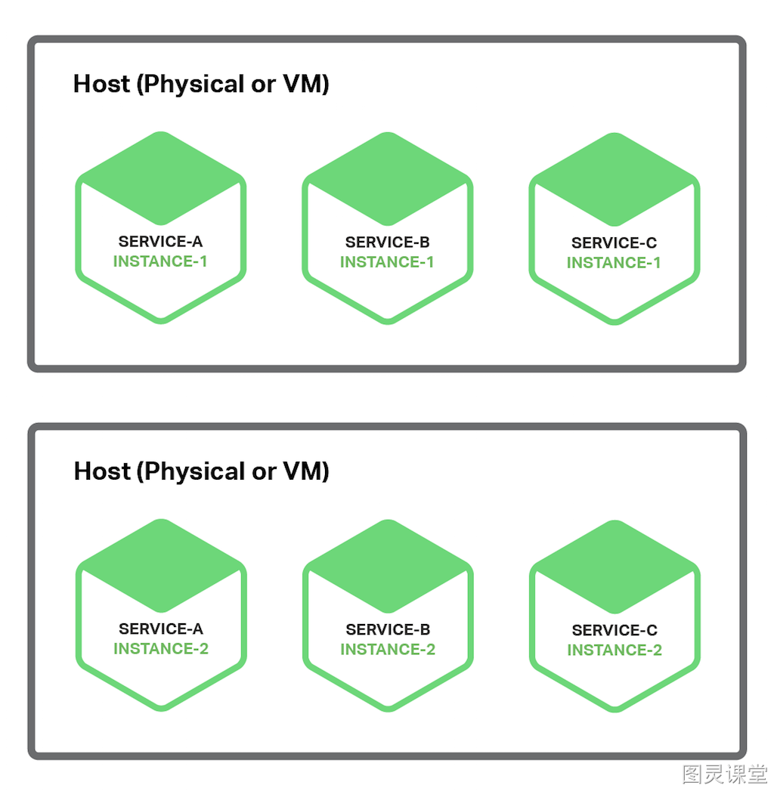
这种模式有一些参数，一个参数代表每个服务实例由多少进程构成。例如，需要在 Apache Tomcat Server 上部署一个 Java 服务实例作为 web 应用。一个 Node.js 服务实例可能有一个父进程和若干个子进程构成。
另外一个参数定义同一进程组内有多少服务实例运行。例如，可以在同一个 Apache Tomcat Server 上运行多个 Java web 应用，或者在同一个 OSGI 容器内运行多个 OSGI 捆绑实例。
单主机多服务实例模式也是优缺点并存。主要优点在于资源利用有效性。多服务实例共享服务器和操作系统，如果进程组运行多个服务实例效率会更高，例如，多个 web 应用共享同一个 Apache Tomcat Server 和 JVM。
另一个优点在于部署服务实例很快。只需将服务拷贝到主机并启动它。如果服务用 Java 写的，只需要拷贝 JAR 或者 WAR 文件即可。对于其它语言，例如 Node.js 或者 Ruby，需要拷贝源码。也就是说网络负载很低。
因为没有太多负载，启动服务很快。如果服务是自包含的进程，只需要启动就可以；否则，如果是运行在容器进程组中的某个服务实例，则需要动态部署进容器中，或者重启容器。
除了上述优点外，单主机多服务实例也有缺陷。其中一个主要缺点是服务实例间很少或者没有隔离，除非每个服务实例是独立进程。如果想精确监控每个服务实例资源使用，就不能限制每个实例资源使用。因此有可能造成某个糟糕的服务实例占用了主机的所有内存或者 CPU。
同一进程内多服务实例没有隔离。所有实例有可能，例如，共享同一个 JVM heap。某个糟糕服务实例很容易攻击同一进程中其它服务；更甚至于，有可能无法监控每个服务实例使用的资源情况。
另一个严重问题在于运维团队必须知道如何部署的详细步骤。服务可以用不同语言和框架写成，因此开发团队肯定有很多需要跟运维团队沟通事项。其中复杂性增加了部署过程中出错的可能性。
可以看到，尽管熟悉，但是单主机多服务实例有很多严重缺陷。下面看看是否有其他部署微服务方式能够避免这些问题。

### 单主机单服务实例模式
另外一种部署微服务方式是单主机单实例模式。当使用这种模式，每个主机上服务实例都是各自独立的。有两种不同实现模式：单虚拟机单实例和单容器单实例。

#### 单虚拟机单实例模式
但是用单虚拟机单实例模式，一般将服务打包成虚拟机映像（image），例如一个 Amazon EC2 AMI。每个服务实例是一个使用此映像启动的 VM（例如，EC2 实例）。下图展示了此架构：
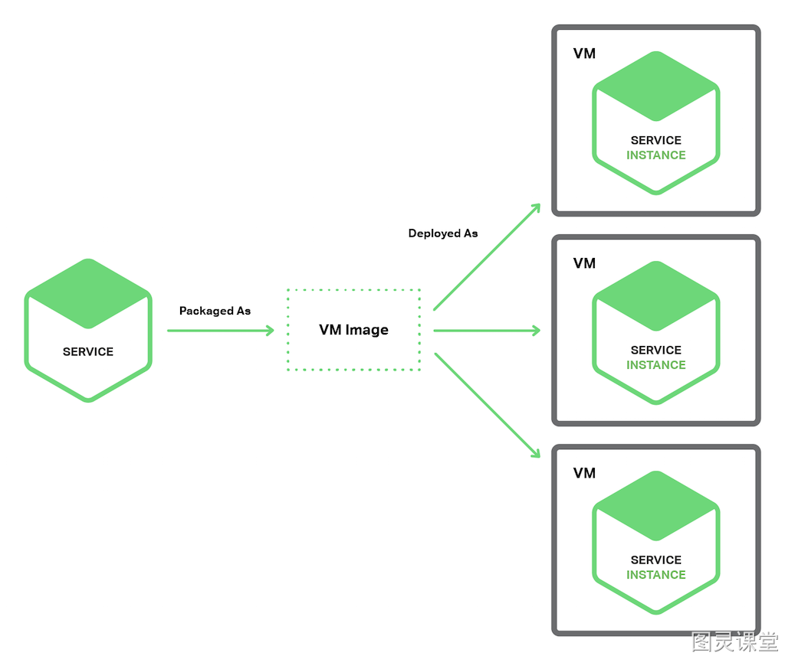
Netfix 采用这种架构部署 video streaming service。Netfix 使用 Aminator 将每个服务打包成一个 EC2 AMI。每个运行服务实例就是一个 EC2 实例。
有很多工具可以用来搭建自己的 VMs。可以配置持续集成（CI）服务（例如，Jenkins）避免 Aminator 将服务打包成 EC2 AMI。[packer.io](http://packer.io) 是自动虚机映像创建的另外一种选择。跟 Aminator 不同，它支持一系列虚拟化技术，例如 EC2，DigitalOcean，VirtualBox 和 VMware。
Boxfuse 公司有一个创新方法创建虚机映像，克服了如下缺陷。Boxfuse 将 java 应用打包成最小虚机映像，它们创建迅速，启动很快，因为对外暴露服务接口少而更加安全。
CloudNative 公司有一个用于创建 EC2 AMI 的 SaaS 应用，Bakery。用户微服务架构通过测试后，可以配置自己的 CI 服务器激活 Bakery。Bakery 将服务打包成 AMI。使用如 Bakery 的 SaaS 应用意味着用户不需要浪费时间在设置自己的 AMI 创建架构。
每虚拟机服务实例模式有许多优势，主要的 VM 优势在于每个服务实例都是完全独立运行的，都有各自独立的 CPU 和内存而不会被其它服务占用。
另外一个好处在于用户可以使用成熟云架构，例如 AWS 提供的，云服务都提供如负载均衡和扩展性等有用功能。
还有一个好处在于服务实施技术被自包含了。一旦服务被打包成 VM 就成为一个黑盒子。VM 的管理 API 成为部署服务的 API，部署成为一个非常简单和可靠的事情。
单虚拟机单实例模式也有缺点。一个缺点就是资源利用效率不高。每个服务实例占用整个虚机的资源，包括操作系统。而且，在一个典型的公有 IaaS 环境，虚机资源都是标准化的，有可能未被充分利用。
而且，公有 IaaS 根据 VM 来收费，而不管虚机是否繁忙；例如 AWS 提供了自动扩展功能，但是对随需应用缺乏快速响应，使得用户不得不多部署虚机，从而增加了部署费用。
另外一个缺点在于部署服务新版本比较慢。虚机镜像因为大小原因创建起来比较慢，同样原因，虚机初始化也比较慢，操作系统启动也需要时间。但是这并不一直是这样，一些轻量级虚机，例如使用 Boxfuse 创建的虚机，就比较快。
第三个缺点是对于运维团队，它们负责许多客制化工作。除非使用如 Boxfuse 之类的工具，可以帮助减轻大量创建和管理虚机的工作；否则会占用大量时间从事与核心业务不太无关的工作。
那么我们来看看另外一种仍然具有虚机特性，但是比较轻量的微服务部署方法。

#### 单容器单服务实例模式
当使用这种模式时，每个服务实例都运行在各自容器中。容器是运行在操作系统层面的虚拟化机制。一个容器包含若干运行在沙箱中的进程。从进程角度来看，他们有各自的命名空间和根文件系统；可以限制容器的内存和 CPU 资源。某些容器还具有 I/O 限制，这类容器技术包括 Docker 和 Solaris Zones。
下图展示了这种模式：
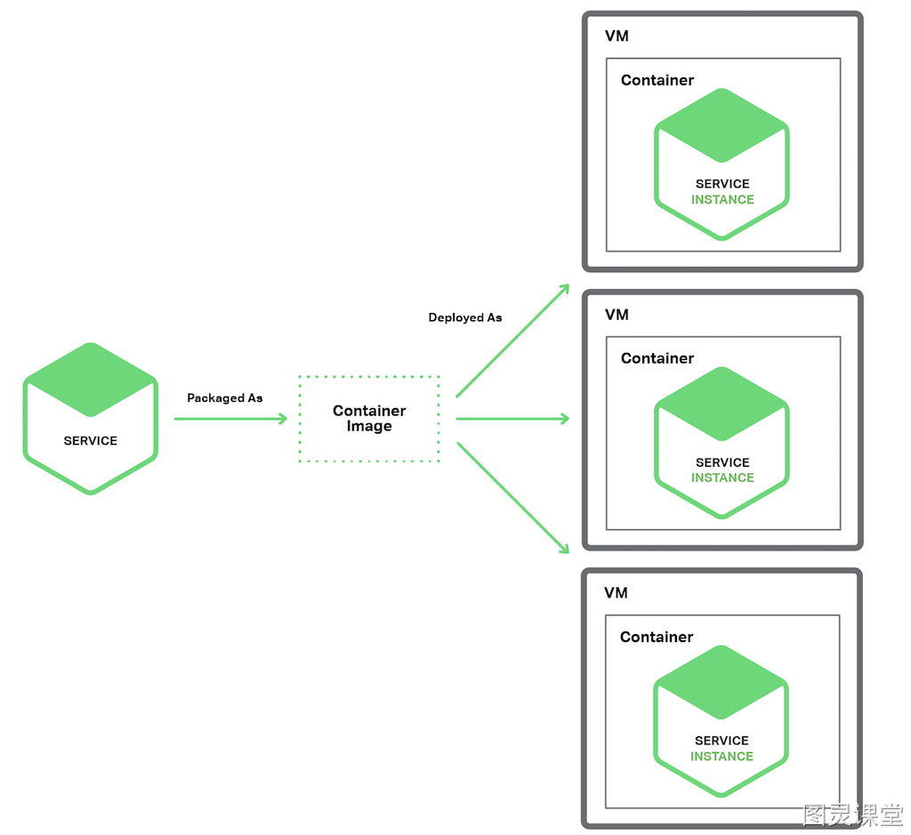
使用这种模式需要将服务打包成容器映像。一个容器映像是一个运行包含服务所需库和应用的文件系统 。某些容器映像由完整的 linux 根文件系统组成，其它则是轻量级的。例如，为了部署 Java 服务，需要创建包含 Java 运行库的容器映像，也许还要包含 Apache Tomcat server，以及编译过的 Java 应用。
一旦将服务打包成容器映像，就需要启动若干容器。一般在一个物理机或者虚拟机上运行多个容器，可能需要集群管理系统，例如 k8s 或者 Marathon，来管理容器。集群管理系统将主机作为资源池，根据每个容器对资源的需求，决定将容器调度到那个主机上。
单容器单服务实例模式也是优缺点都有。容器的优点跟虚机很相似，服务实例之间完全独立，可以很容易监控每个容器消耗的资源。跟虚机相似，容器使用隔离技术部署服务。容器管理 API 也可以作为管理服务的 API。
然而，跟虚机不一样，容器是一个轻量级技术。容器映像创建起来很快，例如，在笔记本电脑上，将 Spring Boot 应用打包成容器映像只需要 5 秒钟。因为不需要操作系统启动机制，容器启动也很快。当容器启动时，后台服务就启动了。
使用容器也有一些缺点。尽管容器架构发展迅速，但是还是不如虚机架构成熟。而且由于容器之间共享 host OS 内核因此并不像虚机那么安全。
另外，容器技术将会对管理容器映像提出许多客制化需求，除非使用如 Google Container Engine 或者 Amazon EC2 Container Service (ECS)，否则用户将同时需要管理容器架构以及虚机架构。
第三，容器经常被部署在按照虚机收费的架构上，很显然，客户也会增加部署费用来应对负载的增长。
有趣的是，容器和虚机之间的区别越来越模糊。如前所述，Boxfuse 虚机启动创建都很快，Clear Container 技术面向创建轻量级虚机。unikernel 公司的技术也引起大家关注，Docker 最近收购了 Unikernel 公司。
除了这些之外，server-less 部署技术，避免了前述容器和 VM 技术的缺陷，吸引了越来越多的注意。下面我们来看看。

### Serverless 部署
AWS Lambda 是 serverless 部署技术的例子，支持 Java，Node.js 和 Python 服务；需要将服务打包成 ZIP 文件上载到 AWS Lambda 就可以部署。可以提供元数据，提供处理服务请求函数的名字（一个事件）。AWS Lambda 自动运行处理请求足够多的微服务，然而只根据运行时间和消耗内存量来计费。当然细节决定成败，AWS Lambda 也有限制。但是大家都不需要担心服务器，虚拟机或者容器内的任何方面绝对吸引人。
Lambda 函数 是无状态服务。一般通过激活 AWS 服务处理请求。例如，当映像上载到 S3 bucket 激活 Lambda 函数后，就可以在 DynamoDB 映像表中插入一个条目，给 Kinesis 流发布一条消息，触发映像处理动作。Lambda 函数也可以通过第三方 web 服务激活。
有四种方法激活 Lambda 函数：

- 直接方式，使用 web 服务请求
- 自动方式，回应例如 AWS S3，DynamoDB，Kinesis 或者 Simple Email Service 等产生的事件
- 自动方式，通过 AWS API 网关来处理应用客户端发出的 HTTP 请求 
- 定时方式，通过 cron 响应 --很像定时器方式

可以看出，AWS Lambda 是一种很方便部署微服务的方式。基于请求计费方式意味着用户只需要承担处理自己业务那部分的负载；另外，因为不需要了解基础架构，用户只需要开发自己的应用。
然而还是有不少限制。不需要用来部署长期服务，例如用来消费从第三方代理转发来的消息，请求必须在 300 秒内完成，服务必须是无状态，因为理论上 AWS Lambda 会为每个请求生成一个独立的实例；必须用某种支持的语言完成，服务必须启动很快，否则，会因为超时被停止。 部署微服务应用也是一种挑战。用各种语言和框架写成的服务成百上千。每种服务都是一种迷你应用，有自己独特的部署、资源、扩充和监控需求。有若干种微服务部署模式，包括单虚机单实例以及单容器单实例。另外可选模式还有 AWS Lambda，一种 serverless 方法。

## HTTP和HTTPS的主要区别?

- HTTP 明文传输，数据都是未加密的，安全性较差，HTTPS（SSL+HTTP） 数据传输过程是加密的，安全性较好。
- 使用 HTTPS 协议需要到 CA（Certificate Authority，数字证书认证机构） 申请证书，一般免费证书较少，因而需要一定费用。证书颁发机构如：Symantec、Comodo、GoDaddy 和 GlobalSign 等。
- HTTP 页面响应速度比 HTTPS 快，主要是因为 HTTP 使用 TCP 三次握手建立连接，客户端和服务器需要交换 3 个包，而 HTTPS除了 TCP 的三个包，还要加上 ssl 握手需要的 9 个包，所以一共是 12 个包。
- http 和 https 使用的是完全不同的连接方式，用的端口也不一样，前者是 80，后者是 443。
- HTTPS 其实就是建构在 SSL/TLS 之上的 HTTP 协议，所以，要比较 HTTPS 比 HTTP 要更耗费服务器资源。

## 如何设计一个高并发的系统?
说实话，如果面试官问你这个题目，那么你必须要使出全身吃奶劲了。为啥？因为你没看到现在很多公司招聘的 JD 里都是说啥，有高并发经验者优先。
如果你确实有真才实学，在互联网公司里干过高并发系统，那你确实拿 offer 基本如探囊取物，没啥问题。面试官也绝对不会这样来问你，否则他就是蠢。
假设你在某知名电商公司干过高并发系统，用户上亿，一天流量几十亿，高峰期并发量上万，甚至是十万。那么人家一定会仔细盘问你的系统架构，你们系统啥架构？怎么部署的？部署了多少台机器？缓存咋用的？MQ 咋用的？数据库咋用的？就是深挖你到底是如何扛住高并发的。
因为真正干过高并发的人一定知道，脱离了业务的系统架构都是在纸上谈兵，真正在复杂业务场景而且还高并发的时候，那系统架构一定不是那么简单的，用个 redis，用 mq 就能搞定？当然不是，真实的系统架构搭配上业务之后，会比这种简单的所谓“高并发架构”要复杂很多倍。
如果有面试官问你个问题说，如何设计一个高并发系统？那么不好意思，**一定是因为你实际上没干过高并发系统**。面试官看你简历就没啥出彩的，感觉就不咋地，所以就会问问你，如何设计一个高并发系统？其实说白了本质就是看看你有没有自己研究过，有没有一定的知识积累。
最好的当然是招聘个真正干过高并发的哥儿们咯，但是这种哥儿们人数稀缺，不好招。所以可能次一点的就是招一个自己研究过的哥儿们，总比招一个啥也不会的哥儿们好吧！
所以这个时候你必须得做一把个人秀了，秀出你所有关于高并发的知识！
其实所谓的高并发，如果你要理解这个问题呢，其实就得从高并发的根源出发，为啥会有高并发？为啥高并发就很牛逼？
我说的浅显一点，很简单，就是因为刚开始系统都是连接数据库的，但是要知道数据库支撑到每秒并发两三千的时候，基本就快完了。所以才有说，很多公司，刚开始干的时候，技术比较 low，结果业务发展太快，有的时候系统扛不住压力就挂了。
当然会挂了，凭什么不挂？你数据库如果瞬间承载每秒 5000/8000，甚至上万的并发，一定会宕机，因为比如 mysql 就压根儿扛不住这么高的并发量。
所以为啥高并发牛逼？就是因为现在用互联网的人越来越多，很多 app、网站、系统承载的都是高并发请求，可能高峰期每秒并发量几千，很正常的。如果是什么双十一之类的，每秒并发几万几十万都有可能。
那么如此之高的并发量，加上原本就如此之复杂的业务，咋玩儿？真正厉害的，一定是在复杂业务系统里玩儿过高并发架构的人，但是你没有，那么我给你说一下你该怎么回答这个问题：
可以分为以下 6 点：

-  系统拆分 
-  缓存 
-  MQ 
-  分库分表 
-  读写分离 
-  ElasticSearch
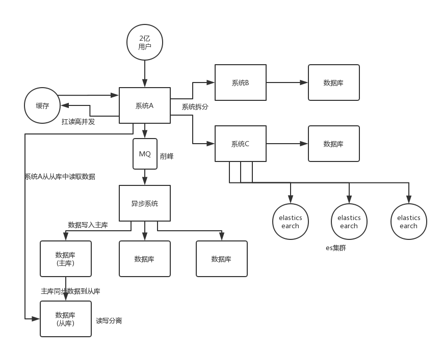

### 系统拆分
将一个系统拆分为多个子系统，用 dubbo 来搞。然后每个系统连一个数据库，这样本来就一个库，现在多个数据库，不也可以扛高并发么。

### 缓存
缓存，必须得用缓存。大部分的高并发场景，都是**读多写少**，那你完全可以在数据库和缓存里都写一份，然后读的时候大量走缓存不就得了。毕竟人家 redis 轻轻松松单机几万的并发。所以你可以考虑考虑你的项目里，那些承载主要请求的**读场景，怎么用缓存来抗高并发**。

### MQ
MQ，必须得用 MQ。可能你还是会出现高并发写的场景，比如说一个业务操作里要频繁搞数据库几十次，增删改增删改，疯了。那高并发绝对搞挂你的系统，你要是用 redis 来承载写那肯定不行，人家是缓存，数据随时就被 LRU 了，数据格式还无比简单，没有事务支持。所以该用 mysql 还得用 mysql 啊。那你咋办？用 MQ 吧，大量的写请求灌入 MQ 里，排队慢慢玩儿，**后边系统消费后慢慢写**，控制在 mysql 承载范围之内。所以你得考虑考虑你的项目里，那些承载复杂写业务逻辑的场景里，如何用 MQ 来异步写，提升并发性。MQ 单机抗几万并发也是 ok 的，这个之前还特意说过。

### 分库分表
分库分表，可能到了最后数据库层面还是免不了抗高并发的要求，好吧，那么就将一个数据库拆分为多个库，多个库来扛更高的并发；然后将一个表**拆分为多个表**，每个表的数据量保持少一点，提高 sql 跑的性能。

### 读写分离
读写分离，这个就是说大部分时候数据库可能也是读多写少，没必要所有请求都集中在一个库上吧，可以搞个主从架构，**主库写**入，**从库读**取，搞一个读写分离。**读流量太多**的时候，还可以**加更多的从库**。

### ElasticSearch
Elasticsearch，简称 es。es 是分布式的，可以随便扩容，分布式天然就可以支撑高并发，因为动不动就可以扩容加机器来扛更高的并发。那么一些比较简单的查询、统计类的操作，可以考虑用 es 来承载，还有一些全文搜索类的操作，也可以考虑用 es 来承载。
上面的 6 点，基本就是高并发系统肯定要干的一些事儿，大家可以仔细结合之前讲过的知识考虑一下，到时候你可以系统的把这块阐述一下，然后每个部分要注意哪些问题，之前都讲过了，你都可以阐述阐述，表明你对这块是有点积累的。
说句实话，毕竟你真正厉害的一点，不是在于弄明白一些技术，或者大概知道一个高并发系统应该长什么样？其实实际上在真正的复杂的业务系统里，做高并发要远远比上面提到的点要复杂几十倍到上百倍。你需要考虑：哪些需要分库分表，哪些不需要分库分表，单库单表跟分库分表如何 join，哪些数据要放到缓存里去，放哪些数据才可以扛住高并发的请求，你需要完成对一个复杂业务系统的分析之后，然后逐步逐步的加入高并发的系统架构的改造，这个过程是无比复杂的，一旦做过一次，并且做好了，你在这个市场上就会非常的吃香。
其实大部分公司，真正看重的，不是说你掌握高并发相关的一些基本的架构知识，架构中的一些技术，RocketMQ、Kafka、Redis、Elasticsearch，高并发这一块，你了解了，也只能是次一等的人才。对一个有几十万行代码的复杂的分布式系统，一步一步架构、设计以及实践过高并发架构的人，这个经验是难能可贵的。

## 进程和线程的区别，使用线程真的能节省时间？
进程：指在系统中正在运行的一个应用程序；程序一旦运行就是进程；或者更专业化来说：进程是指程序执行时的一个实例，即它是程序已经执行到课中程度的数据结构的汇集。从内核的观点看，进程的目的就是担当分配系统资源（CPU时间、内存等）的基本单位。
线程：系统分配处理器时间资源的基本单元，或者说进程之内独立执行的一个单元执行流。进程——资源分配的最小单位，线程——程序执行的最小单位。
**线程进程的区别体现在4个方面：**
1、因为进程拥有独立的堆栈空间和数据段，所以每当启动一个新的进程必须分配给它独立的地址空间，建立众多的数据表来维护它的代码段、堆栈段和数据段，这对于多进程来说十分“奢侈”，系统开销比较大，而线程不一样，线程拥有独立的堆栈空间，但是共享数据段，它们彼此之间使用相同的地址空间，共享大部分数据，比进程更节俭，开销比较小，切换速度也比进程快，效率高，但是正由于进程之间独立的特点，使得进程安全性比较高，也因为进程有独立的地址空间，一个进程崩溃后，在保护模式下不会对其它进程产生影响，而线程只是一个进程中的不同执行路径。一个线程死掉就等于整个进程死掉。
2、体现在通信机制上面，正因为进程之间互不干扰，相互独立，进程的通信机制相对很复杂，譬如管道，信号，消息队列，共享内存，套接字等通信机制，而线程由于共享数据段所以通信机制很方便。。
3、体现在CPU系统上面，线程使得CPU系统更加有效，因为操作系统会保证当线程数不大于CPU数目时，不同的线程运行于不同的CPU上。
4、体现在程序结构上，举一个简明易懂的列子：当我们使用进程的时候，我们不自主的使用if else嵌套来判断pid，使得程序结构繁琐，但是当我们使用线程的时候，基本上可以甩掉它，当然程序内部执行功能单元需要使用的时候还是要使用，所以线程对程序结构的改善有很大帮助。
**什么情况下使用进程和线程：**
1、需要频繁创建销毁的优先使用线程；因为对进程来说创建和销毁一个进程代价是很大的
2、线程的切换速度快，所以在需要大量计算，切换频繁时用线程，还有耗时的操作使用线程可提高应用程序的响应
3、因为对CPU系统的效率使用上线程更占优，所以可能要发展到多机分布的用进程，多核分布用线程
4、并行操作时使用线程，如C/S架构的服务器端并发线程响应用户的请求
5、需要更稳定安全时，适合选择进程；需要速度时，选择线程更好  
因为我的项目中需要对数据段的数据共享，可以被多个程序所修改，所以使用线程来完成此操作，无需加入复杂的通信机制，使用进程需要添加复杂的通信机制实现数据段的共享，增加了我的代码的繁琐，而且使用线程开销小，项目运行的速度快，效率高。
如果只用进程的话，虽然安全性高，但是对代码的简洁性不好，程序结构繁琐，开销比较大，还需要加入复杂的通信机制，会使得我的项目代码量大大增加，切换速度会变的很慢，执行效率降低不少。。。
进程和线程的关系：
1、一个线程只能属于一个进程，而一个进程可以有多个线程，但至少有一个线程。线程是操作系统可识别的最小执行和调度单位。
2、资源分配给进程，同一进程的所有线程共享该进程的所有资源。 同一进程中的多个线程共享代码段(代码和常量)，数据段(全局变量和静态变量)，扩展段(堆存储)。但是每个线程拥有自己的栈段，栈段又叫运行时段，用来存放所有局部变量和临时变量。
3、处理机分给线程，即真正在处理机上运行的是线程。
4、线程在执行过程中，需要协作同步。不同进程的线程间要利用消息通信的办法实现同步。

#### 多线程一般用在哪些地方？
1、java多线程一般多用于高并发的地方，如订单状态的修改，可以通过多线程，固定时间执行修改订单状态，还有就是支付方面一般都会用到多线程。
2、最典型的如：
用户注册完成送大礼包/积分之类，且积分等也是另一个系统并比较耗时；且这类任务即使失败也不是特别重要的。
后台线程：比如定期执行一些特殊任务，如定期更新配置文件，任务调度（如quartz），一些监控用于定期信息采集等。
3、最典型的应用比如tomcat，tomcat内部采用的就是多线程，上百个客户端访问同一个web应用，tomcat接入后都是把后续的处理扔给一个新的线程来处理，这个新的线程最后调用到我们的servlet程序，比如doGet或者doPost方法。
如果不采用多线程机制，上百个人同时访问一个web应用的时候，tomcat就得排队串行处理了，那样客户端根本是无法忍受那种访问速度的。
还有就是需要异步处理的时候，需要使用多线程。比如task a和task b要并行处理，单个线程只能串行处理，先做完task a然后再做task b。如果想要多个task同时执行的话，就必须为每个task分配一个线程，然后通过java虚拟机的线程调度，来同时执行多个任务。比如你的CPU是多核心的话，就可以让一个CPU执行一个线程。如果只有一个CPU的话，底层是按照分时复用的原则，各个线程按照时间片来获得CPU资源。
4、特别耗时的操作，如备份数据库，可以开个线程执行备份，然后执行返回，前台不断向后台询问线程执行状态
5、一个业务逻辑有很多次的循环，每次循环之间没有影响，比如验证1万条url路径是否存在，正常情况要循环1万次，逐个去验证每一条URL，这样效率会很低，假设验证一条需要1分钟，总共就需要1万分钟，有点恐怖。这时可以用多线程，将1万条URL分成50等份，开50个线程，没个线程只需验证200条，这样所有的线程执行完是远小于1万分钟的。
6、需要知道一个任务的执行进度，比如我们常看到的进度条，实现方式可以是在任务中加入一个整型属性变量(这样不同方法可以共享)，任务执行一定程度就给变量值加1，另外开一个线程按时间间隔不断去访问这个变量，并反馈给用户。
总之使用多线程就是为了充分利用cpu的资源，提高程序执行效率，当你发现一个业务逻辑执行效率特别低，耗时特别长，就可以考虑使用多线程。不过CPU执行哪个线程的时间和顺序是不确定的，即使设置了线程的优先级，因此使用多线程

#### 多线程的优点？  
1、使用线程可以把占据时间长的程序中的任务放到后台去处理
2、用户界面可以更加吸引人，这样比如用户点击了一个按钮去触发某些事件的处理，可以弹出一个进度条来显示处理的进度
3、程序的运行速度可能加快
4、在一些等待的任务实现上如用户输入、文件读写和网络收发数据等，线程就比较有用了。在这种情况下可以释放一些珍贵的资源如内存占用等等。
5、多个线程交替执行，减少或避免因程序阻塞或意外情况造成的响应过慢现象，降低了用户等待的概率。

#### 多线程的缺点？  
1、如果有大量的线程,会影响性能,因为操作系统需要在它们之间切换。
2、更多的线程需要更多的内存空间。
3、程可能会给程序带来更多“bug”，因此要小心使用
4、程的中止需要考虑其对程序运行的影响。
5、通常块模型数据是在多个线程间共享的，需要防止线程死锁情况的发生。

## 请解释一下什么是C10K问题，后来是怎么解决的？
C10K 问题最早由 Dan Kegel 在 1999 年提出。那时的服务器还只是 32 位系统，运行着 Linux 2.2 版本（后来又升级到了 2.4 和 2.6，而 2.6 才支持 x86_64），只配置了很少的内存（2GB）和千兆网卡。怎么在这样的系统中支持并发 1 万的请求呢？
从资源上来说，对 2GB 内存和千兆网卡的服务器来说，同时处理 10000 个请求，只要每个请求处理占用不到 200KB（2GB/10000）的内存和 100Kbit （1000Mbit/10000）的网络带宽就可以。
所以，物理资源是足够的，接下来自然是软件的问题，特别是网络的 I/O 模型问题。
说到 I/O 的模型，我在文件系统的原理中，曾经介绍过文件 I/O，其实网络 I/O 模型也类似。
在 C10K 以前，Linux 中网络处理都用同步阻塞的方式，也就是每个请求都分配一个进程或者线程。请求数只有 100 个时，这种方式自然没问题，但增加到 10000 个请求时，10000 个进程或线程的调度、上下文切换乃至它们占用的内存，都会成为瓶颈。
既然每个请求分配一个线程的方式不合适，那么，为了支持 10000 个并发请求，这里就有两个问题需要我们解决。
第一，怎样在一个线程内处理多个请求，也就是要在一个线程内响应多个网络 I/O。以前的同步阻塞方式下，一个线程只能处理一个请求，到这里不再适用，是不是可以用非阻塞 I/O 或者异步 I/O 来处理多个网络请求呢？
第二，怎么更节省资源地处理客户请求，也就是要用更少的线程来服务这些请求。是不是可以继续用原来的 100 个或者更少的线程，来服务现在的 10000 个请求呢？当然，事实上，现在 C10K 的问题早就解决了，在继续学习下面的内容前，你可以先自己思考一下这两个问题。
结合前面学过的内容，你是不是已经有了解决思路呢？
I/O 模型优化异步、非阻塞 I/O 的解决思路，你应该听说过，其实就是我们在网络编程中经常用到的 I/O 多路复用（I/O Multiplexing）。
I/O 多路复用是什么意思呢？别急，详细了解前，我先来讲两种 I/O 事件通知的方式：水平触发和边缘触发，它们常用在套接字接口的文件描述符中。水平触发：只要文件描述符可以非阻塞地执行 I/O ，就会触发通知。也就是说，应用程序可以随时检查文件描述符的状态，然后再根据状态，
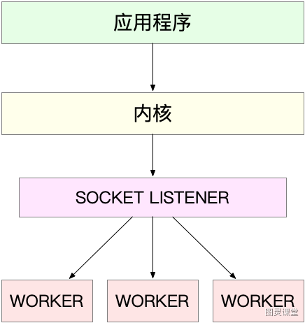
这里要注意，accept() 和 epoll_wait() 调用，还存在一个惊群的问题。
换句话说，当网络 I/O 事件发生时，多个进程被同时唤醒，但实际上只有一个进程来响应这个事件，其他被唤醒的进程都会重新休眠。其中，accept() 的惊群问题，已经在 Linux 2.6 中解决了；而 epoll 的问题，到了 Linux 4.5 ，才通过 EPOLLEXCLUSIVE 解决。为了避免惊群问题， Nginx 在每个 worker 进程中，都增加了一个全局锁（accept_mutex）。
这些 worker 进程需要首先竞争到锁，只有竞争到锁的进程，才会加入到 epoll 中，这样就确保只有一个 worker 子进程被唤醒。不过，根据前面 CPU 模块的学习，你应该还记得，进程的管理、调度、上下文切换的成本非常高。那为什么使用多进程模式的 Nginx ，却具有非常好的性能呢？
这里最主要的一个原因就是，这些 worker 进程，实际上并不需要经常创建和销毁，而是在没任务时休眠，有任务时唤醒。
只有在 worker 由于某些异常退出时，主进程才需要创建新的进程来代替它。当然，你也可以用线程代替进程：主线程负责套接字初始化和子线程状态的管理，而子线程则负责实际的请求处理。
由于线程的调度和切换成本比较低，实际上你可以进一步把 epoll_wait() 都放到主线程中，保证每次事件都只唤醒主线程，而子线程只需要负责后续的请求处理。
第二种，监听到相同端口的多进程模型。在这种方式下，所有的进程都监听相同的接口，并且开启 SO_REUSEPORT 选项，由内核负责将请求负载均衡到这些监听进程中去。这一过程如下图所示。
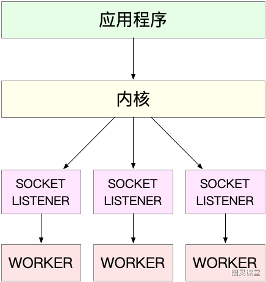
由于内核确保了只有一个进程被唤醒，就不会出现惊群问题了。比如，Nginx 在 1.9.1 中就已经支持了这种模式。
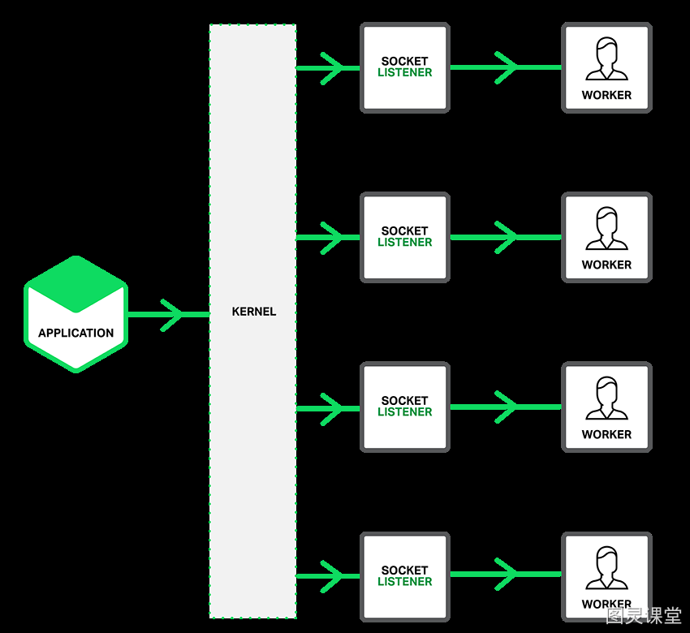
基于 I/O 多路复用和请求处理的优化，C10K 问题很容易就可以解决。不过，随着摩尔定律带来的服务器性能提升，以及互联网的普及，你并不难想到，新兴服务会对性能提出更高的要求。

## 你在工作中用过哪些设计模式？
设计模式我们多少都有些了解，但是往往也只是知道是什么。
在真实的业务场景中，你有用过什么设计模式来编写更优雅的代码吗？
我们更多的是每天从产品经理那里接受到新需求后，就开始MVC一把梭，面向sql编程了。
我们习惯采用MVC架构，实时上是非常容易创建很多贫血对象模型，然后写出过程式代码。我们使用的对象，往往只是数据的载体，没有任何逻辑行为。我们的设计过程，也是从ER图开始，以数据为中心进行驱动设计。一个需求一个接口，从controller到service到dao，这样日复一日的CRUD。
什么设计模式？根本不存在的！
今天，我们尝试从常用设计模式（工厂模式、代理模式、模版模式）在CRUD中的可落地场景，希望能给大家带来一些启发。
2.理解设计模式
设计模式（Design pattern），不是前人凭空想象的，而是在长期的软件设计实践过程中，经过总结得到的。
使用设计模式是为了让代码具有可扩展性，实现高聚合、低耦合的特性。
面向对象的设计模式有七大基本原则：
开闭原则（首要原则）： 要对扩展开放，对修改关闭
单一职责原则： 实现类要职责单一
里氏代换原则： 不要破坏继承体系
依赖倒转原则： 面向接口编程
接口隔离原则： 设计接口要精简单一
合成/聚合复用原则： 尽量先使用组合或者聚合来实现，其次才考虑使用继承关系来实现
最少知识原则或者迪米特法则： 降低耦合
过去，我们会去学习设计模式的理论，今天，我们尝试从常用设计模式（工厂模式、代理模式、模版模式）在CRUD中的可落地场景，希望能给大家带来一些实战启发。

## 了解过哪些设计原则？说说你的理解？

### 单一职责原则

- 官方解释：单一职责原则（SRP：Single responsibility principle）又称单一功能原则，面向对象五个基本原则（SOLID）之一。它规定一个类应该只有一个发生变化的原因。
- 大白话：一个类只有一个发生变化的原因，我只能说在业务编码中不太可能，或很维做到。其实大家不必纠结于有几个让类发生变化的原因。个人建议你想实践单一职责原则，最好先养成良好的编码规范，如果你平时写代码，一个类里不管什么业务方法都往里塞，一个方法里嵌套着各种判断，再好的原则也帮不也你。
- 实践：和类名不相关的业务不要放在这个类里，和方法名不相关的代码请拆成单独的子方法。还有当你在定义一个接口、类或方法的时候，从业务的角度用心地多想一下：这段代码放这里真的合适吗？

### 里氏替换原则

- 官方解释：里氏替换原则(Liskov Substitution Principle LSP)面向对象设计的基本原则之一。里氏替换原则中说，任何基类可以出现的地方，子类一定可以出现。LSP是继承复用的基石，只有当衍生类可以替换掉基类，软件单位的功能不受到影响时，基类才能真正被复用，而衍生类也能够在基类的基础上增加新的行为。
- 大白话：这个原则其实还是很好理解的，主要是约束子类的行为，要求其行为和基类保持一致，如果替换为子类后，程序运行不正常，则说明子类没有按基类的预期实现业务，或者说子类不适合继承这个基类，对不起，请找适合的基类继承。
- 实践：如果子类从一个基类继承后，实现基类定义的虚方法时感觉很别扭痛苦的时候，请考虑一下是否一定要从这个基类继承。

### 依赖倒置原则

- 官方解释：依赖倒置原则（Dependence Inversion Principle）是程序要依赖于抽象接口，不要依赖于具体实现。简单的说就是要求对抽象进行编程，不要对实现进行编程，这样就降低了客户与实现模块间的耦合。
- 大白话：多用接口和抽象类，少用实现类（工具类除外）。大家看框架源码的时候应该能感觉到，大神在实现框架的时候到处都是接口或抽象类，而自己的代码却是一大片的实现类，其实直接用实现类是没有问题的。架构方法中有一句叫可扩展性，其实接口和抽象类就是实现可扩展性的基石。当需要扩展原有逻辑的时候，别人用接口和抽象类的直接加个新子类继承下，你用实现类的到处一大片一大片的改，请回答我，有没有？
- 实践：写代码的时候多考虑扩展性，如果这段代码以后扩展或变化的可能性很高，请用接口或抽象类封装下，抽象出不变的接口，将变化的部分留给不同的实现类。

### 接口隔离原则

- 官方解释：接口隔离原则（Interface Segregation Principle,）使用多个专门的接口比使用单一的总接口要好。一个类对另外一个类的依赖性应当是建立在最小的接口上的。
- 大白话：这个原则和单一职责原则有点象，好吧，其实很难区分的。主要区分点在“职责”和“隔离”两个词上。职责要求按类的功能单一性定义接口、类、方法。隔离要求最细化的定义接口，尽量避免大而全的接口，不然接口一改，所以的实现类一片报红，请回答我，有没有？
- 实践：情愿让类实现多个单一接口，也不要实现一个大而全的接口。

### 迪米特原则

- 官方解释：迪米特法则（Law of Demeter）又叫作最少知识原则（Least Knowledge Principle 简写LKP），一个类对于其他类知道的越少越好，就是说一个对象应当对其他对象有尽可能少的了解,只和朋友通信，不和陌生人说话。
- 大白话：电视剧经常有这个台词：“你知道的太多了”，然后一枪被崩了。这个原则也是这个道理，就是一个类尽量减少和其他类组合，这样能减少类之间的耦合，如果实现要关联，可以通过第三者（朋友）。门面模式和中介者模式就是这个原则的体现。
- 实践：一个类里，尽量减少与太多的类接触，如果不可避免，可以用一个中介类代替。

### 开闭原则

- 官方解释：在面向对象编程领域中，开闭原则规定“软件中的对象（类，模块，函数等等）应该对于扩展是开放的，但是对于修改是封闭的”，这意味着一个实体是允许在不改变它的源代码的前提下变更它的行为。该特性在产品化的环境中是特别有价值的，在这种环境中，改变源代码需要代码审查，单元测试以及诸如此类的用以确保产品使用质量的过程。遵循这种原则的代码在扩展时并不发生改变，因此无需上述的过程。
- 大白话：其实这个原则实操性不强。如果这个原则是思想的话，上面的五个原则就是这个思想的实践，如果我们代码真的能做到职责单一、面向抽象编程且清爽的编码规范，则会很容易实现开闭原则。但现实情况是，我们的代码模块与模块，类与类高度耦合、很难见到接口或抽象类、甚至全是面向过程编码。所以在实际业务中，我们改一点代码，都要涉及很多项目、类、方法。改完很自信地说：我改动不大，不会影响线上业务的，不用测试，直接上线。请回答我，有没有？
- 实践：尽量避免修改原有的代码（一点不改也不太可能），前期编码的时候留好扩展点，使用继承增加新子类的方式修改原有业务。

### 总结

- 在学习设计原则和模式的时候，请先保证自己写出的代码是整洁且符合规范的，不然再好的原则和模式也拯救不了你那一大坨一大坨的类和方法，最起码的读你写的某一个方法的时候，不用拖滚动条。
- 真正的理解你所在公司的业务和需求，先在产品和文档级别上简化业务、理清编码的思路，这样更准确地找出业务的变化点和扩展点。
- 设计模式其实就是封装变化，所以编码的时候多用心变化点，有变化了就考虑抽象出接口或抽象类。当然，在实际业务中，多是增删改查，如果一昧的到处定义接口，也会增加复杂度，这些可以自己权衡或按团队的编码规范实施。
- 不要刻意地去背这些模式或者照着敲几遍，没用的！实际业务编码中，发现业务变化或扩展点后再去找适合的模式。


## 如何保证消息不被重复消费
**MQ能保证的是消息至少保证消息能被消费者成功消费一次 **
正是因为这种特性，MQ就很难避免消息重复消费问题

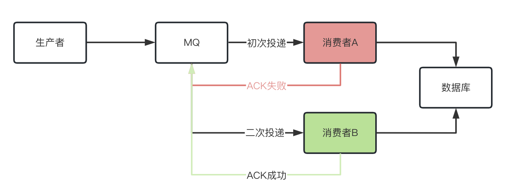

本身消息投递的可靠性要比我们重复消费的优先级更高，所以一般防重问题都是交给我们应用本身去实现的。这也就是为什么RocketMQ文档中强调：消费逻辑需要自我实现幂等。
其实重复消费不可怕，可怕的是你没考虑到重复消费之后，怎么保证幂等性。
幂等性是指同一个操作在多次执行中产生的结果是相同的。可以通过在应用程序中设计幂等性来解决MQ重复消费问题。例如，为每个消息分配一个唯一标识符，应用程序在消费消息时检查该消息是否已经被处理过，如果已经处理过则直接忽略。
真实的业务场景各式各样，大家可以举一反三，在实际应用中需要结合具体的业务来看。


# MQ系列：如何保证消息的顺序性？

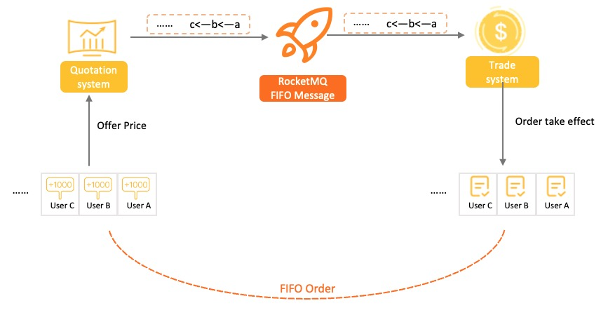

在这个过程中，可能会有多个同价的交易单，如果没按照顺序交易，就违反了我们本身系统的业务，这样肯定是不行的。

## RocketMQ消息顺序错乱
> 对于RocketMQ来说，它本身是支持顺序消息的，但是也有一定的限制。

Apache RocketMQ 顺序消息的顺序关系通过消息组（MessageGroup）判定和识别，发送顺序消息时需要为每条消息设置归属的消息组，相同消息组的多条消息之间遵循先进先出的顺序关系，不同消息组、无消息组的消息之间不涉及顺序性。
> —— 来源 RocketMQ 5.X 官方文档


## 如何保证消息的顺序性

### 生产顺序性
RocketMQ 通过生产者和服务端的协议保障单个生产者串行地发送消息，并按序存储和持久化。
如需保证消息生产的顺序性，则必须满足以下条件：

-  单一生产者：消息生产的顺序性仅支持单一生产者，不同生产者分布在不同的系统，即使设置相同的消息组，不同生产者之间产生的消息也无法判定其先后顺序。 
-  串行发送：RocketMQ 生产者客户端支持多线程安全访问，但如果生产者使用多线程并行发送，则不同线程间产生的消息将无法判定其先后顺序。 


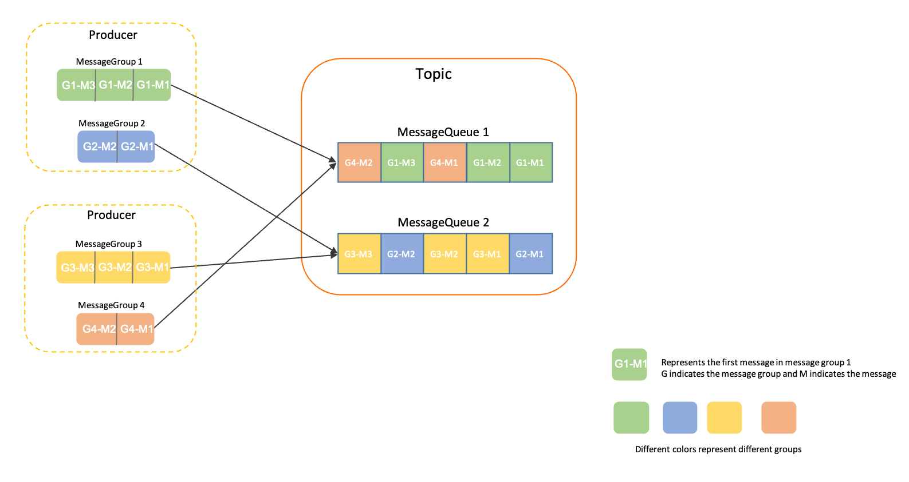
如上图所示，消息组1和消息组4的消息混合存储在队列1中，RocketMQ 保证消息组1中的消息G1-M1、G1-M2、G1-M3是按发送顺序存储，且消息组4的消息G4-M1、G4-M2也是按顺序存储，但消息组1和消息组4中的消息不涉及顺序关系。

### 消费顺序性
RocketMQ 通过消费者和服务端的协议保障消息消费严格按照存储的先后顺序来处理。
如需保证消息消费的顺序性，则必须满足以下条件：

#### 投递顺序
RocketMQ 通过客户端SDK和服务端通信协议保障消息按照服务端存储顺序投递，但业务方消费消息时需要严格按照接收---处理---应答的语义处理消息，避免因异步处理导致消息乱序。

#### 有限重试
RocketMQ 顺序消息投递仅在重试次数限定范围内，即一条消息如果一直重试失败，超过最大重试次数后将不再重试，跳过这条消息消费，不会一直阻塞后续消息处理。
对于需要严格保证消费顺序的场景，请务设置合理的重试次数，避免参数不合理导致消息乱序。

### 消费建议

#### 串行消费，避免批量消费导致乱序

#### 消息组尽可能打散，避免集中导致热点

# MQ系列：如何保证MQ的高可用？

今天我们来聊的话题是如何去保证MQ的高可用。高可用这个话题是所有中间件避免不了的话题。面试当中会有各式各样的关于高可用的提问，比如Redis怎么保证高可用，注册中心怎么保证高可用，程序怎么保证高可用。这一讲我们就来详细聊聊MQ如何保证。这里我以RocketMQ举例：


### 到底什么样的系统算高可用？

> 聊MQ之前我们先聊聊一个话题，到底什么样的系统算是高可用系统呢？业内有没有相关的评估标准呢？


系统可用性(Availability)是信息工业界用来衡量一个信息系统提供持续服务的能力，它表示的是在给定时间区间内系统或者系统某一能力在特定环境中能够正常工作的概率。

简单地说， 可用性是平均故障间隔时间(MTBF)除以平均故障间隔时间(MTBF)和平均故障修复时间(MTTR)之和所得的结果， 即：

Availablility = MTBP / (MTBF + MTTR#card=math&code=Availablility%20%3D%20MTBP%20%2F%20%28MTBF%20%2B%20MTTR%29&id=EHXRR)

看公式可能不够直观对吧，过于理论了，这里再和大家说一种业内用的比较多的方式，用N个9来表示系统的可用性。比如说：

| 年内可用 | 不可用 | 解释 |
| --- | --- | --- |
| 99.9% | 8.76小时 | 99.9%代表3个9的可用性，意味着全年不可用时间在8.76小时以内，表示该系统在连续运行1年时间里最多可能的业务中断时间是8.76小时； |
| 99.99% | 52.6分钟 | 99.99%代表4个9的可用性，意味着全年不可用时间在52.6分钟以内,表示该系统在连续运行1年时间里最多可能的业务中断时间是52.6分钟； |
| 99.999% | 5.26分钟 | 99.999%代表5个9的可用性，意味着全年不可用时间必须保证在5.26分钟以内，缺少故障自动恢复机制的系统将很难达到5个9的高可用性。 |


一般来说我们会把`4个9`的系统称之为`高可用`系统，而3个9称为较高可用，2个9只能叫做基本可用。像淘宝、京东一类的网站是能达到`4个9`的。刚提到的这种算法还只能算是简单的计算公式，但是不够全面。

为什么这么说呢？我们刚是按照停机时间来计算，大致一看没什么问题，但是我们仔细想想我们在双十一停机10分钟和某一个平淡的深夜停机10分钟造成的影响完全是不同的。所以在计算高可用的时候我们也要把这个关键变量含括进来。对于高可用我们就说到这个地方，我们主要看的还是MQ如何去保证高可用性。


### RocketMQ架构简单解析

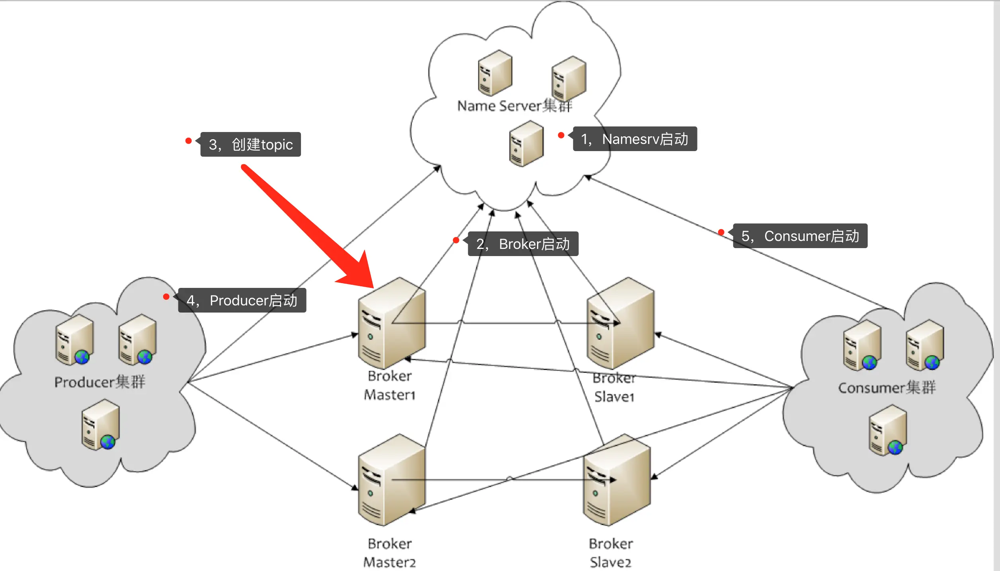

我们聊高可用，我们是不是得先知道RocketMQ里面到底有哪些组件对吧。RocketMQ 是由阿里巴巴开发的一款高性能、低延迟、高可靠、可扩展的分布式消息中间件。它的架构可以分为四个部分：NameServer、Broker、Producer 和 Consumer。

1.  **NameServer**
NameServer 负责管理所有的 Broker，它维护了 Broker 集群的信息，包括 Broker 的地址、主题（Topic）和队列（Queue）等元数据信息。当 Producer 或 Consumer 需要发送或者消费消息时，它们会先从 NameServer 获取 Broker 的信息，然后再与 Broker 进行通信。 
2.  **Broker**
Broker 是 RocketMQ 的核心组件，负责存储和转发消息。每个 Broker 都有自己的消息存储区（Message Store），它是一个高性能的消息存储系统，支持顺序写入和随机读取。消息在存储时会被划分为若干个队列，每个队列只会被一个消费者消费。Broker 还负责消息的路由和负载均衡，它会根据消息的主题和队列数将消息分配到不同的队列中。 
3.  **Producer**
Producer 负责向 Broker 发送消息。在发送消息前，Producer 首先需要从 NameServer 中获取 Broker 的地址信息，然后将消息发送到对应的 Broker 中。RocketMQ 的 Producer 支持同步发送和异步发送，还支持批量发送和顺序发送等特性。 
4.  **Consumer**
Consumer 负责从 Broker 中消费消息。消费者可以以广播模式或者集群模式消费消息。在广播模式下，每个消费者都会接收到相同的消息；在集群模式下，一组消费者共同消费一组队列中的消息，每个消息只会被一个消费者消费。RocketMQ 的 Consumer 支持顺序消费和消息过滤等特性。 

对于生产者和消费者前面讲过如何保证消息不丢失在这里就不再展开来讨论了，这里我们就着重来看看`NameServer`和`Broker`的几种部署方式。


### RocketMQ部署方案


#### 单机模式

单机模式，就是 Demo 级别的，一般就是你本地启动了玩玩儿的，没人生产用单机模式，没啥好讲的。


#### 集群模式

在集群模式里面也存在两种不同的部署方式，`多节点单副本集群`和`多节点多副本集群`

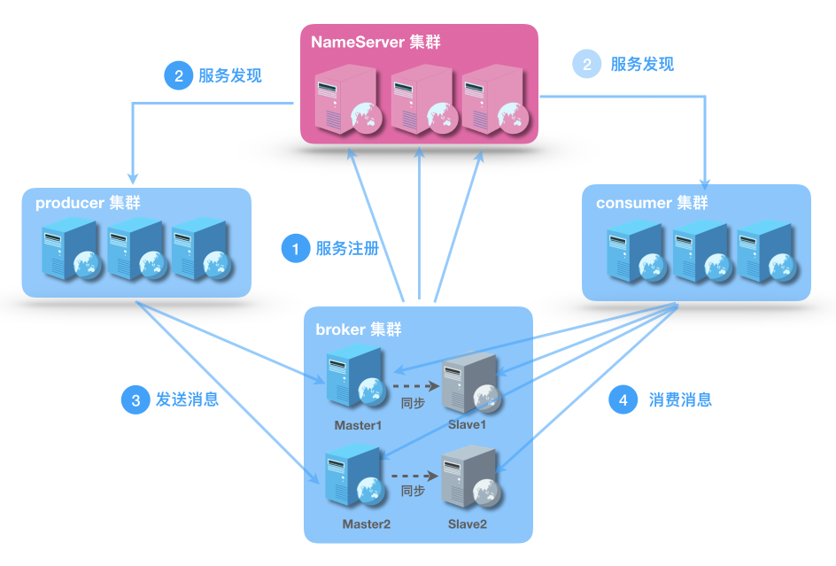


##### 多节点单副本集群

一个集群内全部部署 Master 角色，不部署Slave 副本，例如2个Master或者3个Master，这种模式的优缺点如下：

优点：配置简单，单个Master宕机或重启维护对应用无影响，在磁盘配置为RAID10时，即使机器宕机不可恢复情况下，由于RAID10磁盘非常可靠，消息也不会丢（异步刷盘丢失少量消息，同步刷盘一条不丢），性能最高；

缺点：单台机器宕机期间，这台机器上未被消费的消息在机器恢复之前不可订阅，消息实时性会受到影响。


##### 多节点（集群）多副本模式-异步复制

每个Master配置一个Slave，有多组 Master-Slave，HA采用异步复制方式，主备有短暂消息延迟（毫秒级），这种模式的优缺点如下：

优点：即使磁盘损坏，消息丢失的非常少，且消息实时性不会受影响，同时Master宕机后，消费者仍然可以从Slave消费，而且此过程对应用透明，不需要人工干预，性能同多Master模式几乎一样；

缺点：Master宕机，磁盘损坏情况下会丢失少量消息。


##### 多节点（集群）多副本模式-同步双写

每个Master配置一个Slave，有多对 Master-Slave，HA采用同步双写方式，即只有主备都写成功，才向应用返回成功，这种模式的优缺点如下：

优点：数据与服务都无单点故障，Master宕机情况下，消息无延迟，服务可用性与数据可用性都非常高；

缺点：性能比异步复制模式略低（大约低10%左右），发送单个消息的RT会略高，且目前版本在主节点宕机后，备机不能自动切换为主机。


> 原文: <https://www.yuque.com/tulingzhouyu/db22bv/avpxs3qirk1w4qod>