# 👍Java虚拟机8-11双版本 -JVM高频面试题👍


## 

# 类加载

## 1、类的生命周期
:::info
薪资范围：6-16K
难度：
:::
一个类完整的生命周期，会经历五个阶段，分别为：**加载、连接、初始化、使用**、和**卸载**。其中的连接又分为**验证、准备**和**解析**三个步骤。如下图所示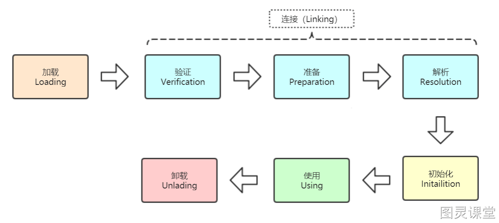


###### 加载（Loading）
简单一句话概括，类的加载阶段就是：**找到需要加载的类并把类的信息加载到jvm的方法区中，然后在堆区中实例化一个java.lang.Class对象，作为方法区中这个类的信息的入口**。结合jvm的内存结构会比较好理解。
这里要区别一下接触到的类加载。类加载其实包括加载、连接、初始化三个阶段。类加载强调一个jvm能够直接使用所需的类，所以类必须完成初始化。
不同的虚拟机对类的加载时机有不同的实现方式，具体要看虚拟机的实现方式。这里不做展开。
类的加载方式比较灵活，总结下来有如下几种：

1. 据类的全路径名找到相应的class文件，然后从class文件中读取文件内容；（常用）
2. 从jar文件中读取。另外，还有下面几种方式也比较常用：（常用）
3. 从网络中获取：比如10年前十分流行的Applet。
4. 根据一定的规则实时生成，比如设计模式中的动态代理模式，就是根据相应的类自动生成它的代理类。
5. 从非class文件中获取，其实这与直接从class文件中获取的方式本质

---


###### 连接（Linking）

1. **验证**：进行类的合法性校验。会对比如字节码格式、变量与方法的合法性、数据类型的有效性、继承与实现的规范性等等进行检查，确保被加载的类能够正常被jvm运行。
2. **准备**：为类的静态变量分配内存，并设为jvm默认的初值；对于非静态的变量，则不会为它们分配内存。简单说就是**分内存、赋初值**。注意：设置初始值为jvm默认初值，而不是程序设定。规则如下
   - 基本类型（int、long、short、char、byte、boolean、float、double）的默认值为0
   - 引用类型的默认值为null
   - 常量的默认值为我们程序中设定的值，比如我们在程序中定义final static int a = 100，则准备阶段中a的初值就是100。
3. **解析**：这一阶段的任务就是把常量池中的符号引用转换为直接引用。

---


###### 初始化(Initialization)
类初始化阶段是**类加载**过程的最后一步。而也是到了该阶段，才真正开始执行类中定义的java程序代码(字节码)，之前的动作都由虚拟机主导。
jvm对类的加载时机没有明确规范，但对类的初始化时机有：**只有当类被直接引用的时候，才会触发类的初始化。**类被直接引用的情况有以下几种：

1. 通过以下几种方式：
   - new关键字创建对象
   - 读取或设置类的静态变量
   - 调用类的静态方法
2. 通过反射方式执行1里面的三种方式；
3. 初始化子类的时候，会触发父类的初始化；
4. 作为程序入口直接运行时（调用main方法）；
5. 接口实现类初始化的时候，会触发直接或间接实现的所有接口的初始化。

关于类的初始化，记住两句话
1、类的初始化，会**自上而下运行**静态代码块或静态赋值语句，非静态与非赋值的静态语句均不执行。
2、如果存在父类，则父类先进行初始化，是一个典型的**递归**模型。
区别于**对象的初始化**，类的初始化所做的一起都是基于类变量或类语句的，也就是说执行的都是共性的抽象信息。而我们知道，类就是对象实例的抽象。

---


###### 使用（Using）
类的使用分为**直接引用**和**间接引用**。
直接引用与间接引用等判别条件，是看对该类的引用是否会引起类的初始化
直接引用已经在类的初始化中的有过阐述，不再赘述。而类的间接引用，主要有下面几种情况：

1. 当引用了一个类的静态变量，而该静态变量继承自父类的话，不引起初始化
2. 定义一个类的数组，不会引起该类的初始化；
3. 当引用一个类的的常量时，不会引起该类的初始化

---


###### 卸载（(Unloading）
当类使用完了之后，类就要进入卸载阶段了。那何为衡量类使用完的标准呢？

1. 该类所有的实例都已经被回收，也就是java堆中不存在该类的任何实例。
2. 加载该类的ClassLoader已经被回收。
3. 该类对应的java.lang.Class对象没有任何地方被引用，无法在任何地方通过反射访问该类的方法。

如果以上三个条件全部满足，jvm就会在方法区垃圾回收的时候对类进行卸载，类的卸载过程其实就是在方法区中清空类信息，java类的整个生命周期就结束了。
 

## 2、类加载器， JVM类加载机制
薪资范围：6-16K
难度：

## 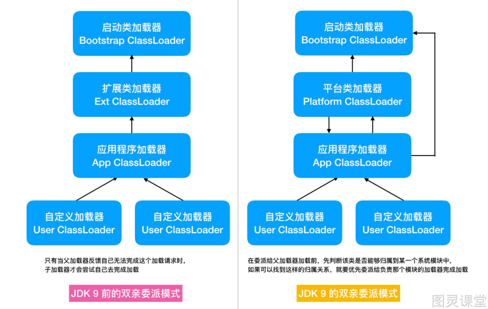
 上面的类加载过程主要是通过类加载器来实现的，Java里有如下几种类加载器

- 引导类加载器：负责加载支撑JVM运行的位于JRE的lib目录下的核心类库，比如rt.jar、charsets.jar等
- 扩展类加载器：负责加载支撑JVM运行的位于JRE的lib目录下的ext扩展目录中的JAR类包
- 应用程序类加载器：负责加载ClassPath路径下的类包，主要就是加载你自己写的那些类
- 自定义加载器：负责加载用户自定义路径下的类包

**JDK8以后废弃扩展类加载器（Extension ClassLoader）的原因**
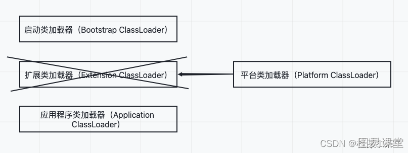
JDK8以后，使用平台类加载器（Platform ClassLoader）替换了原来的扩展类加载器（Extension ClassLoader）。有两个基本的原因归纳如下：

在JDK8中的这个Extension ClassLoader，主要用于加载jre环境下的lib下的ext下的jar包。当想要扩展Java的功能的时候，把jar包放到这个ext文件夹下。然而这样的做法并不安全，不提倡使用。
这种扩展机制被**JDK9开始加入的“模块化开发”**的天然的扩展能力所取代。
总之，扩展能力被取代了又不安全，所以被废弃。


## 3、能说一下JVM的内存区域吗？
> 薪资范围：6-16K
> 难度：

JVM内存区域最粗略的划分可以分为堆和栈，当然，按照虚拟机规范，可以划分为以下几个、区域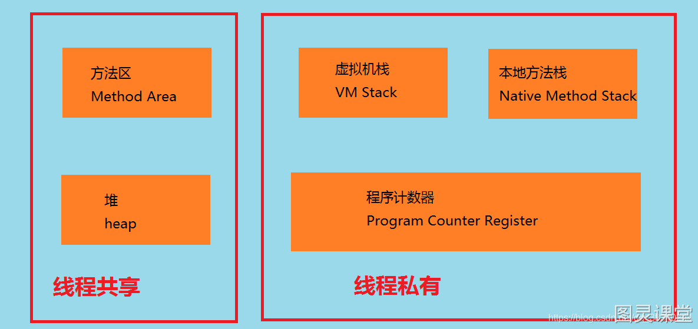
Java虚拟机运行时数据区
JVM内存分为线程私有区和线程共享区，其中方法区和堆是线程共享区，虚拟机栈、本地方法栈和程序计数器是线程隔离的数据区。
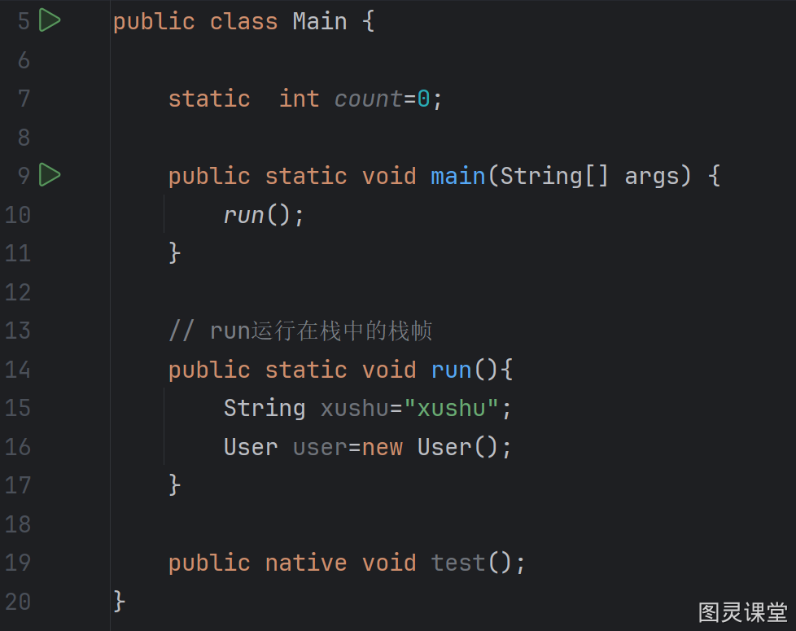
**1、程序计数器**
程序计数器（Program Counter Register）也被称为**PC寄存器**，是一块较小的内存空间。
它可以看作是**当前线程所执行的字节码的行号指示器**。
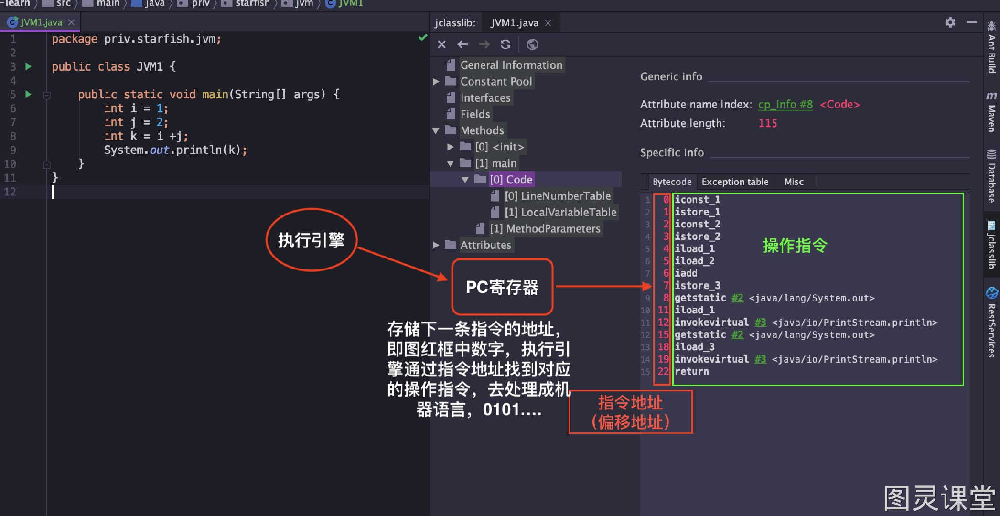
**2、Java虚拟机栈**
Java虚拟机栈（Java Virtual Machine Stack）**也是线程私有的，它的生命周期与线程相同**。
 
**作用**：主管 Java 程序的运行，它保存方法的**局部变量、部分结果，并参与方法的调用和返回**。
**特点**：

- 栈是一种快速有效的分配存储方式，访问速度仅次于程序计数器
- JVM 直接对虚拟机栈的操作只有两个：每个方法执行，伴随着**入栈**（进栈/压栈），方法执行结束**出栈**
- **栈不存在垃圾回收问题**

**栈中可能出现的异常**：
Java 虚拟机规范允许 **Java虚拟机栈的大小是动态的或者是固定不变的**

- 如果采用固定大小的 Java 虚拟机栈，那每个线程的 Java 虚拟机栈容量可以在线程创建的时候独立选定。如果线程请求分配的栈容量超过 Java 虚拟机栈允许的最大容量，Java 虚拟机将会抛出一个 **StackOverflowError** 异常
- 如果 Java 虚拟机栈可以动态扩展，并且在尝试扩展的时候无法申请到足够的内存，或者在创建新的线程时没有足够的内存去创建对应的虚拟机栈，那 Java 虚拟机将会抛出一个**OutOfMemoryError**异常

可以通过参数-Xss来设置线程的最大栈空间，栈的大小直接决定了函数调用的最大可达深度。 
**3、本地方法栈**

- Java 虚拟机栈用于管理 Java 方法的调用，而本地方法栈用于管理本地方法的调用
- 本地方法栈也是线程私有的
- 允许线程固定或者可动态扩展的内存大小
- 如果线程请求分配的栈容量超过本地方法栈允许的最大容量，Java 虚拟机将会抛出一个 StackOverflowError 异常
- 如果本地方法栈可以动态扩展，并且在尝试扩展的时候无法申请到足够的内存，或者在创建新的线程时没有足够的内存去创建对应的本地方法栈，那么 Java虚拟机将会抛出一个OutofMemoryError异常
- 本地方法是使用 C 语言实现的
- 它的具体做法是 Native Method Stack 中登记 native 方法，在 Execution Engine 执行时加载本地方法库当某个线程调用一个本地方法时，它就进入了一个全新的并且不再受虚拟机限制的世界。它和虚拟机拥有同样的权限。
- 本地方法可以通过本地方法接口来访问虚拟机内部的运行时数据区，它甚至可以直接使用本地处理器中的寄存器，直接从本地内存的堆中分配任意数量的内存
- 并不是所有 JVM 都支持本地方法。因为 Java 虚拟机规范并没有明确要求本地方法栈的使用语言、具体实现方式、数据结构等。如果 JVM 产品不打算支持 native 方法，也可以无需实现本地方法栈
- 在 Hotspot JVM 中，直接将本地方法栈和虚拟机栈合二为一 

**4、Java堆**
对于Java应用程序来说，Java堆（Java Heap）是虚拟机所管理的内存中最大的一块。Java堆是被所有线程共享的一块内存区域，在虚拟机启动时创建。此内存区域的唯一目的就是**存放对象实例**，Java里“**几乎**”所有的对象实例都在这里分配内存。
Java堆是垃圾收集器管理的内存区域，因此一些资料中它也被称作“GC堆”（Garbage Collected Heap，）。从回收内存的角度看，由于现代垃圾收集器大部分都是基于分代收集理论设计的，所以Java堆中经常会出现新生代、老年代、Eden空间、From Survivor空间、To Survivor空间等名词，需要注意的是这种划分只是根据垃圾回收机制来进行的划分，不是Java虚拟机规范本身制定的。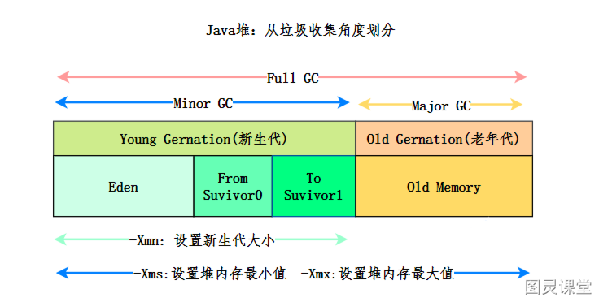
Java 堆内存结构
**5.方法区**

- 方法区（Method Area）与 Java 堆一样，是所有线程共享的内存区域。
- 虽然 Java 虚拟机规范把方法区描述为堆的一个逻辑部分，但是它却有一个别名叫 Non-Heap（非堆），目的应该是与 Java 堆区分开。
- **运行时常量池**（Runtime Constant Pool）是方法区的一部分。Class 文件中除了有类的版本/字段/方法/接口等描述信息外，还有一项信息是常量池（Constant Pool Table），用于存放编译期生成的各种字面量和符号引用，这部分内容将类在加载后进入方法区的运行时常量池中存放。运行期间也可能将新的常量放入池中，这种特性被开发人员利用得比较多的是 String.intern()方法。受方法区内存的限制，当常量池无法再申请到内存时会抛出 OutOfMemoryError 异常。
- 方法区的大小和堆空间一样，可以选择固定大小也可选择可扩展，方法区的大小决定了系统可以放多少个类，如果系统类太多，导致方法区溢出，虚拟机同样会抛出内存溢出错误
- JVM 关闭后方法区即被释放 


## 4、对象创建的过程了解吗？
:::info
薪资范围：6-16K
难度：
:::
在JVM中对象的创建，我们从一个new指令开始：

这个过程大概图示如下：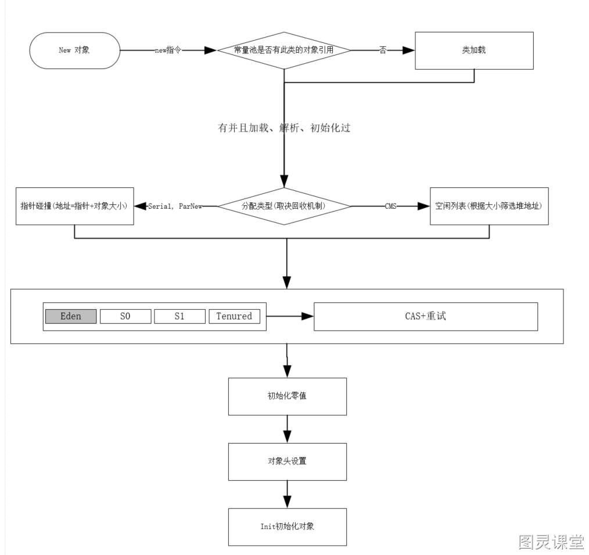

 虚拟机收到new指令触发。
类加载检查：如果类没有被类加载器加载，则执行类加载流程（将class信息加载到JVM的运行时数据区的过程），对象所需内存大小在类加载完后可以完全确定。
对象分配内存：从堆中划分出一块确定大小的内存。
内存空间初始化：内存分配完后，虚拟机需要将分配到的内存空间初始化为零值（如：int值为0，boolean值为false等），保证了对象的实例字段在Java代码中可以直接使用。
为对象进行必要的设置：虚拟机为对象进行设置，如设置对象属于哪个类的实例、如何找到类的元数据信息、对象的哈希码、对象的GC分代年龄等信息，这些信息存放在对象头中。
从虚拟机的角度来看，一个新的对象已经创建完毕。但从Java程序的角度来看，对象创建才刚开始，所有的字段还是零值，所以需要程序员进行初始化操作，这样一个真正可用的对象才算完全产生出来。
init是对对象级别的变量或非静态代码块进行初始化的
clinit静态变量或者静态代码块谁来初始化呢


## 5、对象内存分配方式	
:::info
薪资范围：6-16K
难度：
:::

虚拟机为新对象分配内存，从堆中划出一块确定大小的内存，因为对象所需内存的大小在类加载完后可以完全确定。

堆内存是否规整：
·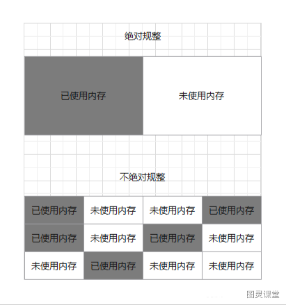


- 堆内存规整：已使用的内存在一边，未使用内存在另一边。
- 堆内存不规整：已使用内存和未使用相互交错。

堆内存是否规整是由垃圾收集器是否带有压缩整理功能决定的。

**内存分配方式：**

分配方式的选择 取决于 Java堆内存是否规整：

- 指针碰撞方式：
   - 堆内存绝对规整。
   - 分配过程：将已使用内存和为使用内存之间放一个分界点的指针，分配内存时，指针会向未使用内存方向移动，移动一段与对象大小相等的距离。

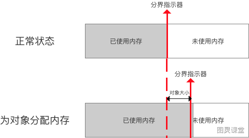

- 空闲列表：
   - 堆内存不规整。
   - 分配过程：虚拟机内部维护了一个记录可用内存块的列表，在分配时从列表找一块足够大的空间划分给对象实例，并更新列表上的记录。

Java堆是否规整 由所采用的垃圾收集器是否带有压缩整理功能决定


## 6、JVM 里 new 对象时，堆会发生抢占吗？JVM是怎么设计来保证线程安全的？
:::info
薪资范围：6-16K
难度：
:::
对象创建在虚拟机中是非常频繁的操作，即使仅仅修改一个指针所指向的位置，在并发情况下也会引起线程不安全。

**解决线程安全问题有两种方案：**
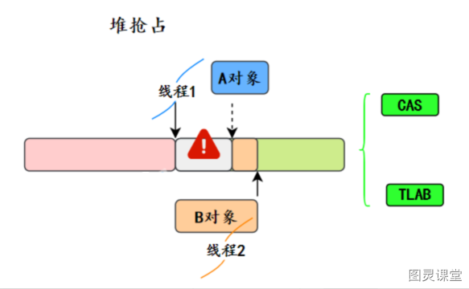

- 采用CAS分配重试的方式来保证更新操作的原子性
- 每个线程在Java堆中预先分配一小块内存，也就是本地线程分配缓冲（Thread Local AllocationBuffer，TLAB），要分配内存的线程，先在本地缓冲区中分配，只有本地缓冲区用完了，分配新的缓存区时才需要同步锁定。-XX:+UseTLAB

> 虚拟机1.8默认使用的是 TLAB 方式来进行内存分配的，如果想要使用CAS方式，可以通过设置 -XX：-UseTLAB 参数来关闭TLAB功能即可。默认情况下，TLAB 空间的内存非常小，仅占有整个 Eden 空间的 1%，我们可以通过 -XX:TLABWasteTargetPercent 设置 TLAB 空间所占用 Eden 空间的百分比大小。如果通过TLAB分配失败的时候，则会回到Eden区通过 CAS 方式进行分配。


## 7、对象的内存布局
:::info
薪资范围：6-20K
难度：
:::

在Java虚拟机（HotSpot）中，对象在 Java 内存中的 存储布局 可分为三块：

1. 对象头 存储区域
2. 实例数据 存储区域
3. 对齐填充 存储区域

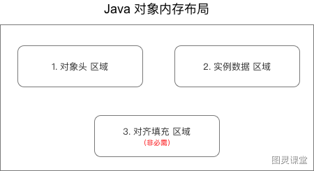

**对象头区域：**
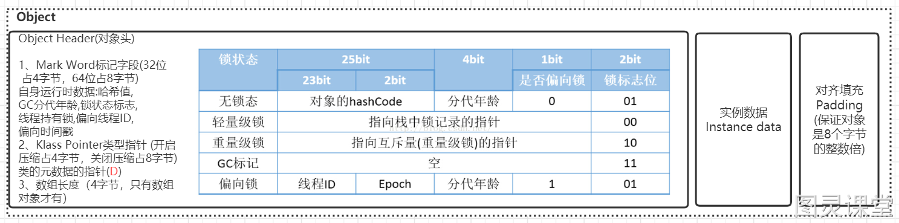
存储对象自身的运行时数据，如：哈希码、GC分代年龄、锁状态标志、线程持有的锁、偏向线程ID、偏向时间戳。
存储对象类型指针，即对象指向类元数据的指针，JVM可以确定这个对象属于哪个类的实例。
如果是数组，对象头中还有一块记录数组长度的数据。
**实例数据区域：**

- 代码中定义的字段内容。

**对齐填充区域：**

- 占位符。
- 非必须。

说明：占位符起占位作用，因为对象的大小必须是8字节的整数倍，而因HotSpot VM的要求对象起始地址必须是8字节的整数倍，且对象头部分正好是8字节的倍数。因此，当对象实例数据部分没有对齐时（即对象的大小不是8字节的整数倍），就需要通过对齐填充来补全。
 


## 8.内存泄漏可能由哪些原因导致呢？
:::info
薪资范围：10-20K
难度：
:::
内存泄漏可能的原因有很多种：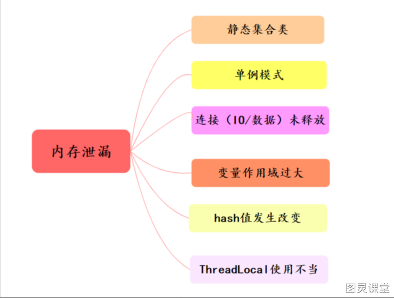
内存泄漏可能原因
**静态集合类引起内存泄漏**
静态集合的生命周期和 JVM 一致，所以静态集合引用的对象不能被释放。
```java
public class OOM {
    static List list = new ArrayList();

    public void oomTests(){
        Object obj = new Object();

        list.add(obj);
    }
}
```
**单例模式**
和上面的例子原理类似，单例对象在初始化后会以静态变量的方式在 JVM 的整个生命周期中存在。如果单例对象持有外部的引用，那么这个外部对象将不能被 GC 回收，导致内存泄漏。
**数据连接、IO、Socket等连接**
创建的连接不再使用时，需要调用 **close** 方法关闭连接，只有连接被关闭后，GC 才会回收对应的对象（Connection，Statement，ResultSet，Session）。忘记关闭这些资源会导致持续占有内存，无法被 GC 回收。
```
try {
            Connection conn = null;
            Class.forName("com.mysql.jdbc.Driver");
            conn = DriverManager.getConnection("url", "", "");
            Statement stmt = conn.createStatement();
            ResultSet rs = stmt.executeQuery("....");
          } catch (Exception e) { 
           
          }finally {
            //不关闭连接
          }
        }
```
**变量不合理的作用域**
一个变量的定义作用域大于其使用范围，很可能存在内存泄漏；或不再使用对象没有及时将对象设置为 null，很可能导致内存泄漏的发生。
```
public class Simple {
    Object object;
    public void method1(){
        object = new Object();
        //...其他代码
        //由于作用域原因，method1执行完成之后，object 对象所分配的内存不会马上释放
        object = null;
    }
}
```
**hash值发生变化**
对象Hash值改变，使用HashMap、HashSet等容器中时候，由于对象修改之后的Hah值和存储进容器时的Hash值不同，所以无法找到存入的对象，自然也无法单独删除了，这也会造成内存泄漏。说句题外话，这也是为什么String类型被设置成了不可变类型。
**ThreadLocal使用不当**
ThreadLocal的弱引用导致内存泄漏也是个老生常谈的话题了，使用完ThreadLocal一定要记得使用remove方法来进行清除。


## 9.如何判断对象仍然存活？
:::info
薪资范围：8-28K
难度：
:::
**1、reference count（引用计数）**
查看是否有引用指向该对象，有则说明该对象不是垃圾，反之就是垃圾。
我们通过下图的引用对象案例来说明。
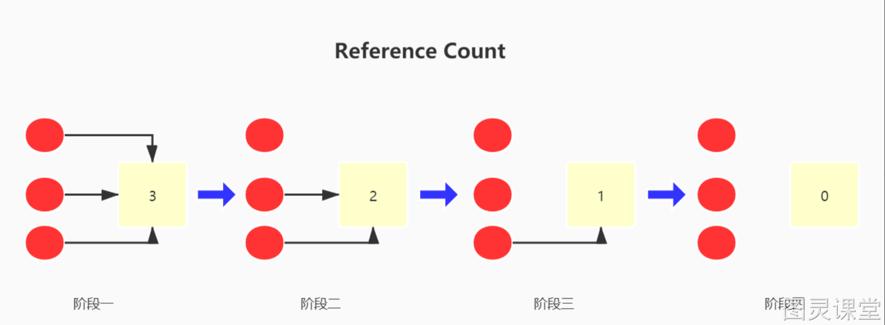
在这里插入图片描述
如上图所示，我们可以看到一共是存在四个阶段。

- 第一阶段，有 3 个引用指向该对象，那该对象肯定不是垃圾。
- 第二三阶段，部分引用消失，分别各有 2 个和 3 个引用指向该对象，那该对象仍然不是垃圾。
- 第四阶段，没有任何引用再指向该对象，该对象沦为垃圾。这时垃圾回收器就可以将其回收。

1.2、reference count（引用计数）存在的问题
当出现循环引用时，如下图所示：


我们可以看到，三个对象各自指向循环中的另一个对象，但是没有其他引用指向这三个对象，那这三个对象就属于“**一堆垃圾**”。
那现在我们上面所说的引用计数就不能解决这个该问题，这时我们就需要使用另外一种定位方式——**Root Searching（根可达算法或根搜索算法）**。
**2、Root Searching（根可达算法或根搜索算法）**
**所谓的“根”即是**：所有的程序都是从 main 方法来运行，在 main 方法里面 new 出来的对象即为根对象。
**例如**：在 main 方法里面我们 new 了一个 list 集合，在 list 集合中我们又可以存放若干其他对象，那我们就称 list 为根对象，我们顺着根的数据结构往下走，只要存在引用指向的对象，那该对象就不是垃圾，反之不存在引用的对象，那该对象就是垃圾。
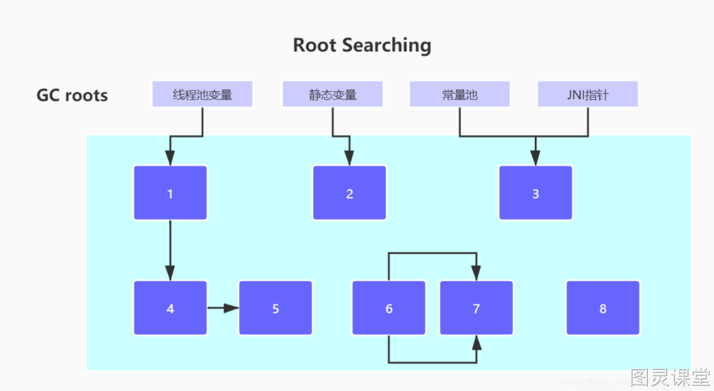
在这里插入图片描述
如上图所示，对象一、二、三、四、五均是存在根对象的引用，对象五、六之间是我们上面所提到的循环引用，对象八不存在引用，故对象六、七、八是垃圾。
**根对象（root）的类型**
根对象不仅仅包括我们上面所说的 main 方法里面的对象，属于根对象的还有以下这些：
可以作为GC Roots的主要有四种对象：

- 虚拟机栈(栈帧中的本地变量表)中引用的对象
   - 比如:各个线程被调用的方法中使用到的参数、局部变量等（局部变量表）。	
- 方法区中类静态属性引用的对象
   - 比如: Java类的引用类型静态变量
- 方法区中常量引用的对象
   - 比如:字符串常量池(String Table)里的引用
- 所有被同步锁synchroni zed持有的对象

...


## 10.垃圾收集算法了解吗？
:::info
薪资范围：12-30K
难度：
:::
垃圾收集算法主要有三种：

1. **标记-清除算法**

见名知义，标记-清除（Mark-Sweep）算法分为两个阶段：

- **标记** : 标记出所有需要回收的对象
- **清除**：回收所有被标记的对象


标记-清除算法
标记-清除算法比较基础，但是主要存在两个缺点：

- 执行效率不稳定，如果Java堆中包含大量对象，而且其中大部分是需要被回收的，这时必须进行大量标记和清除的动作，导致标记和清除两个过程的执行效率都随对象数量增长而降低。
- 内存空间的碎片化问题，标记、清除之后会产生大量不连续的内存碎片，空间碎片太多可能会导致当以后在程序运行过程中需要分配较大对象时无法找到足够的连续内存而不得不提前触发另一次垃圾收集动作。
2. **标记-复制算法**

标记-复制算法解决了标记-清除算法面对大量可回收对象时执行效率低的问题。
过程也比较简单：将可用内存按容量划分为大小相等的两块，每次只使用其中的一块。当这一块的内存用完了，就将还存活着的对象复制到另外一块上面，然后再把已使用过的内存空间一次清理掉。
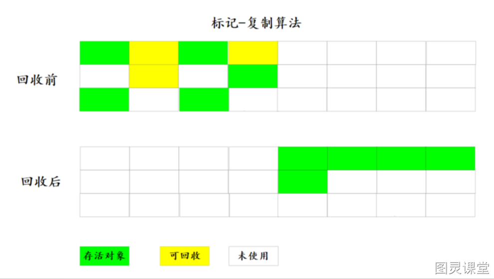
标记-复制算法
这种算法存在一个明显的缺点：一部分空间没有使用，存在空间的浪费。
新生代垃圾收集主要采用这种算法，因为新生代的存活对象比较少，每次复制的只是少量的存活对象。当然，实际新生代的收集不是按照这个比例。

3. **标记-整理算法**

为了降低内存的消耗，引入一种针对性的算法：标记-整理（Mark-Compact）算法。
其中的标记过程仍然与“标记-清除”算法一样，但后续步骤不是直接对可回收对象进行清理，而是让所有存活的对象都向内存空间一端移动，然后直接清理掉边界以外的内存。
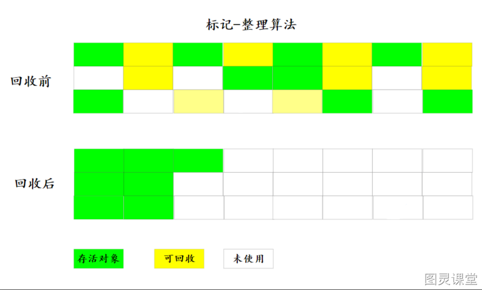
标记-整理算法
标记-整理算法主要用于老年代，移动存活对象是个极为负重的操作，而且这种操作需要Stop The World才能进行，只是从整体的吞吐量来考量，老年代使用标记-整理算法更加合适。


## 11 三色标记算法了解吗
:::info
薪资范围：12-35K
难度：
:::
三色标记算法:
1.用于垃圾回收器升级，将STW变为并发标记。STW就是在标记垃圾的时候，必须暂停程序，而使用并发标记，就是程序一边运行，一边标记垃圾。

2. 避免重复扫描对象，提升标记阶段的效率

 
** 什么是三色：**
首先我们需要知道**三色标记法就是根据可达性分析**，**从GC Roots开始进行遍历访问**，在遍历对象过程中，按“是否检查过”这个条件将对象标记成三种颜色：
**白色**：该对象没有被标记过。（对象垃圾）
**灰色**：该对象已经被标记过了，但该对象下的属性没有全被标记完。（GC需要从此对象中去寻找垃圾）
**黑色**：该对象已经被标记过了，且该对象下的属性也全部都被标记过了。（程序所需要的对象）
2.2.三色标记过程：
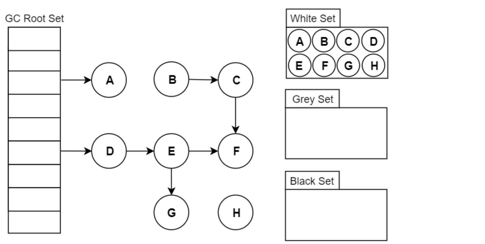
假设现在有白、灰、黑三个集合（表示当前对象的颜色），其遍历访问过程为：
初始时，所有对象都在【白色集合】中；
将 GC Roots直接引用到的对象挪到【灰色集合】中；
从灰色集合中获取对象：
3.1. 将本对象引用到的其他对象全部挪到【灰色集合】中； 
3.2. 将本对象挪到【黑色集合】里面。
重复步骤3，直至【灰色集合】为空时结束。
结束后，仍在【白色集合】的对象即为GC Roots不可达，可以进行回收。
> 需要注意，传统标记方式发生Stop The World时，对象间的引用是不会发生变化的，可以轻松完成标记。
> 而并发标记在标记期间应用线程还在继续跑，对象间的引用可能发生变化，就会出现错标和漏标的情况就有可能发生。

**3.存在的问题**
**浮动垃圾**：并发标记的过程中，若一个已经被标记成黑色或者灰色的对象，突然变成了垃圾，由于不会再对黑色标记过的对象重新扫描,所以不会被发现，那么这个对象不是白色的但是不会被清除，重新标记也不能从GC Root中去找到，所以成为了浮动垃圾，**浮动垃圾对系统的影响不大，留给下一次GC进行处理即可**。


- **对象漏标问题**（需要的对象被回收）：并发标记的过程中，一个业务线程将一个未被扫描过的白色对象断开引用成为垃圾（删除引用），同时黑色对象引用了该对象（增加引用）（这两部可以不分先后顺序）；因为黑色对象的含义为其属性都已经被标记过了，重新标记也不会从黑色对象中去找，导致该对象被程序所需要，却又要被GC回收，此问题会导致系统出现问题，而CMS与G1，两种回收器在使用三色标记法时，都采取了一些措施来应对这些问题，**CMS对增加引用环节进行处理（Increment Update），G1则对删除引用环节进行处理(SATB)。**

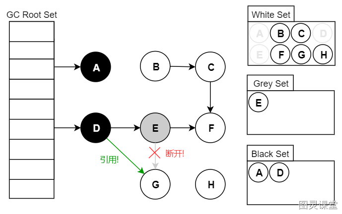
4.总结
三色标记算法是根可达算法的一种实现方案，其目的是为了找出所有可达对象。三色标记算法会产生多标和漏标问题，其中漏标问题最严重。漏标问题会导致本该存活的对象被回收，从而导致严重的程序问题。

### 
 

## 12.能详细说一下CMS收集器的垃圾收集过程吗？
:::info
薪资范围：12-35K
难度：
:::
CMS收集齐的垃圾收集分为四步：

- **初始标记**（CMS initial mark）：单线程运行，需要Stop The World，标记GC Roots能直达的对象。	
- **并发标记**（（CMS concurrent mark）：无停顿，和用户线程同时运行，从GC Roots直达对象开始遍历整个对象图。
- **重新标记**（CMS remark）：多线程运行，需要Stop The World，标记并发标记阶段产生对象。
- **并发清除**（CMS concurrent sweep）：无停顿，和用户线程同时运行，清理掉标记阶段标记的死亡的对象。

Concurrent Mark Sweep收集器运行示意图如下：
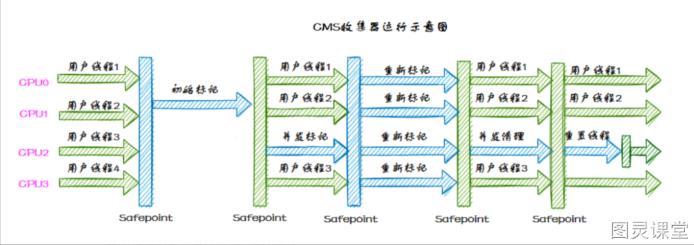
Concurrent Mark Sweep收集器运行示意图

## 13.G1垃圾收集器了解吗？

:::info
薪资范围：12-35K
难度：
:::

Garbage First（简称G1）收集器是垃圾收集器的一个颠覆性的产物，它开创了局部收集的设计思路和基于Region的内存布局形式。
虽然G1也仍是遵循分代收集理论设计的，但其堆内存的布局与其他收集器有非常明显的差异。以前的收集器分代是划分新生代、老年代、持久代等。
**G1把连续的Java堆划分为多个大小相等的独立区域（Region）**，每一个Region都可以根据需要，扮演新生代的Eden空间、Survivor空间，或者老年代空间。收集器能够对扮演不同角色的Region采用不同的策略去处理。
**更精细的控制、可预测的停顿时间、内存碎片的控制、优先级处理**
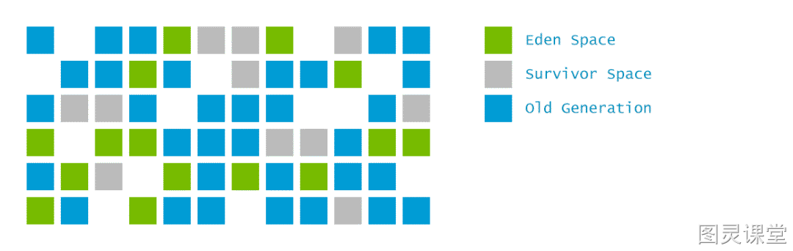
G1 Heap Regions
每个 Region 都是通过指针碰撞来分配空间
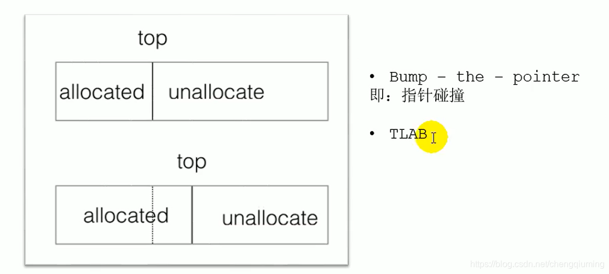
这样就避免了收集整个堆，而是按照若干个Region集进行收集，同时维护一个优先级列表，跟踪各个Region回收的“价值，优先收集价值高的Region。
G1收集器的运行过程大致可划分为以下四个步骤：

- **初始标记**（initial mark），标记了从GC Root开始直接关联可达的对象。STW（Stop the World）执行。
- **并发标记**（concurrent marking），和用户线程并发执行，从GC Root开始对堆中对象进行可达性分析，递归扫描整个堆里的对象图，找出要回收的对象、
- **最终标记**（Remark），STW，标记再并发标记过程中产生的垃圾。= 重新标记（标记的范围更小）
- **筛选回收**（Live Data Counting And Evacuation），制定回收计划，选择多个Region 构成回收集，把回收集中Region的存活对象复制到空的Region中，再清理掉整个旧 Region的全部空间。需要STW。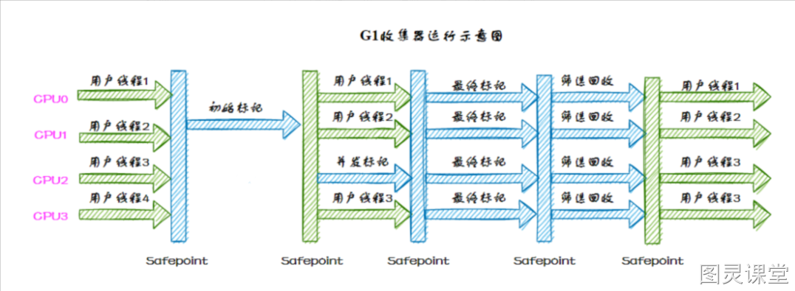

G1收集器运行示意图

## 14.有了CMS，为什么还要引入G1？
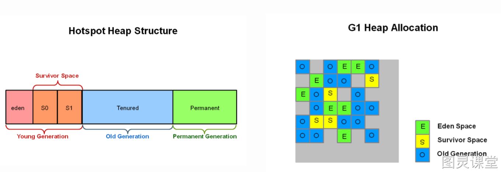
优点：CMS最主要的优点在名字上已经体现出来——并发收集、低停顿。
缺点：CMS同样有三个明显的缺点。

- Mark Sweep算法会导致内存碎片比较多
- CMS的并发能力比较依赖于CPU资源，并发回收时垃圾收集线程可能会抢占用户线程的资源，导致用户程序性能下降。
- 并发清除阶段，用户线程依然在运行，会产生所谓的理“浮动垃圾”（Floating Garbage），本次垃圾收集无法处理浮动垃圾，必须到下一次垃圾收集才能处理。如果浮动垃圾太多，会触发新的垃圾回收，导致性能降低。

G1主要解决了内存碎片过多的问题。

## 15.你们线上用的什么垃圾收集器？为什么要用它？
:::info
薪资范围：15-35K
难度：
:::
**常见的垃圾回收器:**
**新生代收集器(高吞吐量)：** Serial、ParNew、Parallel Scavenge
**老年代收集器（SWT停顿时间）：** Serial Old、CMS、Parallel Old
**新生代和老年代收集器：** G1、ZGC、Shenandoah
每种垃圾回收器之间不是独立操作的，下图表示垃圾回收器之间有连线表示，可以协作使用：
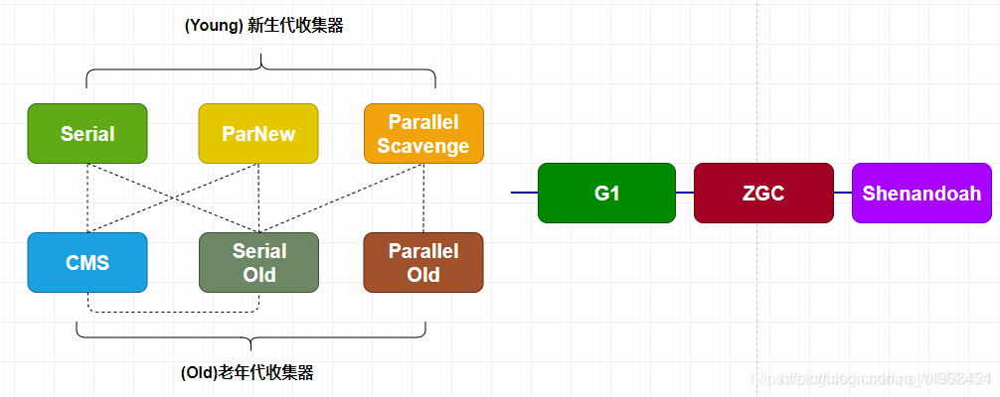
一般的[垃圾回收器](https://so.csdn.net/so/search?q=%E5%9E%83%E5%9C%BE%E5%9B%9E%E6%94%B6%E5%99%A8&spm=1001.2101.3001.7020)搭配为：

- Serial New（复制算法。单线程，不能利用多核） + Serial Old（标记整理。单线程） (Serial系列是单线程，GC时stop the world)  **JDK 5 版本之前**

**JDK8 ：**

- ParNew（复制算法。并行。 单核情况下不如Serial） + CMS（标记清除。并发） 
   - **适合类型**：适用于需要低停顿时间的应用，如 Web 服务器、应用服务器。
   - **示例应用**：电商网站、在线游戏、高并发服务器。
   - **4-8G可以用ParNew+CMS**
- Parallel Scavenge（复制算法。并行，吞吐量优先收集器） + Parallel Old（标记整理。并行）
   - **适合类型**：适用于多核处理器的高吞吐量应用。
   - **示例应用**：科学计算、数据分析、大规模数据处理。
   - **4G以下可以用parallel **
- G1 （年轻代：复制 老年代：标记-整理）**JDK 9 默认的收集器 **要求尽可能可控 GC 停顿时间；内存占用较大的应用。
   - **适合类型**：适用于需要可预测停顿时间的应用，尤其是大堆内存的应用。
   - **示例应用**：企业级应用、中大规模 Web 服务、应用响应时间要求高的系统。
   - **8G以上可以用G1**

zgc:适用于需要极低停顿时间（毫秒级别）的大内存应用

   - **适合类型**：适用于需要极低停顿时间（毫秒级别）的大内存应用。
   - **示例应用**：内存密集型数据库、金融交易系统、云服务。
   - **几百G以上用ZGC **

   

怎么查默认用的GC是什么呢？
可以使用命令：
```
java -XX:+PrintCommandLineFlags -version
```
可以看到有这么一行：
```
-XX:+UseParallelGC
```
UseParallelGC = Parallel Scavenge + Parallel Old，表示的是新生代用的Parallel Scavenge收集器，老年代用的是Parallel Old 收集器。
那为什么要用这个呢？默认的呗。
当然面试肯定不能这么答。
Parallel Scavenge的特点是什么？
高吞吐，我们可以回答：因为我们系统是业务相对复杂，但并发并不是非常高，所以希望尽可能的利用处理器资源，出于提高吞吐量的考虑采用Parallel Scavenge + Parallel Old的组合。
当然，这个默认虽然也有说法，但不太讨喜。
还可以说：
采用Parallel New+CMS的组合，我们比较关注服务的响应速度，所以采用了CMS来降低停顿时间。
或者一步到位：
我们线上采用了设计比较优秀的G1垃圾收集器，因为它不仅满足我们低停顿的要求，而且解决了CMS的浮动垃圾问题、内存碎片问题。

## 16.垃圾收集器应该如何选择？
垃圾收集器的选择需要权衡的点还是比较多的——例如运行应用的基础设施如何？使用JDK的发行商是什么？等等……
这里简单地列一下上面提到的一些收集器的适用场景：

- Serial ：如果应用程序有一个很小的内存空间（大约100 MB）亦或它在没有停顿时间要求的单线程处理器上运行。
- Parallel：如果优先考虑应用程序的峰值性能，并且没有时间要求要求，或者可以接受1秒或更长的停顿时间。
- CMS/G1：如果响应时间比吞吐量优先级高，或者垃圾收集暂停必须保持在大约1秒以内。
- ZGC：如果响应时间是高优先级的，或者堆空间比较大。

## 17.对象一定分配在堆中吗？有没有了解逃逸分析技术？
:::info
薪资范围：10-25K
难度：
:::

**对象一定分配在堆中吗？** 不一定的。
随着JIT编译期的发展与逃逸分析技术逐渐成熟，所有的对象都分配到堆上也渐渐变得不那么“绝对”了。其实，在编译期间，JIT会对代码做很多优化。其中有一部分优化的目的就是减少内存堆分配压力，其中一种重要的技术叫做逃逸分析。
**什么是逃逸分析？**
**逃逸分析**是指分析指针动态范围的方法，它同编译器优化原理的指针分析和外形分析相关联。当变量（或者对象）在方法中分配后，其指针有可能被返回或者被全局引用，这样就会被其他方法或者线程所引用，这种现象称作指针（或者引用）的逃逸(Escape)。
通俗点讲，当一个对象被new出来之后，它可能被外部所调用，如果是作为参数传递到外部了，就称之为方法逃逸。-xx: -DoEscapeAnalysis 
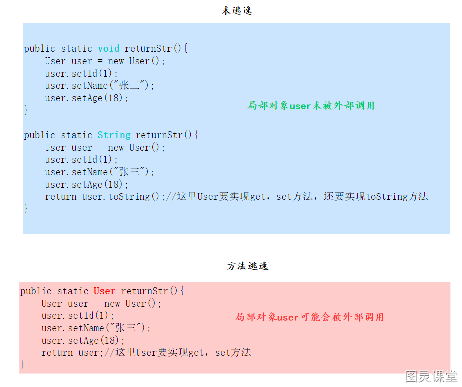
逃逸
除此之外，如果对象还有可能被外部线程访问到，例如赋值给可以在其它线程中访问的实例变量，这种就被称为线程逃逸。
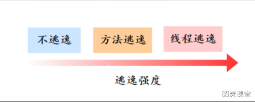
逃逸强度
**逃逸分析的好处**

- 栈上分配

如果确定一个对象不会逃逸到线程之外，那么久可以考虑将这个对象在栈上分配，对象占用的内存随着栈帧出栈而销毁，这样一来，垃圾收集的压力就降低很多。

- **同步消除**

线程同步本身是一个相对耗时的过程，如果逃逸分析能够确定一个变量不会逃逸出线程，无法被其他线程访问，那么这个变量的读写肯定就不会有竞争， 对这个变量实施的同步措施也就可以安全地消除掉。

- **标量替换**

如果一个数据是基本数据类型，不可拆分，它就被称之为标量。把一个Java对象拆散，将其用到的成员变量恢复为原始类型来访问，这个过程就称为标量替换。假如逃逸分析能够证明一个对象不会被方法外部访问，并且这个对象可以被拆散，那么可以不创建对象，直接用创建若干个成员变量代替，可以让对象的成员变量在栈上分配和读写。


## 18.了解哪些性JVM监控和故障处理工具？
:::info
薪资范围：10-25K
难度：
:::
以下是一些JDK自带的可视化性能监控和故障处理工具：

- JConsole

Jconsole 是一个**内置 Java 性能分析器**，是基于Java Management Extensions (JMX)的实时图形化监测工具，这个工具利用了内建到JVM里面的JMX指令来对Java进程提供实时的性能和资源的监控。其监控内容包括：内存、线程、类、CPU使用(Java进程的内存使用，线程的状态，类的使用)等。通过监控信息，可以很清晰的了解到**当前程序是否运行正常，如内存泄露、死锁、类加载异常等**。

备注:Jconsole管理内存**相当于可视化的jstat命令**
 
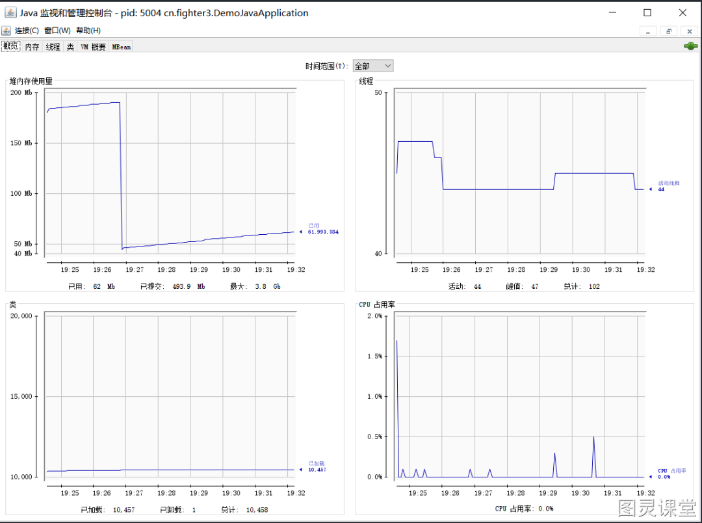
JConsole概览

开启远程：
java -jar  xxx.jar

- -Dcom.sun.management.jmxremote 远程开启开关
- -Dcom.sun.management.jmxremote.port=1808 jmx远程调用端口
- -Dcom.sun.management.jmxremote.authenticate=false 不开启验证
- -Dcom.sun.management.jmxremote.ssl=false 不为ssl连接
- -Djava.rmi.server.hostname=34.126.141.21 服务器所在ip或者域名

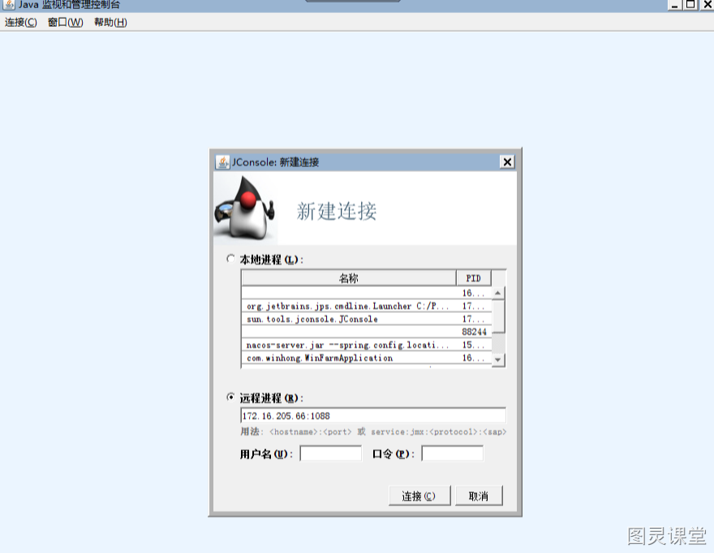

- VisualVM（jvisualvm）	

VisualVM 是一款免费的，集成了多个 JDK 命令行工具的可视化工具，它能为您提供强大的分析能力，对 **Java 应用程序做性能分析和调优**。这些功能包括生成和**分析海量数据、跟踪内存泄漏、监控垃圾回收器、执行内存和 CPU 分析** .
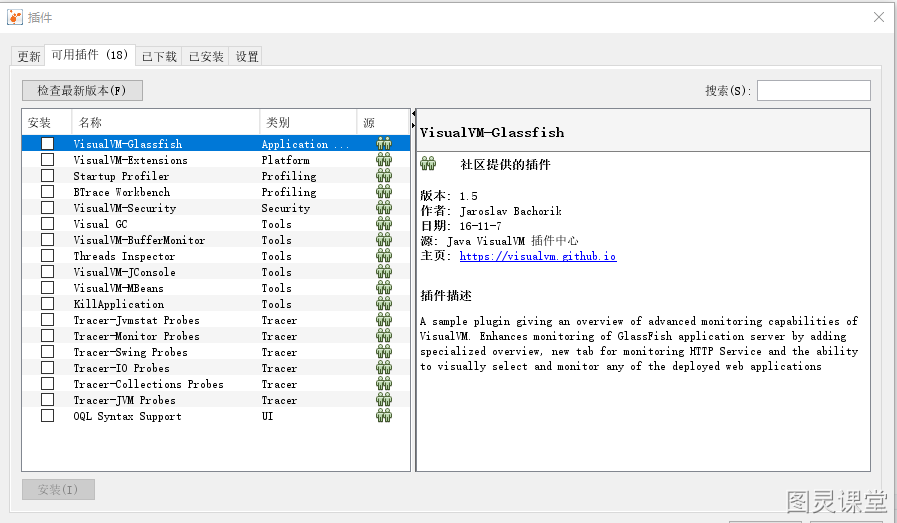
JMC主要界面

- **jps **
   - 查看java进程
- **jstat **
   - jstat是用于监视虚拟机各种运行状态信息的命令行工具。它可以显示本地或者远程虚拟机进程中的类装载、内存、垃圾收集、JIT 编译等运行数据，在没有 GUI图形界面，只提供了纯文本控制台环境的服务器上，它将是运行期定位虚拟机性能问题的首选工具。常用形式： 
   - jstat [-命令选项] [vmid] [间隔时间/毫秒] [查询次数]
   - 如：jstat-gc 13616 100 8；
   - 常用参数：
      - -class (类加载器)
      - 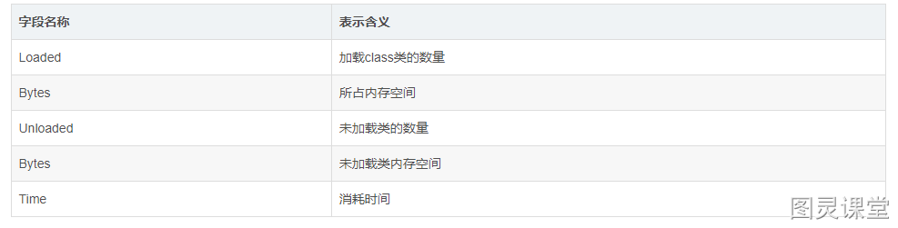
      - -compiler (JIT)
      - -gc (GC 堆状态)
      - 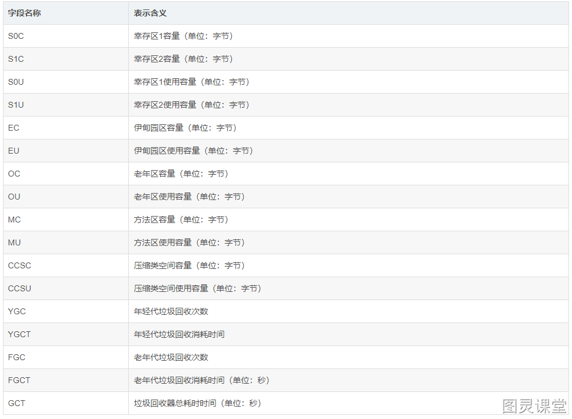
      - -gccapacity (各区大小)
      - 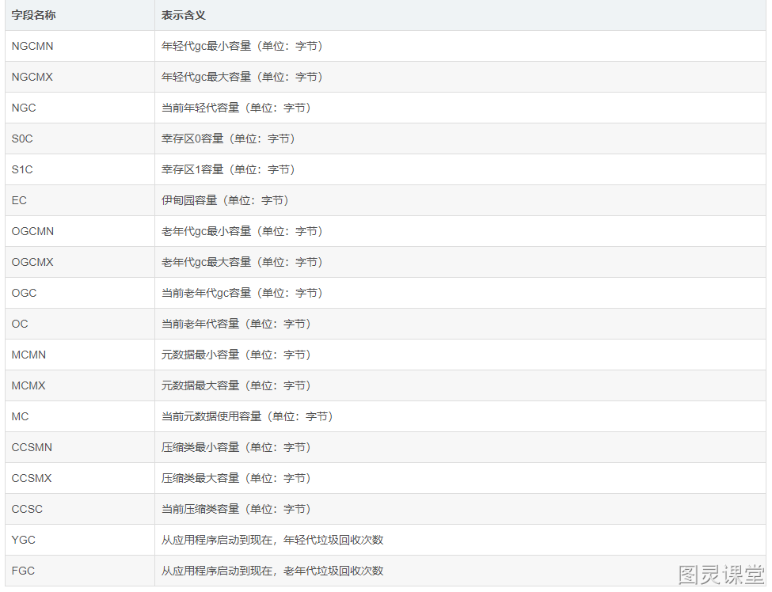
      - -gccause (最近一次 GC 统计和原因)
      - 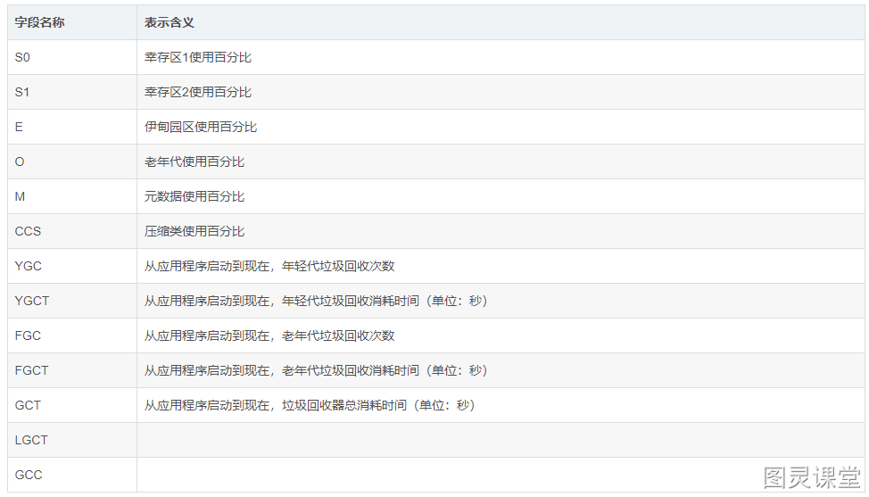
      - -gcnew (新区统计)
      - 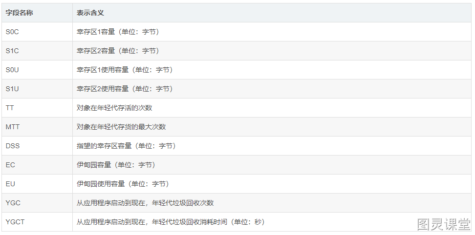
      - -gcnewcapacity (新区大小)
      - -gcold (老区统计)
      - -gcoldcapacity (老区大小)
      - -gcpermcapacity (永久区大小)
      - -gcutil (GC 统计汇总)
      - -printcompilation (HotSpot 编译统计)

- **jmap**
   - jmap用于生成堆转储快照（一般称为 heapdump 或 dump 文件）。jmap 的作用并不仅仅是为了获取 dump 文件，它还可以查询 finalize 执行队列、Java 堆和永久代的详细信息，如空间使用率、当前用的是哪种收集器等。
      - heap : 显示Java堆详细信息
      - histo : 显示堆中对象的统计信息
      - permstat :Java堆内存的永久保存区域的类加载器的统计信息
      - finalizerinfo : 显示在F-Queue队列等待Finalizer线程执行 finalizer方法的对象
      - dump : 生成堆转储快照
```
jmap -dump:file=d:\user.hprof 1246
```

- **jhat**
   - jhat dump 文件名**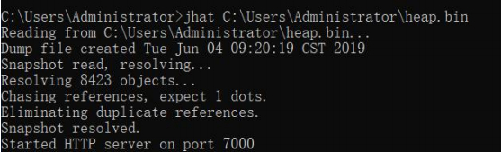**后屏幕显示“Server is ready.”的提示后，用户在浏览器中键入 http://localhost:7000/就可以访问详情。
- **jstack**

jstack [vmid]
jstack用于生成虚拟机当前时刻的线程快照。
线程快照就是当前虚拟机内每一条线程正在执行的方法堆栈的集合，生成线程快照的主要目的是定位线程出现长时间停顿的原因，如线程间死锁、死循环、请求外部资源导致的长时间等待等都是导致线程长时间停顿的常见原因。
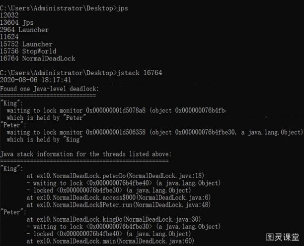
一般来说 jstack 主要是用来排查是否有死锁和某个进程的线程调用栈的情况

除此之外，还有一些第三方的工具：

- **MAT**Java 堆内存分析工具。
- 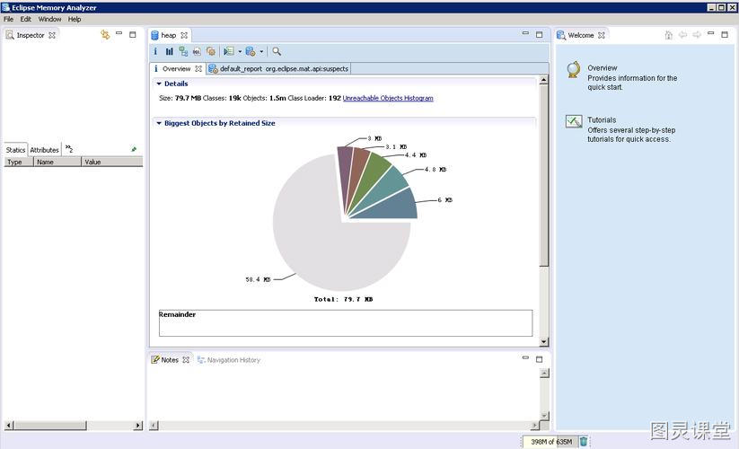
- **GChisto**GC 日志分析工具。
- 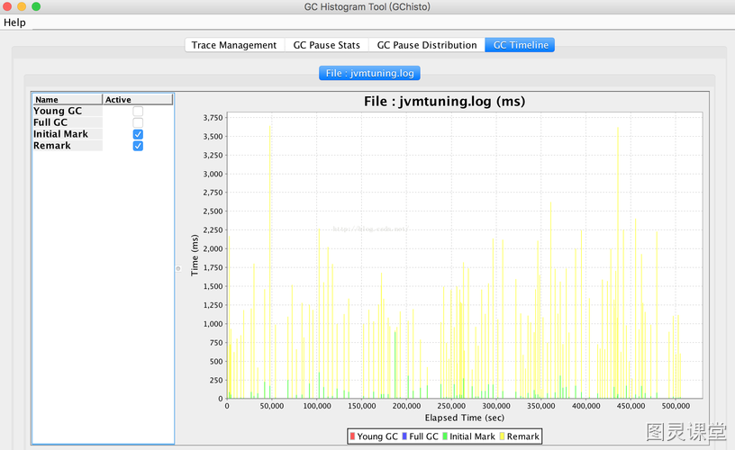
- **GCViewer   **GC 日志分析工具。
- 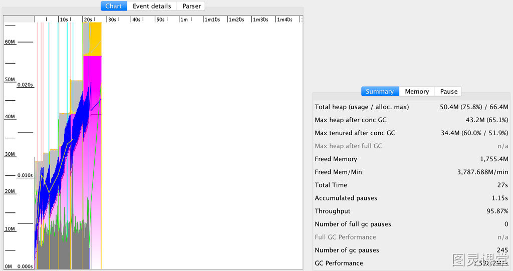
- **JProfiler**商用的性能分析利器。
- 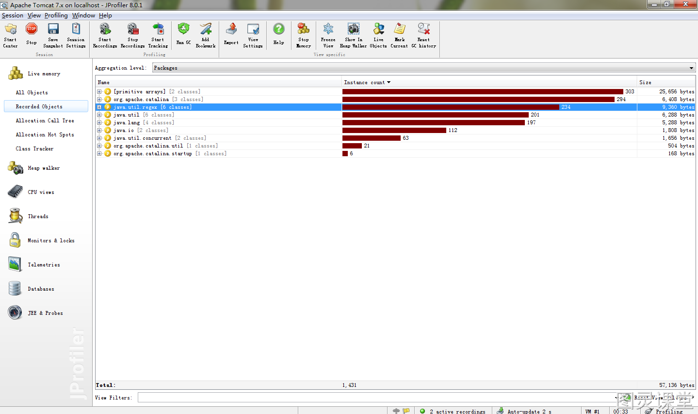
- **arthas**阿里开源诊断工具。
- 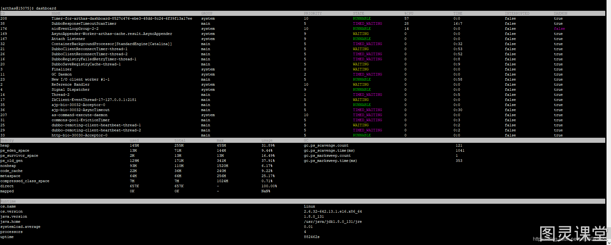
- **async-profiler**Java 应用性能分析工具，开源、火焰图、跨平台。


## 19.JVM的常见参数配置知道哪些？
一些常见的参数配置：
**堆配置：**

- -Xms:初始堆大小
- -Xms：最大堆大小
- -XX:NewSize=n:设置年轻代大小
- -XX:NewRatio=n:设置年轻代和年老代的比值。如：为3表示年轻代和年老代比值为1：3，年轻代占整个年轻代年老代和的1/4
- -XX:SurvivorRatio=n:年轻代中Eden区与两个Survivor区的比值。注意Survivor区有两个。如3表示Eden：3 Survivor：2，一个Survivor区占整个年轻代的1/5
- -XX:MaxPermSize=n:设置持久代大小

**gc设置：**

- -XX:+UseSerialGC:设置串行收集器
- -XX:+UseParallelGC:设置并行收集器
- -XX:+UseParalledlOldGC:设置并行年老代收集器
- -XX:+UseConcMarkSweepGC:设置并发收集器
-  -XX:+UseG1GC

**并行收集器设置**

- -XX:ParallelGCThreads=n:设置并行收集器收集时使用的CPU数。并行收集线程数
- -XX:MaxGCPauseMillis=n:设置并行收集最大的暂停时间（如果到这个时间了，垃圾回收器依然没有回收完，也会停止回收）
- -XX:GCTimeRatio=n:设置垃圾回收时间占程序运行时间的百分比。公式为：1/(1+n)
- -XX:+CMSIncrementalMode:设置为增量模式。适用于单CPU情况
- -XX:ParallelGCThreads=n:设置并发收集器年轻代手机方式为并行收集时，使用的CPU数。并行收集线程数

**打印GC回收的过程日志信息**

- -XX:+PrintGC
- -XX:+PrintGCDetails
- -XX:+PrintGCTimeStamps
- -Xloggc:filename

## 20.有做过JVM调优吗？
:::info
薪资范围：10-25K
难度：
:::

JVM调优是一件很严肃的事情，不是拍脑门就开始调优的，需要有严密的分析和监控机制，大概的一个JVM调优流程图：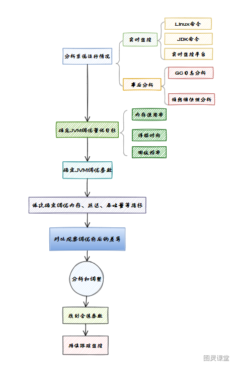
JVM调优大致流程图
实际上，JVM调优是不得已而为之，有那功夫，好好把烂代码重构一下不比瞎调JVM强。
但是，面试官非要问怎么办？可以从处理问题的角度来回答（对应图中事后），这是一个中规中矩的案例：电商公司的运营后台系统，偶发性的引发OOM异常，堆内存溢出。
1、因为是偶发性的，所以第一次简单的认为就是堆内存不足导致，单方面的加大了堆内存从4G调整到8G   -Xms8g。
2、但是问题依然没有解决，只能从堆内存信息下手，通过开启了-XX:+HeapDumpOnOutOfMemoryError参数 获得堆内存的dump文件。
3、用JProfiler 对  堆dump文件进行分析，通过JProfiler查看到占用内存最大的对象是String对象，本来想跟踪着String对象找到其引用的地方，但dump文件太大，跟踪进去的时候总是卡死，而String对象占用比较多也比较正常，最开始也没有认定就是这里的问题，于是就从线程信息里面找突破点。
4、通过线程进行分析，先找到了几个正在运行的业务线程，然后逐一跟进业务线程看了下代码，有个方法引起了我的注意，导出订单信息。
5、因为订单信息导出这个方法可能会有几万的数据量，首先要从数据库里面查询出来订单信息，然后把订单信息生成excel，这个过程会产生大量的String对象。
6、为了验证自己的猜想，于是准备登录后台去测试下，结果在测试的过程中发现导出订单的按钮前端居然没有做点击后按钮置灰交互事件，后端也没有做防止重复提交，因为导出订单数据本来就非常慢，使用的人员可能发现点击后很久后页面都没反应，然后就一直点，结果就大量的请求进入到后台，堆内存产生了大量的订单对象和EXCEL对象，而且方法执行非常慢，导致这一段时间内这些对象都无法被回收，所以最终导致内存溢出。
7、知道了问题就容易解决了，最终没有调整任何JVM参数，只是做了两个处理：

- 在前端的导出订单按钮上加上了置灰状态，等后端响应之后按钮才可以进行点击
- 后端代码加分布式锁，做防重处理

这样双管齐下，保证导出的请求不会一直打到服务端，问题解决！

## 21.线上服务CPU占用过高怎么排查？
:::info
薪资范围：10-25K
难度：
:::
问题分析：CPU高一定是某个程序长期占用了CPU资源。
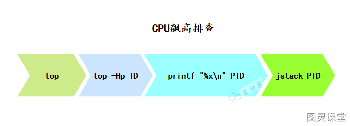
CPU飙高
1、所以先需要找出那个进程占用CPU高。

- top  列出系统各个进程的资源占用情况。

2、然后根据找到对应进行里哪个线程占用CPU高。

- top -Hp 进程ID   列出对应进程里面的线程占用资源情况

3、找到对应线程ID后，再打印出对应线程的堆栈信息

- printf "%x\n"  PID    把线程ID转换为16进制。
- jstack PID 打印出进程的所有线程信息，从打印出来的线程信息中找到上一步转换为16进制的线程ID对应的线程信息。

4、最后根据线程的堆栈信息定位到具体业务方法,从代码逻辑中找到问题所在。
查看是否有线程长时间的watting 或blocked，如果线程长期处于watting状态下， 关注watting on xxxxxx，说明线程在等待这把锁，然后根据锁的地址找到持有锁的线程。

## 22.内存飙高问题怎么排查？
:::info
薪资范围：10-25K
难度：
:::
分析：内存飚高如果是发生在java进程上，一般是因为创建了大量对象所导致，持续飚高说明垃圾回收跟不上对象创建的速度，或者内存泄露导致对象无法回收。
1、先观察垃圾回收的情况

- jstat -gc PID 1000 查看GC次数，时间等信息，每隔一秒打印一次。
- jmap -histo PID | head -20   查看堆内存占用空间最大的前20个对象类型,可初步查看是哪个对象占用了内存。

如果每次GC次数频繁，而且每次回收的内存空间也正常，那说明是因为对象创建速度快导致内存一直占用很高；如果每次回收的内存非常少，那么很可能是因为内存泄露导致内存一直无法被回收。
2、导出堆内存文件快照

- jmap -dump:live,format=b,file=/home/myheapdump.hprof PID  dump堆内存信息到文件。

如果会挂掉
```
-XX:+HeapDumpOnOutOfMemoryError 
-XX:HeapDumpPath=/crashes/my-heap-dump.hprof
```
3、使用visualVM对dump文件进行离线分析，找到占用内存高的对象，再找到创建该对象的业务代码位置，从代码和业务场景中定位具体问题。

## 23.频繁 minor gc 怎么办？
优化Minor GC频繁问题：通常情况下，由于新生代空间较小，Eden区很快被填满，就会导致频繁Minor  GC，因此可以通过增大新生代空间-Xmn来降低Minor GC的频率。


## 24.频繁Full GC怎么办？
Full GC的排查思路大概如下：

1. 清楚从程序角度，有哪些原因导致FGC？
- **大对象**：系统一次性加载了过多数据到内存中（比如SQL查询未做分页），导致大对象进入了老年代。
- **内存泄漏**：频繁创建了大量对象，但是无法被回收（比如IO对象使用完后未调用close方法释放资源），先引发FGC，最后导致OOM.
- 程序频繁生成一些**长生命周期的对象**，当这些对象的存活年龄超过分代年龄时便会进入老年代，最后引发FGC. 
- **程序BUG**
- 代码中**显式调用了gc**方法，包括自己的代码甚至框架中的代码。
- JVM参数设置问题：包括总内存大小、新生代和老年代的大小、Eden区和S区的大小、元空间大小、垃圾回收算法等等。
1. 清楚排查问题时能使用哪些工具
- 公司的监控系统：大部分公司都会有，可全方位监控JVM的各项指标。
- JDK的自带工具，包括jmap、jstat等常用命令：
```
# 查看堆内存各区域的使用率以及GC情况
jstat -gcutil -h20 pid 1000
# 查看堆内存中的存活对象，并按空间排序
jmap -histo pid | head -n20
# dump堆内存文件
jmap -dump:format=b,file=heap pid
```

- 可视化的堆内存分析工具：JVisualVM、MAT等
1. 排查指南
- 查看监控，以了解出现问题的时间点以及当前FGC的频率（可对比正常情况看频率是否正常）
- 了解该时间点之前有没有程序上线、基础组件升级等情况。
- 了解JVM的参数设置，包括：堆空间各个区域的大小设置，新生代和老年代分别采用了哪些垃圾收集器，然后分析JVM参数设置是否合理。
- 再对步骤1中列出的可能原因做排除法，其中元空间被打满、内存泄漏、代码显式调用gc方法比较容易排查。
- 针对大对象或者长生命周期对象导致的FGC，可通过 jmap -histo 命令并结合dump堆内存文件作进一步分析，需要先定位到可疑对象。
- 通过可疑对象定位到具体代码再次分析，这时候要结合GC原理和JVM参数设置，弄清楚可疑对象是否满足了进入到老年代的条件才能下结论。

## 25.有没有处理过内存溢出(OOM)问题？是如何定位的？
内存泄漏是内在病源，外在病症表现可能有：

- 应用程序长时间连续运行时性能严重下降
- CPU 使用率飙升，甚至到 100%
- 频繁 Full GC，各种报警，例如接口超时报警等
- 应用程序抛出 OutOfMemoryError 错误
- 应用程序偶尔会耗尽连接对象

严重**内存泄漏**往往伴随频繁的 **Full GC**，所以分析排查内存泄漏问题首先还得从查看 Full GC 入手。主要有以下操作步骤：

1. 使用 jps 查看运行的 Java 进程 ID
2. 使用top -p [pid] 查看进程使用 CPU 和 MEM 的情况
3. 使用 top -Hp [pid] 查看进程下的所有线程占 CPU 和 MEM 的情况
4. 将线程 ID 转换为 16 进制：printf "%x\n" [pid]，输出的值就是线程栈信息中的 **nid**。例如：printf "%x\n" 29471，换行输出 **731f**。
5. 抓取线程栈：jstack 29452 > 29452.txt，可以多抓几次做个对比。在线程栈信息中找到对应线程号的 16 进制值，如下是 **731f** 线程的信息。线程栈分析可使用 Visualvm 插件 **TDA**。
```
"Service Thread" #7 daemon prio=9 os_prio=0 tid=0x00007fbe2c164000 nid=0x731f runnable [0x0000000000000000]
   java.lang.Thread.State: RUNNABLE
```

6. 使用jstat -gcutil [pid] 5000 10 每隔 5 秒输出 GC 信息，输出 10 次，查看 **YGC** 和 **Full GC** 次数。通常会出现 YGC 不增加或增加缓慢，而 Full GC 增加很快。或使用 jstat -gccause [pid] 5000 ，同样是输出 GC 摘要信息。或使用 jmap -heap [pid] 查看堆的摘要信息，关注老年代内存使用是否达到阀值，若达到阀值就会执行 Full GC。
7. 如果发现 Full GC 次数太多，就很大概率存在内存泄漏了
8. 使用 jmap -histo:live [pid] 输出每个类的对象数量，内存大小(字节单位)及全限定类名。
9. 生成 dump 文件，借助工具分析哪 个对象非常多，基本就能定位到问题在那了使用 jmap 生成 dump 文件：
```
# jmap -dump:live,format=b,file=29471.dump 29471
Dumping heap to /root/dump ...
Heap dump file created
```
可以使用 **jhat** 命令分析：jhat -port 8000 29471.dump，浏览器访问 jhat 服务，端口是 8000。通常使用图形化工具分析，如 JDK 自带的 **jvisualvm**，从菜单 > 文件 > 装入 dump 文件。或使用第三方式具分析的，如 **JProfiler** 也是个图形化工具，**GCViewer** 工具。Eclipse 或以使用 MAT 工具查看。或使用在线分析平台 **GCEasy**。注意：如果 dump 文件较大的话，分析会占比较大的内存。基本上就可以定位到代码层的逻辑了。

   1. 在 dump 文析结果中查找存在大量的对象，再查对其的引用。
   2. dump 文件分析

##  


> 原文: <https://www.yuque.com/tulingzhouyu/db22bv/td5a84ty4vel22ge>