# 🔥MySQL索引篇笔记合集


## MySQL如何实现的索引机制？


> 💡**什么是索引？**
>  
> 在关系数据库中，索引是一种单独的、物理的对数据库表中一列或多列的值进行排序的一种存储结构，它是某个表中一列或若干列值的集合和相应的指向表中物理标识这些值的数据页的逻辑指针清单。索引的作用相当于图书的目录，可以根据目录中的页码快速找到所需的内容。
>  
> **能实现快速定位数据的一种存储结构，其设计思想是以空间换时间**。


### 索引的分类

按「数据结构」分类：B+tree索引、Hash索引、Full-text索引。
按「物理存储」分类：聚簇索引（主键索引）、二级索引（辅助索引）。
按「字段特性」分类：主键索引、唯一索引、普通索引、前缀索引。
按「字段个数」分类：单列索引、联合索引。


### MySQL如何实现的索引机制

这个话题比较大，在`MySQL`中有不同的存储引擎比如像`InnoDB` `MyISAM` `Memory` 等等,每一种存储引擎在其内部实现索引机制的原理也有所不同。在`MySQL5.5`之后默认的就是`InnoDB`，并且是目前使用最广泛的`MySQL`数据引擎，那我们就以`InnoDB`为例展开讲讲。

> ❓如果说我们在表中有100条数据，而我们要找出我们需要的数据，有哪些办法？


- ❌  我们是不是可以按照一种顺序的方式一条一条往下去搜索，直到匹配到我们需要的数据，这是一种方案在时间复杂度上是`O(N)`，虽说效率差但也能用。
- ❌  二分查找法也是一种常用的比较高效的查询算法，它的搜索效率为`O(log(N))`,虽说查找效率是比顺序查找高了不少，但是它有两个前提条件，必须用顺序存储结构比如数组，第二个是必须按照关键字进行有序排序（从小到大）。
- ❌  哈希查找，哈希查找的特性是能够做到直接定址，其效率无限接近于`O(1)`，取决于冲突的数量。但是散列表数据是无序存储的，排序要自己做，第二个是散列表还要扩容耗时长，遇到散列冲突性能不稳定。
- ✅  B树/B+树查找的复杂度是`O(log2(N))`, 那么这也是`InnoDB`采用的数据结构，在查找效率上的非常高的，算法具体的原理在后面介绍。


### 为什么InnoDB要使用B+树作为索引结构？


## InnoDB的索引和MyISAM的索引有什么区别？

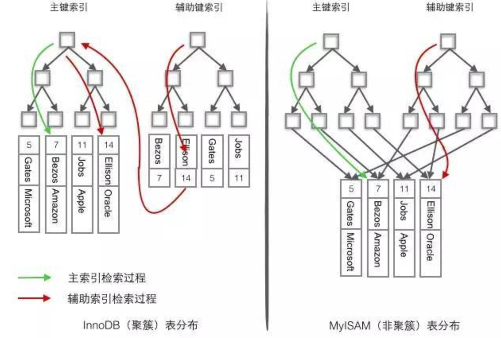

首先InnoDB和MyISAM都是使用的B+树实现的，但是InnoDB使用的是聚簇索引而MyISAM使用的是**非聚簇索引**，聚簇索引根据主键创建一颗B+树，叶子节点则存放的是数据行记录，也可以把叶子结点称为数据页。通俗点来说就是把数据和索引存在同一个块，找到了索引也就找到了数据。

- 因为叶子结点将索引和数据放在一起，就决定了聚簇索引的唯一性，一张表里面只能有一个聚簇索引。
- InnoDB引擎默认将主键设置为聚簇索引，但如果没有设置主键，那么InnoDB将会选择非空的唯一索引作为代替，如果没有这样的索引，InnoDB将会定一个隐式主键作为聚簇索引。
- 因为聚簇索引特殊的物理结构所决定，叶子结点将索引和数据存放在一起，在获取数据的速度上是比非聚簇索引快的。
- 聚簇索引数据的存储是有序的，在进行**排序查找**和**范围查找**的速度也是非常快的。
- ⚠️  也正因为有序性，在数据插入时按照主键的顺序插入是最快的，否则就会出现**页分裂**等问题，严重影响性能。对于InnoDB我们一般采用自增作为主键ID。
- 第二个问题主键最好不要进行更新，修改主键的代价非常大，为了保持有序性会导致更新的行移动，一般来说我们通常设置为主键不可更新。

> 🛎️在这部分只介绍InnoDB和MyISAM主键索引的不同？辅助索引后面在说


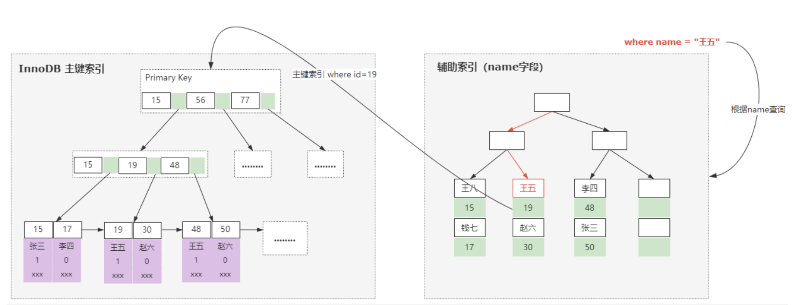

而非聚簇索引是将索引和数据分开存储，那么在访问数据的时候就需要2次查找，但是和InnoDB的非聚簇部分还是有所区别。InnoDB是需要查找2次树，先查找辅助索引树，再查找聚簇索引树（这个过程也叫回表）。而MyISAM的主键索引叶子结点的存储的部分还是有所区别。InnoDB中存储的是**索引和聚簇索引ID**，但是MyISAM中存储的是**索引和数据行的地址**，只要定位就可以获取到。

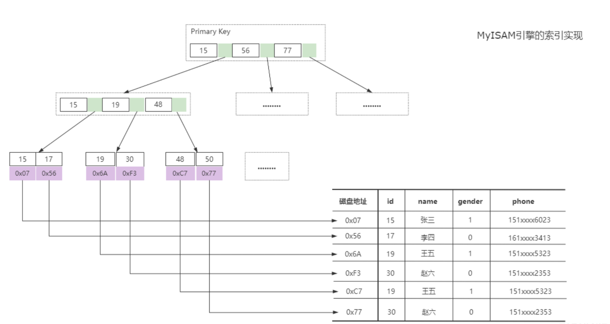

其实看到这个部分会有一个疑惑，那就是InnoDB的聚簇索引比MyISAM的主键快，那为什么会认为MyISAM查询效率比InnoDB快呢？

- 第一点，对于两者存储引擎的的性能分析不能只看主键索引，我们也要看看辅助索引，前头我们介绍过InnoDB辅助索引会存在一个回表的过程。而MyISAM的辅助索引和主键索引的原理是一样的，并没有什么区别。
- **(重点) InnoDB对MVCC的支持，事物是比较影响性能的，就算你没用但是也省不了检查和维护，而MyISAM这块却没有这方面的影响，具体MVCC详解将在后面章节描述。**


## 如果一个表没有主键索引那还会创建B+树吗？

**答案是会的！！！**

InnoDB是MySQL中的一种存储引擎，它会为每个表创建一个主键索引。如果表没有明确的主键索引，InnoDB会使用一个隐藏的、自动生成的主键来创建索引。这个隐藏的主键索引使用的就是B+树结构。因此，在InnoDB中，即使表没有明确的主键索引，也会创建一个B+树索引。


## 索引的优缺点是什么？

数据是存储在磁盘上的，操作系统读取磁盘的最小单位是块，如果没有索引，会加载所有的数据到内存，依次进行检索，加载的总数据会很多，磁盘IO多。

如果有了索引，会以学号为key创建索引，MySQL采用B+树结构存储，一方面加载的数据只有学号和主键ID，另一方便采用了多叉平衡树，定位到指定学号会很快，根据关联的ID可以快速定位到对应行的数据，所以检索的速度会很快，因为加载的总数据很少，磁盘IO少。

可见，索引可以大大减少检索数据的范围、减少磁盘IO，使查询速度很快，因为磁盘IO是很慢的，是由它的硬件结构决定的。


#### ✅ 优点

- 索引能够提高数据检索的效率，降低数据库的IO成本。
- 通过创建唯一性索引，可以保证数据库表中每一行数据的唯一性，创建唯一索引
- 在使用分组和排序子句进行数据检索时，同样可以显著减少查询中分组和排序的时间
- 加速两个表之间的连接，一般是在外键上创建索引


#### ❌ 缺点

- 需要占用物理空间,建立的索引越多需要的空间越大
- 创建索引和维护索引要耗费时间，这种时间随着数据量的增加而增加
- 会降低表的增删改的效率，因为每次增删改索引需要进行动态维护，导致时间变长


## 使用索引一定能提升效率吗？（什么时候适合创建索引，什么时候不适合创建索引？）

答案是不一定，任何事物我们都应该辩证的看，知道其运行逻辑从而利用其优点，尽量避开它的缺点。在上面我们已经和大家介绍了过了索引带来的优缺点，那接下来就和大家分享几个建索引的提示。

- **对于查询中使用的少的字段尽量不要创建索引**，创建索引是有**成本**的，空间占用、创建和维护成本、增删改效率降低。
- **对于数据密度小的列也不建议创建索引**，因为InnoDB中索引的B+树所决定的，你能带来的效率提升非常有限。（但是也有例外，举个例子枚举值（1，2，3），头两个占比百分之1%，第三个占比99%，并且头两个搜索占比比第三个高很多，那么是可以建议加索引的）。InnoDB的辅助索引是存在回表的，如果数据密度过小，那么性能可能还不如全表扫。像上面这种场景具有特殊性，也说明一个道理，在大多数场景下建议可能适用，但是也有不适用的时候，**我们不要把这种建议当作铁律**。


## 如何查看一个表的索引？

⬆️ 上代码 ⬆️

```sql
show index from table_name (表名)
```


## 有哪些情况会导致索引失效？

**这个问题要分版本回答！！！版本不同可能会导致索引失效的场景也不同，直接给答案的都是耍流氓！！！**

这里回答基于最新MySQL8版本，MySQL8失效的以前版本也失效，MySQL8不失效的，以前可能会失效。

- 使用`like`并且是左边带`%`, 右边可以带会走索引（但是并不绝对，详细解释看下面like专题分析）
- 隐式类型转换，索引字段与条件或关联字段的类型不一致。（比如你的字段是int，你用字符串方式去查询会导致索引失效）。
- 在`where`条件里面对索引列使用运算或者使用函数。
- 使用`OR`且存在非索引列
- 在`where`条件中两列做比较会导致索引失效
- 使用IN可能不会走索引（MySQL环境变量`eq_range_index_dive_limit`的值对IN语法有很大影响，该参数表示使用索引情况下IN中参数的最大数量。`MySQL 5.7.3`以及之前的版本中，`eq_range_index_dive_limit`的默认值为10，之后的版本默认值为200。我们拿`MySQL8.0.19`举例，`eq_range_index_dive_limit`=200表示当IN (...)中的值 `>200`个时，该查询一定不会走索引。`<=200`则可能用到索引。）
- 使用非主键范围条件查询时，部分情况索引失效 **。**
- 使用`order by`可能会导致索引失效
- `is null` `is not null` `≠` 可能会导致索引失效


## 如果表中有字段为NULL 索引是否会失效？

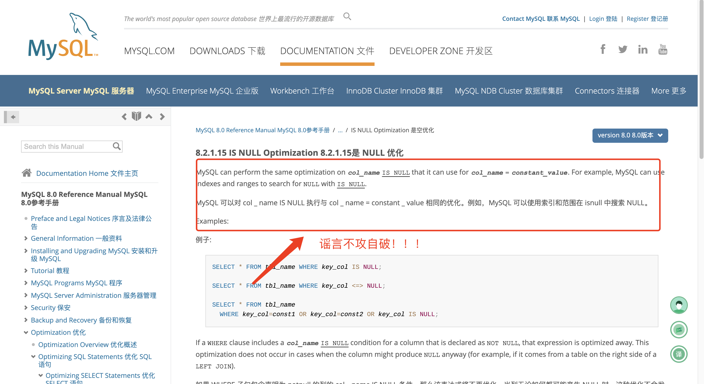

首先讲答案不一定。即使我们使用`is null` 或者`is not null` 它其实都是会走索引的。那为什么会有这样的言论呢？这里首先就得来讲讲NULL值是怎么在记录中存储的，又是怎么在B+树中存储的呢。

那么在InnoDB中分为聚簇索引和非聚簇索引两种，聚簇索引本身是不允许记录为空的，所以可以不不用考虑，那么就剩下非聚簇索引也就是我们的辅助索引。

那既然`IS NULL`、`IS NOT NULL`、`!=`这些条件都可能使用到索引，那到底什么时候索引，什么时候采用全表扫描呢？

首先我们得知道两个东西，第一个在InnoDB引擎是如何存储NULL值的，第二个问题是索引是如何存储NULL值的，这样我们才能从根上理解NULL在什么场景走索引，在什么场景不走索引。

1⃣️ **在InnoDB引擎是如何存储NULL值的？**

> InnoDB引擎通过使用一个特殊的值来表示null，这个值通常被称为"null bitmap"。null bitmap是一个二进制位序列，用来标记表中每一个列是否为null。当null bitmap中对应的位为1时，表示对应的列为null；当null bitmap中对应的位为0时，表示对应的列不为null。在实际存储时，InnoDB引擎会将null bitmap作为行记录的一部分，存储在行记录的开头，这样可以在读取行记录时快速判断每个列是否为null。


从头开始说理解起来会比较容易，理解了**独占表空间文件**就更容易理解**行格式**了，接着往下看：

当我们创建表的时候默认会创建一个`*.idb` 文件，这个文件又称为独占表空间文件，它是由段、区、页、行组成。InnoDB存储引擎独占表空间大致如下图；

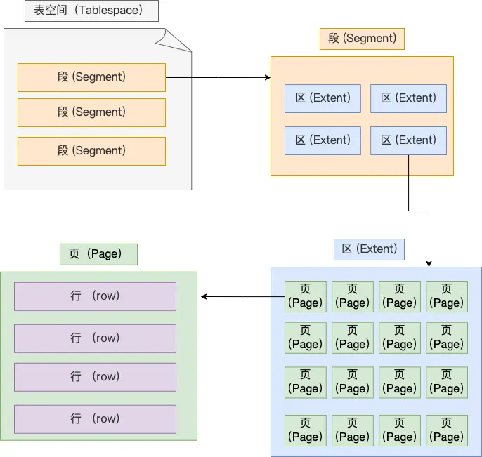

**Segment**(**表空间**) 是由各个段（segment）组成的，段是由多个区（extent）组成的。段一般分为数据段、索引段和回滚段等。

- **数据段** 存放 B + 树的叶子节点的区的集合
- **索引段** 存放 B + 树的非叶子节点的区的集合
- **回滚段** 存放的是回滚数据的区的集合， MVCC就是利用了回滚段实现了多版本查询数据

**Extent(区)** 在表中数据量大的时候，为某个索引分配空间的时候就不再按照页为单位分配了，而是按照区（extent）为单位分配。每个区的大小为 1MB，对于 16KB 的页来说，连续的 64 个页会被划为一个区，这样就使得链表中相邻的页的物理位置也相邻，就能使用顺序 I/O 了 。

（我们知道 InnoDB 存储引擎是用 B+ 树来组织数据的。B+ 树中每一层都是通过双向链表连接起来的，如果是以页为单位来分配存储空间，那么链表中相邻的两个页之间的物理位置并不是连续的，可能离得非常远，那么磁盘查询时就会有大量的随机I/O，随机 I/O 是非常慢的。解决这个问题也很简单，就是让链表中相邻的页的物理位置也相邻，这样就可以使用顺序 I/O 了，那么在范围查询（扫描叶子节点）的时候性能就会很高。）

**Page(页)** 记录是按照行来存储的，但是数据库的读取并不以「行」为单位，否则一次读取（也就是一次 I/O 操作）只能处理一行数据，效率会非常低。

因此，**InnoDB 的数据是按「页」为单位来读写的**，也就是说，当需要读一条记录的时候，并不是将这个行记录从磁盘读出来，而是以页为单位，将其整体读入内存。

**默认每个页的大小为 16KB**，也就是最多能保证 16KB 的连续存储空间。

页是 InnoDB 存储引擎磁盘管理的最小单元，意味着数据库每次读写都是以 16KB 为单位的，一次最少从磁盘中读取 16K 的内容到内存中，一次最少把内存中的 16K 内容刷新到磁盘中。

页的类型有很多，常见的有数据页、undo 日志页、溢出页等等。数据表中的行记录是用「数据页」来管理的，数据页的结构这里我就不讲细说了，总之知道表中的记录存储在「数据页」里面就行。

**Row(行)** 数据库表中的记录都是按行（row）进行存放的，每行记录根据不同的行格式，有不同的存储结构。

**重点来了！！！**

InnoDB 提供了 4 种行格式，分别是 Redundant、Compact、Dynamic和 Compressed 行格式。

- **Redundant** 是很古老的行格式了， MySQL 5.0 版本之前用的行格式，现在基本没人用了，那就不展开详讲了。
- MySQL 5.0 之后引入了 **Compact** 行记录存储方式，由于 Redundant 不是一种紧凑的行格式，而采用更为紧凑的Compact ，设计的初衷就是为了让一个数据页中可以存放更多的行记录，从 MySQL 5.1 版本之后，行格式默认设置成 Compact。
- **Dynamic** 和 **Compressed** 两个都是紧凑的行格式，它们的行格式都和 Compact 差不多，因为都是基于 **Compact** 改进一点东西。从 MySQL5.7 版本之后，默认使用 **Dynamic** 行格式。

那么我们来看看**Compact**里面长什么样，先混个脸熟。


这里简单介绍一下，**Compact**行格式其他内容后面单独出一个章节介绍。

- **NULL值列表（本问题介绍重点）** 
   - 表中的某些列可能会存储 NULL 值，如果把这些 NULL 值都放到记录的真实数据中会比较浪费空间，所以 Compact 行格式把这些值为 NULL 的列存储到 NULL值列表中。如果存在允许 NULL 值的列，则每个列对应一个二进制位（bit），二进制位按照列的顺序逆序排列。
   - 二进制位的值为`1`时，代表该列的值为NULL。二进制位的值为`0`时，代表该列的值不为NULL。另外，NULL 值列表必须用整数个字节的位表示（1字节8位），如果使用的二进制位个数不足整数个字节，则在字节的高位补 `0`。
   - 当然NULL 值列表也不是必须的。**当数据表的字段都定义成 NOT NULL 的时候，这时候表里的行格式就不会有 NULL 值列表了**。所以在设计数据库表的时候，通常都是建议将字段设置为 NOT NULL，这样可以节省 1 字节的空间（NULL 值列表占用 1 字节空间）。
   - 「NULL 值列表」的空间不是固定 1 字节的。当一条记录有 9 个字段值都是 NULL，那么就会创建 2 字节空间的「NULL 值列表」，以此类推。

2⃣️ **索引是如何存储NULL值的？**

我们知道InnoDB引擎中按照物理存储的不同分为聚簇索引和非聚簇索引，聚簇索引也就是主键索引，那么是不允许为空的。那就不再我们本问题的讨论范围，我们重点来看看非聚簇索引，非聚簇索引是允许值为空的。

在InnoDB中非聚簇索引是通过B+树的方式进行存储的

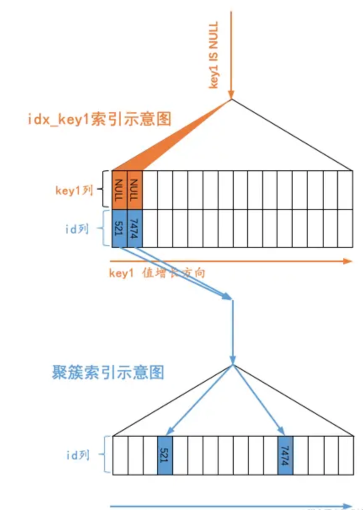

从图中可以看出，对于`s1`表的二级索引`idx_key1`来说，值为`NULL`的二级索引记录都被放在了`B+`树的最左边，这是因为设计`InnoDB`的大叔有这样的规定：

> We define the SQL null to be the smallest possible value of a field.


也就是说他们把SQL中的NULL值认为是列中最小的值。在通过二级索引idx_key1对应的B+树快速定位到叶子节点中符合条件的最左边的那条记录后，也就是本例中id值为521的那条记录之后，就可以顺着每条记录都有的next_record属性沿着由记录组成的单向链表去获取记录了，直到某条记录的key1列不为NULL。

3⃣️ **我们了解了上面的两个问题之后，我们就可以来看看，使不使用索引的依据是什么了**

实际上来说我们用`is null` `is not null` `≠` 这些条件都是能走索引的，那什么时候走索引什么时候走全表扫描呢？

总结起来就是两个字：成本！！！

如何去度量成本计算使用某个索引执行查询的成本就非常复杂了，展开讲这个话题就停不下来了，后面考虑单独列一个篇幅去讲。

这里总结性讲讲：第一个，**读取二级索引记录的成本**，第二，**将二级索引记录执行回表操作，也就是到聚簇索引中找到完整的用户记录操作所付出的成本。**

要扫描的二级索引记录条数越多，那么需要执行的回表操作的次数也就越多，达到了某个比例时，使用二级索引执行查询的成本也就超过了全表扫描的成本（举一个极端的例子，比方说要扫描的全部的二级索引记录，那就要对每条记录执行一遍回表操作，自然不如直接扫描聚簇索引来的快）

所以MySQL优化器在真正执行查询之前，对于每个可能使用到的索引来说，都会预先计算一下需要扫描的二级索引记录的数量，比方说对于下边这个查询：

```sql
SELECT * FROM s1 WHERE key1 IS NULL;
```

优化器会分析出此查询只需要查找`key1`值为`NULL`的记录，然后访问一下二级索引`idx_key1`，看一下值为`NULL`的记录有多少（如果符合条件的二级索引记录数量较少，那么统计结果是精确的，如果太多的话，会采用一定的手段计算一个模糊的值，当然算法也比较麻烦，我们就不展开说了），这种在查询真正执行前优化器就率先访问索引来计算需要扫描的索引记录数量的方式称之为`index dive`。当然，对于某些查询，比方说WHERE子句中有IN条件，并且IN条件中包含许多参数的话，比方说这样：

```sql
SELECT * FROM s1 WHERE key1 IN ('a', 'b', 'c', ... , 'zzzzzzz');
```

这样的话需要统计的`key1`值所在的区间就太多了，这样就不能采用`index dive`的方式去真正的访问二级索引`idx_key1`，而是需要采用之前在背地里产生的一些统计数据去估算匹配的二级索引记录有多少条（很显然根据统计数据去估算记录条数比`index dive`的方式精确性差了很多）。

反正不论采用`index dive`还是依据统计数据估算，最终要得到一个需要扫描的二级索引记录条数，如果这个条数占整个记录条数的比例特别大，那么就趋向于使用全表扫描执行查询，否则趋向于使用这个索引执行查询。

理解了这个也就好理解为什么在WHERE子句中出现`IS NULL`、`IS NOT NULL`、`!=`这些条件仍然可以使用索引，本质上都是优化器去计算一下对应的二级索引数量占所有记录数量的比值而已。

大家可以看到，MySQL中决定使不使用某个索引执行查询的依据很简单：就是成本够不够小。而不是是否在WHERE子句中用了`IS NULL`、`IS NOT NULL`、`!=`这些条件。大家以后也多多辟谣吧，没那么复杂，只是一个成本而已。


## 为什么LIKE以%开头索引会失效？

首先看看B+树是如何查找数据的：

> 查找数据时，MySQL会从根节点开始，按照从左到右的顺序比较查询条件和节点中的键值。如果查询条件小于节点中的键值，则跳到该节点的左子节点继续查找；如果查询条件大于节点中的键值，则跳到该节点的右子节点继续查找；如果查询条件等于节点中的键值，则继续查找该节点的下一个节点。


比如说我有下面这条SQL：

```sql
select * from `user` where nickname like '%冥';
```

如果数据库中存在`南冥` `北冥` `西冥` `东冥` ，那么在B+树中搜索的效率和全表扫描还有什么区别呢？

我走聚簇索引全表扫描还不用回表。

最后在扩展讲一个点，其实不一定会导致索引失效。举个例子：

```sql
create table `user`(
  id int primary key auto_increment,
  name varchar(20),
  index idx_name(name),
);

// 那么这种情况是会走索引的。
select id,name from `user` where name like '%冥';
```

**为什么说上面的例子会走索引呢？**

首先我们需要查询的`id` `name` 这两个字段是不是都在我们的辅助索引中，叶子节点是不是存的**索引值**和**主键值**，所以我们只要查辅助索引就可以直接拿到我们的需要的结果了，那么这个叫做索引覆盖。我们观察执行计划会发现它的查询级别是`index` ，其实也是**全表遍历了辅助索引**。

**第二个问题来了，那为什么就要走辅助索引而不是走全表扫描呢？**

因为辅助索引中记录的东西比主键索引少了很多，只有索引值和主键值，但是主键索引中就包含了，其他值、事物ID、MVCC的回流指针等等。再加上索引覆盖不用回表，优化器就认为直接遍历辅助索引的效率高于主键索引。


## 什么是索引覆盖？

索引覆盖（Index Covering）是指通过在索引中包含所有查询语句中所需的列，可以避免对表中的数据进行额外的访问，从而提高查询效率。(避免了回表操作)

例如，对于一个查询语句：

```sql
SELECT col1, col2, col3 FROM table WHERE col1 = x AND col2 = y
```

如果在table表中建立了一个索引，包含col1、col2和col3三列，那么MySQL可以通过索引定位到符合条件的数据，并在索引中提取col1、col2和col3列的值，无需对表中的数据进行额外的访问。这种方式就叫做索引覆盖。

索引覆盖能够显著提高查询效率，因此在建立索引时应尽量考虑包含查询语句中所需的所有列。


## 什么是聚簇索引？

聚簇索引是一种特殊的索引，它将数据存储在索引树的叶子节点上。这种索引方式的优点是，在查询数据时可以减少一次查询，因为查询索引树的同时就能获取到数据。聚簇索引的缺点是，因为数据存储在索引树中，所以对数据进行修改或删除操作时需要更新索引树，这会增加系统的开销。


## 聚簇索引与非聚集索引的特点是什么？

在InnoDB中聚簇索引和非聚簇索引实际上是物理空间存储方式的一个不同。


#### 聚簇索引

1. 聚簇索引将数据存储在索引树的叶子节点上。
2. 聚簇索引可以减少一次查询，因为查询索引树的同时就能获取到数据。
3. 聚簇索引的缺点是，对数据进行修改或删除操作时需要更新索引树，会增加系统的开销。
4. 聚簇索引通常用于数据库系统中，主要用于提高查询效率。


#### 非聚簇索引（又称二级索引 /  辅助索引）

1. 非聚簇索引不将数据存储在索引树的叶子节点上，而是存储在数据页中。
2. 非聚簇索引在查询数据时需要两次查询，一次查询索引树，获取数据页的地址，再通过数据页的地址查询数据（**通常情况下来说是的，但如果索引覆盖的话实际上是不用回表的**）。
3. 非聚簇索引的优点是，对数据进行修改或删除操作时不需要更新索引树，减少了系统的开销。
4. 非聚簇索引通常用于数据库系统中，主要用于提高数据更新和删除操作的效率。


## 聚簇索引与非聚簇索引b+树实现有什么区别？

结合“聚簇索引与非聚集索引的特点是什么？”加上下图就明白了


## 一个表中可以有多个（非）聚簇索引吗？

可以，这题容易混淆聚簇和非聚簇，聚簇只能有一个，但是非聚簇可以有很多，因为聚簇是和数据存放在一起的，但是非聚簇是单独的。（同时这题可以结合上面两个问题回答）


## 非聚簇索引为什么不存数据地址值而存储主键？

我们知道在MyISAM引擎中是没有聚簇索引，都是存的辅助索引。但是和InnoDB不同的是存储的，它是存储索引值和数据地址，而我们InnoDB中存储的是主键ID。

我们要记住知道一个点，数据是会不断变动的，那么它的一个地址也是会跟着不断变动，如果直接存储地址，下次找到的数据可能就不是原来的数据了。如果要解决这个问题的话，成本是非常高的。每次数据变动都需要进行调整。


## 一个b+树中大概能存放多少条索引记录？


## 什么是Hash索引？

哈希索引（hash index）基于哈希表实现。哈希索引通过Hash算法将数据库的索引列数据转换成定长的哈希码作为key，将这条数据的行的地址作为value一并存入Hash表的对应位置。

在MySQL中，只有Memeory引擎显式的支持哈希索引，这也是Memory引擎表的默认索引结构，Memeory同时也支持B-Tree索引。并且，Memory引擎支持非唯一哈希索引，如果多个列的哈希值相同（或者发生了Hash碰撞），索引会在对应Hash键下以链表形式存储多个记录地址。

哈希索引还有如下特点：

- 哈希索引不支持部分索引列的匹配查找，因为哈希索引始终是使用索引列的全部内容来计算哈希值的。例如，在数据列（A，B）上建立哈希索引，如果查询只有数据列A，则无法使用该索引。
- 哈希索引具有哈希表的特性，因此只有精确匹配所有列的查询对于哈希索引才有效，比如=、<>、IN(，因为数据的存储是无序的)，且无法使用任何范围查询。
- 因为数据的存储是无序的，哈希索引还无法用于排序。
- 对于精确查询，则哈希索引效率很高，时间复杂度为O(1)，除非有很多哈希冲突（不同的索引列有相同的哈希值），如果发生哈希冲突，则存储引擎必须遍历链表中的所有数据指针，逐行比较，直到找到所有符合条件的行。哈希冲突越多，代价就越大！


### InnoDB到底支不支持哈希索引？

对于InnoDB的哈希索引，确切的应该这么说：

- InnoDB用户无法手动创建哈希索引，这一层上说，InnoDB确实不支持哈希索引;
- InnoDB会自调优(self-tuning)，如果判定建立自适应哈希索引(Adaptive Hash Index, AHI)，能够提升查询效率，InnoDB自己会建立相关哈希索引，这一层上说，InnoDB又是支持哈希索引的;

那什么是**自适应哈希索引**(Adaptive Hash Index, AHI)呢?

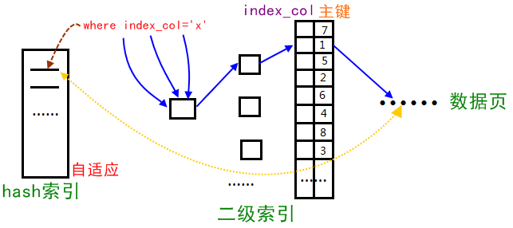

1、自适应即我们不需要自己处理，当InnoDB引擎根据查询统计发现某一查询满足hash索引的数据结构特点，就会给其建立一个hash索引；

2、hash索引底层的数据结构是散列表（Hash表），其数据特点就是比较适合在内存中使用，自适应Hash索引存在于InnoDB架构中的缓存中（不存在于磁盘架构中）.


## 什么是索引下推？

索引下推（INDEX CONDITION PUSHDOWN，简称 ICP）是在 MySQL 5.6 针对**扫描二级索引**的一项优化改进。总的来说是通过把索引过滤条件下推到**存储引擎**，来减少 MySQL 存储引擎访问基表的次数以及 MySQL 服务层访问存储引擎的次数。ICP 适用于 MYISAM 和 INNODB，本篇的内容只基于 INNODB。

在讲这个技术之前你得对mysql架构有一个简单的认识，见下图

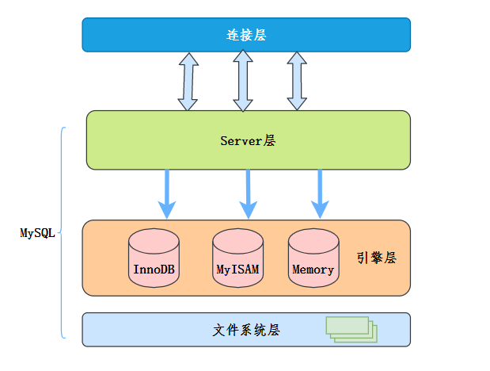

- MySQL 服务层：也就是 SERVER 层，用来解析 SQL 的语法、语义、生成查询计划、接管从 MySQL 存储引擎层上推的数据进行二次过滤等等。
- MySQL 存储引擎层：按照 MySQL 服务层下发的请求，通过索引或者全表扫描等方式把数据上传到 MySQL 服务层。
- MySQL 索引扫描：根据指定索引过滤条件，遍历索引找到索引键对应的主键值后回表过滤剩余过滤条件。
- MySQL 索引过滤：通过索引扫描并且基于索引进行二次条件过滤后再回表。
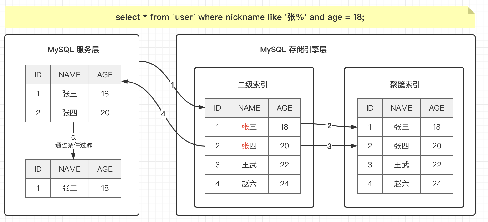
- 使用索引下推实现
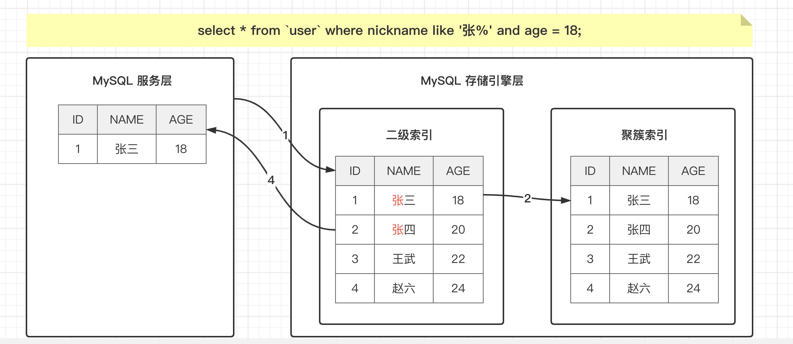


### 索引下推的使用条件

- ICP目标是减少全行记录读取，从而减少IO 操作，只能用于非聚簇索引。聚簇索引本身包含的表数据，也就不存在下推一说。
- 只能用于`range`、 `ref`、 `eq_ref`、`ref_or_null`访问方法；
- where 条件中是用 `and` 而非 `or` 的时候。
- ICP适用于分区表。
- ICP不支持基于虚拟列上建立的索引，比如说函数索引
- ICP不支持引用子查询作为条件。
- ICP不支持存储函数作为条件，因为存储引擎无法调用存储函数。

索引下推相关语句

```sql
# 查看索引下推是否开启
select @@optimizer_switch
# 开启索引下推
set optimizer_switch="index_condition_pushdown=on";
# 关闭索引下推
set optimizer_switch="index_condition_pushdown=off";
```


## 什么是唯一索引？

讲起来非常简单，其实和 **"普通索引"类似，不同的就是：索引列的值必须唯一，但允许有空值。** 可以是单列唯一索引，也可以是联合唯一索引。

- **最大的所用就是确保写入数据库的数据是唯一值。**


### 什么时候应该使用唯一索引呢？

我们前面讲了唯一索引最大的好处就是能保证唯一性。看似没什么太大的价值，可能就会有同学说，我业务层做一个重复检查不就好了。问题就在这个地方，“业务是无法确保唯一性的”，除非你说你的代码没有BUG。很多时候业务场景需要保证唯一性，如果不在数据库加限制的话，总有一天会出现脏数据。

那又有同学就说了，既然你不想重复你可以使用主键索引。这个回答也很有意思。

- 我们确实可以通过主键索引来保证唯一，但是，如果你的数据不能保证有序插入。比如说身份证字段，你如果用身份证字段作为主键的话，会导致查询效率降低。
- 唯一索引还有一个好处就是可以为空，真实的业务场景肯定是可以保证身份证为空的，如果没有绑定身份证就不让注册好像也有点说不过去。

聚簇索引的原理就不在这里细讲了，会有一个单独的章节来介绍。


### 唯一索引是否会影响性能呢？

我们通过和普通索引来做一个对比，有查询和插入两个场景。

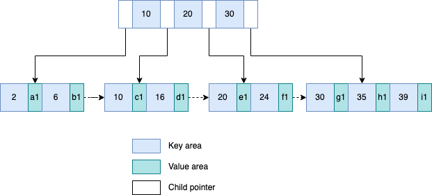

首先第一个数据查询，一般情况下来说索引是通过`B+树`从根节点开始层序遍历到叶子结点，数据页内部通过二分搜索。

- **普通索引** 查到满足条件的第一条记录，继续查找下一条记录，直到找到不满足条件的记录
- **唯一索引** 查到第一个满足条件的记录，就停止搜索。

`InnoDB` 它是以数据页为单位进行读写的，我们读一条记录，并不是从磁盘加载一条记录，而是以页为单位整体读到内存里面来的。

普通索引比唯一索引就多了一次`查找和判断下一条`记录的操作，也就是一次指针寻找数据和一次计算。当然还有一种特殊情况，读取到的这条数据正好是数据页的最后一条，但是这种概率也是非常低，几乎可以忽略不计。

整体看下来看上去性能差距并不大对吧。

来看第二个更新的性能，我们按照上面图上的例子在2和6之间插入一个3。

**在内存中**

- **普通索引** 找到2和6之间的位置 →`插入值`→ `结束`
- **唯一索引** 找到2和6之间的位置 →`**当判断有没有冲突**`→ `插入值`→ `结束`

**不在内存中**

- **普通索引** 将更新记录在`change buffer` → `结束`
- **唯一索引** 将数据页读入内存→`当判断到没有冲突`→`插入值`→`结束`

数据读取到内存涉及了随机IO访问，这是在数据库里面成本最高的操作之一，而`change buffer` 就可以减少这种随机磁盘访问，所以性能提示比较明显。所以在这一块来说，如果两者在业务场景下都能满足时可以优先考虑使用普通索引。


## 什么是联合索引，组合索引，复合索引？

我们在索引回顾的时候和大家对索引做了一个分类对吧，按照字段个数来分的话，就分为了单列索引和组合索引对吧。那么他们之间的特点是什么呢？我们来看

- **单列索引** 一个索引只包含了一个列，一个表里面可以有多个单列索引，但是这不叫组合索引。
- **组合索引**（联合索引 & 复合索引）一个索引包含多个列。

看上去感觉这组合索引并没有太大作用是吧，我一个列已经有一个索引了，我还要这组合索引干嘛？

真相往往不那么简单，首先我们得承认我们的业务千变万化，我们的查询语句条件肯定是非常多的。

- **高效率** 如果说只有单列索引，那就会涉及多次二级索引树查找，再加上回表，性能相对于联合索引来说是比较低的。
- **减少开销** 我们要记得创建索引是存在空间开销的，对于大数据量的表，使用联合索引会降低空间开销。
- **索引覆盖** 如果组合索引索引值已经满足了我们的查询条件，那么就不会进行回表，直接返回。

但是我们按照我们的查询条件去创建一个联合索引的话，就避免了上面的问题。那么联合索引是怎么工作的呢？

这里涉及到了一个重点，叫做`最左前缀`，简单理解就是只会从最左边开始组合，**组合索引的第一个字段必须出现在查询组句中，还不能跳跃**，只有这样才能让索引生效，比如说我查询条件里面有组合索引里面的第二个字段，那么也是不会走组合索引的。举个例子

```sql
// 假设给username，age创建了组合索引

// 这两种情况是会走索引的
select username,age from user where username = '张三' and age = 18;
select * from user where username = '张三';

// 这种是不会走索引的
select * from user where age = 18;
select * from user where city = '北京' and age = 18;
```


### 复合索引创建时字段顺序不一样使用效果一样吗？

```sql

// 特殊情况，这种也是会走索引的，虽然我的age在前面，username在后面。
// 刚刚不是手最左前缀匹配吗，为什么放到第二位也可以呢？
// 虽说顺序不一致，但是在SQL执行过程中，根据查询条件命中索引，
// 无论我username在不在前面，都会按照username去进行索引查找。
select * from user where age = 18 and username = '张三';
```


## 使用Order By时能否通过索引排序？

我们知道在很多场景下会导致索引失效，比如说没有遵循B+树的最左匹配原则，但是也有一些情况是遵循了最左匹配原则但是还是没有走索引，这里我们使用order by进行排序的时候就有不走索引的情况，那么带大家来分析一下

```sql
drop table if exists `user`;
drop table if exists `user_example`;
create table `user`(
    `id` int primary key comment '主键ID',
    `card_id` int comment '身份证',
    `nickname` varchar(10) comment '昵称',
    `age` int not null comment '年龄',
    key  `card_id` (`card_id`)
) engine=InnoDB default charset=utf8mb4;

// 这里我们明明对card_id建好了单列索引，那为什么不走索引呢？
select * from `user` order by card_id
```

- 如果索引覆盖是可以走索引的
- 如果带上索引条件是可以走索引的


### 通过索引排序内部流程是什么呢？

```sql
explain select nickname,card_id,age from user order by card_id;
```

我们在了解`mysql`底层是怎么排序的之前，我们先来了解一下一个概念 `sort buffer` .

首先`mysql`会为每一个线程都分配一个**固定**大小的`sort buffer` 用于排序。它是一个具有逻辑概念的内存区域，我们可以通过`sort_buffer_size`参数来控制，默认值是`256kb` 。

```sql
// 输入查看最，小可以设置为 32K，最大可以设置为 4G。
show variables like 'sort_buffer_size';
```

由于`sort buffer` 大小是一个**固定**的，但是我们**待排序的数据量**它不是，所以根据它们之间的一个差值呢，就分为了内部排序和外部排序

- 当**待排序的数据量**小于等于`sort buffer` 时，那我们的sort buffer就能够容纳，MySQL就可以直接在内存里面排序就行了，内部排序使用的排序算法是`快排`
- 当**待排序的数据量**大于`sort buffer` 时，那我们的`sort buffer` 就不够用了对吧。这个时候MySQL就得要借助外部文件来进行排序了。将待排序数据拆成多个小文件，对各个小文件进行排序，最后再汇总成一个有序的文件，外部排序使用的算法时`归并排序`


#### 我们来聊聊row_id排序

和大家说一个这个参数`max_length_for_sort_data` ，在我们MySQL中专门控制用户排序的行数据长度参数。默认是`4096`，也就是说如果超过了这个长度MySQL就会自动升级成`row_id`算法。

```sql
// 默认max_length_for_sort_data的大小为4096字节
show variables like 'max_length_for_sort_data';
```

`row_id`排序的思想就是把不需要的数据不放到`sort_buffer`中，让`sort_buffer`中只存放需要排序的字段。

举个例子：

```sql
explain select nickname,card_id,age from user order by card_id;
```

我们前面说到了`sort buffer`，在`sort buffer`里面进行排序的数据是我们select的全部字段，所以当我们查询的字段越多，那么`sort buffer`能容纳的数据量也就越小。而通过row_id排序就只会存放row_id 字段和排序相关的字段。其余的字段等排序完成之后通过主键ID进行回表拿。


### group by 分组和 order by 在索引使用上有什么不同吗？

没什么太大的差异`group by`实际是先进行排序，再进行分组。所以遵循order by的索引机制。


> 原文: <https://www.yuque.com/tulingzhouyu/db22bv/fqeezp2rignkyd95>