# 🔥分布式事务面试连环突击课

## 🤔 请简要介绍什么是分布式事务以及它的主要作用是什么？

**岗位**：中级工程师
**难度**：🌟🌟🌟
**频率**：高频 🔥
**作者**：北冥
**备注**：笔记资料在评论区🔝置顶，🆓 免费领取 🆓

以往咱们在单机环境里边，事务基本上是靠数据库自身提供的特性来实现的。我们不用操心，但是一旦到了分布式环境，光靠数据库就篼不住了。不仅是跨进程、跨节点，最主要的还有一个不靠谱的网络。很可能导致部分服务成功而另一部分服务失败，整个业务流程就出问题，一堆脏数据。

> 分布式事务是指一个业务流程跨越多个**分布式系统或服务**的**事务处理**。它需要确保在多个参与者之间的数据一致性和原子性。

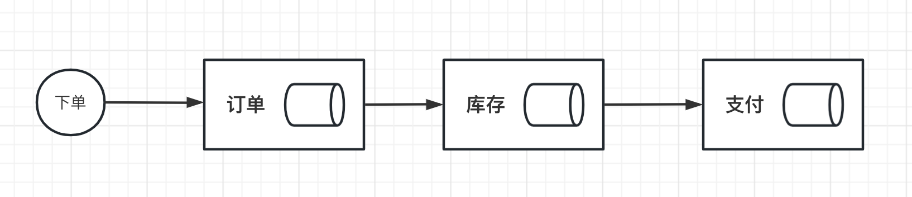

在传统的单体应用程序中，事务通常是通过使用数据库管理系统（DBMS）来实现的，而在分布式系统中，由于数据分布在多个节点上，使用传统的事务管理方法会遇到一些问题，例如：

- 数据冲突：在多个节点上同时对同一数据进行修改可能会导致数据不一致。
- 协调开销：要确保事务在所有节点上的一致性，必须进行协调，而协调开销可能很大。
- 故障处理：如果在事务执行期间发生故障，可能需要一些特殊的机制来确保事务的原子性和一致性。

因此，分布式系统中使用分布式事务来确保跨节点的事务的原子性、一致性、隔离性和持久性。使用分布式事务可以更好地管理分布式系统中的数据，确保数据的完整性和一致性，从而提高系统的可靠性和可扩展性。

## 请描述两阶段提交（2PC）协议的基本过程，以及它在分布式事务中的应用。

**岗位**：中高级工程师
**难度**：🌟🌟🌟🌟
**频率**：高频 🔥
**作者**：北冥
**备注**：笔记资料在评论区🔝置顶，🆓 免费领取 🆓

> 2PC即两阶段提交协议，是将整个事务流程分为两个阶段，准备阶段（Prepare phase）、提交阶段（commit phase），2是指两个阶段，P是指准备阶段，C是指提交阶段。

举例：张三和李四好久不见，老友约起聚餐，饭店老板要求先买单，才能出票。这时张三和李四分别抱怨近况不如意，囊中羞涩，都不愿意请客，这时只能AA。只有张三和李四都付款，老板才能出票安排就餐。但由于张三和李四都是铁公鸡，形成了尴尬的一幕：

1. 准备阶段：老板要求张三付款，张三付款。老板要求李四付款，李四付款。
2. 提交阶段：老板出票，两人拿票纷纷落座就餐。

例子中形成了一个事务，若张三或李四其中一人拒绝付款，或钱不够，店老板都不会给出票，并且会把已收款退回。整个事务过程由事务管理器和参与者组成，店老板就是事务管理器，张三、李四就是事务参与者，事务管理器负责决策整个分布式事务的提交和回滚，事务参与者负责自己本地事务的提交和回滚。

> 准备阶段（Prepare phase）：事务管理器给每个参与者发送Prepare消息，每个数据库参与者在本地执行事务，并写本地的Undo/Redo日志，此时事务没有提交。（Undo日志是记录修改前的数据，用于数据库回滚，Redo日志是记录修改后的数据，用于提交事务后写入数据文件）

> 提交阶段（commit phase）：如果事务管理器收到了参与者的执行失败或者超时消息时，直接给每个参与者发送回滚(Rollback)消息；否则，发送提交(Commit)消息；参与者根据事务管理器的指令执行提交或者回滚操作，并释放事务处理过程中使用的锁资源。注意:必须在最后阶段释放锁资源。

下图展示了2PC的两个阶段，分成功和失败两个情况说明：

成功情况：

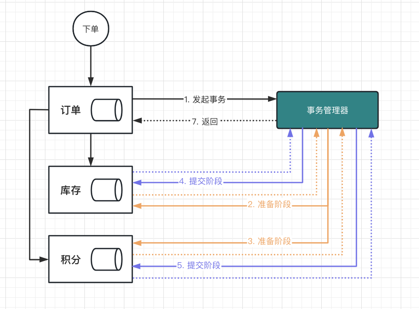

失败情况：

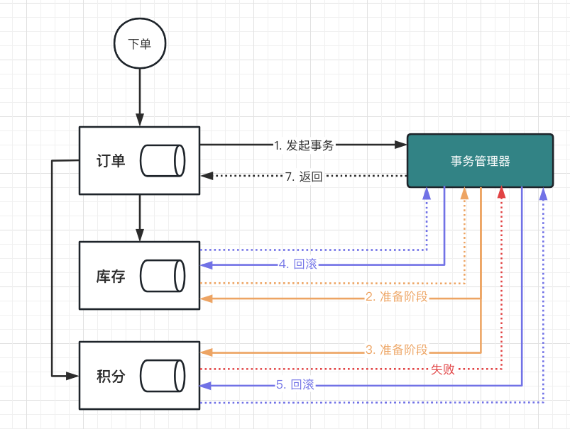

缺点：

> 两阶段提交是一个阻塞协议; 单个节点的失败阻塞了进度，直到该节点恢复。而且，如果事务协调器失败，那么数据库将处于不一致的状态，并且只有在协调器恢复后才能恢复。这将导致另一个缺点，因为协议的延迟取决于最慢的节点。因为它等待所有节点发送确认消息，所以单个慢节点将减慢整个事务的速度。

## 2PC协议中，如何处理协调者和参与者之间的通信故障？请列举一些解决方案。

**岗位**：高级工程师
**难度**：🌟🌟🌟🌟
**频率**：中频 🔥
**作者**：北冥
**备注**：笔记资料在评论区🔝置顶，🆓 免费领取 🆓

在2PC协议中，协调者和参与者之间的通信故障是不可避免的。为了保证分布式事务的一致性和可靠性，需要采取一些解决方案来处理这种故障。以下是几种常见的解决方案：

1. 超时机制：在2PC协议中，每个阶段都有一个预定的超时时间。如果在超时时间内没有收到响应，协调者将会进行相应的处理。例如，如果在第一阶段中协调者无法收到参与者的响应，它可以将参与者视为失败，并通知所有其他参与者回滚事务。
2. 心跳机制：协调者可以定期向参与者发送心跳消息，以检测参与者的状态。如果协调者在一段时间内没有收到参与者的响应，它可以将参与者视为失败并进行相应的处理。
3. 预备性提交：在第一阶段中，协调者可以请求参与者进行预备性提交，并在得到所有参与者的预备性提交确认后，将事务提交请求发给所有参与者。如果在第二阶段中，协调者无法收到某个参与者的确认消息，则可以向该参与者发送回滚请求。
4. 备份协调者：在2PC中，可以使用备份协调者来提高系统的可靠性。备份协调者可以监控协调者的状态，并在协调者失效时接替其工作。
5. 消息队列：参与者可以将事务日志写入消息队列，协调者可以从消息队列中获取事务日志，并进行相应的处理。如果协调者在处理事务时失效，备份协调者可以从消息队列中获取未处理的事务日志，并继续进行处理。

这些解决方案都可以有效地处理协调者和参与者之间的通信故障，保证分布式事务的可靠性和一致性。但是，在实际应用中，需要根据具体情况选择合适的方案，并根据系统的实际情况进行优化。

## 请介绍XA协议，并与2PC协议进行比较，指出它们的不同点和相似点。

**岗位**：中高级工程师
**难度**：🌟🌟🌟🌟
**频率**：中频 🔥

XA是一种扩展的事务处理架构，它提供了一种在分布式事务中使用2PC协议的方法。XA定义了一组标准接口，使得应用程序可以与分布式事务管理器（Distributed Transaction Manager，DTM）交互。DTM是一个负责协调分布式事务的组件，它负责实现2PC协议，并将XA接口暴露给应用程序。通过XA接口，应用程序可以参与到分布式事务中，并与DTM进行交互。

2PC是一种用于协调分布式事务的协议，它由一个协调者和多个参与者组成。在2PC中，协调者会向所有参与者发出询问是否准备提交事务的请求。如果所有参与者都准备好提交事务，协调者会发出提交请求；否则，协调者会发出回滚请求。2PC是一种强一致性协议，保证了分布式事务的原子性和一致性。

相似点：

1. XA协议和2PC协议都用于协调分布式事务的提交和回滚。
2. XA协议和2PC协议都需要一个协调者和多个参与者来实现。
3. XA协议和2PC协议都需要对参与者的状态进行确认，以保证事务的一致性。

不同点：

1. XA协议是基于2PC协议的扩展，它定义了一组标准接口，使得应用程序可以与分布式事务管理器（DTM）进行交互。
2. 在2PC协议中，所有参与者都必须同意提交或回滚事务，否则整个事务将被回滚。而在XA协议中，每个参与者都可以独立决定是否提交或回滚事务。
3. XA协议支持多个资源管理器，每个资源管理器负责管理一个资源，例如数据库或消息队列。而2PC协议只能处理单个资源的事务。
4. 在XA协议中，DTM会记录每个资源的事务状态，并在需要时进行恢复。而在2PC协议中，协调者负责维护事务状态。

总之，XA协议是2PC协议的一种扩展，它提供了更多的功能和灵活性，使得分布式事务处理更加高效和可靠。但是，由于XA协议需要多个资源管理器的支持，实现和维护的成本也会相应地增加。

## 在2PC协议中分布式事务是否有用全局事务ID，为什么要全局事务ID呢？

全局事务ID是一个在分布式事务中用来唯一标识一次事务的ID。在2PC协议中，全局事务ID通常由协调者在第一阶段中生成，并在整个事务过程中传递给所有的参与者。全局事务ID的主要作用是：

1. 识别和标识事务：全局事务ID可以用来标识一次分布式事务，确保事务在整个过程中唯一。这对于保证事务的正确性和一致性非常重要。
2. 管理事务状态：在分布式事务中，全局事务ID可以用于管理事务状态。协调者会将事务状态和全局事务ID关联起来，以便在后续的操作中进行检查和协调。
3. 进行事务恢复：在分布式系统中，由于网络故障等原因，可能会导致分布式事务的中断。在这种情况下，全局事务ID可以用于恢复事务状态，并重新发起事务。

在2PC协议中，全局事务ID通常由协调者生成，并在整个事务过程中贯穿始终。**在第一阶段中**，协调者会向所有参与者发送一个包含全局事务ID的询问消息，以确认参与者是否准备好提交事务。**在第二阶段中**，协调者会向所有参与者发送一个包含全局事务ID的提交或回滚请求。

具体的逻辑是，`协调者在生成全局事务ID后，将其分配给当前事务`，并将其传递给所有参与者。参与者接收到全局事务ID后，将其存储在本地，并在后续的操作中使用它来识别和协调分布式事务。

1. 协调者在生成全局事务ID后，向所有参与者发送一个询问消息，以确认是否准备提交事务。询问消息中包含全局事务ID。
2. 参与者接收到询问消息后，将全局事务ID存储在本地，并进行相应的处理。如果准备好提交事务，参与者会向协调者发送确认消息，并在消息中携带全局事务ID。
3. 协调者在收到所有参与者的确认消息后，会向所有参与者发送提交请求或回滚请求。请求中包含全局事务ID，用于标识当前的分布式事务。
4. 参与者接收到提交请求或回滚请求后，会检查其中的全局事务ID是否与本地存储的一致。如果一致，参与者会执行相应的操作，并向协调者发送确认消息。

例如，在第一阶段中，参与者会向协调者发送一个确认消息，其中包含当前事务的全局事务ID。协调者收到确认消息后，将确认消息存储在本地，并等待所有参与者的确认消息。在第二阶段中，协调者会向所有参与者发送一个提交或回滚请求，并在请求中携带当前事务的全局事务ID。参与者接收到请求后，会检查其中的全局事务ID是否与本地存储的一致，以确保事务的正确性和一致性。

> 在2PC协议中，全局事务ID是一个非常重要的概念，它用于标识分布式事务的唯一性，并在协调者和参与者之间进行通信和协调。同时，全局事务ID也是实现分布式事务的基础，对于保证分布式事务的正确性和一致性具有至关重要的作用。

## 说说你了解的3PC协议，它在2PC的基础之上进行了哪些优化呢？

**岗位**：中高级工程师
**难度**：🌟🌟🌟
**频率**：高频 🔥
**作者**：北冥
**备注**：笔记资料在评论区🔝置顶，🆓 免费领取 🆓

三阶段提交协议（3PC, Three-Phase Commit）是在两阶段提交协议（2PC）的基础上进行了优化的一种分布式事务协议。它通过增加一个额外的阶段来减少同步阻塞和单点故障的风险。3PC协议的三个阶段如下：

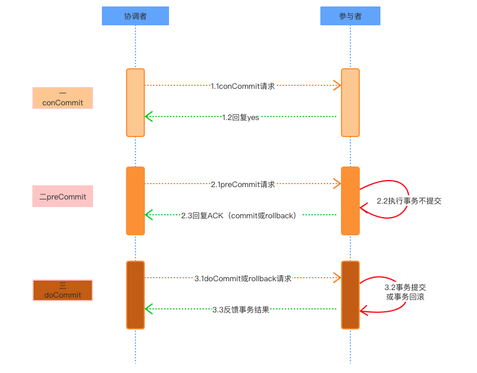

- CanCommit阶段：协调者向所有参与者发送CanCommit请求，询问它们是否可以提交事务。参与者收到请求后，根据自身状态回复协调者，如果可以提交事务，则返回"Yes"；如果不能提交事务，则返回"No"。
- PreCommit阶段：协调者根据参与者的回复来决定整个事务是继续还是放弃。如果所有参与者都返回"Yes"，协调者会向它们发送PreCommit请求；如果有参与者返回"No"，协调者会向所有参与者发送Abort请求。参与者收到PreCommit请求后，会执行事务操作，但不会立即提交，而是将其置于“就绪”状态，等待协调者的下一步指示。
- DoCommit阶段：协调者会根据参与者的状态决定事务的最终结果。如果所有参与者都处于就绪状态，协调者会向它们发送DoCommit请求，要求它们提交事务；如果有参与者未处于就绪状态，协调者会向所有参与者发送Abort请求，要求它们放弃事务。

3PC协议相较于2PC的优化点：

- 减少阻塞：3PC引入了超时机制，使得协调者和参与者在等待对方响应时可以设置超时，避免无限期的等待。如果在规定时间内未收到响应，参与者或协调者可以自行决定事务的提交或回滚，减少了阻塞问题。
- 避免单点故障：在3PC协议中，协调者和参与者都会维护一个本地事务日志。这使得在协调者出现故障时，参与者可以根据本地日志自主决定事务的提交或回滚，从而降低了单点故障的风险。

尽管3PC协议在2PC基础上进行了优化，尽管3PC协议在2PC的基础上进行了一定程度的优化，但并没有从根本上解决2PC存在的问题。以下是一些关键点：

1. 网络分区问题：当网络发生分区时，3PC协议依然可能出现问题。例如，在PreCommit阶段，如果协调者向参与者发送DoCommit请求时发生网络分区，部分参与者可能收不到请求而无法提交事务。尽管3PC协议引入了超时机制，但在网络分区的情况下，超时机制并不能完全保证一致性。
2. 同步阻塞：尽管3PC协议通过超时机制降低了同步阻塞的风险，但在某些情况下，参与者仍然需要等待协调者的决策。因此，3PC协议并没有完全消除同步阻塞问题。
3. 高可用性和性能：与2PC协议一样，3PC协议仍然需要协调者和参与者之间的多次通信来达成一致性。这在一定程度上影响了系统的可用性和性能。
4. 节点故障问题：虽然3PC协议引入了本地事务日志以降低单点故障的风险，但如果协调者和参与者之间的故障同时发生，仍然可能导致数据不一致问题。

因此，虽然3PC协议在某些方面优化了2PC协议，但并没有从根本上解决分布式事务中的一致性、可用性和性能问题。在实际应用中，根据具体需求和场景，可能需要采用其他方法，如补偿事务、Saga模式或最终一致性等，来解决分布式事务的挑战。

## 说说你了解的TCC协议，以及它在分布式事务中的应用。

**岗位**：中高级工程师
**难度**：🌟🌟🌟
**频率**：高频 🔥
**作者**：北冥
**备注**：笔记资料在评论区🔝置顶，🆓 免费领取 🆓

TCC协议是一种基于补偿机制的分布式事务协议，它通过三个阶段来实现事务的原子性和一致性。这三个阶段分别是：
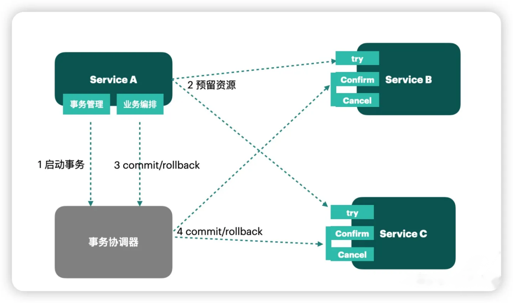

1.  尝试（Try）：在这个阶段，TCC协议会尝试执行所有的事务操作。这些操作不会直接影响数据库中的数据，而是会在本地进行预处理，并在本地缓存中记录下来。如果在执行过程中出现任何问题，TCC协议将直接跳转到撤销阶段。 
2.  确认（Confirm）：在这个阶段，TCC协议会检查所有事务操作是否都已经成功执行。如果所有的事务操作都已经成功执行，TCC协议会将这些操作提交到数据库中，从而使它们变为永久性的更改。如果有任何一个操作失败，TCC协议将直接跳转到撤销阶段。 
3.  撤销（Cancel）：在这个阶段，TCC协议会执行所有已经执行的事务操作的逆操作。这些逆操作会将数据库中的数据恢复到事务执行之前的状态，从而实现事务的撤销。 

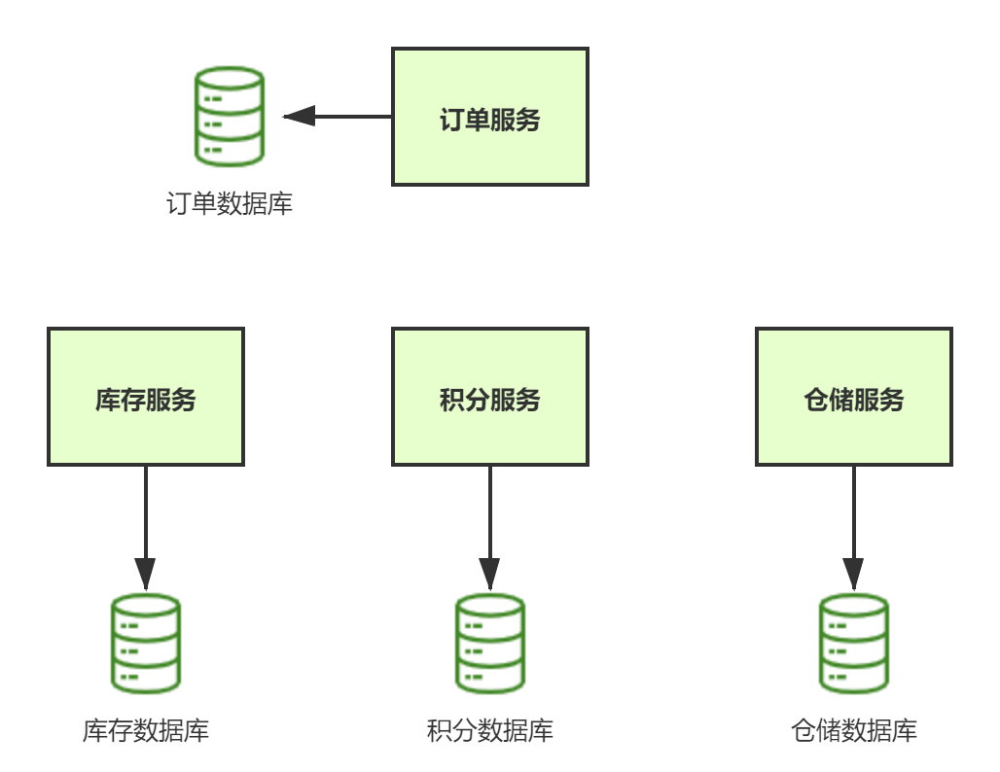

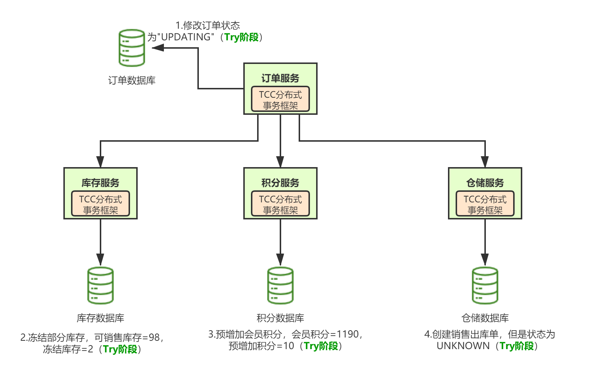

### 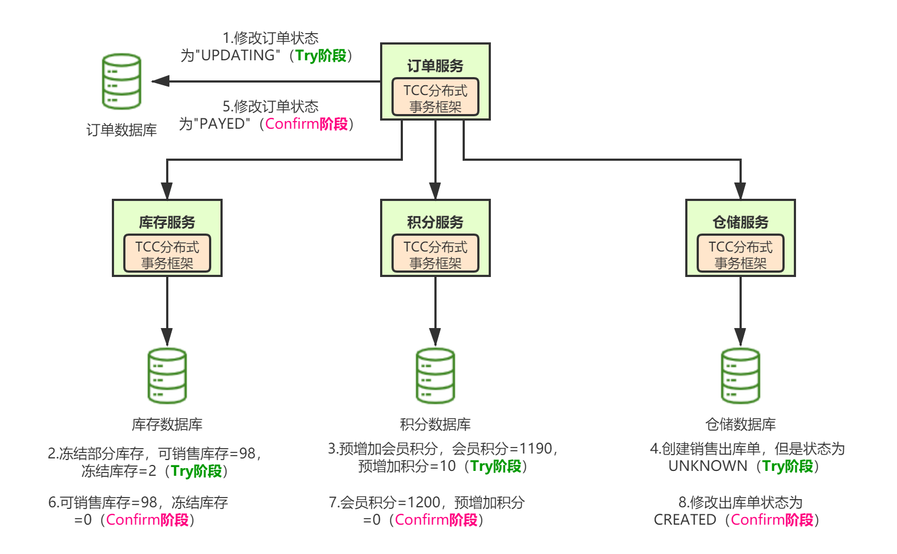

### 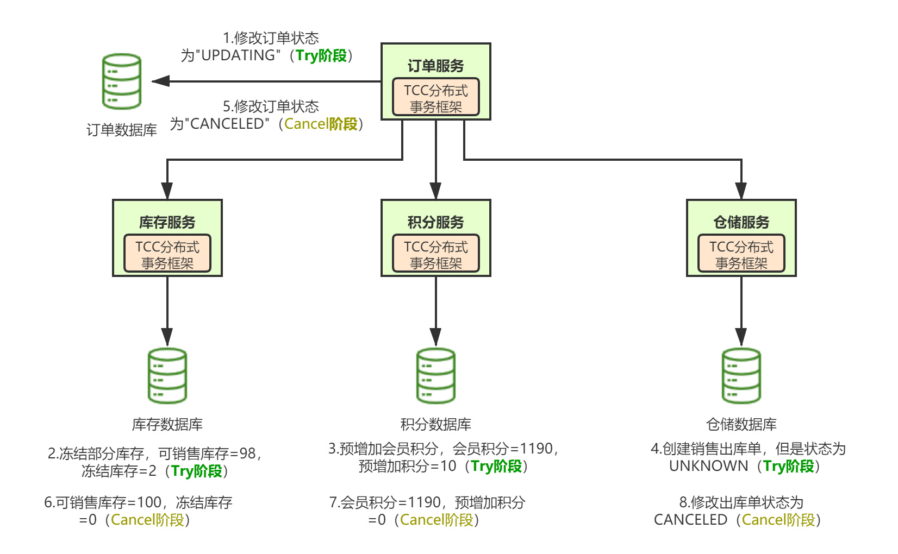TCC协议的优点

1.  高可靠性：TCC协议采用的是补偿机制，即在执行操作前会进行预处理，并在本地缓存中记录下来。如果在执行过程中出现任何问题，TCC协议会直接跳转到撤销阶段，从而避免了数据不一致的问题。 
2.  可扩展性强：TCC协议的实现相对简单，可以方便地扩展到更大规模的分布式系统中。 
3.  数据一致性高：TCC协议通过三个阶段来保证事务的原子性和一致性，从而保证了数据的一致性和可靠性。 

### TCC协议的缺点

1.  实现复杂：TCC协议的实现相对复杂，需要对每个事务操作都进行预处理，并在本地缓存中记录下来。这会增加代码的复杂度和执行时间。 
2.  性能损失：TCC协议需要在每个参与方都执行三个阶段的操作，从而增加了系统的负载和网络延迟，导致性能损失。 
3.  并发度低：TCC协议需要在每个阶段都进行锁定操作，从而限制了事务的并发度。 

### TCC协议的应用

TCC协议广泛应用于分布式系统中的事务操作，特别是在微服务架构中，TCC协议可以实现服务间的数据交互和事务操作。例如，在购物网站中，当用户下单时，需要对库存进行扣减和支付操作。这些操作涉及多个服务，采用TCC协议可以保证事务的原子性和一致性。具体地，TCC协议可以实现如下操作：

1.  尝试阶段：库存服务会预留相应数量的库存，并在本地缓存中记录下来。支付服务会进行支付预授权，并在本地缓存中记录下来。 
2.  确认阶段：如果库存服务和支付服务都成功预处理，那么它们会在本地进行事务提交，并将结果提交到数据库中。如果有任何一个服务失败，那么它们会跳转到撤销阶段。 
3.  撤销阶段：如果有任何一个服务失败，那么它们会执行相应的逆操作，并将数据恢复到事务执行之前的状态。 

### 总结

TCC协议是一种基于补偿机制的分布式事务协议，可以保证数据的一致性和可靠性。虽然TCC协议存在一些缺点，如实现复杂、性能损失和并发度低等问题，但其优点也十分明显，如高可靠性、可扩展性强和数据一致性高等。在实际应用中，可以根据具体需求和场景选择合适的分布式事务协议。

## 请描述AT模式的基本过程，以及它在分布式事务中的应用。

**岗位**：中高级工程师
**难度**：🌟🌟🌟
**频率**：高频 🔥
**作者**：北冥
**备注**：笔记资料在评论区🔝置顶，🆓 免费领取 🆓

AT模式（自动补偿型事务模式，Automatic Transaction）可以被认为是二阶段提交协议（2PC，Two-Phase Commit）的一种变种。然而，AT模式的主要特点是在事务过程中引入了补偿操作，以解决传统2PC中的某些问题。

在分布式事务中，AT模式通过使用一种称为“业务补偿”的方法，对事务过程进行改进。在AT模式下，分布式系统中的每个参与者（即各个子系统）都会在完成本地事务后，生成一个补偿操作。补偿操作用于在事务失败时，将已完成的本地事务回滚到之前的状态。通过这种方式，AT模式可以确保分布式事务的一致性，同时避免了传统2PC中的阻塞问题。

### AT模式

AT模式是一种分布式事务解决方案，它是基于本地事务和全局事务协调者（Coordinator）实现的。AT模式包含两个阶段：尝试阶段和确认阶段。

在AT模式中，全局事务协调者（Coordinator）负责管理和协调分布式事务，而参与者（Participant）则负责执行本地事务并向协调者报告其执行结果。
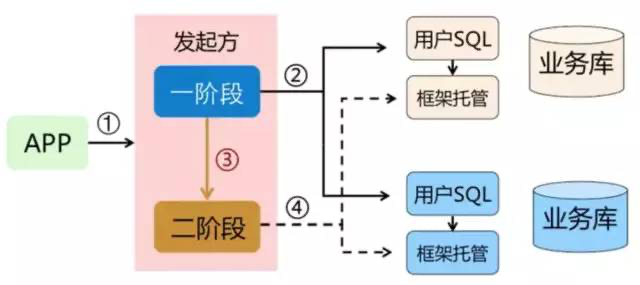
具体来说，AT模式的执行过程如下：

1.  尝试阶段：协调者向所有参与者发送分布式事务的开始请求，参与者收到请求后会执行本地事务，并将执行结果返回给协调者。此时，参与者并不会立即提交事务，而是等待协调者的确认。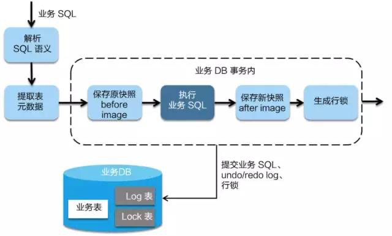 
2.  确认阶段：在协调者收到所有参与者的执行结果后，会对这些结果进行汇总和分析。如果所有参与者都成功执行了本地事务，则协调者会向所有参与者发送提交事务的请求，参与者收到请求后会提交本地事务并向协调者返回提交结果。如果任何一个参与者在执行本地事务时出现了错误或者超时，协调者会向所有参与者发送回滚事务的请求，参与者收到请求后会撤销本地事务并向协调者返回回滚结果。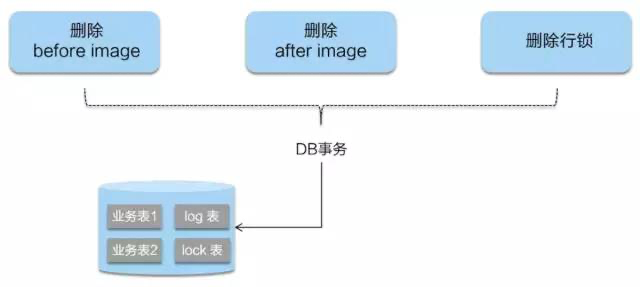 

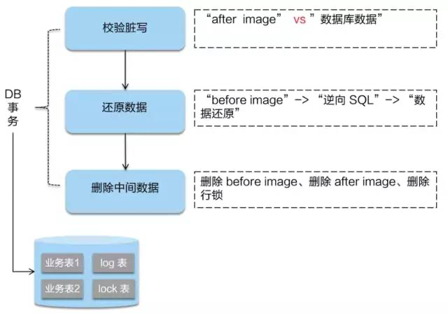

AT模式相对于其他分布式事务解决方案具有以下优点：

1. 可以提供较高的性能和吞吐量，因为每个参与者可以独立执行本地事务，而不需要等待全局协调。
2. 实现较为简单，不需要引入其他复杂的组件或者技术。
3. 可以提供较好的可靠性和容错能力，即使一个或多个参与者出现故障，也可以通过回滚事务来保证数据的一致性。

但是，AT模式也存在一些缺点：

1. 在尝试阶段，参与者需要锁定所涉及的资源，这会增加系统的并发性能开销。
2. 如果在确认阶段出现协调者故障，则需要使用一些额外的机制来恢复事务，否则可能会导致数据的不一致性。
3. AT模式无法处理参与者之间存在依赖关系的事务，例如，如果一个事务的结果依赖于另一个事务的结果，则无法使用AT模式来处理。

### TCC模式

> TCC模式是另一种分布式事务解决方案，它是基于“尝试(Try) - 确认(Confirm) - 撤销(Cancel)”三个阶段实现的。TCC模式通过自定义业务逻辑来保证分布式事务的一致性，它将分布式事务的操作拆分为三个阶段，并在每个阶段实现自定义逻辑和可靠性控制。

具体来说，TCC模式的执行过程如下：

1. 尝试阶段：参与者在执行分布式事务之前，首先会执行Try阶段，Try阶段会尝试预留资源和执行分布式事务，这一阶段不会对外部系统产生任何影响。
2. 确认阶段：如果所有参与者的Try阶段都执行成功，那么就会进入Confirm阶段，Confirm阶段会将预留的资源占用，并且执行真正的分布式事务。
3. 撤销阶段：如果有任何一个参与者的Try阶段或Confirm阶段执行失败，那么就会进入Cancel阶段，Cancel阶段会释放预留的资源，并执行事务的撤销操作。

TCC模式相对于其他分布式事务解决方案具有以下优点：

1. 可以提供较高的灵活性，因为TCC模式将分布式事务的执行过程拆分成三个阶段，每个阶段可以实现自定义逻辑和可靠性控制。
2. 可以实现较好的可靠性和容错能力，即使一个或多个参与者出现故障，也可以通过执行Cancel阶段来保证数据的一致性。
3. 可以提供较好的性能和吞吐量，因为TCC模式在Try阶段和Cancel阶段不需要锁定资源，可以提高系统的并发性能。

但是，TCC模式也存在一些缺点：

1. 实现较为复杂，需要在每个阶段实现自定义逻辑和可靠性控制，这会增加开发和维护成本。
2. TCC模式需要对业务逻辑进行拆分，有时需要对原有业务进行较大的改造。
3. 如果参与者之间存在依赖关系，例如，一个事务的结果依赖于另一个事务的结果，那么可能需要引入其他的机制来协调和处理依赖关系。

### Saga模式

> Saga模式是一种基于协作式分布式事务实现的分布式事务解决方案。Saga模式将一个分布式事务拆分成多个局部事务，并在每个局部事务中实现自定义的补偿逻辑，以保证分布式事务的一致性。

具体来说，Saga模式的执行过程如下：

1. Saga的执行过程从一个主事务开始，在主事务中会涉及多个局部事务，每个局部事务都由对应的参与者来执行。
2. 当一个局部事务执行失败时，Saga模式会使用补偿事务来回滚已经执行过的操作。补偿事务是指在分布式系统中，撤销之前的操作，以使事务回滚到之前的状态。
3. 当所有局部事务都执行成功时，Saga模式会提交主事务。

Saga模式相对于其他分布式事务解决方案具有以下优点：

1. 可以提供较高的灵活性，因为Saga模式将分布式事务拆分成多个局部事务，并且每个局部事务都可以实现自定义的补偿逻辑，以适应不同的业务场景和需求。
2. 可以实现较好的可靠性和容错能力，即使一个或多个参与者出现故障，也可以通过执行补偿事务来保证数据的一致性。
3. 可以提供较好的性能和吞吐量，因为Saga模式在执行过程中不需要锁定资源，可以提高系统的并发性能。

但是，Saga模式也存在一些缺点：

1. 实现较为复杂，需要在每个局部事务中实现自定义的补偿逻辑，这会增加开发和维护成本。
2. Saga模式需要对业务逻辑进行拆分，有时需要对原有业务进行较大的改造。
3. Saga模式存在一定的局限性，例如，无法处理参与者之间存在依赖关系的事务，例如，一个事务的结果依赖于另一个事务的结果，可能需要引入其他的机制来协调和处理依赖关系。

### 总结

三种补偿性事务的选择和应用都取决于具体的业务需求和场景。下面将从以下几个方面对三种补偿性事务进行评测：

- 一致性保证：AT模式和TCC模式在执行过程中都可以保证分布式事务的一致性，而Saga模式则只能在执行过程中最终保证分布式事务的一致性。因此，在对一致性的要求较高的场景下，AT模式和TCC模式更适合使用。
- 可靠性和容错能力：三种补偿性事务都可以提供一定程度的容错能力和可靠性，但是每种模式的容错能力和可靠性控制机制略有不同。AT模式和TCC模式通过协调者来控制事务的提交和回滚，可以提供较好的可靠性和容错能力。Saga模式则通过执行补偿事务来控制事务的回滚，可以在一定程度上提供可靠性和容错能力。
- 性能和吞吐量：AT模式和TCC模式在执行过程中需要协调者来协调事务的提交和回滚，这可能会对性能和吞吐量产生一定的影响。相比之下，Saga模式在执行过程中不需要协调者，可以提供更好的性能和吞吐量。
- 实现复杂度：AT模式和TCC模式需要在各个参与者中实现一些特定的接口和协议，这可能会增加系统的实现复杂度和开发成本。相比之下，Saga模式的实现较为简单，只需要在每个局部事务中实现自定义的补偿逻辑即可。

综上所述，选择哪种补偿性事务方案取决于具体的业务场景和需求。如果对一致性要求较高，可以选择AT模式或TCC模式；如果对性能和吞吐量要求较高，可以选择Saga模式；如果对实现复杂度和开发成本要求较低，也可以选择Saga模式。需要根据具体的业务需求和场景来选择最适合的补偿性事务方案。

## 请描述Saga模式的基本过程，以及它在分布式事务中的应用。

**岗位**：中高级工程师
**难度**：🌟🌟🌟
**频率**：高频 🔥
**作者**：北冥
**备注**：笔记资料在评论区🔝置顶，🆓 免费领取 🆓

Saga是一种用于解决分布式事务问题的模式，它通过将一个复杂的事务拆分成多个小事务，从而保证了分布式系统中的数据一致性。Saga模式是分布式系统领域的一个经典问题，它已经成为了许多公司在处理分布式事务时的首选方案之一。

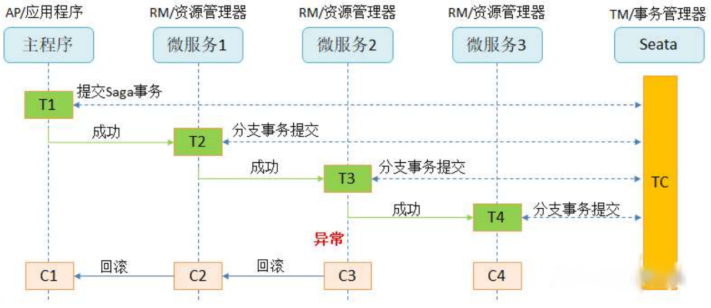

Saga的实现有很多种方式，其中最流行的两种方式是：

-  **基于事件的方式**。这种方式没有协调中心，整个模式的工作方式就像舞蹈一样，各个舞蹈演员按照预先编排的动作和走位各自表演，最终形成一只舞蹈。处于当前Saga下的各个服务，会产生某类事件，或者监听其它服务产生的事件并决定是否需要针对监听到的事件做出响应。 
-  **基于命令的方式**。这种方式的工作形式就像一只乐队，由一个指挥家（协调中心）来协调大家的工作。协调中心来告诉Saga的参与方应该执行哪一个本地事务。 

我们继续以订单流程为例，说明一下该模式。
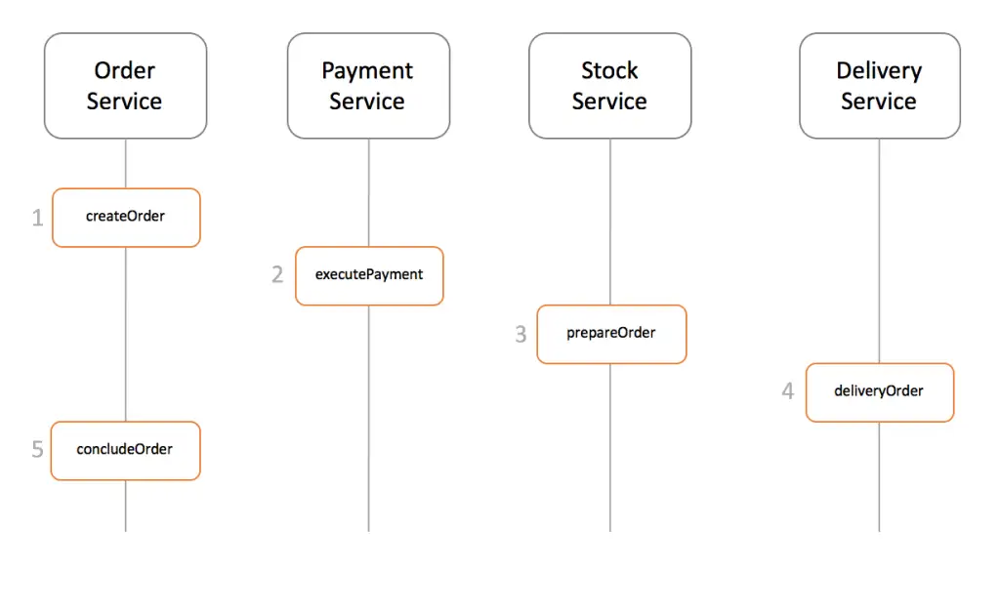
假设一个完整的订单流程包含了如下几个服务：

1. Order Service：订单服务
2. Payment Service：支付服务
3. Stock Service：库存服务
4. Delivery Service：物流服务

### 基于事件的方式

在基于事件的方式中，第一个服务执行完本地事务之后，会产生一个事件。其它服务会监听这个事件，触发该服务本地事务的执行，并产生新的事件。
采用基于事件的saga模式的订单处理流程如下：
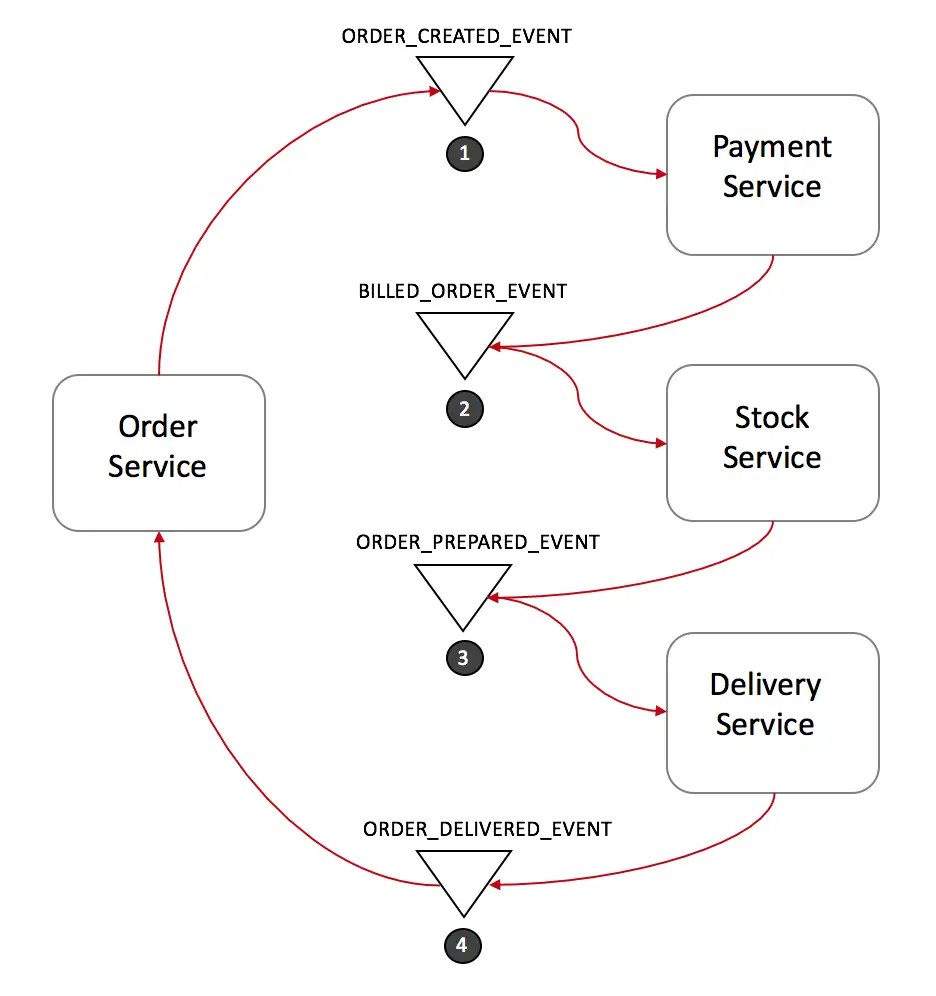

1. 订单服务创建一笔新订单，将订单状态设置为"待处理"，产生事件ORDER_CREATED_EVENT。
2. 支付服务监听ORDER_CREATED_EVENT，完成扣款并产生事件BILLED_ORDER_EVENT。
3. 库存服务监听BILLED_ORDER_EVENT，完成库存扣减和备货，产生事件ORDER_PREPARED_EVENT。
4. 物流服务监听ORDER_PREPARED_EVENT，完成商品配送，产生事件ORDER_DELIVERED_EVENT。
5. 订单服务监听ORDER_DELIVERED_EVENT，将订单状态更新为"完成"。

在这个流程中，订单服务很可能还会监听BILLED_ORDER_EVENT，ORDER_PREPARED_EVENT来完成订单状态的实时更新。将订单状态分别更新为"已经支付"和"已经出库"等状态来及时反映订单的最新状态。
**该模式下分布式事务的回滚**
为了在异常情况下回滚整个分布式事务，我们需要为相关服务提供补偿操作接口。
假设库存服务由于库存不足没能正确完成备货，我们可以按照下面的流程来回滚整个Saga事务：
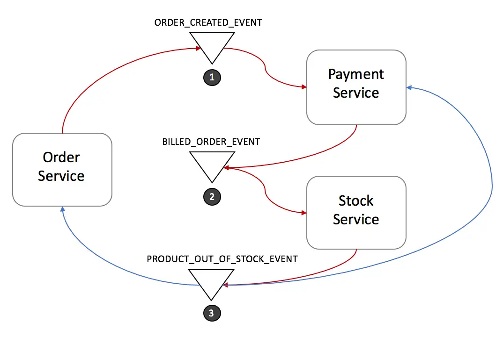

1. 库存服务产生事件PRODUCT_OUT_OF_STOCK_EVENT。
2. 订单服务和支付服务都会监听该事件并做出响应： 
   1. 支付服务完成退款。
   2. 订单服务将订单状态设置为"失败"。

**基于事件方式的优缺点**
**优点**：简单且容易理解。各参与方相互之间无直接沟通，完全解耦。这种方式比较适合整个分布式事务只有2-4个步骤的情形。
**缺点**：这种方式如果涉及比较多的业务参与方，则比较容易失控。各业务参与方可随意监听对方的消息，以至于最后没人知道到底有哪些系统在监听哪些消息。更悲催的是，这个模式还可能产生环形监听，也就是两个业务方相互监听对方所产生的事件。
接下来，我们将介绍如何使用命令的方式来克服上面提到的缺点。

### 基于命令的方式

在基于命令的方式中，我们会定义一个新的服务，这个服务扮演的角色就和一支交响乐乐队的指挥一样，告诉各个业务参与方，在什么时候做什么事情。我们管这个新服务叫做协调中心。协调中心通过命令/回复的方式来和Saga中其它服务进行交互。
我们继续以之前的订单流程来举例。下图中的Order Saga Orchestrator就是新引入的协调中心。
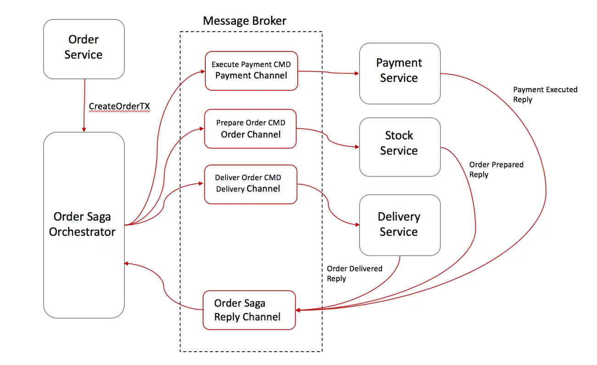

1. 订单服务创建一笔新订单，将订单状态设置为"待处理"，然后让Order Saga Orchestrator（OSO）开启创建订单事务。
2. OSO发送一个"支付命令"给支付服务，支付服务完成扣款并回复"支付完成"消息。
3. OSO发送一个"备货命令"给库存服务，库存服务完成库存扣减和备货，并回复"出库"消息。
4. OSO发送一个"配送命令"给物流服务，物流服务完成配送，并回复"配送完成"消息。
5. OSO向订单服务发送"订单结束命令"给订单服务，订单服务将订单状态设置为"完成"。
6. OSO清楚一个订单处理Saga的具体流程，并在出现异常时向相关服务发送补偿命令来回滚整个分布式事务。

实现协调中心的一个比较好的方式是使用**状态机(Sate Machine)**。
**该模式下分布式事务的回滚**
该模式下的回滚流程如下：
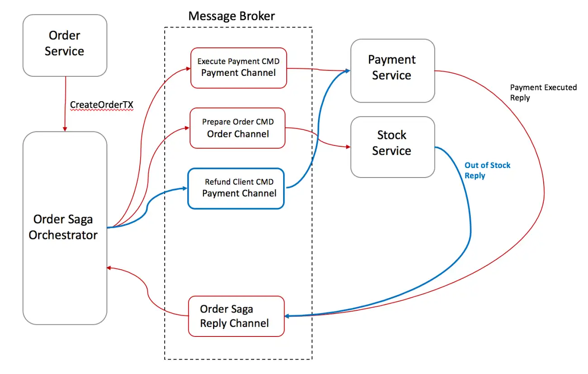

1. 库存服务回复OSO一个"库存不足"消息。
2. OSO意识到该分布式事务失败了，触发回滚流程：
3. OSO发送"退款命令"给支付服务，支付服务完成退款并回复"退款成功"消息。
4. OSO向订单服务发送"将订单状态改为失败命令"，订单服务将订单状态更新为"失败"。

**基于命令方式的优缺点**
优点：

1. 避免了业务方之间的环形依赖。
2. 将分布式事务的管理交由协调中心管理，协调中心对整个逻辑非常清楚。
3. 减少了业务参与方的复杂度。这些业务参与方不再需要监听不同的消息，只是需要响应命令并回复消息。
4. 测试更容易（分布式事务逻辑存在于协调中心，而不是分散在各业务方）。
5. 回滚也更容易。

缺点：

1. 一个可能的缺点就是需要维护协调中心，而这个协调中心并不属于任何业务方。

### Saga模式建议

1，给每一个分布式事务创建一个唯一的Tx id。这个唯一的Tx id可以用来在各个业务参与方沟通时精确定位哪一笔分布式事务。
2，对于基于命令的方式，在命令中携带回复地址。这种方式可以让服务同时响应多个协调中心请求。
3，幂等性。幂等性能够增加系统的容错性，让各个业务参与方服务提供幂等性操作，能够在遇到异常情况下进行重试。
4，尽量在命令或者消息中携带下游处理需要的业务数据，避免下游处理时需要调用消息产生方接口获取更多数据。减少系统之间的相互依赖。

> 原文: <https://www.yuque.com/tulingzhouyu/db22bv/wg2vg0upumgncqas>