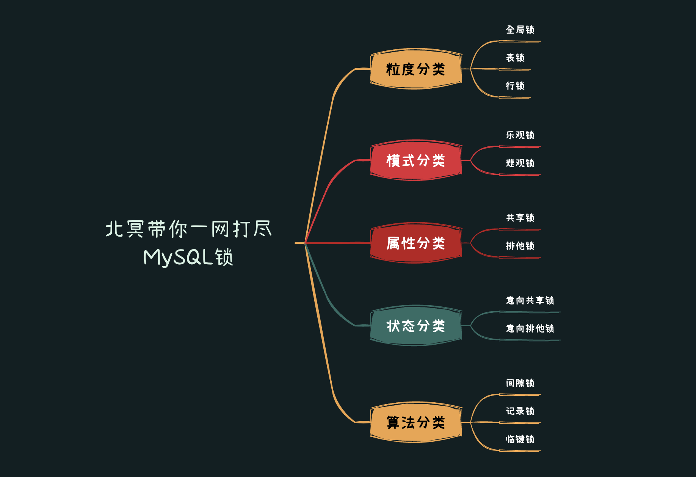
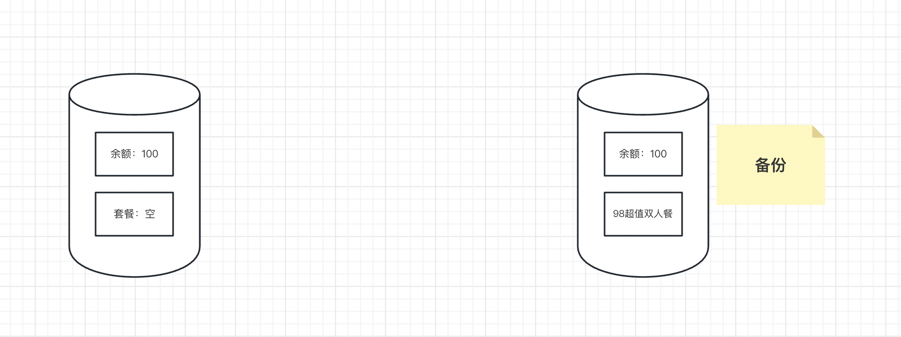

# 😇 史上最全MySQL各种锁详解


一、前言
锁是计算机在执行多线程或线程时用于并发访问同一共享资源时的同步机制，MySQL中的锁是在服务器层或者存储引擎层实现的，保证了数据访问的一致性与有效性。
MySQL锁可以按模式分类为：乐观锁与悲观锁。按粒度分可以分为全局锁、表级锁、页级锁、行级锁。按属性可以分为：共享锁、排它锁。按状态分为：意向共享锁、意向排它锁。按算法分为：间隙锁、临键锁、记录锁。

# 粒度锁

## 全局锁

### Q: 什么是全局锁？
MySQL的锁定主要分为全局锁、表锁和行锁。现在我们来看看MySQL全局锁。
MySQL全局锁是针对整个数据库的锁。最常用的全局锁是读锁和写锁。

1. **读锁（共享锁）**：它阻止其他用户更新数据，但允许他们读取数据。这在你需要在一段时间内保持数据一致性时很有用。
2. **写锁（排他锁）**：它阻止其他用户读取和更新数据。这在你需要修改一些大量的数据，并且不希望其他用户在这段时间内干扰时很有用。

MySQL全局锁的典型使用场景是，进行一些需要确保整个数据库一致性的操作，例如全库备份、全库导出等。
在MySQL中，可以使用`**FLUSH TABLES WITH READ LOCK(FTWRL)**`语句来添加全局读锁，这将阻止其他线程进行更新操作。使用`**UNLOCK TABLES**`语句来释放锁定。
请注意，全局锁的开销非常大，因为它会阻止其他所有的数据修改操作，并且在高并发情况下可能导致大量的线程等待锁定。因此，你应该尽量避免在生产环境中使用全局锁，或者尽量减少全局锁的持有时间。
虽然全局锁有其应用场景，但是过度使用或不正确使用全局锁可能导致性能问题。因此，根据应用的特性和需求选择适合的锁策略是很重要的。对于大多数应用，优先使用更精细粒度的锁，如行锁和表锁，可以更有效地处理并发请求，同时避免全局锁的开销。


### Q: 全局锁有哪些应用场景

1. **备份全库**：使用全局锁可以确保在备份过程中，数据库的所有表都保持一致的状态。例如，可以使用**FLUSH TABLES WITH READ LOCK**命令在备份期间阻止任何写操作，以确保备份数据的一致性。
2. **整体数据迁移**：如果你需要将整个数据库从一个服务器迁移到另一个服务器，那么在迁移过程中，你可能希望阻止任何写操作，以确保所有的数据都被正确地迁移到新的服务器。
3. **全库只读**：在某些情况下，你可能希望将整个数据库设置为只读模式。例如，如果你在进行一些可能破坏数据完整性的操作，或者在进行系统维护时，可能需要将数据库设置为只读模式。在这种情况下，可以使用全局读锁

请注意，全局锁会对整个数据库进行锁定，可能会导致大量的请求阻塞，对性能影响很大。因此，尽管全局锁在某些情况下可能有用，但通常应当尽量避免在需要高并发处理能力的生产环境中使用全局锁。尤其是在处理大量并发写请求的应用中，过度使用全局锁可能会导致严重的性能问题。


## 表级锁

### Q：什么是表级锁？
表级锁是MySQL中最基本的锁策略，是MySQL最早采用的锁策略。表级锁的特点是开销小，加锁快，不会出现死锁；锁定粒度大，发生锁冲突的概率最高，并发度最低。
表锁有两种模式：

1. **表共享读锁（Table Read Lock）**：又称为表读锁，允许一个事务锁定的表进行读取操作，不允许其他事务对其进行写操作，但是可以进行读操作。读锁之间是不会互相阻塞的。
2. **表独占写锁（Table Write Lock）**：又称为表写锁，允许一个事务锁定的表进行读取和写入（更新）操作，但是其他任何事务都不能再对该表进行任何操作，必须等待表写锁结束。写锁会阻塞其他所有锁，包括读锁和写锁。

在MySQL中，对MyISAM表的读操作，会自动加上读锁，对MyISAM表的写操作，会自动加上写锁。
InnoDB引擎在必要情况下会使用表锁，但主要是使用行锁来实现多版本并发控制（MVCC），它能提供更好的并发性能和更少的锁冲突。
总的来说，表锁适用于读操作多、写操作少的应用，当并发争用不是特别激烈，以及记录级锁并发控制开销大于访问冲突开销的情况。在并发度高，或者写操作较多的情况下，表锁可能会成为瓶颈。

### Q：表级锁有哪些使用场景

1. **读密集型应用**：如果你的应用主要进行读取操作，很少进行写入操作，那么使用表级锁可能是一个好选择。因为表级读锁不会阻塞其他的读锁，所以这种场景下表级锁能够提供很高的性能。
2. **写操作不频繁的场景**：表级锁对写操作的处理并不高效，因为一个写锁会阻塞所有其他的锁，无论它们是读锁还是写锁。但是，如果你的应用不需要频繁地进行写操作，或者可以容忍写操作的延迟，那么使用表级锁可能是可行的。
3. **数据量不大的简单应用**：如果数据库的数据量不大，那么即使在写操作中，由于锁定整张表，对性能的影响也不大。
4. **全表更新或者删除**：在某些情况下，可能需要对一张表进行全表的更新或者删除操作，例如，删除表中的所有记录，或者更新表中所有记录的某个字段的值。在这种情况下，使用表级锁是合适的。

但要注意，虽然表级锁的开销较小，但由于其锁定粒度大，可能会导致并发度下降，特别是在写操作较多或者并发度较高的场景下。所以，如果应用的并发度较高，或者需要频繁进行写操作，那么可能需要考虑使用更精细粒度的锁，如行锁。

### Q：MySQL哪些命令会发生表级锁

1. **ALTER TABLE**：这个命令用于更改表的结构，如添加列、删除列、改变列的类型等。执行这个命令的时候，MySQL需要锁定整个表以防止在更改过程中有新的数据写入。
2. **DROP TABLE** 和 **TRUNCATE TABLE**：这两个命令都会导致表级锁。DROP TABLE命令会删除整个表，而TRUNCATE TABLE命令会删除表中的所有数据。在执行这些命令的时候，MySQL需要锁定整个表以防止在删除过程中有新的数据写入。
3. **LOCK TABLES**：这个命令可以显式地为一个或多个表加上读锁或写锁。LOCK TABLES命令后面可以跟上一系列的表名和锁模式，用来指定需要锁定哪些表，以及使用什么样的锁模式。例如，**LOCK TABLES t1 WRITE, t2 READ;**命令会给表t1加上写锁，给表t2加上读锁。
4. **全表扫描或大范围扫描**：对于MyISAM存储引擎，全表扫描或大范围扫描会触发表级锁。
5. **FLUSH TABLES WITH READ LOCK(FTWRL)**：这个命令可以给所有表加上全局读锁，其他会话在此期间不能对数据进行修改。

请注意，InnoDB存储引擎主要使用行级锁，并在一些情况下使用表级锁，比如在执行某些ALTER TABLE命令或者LOCK TABLES命令时。MyISAM存储引擎只支持表级锁。

### Q：MySQL表锁风险点

1. **性能下降**：因为表锁会锁定整个表，所以在高并发的环境中，它可能导致大量的请求阻塞，从而降低性能。对于读取和写入混合密集的负载，表锁可能会成为一个性能瓶颈。
2. **并发性能差**：表锁的最大问题在于其并发性能。一旦一个线程对表获得了写锁，其他线程的任何读写操作都会被阻塞，直到写锁被释放。同样的，如果一个读锁被持有，那么其他的写操作将被阻塞。这就使得并发性能大大降低。
3. **可能导致锁等待和超时**：在高并发的环境中，由于表级锁的粒度较大，可能会有很多线程在等待锁，如果等待的时间过长，可能会导致锁超时，进一步影响应用的性能和可用性。
4. **写操作影响大**：如果一个长时间运行的写操作（比如大数据量的UPDATE或者INSERT语句）获取了写锁，那么会阻塞所有其他的读操作和写操作，直到这个写操作完成。
5. **死锁的可能性**：虽然表锁本身不会出现死锁，但在多表操作中，如果没有按照一定的顺序获得锁，可能会导致死锁。

为了避免这些问题，我们通常会选择InnoDB存储引擎，它主要使用行级锁，可以提供更好的并发性能，并且在一定程度上减少了锁争用的问题。而且，InnoDB还支持事务，可以保证数据的一致性和完整性。在实际应用中，我们应该根据具体的业务需求和系统负载，选择合适的存储引擎和锁策略。

## 行锁

### Q：什么是行锁？
行级锁是MySQL中的一种锁定机制，它可以对数据库表中的单独一行进行锁定。相比于表级锁和页锁，行级锁的粒度更小，因此在处理高并发事务时，能提供更好的并发性能和更少的锁冲突。然而，行级锁也需要更多的内存和CPU资源，因为需要对每一行都进行管理。
在MySQL中，行级锁主要由InnoDB存储引擎提供。InnoDB支持两种类型的行级锁：共享锁（S锁）和排他锁（X锁）。

1. **共享锁（S锁）**：共享锁也称为读锁，它允许一个事务读取一行数据。当一行数据被共享锁锁定时，其他事务可以读取这行数据，但不能对其进行修改。
2. **排他锁（X锁）**：排他锁也称为写锁，它允许一个事务读取和修改一行数据。当一行数据被排他锁锁定时，其他事务不能读取也不能修改这行数据。

在实际使用中，InnoDB还提供了一种名为“间隙锁”（Gap Lock）的特性。间隙锁不仅锁定一个具体的行，还锁定它前后的“间隙”，即这一行之前的行和之后的行之间的空间。间隙锁可以防止其他事务插入新的行到已锁定行的前后，从而可以解决一些并发问题。
值得注意的是，行级锁只在事务中有效，也就是说，只有在一个事务开始（BEGIN）后并在事务提交（COMMIT）或回滚（ROLLBACK）之前，才能对数据行进行锁定。如果在非事务环境中执行SQL语句，那么InnoDB会在语句执行结束后立即释放所有的锁。

### Q：MySQL行锁有哪些使用场景
MySQL中的行级锁（Row Level Locks）通常在以下几种场景中被使用：

1. **高并发读写操作**：在需要高并发读写操作的场景中，行级锁可以提高性能和并发性，因为它允许多个事务并发地操作不同的行。
2. **单行操作**：对于需要操作单行数据的SQL语句（例如基于主键或者唯一索引的UPDATE、DELETE和INSERT语句），行级锁可以提供较好的并发性和性能。
3. **短期锁**：在需要对数据行进行短时间锁定的情况下，行级锁可以防止长时间阻塞其他事务。
4. **实现并发控制**：在需要确保数据一致性和隔离性的事务中，行级锁是实现并发控制的重要机制。
5. **复杂的事务处理**：在需要对多行数据进行复杂处理的事务中，可以使用行级锁来锁定这些行，防止在事务处理过程中数据被其他事务修改。

使用行级锁需要注意，由于行级锁的锁定粒度较小，它可能会消耗更多的系统资源（例如内存和CPU），特别是在处理大量数据时。此外，使用行级锁也可能导致死锁，需要使用合适的策略来避免死锁，例如在事务中按照一定的顺序锁定行。

### Q：MySQL那些命令会导致发生行锁？
在MySQL中，主要是InnoDB存储引擎提供了行级锁（Row Level Locking）。一般来说，以下这些类型的操作会导致InnoDB对数据行进行加锁：

1. **SELECT ... FOR UPDATE**：这种查询会对选定的行添加一个排他锁（X锁），这意味着其他事务不能修改这些行，也不能对这些行添加共享锁。
2. **SELECT ... LOCK IN SHARE MODE**：这种查询会对选定的行添加一个共享锁（S锁），这意味着其他事务不能修改这些行，但可以对这些行添加共享锁。
3. **INSERT**：插入操作会对新添加的行添加一个排他锁（X锁）。
4. **UPDATE**：更新操作会对被更新的行添加一个排他锁（X锁）。
5. **DELETE**：删除操作会对被删除的行添加一个排他锁（X锁）。

这些加锁操作都是在事务中进行的，即只有在事务开始（BEGIN）后并在事务提交（COMMIT）或回滚（ROLLBACK）之前，才会对数据行进行加锁。如果在非事务环境中执行上述SQL语句，那么InnoDB会在语句执行结束后立即释放所有的锁。
请注意，加锁的粒度和范围取决于WHERE子句中用到的索引。如果WHERE子句中用到了唯一索引（例如主键索引），那么InnoDB只会锁定匹配的行。如果没有用到唯一索引，那么InnoDB可能会锁定更多的行，甚至是整个表，这就可能导致锁冲突和性能问题。
此外，InnoDB还支持间隙锁（Gap Locks）和临键锁（Next-Key Locks），这两种锁都可以在某些情况下提供更好的并发控制。

### Q：MySQL行锁有什么风险点？
尽管行级锁（Row-Level Locking）可以提供高并发性并减少锁冲突，但在使用过程中也可能遇到一些风险和问题，主要包括以下几点：

1. **死锁**：当两个或更多的事务相互等待对方释放资源时，就会发生死锁。例如，事务1锁定了行A并试图锁定行B，同时事务2锁定了行B并试图锁定行A，这就形成了死锁。MySQL会检测到死锁并终止其中一个事务，但这仍可能导致性能问题和事务失败。
2. **锁升级**：如果一个事务试图锁定的行过多，InnoDB可能会将锁从行级升级为表级，这就可能导致更多的锁冲突。
3. **锁等待**：如果一个事务已经锁定了某行，其他试图访问这行的事务就必须等待，这可能导致性能下降。如果有大量的事务在等待锁，就可能导致系统出现性能瓶颈。
4. **资源消耗**：行级锁需要更多的内存来存储锁信息，而且需要更多的CPU时间来处理锁请求和释放锁。如果数据库中的行数非常多，或者并发事务的数量非常多，这可能会导致显著的资源消耗。
5. **难以调试和排查**：由于行级锁的粒度较小，如果出现性能问题或锁冲突，可能需要复杂的调试和排查工作来找出问题的原因。
6. **事务隔离级别**：不同的事务隔离级别会影响锁的行为和性能，可能需要根据具体的应用场景来调整事务隔离级别。

为了避免上述问题，需要合理地设计数据库表和索引，合理地编写SQL语句，合理地管理事务，以及合理地设置事务隔离级别。

# 乐观锁和悲观锁

## 乐观锁

### Q：什么是乐观锁？
乐观锁（Optimistic Locking）是一种在数据库操作中用于处理并发问题的技术。它的基本思想是假设在多个事务同时访问同一条数据时，冲突发生的概率较低，因此在操作数据时不会立即进行锁定，而是在提交数据更改时检查是否有其他事务修改了这条数据。如果没有，就提交更改，否则就回滚事务。
在MySQL中，乐观锁并没有内置的实现，但是可以通过一些编程技巧来实现。一种常见的实现方式是使用版本号（或时间戳）字段。每当一条记录被修改时，就增加版本号（或更新时间戳）。在更新记录时，先检查版本号（或时间戳）是否和读取记录时的版本号（或时间戳）一致，如果一致则执行更新并增加版本号（或更新时间戳），否则就拒绝更新。这样就可以保证只有当记录没有被其他事务修改时，当前事务的更改才会被提交。
乐观锁的优点在于，由于大部分时间都不需要锁定，所以在冲突较少的情况下可以获得较高的并发性能。然而，如果冲突较多，那么乐观锁可能会导致大量的事务回滚，从而影响性能。因此，选择使用乐观锁还是其他锁定技术，需要根据实际的并发情况和性能需求来决定。

### Q：乐观锁有哪些使用场景？
乐观锁（Optimistic Locking）是一种对并发控制的策略，适用于以下的应用场景：

1. **低冲突环境**：在多数情况下，数据并发修改的冲突较低，即同一时间内，同一条数据不会被多个事务同时修改。
2. **读多写少的场景**：在读操作远多于写操作的情况下，乐观锁可以避免由于频繁的读操作导致的不必要的锁定开销。
3. **短事务操作**：如果数据库的事务都是简短并且快速完成的，那么使用乐观锁可以减少因为等待锁而导致的时间消耗。
4. **分布式系统**：在分布式系统中，由于网络延迟等原因，事务冲突的可能性较低，因此乐观锁是一个合适的选择。
5. **互联网应用**：对于互联网应用，如电子商务网站，用户浏览商品和下单等操作，多数情况下是读取操作，且并发修改同一条数据的几率较小，因此使用乐观锁可以提高系统性能。

需要注意的是，如果事务冲突的可能性较高，或者需要长时间锁定某个资源，那么使用乐观锁可能会导致大量的事务冲突和回滚，这种情况下，悲观锁或者其他并发控制技术可能会是更好的选择。

### Q：MySQL如何使用乐观锁
在MySQL中，乐观锁并没有明确的SQL语句或命令，通常是通过在应用程序代码中实现特定的逻辑来达到乐观锁的效果。一个常见的实现乐观锁的方式是使用版本号或者时间戳字段。
假设我们有一个名为`Products`的表，其中有一个`version`字段用于实现乐观锁：
```sql
CREATE TABLE Products (
    id INT PRIMARY KEY,
    name VARCHAR(50),
    quantity INT,
    version INT
);
```
以下是使用乐观锁进行数据更新的一般步骤：

1.  **读取数据**：首先读取要更新的数据，包括版本号。 
```sql
SELECT id, name, quantity, version FROM Products WHERE id = 1;
```

2.  **修改数据**：在应用程序中修改数据。 
3.  **更新数据**：更新数据时，需要检查版本号是否仍然和原来读取的版本号一致。如果一致，就增加版本号并更新数据；如果不一致，说明数据已经被其他事务修改过，因此应该回滚当前事务。 
```sql
UPDATE Products 
SET name = 'NewName', quantity = 10, version = version + 1 
WHERE id = 1 AND version = :oldVersion;
```
其中，`:oldVersion`是参数，应该替换为原来读取的版本号。 
如果更新操作影响的行数（可以通过检查UPDATE语句的返回值得到）等于0，那么说明版本号不匹配，应该回滚当前事务。具体的回滚操作取决于你的应用程序和事务管理器的具体实现。
请注意，乐观锁适用于冲突较少的情况。如果你的应用中有大量的冲突，那么可能需要使用悲观锁或其他并发控制技术。

### Q：乐观锁的缺点

1. 冲突检测：在高并发的环境中，乐观锁可能会导致大量的冲突。因为乐观锁只有在提交事务时才检查是否有冲突，如果多个事务在同一时间操作同一行，那么只有一个事务能提交成功，其他的事务都需要回滚并重新尝试。
2. 处理开销：在冲突发生时，需要进行回滚和重试，这可能会增加系统的开销。在一些场景中，这可能会导致性能下降。
3. 版本管理：乐观锁通常通过版本号（或时间戳）来检测冲突。这就要求系统能够正确地管理这些版本号，否则可能会导致错误的冲突检测。
4. 编程复杂性：使用乐观锁需要更复杂的编程，因为程序需要处理可能发生的冲突和重试。

总的来说，乐观锁是一种有效的并发控制策略，但在冲突较多的情况下，可能会带来更大的开销和编程复杂性。因此，是否选择使用乐观锁，需要根据应用的具体需求和场景来决定。

## 悲观锁

### Q：什么是悲观锁？
悲观锁（Pessimistic Locking）是一种并发控制的方法，基于一个假设：认为数据在并发处理过程中很可能会出现冲突。因此，为了保证数据的完整性和一致性，每次在读写数据时都会先加锁，这样可以避免其他事务进行并发的读写操作。
是否使用悲观锁需要根据应用的具体需求和场景来决定。在冲突较少，但需要保证数据完整性和一致性的情况下，可以考虑使用悲观锁。

### Q：MySQL悲观锁适用哪些场景？
悲观锁的策略是假设数据在并发处理过程中会发生冲突，因此在进行任何读写操作前，都会预先加锁。这种策略在某些特定的应用场景下是比较有优势的，主要包括：

1. 写操作较多的场景：如果一个系统中的写操作比读操作多，或者说写操作占主导，那么悲观锁可能是一个比较好的选择。因为在这种场景下，数据冲突的可能性相对较高，预先加锁可以确保数据的完整性和一致性。
2. 并发冲突高的场景：在并发冲突较高的场景，使用悲观锁可以避免重复尝试操作，提高系统的整体效率。
3. 业务需要强一致性的场景：在一些需要保证数据强一致性的业务场景下，例如银行转账等金融业务，通常会选择使用悲观锁，以确保在任何情况下数据的一致性和准确性。

但是值得注意的是，悲观锁也可能引入死锁等问题，也可能因为锁定过程中事务长时间等待而影响性能。因此，选择和使用悲观锁都需要根据具体业务场景和需求来进行。

### Q：MySQL如何使用悲观锁
在MySQL中，悲观锁主要通过以下两种SQL语句实现：

1. **SELECT ... FOR UPDATE**：这个语句会在所选的行上设置排他锁（Exclusive Lock）。在锁定期间，其他事务无法修改这些行，也无法在这些行上设置新的排他锁或共享锁。
2. **SELECT ... LOCK IN SHARE MODE**：这个语句会在所选的行上设置共享锁（Shared Lock）。在锁定期间，其他事务可以读取这些行，但不能修改这些行，也不能在这些行上设置排他锁。

下面是一些使用悲观锁的例子：
**例1：使用排他锁**
```plsql
START TRANSACTION;
SELECT * FROM Orders WHERE OrderID = 1 FOR UPDATE;
-- 修改你需要的数据然后提交事务
UPDATE Orders SET Quantity = 10 WHERE OrderID = 1;
COMMIT;
```
在上面的例子中，我们先开启了一个事务，然后选择了订单表中OrderID为1的行，并在这些行上设置了排他锁。然后我们修改了这些行的数据，并提交了事务。
**例2：使用共享锁**
```plsql
START TRANSACTION;
SELECT * FROM Orders WHERE OrderID = 1 LOCK IN SHARE MODE;
-- 你可以在这里安全地读取数据
COMMIT;
```
在这个例子中，我们同样开启了一个事务，然后选择了订单表中OrderID为1的行，并在这些行上设置了共享锁。然后我们可以安全地读取这些行的数据，因为在锁定期间，其他事务不能修改这些行的数据。
需要注意的是，使用悲观锁的时候，必须在事务中使用，因为在MySQL中，锁是在当前事务结束后自动释放的。

### Q：悲观锁的缺点

1. **性能开销**：在悲观锁机制下，锁定资源的操作会影响到系统性能。因为每次对数据的读写都需要进行加锁和解锁的操作，这会增加系统的开销，特别是在高并发的环境下，锁的竞争更是会严重影响到系统性能。
2. **并发度降低**：由于悲观锁在操作数据前就会加锁，这就导致了在同一时间，只有一个事务能操作数据，其他事务只能等待，大大降低了系统的并发度。
3. **死锁**：悲观锁在并发事务中可能导致死锁的情况发生。当两个或者更多的事务互相等待对方释放锁时，就可能发生死锁。虽然数据库系统通常能够检测并解决死锁，但这会导致事务回滚，增加了系统的开销。
4. **锁超时**：如果一个事务长时间持有锁而不释放，可能导致其他等待锁的事务超时。这不仅可能导致等待的事务失败，还可能影响到整个系统的稳定性。

因此，虽然悲观锁能有效地防止数据冲突，但由于其在并发处理中的限制，以及可能引发的问题，如死锁、锁竞争和锁超时，我们需要根据具体的应用场景和需求，来权衡是否使用悲观锁。

# 共享和排他

## 共享锁

### 什么是共享锁？
在数据库管理系统中，锁是用来管理多个事务对同一数据进行操作的一种机制。其中，共享锁（Shared Lock）是一种常见的锁类型。
共享锁是指多个事务对同一数据进行读操作（不改变数据）时，都能获取到的锁。在拥有共享锁的状态下，其他事务也可以获取该数据项的共享锁，但不能获取排他锁。换句话说，如果一个事务已经对一个数据项加了共享锁，那么其他事务只能读不能写。这种机制保证了并发读的数据一致性，防止了在读操作时数据被修改。
在MySQL中，你可以通过以下语句加共享锁：
```sql
SELECT ... LOCK IN SHARE MODE;
```
例如：
```sql
START TRANSACTION;
SELECT * FROM Orders WHERE OrderID = 1 LOCK IN SHARE MODE;
-- 在这里，你可以进行安全的读操作，而无需担心数据被其他事务改变。
COMMIT;
```
在这个例子中，我们首先开始了一个事务，然后选择了订单表中OrderID为1的行，并在这些行上加了共享锁。在锁定期间，你可以安全地读取这些行的数据，因为其他事务不能修改这些行的数据。
需要注意的是，MySQL的共享锁必须在事务中使用，因为MySQL在事务结束后会自动释放所有的锁。

### MySQL共享锁有哪些使用场景？
共享锁（Shared Lock）在MySQL中主要适用于以下场景：

1. **保证读一致性**：如果你需要在事务中读取一些数据，并且你希望在读取过程中，这些数据不会被其他事务修改，那么你可以使用共享锁。共享锁可以防止在读取数据时，数据被其他事务修改，从而保证了读的一致性。
2. **多读少写的场景**：在一些多读少写的场景中，共享锁是非常有用的。因为共享锁允许多个事务同时对同一数据进行读操作，而不会引发锁冲突。这样可以大大提高读操作的并发度。
3. **避免脏读的场景**：脏读是指一个事务读取到了其他事务未提交的数据。使用共享锁可以避免脏读，因为在数据被共享锁锁定的期间，其他事务不能修改这些数据。
4. **实现乐观读的场景**：在乐观读（Optimistic Read）的场景中，共享锁也是很有用的。在这种情况下，你可以在读取数据的时候不加锁，只有在更新数据的时候才加共享锁。这样可以在大部分时间内避免锁的开销，只有在真正需要保证数据一致性的时候才加锁。

以上就是共享锁在MySQL中的一些常见使用场景。使用共享锁需要注意的是，虽然共享锁可以提高读操作的并发度，但如果有事务需要对数据进行写操作，那么这个事务必须等待所有的共享锁释放才能获得排他锁。因此，在有大量写操作的场景中，过度使用共享锁可能会导致写操作的性能下降。

### Q：MySQL如何使用共享锁？
在MySQL中，共享锁（Shared Lock）是通过SQL语句实现的。具体来说，你可以使用**SELECT ... LOCK IN SHARE MODE**语句来对选定的行加共享锁。
例如：
```sql
START TRANSACTION;
SELECT * FROM Orders WHERE OrderID = 1 LOCK IN SHARE MODE;
-- 在这里，你可以进行安全的读操作，而无需担心数据被其他事务改变。
COMMIT;
```
在这个例子中，我们首先开始了一个事务，然后选择了订单表中OrderID为1的行，并在这些行上加了共享锁。在锁定期间，你可以安全地读取这些行的数据，因为其他事务不能修改这些行的数据。当你提交事务后，共享锁会自动释放。
共享锁（Shared Lock）允许多个事务同时对同一数据项进行读取，但在共享锁的保护下，没有事务能对数据进行修改。这样，如果一个事务对某个数据项加了共享锁，那么其他事务可以读这个数据，但不能对它进行修改。这就确保了在锁定期间，数据的一致性和完整性。
需要注意的是，在`MySQL`中，所有的锁都是在事务中使用的，并且在事务结束时会自动释放。如果你在非事务环境中使用锁，那么锁会在语句执行完毕后立即释放，这可能会导致数据的不一致。

## 排他锁

### Q：什么是排他锁？
排他锁（Exclusive Lock）是数据库并发控制的一种锁机制。在MySQL中，当一个事务需要修改（如更新、删除）某条数据时，会在这条数据上加上排他锁。这样可以确保在此事务完成前，其他事务不能对此数据进行读取或者修改，保证了数据的一致性和完整性。
在MySQL中，你可以使用**SELECT ... FOR UPDATE**语句来给选定的行加上排他锁。下面是一个例子：
```plsql
START TRANSACTION;
SELECT * FROM Orders WHERE OrderID = 1 FOR UPDATE;
-- 修改你需要的数据然后提交事务
UPDATE Orders SET Quantity = 10 WHERE OrderID = 1;
COMMIT;
```
在这个例子中，我们先开启了一个事务，然后选择了订单表中OrderID为1的行，并在这些行上设置了排他锁。然后我们修改了这些行的数据，并提交了事务。在这个事务提交之前，其他的事务不能对这些行进行读取或者修改。
需要注意的是，在MySQL中，排他锁必须在事务中使用，因为MySQL在事务结束后会自动释放所有的锁。如果你在非事务环境中使用排他锁，那么锁会在语句执行完毕后立即释放，这可能会导致数据的不一致。

### Q：共享锁有什么使用场景？
在MySQL中，排他锁（Exclusive Lock）主要用于以下场景：

1. **保护数据的一致性**：如果你的事务需要修改一些数据，那么你应该在这些数据上设置排他锁。这样，你可以确保在你的事务完成之前，其他的事务不能对这些数据进行读取或者修改，从而保证了数据的一致性和完整性。
2. **避免脏读和不可重复读**：脏读是指一个事务读取到了其他事务未提交的修改。不可重复读是指在同一事务中，多次读取同一数据返回的结果有所不同。排他锁可以避免这两种情况的发生。
3. **单条数据的并发修改**：如果有多个事务需要并发地修改同一条数据，那么你应该使用排他锁。因为排他锁在整个事务期间，都不允许其他事务访问被锁定的数据，所以可以防止数据在并发修改时发生冲突。

例如，假设你有一个银行应用，用户可以通过该应用转账。在转账操作中，你需要先从一个账户扣款，然后再给另一个账户加款。在这个过程中，你需要在两个账户上设置排他锁，以防止其他事务在转账过程中修改这两个账户的余额。
需要注意的是，排他锁虽然可以保护数据的一致性，但是在高并发的环境中，过度使用排他锁可能会导致性能问题，因为排他锁会阻止其他事务访问被锁定的数据。因此，你应该尽量减少排他锁的使用，并尽量减小排他锁的粒度。

### Q：在MySQL中如何使用共享锁？
在MySQL中，使用共享锁（Shared Lock）的主要方式是使用**SELECT ... LOCK IN SHARE MODE**语句。下面是一个使用共享锁的基本示例：
```plsql
START TRANSACTION;
SELECT * FROM Orders WHERE OrderID = 1 LOCK IN SHARE MODE;
-- 在这里，你可以进行安全的读操作，而无需担心数据被其他事务改变。
COMMIT;
```
在上面的例子中，我们开启了一个事务，然后选择了订单表中OrderID为1的行，并在这些行上设置了共享锁。这样，在该事务结束之前，其他事务可以读取这些行的数据，但不能对这些行进行修改。
需要注意的几点：

1. **LOCK IN SHARE MODE**应在事务中使用。在事务结束（提交或回滚）时，MySQL会自动释放所有锁。
2. 使用**LOCK IN SHARE MODE**的时候，你需要保证你的存储引擎支持行级锁，比如InnoDB。MyISAM这种表级锁的存储引擎是不支持的。
3. 如果你的事务隔离级别是**READ UNCOMMITTED**，那么**LOCK IN SHARE MODE**可能不会按照你期望的方式工作，因为在这个隔离级别下，事务可以读取其他事务未提交的修改。在**READ COMMITTED**，**REPEATABLE READ**，和**SERIALIZABLE**隔离级别下，**LOCK IN SHARE MODE**能正常工作。

# 意向共享锁和意向排它锁

## 概念
意向锁是表锁，为了协调行锁和表锁的关系，支持多粒度（表锁与行锁）的锁并存。

## 作用
当有事务A有行锁时，MySQL会自动为该表添加意向锁，事务B如果想申请整个表的写锁，那么不需要遍历每一行判断是否存在行锁，而直接判断是否存在意向锁，增强性能。

## 为什么意向锁是表级锁呢？
当我们需要加一个排他锁时，需要根据意向锁去判断表中有没有数据行被锁定（行锁）；
（1）如果意向锁是行锁，则需要遍历每一行数据去确认；
（2）如果意向锁是表锁，则只需要判断一次即可知道有没数据行被锁定，提升性能。

## 意向锁怎么支持表锁和行锁并存？
（1）首先明确并存的概念是指数据库同时支持表、行锁，而不是任何情况都支持一个表中同时有一个事务A持有行锁、又有一个事务B持有表锁，因为表一旦被上了一个表级的写锁，肯定不能再上一个行级的锁。
（2）如果事务A对某一行上锁，其他事务就不可能修改这一行。这与“事务B锁住整个表就能修改表中的任意一行”形成了冲突。所以，没有意向锁的时候，让行锁与表锁共存，就会带来很多问题。于是有了意向锁的出现，如前面所言，数据库不需要在检查每一行数据是否有锁，而是直接判断一次意向锁是否存在即可，能提升很多性能。

## 意向锁的兼容互斥性
| 
 | 意向共享锁(IS) | 意向排他锁(IX) |
| --- | --- | --- |
| 共享锁(S) | 兼容 | 互斥 |
| 排他锁(X) | 互斥 | 互斥 |


# 间隙锁、临键锁、记录锁

## 间隙锁

### 什么是间隙锁？
间隙锁（Gap Locks）是MySQL InnoDB存储引擎提供的一种锁定机制。它锁定的不是具体的行记录，而是两个索引之间的间隙（或者说区间），这样可以防止新的记录插入到该间隙，确保数据的一致性和事务的隔离性。
间隙锁常常与记录锁（Record Locks）一起使用，共同形成Next-Key锁，保护索引记录的范围查询和扫描操作。
以下是间隙锁的主要类型：

1.  区间-区间间隙锁：锁定两个索引键之间的间隙，或者是第一个索引键之前的间隙。 
2.  区间-记录间隙锁：锁定一个索引键和一个记录之间的间隙。 
3.  记录-区间间隙锁：锁定一个记录和一个索引键之间的间隙。 

间隙锁的存在，主要是为了解决**幻读**问题。所谓幻读，是指在一个事务内读取某个范围的记录时，另外一个事务在该范围内插入了新的记录，当第一个事务再次读取该范围的记录时，会发现有些原本不存在的记录，这就是幻读。
举例来说，假设我们有一个存储学生信息的表，有一个事务A要查询年龄在10-20之间的学生，它在查询前会对这个区间加锁。此时如果有另一个事务B想要插入一个年龄为15的学生，由于这个年龄的范围已经被事务A锁定，所以事务B必须等待，直到事务A完成，释放锁。这样就避免了幻读的产生。
值得注意的是，由于间隙锁会锁定范围，如果并发事务较多且涉及的数据范围有交集，可能会引发性能问题，甚至死锁。因此，在设计数据库和选择隔离级别时，需要综合考虑数据一致性和并发性能。

### 间隙锁有哪些使用场景
间隙锁（Gap Locks）在MySQL数据库的InnoDB存储引擎中主要用于以下场景：

1. **防止幻读**：间隙锁的主要目的是防止其他事务在已经锁定的范围内插入新的行。这可以避免"幻读"问题，即一个事务在读取某个范围内的所有行时，另一个事务插入了一个新行，当第一个事务再次读取该范围时，会发现有一个"幻影"行。
2. **范围查询**：在执行范围查询时，如果事务需要对查询结果进行更新或删除，那么间隙锁可以保证在事务执行期间，不会有新的行插入到查询范围中。

例如，以下事务会在**Orders**表的**OrderID**列值在1到100之间的所有行上设置排他锁，并在这些行的间隙上设置间隙锁：
```plsql
START TRANSACTION;
SELECT * FROM Orders WHERE OrderID BETWEEN 1 AND 100 FOR UPDATE;
COMMIT;
```

1. **防止死锁**：在某些情况下，间隙锁可以帮助防止死锁。如果没有间隙锁，那么两个事务可能都会试图在同一位置插入一个新行，导致彼此等待对方释放锁，从而形成死锁。

需要注意的是，间隙锁在可重复读（REPEATABLE READ）和序列化（SERIALIZABLE）这两个隔离级别下才会使用，在读已提交（READ COMMITTED）和读未提交（READ UNCOMMITTED）这两个隔离级别下，InnoDB不会使用间隙锁。

### 间隙锁有什么缺点？
间隙锁（Gap Locks）是MySQL的InnoDB存储引擎用于防止幻读问题的一种锁定机制，虽然它在某些场景下非常有用，但也存在一些潜在的缺点，包括：

1. **性能影响**：间隙锁会阻止其他事务在已经锁定的范围内插入新的行，这可能会影响到数据库的并发性能，尤其在需要大量插入操作的高并发场景下。
2. **死锁风险**：虽然间隙锁可以在某些情况下防止死锁，但在其他情况下，它可能会增加死锁的风险。比如，两个事务都想在同一间隙中插入新的行，就可能发生死锁。
3. **复杂性**：理解间隙锁及其对事务的影响可能需要相当深入的数据库知识，尤其是在处理并发问题和调优数据库性能时。
4. **锁定范围可能过大**：间隙锁锁定的是索引之间的间隙，这可能会比实际需要锁定的行要多。如果一个事务需要锁定的只是表中的一小部分行，但由于间隙锁的存在，可能会锁定更大范围的数据，导致不必要的锁定冲突。

请注意，以上所述的缺点主要取决于具体的使用场景和工作负载，有时候，为了保持数据的一致性和防止并发问题，这些缺点可能是可以接受的。

## 临键锁

### 什么是临键锁？
Next-Key 可以理解为一种特殊的**间隙锁**，也可以理解为一种特殊的**算法**。通过**临建锁**可以解决幻读的问题。 每个数据行上的非唯一索引列上都会存在一把**临键锁**，当某个事务持有该数据行的**临键锁**时，会锁住一段**左开右闭区间**的数据。需要强调的一点是，InnoDB 中行级锁是基于索引实现的，**临键锁**只与非唯一索引列有关，在唯一索引列（包括主键列）上不存在**临键锁**。

| id | age | name |
| --- | --- | --- |
| 1 | 10 | 张三 |
| 3 | 24 | 李四 |
| 5 | 32 | 王五 |
| 7 | 45 | 赵六 |

| 该表中 age 列潜在的临键锁有： |
| --- |
| (-∞, 10], |
| (10, 24], |
| (24, 32], |
| (32, 45], |
| (45, +∞], |


### 临键锁有哪些使用场景？
临键锁（Next-Key Lock）在MySQL数据库的InnoDB存储引擎中主要用于以下场景：

1. **防止幻读**：幻读是指在一个事务执行过程中，同样的查询操作返回了不同的结果集，这是由于其他事务在这两次查询操作之间插入了新的记录。临键锁可以防止在锁定范围内插入新的行，从而避免了幻读问题。
2. **范围查询和修改**：在执行范围查询和修改操作时，临键锁可以确保数据的一致性。比如，当你在一个事务中执行了如下查询，并且请求了一个排他锁：
```plsql
SELECT * FROM Orders WHERE OrderID BETWEEN 100 AND 200 FOR UPDATE;
```
在这种情况下，InnoDB会对**OrderID**值在100到200之间的所有记录加上行锁，并且对这个范围内的间隙加上间隙锁，合在一起就形成了临键锁。这样，直到事务结束，其他事务都不能在这个范围内插入新的记录。

1. **防止死锁**：临键锁可以在某些情况下防止死锁。比如，两个事务都想在同一间隙中插入新的行，由于临键锁的存在，这可能防止了死锁的发生。

需要注意的是，临键锁只在可重复读（REPEATABLE READ）和序列化（SERIALIZABLE）这两个隔离级别下使用，在读已提交（READ COMMITTED）和读未提交（READ UNCOMMITTED）这两个隔离级别下，InnoDB不会使用临键锁。

### 临键锁有什么缺点？
临键锁（Next-Key Lock）是一种强大的锁定机制，可以帮助保持数据库的一致性并防止幻读（phantom reads）。然而，它也有一些潜在的缺点，包括：

1. **性能影响**：临键锁可以防止其他事务在已经锁定的范围内插入新的行。这种锁定级别可能会影响到数据库的并发性能，尤其是在高并发的插入操作中。
2. **过度锁定**：临键锁可能导致比实际需要锁定的行更多的数据被锁定。因为临键锁不仅锁定了数据行，还锁定了索引间隙，这可能会导致更多的数据被锁定，从而影响到其他事务。
3. **复杂性**：理解临键锁及其对数据库操作的影响可能需要相当深入的数据库知识，特别是在处理并发问题和调优数据库性能时。
4. **死锁风险**：虽然临键锁可以在某些情况下防止死锁，但在其他情况下，它可能会增加死锁的风险。比如，如果两个事务都试图在同一个间隙中插入新行，就可能发生死锁。

请注意，这些潜在的缺点主要取决于具体的使用场景和工作负载，有时候，为了保持数据的一致性和防止并发问题，这些缺点可能是可以接受的。

## 记录锁

### 什么是记录锁？
记录锁（Record Lock）是MySQL数据库中InnoDB存储引擎的一种锁定机制，主要用于锁定和控制对单个行记录的访问。记录锁是在索引记录上设置的，对于表没有主键或唯一索引的表，InnoDB会生成一个隐藏的聚簇索引，并在这个隐藏索引上加锁。
在实际操作中，记录锁通常会在进行数据查询、更新或删除等操作时自动被数据库引擎应用。例如，当执行以下查询时，MySQL会在**Orders**表的**OrderID**为1的行上设置记录锁：
```plsql
SELECT * FROM Orders WHERE OrderID = 1 FOR UPDATE;
```
记录锁主要有两种类型：共享锁（Shared Locks）和排他锁（Exclusive Locks）。共享锁（S锁）允许多个事务同时读取同一数据，但阻止任何事务进行写操作（包括该事务自身）。排他锁（X锁），又称写锁，当一个事务持有排他锁时，其他事务不能读取也不能写入被锁定的数据。
在MySQL的InnoDB存储引擎中，记录锁和其他类型的锁（如间隙锁、临键锁等）配合使用，可以实现多种复杂的并发控制策略，以满足不同应用的需求。

### 记录锁有什么使用场景？
记录锁（Record Lock）在数据库的许多常见场景中都会用到，以下是几个主要的使用场景：

1. **单行数据修改**：当你需要修改一行数据并且希望在修改期间防止其他事务修改同一行数据时，可以使用记录锁。例如，如果你正在更新一个订单状态，你可能不希望其他事务在更新过程中修改这个订单。
```
UPDATE Orders SET Status = 'Processed' WHERE OrderID = 1;
```

1. **单行数据查询**：在某些情况下，你可能需要查询一行数据，并且希望在查询过程中防止其他事务修改这行数据。例如，如果你正在读取一个订单的状态并做出相应的操作，你可能希望在读取过程中订单的状态不被改变。
```
SELECT * FROM Orders WHERE OrderID = 1 FOR UPDATE;
```

1. **保持数据一致性**：在某些需要保证数据一致性的场景中，也需要使用记录锁。例如，在转账操作中，你可能需要在两个账户之间转移资金，这需要对两个账户的余额进行修改。在修改期间，你可能希望防止其他事务修改这两个账户的余额，以防止数据不一致。

以上例子中的**UPDATE**和**SELECT ... FOR UPDATE**语句在执行时会自动获取记录锁。在操作完成或事务提交（或回滚）后，数据库会自动释放记录锁，无需手动操作。


> 原文: <https://www.yuque.com/tulingzhouyu/db22bv/gsvr7pnyd5w504pt>